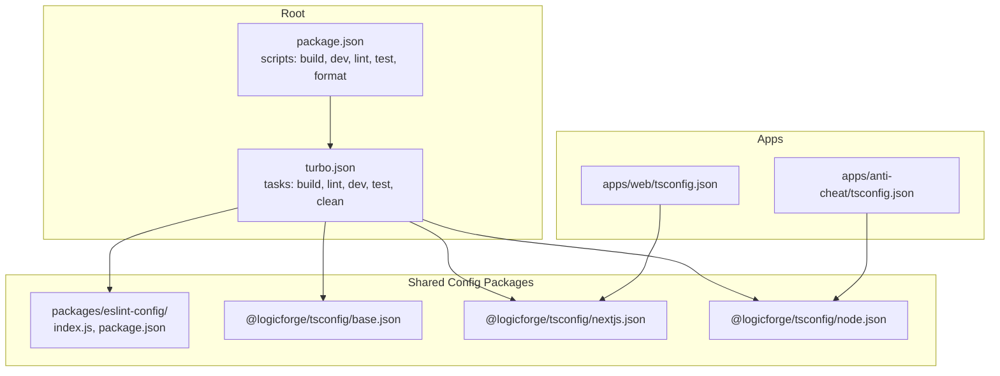
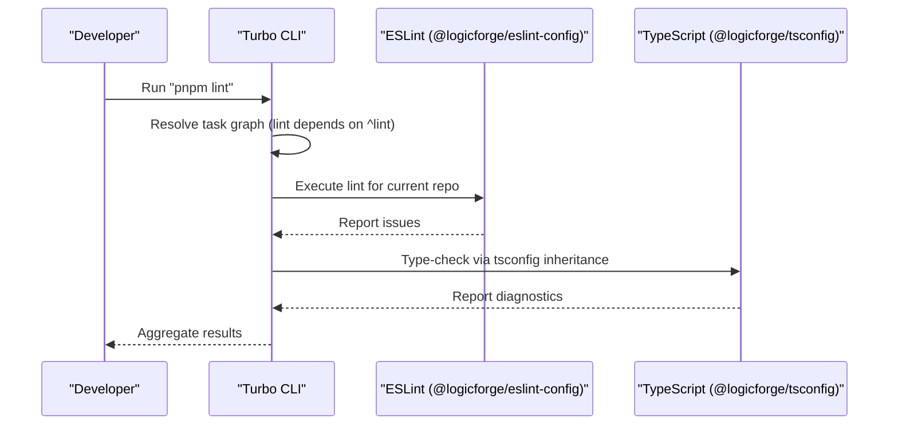
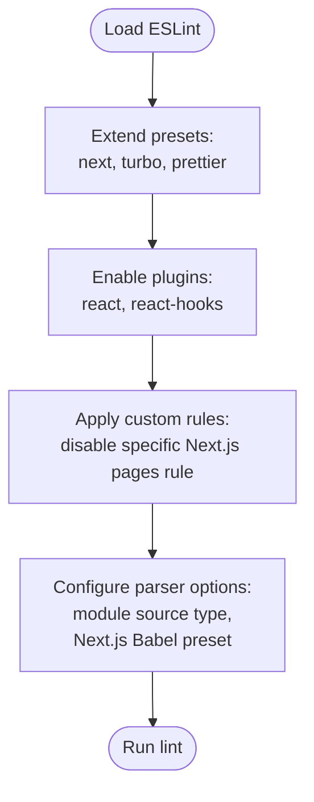
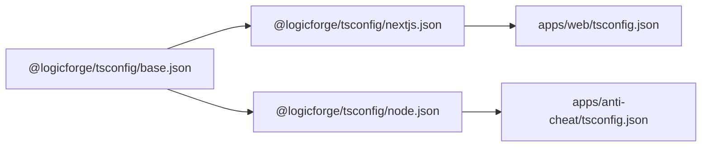
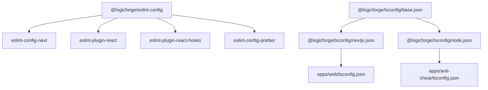

# Code Quality Tools & Standards

<cite>
**Referenced Files in This Document**
- [package.json](file://package.json)
- [turbo.json](file://turbo.json)
- [packages/eslint-config/package.json](file://packages/eslint-config/package.json)
- [packages/eslint-config/index.js](file://packages/eslint-config/index.js)
- [packages/tsconfig/base.json](file://packages/tsconfig/base.json)
- [packages/tsconfig/nextjs.json](file://packages/tsconfig/nextjs.json)
- [packages/tsconfig/node.json](file://packages/tsconfig/node.json)
- [apps/web/tsconfig.json](file://apps/web/tsconfig.json)
- [apps/anti-cheat/tsconfig.json](file://apps/anti-cheat/tsconfig.json)
- [.github/workflows/ci.yml](file://.github/workflows/ci.yml)
</cite>

## Table of Contents
1. [Introduction](#introduction)
2. [Project Structure](#project-structure)
3. [Core Components](#core-components)
4. [Architecture Overview](#architecture-overview)
5. [Detailed Component Analysis](#detailed-component-analysis)
6. [Dependency Analysis](#dependency-analysis)
7. [Performance Considerations](#performance-considerations)
8. [Troubleshooting Guide](#troubleshooting-guide)
9. [Conclusion](#conclusion)
10. [Appendices](#appendices)

## Introduction
This document defines the code quality tooling and standards for the Logic Forge monorepo. It covers the shared ESLint configuration, TypeScript configuration hierarchy, formatting and import strategies, and CI enforcement. It also provides guidance for extending configurations, adding new rules, and integrating with IDEs and pre-commit hooks.

## Project Structure
The monorepo centralizes code quality via two shared packages:
- @logicforge/eslint-config: Shared ESLint configuration and plugins.
- @logicforge/tsconfig: Shared TypeScript configurations for Next.js and Node.js environments.

Build orchestration and linting are coordinated via Turbo tasks.

**Diagram sources**
- [package.json](file://package.json#L1-L22)
- [turbo.json](file://turbo.json#L1-L45)
- [packages/eslint-config/package.json](file://packages/eslint-config/package.json#L1-L14)
- [packages/eslint-config/index.js](file://packages/eslint-config/index.js#L1-L12)
- [packages/tsconfig/base.json](file://packages/tsconfig/base.json#L1-L22)
- [packages/tsconfig/nextjs.json](file://packages/tsconfig/nextjs.json#L1-L17)
- [packages/tsconfig/node.json](file://packages/tsconfig/node.json#L1-L11)
- [apps/web/tsconfig.json](file://apps/web/tsconfig.json#L1-L18)
- [apps/anti-cheat/tsconfig.json](file://apps/anti-cheat/tsconfig.json#L1-L9)

**Section sources**
- [package.json](file://package.json#L1-L22)
- [turbo.json](file://turbo.json#L1-L45)
- [packages/eslint-config/package.json](file://packages/eslint-config/package.json#L1-L14)
- [packages/eslint-config/index.js](file://packages/eslint-config/index.js#L1-L12)
- [packages/tsconfig/base.json](file://packages/tsconfig/base.json#L1-L22)
- [packages/tsconfig/nextjs.json](file://packages/tsconfig/nextjs.json#L1-L17)
- [packages/tsconfig/node.json](file://packages/tsconfig/node.json#L1-L11)
- [apps/web/tsconfig.json](file://apps/web/tsconfig.json#L1-L18)
- [apps/anti-cheat/tsconfig.json](file://apps/anti-cheat/tsconfig.json#L1-L9)

## Core Components
- Shared ESLint configuration
  - Extends recommended presets for Next.js, Turbo workspaces, and Prettier.
  - Includes a small set of custom rules and parser options.
  - Provides a single source of truth for linting across services.

- Shared TypeScript configurations
  - Base: strict defaults, modern target/module, bundler module resolution, and library-friendly declarations.
  - Next.js: extends base, enables JSX preservation, DOM libs, incremental builds, and JSON module resolution.
  - Node: extends base, sets Node-specific libs and module resolution.

- Linting orchestration
  - Root scripts expose a unified lint command.
  - Turbo tasks define cross-repo lint dependencies and caching behavior.

**Section sources**
- [packages/eslint-config/index.js](file://packages/eslint-config/index.js#L1-L12)
- [packages/eslint-config/package.json](file://packages/eslint-config/package.json#L1-L14)
- [packages/tsconfig/base.json](file://packages/tsconfig/base.json#L1-L22)
- [packages/tsconfig/nextjs.json](file://packages/tsconfig/nextjs.json#L1-L17)
- [packages/tsconfig/node.json](file://packages/tsconfig/node.json#L1-L11)
- [package.json](file://package.json#L4-L11)
- [turbo.json](file://turbo.json#L18-L22)

## Architecture Overview
The linting and type-checking pipeline is orchestrated centrally and applied consistently across applications.

**Diagram sources**
- [package.json](file://package.json#L4-L11)
- [turbo.json](file://turbo.json#L18-L22)
- [packages/eslint-config/index.js](file://packages/eslint-config/index.js#L1-L12)
- [packages/tsconfig/base.json](file://packages/tsconfig/base.json#L1-L22)

## Detailed Component Analysis

### ESLint Configuration
- Presets and plugins
  - Extends Next.js, Turbo, and Prettier presets for consistent formatting and framework-specific rules.
  - Includes React and React Hooks plugins for component best practices.
- Custom rules
  - A single example rule is configured to disable a specific pages rule in Next.js.
- Parser options
  - Uses module source type and Next.js Babel preset for parsing.

**Diagram sources**
- [packages/eslint-config/index.js](file://packages/eslint-config/index.js#L1-L12)

**Section sources**
- [packages/eslint-config/package.json](file://packages/eslint-config/package.json#L7-L13)
- [packages/eslint-config/index.js](file://packages/eslint-config/index.js#L1-L12)

### TypeScript Configuration Strategy
- Base configuration
  - Enforces strict mode and modern JS targets/modules.
  - Uses bundler module resolution and skipLibCheck for faster builds.
- Next.js configuration
  - Extends base and adds JSX preservation, DOM libs, incremental compilation, and JSON module support.
- Node configuration
  - Extends base and sets Node-specific libs and module resolution.
- Application overrides
  - apps/web/tsconfig.json extends Next.js config and defines path aliases to shared packages.
  - apps/anti-cheat/tsconfig.json extends Node config and sets output/input directories.

**Diagram sources**
- [packages/tsconfig/base.json](file://packages/tsconfig/base.json#L1-L22)
- [packages/tsconfig/nextjs.json](file://packages/tsconfig/nextjs.json#L1-L17)
- [packages/tsconfig/node.json](file://packages/tsconfig/node.json#L1-L11)
- [apps/web/tsconfig.json](file://apps/web/tsconfig.json#L1-L18)
- [apps/anti-cheat/tsconfig.json](file://apps/anti-cheat/tsconfig.json#L1-L9)

**Section sources**
- [packages/tsconfig/base.json](file://packages/tsconfig/base.json#L4-L19)
- [packages/tsconfig/nextjs.json](file://packages/tsconfig/nextjs.json#L4-L16)
- [packages/tsconfig/node.json](file://packages/tsconfig/node.json#L4-L10)
- [apps/web/tsconfig.json](file://apps/web/tsconfig.json#L2-L16)
- [apps/anti-cheat/tsconfig.json](file://apps/anti-cheat/tsconfig.json#L2-L8)

### Formatting and Import Ordering
- Formatting
  - Root script exposes a Prettier command to format TypeScript, TypeScript React, and Markdown files.
- Import ordering
  - No centralized import ordering rule is defined in the shared ESLint configuration.
  - Applications may adopt import sorting via additional ESLint plugins if desired.

**Section sources**
- [package.json](file://package.json#L10-L10)

### Naming Conventions
- No centralized naming convention rules are defined in the shared ESLint configuration.
- Teams can introduce naming-convention rules via additional ESLint plugins if needed.

### IDE Integration
- VS Code
  - Install the ESLint extension and enable “ESLint: Run on Save”.
  - Configure the editor to use Prettier as the default formatter.
- TypeScript
  - Open the workspace root so that VS Code resolves tsconfig inheritance from @logicforge/tsconfig.
  - Enable “TypeScript: Enable Prompt When Opening Folder” to ensure the correct tsconfig is applied.

### Continuous Integration and Pre-commit Hooks
- Continuous Integration
  - GitHub Actions workflow orchestrates linting and type-checking as part of CI.
  - The workflow runs the lint task across the monorepo and enforces pass/fail outcomes.
- Pre-commit Hooks
  - Recommended: Integrate linting and formatting checks using a tool like Husky and lint-staged to run Prettier and ESLint on staged files before commits.

**Section sources**
- [.github/workflows/ci.yml](file://.github/workflows/ci.yml)

## Dependency Analysis
- ESLint configuration depends on Next.js, Turbo, and Prettier presets.
- TypeScript configurations depend on each other via extends and are consumed by applications.
- Root scripts and Turbo tasks coordinate linting across the monorepo.

**Diagram sources**
- [packages/eslint-config/package.json](file://packages/eslint-config/package.json#L7-L13)
- [packages/tsconfig/base.json](file://packages/tsconfig/base.json#L1-L22)
- [packages/tsconfig/nextjs.json](file://packages/tsconfig/nextjs.json#L1-L17)
- [packages/tsconfig/node.json](file://packages/tsconfig/node.json#L1-L11)
- [apps/web/tsconfig.json](file://apps/web/tsconfig.json#L1-L18)
- [apps/anti-cheat/tsconfig.json](file://apps/anti-cheat/tsconfig.json#L1-L9)

**Section sources**
- [packages/eslint-config/package.json](file://packages/eslint-config/package.json#L7-L13)
- [turbo.json](file://turbo.json#L18-L22)

## Performance Considerations
- Use incremental builds in Next.js configuration to speed up rebuilds.
- Keep skipLibCheck enabled in base tsconfig to reduce type-check overhead.
- Prefer bundler module resolution for faster module discovery.
- Run linting and formatting in parallel via Turbo to minimize CI time.

## Troubleshooting Guide
- Lint fails locally but passes in CI
  - Ensure local Node and package manager versions match CI.
  - Reinstall dependencies and re-run the lint task.
- TypeScript diagnostics differ across editors
  - Verify the editor is using the workspace root tsconfig and that the correct tsconfig is being resolved.
- ESLint rule conflicts with Prettier
  - Confirm the Prettier integration is active and that conflicting rules are disabled in the shared configuration.

## Conclusion
The monorepo’s code quality tooling is centralized and consistent:
- ESLint is standardized via a shared package with Next.js, Turbo, and Prettier integrations.
- TypeScript configurations are modular and inherited, ensuring uniform strictness and modern targets.
- Linting and formatting are orchestrated by Turbo and root scripts.
Adopting the shared configs and CI workflow ensures predictable, scalable quality across services.

## Appendices

### Appendix A: Extending ESLint Configuration
- Add new rules or override existing ones in the shared index file.
- Introduce additional plugins via the package dependencies and configure them in the index file.
- Keep the extends list minimal to avoid conflicts.

**Section sources**
- [packages/eslint-config/index.js](file://packages/eslint-config/index.js#L1-L12)
- [packages/eslint-config/package.json](file://packages/eslint-config/package.json#L7-L13)

### Appendix B: Extending TypeScript Configurations
- Modify base.json for global strictness and module behavior.
- Adjust nextjs.json or node.json for environment-specific options.
- Apply app-level overrides sparingly; prefer shared configs.

**Section sources**
- [packages/tsconfig/base.json](file://packages/tsconfig/base.json#L4-L19)
- [packages/tsconfig/nextjs.json](file://packages/tsconfig/nextjs.json#L5-L16)
- [packages/tsconfig/node.json](file://packages/tsconfig/node.json#L5-L10)
- [apps/web/tsconfig.json](file://apps/web/tsconfig.json#L3-L16)
- [apps/anti-cheat/tsconfig.json](file://apps/anti-cheat/tsconfig.json#L3-L8)

### Appendix C: CI and Pre-commit Guidance
- CI
  - Use the root lint task to enforce code quality across the monorepo.
- Pre-commit
  - Configure Husky and lint-staged to run Prettier and ESLint on staged files.

**Section sources**
- [.github/workflows/ci.yml](file://.github/workflows/ci.yml)
- [package.json](file://package.json#L10-L10)