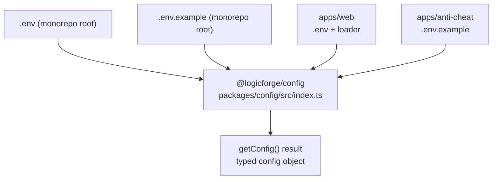
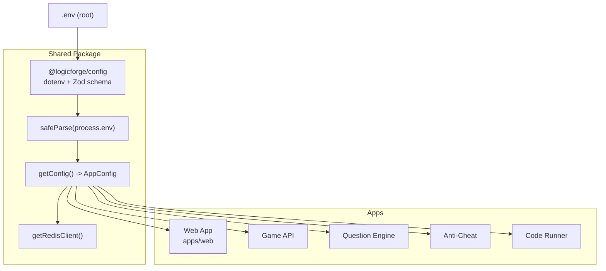
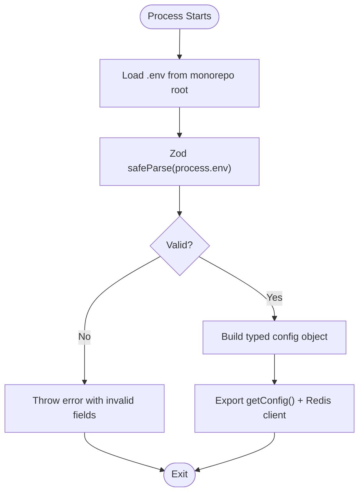
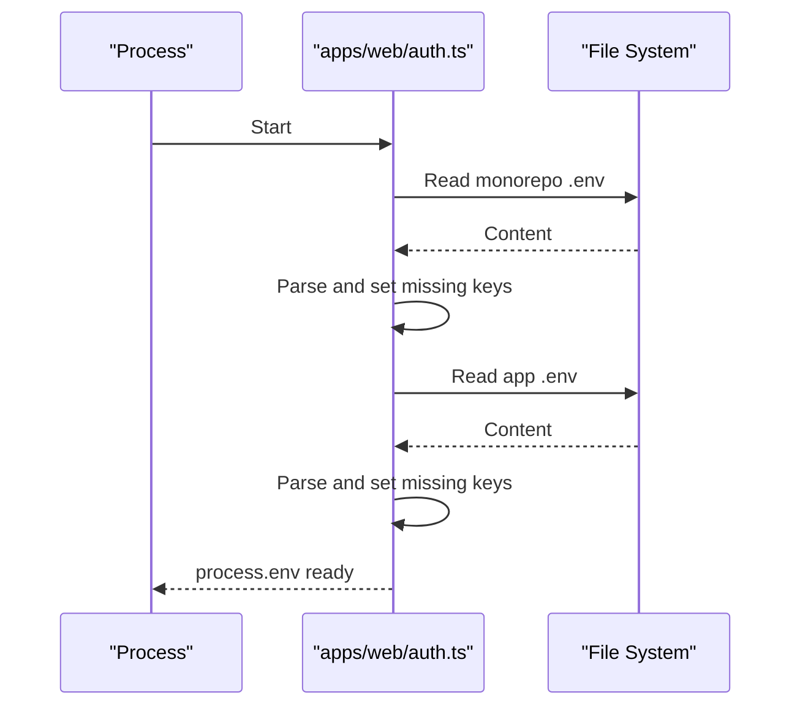
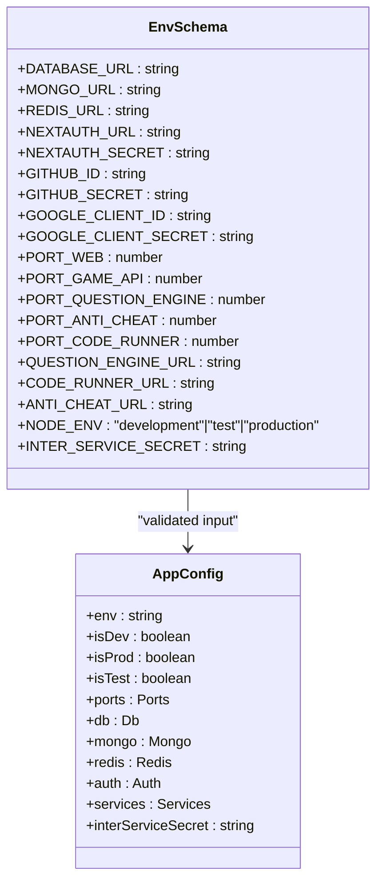
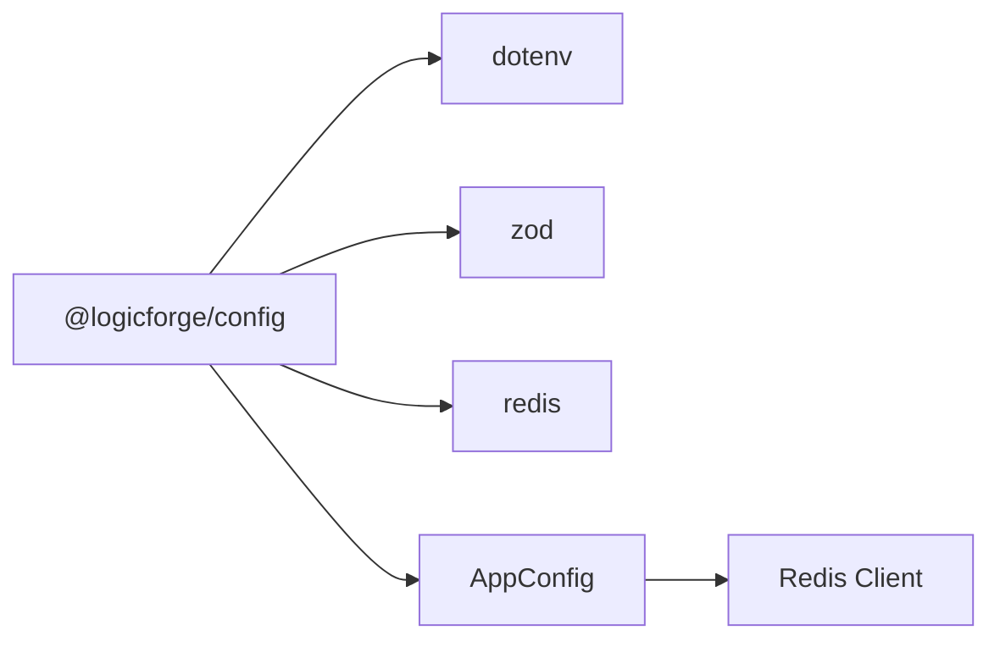

# Configuration Management

<cite>
**Referenced Files in This Document**
- [.env](file://.env)
- [.env.example](file://.env.example)
- [packages/config/src/index.ts](file://packages/config/src/index.ts)
- [packages/config/package.json](file://packages/config/package.json)
- [apps/web/auth.ts](file://apps/web/auth.ts)
- [apps/anti-cheat/.env.example](file://apps/anti-cheat/.env.example)
</cite>

## Table of Contents
1. [Introduction](#introduction)
2. [Project Structure](#project-structure)
3. [Core Components](#core-components)
4. [Architecture Overview](#architecture-overview)
5. [Detailed Component Analysis](#detailed-component-analysis)
6. [Dependency Analysis](#dependency-analysis)
7. [Performance Considerations](#performance-considerations)
8. [Troubleshooting Guide](#troubleshooting-guide)
9. [Conclusion](#conclusion)
10. [Appendices](#appendices)

## Introduction
This document explains the centralized configuration management system used across Logic Forge’s microservices. It covers how environment variables are loaded, validated, and accessed in a type-safe manner, how defaults are applied, and how service-specific overrides work. It also documents the configuration hierarchy, security considerations for sensitive data, and guidance for extending the configuration system while maintaining backward compatibility.

## Project Structure
Logic Forge uses a monorepo with a shared configuration package and per-app environment files. The shared package loads and validates environment variables from the monorepo root and exposes a typed configuration object consumed by all services. Apps like Web and Anti-Cheat also maintain their own local environment examples and loaders.

**Diagram sources**
- [.env](file://.env#L1-L66)
- [.env.example](file://.env.example#L1-L62)
- [packages/config/src/index.ts](file://packages/config/src/index.ts#L1-L143)
- [apps/web/auth.ts](file://apps/web/auth.ts#L1-L35)
- [apps/anti-cheat/.env.example](file://apps/anti-cheat/.env.example#L1-L3)

**Section sources**
- [.env](file://.env#L1-L66)
- [.env.example](file://.env.example#L1-L62)
- [packages/config/src/index.ts](file://packages/config/src/index.ts#L1-L143)
- [apps/web/auth.ts](file://apps/web/auth.ts#L1-L35)
- [apps/anti-cheat/.env.example](file://apps/anti-cheat/.env.example#L1-L3)

## Core Components
- Centralized configuration loader and validator:
  - Loads environment from the monorepo root via a dedicated loader.
  - Validates all variables against a Zod schema with explicit defaults for optional fields.
  - Exposes a single typed configuration object with nested sections for environment, ports, databases, Redis, auth, inter-service URLs, and inter-service secrets.
- Redis client singleton:
  - Lazily creates and connects a Redis client using the configured Redis URL.
  - Emits errors on connection failures and supports graceful shutdown.
- Per-app environment handling:
  - Web app loads environment files from multiple possible locations to support both source and compiled builds.
  - Anti-Cheat app provides a minimal environment example for local development.

Key responsibilities:
- Type-safe access to configuration across services.
- Centralized validation and defaulting.
- Minimal duplication of environment logic across apps.

**Section sources**
- [packages/config/src/index.ts](file://packages/config/src/index.ts#L1-L143)
- [packages/config/package.json](file://packages/config/package.json#L1-L17)
- [apps/web/auth.ts](file://apps/web/auth.ts#L1-L35)
- [apps/anti-cheat/.env.example](file://apps/anti-cheat/.env.example#L1-L3)

## Architecture Overview
The configuration architecture centers on a single shared package that normalizes environment variables into a typed configuration object. Services consume this object rather than reading raw environment variables. Optional per-app environment files can override or supplement the shared configuration.

**Diagram sources**
- [packages/config/src/index.ts](file://packages/config/src/index.ts#L1-L143)
- [.env](file://.env#L1-L66)

## Detailed Component Analysis

### Centralized Configuration Package (@logicforge/config)
Responsibilities:
- Load environment from monorepo root.
- Define a strict Zod schema for all supported variables.
- Provide a typed configuration object with nested sections for:
  - Environment flags (development/test/production).
  - Ports for each service.
  - Database URLs (PostgreSQL, MongoDB).
  - Redis URL.
  - Authentication settings (NextAuth, OAuth clients).
  - Inter-service URLs.
  - Inter-service secret.
- Export a Redis client singleton with error handling and lifecycle management.

Implementation highlights:
- Environment loading uses a fixed path to the monorepo root .env file.
- Validation failure throws an error with field names to aid debugging.
- Redis client is lazily created and connected on first use, with an error listener and a close helper.

**Diagram sources**
- [packages/config/src/index.ts](file://packages/config/src/index.ts#L6-L61)

**Section sources**
- [packages/config/src/index.ts](file://packages/config/src/index.ts#L1-L143)
- [packages/config/package.json](file://packages/config/package.json#L1-L17)

### Web App Environment Loader (apps/web)
Responsibilities:
- Load environment files from multiple possible locations to support both development and production builds.
- Avoid overwriting already-defined environment variables.
- Support quoted values and escaped newlines.

Behavior:
- Reads .env from app root and monorepo root, depending on runtime location.
- Skips comments and malformed lines.
- Preserves existing process.env values.

**Diagram sources**
- [apps/web/auth.ts](file://apps/web/auth.ts#L6-L34)

**Section sources**
- [apps/web/auth.ts](file://apps/web/auth.ts#L1-L35)

### Anti-Cheat App Environment Example (apps/anti-cheat)
Responsibilities:
- Provide a minimal .env.example for local development.
- Define a port and environment mode.
- Supply a Redis URL for local caching or telemetry storage.

**Section sources**
- [apps/anti-cheat/.env.example](file://apps/anti-cheat/.env.example#L1-L3)

### Configuration Schema and Defaults
The shared configuration schema defines required and optional variables with explicit defaults. Required variables cause validation to fail fast if missing. Optional variables receive sensible defaults for local development.

Highlights:
- Required: DATABASE_URL, MONGO_URL, NEXTAUTH_SECRET.
- Optional with defaults: REDIS_URL, OAuth client IDs/secrets, ports, service URLs, NODE_ENV, INTER_SERVICE_SECRET.
- Coercion and types: Numeric ports are coerced to integers; URLs are validated as strings.

**Diagram sources**
- [packages/config/src/index.ts](file://packages/config/src/index.ts#L10-L43)
- [packages/config/src/index.ts](file://packages/config/src/index.ts#L64-L114)

**Section sources**
- [packages/config/src/index.ts](file://packages/config/src/index.ts#L10-L43)
- [packages/config/src/index.ts](file://packages/config/src/index.ts#L64-L114)

## Dependency Analysis
- Internal dependencies:
  - @logicforge/config depends on dotenv, zod, and redis.
  - Redis client is optional and only initialized when requested.
- External integration points:
  - PostgreSQL, MongoDB, and Redis connections are configured via URLs.
  - NextAuth and OAuth providers are configured centrally for the web app.

**Diagram sources**
- [packages/config/package.json](file://packages/config/package.json#L8-L11)
- [packages/config/src/index.ts](file://packages/config/src/index.ts#L119-L135)

**Section sources**
- [packages/config/package.json](file://packages/config/package.json#L1-L17)
- [packages/config/src/index.ts](file://packages/config/src/index.ts#L119-L135)

## Performance Considerations
- Lazy initialization: The Redis client is created on first use, avoiding startup overhead when Redis is unused.
- Single validation pass: Environment variables are parsed once and cached, preventing repeated parsing costs.
- Minimal filesystem reads: The shared package reads .env once at module load; the web app reads its .env only when needed.

[No sources needed since this section provides general guidance]

## Troubleshooting Guide
Common issues and resolutions:
- Validation errors on startup:
  - Cause: Missing required environment variables or invalid values.
  - Resolution: Review the error output to identify missing fields and populate .env accordingly. Ensure URLs are valid and numeric ports are integers.
- Redis connection failures:
  - Cause: Incorrect REDIS_URL or Redis server down.
  - Resolution: Verify REDIS_URL and connectivity; check Redis logs; confirm the client is not prematurely closed.
- Web app environment not picked up:
  - Cause: Running from compiled path (.next) or .env overwritten elsewhere.
  - Resolution: Confirm that auth.ts is loading .env from the expected locations and that no other loader overwrites values.

**Section sources**
- [packages/config/src/index.ts](file://packages/config/src/index.ts#L53-L61)
- [packages/config/src/index.ts](file://packages/config/src/index.ts#L129-L131)
- [apps/web/auth.ts](file://apps/web/auth.ts#L31-L34)

## Conclusion
Logic Forge centralizes configuration through a shared package that enforces type safety, validates inputs, and provides defaults. Apps consume a single typed configuration object, simplifying cross-service consistency. Optional per-app environment files enable local overrides without duplicating validation logic. The system balances developer ergonomics with robustness and security.

[No sources needed since this section summarizes without analyzing specific files]

## Appendices

### Configuration Hierarchy and Overrides
- Monorepo root .env is the authoritative source for shared variables.
- Per-app .env files can override specific keys but should avoid duplicating shared validation logic.
- The web app loader avoids overwriting existing environment variables, enabling layered overrides.

**Section sources**
- [.env](file://.env#L1-L66)
- [.env.example](file://.env.example#L1-L62)
- [apps/web/auth.ts](file://apps/web/auth.ts#L15-L16)

### Type-Safe Access Patterns
- Import the configuration object from the shared package.
- Access nested sections (e.g., ports, db, auth) directly from the returned object.
- Use environment flags (isDev/isProd/isTest) for conditional logic.

**Section sources**
- [packages/config/src/index.ts](file://packages/config/src/index.ts#L64-L114)

### Security Considerations
- Sensitive values (e.g., secrets, tokens) are validated and stored in environment variables.
- The inter-service secret is configurable and defaults to a development value; ensure it is changed in non-development environments.
- OAuth client secrets are optional in development but should be provided in production.

**Section sources**
- [packages/config/src/index.ts](file://packages/config/src/index.ts#L16-L24)
- [packages/config/src/index.ts](file://packages/config/src/index.ts#L42-L42)
- [.env](file://.env#L26-L30)
- [.env](file://.env#L52-L53)

### Adding New Configuration Options
Steps:
- Extend the Zod schema with the new variable(s) and appropriate defaults or requirements.
- Add a typed accessor in the configuration object.
- Document the new option in .env.example and explain its purpose and defaults.
- Ensure backward compatibility by providing a default and avoiding breaking changes to existing keys.
- Test validation and type inference in a local environment.

**Section sources**
- [packages/config/src/index.ts](file://packages/config/src/index.ts#L10-L43)
- [packages/config/src/index.ts](file://packages/config/src/index.ts#L64-L114)
- [.env.example](file://.env.example#L1-L62)

### Examples of Service-Specific Configuration
- Ports: Access via the ports section of the configuration object.
- Database connections: Use db.url for PostgreSQL and mongo.url for MongoDB.
- External service integrations: Use services.<service>Url for inter-service endpoints.
- Authentication: Configure NextAuth and OAuth providers via the auth section.

**Section sources**
- [packages/config/src/index.ts](file://packages/config/src/index.ts#L73-L110)
- [.env](file://.env#L6-L9)
- [.env](file://.env#L18-L30)
- [.env](file://.env#L47-L50)

### Configuration Hot-Reloading
- Not implemented in the current system.
- Recommended approach: Reinitialize services after reloading environment variables and reconnecting clients (e.g., Redis) when changes occur.

[No sources needed since this section provides general guidance]