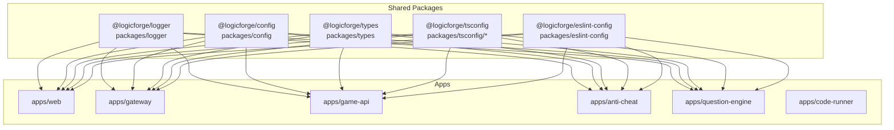
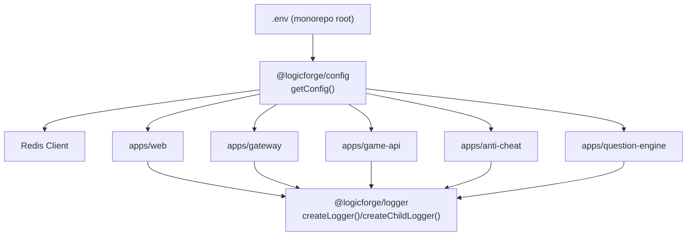
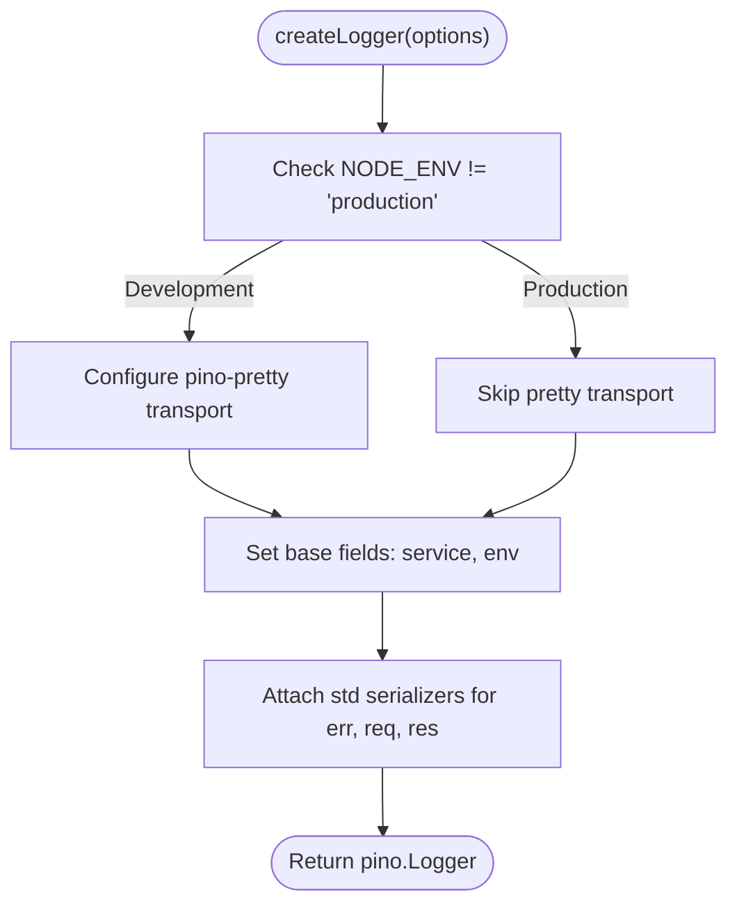
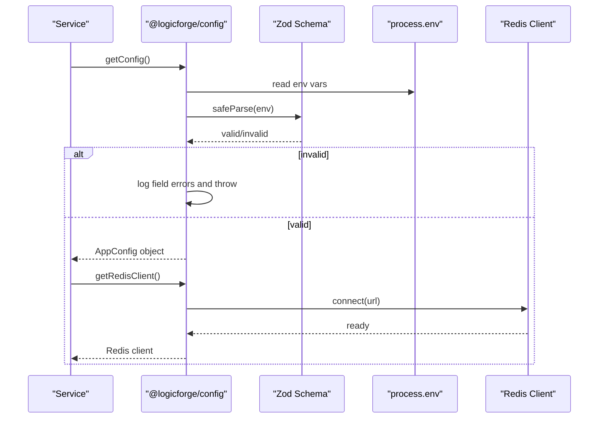
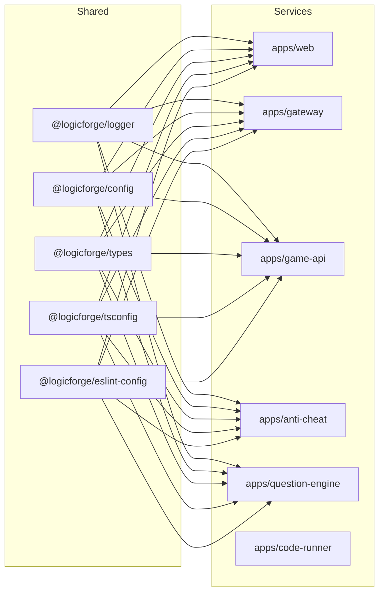

# Development Tools & Utilities

<cite>
**Referenced Files in This Document**
- [packages/logger/src/index.ts](file://packages/logger/src/index.ts)
- [packages/eslint-config/index.js](file://packages/eslint-config/index.js)
- [packages/tsconfig/base.json](file://packages/tsconfig/base.json)
- [packages/tsconfig/nextjs.json](file://packages/tsconfig/nextjs.json)
- [packages/tsconfig/node.json](file://packages/tsconfig/node.json)
- [packages/types/src/index.ts](file://packages/types/src/index.ts)
- [packages/types/src/session.ts](file://packages/types/src/session.ts)
- [packages/types/src/challenge.ts](file://packages/types/src/challenge.ts)
- [packages/types/src/submission.ts](file://packages/types/src/submission.ts)
- [packages/types/src/websocket.ts](file://packages/types/src/websocket.ts)
- [packages/types/src/anti-cheat.ts](file://packages/types/src/anti-cheat.ts)
- [packages/types/src/api-responses.ts](file://packages/types/src/api-responses.ts)
- [packages/types/src/story.ts](file://packages/types/src/story.ts)
- [packages/config/src/index.ts](file://packages/config/src/index.ts)
- [apps/web/package.json](file://apps/web/package.json)
- [apps/gateway/package.json](file://apps/gateway/package.json)
- [apps/game-api/package.json](file://apps/game-api/package.json)
- [apps/anti-cheat/package.json](file://apps/anti-cheat/package.json)
- [apps/question-engine/package.json](file://apps/question-engine/package.json)
- [apps/code-runner/go.mod](file://apps/code-runner/go.mod)
- [apps/code-runner/go.sum](file://apps/code-runner/go.sum)
- [apps/code-runner/cmd/server/main.go](file://apps/code-runner/cmd/server/main.go)
- [apps/code-runner/internal/.gitkeep](file://apps/code-runner/internal/.gitkeep)
- [apps/code-runner/languages/cpp.go](file://apps/code-runner/languages/cpp.go)
- [apps/code-runner/languages/java.go](file://apps/code-runner/languages/java.go)
- [apps/code-runner/languages/python.go](file://apps/code-runner/languages/python.go)
- [apps/code-runner/languages/strategy.go](file://apps/code-runner/languages/strategy.go)
- [apps/code-runner/sandbox/runner.go](file://apps/code-runner/sandbox/runner.go)
- [apps/code-runner/executor/pipeline.go](file://apps/code-runner/executor/pipeline.go)
- [apps/gateway/src/logger.ts](file://apps/gateway/src/logger.ts)
- [apps/gateway/src/middleware/logger.ts](file://apps/gateway/src/middleware/logger.ts)
- [apps/gateway/src/middleware/auth.ts](file://apps/gateway/src/middleware/auth.ts)
- [apps/gateway/src/middleware/rate-limit.ts](file://apps/gateway/src/middleware/rate-limit.ts)
- [apps/gateway/src/proxy.ts](file://apps/gateway/src/proxy.ts)
- [apps/gateway/src/redis.ts](file://apps/gateway/src/redis.ts)
- [apps/web/lib/utils.ts](file://apps/web/lib/utils.ts)
- [apps/web/hooks/use-toast.ts](file://apps/web/hooks/use-toast.ts)
- [apps/web/hooks/use-telemetry.ts](file://apps/web/hooks/use-telemetry.ts)
- [apps/web/next.config.mjs](file://apps/web/next.config.mjs)
- [apps/web/postcss.config.mjs](file://apps/web/postcss.config.mjs)
- [apps/web/components.json](file://apps/web/components.json)
- [apps/web/middleware.ts](file://apps/web/middleware.ts)
- [apps/web/auth.config.ts](file://apps/web/auth.config.ts)
- [apps/web/auth.ts](file://apps/web/auth.ts)
- [apps/web/tsconfig.json](file://apps/web/tsconfig.json)
- [apps/game-api/src/app.ts](file://apps/game-api/src/app.ts)
- [apps/game-api/src/index.ts](file://apps/game-api/src/index.ts)
- [apps/anti-cheat/src/index.ts](file://apps/anti-cheat/src/index.ts)
- [apps/question-engine/src/index.ts](file://apps/question-engine/src/index.ts)
- [apps/web/app/layout.tsx](file://apps/web/app/layout.tsx)
- [apps/web/app/page.tsx](file://apps/web/app/page.tsx)
- [apps/web/app/(auth)/login/page.tsx](file://apps/web/app/(auth)/login/page.tsx)
- [apps/web/app/api/auth/[...nextauth]/route.ts](file://apps/web/app/api/auth/[...nextauth]/route.ts)
- [apps/web/app/api/profile/route.ts](file://apps/web/app/api/profile/route.ts)
- [apps/web/app/api/story/chat/route.ts](file://apps/web/app/api/story/chat/route.ts)
- [apps/web/store/game-store.ts](file://apps/web/store/game-store.ts)
- [apps/web/store/anti-cheat-store.ts](file://apps/web/store/anti-cheat-store.ts)
- [apps/web/store/story-store.ts](file://apps/web/store/story-store.ts)
- [apps/web/contexts/audio-manager-context.tsx](file://apps/web/contexts/audio-manager-context.tsx)
- [apps/web/contexts/narration-context.tsx](file://apps/web/contexts/narration-context.tsx)
- [apps/web/hooks/use-audio-manager.ts](file://apps/web/hooks/use-audio-manager.ts)
- [apps/web/hooks/use-game-engine.ts](file://apps/web/hooks/use-game-engine.ts)
- [apps/web/hooks/use-mobile.tsx](file://apps/web/hooks/use-mobile.tsx)
- [apps/web/hooks/use-toast.ts](file://apps/web/hooks/use-toast.ts)
- [apps/web/hooks/useClickSound.ts](file://apps/web/hooks/useClickSound.ts)
- [apps/web/hooks/useMicroInteractions.ts](file://apps/web/hooks/useMicroInteractions.ts)
- [apps/web/components/ui/index.ts](file://apps/web/components/ui/index.ts)
- [apps/web/components/ui/button.tsx](file://apps/web/components/ui/button.tsx)
- [apps/web/components/ui/input.tsx](file://apps/web/components/ui/input.tsx)
- [apps/web/components/ui/dialog.tsx](file://apps/web/components/ui/dialog.tsx)
- [apps/web/components/ui/select.tsx](file://apps/web/components/ui/select.tsx)
- [apps/web/components/ui/textarea.tsx](file://apps/web/components/ui/textarea.tsx)
- [apps/web/components/ui/toaster.tsx](file://apps/web/components/ui/toaster.tsx)
- [apps/web/components/ui/tooltip.tsx](file://apps/web/components/ui/tooltip.tsx)
- [apps/web/components/ui/sonner.tsx](file://apps/web/components/ui/sonner.tsx)
- [apps/web/lib/character-config.ts](file://apps/web/lib/character-config.ts)
- [apps/web/lib/story-data.ts](file://apps/web/lib/story-data.ts)
- [apps/web/lib/story-zones/.gitkeep](file://apps/web/lib/story-zones/.gitkeep)
- [apps/web/public/favicon.svg](file://apps/web/public/favicon.svg)
- [apps/web/styles/story-theme.css](file://apps/web/styles/story-theme.css)
- [apps/web/workers/.gitkeep](file://apps/web/workers/.gitkeep)
- [apps/web/Dockerfile](file://apps/web/Dockerfile)
- [apps/gateway/Dockerfile](file://apps/gateway/Dockerfile)
- [apps/game-api/Dockerfile](file://apps/game-api/Dockerfile)
- [apps/anti-cheat/Dockerfile](file://apps/anti-cheat/Dockerfile)
- [apps/question-engine/Dockerfile](file://apps/question-engine/Dockerfile)
- [apps/code-runner/Dockerfile](file://apps/code-runner/Dockerfile)
- [apps/web/.env](file://apps/web/.env)
- [apps/web/.env.example](file://apps/web/.env.example)
- [apps/gateway/.env.example](file://apps/gateway/.env.example)
- [apps/game-api/.env.example](file://apps/game-api/.env.example)
- [apps/anti-cheat/.env.example](file://apps/anti-cheat/.env.example)
- [apps/question-engine/.env.example](file://apps/question-engine/.env.example)
- [Makefile](file://Makefile)
- [package.json](file://package.json)
- [pnpm-workspace.yaml](file://pnpm-workspace.yaml)
- [turbo.json](file://turbo.json)
- [.github/workflows/ci.yml](file://.github/workflows/ci.yml)
- [.github/workflows/deploy.yml](file://.github/workflows/deploy.yml)
- [DEBUGGING_GUIDE.md](file://DEBUGGING_GUIDE.md)
</cite>

## Table of Contents
1. [Introduction](#introduction)
2. [Project Structure](#project-structure)
3. [Core Components](#core-components)
4. [Architecture Overview](#architecture-overview)
5. [Detailed Component Analysis](#detailed-component-analysis)
6. [Dependency Analysis](#dependency-analysis)
7. [Performance Considerations](#performance-considerations)
8. [Troubleshooting Guide](#troubleshooting-guide)
9. [Conclusion](#conclusion)
10. [Appendices](#appendices)

## Introduction
This document describes the shared development tools and utilities that power the Logic Forge monorepo. It focuses on:
- The logging system with structured logging, log levels, and centralized configuration
- The configuration management system for shared settings across services
- Type definitions and interfaces ensuring type safety and developer experience
- ESLint and TypeScript configurations for consistent code quality
- Utility functions, helper modules, and shared constants
- Examples of logging usage, configuration patterns, and type definition implementation
- Development workflow optimization, code generation tools, and maintenance of shared utilities

## Project Structure
The monorepo uses Turborepo and pnpm workspaces. Shared packages under packages/ provide reusable tools and types:
- @logicforge/logger: Structured logging with pino
- @logicforge/config: Centralized environment validation and configuration retrieval
- @logicforge/tsconfig: Shared TypeScript configurations
- @logicforge/eslint-config: Shared ESLint configuration
- @logicforge/types: Barrel exports of shared type definitions

**Diagram sources**
- [packages/logger/src/index.ts](file://packages/logger/src/index.ts#L1-L66)
- [packages/config/src/index.ts](file://packages/config/src/index.ts#L1-L143)
- [packages/tsconfig/base.json](file://packages/tsconfig/base.json#L1-L22)
- [packages/eslint-config/index.js](file://packages/eslint-config/index.js#L1-L12)
- [packages/types/src/index.ts](file://packages/types/src/index.ts#L1-L11)

**Section sources**
- [pnpm-workspace.yaml](file://pnpm-workspace.yaml)
- [turbo.json](file://turbo.json)
- [package.json](file://package.json)

## Core Components
- Logging: Centralized logger factory with service identity, pretty printing in development, and standardized serializers.
- Configuration: Zod-based environment validation and a typed configuration getter with Redis client singleton.
- TypeScript configs: Base, Next.js, and Node configurations for strictness and module resolution.
- ESLint config: Shared lint rules extending Next.js, Turbo, and Prettier.
- Types: Barrel export of session, challenge, submission, websocket, anti-cheat, API responses, and story types.

**Section sources**
- [packages/logger/src/index.ts](file://packages/logger/src/index.ts#L1-L66)
- [packages/config/src/index.ts](file://packages/config/src/index.ts#L1-L143)
- [packages/tsconfig/base.json](file://packages/tsconfig/base.json#L1-L22)
- [packages/tsconfig/nextjs.json](file://packages/tsconfig/nextjs.json)
- [packages/tsconfig/node.json](file://packages/tsconfig/node.json)
- [packages/eslint-config/index.js](file://packages/eslint-config/index.js#L1-L12)
- [packages/types/src/index.ts](file://packages/types/src/index.ts#L1-L11)

## Architecture Overview
The logging and configuration utilities are consumed by all services. The configuration package loads environment variables from the monorepo root and exposes a strongly-typed configuration object. Services create loggers with service identity and optional child loggers for request-scoped context.

**Diagram sources**
- [packages/config/src/index.ts](file://packages/config/src/index.ts#L6-L61)
- [packages/config/src/index.ts](file://packages/config/src/index.ts#L118-L142)
- [packages/logger/src/index.ts](file://packages/logger/src/index.ts#L19-L61)

## Detailed Component Analysis

### Logging System
The logging package provides:
- Logger creation with service identity and dynamic log level based on environment
- Pretty-printing in development, JSON in production
- Default base fields (service, environment)
- Standardized serializers for errors, requests, and responses
- Child logger creation for request-scoped context

Key implementation patterns:
- Factory function for logger creation
- Optional pretty transport in development
- Base metadata injection
- Re-export of pino types for convenience

Usage examples (paths only):
- Creating a logger for a service: [packages/logger/src/index.ts](file://packages/logger/src/index.ts#L19-L50)
- Creating a child logger with bindings: [packages/logger/src/index.ts](file://packages/logger/src/index.ts#L56-L61)

**Diagram sources**
- [packages/logger/src/index.ts](file://packages/logger/src/index.ts#L19-L50)

**Section sources**
- [packages/logger/src/index.ts](file://packages/logger/src/index.ts#L1-L66)

### Configuration Management
The configuration package:
- Loads environment from the monorepo root .env
- Validates environment variables with Zod
- Exposes a typed configuration object with nested sections (env, ports, db, mongo, redis, auth, services, interServiceSecret)
- Provides a Redis client singleton with error handling and lifecycle management

Key implementation patterns:
- Dotenv loading from root
- Zod schema composition for environment variables
- Safe parsing with error flattening and early exit on failure
- Memoized configuration getter
- Redis client singleton with event handling and graceful disconnect

**Diagram sources**
- [packages/config/src/index.ts](file://packages/config/src/index.ts#L48-L61)
- [packages/config/src/index.ts](file://packages/config/src/index.ts#L118-L142)

**Section sources**
- [packages/config/src/index.ts](file://packages/config/src/index.ts#L1-L143)

### Type Definitions and Interfaces
The types package provides a barrel export of shared domain types:
- Session types
- Challenge types
- Submission types
- WebSocket types
- Anti-cheat types
- API response types
- Story types

This ensures consistent type definitions across services and reduces duplication.

**Section sources**
- [packages/types/src/index.ts](file://packages/types/src/index.ts#L1-L11)
- [packages/types/src/session.ts](file://packages/types/src/session.ts)
- [packages/types/src/challenge.ts](file://packages/types/src/challenge.ts)
- [packages/types/src/submission.ts](file://packages/types/src/submission.ts)
- [packages/types/src/websocket.ts](file://packages/types/src/websocket.ts)
- [packages/types/src/anti-cheat.ts](file://packages/types/src/anti-cheat.ts)
- [packages/types/src/api-responses.ts](file://packages/types/src/api-responses.ts)
- [packages/types/src/story.ts](file://packages/types/src/story.ts)

### ESLint Configuration
The shared ESLint configuration extends:
- Next.js recommended rules
- Turbo preset
- Prettier formatting rules
- Custom parser options for Babel/Next

This ensures consistent linting across all services.

**Section sources**
- [packages/eslint-config/index.js](file://packages/eslint-config/index.js#L1-L12)

### TypeScript Configuration
Shared TS configs:
- base.json: Strict compiler options, ES target, bundler module resolution, declaration generation
- nextjs.json: Extends base for Next.js projects
- node.json: Extends base for Node.js projects

These configs enforce consistency and improve DX across the monorepo.

**Section sources**
- [packages/tsconfig/base.json](file://packages/tsconfig/base.json#L1-L22)
- [packages/tsconfig/nextjs.json](file://packages/tsconfig/nextjs.json)
- [packages/tsconfig/node.json](file://packages/tsconfig/node.json)

### Utility Functions and Helpers
Utilities across apps include:
- Frontend helpers: UI components, hooks, stores, contexts, and shared libraries
- Web app utilities: character configuration, story data, and theme
- Middleware and routing: Next.js middleware, API routes, and auth integrations
- Dockerfiles for containerization

Examples (paths only):
- UI components and exports: [apps/web/components/ui/index.ts](file://apps/web/components/ui/index.ts)
- Button component: [apps/web/components/ui/button.tsx](file://apps/web/components/ui/button.tsx)
- Input component: [apps/web/components/ui/input.tsx](file://apps/web/components/ui/input.tsx)
- Dialog component: [apps/web/components/ui/dialog.tsx](file://apps/web/components/ui/dialog.tsx)
- Select component: [apps/web/components/ui/select.tsx](file://apps/web/components/ui/select.tsx)
- Textarea component: [apps/web/components/ui/textarea.tsx](file://apps/web/components/ui/textarea.tsx)
- Toaster component: [apps/web/components/ui/toaster.tsx](file://apps/web/components/ui/toaster.tsx)
- Tooltip component: [apps/web/components/ui/tooltip.tsx](file://apps/web/components/ui/tooltip.tsx)
- Sonner toast provider: [apps/web/components/ui/sonner.tsx](file://apps/web/components/ui/sonner.tsx)
- Utility functions: [apps/web/lib/utils.ts](file://apps/web/lib/utils.ts)
- Audio manager context: [apps/web/contexts/audio-manager-context.tsx](file://apps/web/contexts/audio-manager-context.tsx)
- Narration context: [apps/web/contexts/narration-context.tsx](file://apps/web/contexts/narration-context.tsx)
- Hooks: [apps/web/hooks/use-audio-manager.ts](file://apps/web/hooks/use-audio-manager.ts), [apps/web/hooks/use-game-engine.ts](file://apps/web/hooks/use-game-engine.ts), [apps/web/hooks/use-mobile.tsx](file://apps/web/hooks/use-mobile.tsx), [apps/web/hooks/use-toast.ts](file://apps/web/hooks/use-toast.ts), [apps/web/hooks/use-telemetry.ts](file://apps/web/hooks/use-telemetry.ts), [apps/web/hooks/useClickSound.ts](file://apps/web/hooks/useClickSound.ts), [apps/web/hooks/useMicroInteractions.ts](file://apps/web/hooks/useMicroInteractions.ts)
- Stores: [apps/web/store/game-store.ts](file://apps/web/store/game-store.ts), [apps/web/store/anti-cheat-store.ts](file://apps/web/store/anti-cheat-store.ts), [apps/web/store/story-store.ts](file://apps/web/store/story-store.ts)
- Character configuration: [apps/web/lib/character-config.ts](file://apps/web/lib/character-config.ts)
- Story data: [apps/web/lib/story-data.ts](file://apps/web/lib/story-data.ts)
- Next.js config: [apps/web/next.config.mjs](file://apps/web/next.config.mjs)
- PostCSS config: [apps/web/postcss.config.mjs](file://apps/web/postcss.config.mjs)
- Components registry: [apps/web/components.json](file://apps/web/components.json)
- Middleware: [apps/web/middleware.ts](file://apps/web/middleware.ts)
- Auth config: [apps/web/auth.config.ts](file://apps/web/auth.config.ts)
- Auth integration: [apps/web/auth.ts](file://apps/web/auth.ts)
- Dockerfile: [apps/web/Dockerfile](file://apps/web/Dockerfile)

**Section sources**
- [apps/web/components/ui/index.ts](file://apps/web/components/ui/index.ts)
- [apps/web/lib/utils.ts](file://apps/web/lib/utils.ts)
- [apps/web/contexts/audio-manager-context.tsx](file://apps/web/contexts/audio-manager-context.tsx)
- [apps/web/contexts/narration-context.tsx](file://apps/web/contexts/narration-context.tsx)
- [apps/web/hooks/use-audio-manager.ts](file://apps/web/hooks/use-audio-manager.ts)
- [apps/web/hooks/use-game-engine.ts](file://apps/web/hooks/use-game-engine.ts)
- [apps/web/hooks/use-mobile.tsx](file://apps/web/hooks/use-mobile.tsx)
- [apps/web/hooks/use-toast.ts](file://apps/web/hooks/use-toast.ts)
- [apps/web/hooks/use-telemetry.ts](file://apps/web/hooks/use-telemetry.ts)
- [apps/web/hooks/useClickSound.ts](file://apps/web/hooks/useClickSound.ts)
- [apps/web/hooks/useMicroInteractions.ts](file://apps/web/hooks/useMicroInteractions.ts)
- [apps/web/store/game-store.ts](file://apps/web/store/game-store.ts)
- [apps/web/store/anti-cheat-store.ts](file://apps/web/store/anti-cheat-store.ts)
- [apps/web/store/story-store.ts](file://apps/web/store/story-store.ts)
- [apps/web/lib/character-config.ts](file://apps/web/lib/character-config.ts)
- [apps/web/lib/story-data.ts](file://apps/web/lib/story-data.ts)
- [apps/web/next.config.mjs](file://apps/web/next.config.mjs)
- [apps/web/postcss.config.mjs](file://apps/web/postcss.config.mjs)
- [apps/web/components.json](file://apps/web/components.json)
- [apps/web/middleware.ts](file://apps/web/middleware.ts)
- [apps/web/auth.config.ts](file://apps/web/auth.config.ts)
- [apps/web/auth.ts](file://apps/web/auth.ts)
- [apps/web/Dockerfile](file://apps/web/Dockerfile)

### Gateway Logging and Middleware
The gateway demonstrates practical usage of logging and middleware:
- Dedicated logger module
- Request logging middleware
- Authentication and rate-limiting middleware
- Proxy and Redis utilities

Examples (paths only):
- Logger module: [apps/gateway/src/logger.ts](file://apps/gateway/src/logger.ts)
- Request logging middleware: [apps/gateway/src/middleware/logger.ts](file://apps/gateway/src/middleware/logger.ts)
- Authentication middleware: [apps/gateway/src/middleware/auth.ts](file://apps/gateway/src/middleware/auth.ts)
- Rate limiting middleware: [apps/gateway/src/middleware/rate-limit.ts](file://apps/gateway/src/middleware/rate-limit.ts)
- Proxy logic: [apps/gateway/src/proxy.ts](file://apps/gateway/src/proxy.ts)
- Redis utilities: [apps/gateway/src/redis.ts](file://apps/gateway/src/redis.ts)

**Section sources**
- [apps/gateway/src/logger.ts](file://apps/gateway/src/logger.ts)
- [apps/gateway/src/middleware/logger.ts](file://apps/gateway/src/middleware/logger.ts)
- [apps/gateway/src/middleware/auth.ts](file://apps/gateway/src/middleware/auth.ts)
- [apps/gateway/src/middleware/rate-limit.ts](file://apps/gateway/src/middleware/rate-limit.ts)
- [apps/gateway/src/proxy.ts](file://apps/gateway/src/proxy.ts)
- [apps/gateway/src/redis.ts](file://apps/gateway/src/redis.ts)

### Code Runner Utilities (Go)
The code runner service includes language support and sandboxing utilities:
- Language strategies (C++, Java, Python)
- Sandbox runner and executor pipeline

Examples (paths only):
- C++ language support: [apps/code-runner/languages/cpp.go](file://apps/code-runner/languages/cpp.go)
- Java language support: [apps/code-runner/languages/java.go](file://apps/code-runner/languages/java.go)
- Python language support: [apps/code-runner/languages/python.go](file://apps/code-runner/languages/python.go)
- Strategy interface: [apps/code-runner/languages/strategy.go](file://apps/code-runner/languages/strategy.go)
- Sandbox runner: [apps/code-runner/sandbox/runner.go](file://apps/code-runner/sandbox/runner.go)
- Executor pipeline: [apps/code-runner/executor/pipeline.go](file://apps/code-runner/executor/pipeline.go)
- Main entrypoint: [apps/code-runner/cmd/server/main.go](file://apps/code-runner/cmd/server/main.go)
- Go module: [apps/code-runner/go.mod](file://apps/code-runner/go.mod)
- Go sum: [apps/code-runner/go.sum](file://apps/code-runner/go.sum)

**Section sources**
- [apps/code-runner/languages/cpp.go](file://apps/code-runner/languages/cpp.go)
- [apps/code-runner/languages/java.go](file://apps/code-runner/languages/java.go)
- [apps/code-runner/languages/python.go](file://apps/code-runner/languages/python.go)
- [apps/code-runner/languages/strategy.go](file://apps/code-runner/languages/strategy.go)
- [apps/code-runner/sandbox/runner.go](file://apps/code-runner/sandbox/runner.go)
- [apps/code-runner/executor/pipeline.go](file://apps/code-runner/executor/pipeline.go)
- [apps/code-runner/cmd/server/main.go](file://apps/code-runner/cmd/server/main.go)
- [apps/code-runner/go.mod](file://apps/code-runner/go.mod)
- [apps/code-runner/go.sum](file://apps/code-runner/go.sum)

## Dependency Analysis
The shared packages are consumed by all services. The configuration package depends on dotenv and zod, while the logging package depends on pino and pino-pretty in development. The frontend leverages UI components, hooks, and stores.

**Diagram sources**
- [packages/logger/src/index.ts](file://packages/logger/src/index.ts#L1-L66)
- [packages/config/src/index.ts](file://packages/config/src/index.ts#L1-L143)
- [packages/types/src/index.ts](file://packages/types/src/index.ts#L1-L11)
- [packages/tsconfig/base.json](file://packages/tsconfig/base.json#L1-L22)
- [packages/eslint-config/index.js](file://packages/eslint-config/index.js#L1-L12)

**Section sources**
- [apps/web/package.json](file://apps/web/package.json)
- [apps/gateway/package.json](file://apps/gateway/package.json)
- [apps/game-api/package.json](file://apps/game-api/package.json)
- [apps/anti-cheat/package.json](file://apps/anti-cheat/package.json)
- [apps/question-engine/package.json](file://apps/question-engine/package.json)
- [apps/code-runner/go.mod](file://apps/code-runner/go.mod)

## Performance Considerations
- Logging: Use child loggers for request-scoped context to avoid excessive allocations and to keep logs contextual without duplicating base fields.
- Configuration: Memoize parsed environment to avoid repeated validation overhead; reuse the Redis client singleton to prevent connection thrashing.
- TypeScript: Enable strict mode and bundler module resolution to catch issues early and optimize builds.
- ESLint: Keep rules aligned with Next.js and Turbo presets to maintain fast linting across the monorepo.

[No sources needed since this section provides general guidance]

## Troubleshooting Guide
Common issues and resolutions:
- Invalid environment variables: The configuration package throws on validation failure with flattened field errors. Review the console output and fix the offending environment keys.
- Redis connectivity: The Redis client logs errors and reconnects. Ensure the URL is correct and the service is reachable.
- Logging output: In development, pretty-printing is enabled; in production, JSON output is used. Verify NODE_ENV to confirm the expected output format.
- ESLint errors: Align with the shared ESLint configuration and ensure Babel/Next presets are configured correctly.

**Section sources**
- [packages/config/src/index.ts](file://packages/config/src/index.ts#L53-L61)
- [packages/config/src/index.ts](file://packages/config/src/index.ts#L129-L131)
- [packages/logger/src/index.ts](file://packages/logger/src/index.ts#L26-L37)

## Conclusion
The Logic Forge monorepo standardizes development through shared logging, configuration, TypeScript, and ESLint utilities. These packages enable consistent behavior, strong typing, and reliable operations across services. Adopting the provided patterns ensures maintainability and scalability.

[No sources needed since this section summarizes without analyzing specific files]

## Appendices

### Example Patterns and Usage References
- Logging usage pattern: [packages/logger/src/index.ts](file://packages/logger/src/index.ts#L19-L50)
- Child logger usage pattern: [packages/logger/src/index.ts](file://packages/logger/src/index.ts#L56-L61)
- Configuration retrieval pattern: [packages/config/src/index.ts](file://packages/config/src/index.ts#L64-L114)
- Redis client usage pattern: [packages/config/src/index.ts](file://packages/config/src/index.ts#L123-L135)
- TypeScript base configuration: [packages/tsconfig/base.json](file://packages/tsconfig/base.json#L1-L22)
- ESLint configuration: [packages/eslint-config/index.js](file://packages/eslint-config/index.js#L1-L12)
- Types barrel export: [packages/types/src/index.ts](file://packages/types/src/index.ts#L1-L11)

**Section sources**
- [packages/logger/src/index.ts](file://packages/logger/src/index.ts#L1-L66)
- [packages/config/src/index.ts](file://packages/config/src/index.ts#L1-L143)
- [packages/tsconfig/base.json](file://packages/tsconfig/base.json#L1-L22)
- [packages/eslint-config/index.js](file://packages/eslint-config/index.js#L1-L12)
- [packages/types/src/index.ts](file://packages/types/src/index.ts#L1-L11)