# Logging System

<cite>
**Referenced Files in This Document**
- [packages/logger/src/index.ts](file://packages/logger/src/index.ts)
- [packages/logger/package.json](file://packages/logger/package.json)
- [apps/gateway/src/logger.ts](file://apps/gateway/src/logger.ts)
- [apps/gateway/src/middleware/logger.ts](file://apps/gateway/src/middleware/logger.ts)
- [apps/gateway/src/middleware/auth.ts](file://apps/gateway/src/middleware/auth.ts)
- [apps/gateway/src/proxy.ts](file://apps/gateway/src/proxy.ts)
- [apps/gateway/src/redis.ts](file://apps/gateway/src/redis.ts)
- [apps/game-api/src/app.ts](file://apps/game-api/src/app.ts)
- [apps/game-api/src/services/session.service.ts](file://apps/game-api/src/services/session.service.ts)
- [apps/anti-cheat/src/index.ts](file://apps/anti-cheat/src/index.ts)
</cite>

## Table of Contents
1. [Introduction](#introduction)
2. [Project Structure](#project-structure)
3. [Core Components](#core-components)
4. [Architecture Overview](#architecture-overview)
5. [Detailed Component Analysis](#detailed-component-analysis)
6. [Dependency Analysis](#dependency-analysis)
7. [Performance Considerations](#performance-considerations)
8. [Troubleshooting Guide](#troubleshooting-guide)
9. [Conclusion](#conclusion)
10. [Appendices](#appendices)

## Introduction
This document describes the structured logging system in Logic Forge, built on top of Pino. It explains how loggers are created, configured, and used across services, how development and production differ in formatting and verbosity, and how contextual bindings, error serialization, and request/response logging are implemented. Practical usage patterns are demonstrated across the gateway, game API, anti-cheat, and other services.

## Project Structure
The logging system is encapsulated in a reusable package and consumed by multiple applications. The package exports logger factory functions and re-exports Pino types for convenience. Applications import and instantiate loggers per service, and middleware integrates request logging.

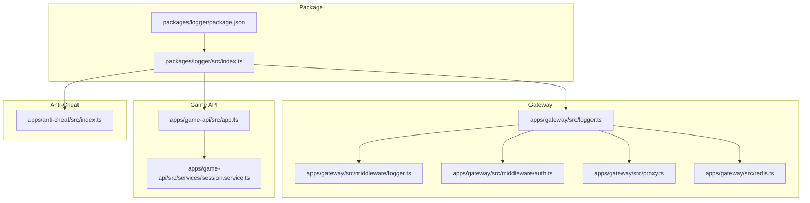

**Diagram sources**
- [packages/logger/src/index.ts](file://packages/logger/src/index.ts#L1-L65)
- [packages/logger/package.json](file://packages/logger/package.json#L1-L16)
- [apps/gateway/src/logger.ts](file://apps/gateway/src/logger.ts#L1-L7)
- [apps/gateway/src/middleware/logger.ts](file://apps/gateway/src/middleware/logger.ts#L1-L25)
- [apps/gateway/src/middleware/auth.ts](file://apps/gateway/src/middleware/auth.ts#L1-L65)
- [apps/gateway/src/proxy.ts](file://apps/gateway/src/proxy.ts#L1-L78)
- [apps/gateway/src/redis.ts](file://apps/gateway/src/redis.ts#L1-L55)
- [apps/game-api/src/app.ts](file://apps/game-api/src/app.ts#L1-L63)
- [apps/game-api/src/services/session.service.ts](file://apps/game-api/src/services/session.service.ts#L1-L167)
- [apps/anti-cheat/src/index.ts](file://apps/anti-cheat/src/index.ts#L1-L35)

**Section sources**
- [packages/logger/src/index.ts](file://packages/logger/src/index.ts#L1-L65)
- [packages/logger/package.json](file://packages/logger/package.json#L1-L16)
- [apps/gateway/src/logger.ts](file://apps/gateway/src/logger.ts#L1-L7)
- [apps/gateway/src/middleware/logger.ts](file://apps/gateway/src/middleware/logger.ts#L1-L25)
- [apps/gateway/src/middleware/auth.ts](file://apps/gateway/src/middleware/auth.ts#L1-L65)
- [apps/gateway/src/proxy.ts](file://apps/gateway/src/proxy.ts#L1-L78)
- [apps/gateway/src/redis.ts](file://apps/gateway/src/redis.ts#L1-L55)
- [apps/game-api/src/app.ts](file://apps/game-api/src/app.ts#L1-L63)
- [apps/game-api/src/services/session.service.ts](file://apps/game-api/src/services/session.service.ts#L1-L167)
- [apps/anti-cheat/src/index.ts](file://apps/anti-cheat/src/index.ts#L1-L35)

## Core Components
- Logger factory
  - createLogger(options): Creates a Pino logger with service name, dynamic level, optional pretty printing in development, default base fields, and standard serializers for errors, requests, and responses.
  - createChildLogger(parent, bindings): Creates a child logger with additional contextual bindings (e.g., request ID, user ID).
- Package metadata
  - Depends on Pino and optionally uses pino-pretty in development for human-readable logs.

Key behaviors:
- Environment-driven formatting: Development uses pretty printing; production uses JSON.
- Default base fields include service and environment.
- Standard serializers ensure errors, requests, and responses are normalized.

**Section sources**
- [packages/logger/src/index.ts](file://packages/logger/src/index.ts#L4-L65)
- [packages/logger/package.json](file://packages/logger/package.json#L8-L15)

## Architecture Overview
The logging architecture centers on a shared package that provides logger factories. Each service creates a logger singleton at startup and uses it for structured logging. Middleware integrates request/response timing and context. Child loggers add request-scoped context.

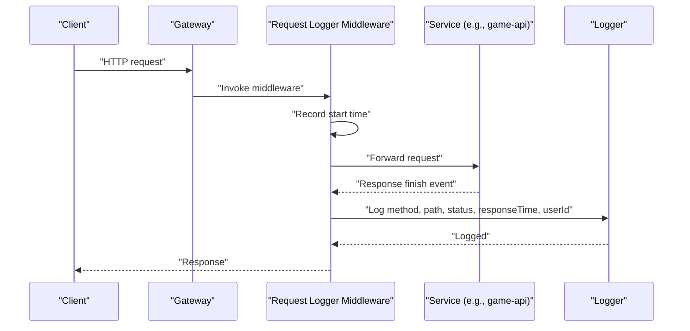

**Diagram sources**
- [apps/gateway/src/middleware/logger.ts](file://apps/gateway/src/middleware/logger.ts#L5-L24)
- [apps/gateway/src/logger.ts](file://apps/gateway/src/logger.ts#L1-L7)
- [apps/game-api/src/app.ts](file://apps/game-api/src/app.ts#L1-L63)

## Detailed Component Analysis

### Logger Package
The package defines the logger factory and child logger creator, along with Pino re-exports. It sets defaults and serializers, and toggles pretty printing based on NODE_ENV.

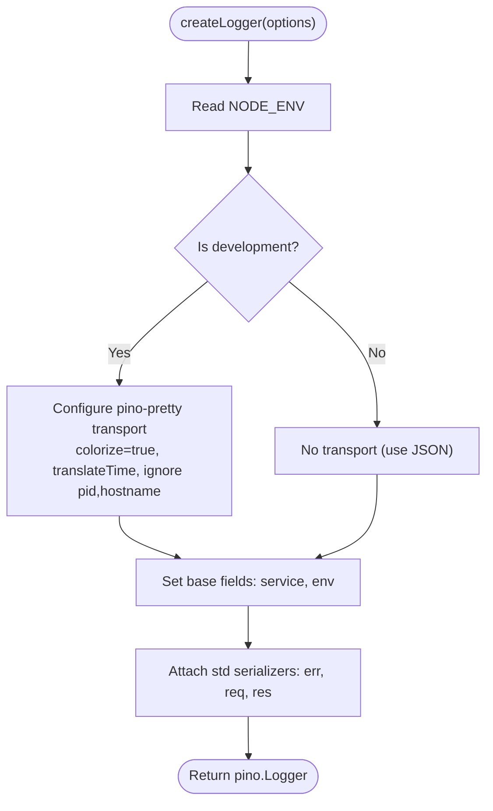

**Diagram sources**
- [packages/logger/src/index.ts](file://packages/logger/src/index.ts#L19-L50)

**Section sources**
- [packages/logger/src/index.ts](file://packages/logger/src/index.ts#L4-L65)
- [packages/logger/package.json](file://packages/logger/package.json#L8-L15)

### Gateway Logger Singleton
The gateway creates a single logger instance for the service and exposes it for middleware and other modules to use.

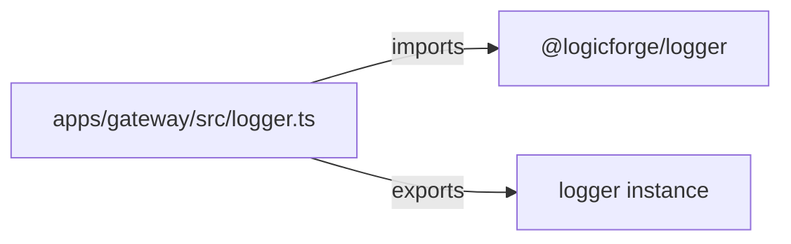

**Diagram sources**
- [apps/gateway/src/logger.ts](file://apps/gateway/src/logger.ts#L1-L7)
- [packages/logger/src/index.ts](file://packages/logger/src/index.ts#L19-L50)

**Section sources**
- [apps/gateway/src/logger.ts](file://apps/gateway/src/logger.ts#L1-L7)

### Request Logger Middleware
Logs request method, path, status code, response time, and user ID when the response finishes. Uses the gateway logger singleton.

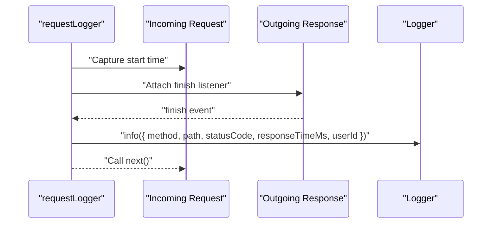

**Diagram sources**
- [apps/gateway/src/middleware/logger.ts](file://apps/gateway/src/middleware/logger.ts#L5-L24)

**Section sources**
- [apps/gateway/src/middleware/logger.ts](file://apps/gateway/src/middleware/logger.ts#L1-L25)

### Authentication Middleware (Context Injection)
Augments requests with user identity and forwards auth headers. Logs warnings on JWT verification failures using the gateway logger.

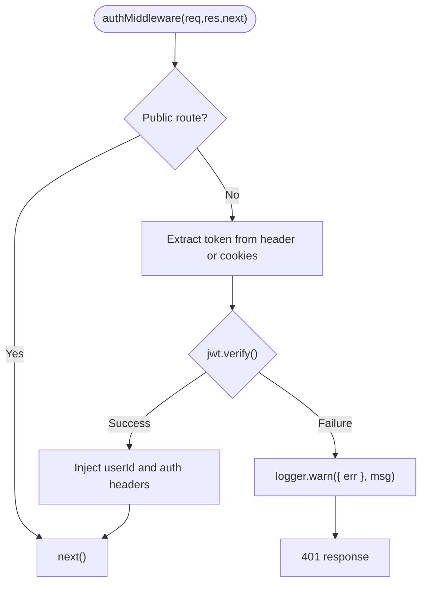

**Diagram sources**
- [apps/gateway/src/middleware/auth.ts](file://apps/gateway/src/middleware/auth.ts#L18-L64)

**Section sources**
- [apps/gateway/src/middleware/auth.ts](file://apps/gateway/src/middleware/auth.ts#L1-L65)

### Proxy Middleware (Centralized Error Logging)
Wraps http-proxy-middleware and logs proxy errors with service context. Ensures a consistent error response when appropriate.

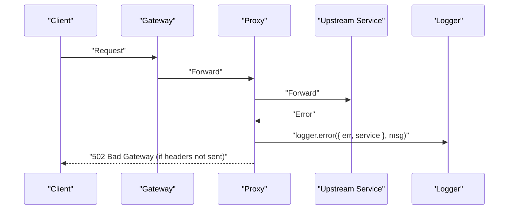

**Diagram sources**
- [apps/gateway/src/proxy.ts](file://apps/gateway/src/proxy.ts#L17-L42)

**Section sources**
- [apps/gateway/src/proxy.ts](file://apps/gateway/src/proxy.ts#L1-L78)

### Redis Client (Connection Lifecycle Logging)
Uses the gateway logger to report connection lifecycle events and transient errors. Demonstrates child logger usage via contextual bindings.

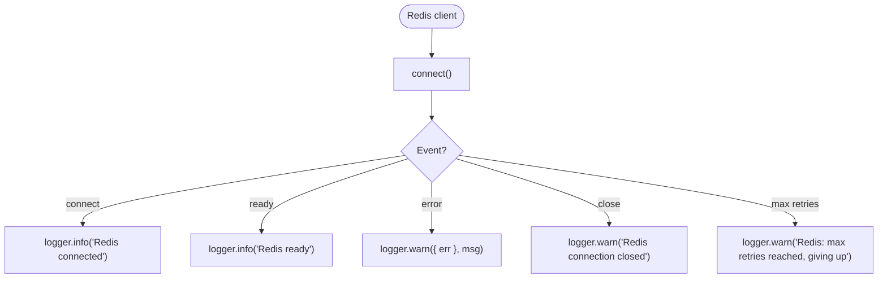

**Diagram sources**
- [apps/gateway/src/redis.ts](file://apps/gateway/src/redis.ts#L22-L45)

**Section sources**
- [apps/gateway/src/redis.ts](file://apps/gateway/src/redis.ts#L1-L55)

### Game API Application (Structured Logging and Error Handling)
Creates a service logger and uses it in error handling middleware to log unhandled errors with request context.

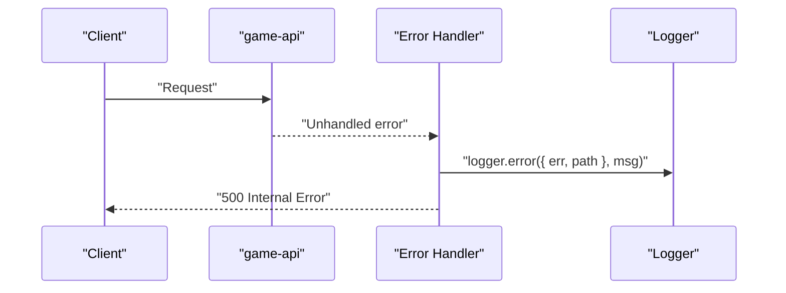

**Diagram sources**
- [apps/game-api/src/app.ts](file://apps/game-api/src/app.ts#L34-L62)

**Section sources**
- [apps/game-api/src/app.ts](file://apps/game-api/src/app.ts#L1-L63)

### Session Service (Contextual Bindings)
Logs session creation with contextual fields such as session ID and player count.

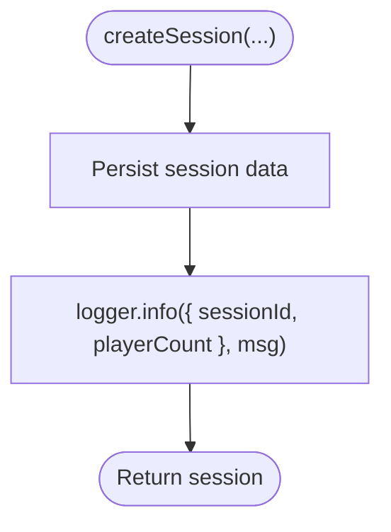

**Diagram sources**
- [apps/game-api/src/services/session.service.ts](file://apps/game-api/src/services/session.service.ts#L23-L46)

**Section sources**
- [apps/game-api/src/services/session.service.ts](file://apps/game-api/src/services/session.service.ts#L1-L167)

### Anti-Cheat Service (Service Logger)
Creates a logger for the anti-cheat service and logs startup information.

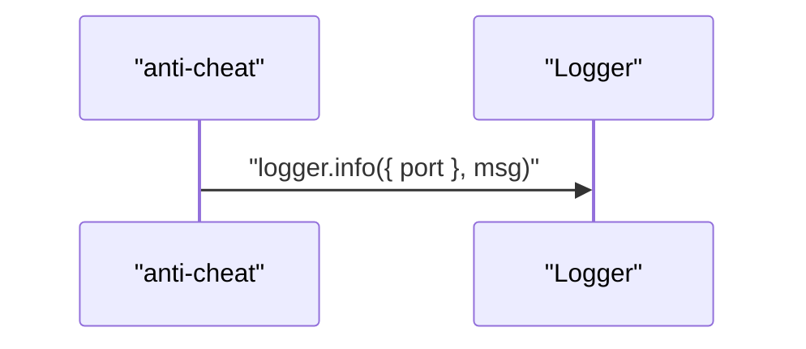

**Diagram sources**
- [apps/anti-cheat/src/index.ts](file://apps/anti-cheat/src/index.ts#L32-L34)

**Section sources**
- [apps/anti-cheat/src/index.ts](file://apps/anti-cheat/src/index.ts#L1-L35)

## Dependency Analysis
- The logger package depends on Pino and optionally pino-pretty in development.
- Applications depend on the logger package and import the logger factory to create service loggers.
- Middleware and services consume the logger singleton or child loggers to emit structured logs.

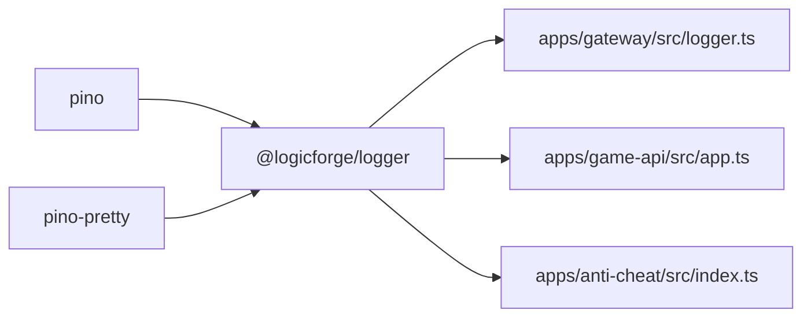

**Diagram sources**
- [packages/logger/package.json](file://packages/logger/package.json#L8-L15)
- [apps/gateway/src/logger.ts](file://apps/gateway/src/logger.ts#L1-L7)
- [apps/game-api/src/app.ts](file://apps/game-api/src/app.ts#L4-L10)
- [apps/anti-cheat/src/index.ts](file://apps/anti-cheat/src/index.ts#L5-L10)

**Section sources**
- [packages/logger/package.json](file://packages/logger/package.json#L8-L15)
- [apps/gateway/src/logger.ts](file://apps/gateway/src/logger.ts#L1-L7)
- [apps/game-api/src/app.ts](file://apps/game-api/src/app.ts#L1-L10)
- [apps/anti-cheat/src/index.ts](file://apps/anti-cheat/src/index.ts#L1-L10)

## Performance Considerations
- Prefer JSON output in production for efficient ingestion by log collectors.
- Use child loggers for request-scoped context to avoid repeatedly passing context through call stacks.
- Avoid expensive computations inside log calls; pass pre-computed values.
- Keep serializers focused; rely on Pino’s standard serializers for errors, requests, and responses to reduce overhead.

## Troubleshooting Guide
- Development vs Production formatting
  - Development: Pretty-printed, colored output with local time translation and selected field filtering.
  - Production: JSON output for machine parsing and aggregation.
- Verbose logging
  - Development defaults to a lower level to aid debugging; adjust the level via logger options when needed.
- Context not appearing
  - Ensure child loggers are used for request-scoped fields and that the gateway middleware injects user identity into requests.
- Error visibility
  - Use the standard error serializer to normalize error logs and include request context for easier correlation.

**Section sources**
- [packages/logger/src/index.ts](file://packages/logger/src/index.ts#L19-L50)
- [apps/gateway/src/middleware/logger.ts](file://apps/gateway/src/middleware/logger.ts#L14-L21)
- [apps/gateway/src/middleware/auth.ts](file://apps/gateway/src/middleware/auth.ts#L52-L63)

## Conclusion
Logic Forge’s logging system provides a consistent, structured approach across services using a shared package. It adapts formatting to environment, normalizes errors and HTTP context, and supports contextual bindings for request-scoped logs. The gateway’s middleware and proxy layers centralize request/response logging and error reporting, while individual services log domain events and lifecycle messages.

## Appendices

### Logger Factory Functions
- createLogger(options)
  - Parameters: service (string), level (optional string)
  - Behavior: Creates a logger with environment-aware level and transport; adds base fields and standard serializers
- createChildLogger(parent, bindings)
  - Parameters: parent (pino.Logger), bindings (record)
  - Behavior: Returns a child logger with additional contextual fields

Usage patterns:
- Service logger singleton: Import and call createLogger at module scope.
- Request-scoped logger: Use createChildLogger(parent, { requestId, userId, sessionId }) to add context.
- Error logging: Pass { err, req, res } to leverage standard serializers.

**Section sources**
- [packages/logger/src/index.ts](file://packages/logger/src/index.ts#L19-L65)

### Practical Examples by Module
- Gateway
  - Logger singleton: [apps/gateway/src/logger.ts](file://apps/gateway/src/logger.ts#L1-L7)
  - Request logging middleware: [apps/gateway/src/middleware/logger.ts](file://apps/gateway/src/middleware/logger.ts#L1-L25)
  - Auth middleware warning: [apps/gateway/src/middleware/auth.ts](file://apps/gateway/src/middleware/auth.ts#L61-L61)
  - Proxy error logging: [apps/gateway/src/proxy.ts](file://apps/gateway/src/proxy.ts#L31-L31)
  - Redis lifecycle logs: [apps/gateway/src/redis.ts](file://apps/gateway/src/redis.ts#L24-L40)
- Game API
  - Service logger and error handler: [apps/game-api/src/app.ts](file://apps/game-api/src/app.ts#L10-L62)
  - Session creation logging: [apps/game-api/src/services/session.service.ts](file://apps/game-api/src/services/session.service.ts#L44-L44)
- Anti-Cheat
  - Service logger and startup log: [apps/anti-cheat/src/index.ts](file://apps/anti-cheat/src/index.ts#L10-L34)

**Section sources**
- [apps/gateway/src/logger.ts](file://apps/gateway/src/logger.ts#L1-L7)
- [apps/gateway/src/middleware/logger.ts](file://apps/gateway/src/middleware/logger.ts#L1-L25)
- [apps/gateway/src/middleware/auth.ts](file://apps/gateway/src/middleware/auth.ts#L61-L61)
- [apps/gateway/src/proxy.ts](file://apps/gateway/src/proxy.ts#L31-L31)
- [apps/gateway/src/redis.ts](file://apps/gateway/src/redis.ts#L24-L40)
- [apps/game-api/src/app.ts](file://apps/game-api/src/app.ts#L10-L62)
- [apps/game-api/src/services/session.service.ts](file://apps/game-api/src/services/session.service.ts#L44-L44)
- [apps/anti-cheat/src/index.ts](file://apps/anti-cheat/src/index.ts#L10-L34)