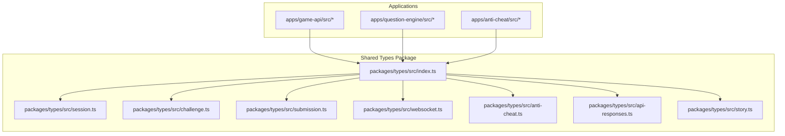
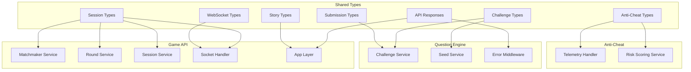
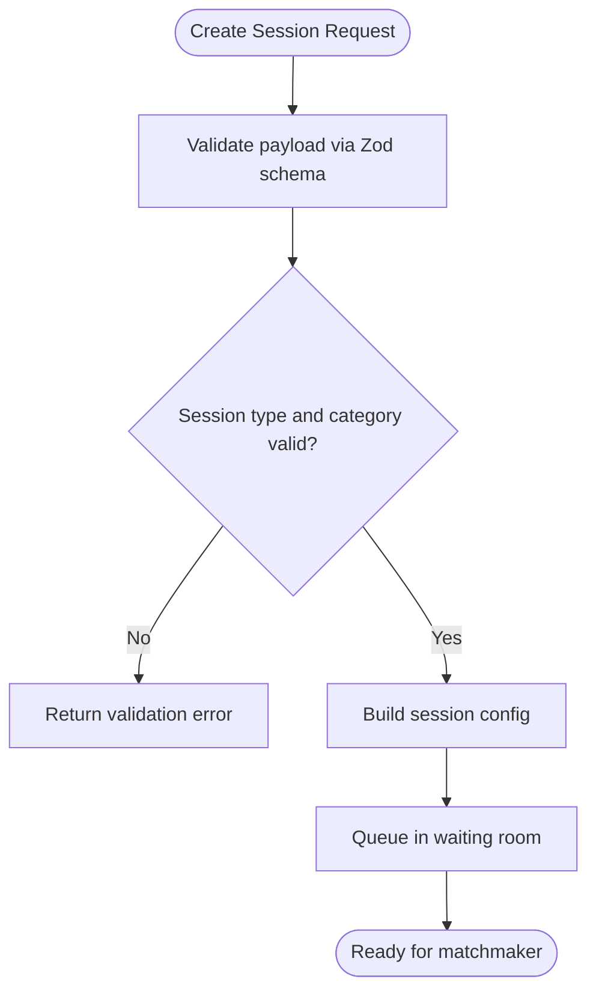
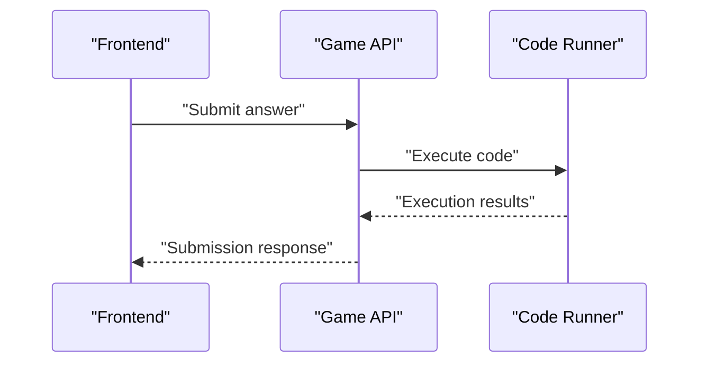
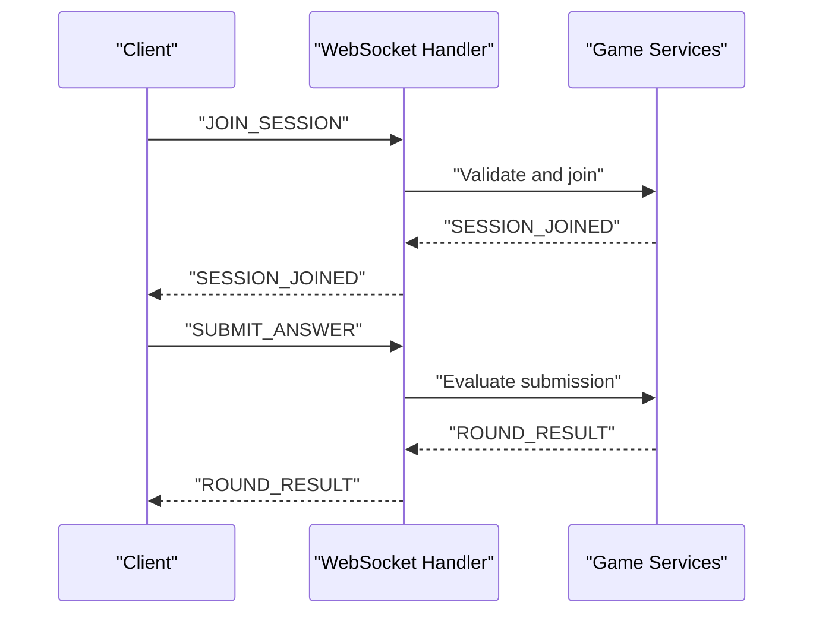
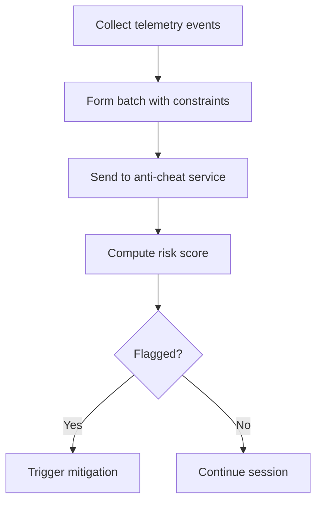
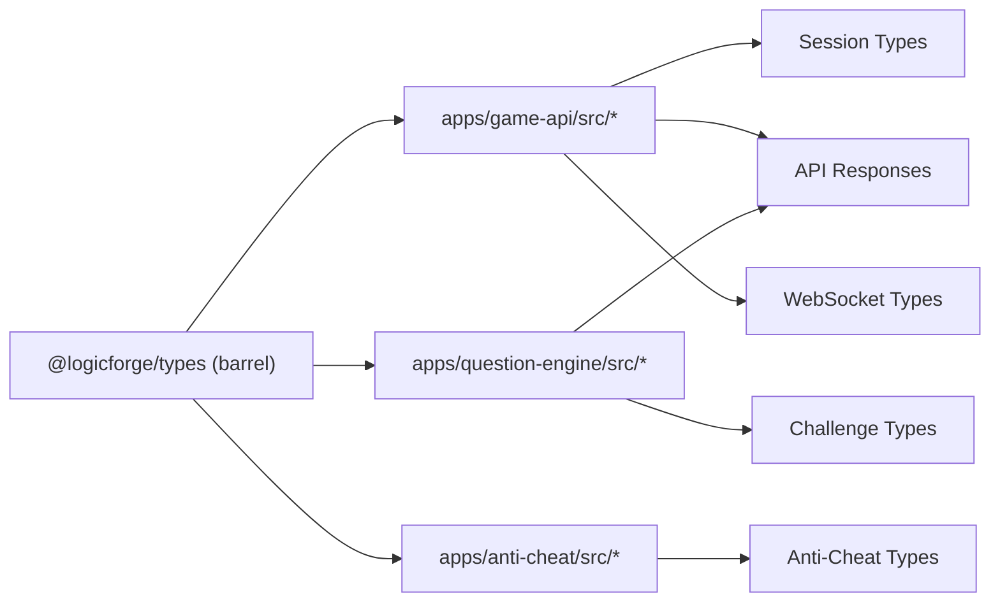

# Type Definitions & Interfaces

<cite>
**Referenced Files in This Document**
- [packages/types/src/index.ts](file://packages/types/src/index.ts)
- [packages/types/src/session.ts](file://packages/types/src/session.ts)
- [packages/types/src/challenge.ts](file://packages/types/src/challenge.ts)
- [packages/types/src/submission.ts](file://packages/types/src/submission.ts)
- [packages/types/src/websocket.ts](file://packages/types/src/websocket.ts)
- [packages/types/src/anti-cheat.ts](file://packages/types/src/anti-cheat.ts)
- [packages/types/src/api-responses.ts](file://packages/types/src/api-responses.ts)
- [packages/types/src/story.ts](file://packages/types/src/story.ts)
- [packages/tsconfig/base.json](file://packages/tsconfig/base.json)
- [packages/tsconfig/nextjs.json](file://packages/tsconfig/nextjs.json)
- [packages/tsconfig/node.json](file://packages/tsconfig/node.json)
- [apps/game-api/src/services/matchmaker.service.ts](file://apps/game-api/src/services/matchmaker.service.ts)
- [apps/game-api/src/services/round.service.ts](file://apps/game-api/src/services/round.service.ts)
- [apps/game-api/src/services/session.service.ts](file://apps/game-api/src/services/session.service.ts)
- [apps/game-api/src/websocket/socket.handler.ts](file://apps/game-api/src/websocket/socket.handler.ts)
- [apps/game-api/src/app.ts](file://apps/game-api/src/app.ts)
- [apps/question-engine/src/services/challenge.service.ts](file://apps/question-engine/src/services/challenge.service.ts)
- [apps/question-engine/src/services/seed.service.ts](file://apps/question-engine/src/services/seed.service.ts)
- [apps/question-engine/src/middleware/error.middleware.ts](file://apps/question-engine/src/middleware/error.middleware.ts)
- [apps/anti-cheat/src/handlers/telemetry.handler.ts](file://apps/anti-cheat/src/handlers/telemetry.handler.ts)
- [apps/anti-cheat/src/services/risk-scoring.service.ts](file://apps/anti-cheat/src/services/risk-scoring.service.ts)
</cite>

## Table of Contents
1. [Introduction](#introduction)
2. [Project Structure](#project-structure)
3. [Core Components](#core-components)
4. [Architecture Overview](#architecture-overview)
5. [Detailed Component Analysis](#detailed-component-analysis)
6. [Dependency Analysis](#dependency-analysis)
7. [Performance Considerations](#performance-considerations)
8. [Troubleshooting Guide](#troubleshooting-guide)
9. [Conclusion](#conclusion)
10. [Appendices](#appendices)

## Introduction
This document describes the shared type system used across the Logic Forge platform. It covers the barrel-exported types, Zod-based validation schemas, and reusable interfaces that unify service contracts, API envelopes, WebSocket messaging, and domain models. It also explains how TypeScript configurations enforce strictness and declaration generation across the monorepo, and outlines strategies for evolving types safely while maintaining backward compatibility and consistency.

## Project Structure
The shared type definitions live in a dedicated package that is consumed by multiple applications:
- Shared types package exports a single barrel file aggregating domain and infrastructure types.
- Applications import types to maintain consistent contracts for services, handlers, and WebSocket communications.
- A centralized TypeScript configuration enforces strict type checking and declaration outputs across the monorepo.



**Diagram sources**
- [packages/types/src/index.ts](file://packages/types/src/index.ts#L1-L11)
- [packages/types/src/session.ts](file://packages/types/src/session.ts#L1-L54)
- [packages/types/src/challenge.ts](file://packages/types/src/challenge.ts#L1-L60)
- [packages/types/src/submission.ts](file://packages/types/src/submission.ts#L1-L76)
- [packages/types/src/websocket.ts](file://packages/types/src/websocket.ts#L1-L155)
- [packages/types/src/anti-cheat.ts](file://packages/types/src/anti-cheat.ts#L1-L86)
- [packages/types/src/api-responses.ts](file://packages/types/src/api-responses.ts#L1-L83)
- [packages/types/src/story.ts](file://packages/types/src/story.ts#L1-L74)
- [apps/game-api/src/services/matchmaker.service.ts](file://apps/game-api/src/services/matchmaker.service.ts#L1-L20)
- [apps/question-engine/src/services/challenge.service.ts](file://apps/question-engine/src/services/challenge.service.ts#L1-L20)
- [apps/anti-cheat/src/handlers/telemetry.handler.ts](file://apps/anti-cheat/src/handlers/telemetry.handler.ts#L1-L60)

**Section sources**
- [packages/types/src/index.ts](file://packages/types/src/index.ts#L1-L11)

## Core Components
This section summarizes the primary type categories and their roles in the platform.

- Domain primitives and enums
  - Session modes, categories, and round configuration types.
  - Challenge categories, difficulty, and language enumerations.
  - Submission verdicts and round statuses.
  - Story chapter metadata and progress status.
- Validation schemas with Zod
  - Payloads for creating sessions, challenges, submissions, and WebSocket messages.
  - Execution request/response contracts for code execution.
  - Anti-cheat telemetry and risk scoring envelopes.
- API response envelopes
  - Generic success envelope with optional pagination metadata.
  - Standardized error envelope with categorized error codes.
- WebSocket message contracts
  - Client-to-server and server-to-client event unions with discriminated unions.
- Reusable interfaces
  - Session configuration, round state, and scoring result structures.
  - Anti-cheat behavior signals and defaults.

**Section sources**
- [packages/types/src/session.ts](file://packages/types/src/session.ts#L1-L54)
- [packages/types/src/challenge.ts](file://packages/types/src/challenge.ts#L1-L60)
- [packages/types/src/submission.ts](file://packages/types/src/submission.ts#L1-L76)
- [packages/types/src/websocket.ts](file://packages/types/src/websocket.ts#L1-L155)
- [packages/types/src/anti-cheat.ts](file://packages/types/src/anti-cheat.ts#L1-L86)
- [packages/types/src/api-responses.ts](file://packages/types/src/api-responses.ts#L1-L83)
- [packages/types/src/story.ts](file://packages/types/src/story.ts#L1-L74)

## Architecture Overview
The type system architecture centers on a shared package exporting a unified set of types and Zod schemas. Applications import these types to keep service contracts, API envelopes, and WebSocket protocols consistent across the platform.



**Diagram sources**
- [packages/types/src/session.ts](file://packages/types/src/session.ts#L1-L54)
- [packages/types/src/challenge.ts](file://packages/types/src/challenge.ts#L1-L60)
- [packages/types/src/submission.ts](file://packages/types/src/submission.ts#L1-L76)
- [packages/types/src/websocket.ts](file://packages/types/src/websocket.ts#L1-L155)
- [packages/types/src/anti-cheat.ts](file://packages/types/src/anti-cheat.ts#L1-L86)
- [packages/types/src/api-responses.ts](file://packages/types/src/api-responses.ts#L1-L83)
- [packages/types/src/story.ts](file://packages/types/src/story.ts#L1-L74)
- [apps/game-api/src/services/matchmaker.service.ts](file://apps/game-api/src/services/matchmaker.service.ts#L1-L20)
- [apps/game-api/src/services/round.service.ts](file://apps/game-api/src/services/round.service.ts#L1-L20)
- [apps/game-api/src/services/session.service.ts](file://apps/game-api/src/services/session.service.ts#L1-L20)
- [apps/game-api/src/websocket/socket.handler.ts](file://apps/game-api/src/websocket/socket.handler.ts#L1-L20)
- [apps/game-api/src/app.ts](file://apps/game-api/src/app.ts#L1-L20)
- [apps/question-engine/src/services/challenge.service.ts](file://apps/question-engine/src/services/challenge.service.ts#L1-L20)
- [apps/question-engine/src/services/seed.service.ts](file://apps/question-engine/src/services/seed.service.ts#L1-L20)
- [apps/question-engine/src/middleware/error.middleware.ts](file://apps/question-engine/src/middleware/error.middleware.ts#L1-L20)
- [apps/anti-cheat/src/handlers/telemetry.handler.ts](file://apps/anti-cheat/src/handlers/telemetry.handler.ts#L1-L60)
- [apps/anti-cheat/src/services/risk-scoring.service.ts](file://apps/anti-cheat/src/services/risk-scoring.service.ts#L1-L40)

## Detailed Component Analysis

### Session Types
- Purpose: Define session lifecycle, modes, categories, and configuration.
- Key elements:
  - Enumerations for player format, session type, and categories.
  - Zod schema for validating create-session requests with refinements.
  - Configuration and waiting-room entry structures.
- Usage: Imported by Game API services and WebSocket handler to coordinate matchmaking and round orchestration.



**Diagram sources**
- [packages/types/src/session.ts](file://packages/types/src/session.ts#L25-L36)

**Section sources**
- [packages/types/src/session.ts](file://packages/types/src/session.ts#L1-L54)
- [apps/game-api/src/services/matchmaker.service.ts](file://apps/game-api/src/services/matchmaker.service.ts#L1-L20)
- [apps/game-api/src/websocket/socket.handler.ts](file://apps/game-api/src/websocket/socket.handler.ts#L1-L20)

### Challenge Types
- Purpose: Model question data, query parameters, and semantic token maps.
- Key elements:
  - Zod enums for categories, difficulty, and language.
  - Query schemas for paginated and randomized challenge retrieval.
  - Response schema for challenge metadata and code template.
  - Semantic token map schema for dynamic placeholder mapping.
- Usage: Consumed by Question Engine services and handlers to fetch and randomize challenges.

```mermaid
classDiagram
class ChallengeCategoryEnum {
+values
}
class DifficultyEnum {
+values
}
class LanguageEnum {
+values
}
class ChallengeQuerySchema {
+category?
+difficulty?
+language?
+page
+limit
}
class RandomChallengeQuerySchema {
+category?
+difficulty?
+language?
+excludeIds[]
}
class ChallengeResponseSchema {
+id
+category
+difficulty
+title
+description
+codeTemplate
+hints?
+language
+timeLimitMs
}
class SemanticTokenMapSchema {
+record<string,{type,context?}>
}
ChallengeQuerySchema --> ChallengeCategoryEnum
ChallengeQuerySchema --> DifficultyEnum
ChallengeQuerySchema --> LanguageEnum
RandomChallengeQuerySchema --> ChallengeCategoryEnum
RandomChallengeQuerySchema --> DifficultyEnum
RandomChallengeQuerySchema --> LanguageEnum
ChallengeResponseSchema --> ChallengeCategoryEnum
ChallengeResponseSchema --> DifficultyEnum
ChallengeResponseSchema --> LanguageEnum
```

**Diagram sources**
- [packages/types/src/challenge.ts](file://packages/types/src/challenge.ts#L1-L60)

**Section sources**
- [packages/types/src/challenge.ts](file://packages/types/src/challenge.ts#L1-L60)
- [apps/question-engine/src/services/challenge.service.ts](file://apps/question-engine/src/services/challenge.service.ts#L1-L20)
- [apps/question-engine/src/services/seed.service.ts](file://apps/question-engine/src/services/seed.service.ts#L1-L20)

### Submission Types
- Purpose: Define submission lifecycle, verdicts, and execution results.
- Key elements:
  - Verdict and round status enumerations.
  - Submit-answer request schema and submission response schema.
  - Code execution request/response schemas for external runner integration.
- Usage: Used by services and handlers to process answers and communicate with the code runner.



**Diagram sources**
- [packages/types/src/submission.ts](file://packages/types/src/submission.ts#L24-L76)
- [apps/game-api/src/services/round.service.ts](file://apps/game-api/src/services/round.service.ts#L1-L20)

**Section sources**
- [packages/types/src/submission.ts](file://packages/types/src/submission.ts#L1-L76)
- [apps/game-api/src/services/round.service.ts](file://apps/game-api/src/services/round.service.ts#L1-L20)

### WebSocket Types
- Purpose: Standardize real-time messaging between clients and servers.
- Key elements:
  - Client-to-server and server-to-client event enums.
  - Discriminated union schemas for typed message routing.
  - Typed payloads for join, ready, submit, timer sync, round results, and errors.
- Usage: Implemented in the Game API WebSocket handler to manage session events.



**Diagram sources**
- [packages/types/src/websocket.ts](file://packages/types/src/websocket.ts#L48-L56)
- [packages/types/src/websocket.ts](file://packages/types/src/websocket.ts#L145-L155)
- [apps/game-api/src/websocket/socket.handler.ts](file://apps/game-api/src/websocket/socket.handler.ts#L1-L20)

**Section sources**
- [packages/types/src/websocket.ts](file://packages/types/src/websocket.ts#L1-L155)
- [apps/game-api/src/websocket/socket.handler.ts](file://apps/game-api/src/websocket/socket.handler.ts#L1-L20)

### Anti-Cheat Types
- Purpose: Capture telemetry, batch submissions, and compute risk scores.
- Key elements:
  - Telemetry event types and schema with optional round context.
  - Batch submission schema with min/max constraints.
  - Risk score response schema and default behavior signals with weights and thresholds.
- Usage: Consumed by Anti-Cheat services and handlers to evaluate suspicious behavior.



**Diagram sources**
- [packages/types/src/anti-cheat.ts](file://packages/types/src/anti-cheat.ts#L17-L44)
- [apps/anti-cheat/src/handlers/telemetry.handler.ts](file://apps/anti-cheat/src/handlers/telemetry.handler.ts#L1-L60)
- [apps/anti-cheat/src/services/risk-scoring.service.ts](file://apps/anti-cheat/src/services/risk-scoring.service.ts#L1-L40)

**Section sources**
- [packages/types/src/anti-cheat.ts](file://packages/types/src/anti-cheat.ts#L1-L86)
- [apps/anti-cheat/src/handlers/telemetry.handler.ts](file://apps/anti-cheat/src/handlers/telemetry.handler.ts#L1-L60)
- [apps/anti-cheat/src/services/risk-scoring.service.ts](file://apps/anti-cheat/src/services/risk-scoring.service.ts#L1-L40)

### API Response Envelopes
- Purpose: Provide standardized success and error responses across APIs.
- Key elements:
  - Generic success envelope with optional pagination metadata.
  - Standardized error envelope with categorized error codes.
  - Helper types and discriminated union for response handling.
- Usage: Used in Game API and Question Engine to return consistent responses.

```mermaid
classDiagram
class ApiSuccessSchema~T~ {
+success : true
+data : T
+meta? : PageMeta
}
class ApiErrorSchema {
+success : false
+error : {code,message,details?}
}
class ApiErrorResponse {
+success : false
+error : {code,message,details?}
}
class ApiSuccessResponse~T~ {
+success : true
+data : T
+meta? : PageMeta
}
class ApiResponse~T~ {
<<union>>
}
ApiSuccessSchema~T~ --> ApiSuccessResponse~T~
ApiErrorSchema --> ApiErrorResponse
ApiSuccessResponse~T~ <|-- ApiResponse~T~
ApiErrorResponse <|-- ApiResponse~T~
```

**Diagram sources**
- [packages/types/src/api-responses.ts](file://packages/types/src/api-responses.ts#L5-L26)
- [packages/types/src/api-responses.ts](file://packages/types/src/api-responses.ts#L63-L83)

**Section sources**
- [packages/types/src/api-responses.ts](file://packages/types/src/api-responses.ts#L1-L83)
- [apps/game-api/src/app.ts](file://apps/game-api/src/app.ts#L1-L20)
- [apps/question-engine/src/middleware/error.middleware.ts](file://apps/question-engine/src/middleware/error.middleware.ts#L1-L20)

### Story Mode Types
- Purpose: Define story progression, chapters, and metadata for UI.
- Key elements:
  - Chapter enumeration and progress status.
  - Progress response schema and chapter metadata records.
- Usage: Integrated into Game API for story-mode sessions and UI rendering.

**Section sources**
- [packages/types/src/story.ts](file://packages/types/src/story.ts#L1-L74)
- [apps/game-api/src/app.ts](file://apps/game-api/src/app.ts#L1-L20)

## Dependency Analysis
The shared types package acts as a central dependency for multiple applications. The following diagram shows how applications depend on the shared types package and how types are imported across services.



**Diagram sources**
- [packages/types/src/index.ts](file://packages/types/src/index.ts#L1-L11)
- [apps/game-api/src/services/matchmaker.service.ts](file://apps/game-api/src/services/matchmaker.service.ts#L1-L20)
- [apps/question-engine/src/services/challenge.service.ts](file://apps/question-engine/src/services/challenge.service.ts#L1-L20)
- [apps/anti-cheat/src/handlers/telemetry.handler.ts](file://apps/anti-cheat/src/handlers/telemetry.handler.ts#L1-L60)

**Section sources**
- [packages/types/src/index.ts](file://packages/types/src/index.ts#L1-L11)
- [apps/game-api/src/services/matchmaker.service.ts](file://apps/game-api/src/services/matchmaker.service.ts#L1-L20)
- [apps/game-api/src/services/round.service.ts](file://apps/game-api/src/services/round.service.ts#L1-L20)
- [apps/game-api/src/services/session.service.ts](file://apps/game-api/src/services/session.service.ts#L1-L20)
- [apps/game-api/src/websocket/socket.handler.ts](file://apps/game-api/src/websocket/socket.handler.ts#L1-L20)
- [apps/game-api/src/app.ts](file://apps/game-api/src/app.ts#L1-L20)
- [apps/question-engine/src/services/challenge.service.ts](file://apps/question-engine/src/services/challenge.service.ts#L1-L20)
- [apps/question-engine/src/services/seed.service.ts](file://apps/question-engine/src/services/seed.service.ts#L1-L20)
- [apps/question-engine/src/middleware/error.middleware.ts](file://apps/question-engine/src/middleware/error.middleware.ts#L1-L20)
- [apps/anti-cheat/src/handlers/telemetry.handler.ts](file://apps/anti-cheat/src/handlers/telemetry.handler.ts#L1-L60)
- [apps/anti-cheat/src/services/risk-scoring.service.ts](file://apps/anti-cheat/src/services/risk-scoring.service.ts#L1-L40)

## Performance Considerations
- Prefer Zod schemas for runtime validation to avoid repeated manual checks and reduce error-prone branching.
- Use discriminated unions for WebSocket messages to enable efficient, exhaustive routing at compile time.
- Keep shared types immutable where possible to prevent accidental mutation and improve predictability.
- Centralize enums and constants in shared types to minimize duplication and reduce bundle size.

## Troubleshooting Guide
Common issues and resolutions:
- Validation failures
  - Symptom: Requests rejected with validation errors.
  - Action: Inspect the specific field paths reported by Zod schemas and align client payloads accordingly.
- API response mismatch
  - Symptom: Client expects success but receives error envelope.
  - Action: Verify error codes and messages returned by middleware and ensure consistent handling across services.
- WebSocket message deserialization
  - Symptom: Messages not routed or payload missing fields.
  - Action: Confirm the message type discriminator and payload shape against the shared WebSocket schemas.
- Anti-cheat flagging
  - Symptom: Sessions flagged unexpectedly.
  - Action: Review behavior signal weights and thresholds, and adjust thresholds cautiously to balance sensitivity and false positives.

**Section sources**
- [packages/types/src/api-responses.ts](file://packages/types/src/api-responses.ts#L18-L26)
- [packages/types/src/websocket.ts](file://packages/types/src/websocket.ts#L48-L56)
- [packages/types/src/anti-cheat.ts](file://packages/types/src/anti-cheat.ts#L54-L86)

## Conclusion
The shared type system provides a robust foundation for type-safe development across the Logic Forge platform. By centralizing domain and infrastructure types, enforcing strict TypeScript configurations, and using Zod for validation, the platform ensures consistent contracts, predictable behavior, and easier maintenance. Following the guidelines below will help preserve type integrity as the platform evolves.

## Appendices

### TypeScript Configuration and Strictness
- Base configuration
  - Enables strict mode, isolated modules, declaration generation, and consistent file naming.
- Next.js configuration
  - Extends base with JSX preservation, DOM libs, and incremental builds for frontend apps.
- Node configuration
  - Extends base for backend services targeting ES2022 with bundler module resolution.

**Section sources**
- [packages/tsconfig/base.json](file://packages/tsconfig/base.json#L1-L22)
- [packages/tsconfig/nextjs.json](file://packages/tsconfig/nextjs.json#L1-L17)
- [packages/tsconfig/node.json](file://packages/tsconfig/node.json#L1-L11)

### Guidelines for Creating New Shared Types
- Place new types under the shared package barrel and export via the index file.
- Use Zod schemas for validation and derive TypeScript types with inference.
- Keep enums and constants centralized for consistency.
- Add JSDoc comments to explain intent and usage.
- Prefer discriminated unions for message types to simplify routing and exhaustiveness.

### Type Evolution Strategies
- Backward compatibility
  - Avoid removing or renaming existing enums and keys.
  - Add optional fields instead of changing required ones.
- Deprecation
  - Introduce new fields/enums alongside old ones; mark old ones as deprecated in comments.
- Migration patterns
  - Use schema refinements and transforms to normalize incoming data.
  - Maintain a changelog of breaking changes and update consumers incrementally.

### Breaking Change Management
- Version the shared package independently to track changes.
- Communicate breaking changes to consumers and provide migration steps.
- Use feature flags or versioned endpoints temporarily to ease transitions.