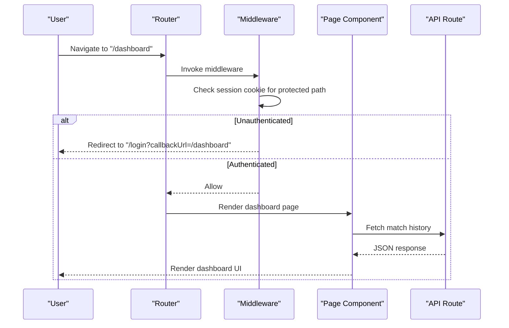
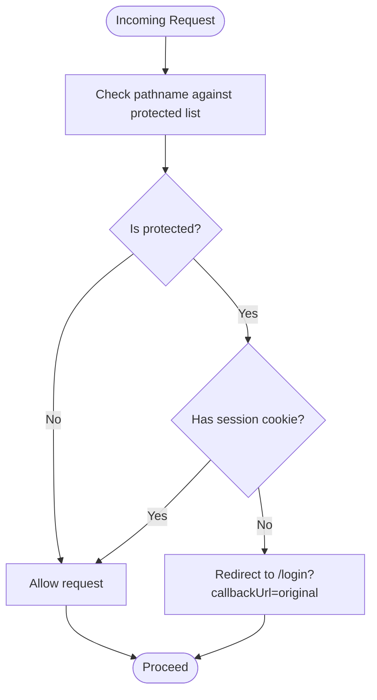
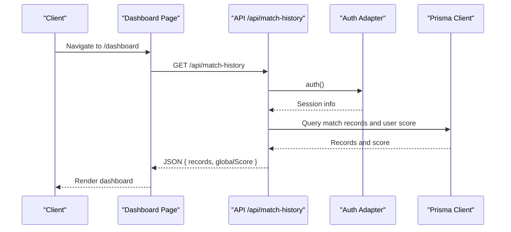
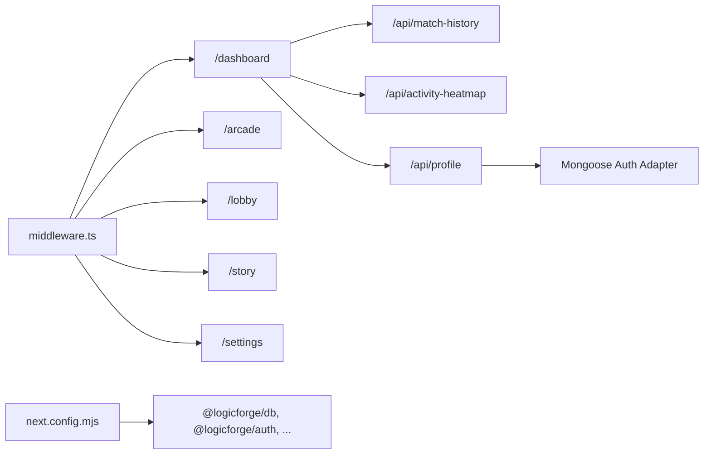

# Application Structure & Routing

<cite>
**Referenced Files in This Document**
- [layout.tsx](file://apps/web/app/layout.tsx)
- [page.tsx](file://apps/web/app/page.tsx)
- [not-found.tsx](file://apps/web/app/not-found.tsx)
- [middleware.ts](file://apps/web/middleware.ts)
- [next.config.mjs](file://apps/web/next.config.mjs)
- [login/page.tsx](file://apps/web/app/(auth)/login/page.tsx)
- [register/page.tsx](file://apps/web/app/(auth)/register/page.tsx)
- [dashboard/page.tsx](file://apps/web/app/dashboard/page.tsx)
- [arcade/page.tsx](file://apps/web/app/(game)/arcade/page.tsx)
- [lobby/page.tsx](file://apps/web/app/(game)/lobby/page.tsx)
- [story/layout.tsx](file://apps/web/app/(game)/story/layout.tsx)
- [api/auth/[...nextauth]/route.ts](file://apps/web/app/api/auth/[...nextauth]/route.ts)
- [api/profile/route.ts](file://apps/web/app/api/profile/route.ts)
- [api/match-history/route.ts](file://apps/web/app/api/match-history/route.ts)
- [api/activity-heatmap/route.ts](file://apps/web/app/api/activity-heatmap/route.ts)
</cite>

## Table of Contents
1. [Introduction](#introduction)
2. [Project Structure](#project-structure)
3. [Core Components](#core-components)
4. [Architecture Overview](#architecture-overview)
5. [Detailed Component Analysis](#detailed-component-analysis)
6. [Dependency Analysis](#dependency-analysis)
7. [Performance Considerations](#performance-considerations)
8. [Troubleshooting Guide](#troubleshooting-guide)
9. [Conclusion](#conclusion)

## Introduction
This document explains the Next.js application structure and routing system for the Logic Forge web application. It covers file-based routing, page organization, layout hierarchy, middleware for authentication and request processing, the app directory structure, dynamic routes, API routes organization, root layout configuration, metadata management, and SEO optimization. It also documents routing patterns for authentication, game, dashboard, and story modes, along with examples of route configuration, navigation patterns, URL structure, and performance considerations for routing and lazy loading.

## Project Structure
The application follows Next.js App Router conventions under the apps/web/app directory. Pages are grouped by feature using grouping folders (e.g., (auth), (game)). API routes are defined under app/api with catch-all routes for third-party libraries. Middleware enforces authentication for protected paths. The root layout defines site-wide metadata and providers.

```mermaid
graph TB
subgraph "Root Layout"
L["apps/web/app/layout.tsx"]
end
subgraph "Public Pages"
H["apps/web/app/page.tsx"]
NF["apps/web/app/not-found.tsx"]
end
subgraph "Auth Group (apps/web/app/(auth)) "
LG["apps/web/app/(auth)/login/page.tsx"]
RG["apps/web/app/(auth)/register/page.tsx"]
end
subgraph "Game Group (apps/web/app/(game)) "
AR["apps/web/app/(game)/arcade/page.tsx"]
LO["apps/web/app/(game)/lobby/page.tsx"]
SL["apps/web/app/(game)/story/layout.tsx"]
end
subgraph "Other Sections"
DB["apps/web/app/dashboard/page.tsx"]
end
subgraph "API Routes (apps/web/app/api)"
AUTH["apps/web/app/api/auth/[...nextauth]/route.ts"]
PROF["apps/web/app/api/profile/route.ts"]
MH["apps/web/app/api/match-history/route.ts"]
AH["apps/web/app/api/activity-heatmap/route.ts"]
end
MW["apps/web/middleware.ts"]
L --> H
L --> DB
L --> AR
L --> LO
L --> SL
L --> LG
L --> RG
L --> AUTH
L --> PROF
L --> MH
L --> AH
MW --> DB
MW --> AR
MW --> LO
MW --> SL
MW --> LG
MW --> RG
```

**Diagram sources**
- [layout.tsx](file://apps/web/app/layout.tsx#L1-L53)
- [page.tsx](file://apps/web/app/page.tsx#L1-L28)
- [not-found.tsx](file://apps/web/app/not-found.tsx#L1-L21)
- [middleware.ts](file://apps/web/middleware.ts#L1-L39)
- [login/page.tsx](file://apps/web/app/(auth)/login/page.tsx#L1-L343)
- [register/page.tsx](file://apps/web/app/(auth)/register/page.tsx#L1-L268)
- [dashboard/page.tsx](file://apps/web/app/dashboard/page.tsx#L1-L367)
- [arcade/page.tsx](file://apps/web/app/(game)/arcade/page.tsx#L1-L821)
- [lobby/page.tsx](file://apps/web/app/(game)/lobby/page.tsx#L1-L160)
- [story/layout.tsx](file://apps/web/app/(game)/story/layout.tsx#L1-L21)
- [api/auth/[...nextauth]/route.ts](file://apps/web/app/api/auth/[...nextauth]/route.ts#L1-L5)
- [api/profile/route.ts](file://apps/web/app/api/profile/route.ts#L1-L49)
- [api/match-history/route.ts](file://apps/web/app/api/match-history/route.ts#L1-L41)
- [api/activity-heatmap/route.ts](file://apps/web/app/api/activity-heatmap/route.ts#L1-L43)

**Section sources**
- [layout.tsx](file://apps/web/app/layout.tsx#L1-L53)
- [page.tsx](file://apps/web/app/page.tsx#L1-L28)
- [not-found.tsx](file://apps/web/app/not-found.tsx#L1-L21)
- [middleware.ts](file://apps/web/middleware.ts#L1-L39)

## Core Components
- Root layout: Defines site-wide metadata, providers, and wrappers for global UI elements.
- Public home page: Marketing and landing content.
- Not-found handler: Centralized 404 page.
- Middleware: Authentication guard for protected routes.
- Auth pages: Login and registration with OAuth and credentials providers.
- Dashboard: User-centric analytics and quick-play access.
- Game pages: Arcade mode wizard and lobby, plus story mode layout.
- API routes: Auth delegation, profile, match history, and activity heatmap.

**Section sources**
- [layout.tsx](file://apps/web/app/layout.tsx#L1-L53)
- [page.tsx](file://apps/web/app/page.tsx#L1-L28)
- [not-found.tsx](file://apps/web/app/not-found.tsx#L1-L21)
- [middleware.ts](file://apps/web/middleware.ts#L1-L39)
- [login/page.tsx](file://apps/web/app/(auth)/login/page.tsx#L1-L343)
- [register/page.tsx](file://apps/web/app/(auth)/register/page.tsx#L1-L268)
- [dashboard/page.tsx](file://apps/web/app/dashboard/page.tsx#L1-L367)
- [arcade/page.tsx](file://apps/web/app/(game)/arcade/page.tsx#L1-L821)
- [lobby/page.tsx](file://apps/web/app/(game)/lobby/page.tsx#L1-L160)
- [story/layout.tsx](file://apps/web/app/(game)/story/layout.tsx#L1-L21)
- [api/auth/[...nextauth]/route.ts](file://apps/web/app/api/auth/[...nextauth]/route.ts#L1-L5)
- [api/profile/route.ts](file://apps/web/app/api/profile/route.ts#L1-L49)
- [api/match-history/route.ts](file://apps/web/app/api/match-history/route.ts#L1-L41)
- [api/activity-heatmap/route.ts](file://apps/web/app/api/activity-heatmap/route.ts#L1-L43)

## Architecture Overview
The routing system leverages Next.js file-based routing with grouping folders to organize related pages. Protected routes are enforced by middleware. API routes are colocated under app/api and delegate to external services or adapters. The root layout centralizes metadata and providers.

**Diagram sources**
- [middleware.ts](file://apps/web/middleware.ts#L1-L39)
- [dashboard/page.tsx](file://apps/web/app/dashboard/page.tsx#L1-L367)
- [api/match-history/route.ts](file://apps/web/app/api/match-history/route.ts#L1-L41)

## Detailed Component Analysis

### Root Layout and Metadata
- Defines site metadata (title, description, icons, Open Graph).
- Wraps children with Providers, global audio, preloader wrapper, and toasts.
- Ensures hydration safety and consistent global UI.

**Section sources**
- [layout.tsx](file://apps/web/app/layout.tsx#L1-L53)

### Middleware: Authentication and Request Processing
- Checks for session cookies across multiple domains.
- Protects paths: dashboard, arcade, lobby, story, settings, arena.
- Redirects unauthenticated users to login with callbackUrl.
- Matcher excludes static assets and API routes.

**Diagram sources**
- [middleware.ts](file://apps/web/middleware.ts#L1-L39)

**Section sources**
- [middleware.ts](file://apps/web/middleware.ts#L1-L39)

### File-Based Routing Patterns and Page Organization
- Grouping folders (auth, game) organize related pages under logical namespaces.
- Dynamic segments are supported; for example, anti-cheat API uses a dynamic segment under app/api.
- Catch-all API routes delegate to external libraries (e.g., NextAuth).

Examples of route configuration and URL structure:
- Public home: /
- Auth: /login, /register
- Dashboard: /dashboard
- Game: /arcade, /lobby
- Story: /story (with nested page)
- API: /api/auth/[...nextauth], /api/profile, /api/match-history, /api/activity-heatmap

**Section sources**
- [login/page.tsx](file://apps/web/app/(auth)/login/page.tsx#L1-L343)
- [register/page.tsx](file://apps/web/app/(auth)/register/page.tsx#L1-L268)
- [dashboard/page.tsx](file://apps/web/app/dashboard/page.tsx#L1-L367)
- [arcade/page.tsx](file://apps/web/app/(game)/arcade/page.tsx#L1-L821)
- [lobby/page.tsx](file://apps/web/app/(game)/lobby/page.tsx#L1-L160)
- [story/layout.tsx](file://apps/web/app/(game)/story/layout.tsx#L1-L21)
- [api/auth/[...nextauth]/route.ts](file://apps/web/app/api/auth/[...nextauth]/route.ts#L1-L5)

### Layout Hierarchy
- Root layout wraps all pages with providers and global UI.
- Story mode uses a dedicated layout that injects SFX, audio, and narration providers around children.

**Section sources**
- [layout.tsx](file://apps/web/app/layout.tsx#L1-L53)
- [story/layout.tsx](file://apps/web/app/(game)/story/layout.tsx#L1-L21)

### Authentication Routes and NextAuth Delegation
- NextAuth catch-all route delegates all /api/auth/* to NextAuth handlers.
- Login page integrates credentials and OAuth providers with callback URLs and error handling.

**Section sources**
- [api/auth/[...nextauth]/route.ts](file://apps/web/app/api/auth/[...nextauth]/route.ts#L1-L5)
- [login/page.tsx](file://apps/web/app/(auth)/login/page.tsx#L1-L343)

### API Routes Organization
- Profile API: Validates session, retrieves/updates user profile via adapter.
- Match history API: Returns recent match records and global score for the authenticated user.
- Activity heatmap API: Aggregates daily counts for the last year.

**Diagram sources**
- [dashboard/page.tsx](file://apps/web/app/dashboard/page.tsx#L1-L367)
- [api/match-history/route.ts](file://apps/web/app/api/match-history/route.ts#L1-L41)

**Section sources**
- [api/profile/route.ts](file://apps/web/app/api/profile/route.ts#L1-L49)
- [api/match-history/route.ts](file://apps/web/app/api/match-history/route.ts#L1-L41)
- [api/activity-heatmap/route.ts](file://apps/web/app/api/activity-heatmap/route.ts#L1-L43)

### Game Mode Routing and Navigation Patterns
- Arcade mode: Multi-step configuration wizard leading to lobby and gameplay.
- Lobby: Handles ready-ups and session transitions.
- Story mode: Dedicated layout with audio and narration providers.

Navigation patterns:
- From dashboard to arcade: link to /arcade.
- From dashboard to story: link to /story.
- From arcade to lobby/session: client-side state transitions.
- From lobby to arena/results: client-side state transitions.

**Section sources**
- [dashboard/page.tsx](file://apps/web/app/dashboard/page.tsx#L1-L367)
- [arcade/page.tsx](file://apps/web/app/(game)/arcade/page.tsx#L1-L821)
- [lobby/page.tsx](file://apps/web/app/(game)/lobby/page.tsx#L1-L160)
- [story/layout.tsx](file://apps/web/app/(game)/story/layout.tsx#L1-L21)

### SEO and Metadata Management
- Root layout exports Metadata with title, description, icons, and Open Graph fields.
- These values are applied site-wide and inherited by pages unless overridden.

**Section sources**
- [layout.tsx](file://apps/web/app/layout.tsx#L9-L24)

## Dependency Analysis
- Middleware depends on request cookies and protected path list.
- Pages depend on NextAuth for session state and navigation.
- API routes depend on auth() for session validation and database adapters for persistence.
- Next.config enables transpilation of shared packages and image remote patterns.

**Diagram sources**
- [middleware.ts](file://apps/web/middleware.ts#L1-L39)
- [dashboard/page.tsx](file://apps/web/app/dashboard/page.tsx#L1-L367)
- [api/match-history/route.ts](file://apps/web/app/api/match-history/route.ts#L1-L41)
- [api/activity-heatmap/route.ts](file://apps/web/app/api/activity-heatmap/route.ts#L1-L43)
- [api/profile/route.ts](file://apps/web/app/api/profile/route.ts#L1-L49)
- [next.config.mjs](file://apps/web/next.config.mjs#L1-L32)

**Section sources**
- [middleware.ts](file://apps/web/middleware.ts#L1-L39)
- [dashboard/page.tsx](file://apps/web/app/dashboard/page.tsx#L1-L367)
- [api/match-history/route.ts](file://apps/web/app/api/match-history/route.ts#L1-L41)
- [api/activity-heatmap/route.ts](file://apps/web/app/api/activity-heatmap/route.ts#L1-L43)
- [api/profile/route.ts](file://apps/web/app/api/profile/route.ts#L1-L49)
- [next.config.mjs](file://apps/web/next.config.mjs#L1-L32)

## Performance Considerations
- Lazy loading: Use dynamic imports for heavy components to defer loading until needed.
- Client-side routing: Prefer client navigation for single-page-like experiences (e.g., dashboard).
- Middleware scope: Matcher excludes static assets and API routes to minimize overhead.
- Image optimization: Configure remotePatterns to leverage optimized images.
- Transpilation: Shared packages are transpiled to improve compatibility and reduce bundle size.
- External packages: Server components exclude certain packages from bundling to optimize server builds.

[No sources needed since this section provides general guidance]

## Troubleshooting Guide
- Authentication redirection loops: Verify callbackUrl handling and cookie presence in middleware.
- NextAuth errors: Check configuration and environment variables for auth providers.
- Unauthorized API responses: Ensure auth() is called and session contains user identifiers.
- 404 handling: Confirm not-found.tsx renders for unmatched routes.

**Section sources**
- [middleware.ts](file://apps/web/middleware.ts#L1-L39)
- [login/page.tsx](file://apps/web/app/(auth)/login/page.tsx#L1-L343)
- [api/profile/route.ts](file://apps/web/app/api/profile/route.ts#L1-L49)
- [not-found.tsx](file://apps/web/app/not-found.tsx#L1-L21)

## Conclusion
The application employs Next.js file-based routing with grouping folders to organize auth, game, and dashboard sections. Middleware enforces authentication for protected routes, while API routes provide backend integration. The root layout centralizes metadata and providers, ensuring consistent SEO and global UI. Following the documented patterns and leveraging the provided components will maintain a scalable and performant routing architecture.