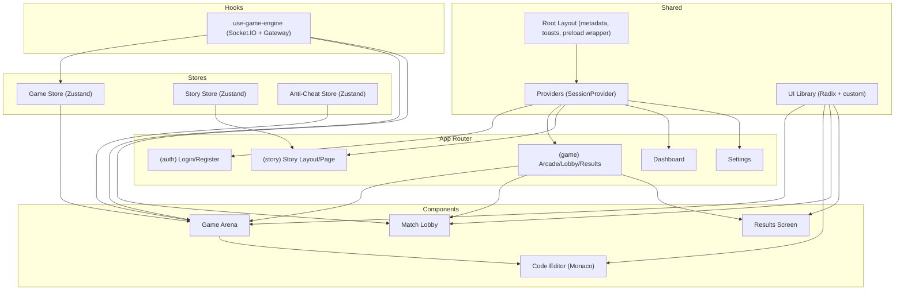
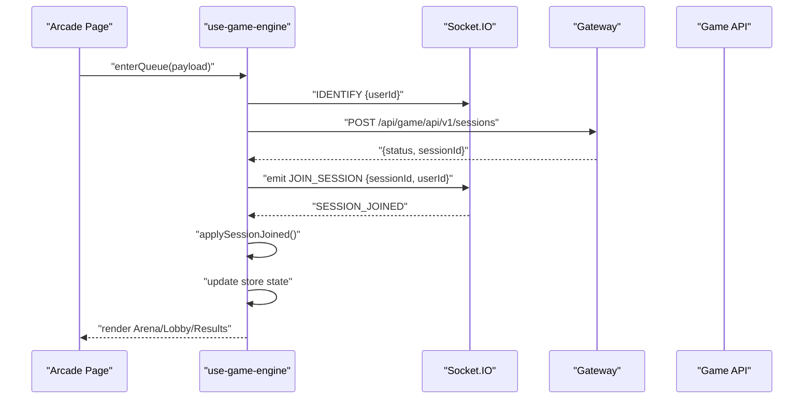
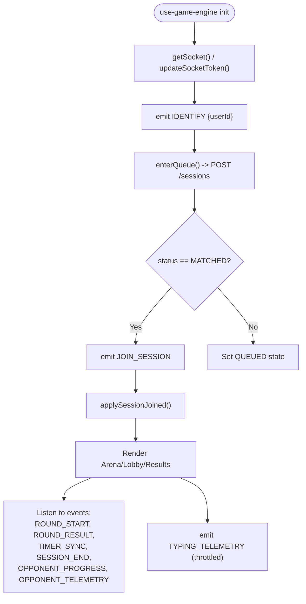
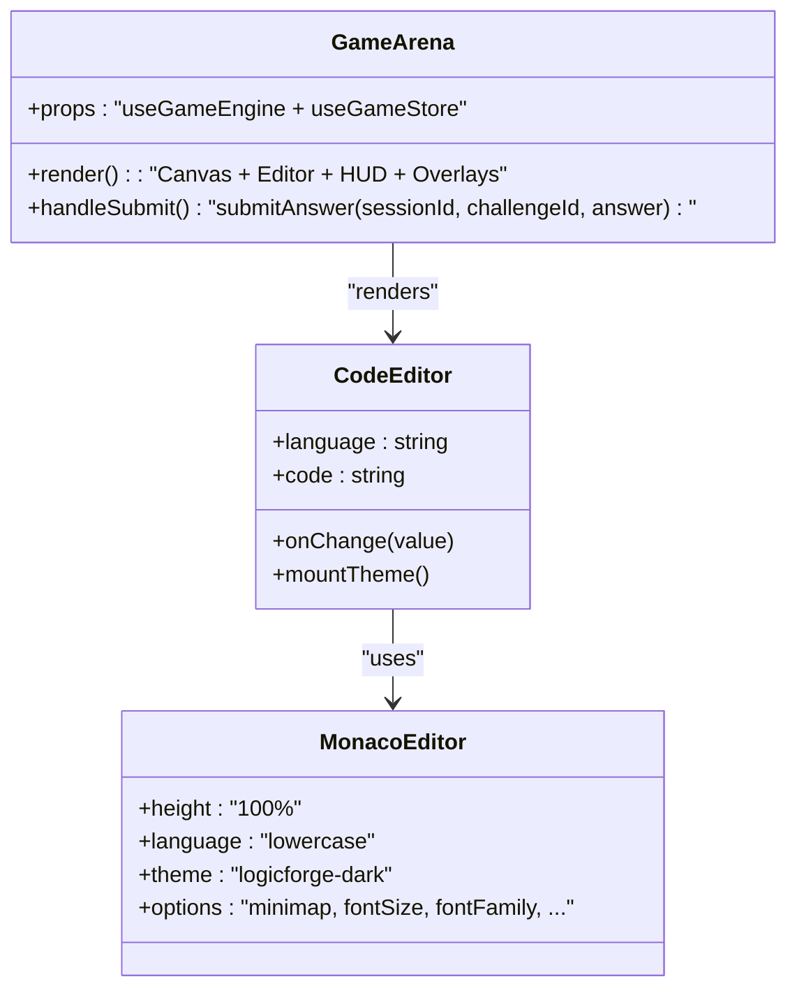
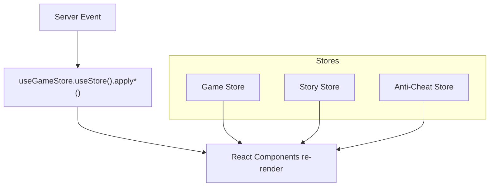
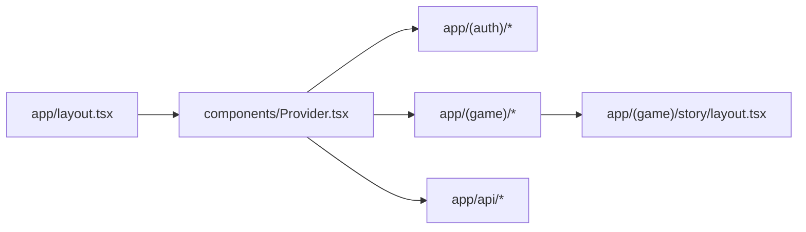
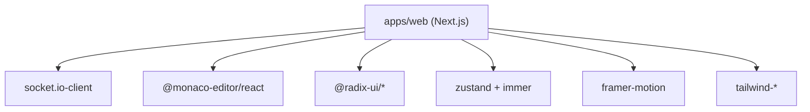

# Frontend Application (Next.js)

<cite>
**Referenced Files in This Document**
- [package.json](file://apps/web/package.json)
- [next.config.mjs](file://apps/web/next.config.mjs)
- [layout.tsx](file://apps/web/app/layout.tsx)
- [game-store.ts](file://apps/web/store/game-store.ts)
- [story-store.ts](file://apps/web/store/story-store.ts)
- [anti-cheat-store.ts](file://apps/web/store/anti-cheat-store.ts)
- [page.tsx](file://apps/web/app/(game)/arcade/page.tsx)
- [layout.tsx](file://apps/web/app/(game)/story/layout.tsx)
- [arena.tsx](file://apps/web/components/game/arena.tsx)
- [code-editor.tsx](file://apps/web/components/game/code-editor.tsx)
- [index.ts](file://apps/web/components/ui/index.ts)
- [use-game-engine.ts](file://apps/web/hooks/use-game-engine.ts)
- [lobby.tsx](file://apps/web/components/game/lobby.tsx)
- [results-screen.tsx](file://apps/web/components/game/results-screen.tsx)
- [utils.ts](file://apps/web/lib/utils.ts)
- [Provider.tsx](file://apps/web/components/Provider.tsx)
</cite>

## Table of Contents
1. [Introduction](#introduction)
2. [Project Structure](#project-structure)
3. [Core Components](#core-components)
4. [Architecture Overview](#architecture-overview)
5. [Detailed Component Analysis](#detailed-component-analysis)
6. [Dependency Analysis](#dependency-analysis)
7. [Performance Considerations](#performance-considerations)
8. [Troubleshooting Guide](#troubleshooting-guide)
9. [Conclusion](#conclusion)
10. [Appendices](#appendices)

## Introduction
This document provides comprehensive documentation for the Next.js frontend application powering the LogicForge platform. It covers application structure, routing patterns, page layouts, component organization, real-time features via WebSocket connections, state management using Zustand stores, UI component library and design system, responsive design patterns, game engine integration, real-time communication handling, and user interface patterns. It also includes examples of component usage, state management patterns, integration with backend services, performance optimization strategies, SEO considerations, and accessibility implementation.

## Project Structure
The frontend is organized as a Next.js application under apps/web with:
- App Router-based pages and layouts grouped by feature (authentication, game modes, story mode, dashboard, settings)
- A dedicated store directory for Zustand state slices (game, story, anti-cheat)
- A components directory structured by domain (ui, game, story) and shared providers
- Hooks for game engine integration and telemetry
- Tailwind-based design system and global styles

**Diagram sources**
- [layout.tsx](file://apps/web/app/layout.tsx#L1-L53)
- [Provider.tsx](file://apps/web/components/Provider.tsx#L1-L7)
- [page.tsx](file://apps/web/app/(game)/arcade/page.tsx#L1-L821)
- [arena.tsx](file://apps/web/components/game/arena.tsx#L1-L395)
- [code-editor.tsx](file://apps/web/components/game/code-editor.tsx#L1-L67)
- [lobby.tsx](file://apps/web/components/game/lobby.tsx#L1-L161)
- [results-screen.tsx](file://apps/web/components/game/results-screen.tsx#L1-L238)
- [use-game-engine.ts](file://apps/web/hooks/use-game-engine.ts#L1-L466)
- [index.ts](file://apps/web/components/ui/index.ts#L1-L90)

**Section sources**
- [package.json](file://apps/web/package.json#L1-L116)
- [next.config.mjs](file://apps/web/next.config.mjs#L1-L32)
- [layout.tsx](file://apps/web/app/layout.tsx#L1-L53)

## Core Components
- Root layout and providers: Sets metadata, global styles, toasts, preloader wrapper, and session provider.
- UI library: Re-exports Radix UI primitives and custom components for consistent design.
- Game engine hook: Manages Socket.IO connection, authentication headers, event handling, queueing, and telemetry.
- Stores:
  - Game store: Central state for match status, session lifecycle, round events, timers, survival mode, and dual-mode telemetry.
  - Story store: Narrative state, XP/rank progression, boss combat, chat streaming, choices, and audio intensity.
  - Anti-cheat store: Risk scoring, warning logs, and session-scoped telemetry.
- Domain components:
  - Arena: Main gameplay area with resizable panels, editor, canvas, HUDs, and overlays.
  - Code editor: Monaco-based editor with custom theme and options.
  - Lobby: Matchmaking and readiness UI for single and dual modes.
  - Results screen: Post-match statistics, outcomes, and survival continuation prompts.

**Section sources**
- [layout.tsx](file://apps/web/app/layout.tsx#L1-L53)
- [index.ts](file://apps/web/components/ui/index.ts#L1-L90)
- [use-game-engine.ts](file://apps/web/hooks/use-game-engine.ts#L1-L466)
- [game-store.ts](file://apps/web/store/game-store.ts#L1-L394)
- [story-store.ts](file://apps/web/store/story-store.ts#L1-L308)
- [anti-cheat-store.ts](file://apps/web/store/anti-cheat-store.ts#L1-L108)
- [arena.tsx](file://apps/web/components/game/arena.tsx#L1-L395)
- [code-editor.tsx](file://apps/web/components/game/code-editor.tsx#L1-L67)
- [lobby.tsx](file://apps/web/components/game/lobby.tsx#L1-L161)
- [results-screen.tsx](file://apps/web/components/game/results-screen.tsx#L1-L238)

## Architecture Overview
The frontend integrates tightly with backend services:
- Real-time communication: Socket.IO connects to the game API gateway with bearer token authentication.
- Queueing and session management: The game engine posts to the gateway to enter queues and join sessions.
- State synchronization: Server emits events mapped to Zustand actions for immediate UI updates.
- Anti-cheat telemetry: Periodic typing telemetry is throttled and sent to the server for risk scoring.

**Diagram sources**
- [page.tsx](file://apps/web/app/(game)/arcade/page.tsx#L506-L528)
- [use-game-engine.ts](file://apps/web/hooks/use-game-engine.ts#L335-L392)
- [use-game-engine.ts](file://apps/web/hooks/use-game-engine.ts#L113-L131)
- [use-game-engine.ts](file://apps/web/hooks/use-game-engine.ts#L185-L188)

## Detailed Component Analysis

### Real-Time Communication and Game Engine Integration
- Socket initialization: Singleton Socket.IO instance with WebSocket transport, reconnection, and bearer token auth injected via extraHeaders.
- Token management: On session availability, the engine injects the access token into the socket and reconnects if needed.
- Event handling: Comprehensive listeners for match events, round lifecycle, timers, survival mode, and errors; guards prevent premature session end application.
- Telemetry: Throttled typing telemetry sent periodically during dual-mode code challenges.

**Diagram sources**
- [use-game-engine.ts](file://apps/web/hooks/use-game-engine.ts#L36-L77)
- [use-game-engine.ts](file://apps/web/hooks/use-game-engine.ts#L93-L103)
- [use-game-engine.ts](file://apps/web/hooks/use-game-engine.ts#L133-L285)
- [use-game-engine.ts](file://apps/web/hooks/use-game-engine.ts#L310-L333)

**Section sources**
- [use-game-engine.ts](file://apps/web/hooks/use-game-engine.ts#L1-L466)

### Game Arena and UI Patterns
- Layout: Resizable panels for canvas and editor; collapsible output panel for non-MCQ/tracing challenges.
- Modes:
  - Blank-fill challenges: Extract answer from template blanks.
  - MCQ challenges: Dedicated selector with language-aware options.
  - Tracing challenges: Read-only code display with numeric answer input.
- HUDs and overlays:
  - Timer bar, survival HUD, dual progress HUD, opponent telemetry, and result overlays.
  - Waiting overlay in dual timer mode while opponent finishes.
- Accessibility and responsiveness: Consistent use of Tailwind utilities, semantic markup, and motion primitives for feedback.

**Diagram sources**
- [arena.tsx](file://apps/web/components/game/arena.tsx#L48-L394)
- [code-editor.tsx](file://apps/web/components/game/code-editor.tsx#L13-L66)

**Section sources**
- [arena.tsx](file://apps/web/components/game/arena.tsx#L1-L395)
- [code-editor.tsx](file://apps/web/components/game/code-editor.tsx#L1-L67)

### State Management with Zustand
- Game store:
  - Tracks connection state, match and session statuses, round lifecycle, timers, survival mode, dual-mode telemetry, and round history.
  - Provides actions to apply server events and reset state.
- Story store:
  - Manages narrative state, XP/rank computation, boss combat, chat streaming, choices, and audio intensity.
  - Includes helpers to compute rank tiers and manage zone completion.
- Anti-cheat store:
  - Maintains risk score, warning logs, and session-scoped counters.
  - Normalizes risk levels based on thresholds.

**Diagram sources**
- [game-store.ts](file://apps/web/store/game-store.ts#L77-L141)
- [story-store.ts](file://apps/web/store/story-store.ts#L42-L112)
- [anti-cheat-store.ts](file://apps/web/store/anti-cheat-store.ts#L20-L33)

**Section sources**
- [game-store.ts](file://apps/web/store/game-store.ts#L1-L394)
- [story-store.ts](file://apps/web/store/story-store.ts#L1-L308)
- [anti-cheat-store.ts](file://apps/web/store/anti-cheat-store.ts#L1-L108)

### Routing Patterns and Page Layouts
- App Router groups:
  - (auth): Login and registration pages.
  - (game): Arcade, lobby, results, and story layout/page.
  - API routes: Authentication, match history, profile, anti-cheat metrics, and story chat.
- Root layout:
  - Metadata for SEO and social previews.
  - Providers for session context, preloader wrapper, global click sound, and toast notifications.

**Diagram sources**
- [layout.tsx](file://apps/web/app/layout.tsx#L1-L53)
- [Provider.tsx](file://apps/web/components/Provider.tsx#L1-L7)
- [layout.tsx](file://apps/web/app/(game)/story/layout.tsx#L1-L21)

**Section sources**
- [layout.tsx](file://apps/web/app/layout.tsx#L1-L53)
- [layout.tsx](file://apps/web/app/(game)/story/layout.tsx#L1-L21)

### UI Component Library and Design System
- UI primitives: Re-export of Radix UI components and custom variants for consistent design tokens.
- Utilities: Tailwind merge and class composition utilities for responsive and accessible components.
- Theming: Custom editor theme for Monaco and retro-styled buttons and HUDs.

**Section sources**
- [index.ts](file://apps/web/components/ui/index.ts#L1-L90)
- [utils.ts](file://apps/web/lib/utils.ts#L1-L7)

### Responsive Design Patterns
- Grid and flex layouts adapt to mobile and desktop screens.
- Resizable panels enable dynamic editor/canvas sizing.
- Typography scales with breakpoints; icons replace text on small screens.
- Motion primitives provide subtle feedback without sacrificing performance.

[No sources needed since this section synthesizes patterns observed across components]

### Integration with Backend Services
- Gateway base URL resolves host for session creation and queueing.
- Socket auth uses bearer token for secure polling and room membership.
- Anti-cheat telemetry and story chat integrate with backend APIs.

**Section sources**
- [use-game-engine.ts](file://apps/web/hooks/use-game-engine.ts#L18-L26)
- [use-game-engine.ts](file://apps/web/hooks/use-game-engine.ts#L363-L371)

## Dependency Analysis
- External libraries:
  - Socket.IO client for real-time communication.
  - Monaco Editor for code editing.
  - Radix UI for accessible primitives.
  - Framer Motion for micro-interactions.
  - Zustand for state management with Immer middleware.
- Build configuration:
  - Transpilation of workspace packages and external MongoDB drivers on server.
  - Image remote patterns for avatar providers.

**Diagram sources**
- [package.json](file://apps/web/package.json#L12-L83)
- [next.config.mjs](file://apps/web/next.config.mjs#L5-L22)

**Section sources**
- [package.json](file://apps/web/package.json#L1-L116)
- [next.config.mjs](file://apps/web/next.config.mjs#L1-L32)

## Performance Considerations
- Lazy loading and hydration:
  - Preloader wrapper ensures auth context is available before rendering heavy components.
- Bundle optimization:
  - Transpile workspace packages selectively and externalize MongoDB dependencies on server.
- Real-time efficiency:
  - Socket.IO with WebSocket transport and throttled telemetry reduce bandwidth.
- Rendering:
  - Memoized callbacks and selective re-renders in stores minimize UI churn.
- Editor performance:
  - Monaco configured with minimal overhead and smooth scrolling.

[No sources needed since this section provides general guidance]

## Troubleshooting Guide
- Socket connection issues:
  - Verify NEXT_PUBLIC_GAME_WS_URL and gateway base URL configuration.
  - Ensure Authorization header is present for polling requests.
- Session join failures:
  - Check queue error messages and retry joining; confirm session ID presence.
- Anti-cheat warnings:
  - Review warning logs and risk score thresholds; reset clears state.
- Story mode audio and narration:
  - Confirm StorySFXProvider, AudioManagerProvider, and NarrationProvider are mounted.

**Section sources**
- [use-game-engine.ts](file://apps/web/hooks/use-game-engine.ts#L18-L26)
- [use-game-engine.ts](file://apps/web/hooks/use-game-engine.ts#L113-L131)
- [anti-cheat-store.ts](file://apps/web/store/anti-cheat-store.ts#L51-L107)
- [layout.tsx](file://apps/web/app/(game)/story/layout.tsx#L1-L21)

## Conclusion
The frontend leverages a robust architecture combining Next.js App Router, Zustand stores, and Socket.IO to deliver a responsive, real-time gaming experience. The design system and component library ensure consistency and accessibility, while thoughtful performance optimizations maintain interactivity. Integration with backend services is secured and efficient, enabling seamless matchmaking, live telemetry, and narrative progression.

[No sources needed since this section summarizes without analyzing specific files]

## Appendices

### Example Usage Patterns
- Starting a session:
  - Use the arcade page wizard to configure format, mode, and category; then call enterQueue and joinSession via the game engine hook.
- Managing game state:
  - Subscribe to store selectors for current round, challenge, and timers; apply server events through store actions.
- Handling anti-cheat:
  - Push warnings and update risk score; reset on session change.

**Section sources**
- [page.tsx](file://apps/web/app/(game)/arcade/page.tsx#L557-L564)
- [use-game-engine.ts](file://apps/web/hooks/use-game-engine.ts#L335-L392)
- [game-store.ts](file://apps/web/store/game-store.ts#L221-L392)
- [anti-cheat-store.ts](file://apps/web/store/anti-cheat-store.ts#L51-L107)