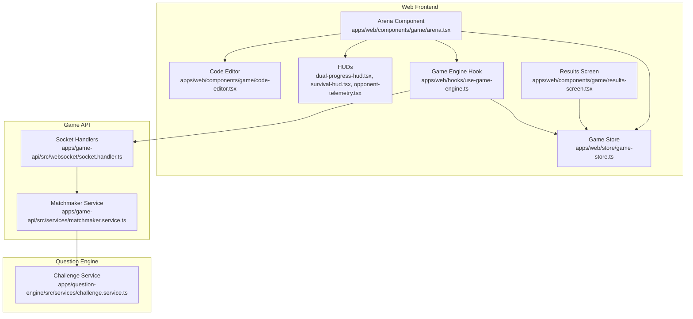
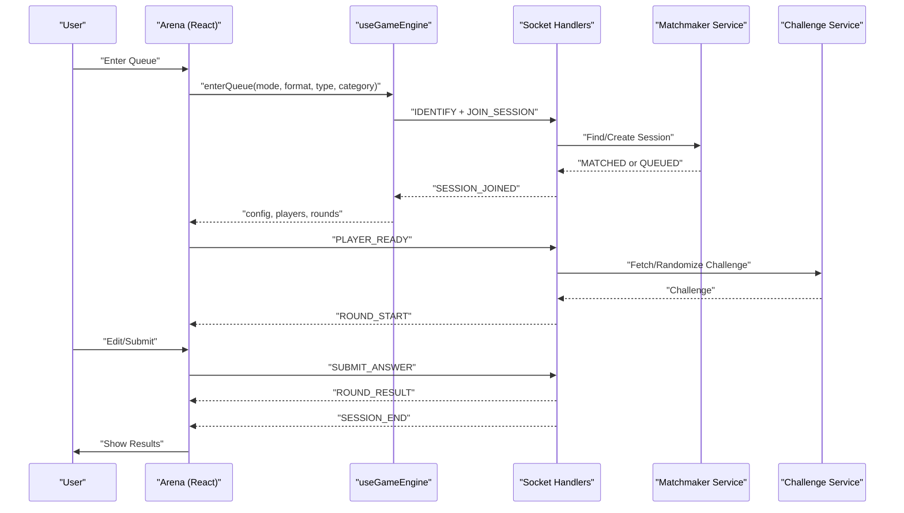
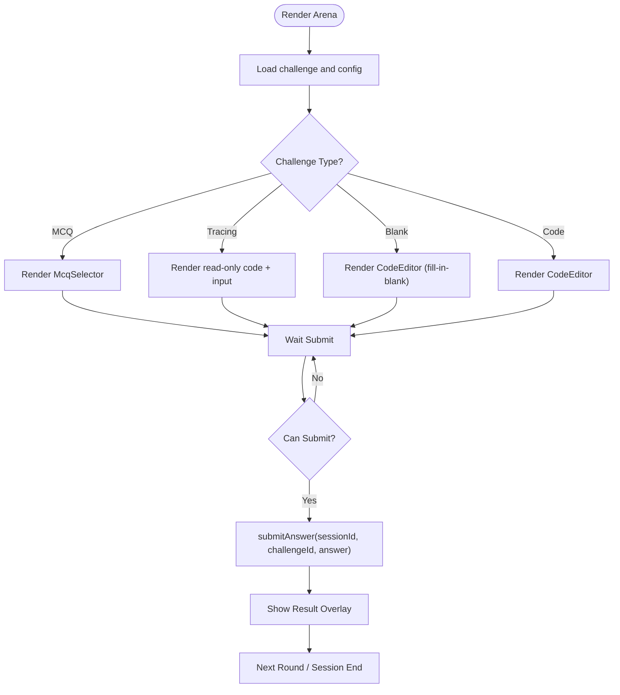
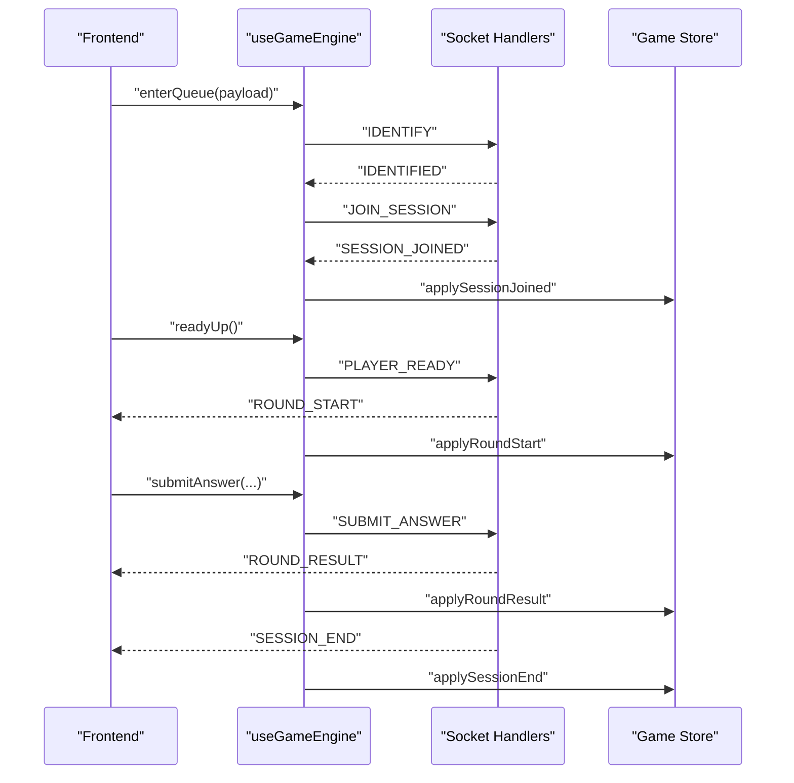
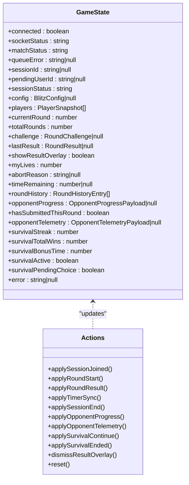
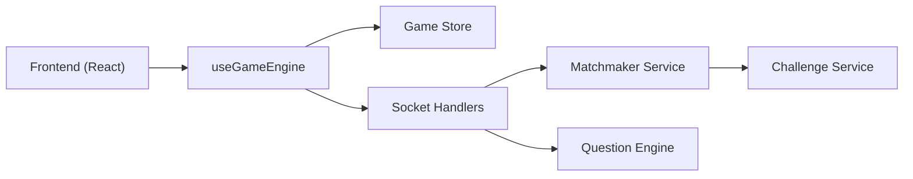
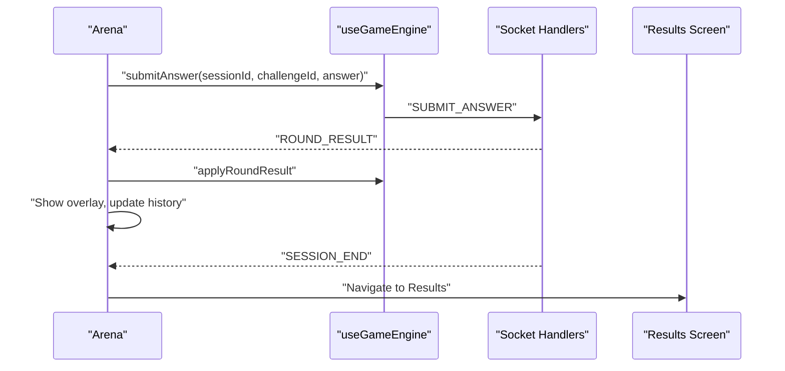
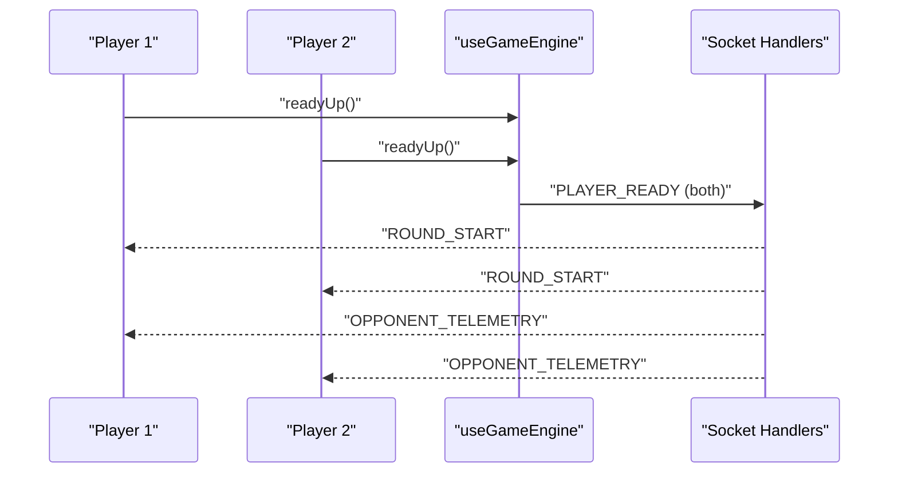

# Game Engine Integration

<cite>
**Referenced Files in This Document**
- [arena.tsx](file://apps/web/components/game/arena.tsx)
- [use-game-engine.ts](file://apps/web/hooks/use-game-engine.ts)
- [game-store.ts](file://apps/web/store/game-store.ts)
- [code-editor.tsx](file://apps/web/components/game/code-editor.tsx)
- [results-screen.tsx](file://apps/web/components/game/results-screen.tsx)
- [opponent-telemetry.tsx](file://apps/web/components/game/opponent-telemetry.tsx)
- [dual-progress-hud.tsx](file://apps/web/components/game/dual-progress-hud.tsx)
- [survival-hud.tsx](file://apps/web/components/game/survival-hud.tsx)
- [prompt-canvas.tsx](file://apps/web/components/game/prompt-canvas.tsx)
- [socket.handler.ts](file://apps/game-api/src/websocket/socket.handler.ts)
- [matchmaker.service.ts](file://apps/game-api/src/services/matchmaker.service.ts)
- [challenge.service.ts](file://apps/question-engine/src/services/challenge.service.ts)
- [results.page.tsx](file://apps/web/app/(game)/results/page.tsx)
</cite>

## Table of Contents
1. [Introduction](#introduction)
2. [Project Structure](#project-structure)
3. [Core Components](#core-components)
4. [Architecture Overview](#architecture-overview)
5. [Detailed Component Analysis](#detailed-component-analysis)
6. [Dependency Analysis](#dependency-analysis)
7. [Performance Considerations](#performance-considerations)
8. [Troubleshooting Guide](#troubleshooting-guide)
9. [Conclusion](#conclusion)
10. [Appendices](#appendices)

## Introduction
This document explains the game engine integration and interactive gameplay features powering the arena experience. It covers the game engine hook implementation, state synchronization across the UI and backend, real-time gameplay mechanics, code editor integration, challenge display, user interaction patterns, arena component architecture, opponent visualization, multiplayer coordination, results screen implementation, scoring, and performance metrics. It also documents backend integrations for challenge fetching and submission handling, and provides examples of game state management, input processing, and real-time feedback systems.

## Project Structure
The game runtime spans three primary areas:
- Frontend React components and stores under apps/web/components/game and apps/web/store
- Real-time orchestration and matchmaking under apps/game-api
- Challenge data and randomization under apps/question-engine

**Diagram sources**
- [arena.tsx](file://apps/web/components/game/arena.tsx#L48-L395)
- [use-game-engine.ts](file://apps/web/hooks/use-game-engine.ts#L80-L466)
- [game-store.ts](file://apps/web/store/game-store.ts#L77-L394)
- [code-editor.tsx](file://apps/web/components/game/code-editor.tsx#L13-L67)
- [dual-progress-hud.tsx](file://apps/web/components/game/dual-progress-hud.tsx#L48-L175)
- [survival-hud.tsx](file://apps/web/components/game/survival-hud.tsx#L11-L49)
- [opponent-telemetry.tsx](file://apps/web/components/game/opponent-telemetry.tsx#L18-L99)
- [results-screen.tsx](file://apps/web/components/game/results-screen.tsx#L19-L238)
- [socket.handler.ts](file://apps/game-api/src/websocket/socket.handler.ts#L62-L310)
- [matchmaker.service.ts](file://apps/game-api/src/services/matchmaker.service.ts#L41-L206)
- [challenge.service.ts](file://apps/question-engine/src/services/challenge.service.ts#L8-L76)

**Section sources**
- [arena.tsx](file://apps/web/components/game/arena.tsx#L48-L395)
- [use-game-engine.ts](file://apps/web/hooks/use-game-engine.ts#L80-L466)
- [game-store.ts](file://apps/web/store/game-store.ts#L77-L394)

## Core Components
- Arena: Orchestrates the full round lifecycle, challenge rendering, editor, HUDs, and user actions.
- Game Engine Hook: Manages WebSocket connections, emits/receives events, and exposes APIs for queueing, joining, submitting answers, and telemetry.
- Game Store: Centralized Zustand store managing session state, round state, timers, scores, and multiplayer telemetry.
- Code Editor: Monaco-based editor with theme and options tailored for performance and readability.
- HUDs: Dual progress HUD, survival HUD, and opponent telemetry for real-time feedback.
- Results Screen: Post-session summary with stats, breakdown, and survival continuation flow.
- Backend Services: Socket handlers for matchmaking, round orchestration, and anti-cheat telemetry relays; matchmaker service for queueing and pairing; challenge service for fetching and randomizing challenges.

**Section sources**
- [arena.tsx](file://apps/web/components/game/arena.tsx#L48-L395)
- [use-game-engine.ts](file://apps/web/hooks/use-game-engine.ts#L80-L466)
- [game-store.ts](file://apps/web/store/game-store.ts#L77-L394)
- [code-editor.tsx](file://apps/web/components/game/code-editor.tsx#L13-L67)
- [dual-progress-hud.tsx](file://apps/web/components/game/dual-progress-hud.tsx#L48-L175)
- [survival-hud.tsx](file://apps/web/components/game/survival-hud.tsx#L11-L49)
- [opponent-telemetry.tsx](file://apps/web/components/game/opponent-telemetry.tsx#L18-L99)
- [results-screen.tsx](file://apps/web/components/game/results-screen.tsx#L19-L238)
- [socket.handler.ts](file://apps/game-api/src/websocket/socket.handler.ts#L62-L310)
- [matchmaker.service.ts](file://apps/game-api/src/services/matchmaker.service.ts#L41-L206)
- [challenge.service.ts](file://apps/question-engine/src/services/challenge.service.ts#L8-L76)

## Architecture Overview
The system uses a hybrid real-time architecture:
- Frontend connects via Socket.IO to the Game API for matchmaking, round orchestration, and live updates.
- The Game API coordinates sessions, matchmaker, and round progression, and relays anti-cheat telemetry.
- Question Engine supplies challenges with optional randomization and MCQ options.

**Diagram sources**
- [use-game-engine.ts](file://apps/web/hooks/use-game-engine.ts#L335-L392)
- [socket.handler.ts](file://apps/game-api/src/websocket/socket.handler.ts#L108-L202)
- [matchmaker.service.ts](file://apps/game-api/src/services/matchmaker.service.ts#L47-L72)
- [challenge.service.ts](file://apps/question-engine/src/services/challenge.service.ts#L34-L62)

## Detailed Component Analysis

### Arena Component
The Arena composes the round UI, editor, HUDs, and overlays. It:
- Detects challenge categories and renders appropriate input modes (code editor, MCQ selector, tracing input).
- Computes WPM and emits typing telemetry for dual sessions.
- Manages dual-mode waiting overlay and result overlay visibility.
- Submits answers and displays execution output.

**Diagram sources**
- [arena.tsx](file://apps/web/components/game/arena.tsx#L127-L144)
- [arena.tsx](file://apps/web/components/game/arena.tsx#L255-L355)

**Section sources**
- [arena.tsx](file://apps/web/components/game/arena.tsx#L48-L395)

### Game Engine Hook (useGameEngine)
Responsibilities:
- Socket lifecycle: create/update socket with auth, reconnect on token changes.
- Event handlers: IDENTIFY, MATCHED, SESSION_JOINED, ROUND_START, ROUND_RESULT, TIMER_SYNC, SESSION_END, SESSION_ABORTED, OPPONENT_PROGRESS, OPPONENT_TELEMETRY, SURVIVAL_*.
- Client actions: enterQueue, joinSession, readyUp, submitAnswer, emitTypingTelemetry, confirmSurvivalContinue, declineSurvival, reconnect.
- Session end safety: delays SESSION_END until all round results are applied.

**Diagram sources**
- [use-game-engine.ts](file://apps/web/hooks/use-game-engine.ts#L113-L131)
- [use-game-engine.ts](file://apps/web/hooks/use-game-engine.ts#L185-L198)
- [use-game-engine.ts](file://apps/web/hooks/use-game-engine.ts#L200-L220)
- [use-game-engine.ts](file://apps/web/hooks/use-game-engine.ts#L298-L308)
- [use-game-engine.ts](file://apps/web/hooks/use-game-engine.ts#L445-L455)

**Section sources**
- [use-game-engine.ts](file://apps/web/hooks/use-game-engine.ts#L80-L466)

### Game Store (Zustand + Immer)
State model:
- Session: status, config, players, rounds, current challenge, last result, round history.
- Timing: timeRemaining, timer sync.
- Multiplayer: opponentProgress, opponentTelemetry, hasSubmittedThisRound.
- Survival: streak, total wins, bonus time, pending choice.
- UI: overlays, errors, queue status.

Key behaviors:
- applyRoundStart resets per-round dual state and clears overlays.
- applyRoundResult records verdict, score, and updates history; marks submission.
- applySessionEnd waits for all round results before completing.
- applyOpponentProgress/Telemetry update live telemetry.

**Diagram sources**
- [game-store.ts](file://apps/web/store/game-store.ts#L77-L141)
- [game-store.ts](file://apps/web/store/game-store.ts#L221-L394)

**Section sources**
- [game-store.ts](file://apps/web/store/game-store.ts#L77-L394)

### Code Editor Integration
- Uses Monaco Editor with a custom dark theme optimized for code readability.
- Syncs new code templates into the editor on round changes.
- Configured for smooth scrolling, caret animation, and paste formatting.

**Section sources**
- [code-editor.tsx](file://apps/web/components/game/code-editor.tsx#L13-L67)

### Opponent Telemetry and HUDs
- OpponentTelemetry: visualizes opponent progress and typing indicators; triggers SFX on progress jumps.
- DualProgressHud: shows “Submitted/Done” vs “Solving…” in timer mode; round numbers and lives in live mode.
- SurvivalHUD: displays current streak and bonus time during survival runs.

**Section sources**
- [opponent-telemetry.tsx](file://apps/web/components/game/opponent-telemetry.tsx#L18-L99)
- [dual-progress-hud.tsx](file://apps/web/components/game/dual-progress-hud.tsx#L48-L175)
- [survival-hud.tsx](file://apps/web/components/game/survival-hud.tsx#L11-L49)

### Prompt Canvas
- Renders challenge title and description via HTML5 Canvas for crisp text rendering.
- Optionally renders a read-only code block with line numbers and scrollable content.

**Section sources**
- [prompt-canvas.tsx](file://apps/web/components/game/prompt-canvas.tsx#L12-L129)

### Results Screen
- Computes outcomes (win/draw/defeat) and presents stats (total score, correct count, accuracy/opponent).
- Shows per-round breakdown with verdicts and execution times.
- Handles survival continuation choice and navigation controls.

**Section sources**
- [results-screen.tsx](file://apps/web/components/game/results-screen.tsx#L19-L238)
- [results.page.tsx](file://apps/web/app/(game)/results/page.tsx#L8-L22)

### Backend Integrations
- Socket Handlers: manage IDENTIFY, JOIN_SESSION, PLAYER_READY, TYPING_TELEMETRY, SUBMIT_ANSWER, SURVIVAL_REQUEUE, and anti-cheat telemetry relays.
- Matchmaker Service: constructs waiting room keys, builds configs, matches dual players, and supports survival requeue.
- Challenge Service: fetches challenges, randomizes them, and sanitizes responses for safe client consumption.

**Section sources**
- [socket.handler.ts](file://apps/game-api/src/websocket/socket.handler.ts#L62-L310)
- [matchmaker.service.ts](file://apps/game-api/src/services/matchmaker.service.ts#L41-L206)
- [challenge.service.ts](file://apps/question-engine/src/services/challenge.service.ts#L8-L76)

## Dependency Analysis
- Frontend depends on:
  - useGameEngine for socket orchestration and actions.
  - game-store for centralized state and derived UI logic.
  - Components for rendering and interactivity.
- Backend depends on:
  - Socket handlers to translate frontend events into session actions.
  - Matchmaker service to pair players and construct sessions.
  - Challenge service to supply randomized challenges.

**Diagram sources**
- [use-game-engine.ts](file://apps/web/hooks/use-game-engine.ts#L80-L466)
- [socket.handler.ts](file://apps/game-api/src/websocket/socket.handler.ts#L62-L310)
- [matchmaker.service.ts](file://apps/game-api/src/services/matchmaker.service.ts#L41-L206)
- [challenge.service.ts](file://apps/question-engine/src/services/challenge.service.ts#L8-L76)

**Section sources**
- [use-game-engine.ts](file://apps/web/hooks/use-game-engine.ts#L80-L466)
- [socket.handler.ts](file://apps/game-api/src/websocket/socket.handler.ts#L62-L310)
- [matchmaker.service.ts](file://apps/game-api/src/services/matchmaker.service.ts#L41-L206)
- [challenge.service.ts](file://apps/question-engine/src/services/challenge.service.ts#L8-L76)

## Performance Considerations
- Editor performance:
  - Smooth scrolling and caret animations are enabled; minimize excessive re-renders by syncing code templates efficiently.
  - Disable minimap and enable format-on-paste judiciously to balance UX and CPU usage.
- Canvas rendering:
  - Prompt canvas scales to device pixel ratio and uses ResizeObserver to redraw on size changes.
- Real-time telemetry:
  - Throttle typing telemetry to reduce event frequency; the hook enforces a minimum interval.
- State updates:
  - Zustand with Immer ensures immutable updates are efficient; avoid frequent deep object churn in reducers.
- Network resilience:
  - Socket reconnection with backoff and token updates prevent dropped rooms and maintain session continuity.

[No sources needed since this section provides general guidance]

## Troubleshooting Guide
Common issues and remedies:
- Socket connection errors:
  - Verify NEXT_PUBLIC_GAME_WS_URL and gateway auth headers. The hook injects Authorization headers on polling requests.
- Session not joined:
  - Ensure IDENTIFY completes and JOIN_SESSION ACK returns a payload; check for session expiration.
- Round result ordering:
  - SESSION_END is delayed until all round results are applied to avoid premature completion.
- Typing telemetry not visible:
  - Confirm opponent has submitted=false and WPM exceeds threshold; verify progress jump triggers SFX.
- Results page access:
  - The results route redirects to the arena if sessionStatus is not COMPLETED.

**Section sources**
- [use-game-engine.ts](file://apps/web/hooks/use-game-engine.ts#L18-L26)
- [use-game-engine.ts](file://apps/web/hooks/use-game-engine.ts#L310-L333)
- [use-game-engine.ts](file://apps/web/hooks/use-game-engine.ts#L200-L220)
- [results.page.tsx](file://apps/web/app/(game)/results/page.tsx#L12-L17)

## Conclusion
The game engine integrates a robust real-time system spanning frontend state management, socket-driven orchestration, and backend services for matchmaking and challenge delivery. The Arena component orchestrates diverse challenge types, real-time multiplayer feedback, and a polished results experience. Backend services ensure fairness and scalability via anti-cheat telemetry relays and deterministic queueing. Together, these components deliver responsive, immersive gameplay with strong synchronization and performance characteristics.

## Appendices

### Example Workflows

#### Real-Time Submission Flow

**Diagram sources**
- [arena.tsx](file://apps/web/components/game/arena.tsx#L127-L144)
- [use-game-engine.ts](file://apps/web/hooks/use-game-engine.ts#L298-L308)
- [results.page.tsx](file://apps/web/app/(game)/results/page.tsx#L8-L22)

#### Multiplayer Coordination

**Diagram sources**
- [use-game-engine.ts](file://apps/web/hooks/use-game-engine.ts#L445-L455)
- [socket.handler.ts](file://apps/game-api/src/websocket/socket.handler.ts#L159-L202)
- [opponent-telemetry.tsx](file://apps/web/components/game/opponent-telemetry.tsx#L18-L99)