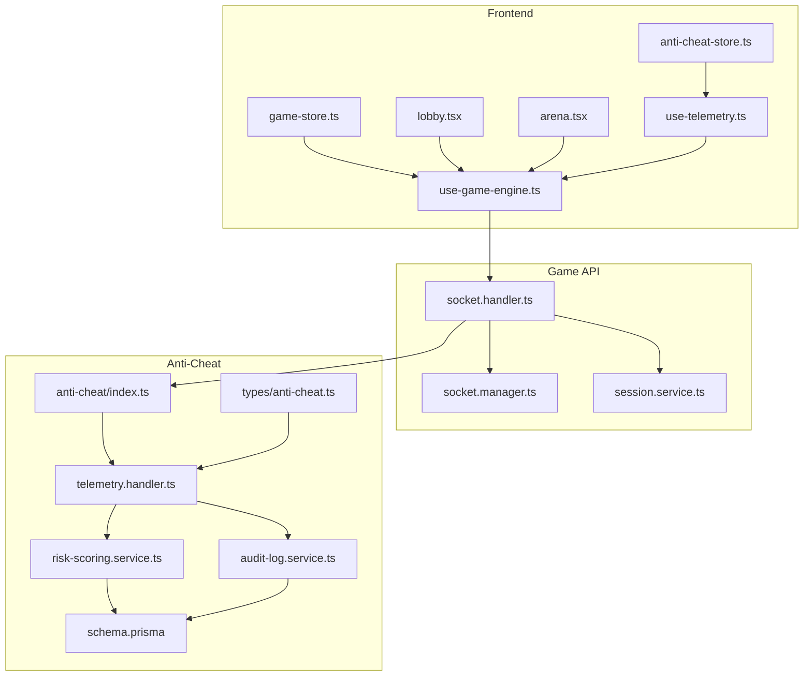
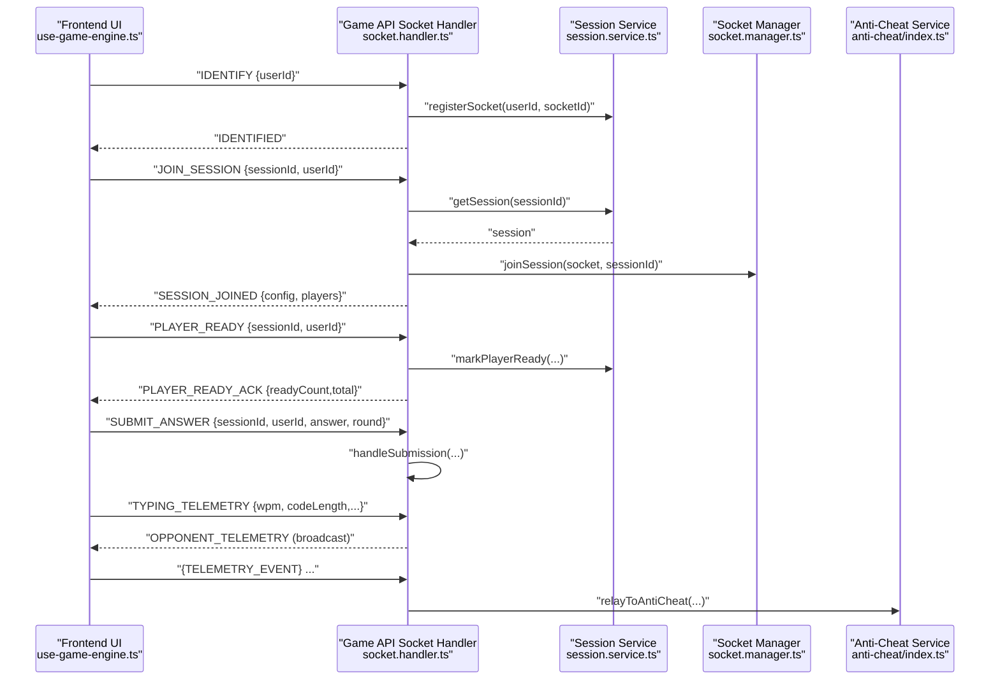
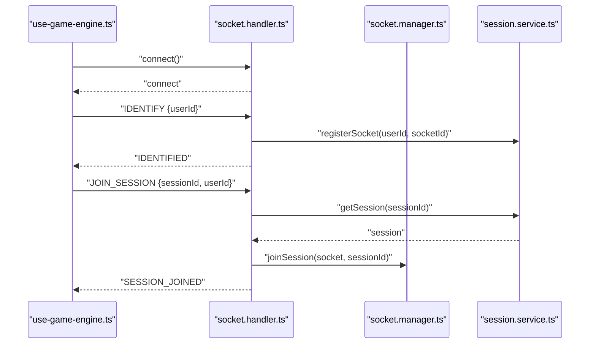
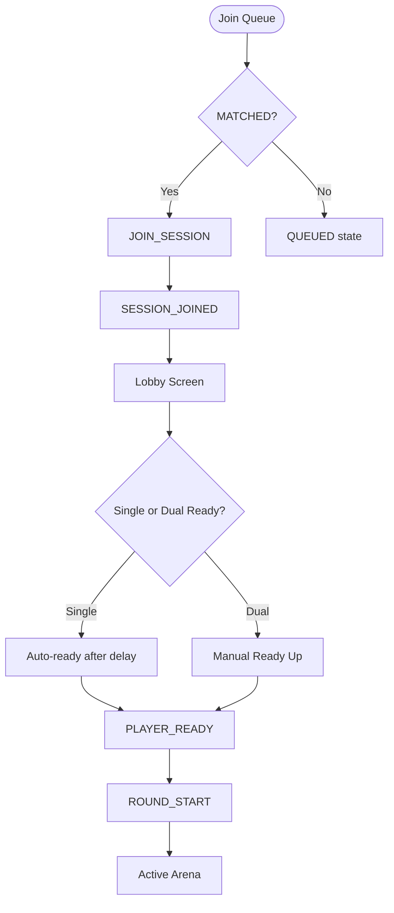
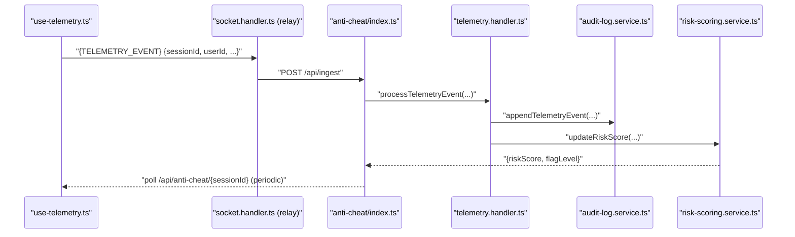
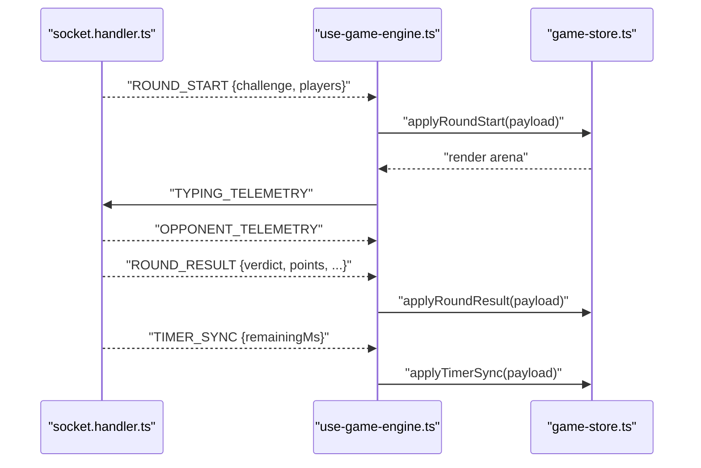
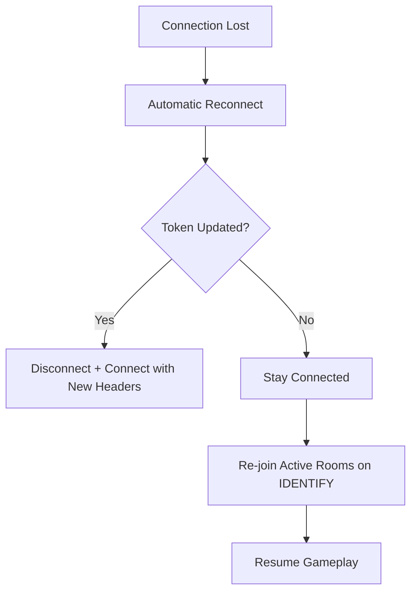
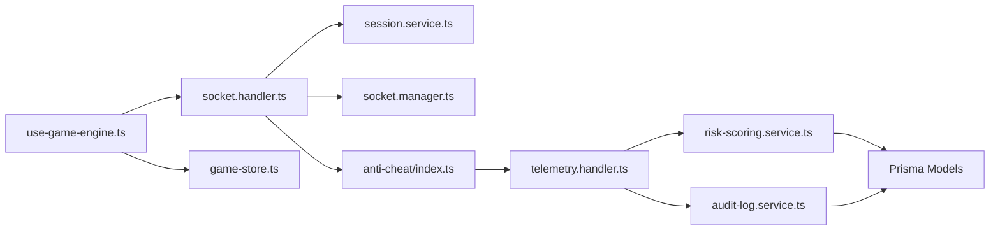

# Real-time Communication

<cite>
**Referenced Files in This Document**
- [apps/game-api/src/websocket/socket.handler.ts](file://apps/game-api/src/websocket/socket.handler.ts)
- [apps/game-api/src/websocket/socket.manager.ts](file://apps/game-api/src/websocket/socket.manager.ts)
- [apps/game-api/src/services/session.service.ts](file://apps/game-api/src/services/session.service.ts)
- [apps/web/hooks/use-game-engine.ts](file://apps/web/hooks/use-game-engine.ts)
- [apps/web/store/game-store.ts](file://apps/web/store/game-store.ts)
- [apps/web/components/game/lobby.tsx](file://apps/web/components/game/lobby.tsx)
- [apps/web/components/game/arena.tsx](file://apps/web/components/game/arena.tsx)
- [apps/anti-cheat/src/index.ts](file://apps/anti-cheat/src/index.ts)
- [apps/anti-cheat/src/handlers/telemetry.handler.ts](file://apps/anti-cheat/src/handlers/telemetry.handler.ts)
- [apps/anti-cheat/src/services/risk-scoring.service.ts](file://apps/anti-cheat/src/services/risk-scoring.service.ts)
- [apps/anti-cheat/src/services/audit-log.service.ts](file://apps/anti-cheat/src/services/audit-log.service.ts)
- [apps/web/hooks/use-telemetry.ts](file://apps/web/hooks/use-telemetry.ts)
- [apps/web/store/anti-cheat-store.ts](file://apps/web/store/anti-cheat-store.ts)
- [packages/db/prisma/schema.prisma](file://packages/db/prisma/schema.prisma)
- [packages/types/src/anti-cheat.ts](file://packages/types/src/anti-cheat.ts)
</cite>

## Table of Contents
1. [Introduction](#introduction)
2. [Project Structure](#project-structure)
3. [Core Components](#core-components)
4. [Architecture Overview](#architecture-overview)
5. [Detailed Component Analysis](#detailed-component-analysis)
6. [Dependency Analysis](#dependency-analysis)
7. [Performance Considerations](#performance-considerations)
8. [Troubleshooting Guide](#troubleshooting-guide)
9. [Conclusion](#conclusion)
10. [Appendices](#appendices)

## Introduction
This document explains the real-time communication system powering live matches, lobby orchestration, anti-cheat telemetry, and session state synchronization. It covers WebSocket integration patterns, connection lifecycle, message handling, telemetry ingestion and scoring, lobby and session management, and robustness strategies such as reconnection, error handling, and fallbacks. It also provides practical guidance for performance optimization, connection pooling, and bandwidth management tailored to the current implementation.

## Project Structure
The real-time stack spans three primary areas:
- Frontend React hooks and stores driving WebSocket events and UI state
- Game API backend handling matchmaking, sessions, rounds, and broadcasting
- Anti-cheat service ingesting telemetry, maintaining audit logs, and computing risk scores

**Diagram sources**
- [apps/web/hooks/use-game-engine.ts](file://apps/web/hooks/use-game-engine.ts#L36-L53)
- [apps/game-api/src/websocket/socket.handler.ts](file://apps/game-api/src/websocket/socket.handler.ts#L62-L309)
- [apps/game-api/src/websocket/socket.manager.ts](file://apps/game-api/src/websocket/socket.manager.ts#L1-L38)
- [apps/game-api/src/services/session.service.ts](file://apps/game-api/src/services/session.service.ts#L18-L166)
- [apps/anti-cheat/src/index.ts](file://apps/anti-cheat/src/index.ts#L1-L35)
- [apps/anti-cheat/src/handlers/telemetry.handler.ts](file://apps/anti-cheat/src/handlers/telemetry.handler.ts#L1-L82)
- [apps/anti-cheat/src/services/risk-scoring.service.ts](file://apps/anti-cheat/src/services/risk-scoring.service.ts#L1-L76)
- [apps/anti-cheat/src/services/audit-log.service.ts](file://apps/anti-cheat/src/services/audit-log.service.ts#L1-L19)
- [packages/db/prisma/schema.prisma](file://packages/db/prisma/schema.prisma#L207-L249)
- [packages/types/src/anti-cheat.ts](file://packages/types/src/anti-cheat.ts#L1-L24)

**Section sources**
- [apps/web/hooks/use-game-engine.ts](file://apps/web/hooks/use-game-engine.ts#L1-L466)
- [apps/game-api/src/websocket/socket.handler.ts](file://apps/game-api/src/websocket/socket.handler.ts#L1-L310)
- [apps/anti-cheat/src/index.ts](file://apps/anti-cheat/src/index.ts#L1-L35)

## Core Components
- Frontend WebSocket orchestration and state:
  - Singleton Socket.io client with token injection and reconnection
  - Event listeners for lobby, round lifecycle, timers, and anti-cheat telemetry
  - Zustand stores for game and anti-cheat state
- Backend WebSocket handlers:
  - Connection lifecycle, identification, session joining, readiness gating, and round orchestration
  - Relay of anti-cheat telemetry to dedicated service
  - Room-based broadcasting and session persistence via Redis
- Anti-cheat telemetry pipeline:
  - Audit logging and risk scoring with threshold-based flagging
  - Real-time telemetry ingestion and periodic risk score polling

**Section sources**
- [apps/web/hooks/use-game-engine.ts](file://apps/web/hooks/use-game-engine.ts#L36-L53)
- [apps/web/store/game-store.ts](file://apps/web/store/game-store.ts#L77-L141)
- [apps/web/store/anti-cheat-store.ts](file://apps/web/store/anti-cheat-store.ts#L20-L33)
- [apps/game-api/src/websocket/socket.handler.ts](file://apps/game-api/src/websocket/socket.handler.ts#L62-L309)
- [apps/game-api/src/websocket/socket.manager.ts](file://apps/game-api/src/websocket/socket.manager.ts#L1-L38)
- [apps/game-api/src/services/session.service.ts](file://apps/game-api/src/services/session.service.ts#L18-L166)
- [apps/anti-cheat/src/handlers/telemetry.handler.ts](file://apps/anti-cheat/src/handlers/telemetry.handler.ts#L30-L51)
- [apps/anti-cheat/src/services/risk-scoring.service.ts](file://apps/anti-cheat/src/services/risk-scoring.service.ts#L18-L75)
- [apps/anti-cheat/src/services/audit-log.service.ts](file://apps/anti-cheat/src/services/audit-log.service.ts#L4-L18)

## Architecture Overview
The system integrates frontend, backend, and anti-cheat services around a central WebSocket bus. The frontend emits commands and receives state updates; the backend coordinates sessions and broadcasts; the anti-cheat service maintains an append-only audit log and computes risk scores.

**Diagram sources**
- [apps/web/hooks/use-game-engine.ts](file://apps/web/hooks/use-game-engine.ts#L113-L131)
- [apps/game-api/src/websocket/socket.handler.ts](file://apps/game-api/src/websocket/socket.handler.ts#L72-L106)
- [apps/game-api/src/websocket/socket.handler.ts](file://apps/game-api/src/websocket/socket.handler.ts#L111-L157)
- [apps/game-api/src/websocket/socket.handler.ts](file://apps/game-api/src/websocket/socket.handler.ts#L162-L202)
- [apps/game-api/src/websocket/socket.handler.ts](file://apps/game-api/src/websocket/socket.handler.ts#L273-L289)
- [apps/game-api/src/websocket/socket.handler.ts](file://apps/game-api/src/websocket/socket.handler.ts#L206-L240)
- [apps/game-api/src/websocket/socket.handler.ts](file://apps/game-api/src/websocket/socket.handler.ts#L292-L297)
- [apps/anti-cheat/src/index.ts](file://apps/anti-cheat/src/index.ts#L24-L29)

## Detailed Component Analysis

### WebSocket Integration Patterns and Connection Management
- Frontend client initialization:
  - Singleton Socket.io client configured with WebSocket transport, automatic reconnection, and token injection via auth and extraHeaders
  - Token refresh triggers a controlled reconnect to preserve room membership
- Backend connection lifecycle:
  - On connection, clients IDENTIFY themselves; the server registers sockets and re-joins active sessions
  - JOIN_SESSION ensures room membership and emits SESSION_JOINED with serialized session state
  - PLAYER_READY gates round start; once all players are ready, the backend starts the first round
- Room management:
  - Socket manager associates user IDs to socket IDs and supports join/leave operations
  - Session service persists session metadata and player readiness/joined sets in Redis

**Diagram sources**
- [apps/web/hooks/use-game-engine.ts](file://apps/web/hooks/use-game-engine.ts#L36-L53)
- [apps/game-api/src/websocket/socket.handler.ts](file://apps/game-api/src/websocket/socket.handler.ts#L68-L106)
- [apps/game-api/src/websocket/socket.handler.ts](file://apps/game-api/src/websocket/socket.handler.ts#L111-L157)
- [apps/game-api/src/websocket/socket.manager.ts](file://apps/game-api/src/websocket/socket.manager.ts#L32-L38)
- [apps/game-api/src/services/session.service.ts](file://apps/game-api/src/services/session.service.ts#L62-L90)

**Section sources**
- [apps/web/hooks/use-game-engine.ts](file://apps/web/hooks/use-game-engine.ts#L36-L103)
- [apps/game-api/src/websocket/socket.handler.ts](file://apps/game-api/src/websocket/socket.handler.ts#L68-L106)
- [apps/game-api/src/websocket/socket.manager.ts](file://apps/game-api/src/websocket/socket.manager.ts#L1-L38)
- [apps/game-api/src/services/session.service.ts](file://apps/game-api/src/services/session.service.ts#L62-L90)

### Message Handling and Lobby System
- Lobby orchestration:
  - SINGLE mode auto-readies after a brief countdown; DUAL mode waits for both players to click Ready Up
  - The frontend listens for MATCHED and SESSION_JOINED to transition into the lobby
- Session state synchronization:
  - The backend serializes player data and broadcasts round lifecycle events
  - The frontend store applies payloads atomically and renders lobby/arena accordingly

**Diagram sources**
- [apps/web/components/game/lobby.tsx](file://apps/web/components/game/lobby.tsx#L9-L29)
- [apps/web/hooks/use-game-engine.ts](file://apps/web/hooks/use-game-engine.ts#L168-L188)
- [apps/game-api/src/websocket/socket.handler.ts](file://apps/game-api/src/websocket/socket.handler.ts#L162-L202)

**Section sources**
- [apps/web/components/game/lobby.tsx](file://apps/web/components/game/lobby.tsx#L9-L161)
- [apps/web/hooks/use-game-engine.ts](file://apps/web/hooks/use-game-engine.ts#L168-L285)
- [apps/game-api/src/websocket/socket.handler.ts](file://apps/game-api/src/websocket/socket.handler.ts#L108-L202)

### Anti-Cheat Telemetry Pipeline
- Frontend telemetry:
  - Detects focus loss, paste/copy, mouse inactivity, and keystroke bursts; emits events with sessionId and candidateId
  - Maintains a local warning store and periodically polls risk score from the anti-cheat API
- Backend relay:
  - The game API relays telemetry events to the anti-cheat service endpoint
- Anti-cheat processing:
  - Audit log append-only entries
  - Risk score updates with weights and threshold-based flagging
  - Prisma schema defines models for risk scores, telemetry events, and flags

**Diagram sources**
- [apps/web/hooks/use-telemetry.ts](file://apps/web/hooks/use-telemetry.ts#L35-L54)
- [apps/game-api/src/websocket/socket.handler.ts](file://apps/game-api/src/websocket/socket.handler.ts#L19-L60)
- [apps/anti-cheat/src/index.ts](file://apps/anti-cheat/src/index.ts#L24-L29)
- [apps/anti-cheat/src/handlers/telemetry.handler.ts](file://apps/anti-cheat/src/handlers/telemetry.handler.ts#L30-L51)
- [apps/anti-cheat/src/services/audit-log.service.ts](file://apps/anti-cheat/src/services/audit-log.service.ts#L4-L18)
- [apps/anti-cheat/src/services/risk-scoring.service.ts](file://apps/anti-cheat/src/services/risk-scoring.service.ts#L18-L75)
- [apps/web/components/game/anti-cheat-hud.tsx](file://apps/web/components/game/anti-cheat-hud.tsx#L37-L57)

**Section sources**
- [apps/web/hooks/use-telemetry.ts](file://apps/web/hooks/use-telemetry.ts#L1-L157)
- [apps/game-api/src/websocket/socket.handler.ts](file://apps/game-api/src/websocket/socket.handler.ts#L19-L60)
- [apps/anti-cheat/src/handlers/telemetry.handler.ts](file://apps/anti-cheat/src/handlers/telemetry.handler.ts#L30-L82)
- [apps/anti-cheat/src/services/audit-log.service.ts](file://apps/anti-cheat/src/services/audit-log.service.ts#L1-L19)
- [apps/anti-cheat/src/services/risk-scoring.service.ts](file://apps/anti-cheat/src/services/risk-scoring.service.ts#L1-L76)
- [apps/web/store/anti-cheat-store.ts](file://apps/web/store/anti-cheat-store.ts#L20-L108)
- [packages/db/prisma/schema.prisma](file://packages/db/prisma/schema.prisma#L207-L249)
- [packages/types/src/anti-cheat.ts](file://packages/types/src/anti-cheat.ts#L1-L24)

### Real-time State Synchronization and Event Propagation
- Round lifecycle:
  - ROUND_START initializes challenge and timers; ROUND_RESULT records outcomes and updates histories
  - TIMER_SYNC keeps local clocks aligned; TIMER_EXPIRED forces zero-time updates
- Dual-mode telemetry:
  - TYPING_TELEMETRY broadcasts opponent progress and speed metrics
- Session termination:
  - SESSION_END and SESSION_ABORTED finalize state and reset UI

**Diagram sources**
- [apps/game-api/src/websocket/socket.handler.ts](file://apps/game-api/src/websocket/socket.handler.ts#L159-L202)
- [apps/game-api/src/websocket/socket.handler.ts](file://apps/game-api/src/websocket/socket.handler.ts#L206-L240)
- [apps/web/hooks/use-game-engine.ts](file://apps/web/hooks/use-game-engine.ts#L190-L236)
- [apps/web/store/game-store.ts](file://apps/web/store/game-store.ts#L263-L340)

**Section sources**
- [apps/game-api/src/websocket/socket.handler.ts](file://apps/game-api/src/websocket/socket.handler.ts#L159-L240)
- [apps/web/hooks/use-game-engine.ts](file://apps/web/hooks/use-game-engine.ts#L190-L285)
- [apps/web/store/game-store.ts](file://apps/web/store/game-store.ts#L263-L394)

### Connection Recovery Strategies, Error Handling, and Fallbacks
- Reconnection:
  - Frontend enables automatic reconnection with bounded attempts and delays
  - Token updates trigger a reconnect to maintain Authorization headers
- Graceful degradation:
  - Anti-cheat polling continues even if real-time relay fails
  - Session errors are surfaced to the lobby with retry/reset actions
- Room membership recovery:
  - After reconnect, the server re-joins active sessions and re-emits MATCHED if needed

**Diagram sources**
- [apps/web/hooks/use-game-engine.ts](file://apps/web/hooks/use-game-engine.ts#L42-L46)
- [apps/web/hooks/use-game-engine.ts](file://apps/web/hooks/use-game-engine.ts#L61-L77)
- [apps/game-api/src/websocket/socket.handler.ts](file://apps/game-api/src/websocket/socket.handler.ts#L78-L101)

**Section sources**
- [apps/web/hooks/use-game-engine.ts](file://apps/web/hooks/use-game-engine.ts#L42-L77)
- [apps/game-api/src/websocket/socket.handler.ts](file://apps/game-api/src/websocket/socket.handler.ts#L78-L101)
- [apps/web/components/game/lobby.tsx](file://apps/web/components/game/lobby.tsx#L33-L61)

### Examples of Real-time Data Binding, Event Listeners, and State Updates
- Real-time data binding:
  - Frontend stores expose reactive fields for session, rounds, timers, and opponent telemetry
  - UI components subscribe to store slices and render updates
- Event listeners:
  - use-game-engine attaches listeners for IDENTIFIED, MATCHED, SESSION_JOINED, PLAYER_READY_ACK, ROUND_START, ROUND_RESULT, TIMER_SYNC, OPPONENT_TELEMETRY, and session errors
- State updates:
  - Stores define reducers to apply payloads and compute derived UI states

**Section sources**
- [apps/web/store/game-store.ts](file://apps/web/store/game-store.ts#L77-L141)
- [apps/web/hooks/use-game-engine.ts](file://apps/web/hooks/use-game-engine.ts#L162-L285)
- [apps/web/components/game/arena.tsx](file://apps/web/components/game/arena.tsx#L48-L96)

## Dependency Analysis
The system exhibits clear separation of concerns:
- Frontend depends on backend WebSocket handlers and stores
- Backend depends on session service and socket manager for room orchestration
- Anti-cheat service depends on audit and risk services backed by Prisma models

**Diagram sources**
- [apps/web/hooks/use-game-engine.ts](file://apps/web/hooks/use-game-engine.ts#L1-L17)
- [apps/game-api/src/websocket/socket.handler.ts](file://apps/game-api/src/websocket/socket.handler.ts#L1-L8)
- [apps/game-api/src/websocket/socket.manager.ts](file://apps/game-api/src/websocket/socket.manager.ts#L1-L38)
- [apps/game-api/src/services/session.service.ts](file://apps/game-api/src/services/session.service.ts#L1-L166)
- [apps/anti-cheat/src/index.ts](file://apps/anti-cheat/src/index.ts#L1-L35)
- [apps/anti-cheat/src/handlers/telemetry.handler.ts](file://apps/anti-cheat/src/handlers/telemetry.handler.ts#L1-L82)
- [apps/anti-cheat/src/services/audit-log.service.ts](file://apps/anti-cheat/src/services/audit-log.service.ts#L1-L19)
- [apps/anti-cheat/src/services/risk-scoring.service.ts](file://apps/anti-cheat/src/services/risk-scoring.service.ts#L1-L76)
- [packages/db/prisma/schema.prisma](file://packages/db/prisma/schema.prisma#L207-L249)

**Section sources**
- [apps/web/hooks/use-game-engine.ts](file://apps/web/hooks/use-game-engine.ts#L1-L17)
- [apps/game-api/src/websocket/socket.handler.ts](file://apps/game-api/src/websocket/socket.handler.ts#L1-L8)
- [apps/anti-cheat/src/handlers/telemetry.handler.ts](file://apps/anti-cheat/src/handlers/telemetry.handler.ts#L1-L82)

## Performance Considerations
- Bandwidth management:
  - Throttle telemetry emissions (e.g., typing telemetry interval) to reduce payload frequency
  - Use compact payloads and avoid redundant fields
- Connection pooling and scaling:
  - Socket.io cluster-compatible deployments can scale horizontally behind a load balancer
  - Keep-alive and heartbeat settings should align with expected traffic patterns
- Storage and caching:
  - Redis-backed session state minimizes database load; tune TTLs and eviction policies
  - Anti-cheat audit logs are append-only; ensure indexing on sessionId, candidateId, and timestamps
- Latency-sensitive events:
  - Prioritize round start/end and timer sync to maintain fairness
  - Debounce UI updates to prevent excessive re-renders during rapid telemetry bursts

[No sources needed since this section provides general guidance]

## Troubleshooting Guide
- Connection issues:
  - Verify Authorization headers are present on polling requests; the gateway middleware requires Bearer tokens
  - Check reconnection attempts and delays; force reconnect if needed
- Session errors:
  - SESSION_ERROR messages indicate server-side failures; display retry/reset options in the lobby
- Anti-cheat telemetry:
  - If relay fails, confirm the anti-cheat service is reachable and the ingest endpoint responds
  - Local warnings persist even if remote scoring is unavailable; poll risk score periodically
- Race conditions:
  - The frontend waits for the last round result before applying SESSION_END to avoid inconsistent UI

**Section sources**
- [apps/web/hooks/use-game-engine.ts](file://apps/web/hooks/use-game-engine.ts#L90-L103)
- [apps/web/hooks/use-game-engine.ts](file://apps/web/hooks/use-game-engine.ts#L180-L183)
- [apps/game-api/src/websocket/socket.handler.ts](file://apps/game-api/src/websocket/socket.handler.ts#L44-L60)
- [apps/web/components/game/anti-cheat-hud.tsx](file://apps/web/components/game/anti-cheat-hud.tsx#L37-L57)

## Conclusion
The real-time communication system integrates a resilient WebSocket backbone with explicit session orchestration, robust lobby UX, and a scalable anti-cheat telemetry pipeline. By leveraging room-based broadcasting, token-injected connections, and state-driven UI updates, it delivers responsive multiplayer experiences with strong operational safeguards.

[No sources needed since this section summarizes without analyzing specific files]

## Appendices

### API and Event Reference
- Frontend events emitted:
  - IDENTIFY, JOIN_SESSION, PLAYER_READY, SUBMIT_ANSWER, TYPING_TELEMETRY, {TELEMETRY_EVENT}
- Backend events emitted:
  - IDENTIFIED, MATCHED, SESSION_JOINED, PLAYER_READY_ACK, ROUND_START, ROUND_RESULT, TIMER_SYNC, TIMER_EXPIRED, OPPONENT_PROGRESS, OPPONENT_TELEMETRY, SESSION_END, SESSION_ABORTED, ERROR, SURVIVAL_CONTINUE, SURVIVAL_ENDED, SURVIVAL_QUEUED

**Section sources**
- [apps/web/hooks/use-game-engine.ts](file://apps/web/hooks/use-game-engine.ts#L162-L285)
- [apps/game-api/src/websocket/socket.handler.ts](file://apps/game-api/src/websocket/socket.handler.ts#L62-L309)