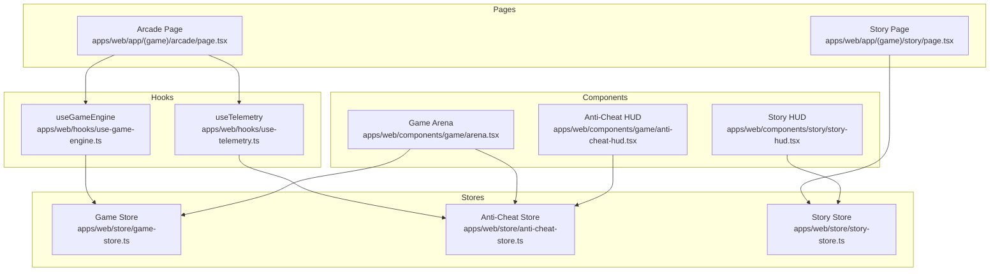
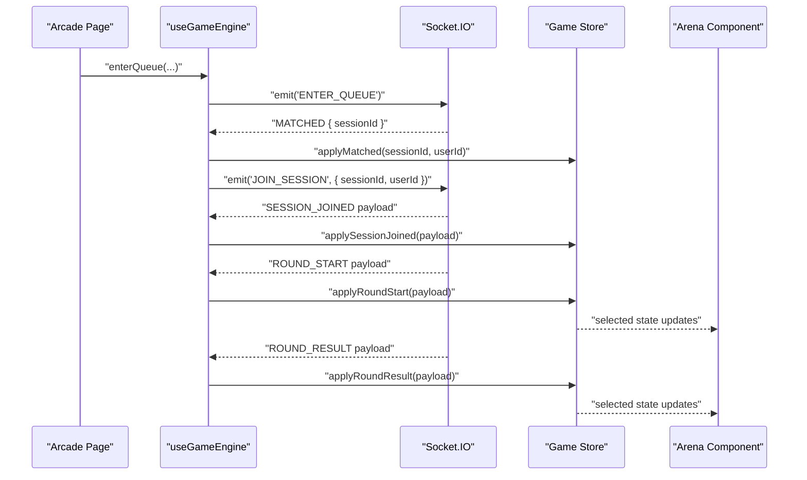
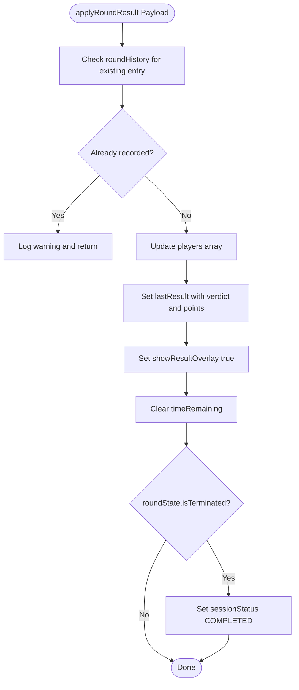
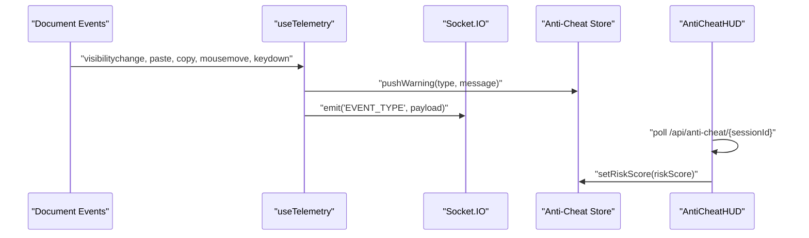
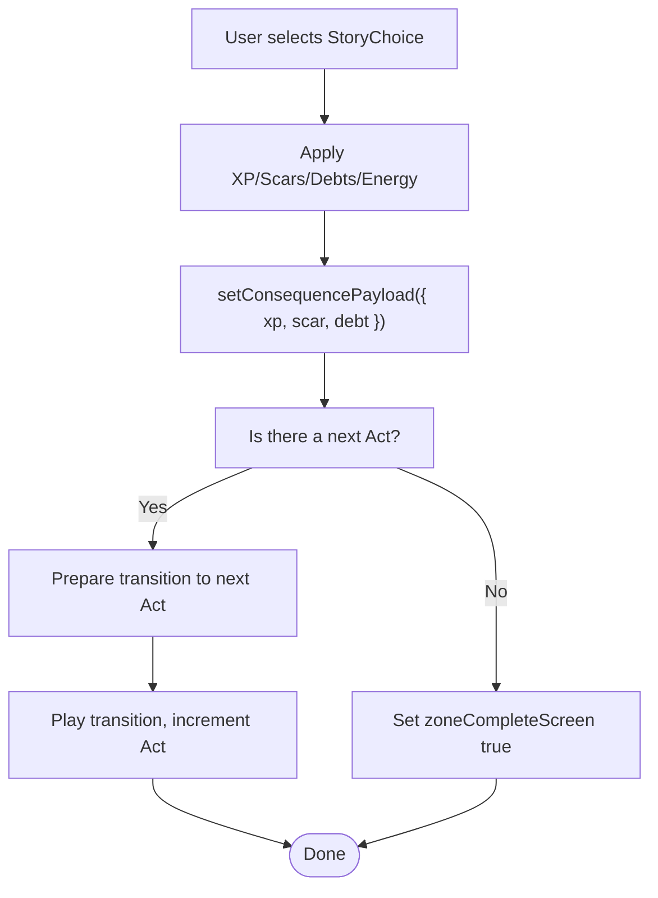
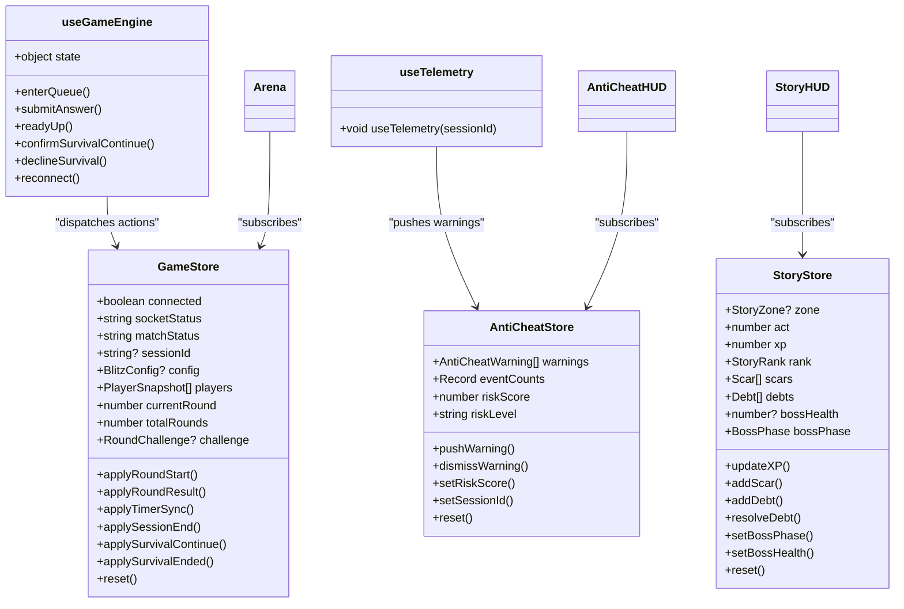
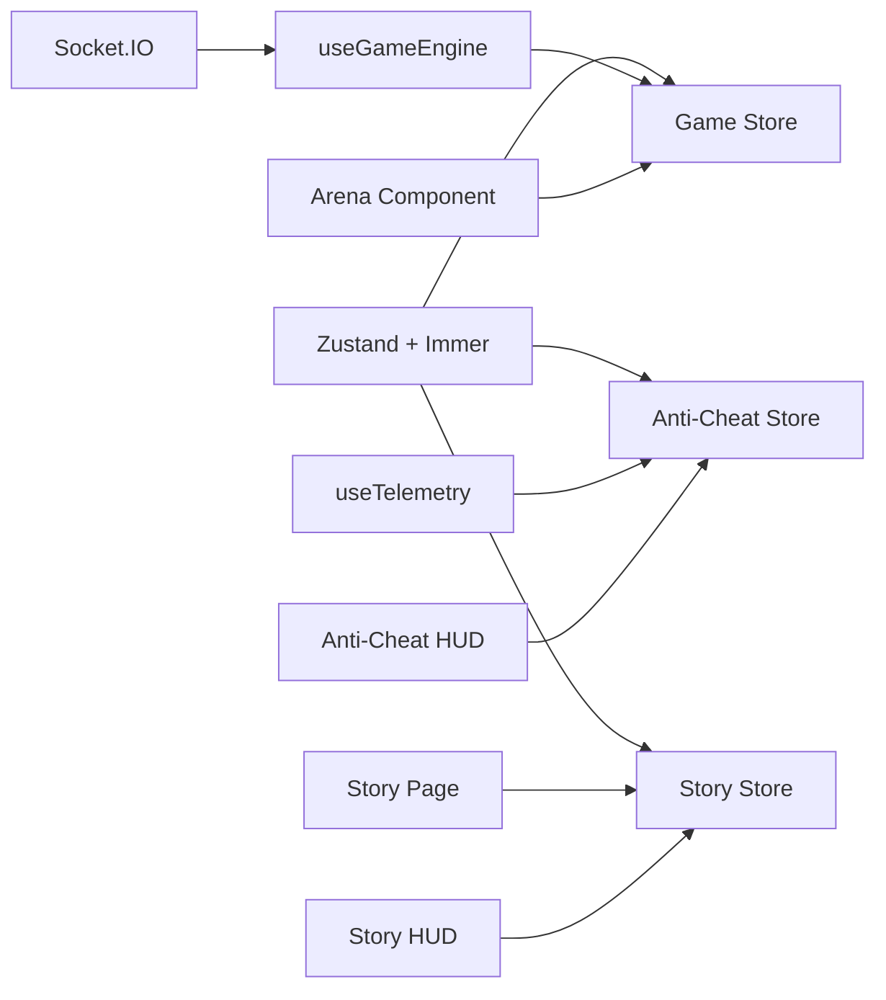

# State Management with Zustand

<cite>
**Referenced Files in This Document**
- [game-store.ts](file://apps/web/store/game-store.ts)
- [anti-cheat-store.ts](file://apps/web/store/anti-cheat-store.ts)
- [story-store.ts](file://apps/web/store/story-store.ts)
- [use-game-engine.ts](file://apps/web/hooks/use-game-engine.ts)
- [use-telemetry.ts](file://apps/web/hooks/use-telemetry.ts)
- [arena.tsx](file://apps/web/components/game/arena.tsx)
- [anti-cheat-hud.tsx](file://apps/web/components/game/anti-cheat-hud.tsx)
- [story-hud.tsx](file://apps/web/components/story/story-hud.tsx)
- [page.tsx (Arcade)](file://apps/web/app/(game)/arcade/page.tsx)
- [page.tsx (Story)](file://apps/web/app/(game)/story/page.tsx)
- [Provider.tsx](file://apps/web/components/Provider.tsx)
- [DEBUGGING_GUIDE.md](file://DEBUGGING_GUIDE.md)
</cite>

## Table of Contents
1. [Introduction](#introduction)
2. [Project Structure](#project-structure)
3. [Core Components](#core-components)
4. [Architecture Overview](#architecture-overview)
5. [Detailed Component Analysis](#detailed-component-analysis)
6. [Dependency Analysis](#dependency-analysis)
7. [Performance Considerations](#performance-considerations)
8. [Troubleshooting Guide](#troubleshooting-guide)
9. [Conclusion](#conclusion)

## Introduction
This document explains the Zustand-based state management system powering the Logic Forge web application. It covers:
- Game store for managing match lifecycle, player progress, timers, and survival mechanics
- Anti-cheat store for telemetry monitoring and risk assessment
- Story store for narrative progression, character development, and gamification
- State initialization, actions, selectors, and middleware usage
- Integration with React hooks and components
- Examples of state updates, subscriptions, and cross-component sharing
- Persistence, debugging techniques, and performance optimization strategies

## Project Structure
The state management is implemented with Zustand stores under the web application:
- Game state: [game-store.ts](file://apps/web/store/game-store.ts)
- Anti-cheat telemetry: [anti-cheat-store.ts](file://apps/web/store/anti-cheat-store.ts)
- Story/narrative state: [story-store.ts](file://apps/web/store/story-store.ts)

React hooks orchestrate WebSocket events and integrate stores:
- Game engine and socket handling: [use-game-engine.ts](file://apps/web/hooks/use-game-engine.ts)
- Anti-cheat telemetry collection: [use-telemetry.ts](file://apps/web/hooks/use-telemetry.ts)

UI components subscribe to stores and render state:
- Game arena and HUD: [arena.tsx](file://apps/web/components/game/arena.tsx), [anti-cheat-hud.tsx](file://apps/web/components/game/anti-cheat-hud.tsx)
- Story HUD and narrator: [story-hud.tsx](file://apps/web/components/story/story-hud.tsx), [story-narrator.tsx](file://apps/web/components/story/story-narrator.tsx)
- Page-level orchestration: [page.tsx (Arcade)](file://apps/web/app/(game)/arcade/page.tsx), [page.tsx (Story)](file://apps/web/app/(game)/story/page.tsx)

**Diagram sources**
- [game-store.ts](file://apps/web/store/game-store.ts#L77-L141)
- [anti-cheat-store.ts](file://apps/web/store/anti-cheat-store.ts#L20-L33)
- [story-store.ts](file://apps/web/store/story-store.ts#L42-L112)
- [use-game-engine.ts](file://apps/web/hooks/use-game-engine.ts#L80-L466)
- [use-telemetry.ts](file://apps/web/hooks/use-telemetry.ts#L19-L157)
- [arena.tsx](file://apps/web/components/game/arena.tsx#L48-L395)
- [anti-cheat-hud.tsx](file://apps/web/components/game/anti-cheat-hud.tsx#L29-L129)
- [story-hud.tsx](file://apps/web/components/story/story-hud.tsx#L30-L178)
- [page.tsx (Arcade)](file://apps/web/app/(game)/arcade/page.tsx#L492-L821)
- [page.tsx (Story)](file://apps/web/app/(game)/story/page.tsx#L46-L187)

**Section sources**
- [game-store.ts](file://apps/web/store/game-store.ts#L1-L394)
- [anti-cheat-store.ts](file://apps/web/store/anti-cheat-store.ts#L1-L108)
- [story-store.ts](file://apps/web/store/story-store.ts#L1-L308)
- [use-game-engine.ts](file://apps/web/hooks/use-game-engine.ts#L1-L466)
- [use-telemetry.ts](file://apps/web/hooks/use-telemetry.ts#L1-L157)
- [arena.tsx](file://apps/web/components/game/arena.tsx#L1-L395)
- [anti-cheat-hud.tsx](file://apps/web/components/game/anti-cheat-hud.tsx#L1-L129)
- [story-hud.tsx](file://apps/web/components/story/story-hud.tsx#L1-L178)
- [page.tsx (Arcade)](file://apps/web/app/(game)/arcade/page.tsx#L1-L821)
- [page.tsx (Story)](file://apps/web/app/(game)/story/page.tsx#L1-L187)

## Core Components
- Game Store
  - Manages session lifecycle, match status, player snapshots, round history, timers, and survival mechanics
  - Uses Immer middleware for immutable updates
  - Exposes actions like applyRoundStart, applyRoundResult, applyTimerSync, applySessionEnd, applySurvivalContinue, applySurvivalEnded, and reset
  - Provides selectors for UI components to subscribe to subsets of state

- Anti-Cheat Store
  - Tracks warnings, event counts, risk score, and risk level
  - Emits pushWarning, dismissWarning, setRiskScore, setSessionId, and reset
  - Integrates with telemetry hook and periodic polling from the anti-cheat API

- Story Store
  - Drives narrative progression, character stats, boss combat, and gamification
  - Includes actions for starting zones, unlocking achievements, updating XP, adding scars/debts, managing chat streaming, and handling choices
  - Computes rank based on XP thresholds and exposes selectors for HUD components

**Section sources**
- [game-store.ts](file://apps/web/store/game-store.ts#L77-L141)
- [anti-cheat-store.ts](file://apps/web/store/anti-cheat-store.ts#L20-L33)
- [story-store.ts](file://apps/web/store/story-store.ts#L42-L112)

## Architecture Overview
The system integrates React hooks with Zustand stores and Socket.IO for real-time updates. The game engine manages WebSocket connections, translates server events into store actions, and exposes a cohesive API to components. Anti-cheat telemetry is collected via a dedicated hook and synchronized with the anti-cheat store. Story state is consumed by narrative components to drive dialogue, choices, and UI overlays.

**Diagram sources**
- [use-game-engine.ts](file://apps/web/hooks/use-game-engine.ts#L113-L131)
- [use-game-engine.ts](file://apps/web/hooks/use-game-engine.ts#L185-L198)
- [use-game-engine.ts](file://apps/web/hooks/use-game-engine.ts#L194-L196)
- [game-store.ts](file://apps/web/store/game-store.ts#L236-L250)
- [game-store.ts](file://apps/web/store/game-store.ts#L263-L284)
- [game-store.ts](file://apps/web/store/game-store.ts#L286-L335)
- [arena.tsx](file://apps/web/components/game/arena.tsx#L48-L395)

**Section sources**
- [use-game-engine.ts](file://apps/web/hooks/use-game-engine.ts#L80-L285)
- [game-store.ts](file://apps/web/store/game-store.ts#L221-L393)
- [arena.tsx](file://apps/web/components/game/arena.tsx#L48-L395)

## Detailed Component Analysis

### Game Store
- Initialization
  - initialState defines defaults for connection status, match/session states, player arrays, timers, and survival metrics
- Actions
  - Connection and match: setConnected, setSocketStatus, setMatchStatus, applyMatched, setQueuedUserId, setQueueError
  - Session lifecycle: applySessionJoined, applyPlayerConnected, applySessionEnd, applySessionAborted, applyError
  - Rounds: applyRoundStart, applyRoundResult, applyTimerSync, dismissResultOverlay
  - Opponent telemetry: applyOpponentProgress, applyOpponentTelemetry
  - Survival: incrementStreak, resetSurvival, applySurvivalBonus, applySurvivalContinue, applySurvivalEnded
  - Reset: reset to initialState
- Middleware
  - Immer middleware enables concise immutable updates using a draft-like pattern
- Selectors in components
  - Components subscribe to slices of state (e.g., roundHistory, config, survivalActive) to minimize re-renders

**Diagram sources**
- [game-store.ts](file://apps/web/store/game-store.ts#L286-L335)

**Section sources**
- [game-store.ts](file://apps/web/store/game-store.ts#L191-L219)
- [game-store.ts](file://apps/web/store/game-store.ts#L221-L393)
- [arena.tsx](file://apps/web/components/game/arena.tsx#L69-L126)

### Anti-Cheat Store
- Responsibilities
  - Maintain warnings queue, event counters, risk score, and risk level
  - Push and dismiss warnings, update risk score, manage session scoping, and reset state
- Integration
  - useTelemetry pushes warnings and emits telemetry events to the server
  - AntiCheatHUD polls the anti-cheat API to update risk score periodically
- Risk computation
  - riskLevel maps numeric scores to SAFE/SUSPICIOUS/MEDIUM/HIGH buckets

**Diagram sources**
- [use-telemetry.ts](file://apps/web/hooks/use-telemetry.ts#L35-L54)
- [use-telemetry.ts](file://apps/web/hooks/use-telemetry.ts#L56-L155)
- [anti-cheat-store.ts](file://apps/web/store/anti-cheat-store.ts#L51-L107)
- [anti-cheat-hud.tsx](file://apps/web/components/game/anti-cheat-hud.tsx#L37-L57)

**Section sources**
- [anti-cheat-store.ts](file://apps/web/store/anti-cheat-store.ts#L20-L107)
- [use-telemetry.ts](file://apps/web/hooks/use-telemetry.ts#L19-L157)
- [anti-cheat-hud.tsx](file://apps/web/components/game/anti-cheat-hud.tsx#L29-L129)

### Story Store
- State model
  - Zone/Act progression, XP and rank, scars and debts, boss health/phases, achievements, chat streaming, choices, audio intensity
- Actions
  - Zone lifecycle: startZone, setZoneCompleted
  - Progression: updateXP, setRank, addScar, addDebt, resolveDebt, setAct
  - Boss: setBossPhase, setBossHealth
  - Energy meter (zone-specific): applyEnergyDelta, setEnergyMeter
  - Chat: setStreaming, setStreamingText, appendStreamingText, commitAssistantMessage, addUserMessage
  - UI overlays: setConsequencePayload, clearConsequencePayload, setShowRankUp, clearShowRankUp, setShowBossGate, setZoneCompleteScreen, incrementActStreak
  - Reset: reset retains completion and achievements
- Rank computation
  - computeRank derives rank from XP thresholds

**Diagram sources**
- [story-store.ts](file://apps/web/store/story-store.ts#L175-L307)
- [story-narrator.tsx](file://apps/web/components/story/story-narrator.tsx#L109-L165)

**Section sources**
- [story-store.ts](file://apps/web/store/story-store.ts#L42-L307)
- [story-hud.tsx](file://apps/web/components/story/story-hud.tsx#L30-L178)
- [story-narrator.tsx](file://apps/web/components/story/story-narrator.tsx#L17-L42)

### Integration with React Hooks and Components
- useGameEngine
  - Creates/updates Socket.IO connection, injects auth token, listens to server events, and dispatches store actions
  - Exposes state fields and convenience methods (enterQueue, submitAnswer, readyUp, confirmSurvivalContinue, declineSurvival, reconnect)
- useTelemetry
  - Subscribes to document events, pushes warnings to anti-cheat store, and emits telemetry to the server
- Component subscriptions
  - Arena subscribes to game store for challenge, players, timers, and survival state
  - Anti-Cheat HUD subscribes to anti-cheat store for warnings and risk level
  - Story HUD subscribes to story store for XP, rank, and zone/act info

**Diagram sources**
- [game-store.ts](file://apps/web/store/game-store.ts#L77-L141)
- [anti-cheat-store.ts](file://apps/web/store/anti-cheat-store.ts#L20-L33)
- [story-store.ts](file://apps/web/store/story-store.ts#L42-L112)
- [use-game-engine.ts](file://apps/web/hooks/use-game-engine.ts#L416-L466)
- [use-telemetry.ts](file://apps/web/hooks/use-telemetry.ts#L19-L157)
- [arena.tsx](file://apps/web/components/game/arena.tsx#L69-L126)
- [anti-cheat-hud.tsx](file://apps/web/components/game/anti-cheat-hud.tsx#L30-L36)
- [story-hud.tsx](file://apps/web/components/story/story-hud.tsx#L42-L43)

**Section sources**
- [use-game-engine.ts](file://apps/web/hooks/use-game-engine.ts#L80-L466)
- [use-telemetry.ts](file://apps/web/hooks/use-telemetry.ts#L19-L157)
- [arena.tsx](file://apps/web/components/game/arena.tsx#L48-L395)
- [anti-cheat-hud.tsx](file://apps/web/components/game/anti-cheat-hud.tsx#L29-L129)
- [story-hud.tsx](file://apps/web/components/story/story-hud.tsx#L30-L178)

## Dependency Analysis
- Stores depend on Zustand create and Immer middleware
- useGameEngine depends on Socket.IO and consumes game-store actions
- useTelemetry depends on anti-cheat-store and emits to server
- Components depend on specific store selectors to minimize re-renders
- Pages orchestrate hooks and pass sessionId to telemetry

**Diagram sources**
- [game-store.ts](file://apps/web/store/game-store.ts#L3-L4)
- [anti-cheat-store.ts](file://apps/web/store/anti-cheat-store.ts#L3-L4)
- [story-store.ts](file://apps/web/store/story-store.ts#L3-L4)
- [use-game-engine.ts](file://apps/web/hooks/use-game-engine.ts#L5-L6)
- [use-telemetry.ts](file://apps/web/hooks/use-telemetry.ts#L1-L1)
- [arena.tsx](file://apps/web/components/game/arena.tsx#L1-L1)
- [anti-cheat-hud.tsx](file://apps/web/components/game/anti-cheat-hud.tsx#L1-L1)
- [page.tsx (Story)](file://apps/web/app/(game)/story/page.tsx#L1-L1)

**Section sources**
- [game-store.ts](file://apps/web/store/game-store.ts#L3-L4)
- [anti-cheat-store.ts](file://apps/web/store/anti-cheat-store.ts#L3-L4)
- [story-store.ts](file://apps/web/store/story-store.ts#L3-L4)
- [use-game-engine.ts](file://apps/web/hooks/use-game-engine.ts#L5-L6)
- [use-telemetry.ts](file://apps/web/hooks/use-telemetry.ts#L1-L1)
- [arena.tsx](file://apps/web/components/game/arena.tsx#L1-L1)
- [anti-cheat-hud.tsx](file://apps/web/components/game/anti-cheat-hud.tsx#L1-L1)
- [page.tsx (Story)](file://apps/web/app/(game)/story/page.tsx#L1-L1)

## Performance Considerations
- Prefer narrow selectors in components to reduce re-renders
- Use Immer middleware for concise immutable updates without deep cloning
- Throttle telemetry emissions (e.g., typing telemetry interval) to limit network overhead
- Limit warning queue size and auto-dismiss stale warnings to control memory footprint
- Avoid unnecessary store updates by checking current values before setting
- For large histories (roundHistory), consider pagination or trimming older entries if needed

[No sources needed since this section provides general guidance]

## Troubleshooting Guide
- Round advancement issues
  - Verify sequence: ROUND_RESULT → applyRoundResult → ROUND_START → applyRoundStart
  - Check for duplicate results and missing ROUND_START events
  - Review backend logs for challenge exclusion and round scheduling
- Anti-cheat HUD shows inconsistent risk
  - Confirm sessionId is set and polling endpoint returns riskScore
  - Inspect pushWarning and setRiskScore flows
- Story progression stalls
  - Ensure setConsequencePayload clears and transitions trigger incrementActStreak and setAct
  - Validate that next Act exists and setShowBossGate is set appropriately

**Section sources**
- [DEBUGGING_GUIDE.md](file://DEBUGGING_GUIDE.md#L132-L294)
- [use-game-engine.ts](file://apps/web/hooks/use-game-engine.ts#L185-L220)
- [game-store.ts](file://apps/web/store/game-store.ts#L286-L335)
- [anti-cheat-hud.tsx](file://apps/web/components/game/anti-cheat-hud.tsx#L37-L57)
- [story-narrator.tsx](file://apps/web/components/story/story-narrator.tsx#L93-L107)

## Conclusion
The Zustand-based state management in Logic Forge cleanly separates concerns across game, anti-cheat, and story domains. React hooks bridge real-time events and store actions, enabling responsive UIs with minimal boilerplate. By leveraging narrow selectors, throttled telemetry, and structured debugging logs, the system remains maintainable and scalable for complex interactive experiences.