# UI Component Library

<cite>
**Referenced Files in This Document**
- [apps/web/components/ui/index.ts](file://apps/web/components/ui/index.ts)
- [apps/web/components.json](file://apps/web/components.json)
- [apps/web/package.json](file://apps/web/package.json)
- [apps/web/components/ui/button.tsx](file://apps/web/components/ui/button.tsx)
- [apps/web/components/ui/badge.tsx](file://apps/web/components/ui/badge.tsx)
- [apps/web/components/ui/card.tsx](file://apps/web/components/ui/card.tsx)
- [apps/web/components/ui/input.tsx](file://apps/web/components/ui/input.tsx)
- [apps/web/components/ui/dialog.tsx](file://apps/web/components/ui/dialog.tsx)
- [apps/web/components/ui/select.tsx](file://apps/web/components/ui/select.tsx)
- [apps/web/components/ui/tabs.tsx](file://apps/web/components/ui/tabs.tsx)
- [apps/web/components/ui/switch.tsx](file://apps/web/components/ui/switch.tsx)
- [apps/web/components/ui/checkbox.tsx](file://apps/web/components/ui/checkbox.tsx)
- [apps/web/components/ui/toast.tsx](file://apps/web/components/ui/toast.tsx)
- [apps/web/components/ui/toaster.tsx](file://apps/web/components/ui/toaster.tsx)
- [apps/web/lib/utils.ts](file://apps/web/lib/utils.ts)
- [apps/web/global.css](file://apps/web/global.css)
- [apps/web/app/layout.tsx](file://apps/web/app/layout.tsx)
</cite>

## Table of Contents
1. [Introduction](#introduction)
2. [Project Structure](#project-structure)
3. [Core Components](#core-components)
4. [Architecture Overview](#architecture-overview)
5. [Detailed Component Analysis](#detailed-component-analysis)
6. [Dependency Analysis](#dependency-analysis)
7. [Performance Considerations](#performance-considerations)
8. [Troubleshooting Guide](#troubleshooting-guide)
9. [Conclusion](#conclusion)
10. [Appendices](#appendices)

## Introduction
This document describes the shared UI component library used in the web application. It explains the component architecture, the design system built on Tailwind CSS and CSS variables, and the integration with shadcn/ui. It covers reusable component patterns, variant systems, styling conventions, accessibility, responsive design, theming, and performance considerations. It also documents composition patterns, slots, prop forwarding, and practical usage examples for common UI patterns and interactive elements.

## Project Structure
The UI components are organized under a single directory and re-exported via a central index for ergonomic consumption. The design system is configured with Tailwind v4, CSS variables for theming, and shadcn/ui conventions. The library integrates with Radix UI primitives and Lucide icons.

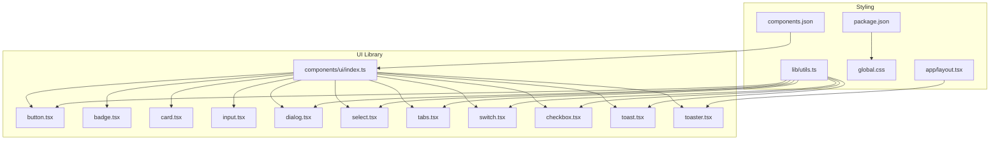

**Diagram sources**
- [apps/web/components/ui/index.ts](file://apps/web/components/ui/index.ts#L1-L90)
- [apps/web/components.json](file://apps/web/components.json#L1-L24)
- [apps/web/package.json](file://apps/web/package.json#L1-L116)
- [apps/web/lib/utils.ts](file://apps/web/lib/utils.ts#L1-L7)
- [apps/web/global.css](file://apps/web/global.css#L1-L190)
- [apps/web/app/layout.tsx](file://apps/web/app/layout.tsx#L1-L53)

**Section sources**
- [apps/web/components/ui/index.ts](file://apps/web/components/ui/index.ts#L1-L90)
- [apps/web/components.json](file://apps/web/components.json#L1-L24)
- [apps/web/package.json](file://apps/web/package.json#L1-L116)

## Core Components
This section summarizes the core building blocks of the UI library and their roles in the design system.

- Button: Variants and sizes with semantic roles, supporting both native button and custom element composition via a slot pattern.
- Badge: Lightweight indicator with color variants.
- Card: Composite layout with header, footer, title, description, and content slots.
- Input: Text input with consistent focus states and responsive sizing.
- Dialog: Modal overlay with animated content, optional close control, and structured header/footer/title/description.
- Select: Composite control with trigger, content, viewport, and item rendering.
- Tabs: Accessible tab list and content areas.
- Switch: Toggle control with primitive styling.
- Checkbox: Interactive checkbox with indicator.
- Toast/Toaster: Notification system with provider and renderer.

Key conventions:
- Variants and sizes are defined via a variant system for consistent styling.
- Composition uses Radix UI primitives for accessibility and interoperability.
- Styling leverages Tailwind utilities merged with CSS variables for theming.

**Section sources**
- [apps/web/components/ui/button.tsx](file://apps/web/components/ui/button.tsx#L1-L53)
- [apps/web/components/ui/badge.tsx](file://apps/web/components/ui/badge.tsx#L1-L36)
- [apps/web/components/ui/card.tsx](file://apps/web/components/ui/card.tsx#L1-L76)
- [apps/web/components/ui/input.tsx](file://apps/web/components/ui/input.tsx#L1-L22)
- [apps/web/components/ui/dialog.tsx](file://apps/web/components/ui/dialog.tsx#L1-L120)
- [apps/web/components/ui/select.tsx](file://apps/web/components/ui/select.tsx#L1-L157)
- [apps/web/components/ui/tabs.tsx](file://apps/web/components/ui/tabs.tsx#L1-L55)
- [apps/web/components/ui/switch.tsx](file://apps/web/components/ui/switch.tsx#L1-L29)
- [apps/web/components/ui/checkbox.tsx](file://apps/web/components/ui/checkbox.tsx#L1-L30)
- [apps/web/components/ui/toast.tsx](file://apps/web/components/ui/toast.tsx#L1-L129)
- [apps/web/components/ui/toaster.tsx](file://apps/web/components/ui/toaster.tsx#L1-L36)

## Architecture Overview
The UI library follows a modular, composable architecture:
- Centralized exports in the index file simplify imports and promote consistent usage.
- Each component encapsulates styling, variants, and composition patterns.
- Utilities consolidate class merging and Tailwind integration.
- Theming is driven by CSS variables and Tailwind v4 tokens.
- Notifications integrate via a provider/renderer pattern.

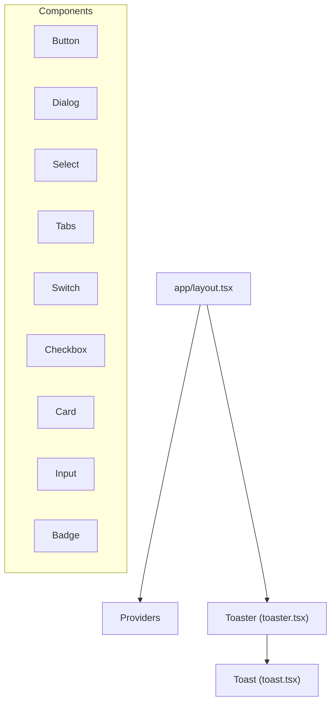

**Diagram sources**
- [apps/web/app/layout.tsx](file://apps/web/app/layout.tsx#L1-L53)
- [apps/web/components/ui/toaster.tsx](file://apps/web/components/ui/toaster.tsx#L1-L36)
- [apps/web/components/ui/toast.tsx](file://apps/web/components/ui/toast.tsx#L1-L129)

## Detailed Component Analysis

### Button
- Purpose: Primary action element with variants and sizes.
- Variants: default, destructive, outline, secondary, ghost, link.
- Sizes: default, sm, lg, icon.
- Composition: Uses a slot to render either a native button or a custom element while forwarding props.
- Accessibility: Inherits focus-visible outlines and ring styles; supports SVG children.

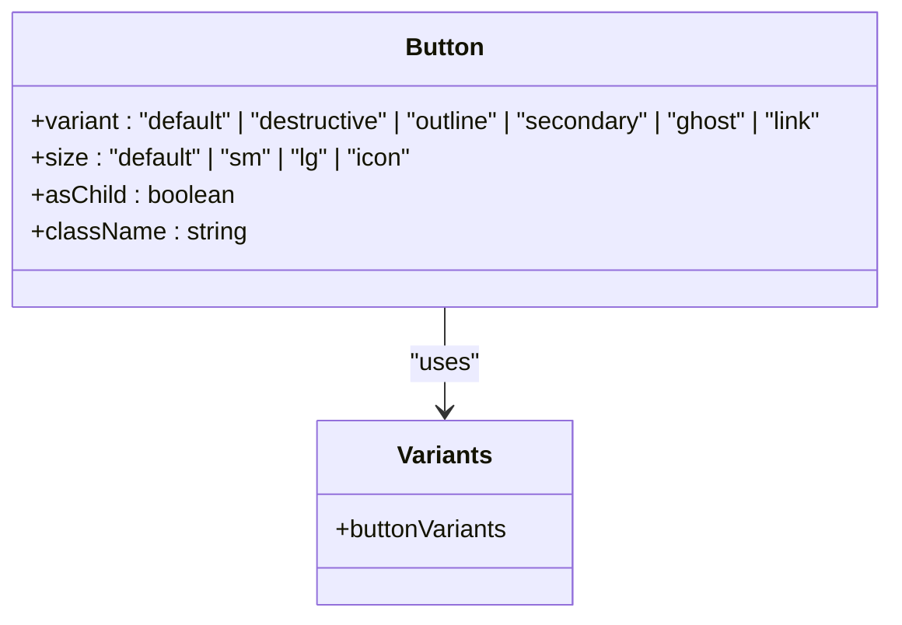

**Diagram sources**
- [apps/web/components/ui/button.tsx](file://apps/web/components/ui/button.tsx#L1-L53)

**Section sources**
- [apps/web/components/ui/button.tsx](file://apps/web/components/ui/button.tsx#L1-L53)

### Badge
- Purpose: Lightweight indicator or tag.
- Variants: default, secondary, destructive, outline.
- Composition: Stateless div wrapper with variant-driven classes.

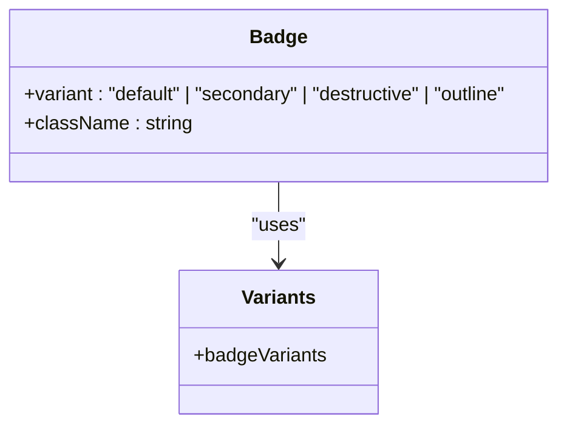

**Diagram sources**
- [apps/web/components/ui/badge.tsx](file://apps/web/components/ui/badge.tsx#L1-L36)

**Section sources**
- [apps/web/components/ui/badge.tsx](file://apps/web/components/ui/badge.tsx#L1-L36)

### Card
- Purpose: Container for content with standardized spacing and typography.
- Composition: Multiple sub-components (header, footer, title, description, content) enable structured layouts.

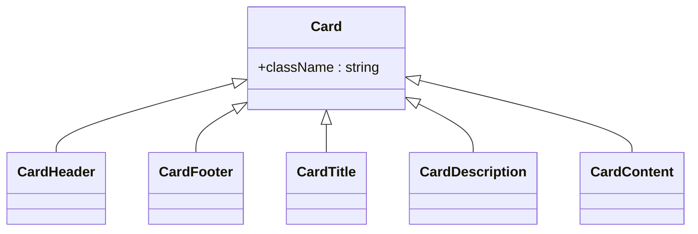

**Diagram sources**
- [apps/web/components/ui/card.tsx](file://apps/web/components/ui/card.tsx#L1-L76)

**Section sources**
- [apps/web/components/ui/card.tsx](file://apps/web/components/ui/card.tsx#L1-L76)

### Input
- Purpose: Text input with consistent focus states and responsive base styles.
- Composition: Forwarded ref and spread of props to the underlying input element.

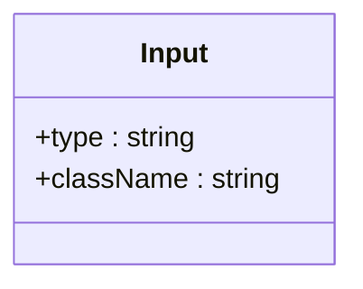

**Diagram sources**
- [apps/web/components/ui/input.tsx](file://apps/web/components/ui/input.tsx#L1-L22)

**Section sources**
- [apps/web/components/ui/input.tsx](file://apps/web/components/ui/input.tsx#L1-L22)

### Dialog
- Purpose: Modal overlay with animated content and optional close control.
- Composition: Overlay, portal, content, header/footer, title, description; optional close button toggle.

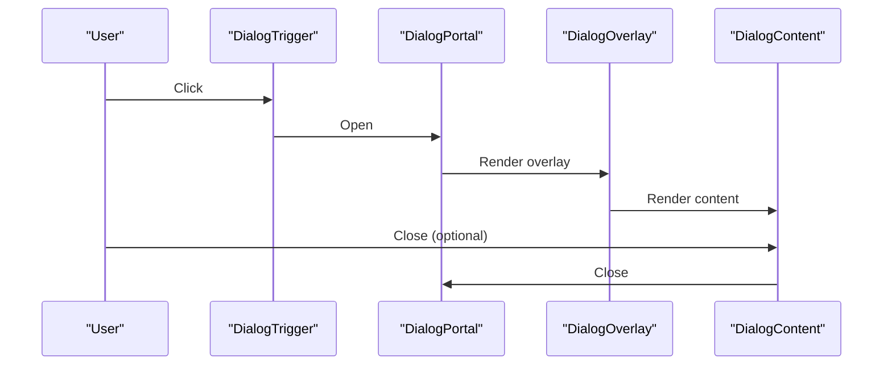

**Diagram sources**
- [apps/web/components/ui/dialog.tsx](file://apps/web/components/ui/dialog.tsx#L1-L120)

**Section sources**
- [apps/web/components/ui/dialog.tsx](file://apps/web/components/ui/dialog.tsx#L1-L120)

### Select
- Purpose: Customizable dropdown selection with scrolling and item indicators.
- Composition: Root, Trigger, Content, Viewport, Item, Label, Separator, and scroll buttons.

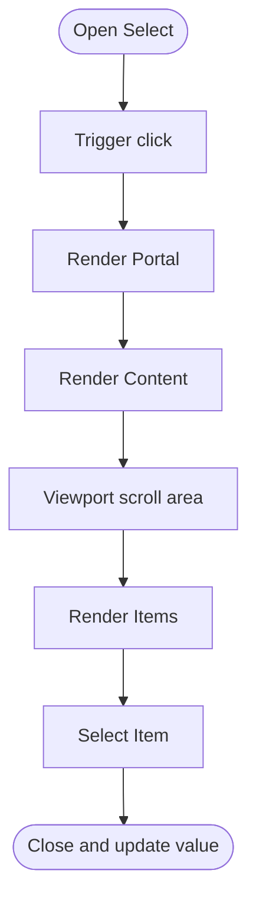

**Diagram sources**
- [apps/web/components/ui/select.tsx](file://apps/web/components/ui/select.tsx#L1-L157)

**Section sources**
- [apps/web/components/ui/select.tsx](file://apps/web/components/ui/select.tsx#L1-L157)

### Tabs
- Purpose: Tabbed navigation with accessible triggers and content areas.

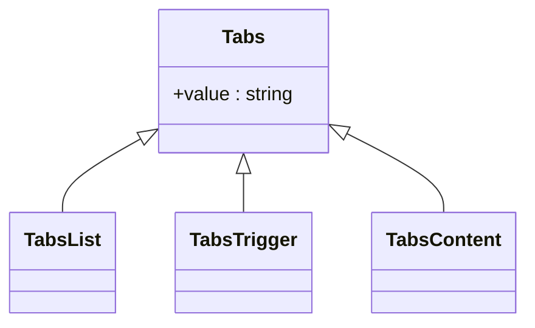

**Diagram sources**
- [apps/web/components/ui/tabs.tsx](file://apps/web/components/ui/tabs.tsx#L1-L55)

**Section sources**
- [apps/web/components/ui/tabs.tsx](file://apps/web/components/ui/tabs.tsx#L1-L55)

### Switch
- Purpose: Toggle control with primitive styling and transitions.

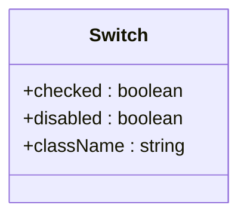

**Diagram sources**
- [apps/web/components/ui/switch.tsx](file://apps/web/components/ui/switch.tsx#L1-L29)

**Section sources**
- [apps/web/components/ui/switch.tsx](file://apps/web/components/ui/switch.tsx#L1-L29)

### Checkbox
- Purpose: Interactive checkbox with indicator and focus states.

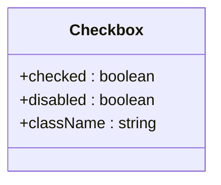

**Diagram sources**
- [apps/web/components/ui/checkbox.tsx](file://apps/web/components/ui/checkbox.tsx#L1-L30)

**Section sources**
- [apps/web/components/ui/checkbox.tsx](file://apps/web/components/ui/checkbox.tsx#L1-L30)

### Toast and Toaster
- Purpose: Notification system with provider and renderer.
- Composition: Provider manages state, Toaster renders toasts, Toast renders individual notifications with actions and close controls.

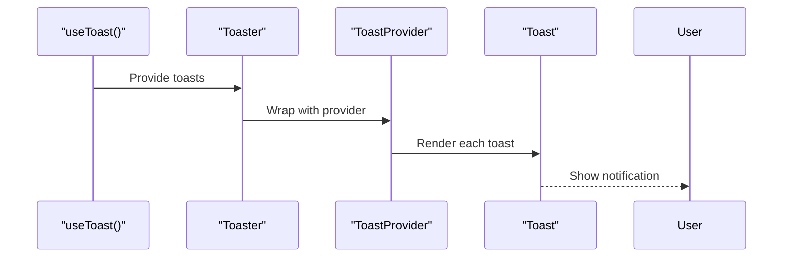

**Diagram sources**
- [apps/web/components/ui/toast.tsx](file://apps/web/components/ui/toast.tsx#L1-L129)
- [apps/web/components/ui/toaster.tsx](file://apps/web/components/ui/toaster.tsx#L1-L36)

**Section sources**
- [apps/web/components/ui/toast.tsx](file://apps/web/components/ui/toast.tsx#L1-L129)
- [apps/web/components/ui/toaster.tsx](file://apps/web/components/ui/toaster.tsx#L1-L36)

## Dependency Analysis
The UI library relies on:
- Radix UI primitives for accessibility and composability.
- Tailwind CSS v4 for utility-first styling and CSS variables for theming.
- class-variance-authority for variant systems.
- lucide-react for icons.
- clsx and tailwind-merge for safe class merging.

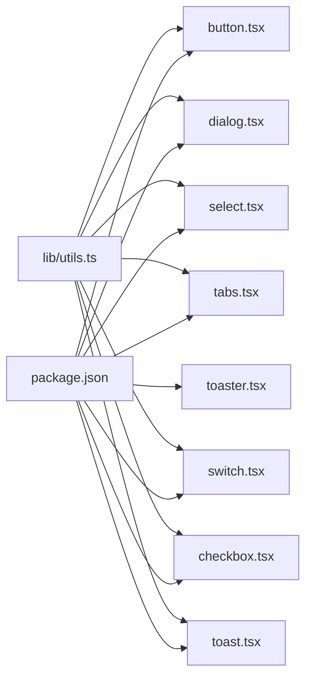

**Diagram sources**
- [apps/web/package.json](file://apps/web/package.json#L1-L116)
- [apps/web/lib/utils.ts](file://apps/web/lib/utils.ts#L1-L7)

**Section sources**
- [apps/web/package.json](file://apps/web/package.json#L1-L116)
- [apps/web/lib/utils.ts](file://apps/web/lib/utils.ts#L1-L7)

## Performance Considerations
- Prefer variant composition over runtime style computations to keep renders fast.
- Use forward refs and minimal wrappers to avoid unnecessary DOM nodes.
- Keep animations scoped and avoid heavy transforms on large lists.
- Merge classes efficiently with the provided utility to prevent cascade bloat.
- Defer heavy assets (e.g., 3D scenes) to lazy-loaded contexts to reduce initial bundle size.

## Troubleshooting Guide
- Hydration mismatches: Ensure client-side components (dialogs, toasts) are rendered after hydration. The layout wraps children with a provider and preloader to manage context availability.
- Focus and keyboard navigation: Verify that triggers and overlays are properly composed; confirm that focus traps and escape keys work as expected.
- Theming inconsistencies: Confirm CSS variables are defined in the root and dark class is applied appropriately.
- Icon sizing: Icons inside interactive elements should respect size classes; ensure SVG children are sized consistently.

**Section sources**
- [apps/web/app/layout.tsx](file://apps/web/app/layout.tsx#L1-L53)
- [apps/web/global.css](file://apps/web/global.css#L1-L190)

## Conclusion
The UI component library provides a cohesive, accessible, and theme-aware set of primitives designed for rapid development and consistent user experiences. By leveraging Radix UI, Tailwind v4, and a variant-driven approach, components remain flexible, maintainable, and performant. The centralized export index simplifies adoption, while the design tokens and CSS variables enable easy theming and cross-browser compatibility.

## Appendices

### Shadcn/ui Integration and Custom Extensions
- The configuration file defines the style, RSC mode, TSX, Tailwind settings, icon library, and aliases. This aligns the project with shadcn/ui conventions and ensures consistent component generation and imports.
- Custom components extend the ecosystem by composing Radix UI primitives and applying the design system’s variant and utility patterns.

**Section sources**
- [apps/web/components.json](file://apps/web/components.json#L1-L24)

### Theming Support and Styling Conventions
- CSS variables define light and dark themes, including brand colors, backgrounds, borders, and shadows. Tailwind v4 consumes these tokens to generate utilities.
- The global stylesheet imports fonts, defines keyframes, and adds custom utilities for retro arcade aesthetics.

**Section sources**
- [apps/web/global.css](file://apps/web/global.css#L1-L190)

### Accessibility and Responsive Patterns
- Components use focus-visible outlines, proper ARIA roles via Radix UI, and semantic HTML.
- Responsive breakpoints and typography scale are handled through Tailwind utilities and CSS variables.

**Section sources**
- [apps/web/components/ui/button.tsx](file://apps/web/components/ui/button.tsx#L1-L53)
- [apps/web/components/ui/dialog.tsx](file://apps/web/components/ui/dialog.tsx#L1-L120)
- [apps/web/components/ui/select.tsx](file://apps/web/components/ui/select.tsx#L1-L157)
- [apps/web/components/ui/tabs.tsx](file://apps/web/components/ui/tabs.tsx#L1-L55)
- [apps/web/components/ui/switch.tsx](file://apps/web/components/ui/switch.tsx#L1-L29)
- [apps/web/components/ui/checkbox.tsx](file://apps/web/components/ui/checkbox.tsx#L1-L30)
- [apps/web/components/ui/toast.tsx](file://apps/web/components/ui/toast.tsx#L1-L129)

### Component Composition Patterns, Slots, and Prop Forwarding
- Slot pattern allows Button to render as a custom element while preserving event handling and attributes.
- Dialog, Select, Tabs, Switch, and Checkbox forward refs and props to underlying primitives.
- Toaster composes ToastProvider and Toast to render notifications declaratively.

**Section sources**
- [apps/web/components/ui/button.tsx](file://apps/web/components/ui/button.tsx#L1-L53)
- [apps/web/components/ui/dialog.tsx](file://apps/web/components/ui/dialog.tsx#L1-L120)
- [apps/web/components/ui/select.tsx](file://apps/web/components/ui/select.tsx#L1-L157)
- [apps/web/components/ui/tabs.tsx](file://apps/web/components/ui/tabs.tsx#L1-L55)
- [apps/web/components/ui/switch.tsx](file://apps/web/components/ui/switch.tsx#L1-L29)
- [apps/web/components/ui/checkbox.tsx](file://apps/web/components/ui/checkbox.tsx#L1-L30)
- [apps/web/components/ui/toaster.tsx](file://apps/web/components/ui/toaster.tsx#L1-L36)

### Usage Examples for Common UI Patterns
- Buttons: Use variants for emphasis and destructive actions; use sizes for compact controls; leverage asChild for anchor-based buttons.
- Cards: Compose header/title/description/content/footer for structured sections.
- Inputs: Apply focus states and placeholder styling; combine with labels for accessibility.
- Dialogs: Wrap triggers and content; optionally hide the close button; structure header/footer/title/description.
- Select: Group options, handle scrolling, and render item indicators.
- Tabs: Bind triggers to content; ensure active state styling.
- Switch/Checkbox: Respect disabled states and focus rings.
- Toasts: Provide titles, descriptions, actions, and automatic viewport placement.

**Section sources**
- [apps/web/components/ui/button.tsx](file://apps/web/components/ui/button.tsx#L1-L53)
- [apps/web/components/ui/card.tsx](file://apps/web/components/ui/card.tsx#L1-L76)
- [apps/web/components/ui/input.tsx](file://apps/web/components/ui/input.tsx#L1-L22)
- [apps/web/components/ui/dialog.tsx](file://apps/web/components/ui/dialog.tsx#L1-L120)
- [apps/web/components/ui/select.tsx](file://apps/web/components/ui/select.tsx#L1-L157)
- [apps/web/components/ui/tabs.tsx](file://apps/web/components/ui/tabs.tsx#L1-L55)
- [apps/web/components/ui/switch.tsx](file://apps/web/components/ui/switch.tsx#L1-L29)
- [apps/web/components/ui/checkbox.tsx](file://apps/web/components/ui/checkbox.tsx#L1-L30)
- [apps/web/components/ui/toast.tsx](file://apps/web/components/ui/toast.tsx#L1-L129)