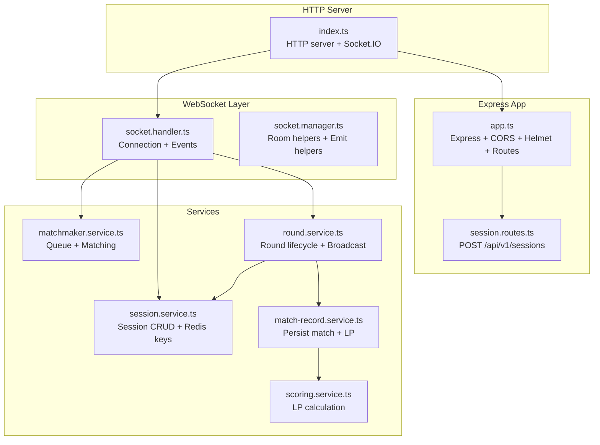
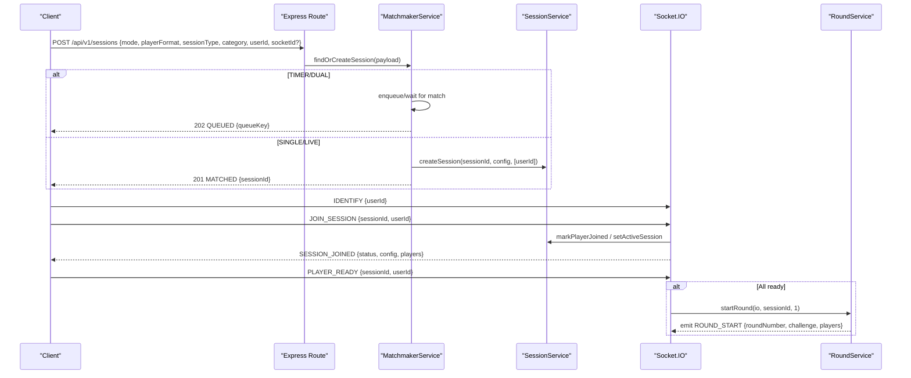
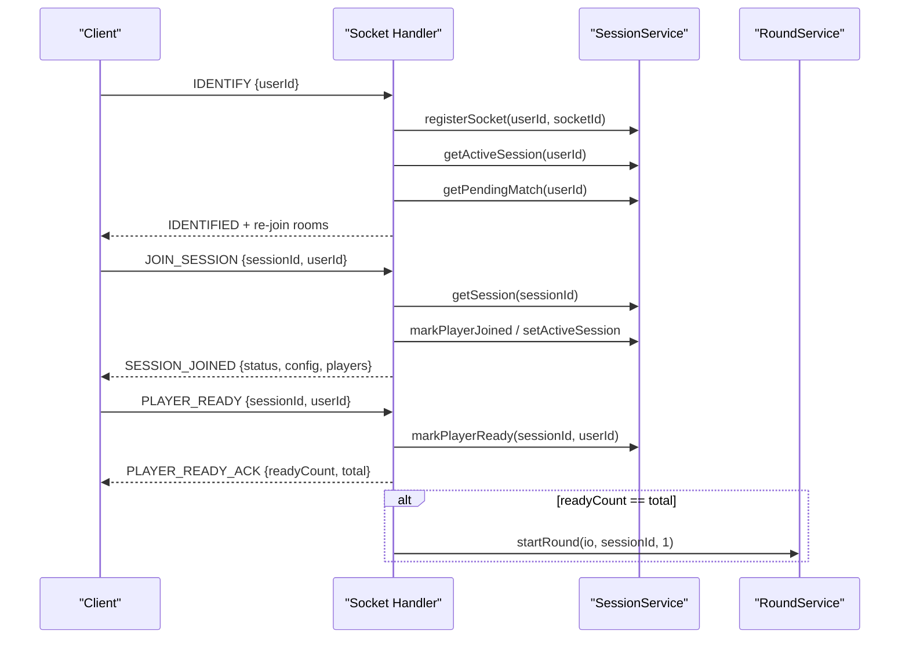
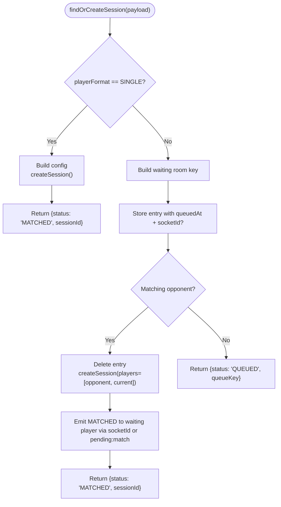
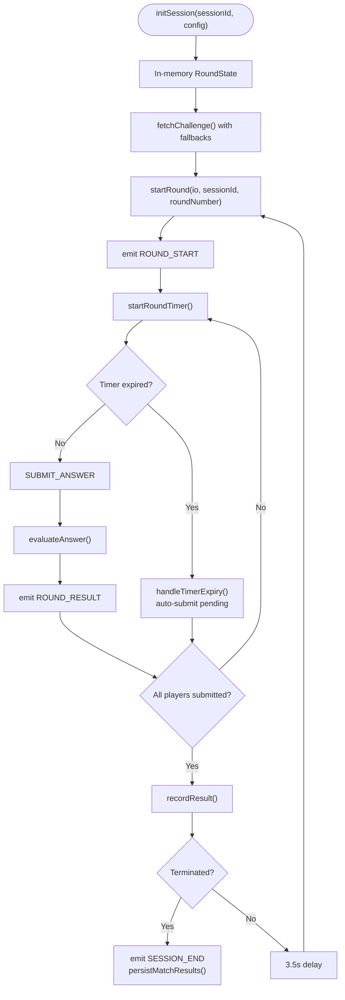
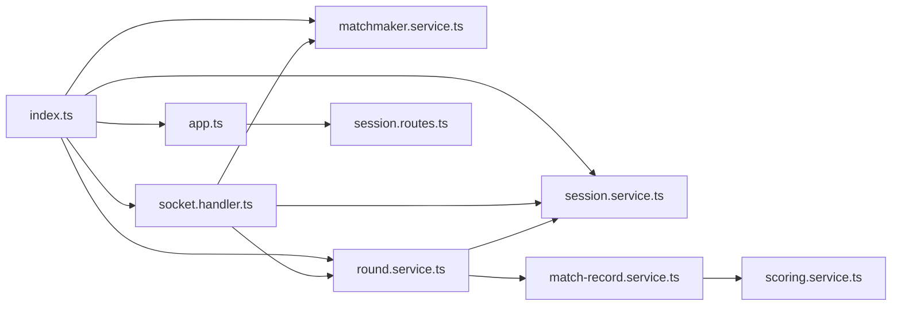

# Game API Service

<cite>
**Referenced Files in This Document**
- [index.ts](file://apps/game-api/src/index.ts)
- [app.ts](file://apps/game-api/src/app.ts)
- [session.routes.ts](file://apps/game-api/src/routes/session.routes.ts)
- [socket.handler.ts](file://apps/game-api/src/websocket/socket.handler.ts)
- [socket.manager.ts](file://apps/game-api/src/websocket/socket.manager.ts)
- [session.service.ts](file://apps/game-api/src/services/session.service.ts)
- [matchmaker.service.ts](file://apps/game-api/src/services/matchmaker.service.ts)
- [round.service.ts](file://apps/game-api/src/services/round.service.ts)
- [match-record.service.ts](file://apps/game-api/src/services/match-record.service.ts)
- [scoring.service.ts](file://apps/game-api/src/services/scoring.service.ts)
</cite>

## Table of Contents
1. [Introduction](#introduction)
2. [Project Structure](#project-structure)
3. [Core Components](#core-components)
4. [Architecture Overview](#architecture-overview)
5. [Detailed Component Analysis](#detailed-component-analysis)
6. [Dependency Analysis](#dependency-analysis)
7. [Performance Considerations](#performance-considerations)
8. [Troubleshooting Guide](#troubleshooting-guide)
9. [Conclusion](#conclusion)
10. [Appendices](#appendices)

## Introduction
This document describes the Game API service that powers core game logic and real-time communication for competitive coding sessions. It covers:
- WebSocket session management: connection handling, room management, and message broadcasting
- Matchmaking service: queue management, player matching, and session creation
- Session service: game state persistence, round management, and result tracking
- REST API endpoints for session management, player actions, and game state queries
- Real-time communication patterns, event-driven architecture, and state synchronization
- Examples of WebSocket usage, session lifecycle management, and integration with supporting services

## Project Structure
The Game API is implemented as an Express application with Socket.IO for real-time features. Key areas:
- Entry point initializes HTTP server, Socket.IO, services, and registers handlers
- Routes expose REST endpoints for matchmaking
- WebSocket handlers manage connections, rooms, and events
- Services encapsulate domain logic for sessions, matchmaking, rounds, scoring, and match records

**Diagram sources**
- [index.ts](file://apps/game-api/src/index.ts#L1-L45)
- [app.ts](file://apps/game-api/src/app.ts#L1-L63)
- [session.routes.ts](file://apps/game-api/src/routes/session.routes.ts#L1-L38)
- [socket.handler.ts](file://apps/game-api/src/websocket/socket.handler.ts#L1-L310)
- [socket.manager.ts](file://apps/game-api/src/websocket/socket.manager.ts#L1-L56)
- [session.service.ts](file://apps/game-api/src/services/session.service.ts#L1-L167)
- [matchmaker.service.ts](file://apps/game-api/src/services/matchmaker.service.ts#L1-L206)
- [round.service.ts](file://apps/game-api/src/services/round.service.ts#L1-L1006)
- [match-record.service.ts](file://apps/game-api/src/services/match-record.service.ts#L1-L51)
- [scoring.service.ts](file://apps/game-api/src/services/scoring.service.ts#L1-L104)

**Section sources**
- [index.ts](file://apps/game-api/src/index.ts#L1-L45)
- [app.ts](file://apps/game-api/src/app.ts#L1-L63)

## Core Components
- Express app with health endpoint, CORS/Helmet, JSON parsing, and error handling
- Socket.IO server configured with CORS and transports
- SessionService: manages session metadata, player readiness/joined sets, and player data in Redis
- MatchmakerService: maintains a waiting room map keyed by session type and category; creates sessions and emits MATCHED
- RoundService: orchestrates round lifecycle, timers, submissions, auto-submit on expiry/live advance, and session termination
- MatchRecordService + ScoringService: persist match outcomes and compute LP rewards
- WebSocket handlers: IDENTIFY, JOIN_SESSION, PLAYER_READY, TYPING_TELEMETRY, SUBMIT_ANSWER, SURVIVAL_REQUEUE, and anti-cheat telemetry relays

**Section sources**
- [app.ts](file://apps/game-api/src/app.ts#L1-L63)
- [session.service.ts](file://apps/game-api/src/services/session.service.ts#L1-L167)
- [matchmaker.service.ts](file://apps/game-api/src/services/matchmaker.service.ts#L1-L206)
- [round.service.ts](file://apps/game-api/src/services/round.service.ts#L1-L1006)
- [match-record.service.ts](file://apps/game-api/src/services/match-record.service.ts#L1-L51)
- [scoring.service.ts](file://apps/game-api/src/services/scoring.service.ts#L1-L104)
- [socket.handler.ts](file://apps/game-api/src/websocket/socket.handler.ts#L1-L310)

## Architecture Overview
The system follows an event-driven architecture:
- REST: clients call POST /api/v1/sessions to enter queues or create single-player sessions
- WebSocket: clients connect, IDENTIFY themselves, join a session room, and participate in rounds
- Services coordinate state transitions and broadcast updates to all room participants
- Persistence: Redis stores session metadata and player data; database persists match records and scores

**Diagram sources**
- [session.routes.ts](file://apps/game-api/src/routes/session.routes.ts#L1-L38)
- [matchmaker.service.ts](file://apps/game-api/src/services/matchmaker.service.ts#L1-L206)
- [session.service.ts](file://apps/game-api/src/services/session.service.ts#L1-L167)
- [socket.handler.ts](file://apps/game-api/src/websocket/socket.handler.ts#L1-L310)
- [round.service.ts](file://apps/game-api/src/services/round.service.ts#L1-L1006)

## Detailed Component Analysis

### WebSocket Session Management
Responsibilities:
- Connection lifecycle: register socket by userId, restore active/pending session rooms on reconnect
- Room management: join/leave session rooms; maintain ready/joined counts
- Event-driven orchestration: handle IDENTIFY, JOIN_SESSION, PLAYER_READY, TYPING_TELEMETRY, SUBMIT_ANSWER, SURVIVAL_REQUEUE
- Anti-cheat telemetry relay: forward typed events to the anti-cheat service

Key behaviors:
- IDENTIFY associates a userId to a socketId in Redis and restores session rooms if present
- JOIN_SESSION validates session existence, enforces presence of userId in players, joins room, and serializes players
- PLAYER_READY tracks readiness and triggers round start when all players are ready
- TYPING_TELEMETRY broadcasts opponent telemetry to other players
- SUBMIT_ANSWER delegates evaluation and result emission to RoundService
- SURVIVAL_REQUEUE supports re-queueing winners for next match (single vs dual)
- DISCONNECT cancels queue entries and unregisters socket

**Diagram sources**
- [socket.handler.ts](file://apps/game-api/src/websocket/socket.handler.ts#L62-L202)
- [session.service.ts](file://apps/game-api/src/services/session.service.ts#L92-L126)
- [round.service.ts](file://apps/game-api/src/services/round.service.ts#L451-L467)

**Section sources**
- [socket.handler.ts](file://apps/game-api/src/websocket/socket.handler.ts#L1-L310)
- [socket.manager.ts](file://apps/game-api/src/websocket/socket.manager.ts#L1-L56)

### Matchmaking Service
Responsibilities:
- Build waiting room keys from session type and category
- Enforce payload constraints (TIMER requires category)
- Single-player: immediately create session and return MATCHED
- Dual-player: enqueue with TTL; pair when another eligible user enters; create session and emit MATCHED to waiting player
- Requeue survivors for next match (SINGLE: new session; DUAL: re-queue under same key)
- Cancel queue on disconnect

**Diagram sources**
- [matchmaker.service.ts](file://apps/game-api/src/services/matchmaker.service.ts#L41-L206)

**Section sources**
- [matchmaker.service.ts](file://apps/game-api/src/services/matchmaker.service.ts#L1-L206)

### Session Service
Responsibilities:
- Create sessions with TTL, initialize player data, and track pending matches
- Get/update sessions
- Manage socket associations and active sessions
- Track joined/ready sets per session with TTL
- Persist round scores and deduct lives
- Serialize session to include computed player stats

Design notes:
- Uses Redis keys for sessions, player data, joined/ready sets, pending matches, and active sessions
- TTL ensures cleanup of transient state
- Serialization aggregates live player data with session metadata

**Section sources**
- [session.service.ts](file://apps/game-api/src/services/session.service.ts#L1-L167)

### Round Service
Responsibilities:
- Initialize and maintain per-session round state in memory
- Fetch challenges from Question Engine with fallback strategies
- Evaluate answers (direct match, MCQ, state tracing)
- Manage timers and auto-submit on expiry
- Coordinate live-mode advance timers
- Emit round lifecycle events: ROUND_START, TIMER_SYNC, TIMER_EXPIRED, ROUND_RESULT, OPPONENT_PROGRESS/TELEMETRY, SESSION_END, SESSION_ERROR
- Persist match outcomes and compute LP rewards

Key mechanisms:
- Race-condition guard to prevent double-round advancement in dual mode
- Auto-submit pending players on timer expiry or live advance
- Termination on lives exhaustion or round completion

**Diagram sources**
- [round.service.ts](file://apps/game-api/src/services/round.service.ts#L179-L720)

**Section sources**
- [round.service.ts](file://apps/game-api/src/services/round.service.ts#L1-L1006)

### REST API Endpoints
- POST /api/v1/sessions
  - Purpose: Enter queue or create single-player session
  - Validation: mode=ARCADE, playerFormat=SINGLE|DUAL, sessionType=TIMER|LIVE, category required for TIMER
  - Behavior: Delegates to MatchmakerService; returns 201 MATCHED or 202 QUEUED

**Section sources**
- [session.routes.ts](file://apps/game-api/src/routes/session.routes.ts#L1-L38)

### Scoring and Match Records
- ScoringService computes LP rewards per mode (single/dual/story) with bonuses and thresholds
- MatchRecordService persists match outcomes atomically and updates global scores

**Section sources**
- [scoring.service.ts](file://apps/game-api/src/services/scoring.service.ts#L1-L104)
- [match-record.service.ts](file://apps/game-api/src/services/match-record.service.ts#L1-L51)

## Dependency Analysis
High-level dependencies:
- index.ts depends on app, services, and registers socket handlers
- app.ts mounts session routes and defines middleware/error handling
- socket.handler.ts depends on session/matchmaker/round services
- round.service.ts depends on session.service, match-record.service, and external services (question engine, code runner)
- matchmaker.service.ts depends on session.service and socket.io
- session.service.ts depends on Redis client and types

**Diagram sources**
- [index.ts](file://apps/game-api/src/index.ts#L1-L45)
- [app.ts](file://apps/game-api/src/app.ts#L1-L63)
- [session.routes.ts](file://apps/game-api/src/routes/session.routes.ts#L1-L38)
- [socket.handler.ts](file://apps/game-api/src/websocket/socket.handler.ts#L1-L310)
- [session.service.ts](file://apps/game-api/src/services/session.service.ts#L1-L167)
- [matchmaker.service.ts](file://apps/game-api/src/services/matchmaker.service.ts#L1-L206)
- [round.service.ts](file://apps/game-api/src/services/round.service.ts#L1-L1006)
- [match-record.service.ts](file://apps/game-api/src/services/match-record.service.ts#L1-L51)
- [scoring.service.ts](file://apps/game-api/src/services/scoring.service.ts#L1-L104)

**Section sources**
- [index.ts](file://apps/game-api/src/index.ts#L1-L45)
- [app.ts](file://apps/game-api/src/app.ts#L1-L63)

## Performance Considerations
- Redis-backed session and player data minimize database load; TTLs prevent memory leaks
- In-memory round state reduces latency for timer and round progression logic
- Timers emit periodic TIMER_SYNC to clients; ensure client-side throttling to avoid excessive re-renders
- Auto-submit on expiry prevents deadlocks; guard against duplicate completions
- External service calls (Question Engine) include fallback strategies to reduce failure impact
- Socket room-based broadcasting scales horizontally with Socket.IO cluster support

[No sources needed since this section provides general guidance]

## Troubleshooting Guide
Common issues and diagnostics:
- Validation errors: Express error handler converts Zod errors to structured ApiError
- Internal errors: Unhandled errors logged and returned as INTERNAL_ERROR
- Session not found: JOIN_SESSION emits SESSION_ERROR; ensure sessionId is valid and not expired
- Queue not found: TIMER mode requires category; ensure payload includes category
- Socket not found: MATCHED delivery may rely on pending:match Redis key during reconnects
- Timer expiry races: RoundService guards ensure single round advancement even with concurrent submissions
- Anti-cheat relay failures: Network errors logged; verify anti-cheat service availability

**Section sources**
- [app.ts](file://apps/game-api/src/app.ts#L33-L62)
- [socket.handler.ts](file://apps/game-api/src/websocket/socket.handler.ts#L114-L156)
- [matchmaker.service.ts](file://apps/game-api/src/services/matchmaker.service.ts#L50-L52)
- [round.service.ts](file://apps/game-api/src/services/round.service.ts#L487-L500)

## Conclusion
The Game API integrates REST and WebSocket layers to deliver a responsive, event-driven gaming experience. SessionService and Redis provide fast state management; MatchmakerService efficiently pairs players; RoundService coordinates real-time gameplay with robust timers and fairness guarantees; and persistent match records enable scoring and analytics. The architecture supports horizontal scaling and graceful degradation.

[No sources needed since this section summarizes without analyzing specific files]

## Appendices

### WebSocket Usage Examples
- Connect and identify: IDENTIFY {userId}
- Join a session: JOIN_SESSION {sessionId, userId}
- Signal readiness: PLAYER_READY {sessionId, userId}
- Send typing telemetry: TYPING_TELEMETRY {sessionId, userId, wpm, codeLength, ...}
- Submit answer: SUBMIT_ANSWER {sessionId, userId, answer, roundNumber}
- Requeue survivor: SURVIVAL_REQUEUE {playerFormat, sessionType, category?, userId?}

**Section sources**
- [socket.handler.ts](file://apps/game-api/src/websocket/socket.handler.ts#L72-L297)

### Session Lifecycle Management
- Creation: MatchmakerService creates sessions for SINGLE/LIVE modes
- Lobby: Players join rooms, mark joined/ready; ROOM_START triggers when all ready
- Gameplay: ROUND_START, TIMER_SYNC, OPPONENT_PROGRESS/TELEMETRY, ROUND_RESULT
- Termination: SESSION_END on lives exhausted or rounds completed; persist match results

**Section sources**
- [matchmaker.service.ts](file://apps/game-api/src/services/matchmaker.service.ts#L59-L106)
- [round.service.ts](file://apps/game-api/src/services/round.service.ts#L451-L588)

### Integration Notes
- Question Engine: RoundService fetches challenges with category/language fallbacks
- Anti-Cheat: Telemetry events relayed to anti-cheat service via handler
- Database: MatchRecordService persists outcomes and updates global scores atomically

**Section sources**
- [round.service.ts](file://apps/game-api/src/services/round.service.ts#L206-L285)
- [socket.handler.ts](file://apps/game-api/src/websocket/socket.handler.ts#L19-L60)
- [match-record.service.ts](file://apps/game-api/src/services/match-record.service.ts#L27-L42)