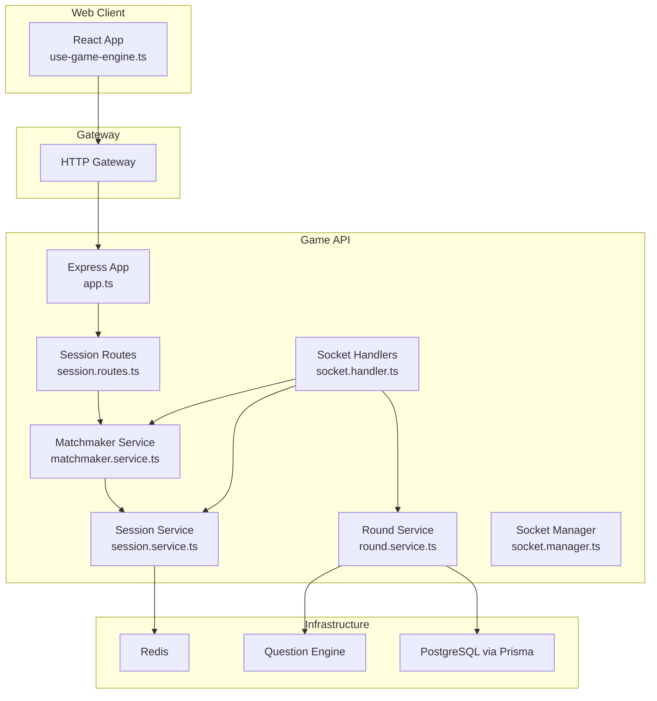
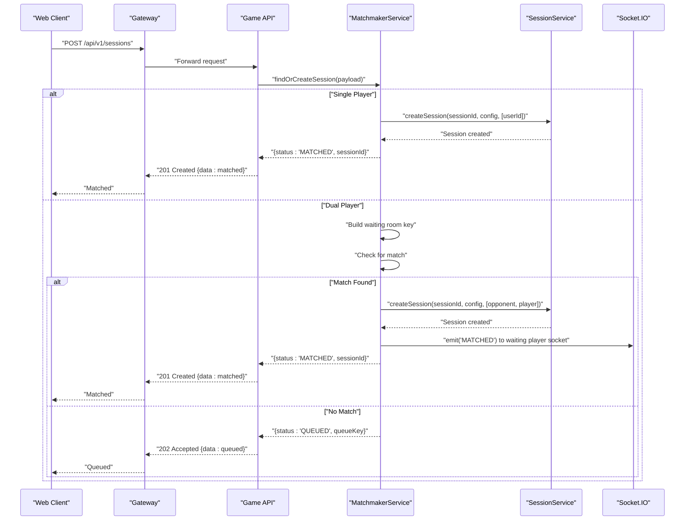
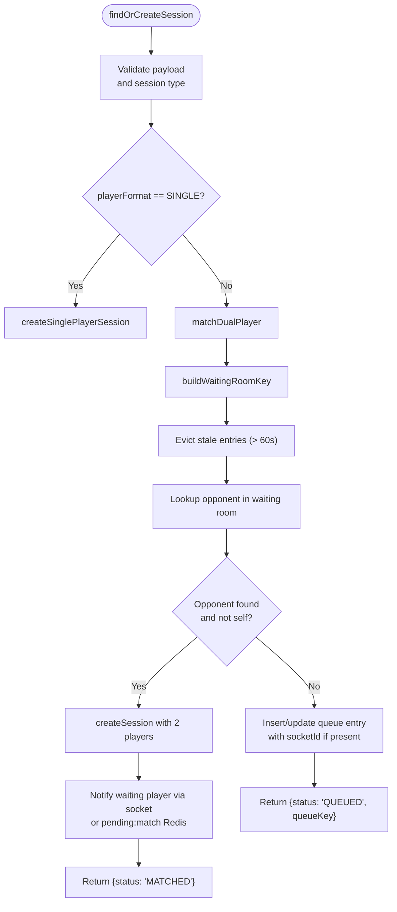
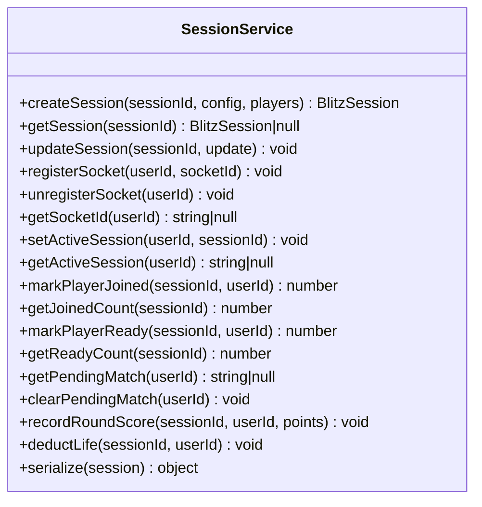
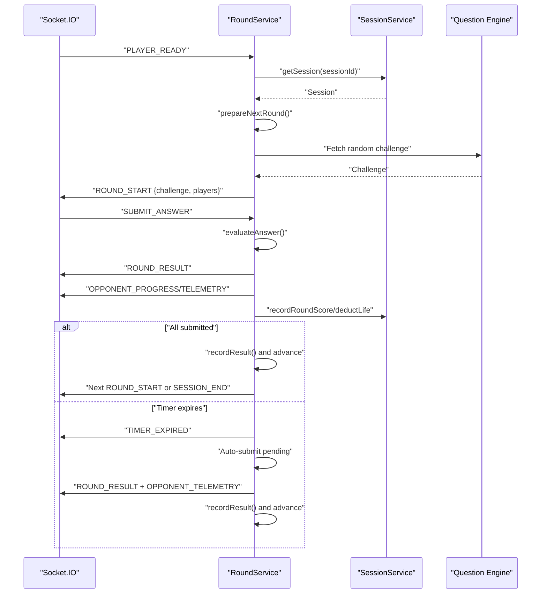
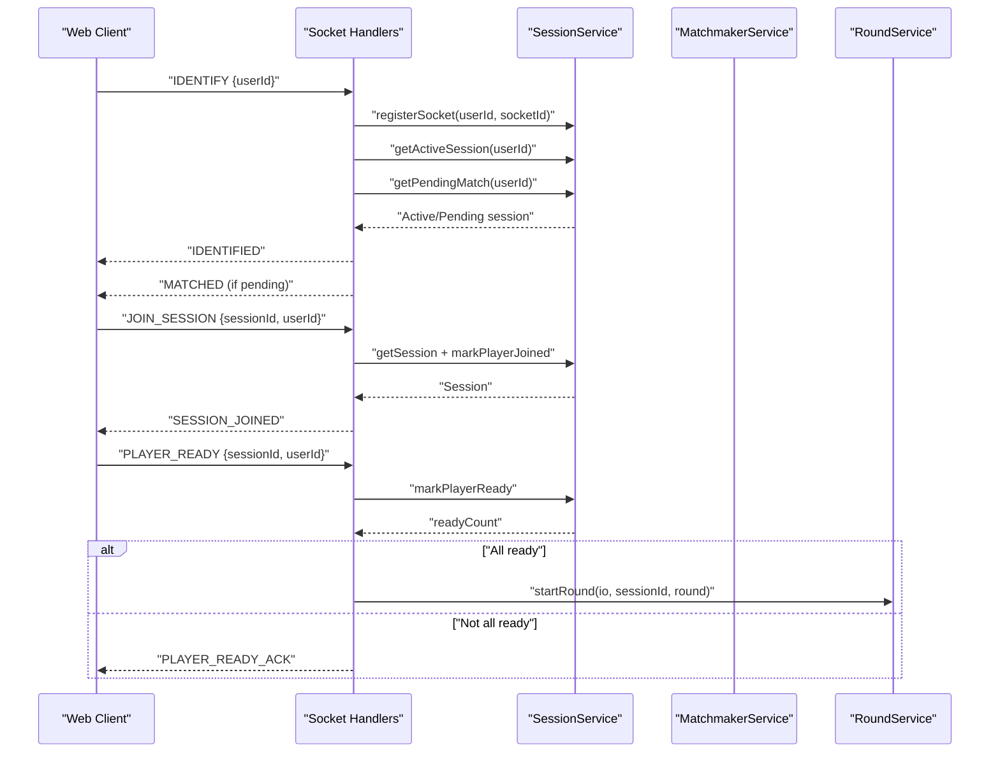
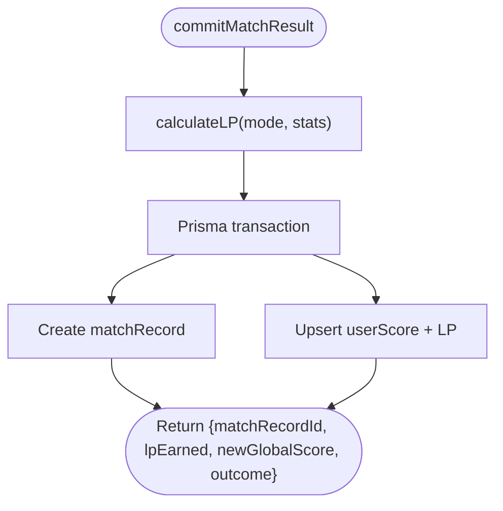
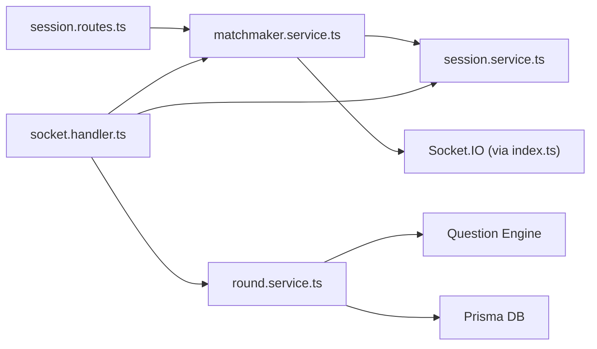

# Matchmaking and Queue System

<cite>
**Referenced Files in This Document**
- [index.ts](file://apps/game-api/src/index.ts)
- [app.ts](file://apps/game-api/src/app.ts)
- [session.routes.ts](file://apps/game-api/src/routes/session.routes.ts)
- [matchmaker.service.ts](file://apps/game-api/src/services/matchmaker.service.ts)
- [session.service.ts](file://apps/game-api/src/services/session.service.ts)
- [round.service.ts](file://apps/game-api/src/services/round.service.ts)
- [socket.handler.ts](file://apps/game-api/src/websocket/socket.handler.ts)
- [socket.manager.ts](file://apps/game-api/src/websocket/socket.manager.ts)
- [scoring.service.ts](file://apps/game-api/src/services/scoring.service.ts)
- [match-record.service.ts](file://apps/game-api/src/services/match-record.service.ts)
- [use-game-engine.ts](file://apps/web/hooks/use-game-engine.ts)
</cite>

## Table of Contents
1. [Introduction](#introduction)
2. [Project Structure](#project-structure)
3. [Core Components](#core-components)
4. [Architecture Overview](#architecture-overview)
5. [Detailed Component Analysis](#detailed-component-analysis)
6. [Dependency Analysis](#dependency-analysis)
7. [Performance Considerations](#performance-considerations)
8. [Troubleshooting Guide](#troubleshooting-guide)
9. [Conclusion](#conclusion)
10. [Appendices](#appendices)

## Introduction
This document explains the matchmaking and queue system powering competitive coding sessions. It covers player registration, queue management, skill-aware pairing strategies, session creation, waiting room mechanics, match notifications, and the end-to-end session lifecycle. It also documents integration with the WebSocket system, scoring and persistence of match outcomes, and practical guidance for performance and fairness under high throughput.

## Project Structure
The matchmaking stack resides in the Game API application and integrates with the Web client via HTTP and WebSocket.

**Diagram sources**
- [index.ts](file://apps/game-api/src/index.ts#L1-L45)
- [app.ts](file://apps/game-api/src/app.ts#L1-L63)
- [session.routes.ts](file://apps/game-api/src/routes/session.routes.ts#L1-L38)
- [matchmaker.service.ts](file://apps/game-api/src/services/matchmaker.service.ts#L1-L206)
- [session.service.ts](file://apps/game-api/src/services/session.service.ts#L1-L167)
- [round.service.ts](file://apps/game-api/src/services/round.service.ts#L1-L1006)
- [socket.handler.ts](file://apps/game-api/src/websocket/socket.handler.ts#L1-L310)
- [socket.manager.ts](file://apps/game-api/src/websocket/socket.manager.ts#L1-L56)

**Section sources**
- [index.ts](file://apps/game-api/src/index.ts#L1-L45)
- [app.ts](file://apps/game-api/src/app.ts#L1-L63)

## Core Components
- Matchmaker Service: Manages dual-player queue, builds waiting room keys, matches pairs, creates sessions, and notifies players.
- Session Service: Creates and persists sessions, tracks player readiness/joined state, manages pending match flags, and serializes player data.
- Round Service: Orchestrates round lifecycle, fetches questions, evaluates submissions, manages timers, and emits lifecycle events.
- Socket Handlers: Implements WebSocket protocol for identification, joining sessions, readiness, telemetry, survival requeue, and anti-cheat relays.
- Scoring and Match Records: Computes LP rewards and outcomes, persists match records and global scores.

**Section sources**
- [matchmaker.service.ts](file://apps/game-api/src/services/matchmaker.service.ts#L41-L206)
- [session.service.ts](file://apps/game-api/src/services/session.service.ts#L18-L167)
- [round.service.ts](file://apps/game-api/src/services/round.service.ts#L179-L1006)
- [socket.handler.ts](file://apps/game-api/src/websocket/socket.handler.ts#L62-L310)
- [scoring.service.ts](file://apps/game-api/src/services/scoring.service.ts#L1-L104)
- [match-record.service.ts](file://apps/game-api/src/services/match-record.service.ts#L1-L51)

## Architecture Overview
The system combines HTTP and WebSocket for request/response and real-time updates. Players submit queue requests over HTTP; WebSocket handles real-time coordination and notifications.

**Diagram sources**
- [session.routes.ts](file://apps/game-api/src/routes/session.routes.ts#L19-L35)
- [matchmaker.service.ts](file://apps/game-api/src/services/matchmaker.service.ts#L47-L169)
- [session.service.ts](file://apps/game-api/src/services/session.service.ts#L19-L46)
- [socket.handler.ts](file://apps/game-api/src/websocket/socket.handler.ts#L108-L157)

## Detailed Component Analysis

### Matchmaker Service
Responsibilities:
- Validates queue payloads and enforces constraints (e.g., TIMER mode requires a category).
- Builds waiting room keys partitioned by session type and category.
- Evicts stale queue entries after a TTL.
- Matches dual players when a pair is found and creates a session.
- Notifies matched players via WebSocket; falls back to pending match Redis key if socket not found.
- Supports cancellation and survival requeue.

Key behaviors:
- Single-player sessions bypass queue and are immediately matched.
- Dual queue uses an in-memory map keyed by sessionType:category.
- Socket ID can be captured at queue time to ensure notifications reach the correct tab/browser.

**Diagram sources**
- [matchmaker.service.ts](file://apps/game-api/src/services/matchmaker.service.ts#L47-L169)

**Section sources**
- [matchmaker.service.ts](file://apps/game-api/src/services/matchmaker.service.ts#L17-L21)
- [matchmaker.service.ts](file://apps/game-api/src/services/matchmaker.service.ts#L47-L169)
- [matchmaker.service.ts](file://apps/game-api/src/services/matchmaker.service.ts#L171-L204)

### Session Service
Responsibilities:
- Creates sessions with initial status LOBBY and stores player data.
- Tracks joined/ready sets per session and TTLs.
- Manages socket associations and pending match flags.
- Serializes player data for round/result payloads.

Lifecycle highlights:
- Pending match Redis key ensures clients receive MATCHED even after reconnect.
- Active session tracking allows rejoining rooms after disconnect.

**Diagram sources**
- [session.service.ts](file://apps/game-api/src/services/session.service.ts#L18-L167)

**Section sources**
- [session.service.ts](file://apps/game-api/src/services/session.service.ts#L19-L98)
- [session.service.ts](file://apps/game-api/src/services/session.service.ts#L118-L165)

### Round Service
Responsibilities:
- Initializes and maintains per-session round state.
- Fetches challenges from the Question Engine with fallback strategies.
- Evaluates answers and computes points/lives.
- Manages timers and live-mode advances with guards against race conditions.
- Emits lifecycle events: ROUND_START, TIMER_SYNC, TIMER_EXPIRED, ROUND_RESULT, OPPONENT_PROGRESS/TELEMETRY, SESSION_END.

Race-condition protections:
- lastCompletedRound guard prevents double-round advancement in dual mode.
- submittedUserIds ensures idempotent handling of concurrent submissions.

**Diagram sources**
- [round.service.ts](file://apps/game-api/src/services/round.service.ts#L451-L589)
- [round.service.ts](file://apps/game-api/src/services/round.service.ts#L722-L806)
- [round.service.ts](file://apps/game-api/src/services/round.service.ts#L487-L589)

**Section sources**
- [round.service.ts](file://apps/game-api/src/services/round.service.ts#L179-L285)
- [round.service.ts](file://apps/game-api/src/services/round.service.ts#L313-L423)
- [round.service.ts](file://apps/game-api/src/services/round.service.ts#L451-L589)
- [round.service.ts](file://apps/game-api/src/services/round.service.ts#L722-L806)

### WebSocket Integration
Key flows:
- IDENTIFY associates a user with a socket ID and re-joins active/pending rooms; re-emits MATCHED if pending exists.
- JOIN_SESSION validates session existence, adds user to room, marks joined, and clears pending match.
- PLAYER_READY gates round start; once all players are ready, RoundService starts the round.
- TYPING_TELEMETRY broadcasts opponent progress.
- SURVIVAL_REQUEUE supports requeueing winners for next match (single: new session; dual: back in queue).
- Telemetry events are relayed to the anti-cheat service.

**Diagram sources**
- [socket.handler.ts](file://apps/game-api/src/websocket/socket.handler.ts#L72-L106)
- [socket.handler.ts](file://apps/game-api/src/websocket/socket.handler.ts#L111-L157)
- [socket.handler.ts](file://apps/game-api/src/websocket/socket.handler.ts#L162-L202)
- [socket.handler.ts](file://apps/game-api/src/websocket/socket.handler.ts#L244-L270)

**Section sources**
- [socket.handler.ts](file://apps/game-api/src/websocket/socket.handler.ts#L62-L310)

### Scoring and Match Persistence
- Scoring service computes LP rewards per mode (single/dual/story) with bonuses for speed and accuracy, and ELO adjustments for duels.
- Match record service persists match outcomes and updates global scores atomically.

**Diagram sources**
- [match-record.service.ts](file://apps/game-api/src/services/match-record.service.ts#L18-L50)
- [scoring.service.ts](file://apps/game-api/src/services/scoring.service.ts#L97-L104)

**Section sources**
- [scoring.service.ts](file://apps/game-api/src/services/scoring.service.ts#L61-L84)
- [match-record.service.ts](file://apps/game-api/src/services/match-record.service.ts#L18-L50)

## Dependency Analysis
High-level dependencies:
- HTTP routes depend on Matchmaker Service.
- Matchmaker depends on Session Service and Socket.IO.
- Round Service depends on Session Service, Question Engine, and database.
- Socket Handlers coordinate between clients, Session Service, Matchmaker, and Round Service.

**Diagram sources**
- [session.routes.ts](file://apps/game-api/src/routes/session.routes.ts#L1-L38)
- [matchmaker.service.ts](file://apps/game-api/src/services/matchmaker.service.ts#L1-L206)
- [session.service.ts](file://apps/game-api/src/services/session.service.ts#L1-L167)
- [round.service.ts](file://apps/game-api/src/services/round.service.ts#L1-L1006)
- [socket.handler.ts](file://apps/game-api/src/websocket/socket.handler.ts#L1-L310)
- [index.ts](file://apps/game-api/src/index.ts#L1-L45)

**Section sources**
- [index.ts](file://apps/game-api/src/index.ts#L1-L45)
- [app.ts](file://apps/game-api/src/app.ts#L25-L31)

## Performance Considerations
- Queue eviction: Stale entries are evicted after a fixed TTL to prevent memory growth and stale matches.
- Redis-backed state: Session, player data, and pending match flags are stored in Redis with TTLs to minimize DB load and enable fast lookups.
- Race-condition guards: lastCompletedRound and submittedUserIds prevent double-round advancement and duplicate submissions in dual mode.
- Timers and scheduling: Round timers and live-mode advance timers are cleared and reset carefully to avoid leaks.
- Anti-cheat relays: Telemetry events are forwarded asynchronously to reduce latency spikes in the game loop.
- Backpressure: Socket handlers validate session existence and player membership before proceeding to avoid unnecessary work.

[No sources needed since this section provides general guidance]

## Troubleshooting Guide
Common issues and remedies:
- Player not notified after match: Verify socket association and pending match Redis key; the system retries fetching socket IDs and falls back to pending match delivery on IDENTIFY.
- Stuck in queue: Confirm queue key construction and TTL eviction; ensure the same user is not accidentally re-queued in the same slot.
- Round skips or double-advancement: Ensure lastCompletedRound guard and submittedUserIds are respected; investigate concurrent submissions.
- Timer expiry anomalies: Check timer cleanup and live advance timers; ensure guards prevent redundant auto-submission.
- Session join failures: Validate session existence and player membership; ensure pending match is cleared upon successful join.

**Section sources**
- [matchmaker.service.ts](file://apps/game-api/src/services/matchmaker.service.ts#L115-L146)
- [socket.handler.ts](file://apps/game-api/src/websocket/socket.handler.ts#L111-L157)
- [round.service.ts](file://apps/game-api/src/services/round.service.ts#L786-L806)
- [round.service.ts](file://apps/game-api/src/services/round.service.ts#L487-L589)

## Conclusion
The matchmaking and queue system provides a robust, real-time framework for competitive coding. It balances simplicity (single-player immediate match) with sophisticated dual-player pairing, strong race-condition protections, and a clear session lifecycle. Integration with WebSocket enables responsive waiting rooms and live telemetry, while Redis and database abstractions support scalability and reliability.

[No sources needed since this section summarizes without analyzing specific files]

## Appendices

### Queue Management and Waiting Room
- Waiting room key: Built from session type and category to isolate pools.
- TTL enforcement: Entries older than a threshold are evicted.
- Multi-tab awareness: Captures socket ID at queue time to target the correct tab.

**Section sources**
- [matchmaker.service.ts](file://apps/game-api/src/services/matchmaker.service.ts#L17-L21)
- [matchmaker.service.ts](file://apps/game-api/src/services/matchmaker.service.ts#L80-L88)
- [matchmaker.service.ts](file://apps/game-api/src/services/matchmaker.service.ts#L157-L166)

### Session Initialization and Lifecycle
- Session creation: Sets status to LOBBY, initializes player data, and flags pending matches.
- Joining: Adds user to room, marks joined, and clears pending match.
- Readiness gating: Round starts only when all players signal readiness.
- Completion: Emits SESSION_END and persists match results.

**Section sources**
- [session.service.ts](file://apps/game-api/src/services/session.service.ts#L24-L46)
- [socket.handler.ts](file://apps/game-api/src/websocket/socket.handler.ts#L111-L157)
- [round.service.ts](file://apps/game-api/src/services/round.service.ts#L451-L467)
- [round.service.ts](file://apps/game-api/src/services/round.service.ts#L545-L574)

### Integration Patterns with WebSocket
- Client initiates queue via HTTP; receives queued/MATCHED response.
- On MATCHED, client joins session via WebSocket and signals readiness.
- Real-time updates: ROUND_START, TIMER_SYNC, ROUND_RESULT, OPPONENT_PROGRESS/TELEMETRY, SESSION_END.

**Section sources**
- [use-game-engine.ts](file://apps/web/hooks/use-game-engine.ts#L335-L392)
- [socket.handler.ts](file://apps/game-api/src/websocket/socket.handler.ts#L108-L202)

### Fairness and Matching Criteria
- Current pairing strategy: First-fit dual pairing by waiting room key.
- Potential enhancements: Add player rating pools, category balancing, and jitter to reduce queue variance.

[No sources needed since this section provides general guidance]