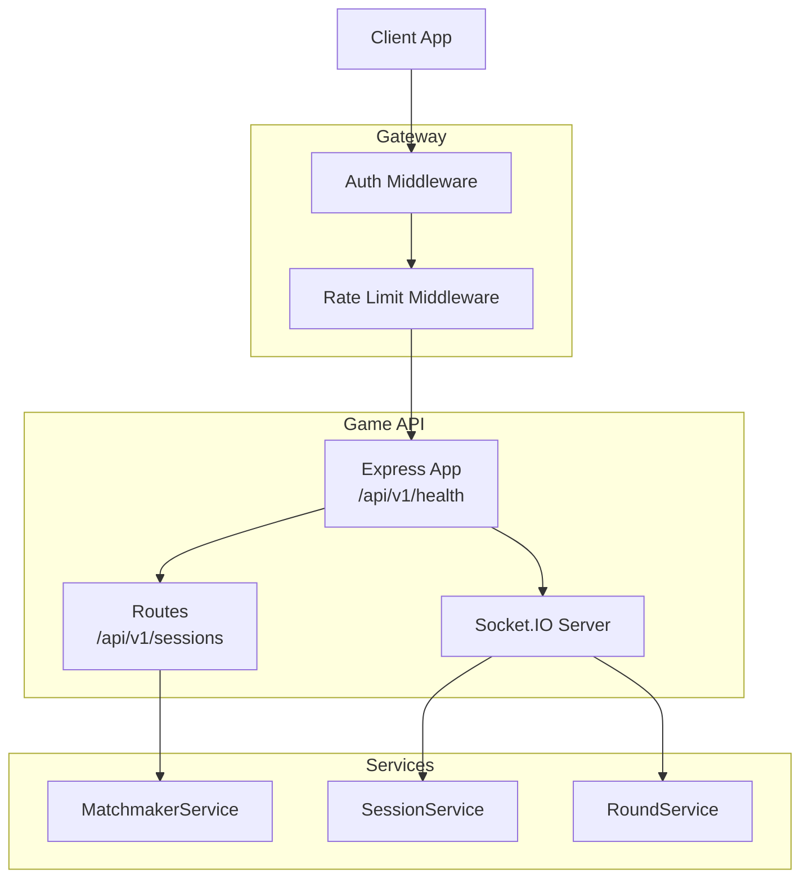
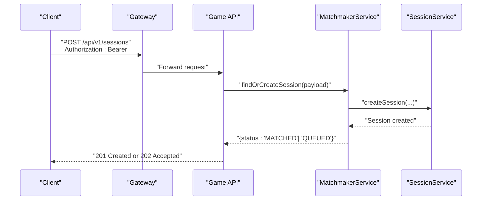
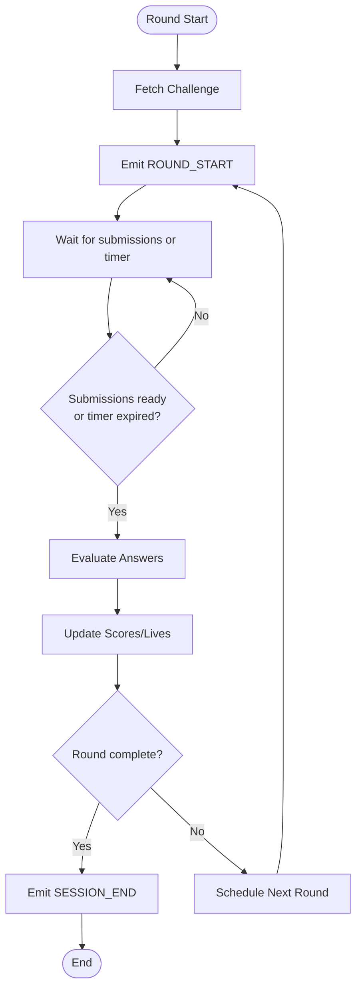
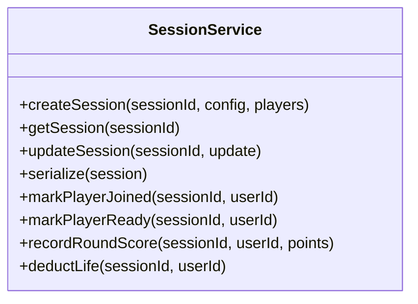
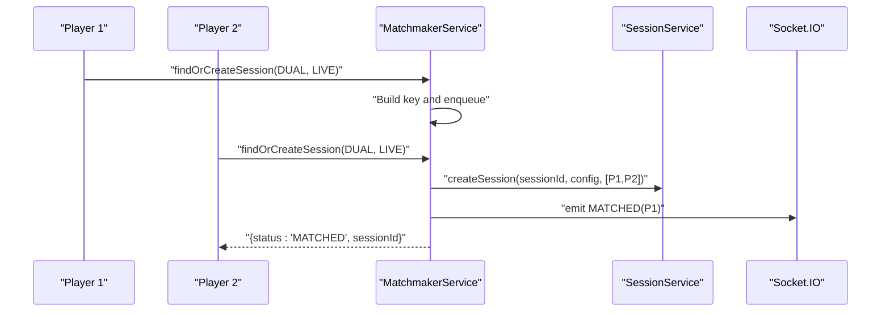
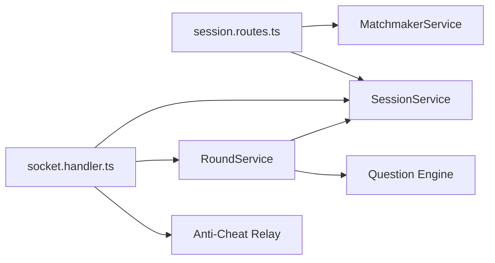

# REST API Endpoints

<cite>
**Referenced Files in This Document**
- [app.ts](file://apps/game-api/src/app.ts)
- [index.ts](file://apps/game-api/src/index.ts)
- [session.routes.ts](file://apps/game-api/src/routes/session.routes.ts)
- [session.service.ts](file://apps/game-api/src/services/session.service.ts)
- [matchmaker.service.ts](file://apps/game-api/src/services/matchmaker.service.ts)
- [round.service.ts](file://apps/game-api/src/services/round.service.ts)
- [socket.handler.ts](file://apps/game-api/src/websocket/socket.handler.ts)
- [socket.manager.ts](file://apps/game-api/src/websocket/socket.manager.ts)
- [auth.ts](file://apps/gateway/src/middleware/auth.ts)
- [rate-limit.ts](file://apps/gateway/src/middleware/rate-limit.ts)
- [redis.ts](file://apps/gateway/src/redis.ts)
- [route.ts](file://apps/web/app/api/auth/[...nextauth]/route.ts)
</cite>

## Table of Contents
1. [Introduction](#introduction)
2. [Project Structure](#project-structure)
3. [Core Components](#core-components)
4. [Architecture Overview](#architecture-overview)
5. [Detailed Component Analysis](#detailed-component-analysis)
6. [Dependency Analysis](#dependency-analysis)
7. [Performance Considerations](#performance-considerations)
8. [Troubleshooting Guide](#troubleshooting-guide)
9. [Conclusion](#conclusion)
10. [Appendices](#appendices)

## Introduction
This document describes the Game API REST endpoints and related WebSocket interactions used by the client to manage gaming sessions, submit answers, and receive real-time updates. It covers HTTP endpoints for session lifecycle, WebSocket events for gameplay, request validation, error handling, rate limiting, security, and versioning.

## Project Structure
The Game API service exposes HTTP endpoints under a versioned base path and integrates with Socket.IO for real-time gameplay events. Authentication and rate limiting are handled by the Gateway service.

**Diagram sources**
- [app.ts](file://apps/game-api/src/app.ts#L25-L31)
- [index.ts](file://apps/game-api/src/index.ts#L18-L27)
- [session.routes.ts](file://apps/game-api/src/routes/session.routes.ts#L19-L35)
- [matchmaker.service.ts](file://apps/game-api/src/services/matchmaker.service.ts#L47-L57)
- [session.service.ts](file://apps/game-api/src/services/session.service.ts#L18-L46)
- [round.service.ts](file://apps/game-api/src/services/round.service.ts#L179-L198)

**Section sources**
- [app.ts](file://apps/game-api/src/app.ts#L12-L31)
- [index.ts](file://apps/game-api/src/index.ts#L9-L34)

## Core Components
- HTTP routing: Versioned base path for REST endpoints.
- Session lifecycle: Create, join, ready, and terminate sessions.
- Real-time events: Player identification, room join, readiness, submissions, telemetry, and session lifecycle events.
- Validation: Zod-based request validation for session creation.
- Error handling: Centralized error handling for validation and unhandled errors.
- Services: Session persistence, matchmaking, and round orchestration.

**Section sources**
- [app.ts](file://apps/game-api/src/app.ts#L25-L31)
- [session.routes.ts](file://apps/game-api/src/routes/session.routes.ts#L7-L17)
- [socket.handler.ts](file://apps/game-api/src/websocket/socket.handler.ts#L62-L308)

## Architecture Overview
The Game API exposes:
- REST endpoints under /api/v1/sessions for session management.
- A health check under /api/v1/health.
- WebSocket endpoints for real-time gameplay.

**Diagram sources**
- [session.routes.ts](file://apps/game-api/src/routes/session.routes.ts#L19-L35)
- [matchmaker.service.ts](file://apps/game-api/src/services/matchmaker.service.ts#L47-L72)
- [session.service.ts](file://apps/game-api/src/services/session.service.ts#L19-L46)

## Detailed Component Analysis

### REST Endpoints

#### Base Path and Versioning
- Base path: /api/v1
- Versioning: Semver-like path segment (/v1) indicates stable API surface.

**Section sources**
- [app.ts](file://apps/game-api/src/app.ts#L25-L31)

#### Health Check
- Method: GET
- Path: /api/v1/health
- Purpose: Service health probe.
- Response: JSON with status and service name.
- Authentication: Not required by the route; public.

**Section sources**
- [app.ts](file://apps/game-api/src/app.ts#L28-L31)

#### Session Management

##### Create Session
- Method: POST
- Path: /api/v1/sessions
- Authentication: Required via Authorization: Bearer token.
- Request Schema (Zod):
  - mode: literal "ARCADE"
  - playerFormat: enum ["SINGLE", "DUAL"]
  - sessionType: enum ["TIMER", "LIVE"]
  - category: enum ["MISSING_LINK", "BOTTLENECK", "TRACING"] or null
  - userId: string (min length 1)
  - socketId: string (optional)
- Validation rules:
  - TIMER mode requires category to be non-null.
- Responses:
  - 201 Created: Session matched immediately.
  - 202 Accepted: Queued for matching.
  - 400 Bad Request: Validation error or matchmaker error.
- Example cURL:
  - curl -X POST "$BASE_URL/api/v1/sessions" \
    -H "Authorization: Bearer $TOKEN" \
    -H "Content-Type: application/json" \
    -d '{"mode":"ARCADE","playerFormat":"DUAL","sessionType":"LIVE","userId":"user-1"}'

**Section sources**
- [session.routes.ts](file://apps/game-api/src/routes/session.routes.ts#L7-L17)
- [session.routes.ts](file://apps/game-api/src/routes/session.routes.ts#L19-L35)
- [matchmaker.service.ts](file://apps/game-api/src/services/matchmaker.service.ts#L47-L57)

### WebSocket Events

#### Authentication and Identification
- Event: IDENTIFY
  - Payload: { userId: string }
  - Behavior: Associates socket with user ID, restores active session room, delivers pending MATCHED if exists.
- Event: IDENTIFIED
  - Emitted: As acknowledgment after IDENTIFY.

**Section sources**
- [socket.handler.ts](file://apps/game-api/src/websocket/socket.handler.ts#L72-L106)

#### Session Lifecycle
- Event: JOIN_SESSION
  - Payload: { sessionId: string, userId: string }
  - Acknowledgment: ack(response with ok/payload or ok=false/error)
  - Behavior: Joins socket to session room, marks player joined, sets active session, emits SESSION_JOINED.
- Event: PLAYER_READY
  - Payload: { sessionId: string, userId: string }
  - Behavior: Marks player ready; when all players ready, starts round 1.

**Section sources**
- [socket.handler.ts](file://apps/game-api/src/websocket/socket.handler.ts#L111-L157)
- [socket.handler.ts](file://apps/game-api/src/websocket/socket.handler.ts#L162-L202)

#### Gameplay Events
- Event: SUBMIT_ANSWER
  - Payload: { sessionId: string, userId: string, answer: string, roundNumber: number }
  - Behavior: Evaluates answer, emits ROUND_RESULT to submitter and OPPONENT_TELEMETRY/PROGRESS to opponents.
- Event: TYPING_TELEMETRY
  - Payload: { sessionId, userId, charsTyped, wpm, codeLength, templateLength? }
  - Behavior: Relays telemetry to opponents as OPPONENT_TELEMETRY.

**Section sources**
- [socket.handler.ts](file://apps/game-api/src/websocket/socket.handler.ts#L273-L289)
- [socket.handler.ts](file://apps/game-api/src/websocket/socket.handler.ts#L206-L240)

#### Anti-Cheat Telemetry Relay
- Events: PASTE_DETECTED, FOCUS_LOST, FOCUS_RESTORED, KEYSTROKE_BURST, MOUSE_INACTIVE, SOLUTION_SUBMITTED, FAST_SOLUTION
- Behavior: Forwards selected telemetry events to the anti-cheat service.

**Section sources**
- [socket.handler.ts](file://apps/game-api/src/websocket/socket.handler.ts#L9-L17)
- [socket.handler.ts](file://apps/game-api/src/websocket/socket.handler.ts#L292-L297)

#### Session Termination and Requeue
- Event: SURVIVAL_REQUEUE
  - Payload: CreateSessionPayload with optional userId
  - Behavior: Requeues winner for next match; emits MATCHED (single) or SURVIVAL_QUEUED (dual).

**Section sources**
- [socket.handler.ts](file://apps/game-api/src/websocket/socket.handler.ts#L244-L270)

### Round Orchestration and State

#### RoundService Responsibilities
- Initializes session state and manages rounds.
- Fetches challenges from the Question Engine.
- Evaluates answers and updates scores/lives.
- Emits round start, timer sync, timer expiry, and session end events.
- Handles auto-submit for pending players on timer expiry or live advance.

**Diagram sources**
- [round.service.ts](file://apps/game-api/src/services/round.service.ts#L425-L449)
- [round.service.ts](file://apps/game-api/src/services/round.service.ts#L451-L467)
- [round.service.ts](file://apps/game-api/src/services/round.service.ts#L487-L589)

**Section sources**
- [round.service.ts](file://apps/game-api/src/services/round.service.ts#L179-L198)
- [round.service.ts](file://apps/game-api/src/services/round.service.ts#L206-L285)
- [round.service.ts](file://apps/game-api/src/services/round.service.ts#L313-L423)

### Session Persistence and Data Model

#### SessionService
- Stores session metadata and player data in Redis with TTL.
- Tracks joined/ready counts, pending matches, and active sessions.
- Serializes session data for round/result payloads.

**Diagram sources**
- [session.service.ts](file://apps/game-api/src/services/session.service.ts#L18-L167)

**Section sources**
- [session.service.ts](file://apps/game-api/src/services/session.service.ts#L19-L46)
- [session.service.ts](file://apps/game-api/src/services/session.service.ts#L128-L151)

### Matchmaking and Queue Management

#### MatchmakerService
- Builds waiting room keys by session type and category.
- Creates sessions for single-player or pairs players in dual mode.
- Emits MATCHED via socket to the waiting player and returns sessionId in HTTP response for the second player.

**Diagram sources**
- [matchmaker.service.ts](file://apps/game-api/src/services/matchmaker.service.ts#L74-L169)
- [session.service.ts](file://apps/game-api/src/services/session.service.ts#L19-L46)

**Section sources**
- [matchmaker.service.ts](file://apps/game-api/src/services/matchmaker.service.ts#L17-L35)
- [matchmaker.service.ts](file://apps/game-api/src/services/matchmaker.service.ts#L74-L169)

## Dependency Analysis

**Diagram sources**
- [session.routes.ts](file://apps/game-api/src/routes/session.routes.ts#L25-L30)
- [matchmaker.service.ts](file://apps/game-api/src/services/matchmaker.service.ts#L42-L45)
- [socket.handler.ts](file://apps/game-api/src/websocket/socket.handler.ts#L62-L67)
- [round.service.ts](file://apps/game-api/src/services/round.service.ts#L12-L15)

**Section sources**
- [index.ts](file://apps/game-api/src/index.ts#L12-L27)
- [app.ts](file://apps/game-api/src/app.ts#L25-L31)

## Performance Considerations
- Round timers synchronize every second; ensure clients poll TIMER_SYNC to avoid drift.
- Auto-submit on timer expiry prevents deadlocks in dual mode; design clients to handle empty-answer submissions gracefully.
- Redis TTLs prevent memory leaks; ensure Redis availability for session persistence and queue management.
- Socket rooms minimize broadcast overhead; maintain room membership after reconnects.

[No sources needed since this section provides general guidance]

## Troubleshooting Guide

### Common HTTP Errors
- 400 Validation Error: Request body fails Zod validation (e.g., TIMER mode without category).
- 400 Matchmaker Error: Matchmaker throws an error (e.g., invalid payload).
- 500 Internal Error: Unhandled application error; check logs.

**Section sources**
- [app.ts](file://apps/game-api/src/app.ts#L34-L62)
- [session.routes.ts](file://apps/game-api/src/routes/session.routes.ts#L20-L23)

### WebSocket Issues
- IDENTIFY failed: Verify user ID and token; ensure socket registers successfully.
- JOIN_SESSION failed: Session not found/expired; re-queue.
- PLAYER_READY not starting round: Ensure all players are ready and socket is in room.
- SUBMIT_ANSWER not emitting results: Check round state and used challenge IDs.

**Section sources**
- [socket.handler.ts](file://apps/game-api/src/websocket/socket.handler.ts#L72-L106)
- [socket.handler.ts](file://apps/game-api/src/websocket/socket.handler.ts#L111-L157)
- [socket.handler.ts](file://apps/game-api/src/websocket/socket.handler.ts#L162-L202)
- [socket.handler.ts](file://apps/game-api/src/websocket/socket.handler.ts#L273-L289)

### Rate Limiting
- The Gateway enforces sliding-window rate limits:
  - General: 120 requests per 60 seconds per user/IP.
  - Code runner: 10 requests per 60 seconds per user/IP.
- Headers: X-RateLimit-Limit and X-RateLimit-Remaining.
- On exceeding limit: 429 with retry-after hint.

**Section sources**
- [rate-limit.ts](file://apps/gateway/src/middleware/rate-limit.ts#L15-L79)
- [redis.ts](file://apps/gateway/src/redis.ts#L1-L54)

### Security and Authentication
- Authentication: Bearer token via Authorization header.
- Public routes: /api/v1/health and NextAuth callbacks under /api/auth/* are exempt.
- Anti-Cheat telemetry relay: Forwarded securely to the anti-cheat service.

**Section sources**
- [auth.ts](file://apps/gateway/src/middleware/auth.ts#L18-L37)
- [route.ts](file://apps/web/app/api/auth/[...nextauth]/route.ts#L1-L4)
- [socket.handler.ts](file://apps/game-api/src/websocket/socket.handler.ts#L19-L60)

## Conclusion
The Game API provides a versioned REST interface for session management and a robust WebSocket protocol for real-time gameplay. Validation, error handling, and rate limiting are centralized at the Gateway and within the Game API. Clients should handle both HTTP responses and WebSocket events to support seamless matchmaking, round progression, and telemetry.

[No sources needed since this section summarizes without analyzing specific files]

## Appendices

### API Usage Examples

- Create a LIVE dual session:
  - curl -X POST "$BASE_URL/api/v1/sessions" \
    -H "Authorization: Bearer $TOKEN" \
    -H "Content-Type: application/json" \
    -d '{"mode":"ARCADE","playerFormat":"DUAL","sessionType":"LIVE","userId":"user-1"}'

- Join a session:
  - WS: emit IDENTIFY { userId }; then emit JOIN_SESSION { sessionId, userId }

- Start a round:
  - WS: emit PLAYER_READY { sessionId, userId }; wait for ROUND_START

- Submit an answer:
  - WS: emit SUBMIT_ANSWER { sessionId, userId, answer, roundNumber }

- Anti-Cheat telemetry:
  - WS: emit PASTE_DETECTED / SOLUTION_SUBMITTED with structured payload

**Section sources**
- [session.routes.ts](file://apps/game-api/src/routes/session.routes.ts#L19-L35)
- [socket.handler.ts](file://apps/game-api/src/websocket/socket.handler.ts#L72-L106)
- [socket.handler.ts](file://apps/game-api/src/websocket/socket.handler.ts#L111-L157)
- [socket.handler.ts](file://apps/game-api/src/websocket/socket.handler.ts#L162-L202)
- [socket.handler.ts](file://apps/game-api/src/websocket/socket.handler.ts#L273-L289)
- [socket.handler.ts](file://apps/game-api/src/websocket/socket.handler.ts#L292-L297)