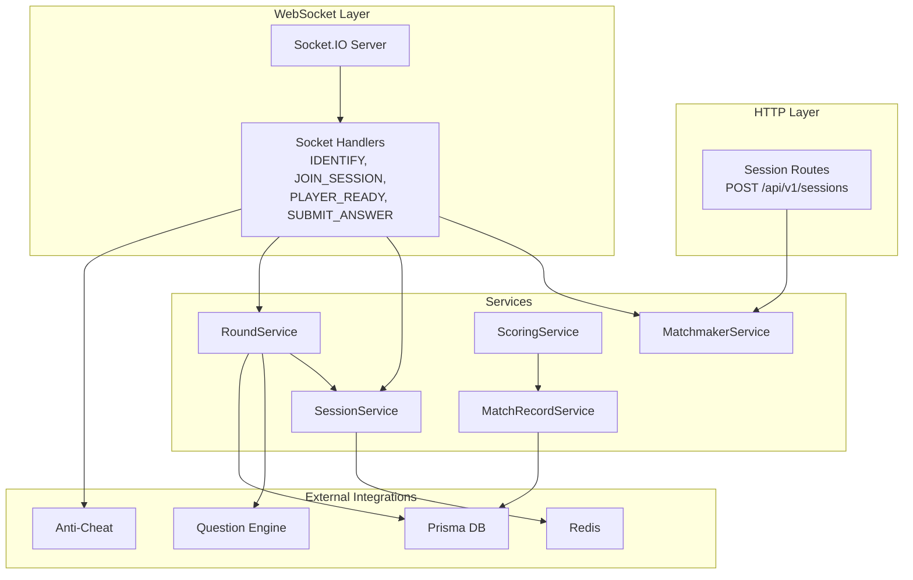
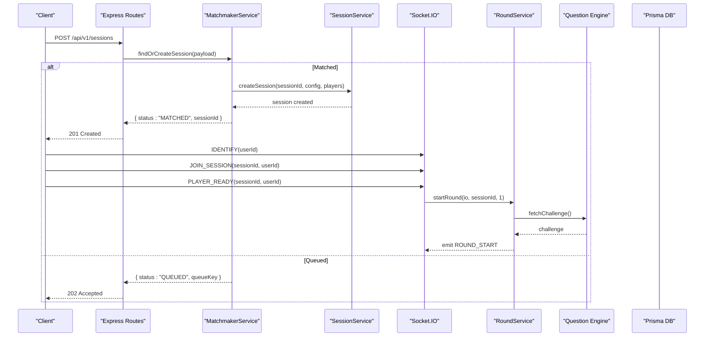
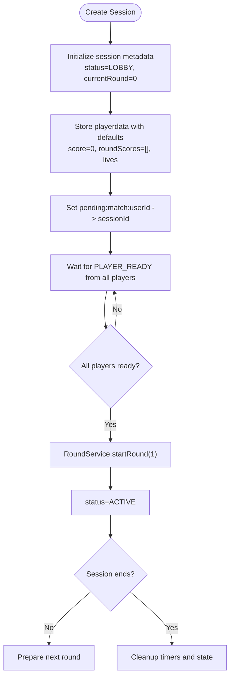
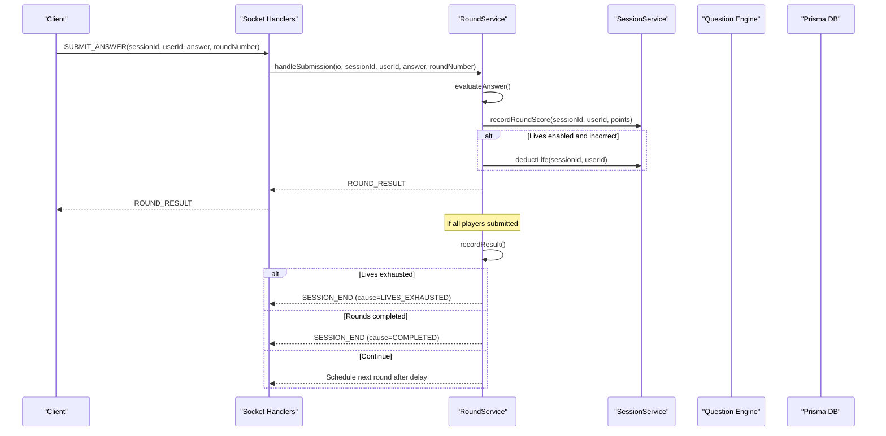
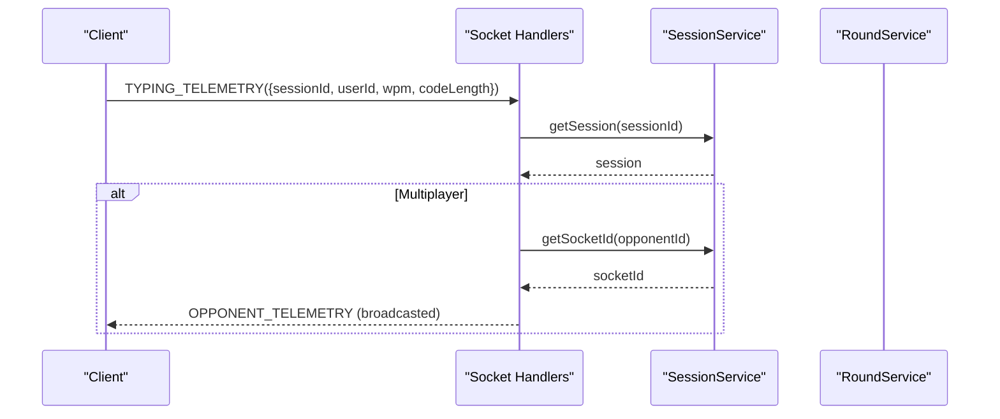
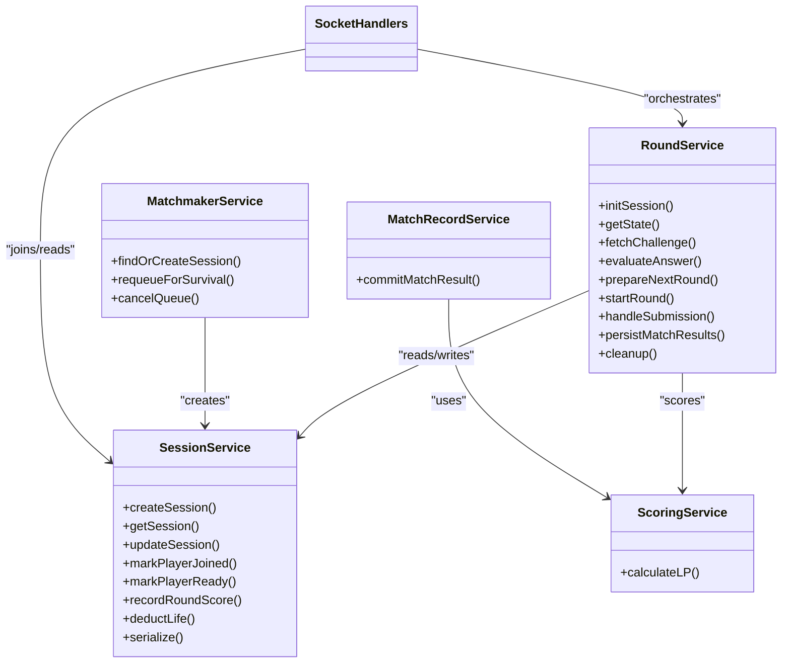

# Session and Game State Management

<cite>
**Referenced Files in This Document**
- [index.ts](file://apps/game-api/src/index.ts)
- [app.ts](file://apps/game-api/src/app.ts)
- [session.routes.ts](file://apps/game-api/src/routes/session.routes.ts)
- [session.service.ts](file://apps/game-api/src/services/session.service.ts)
- [round.service.ts](file://apps/game-api/src/services/round.service.ts)
- [scoring.service.ts](file://apps/game-api/src/services/scoring.service.ts)
- [match-record.service.ts](file://apps/game-api/src/services/match-record.service.ts)
- [matchmaker.service.ts](file://apps/game-api/src/services/matchmaker.service.ts)
- [socket.handler.ts](file://apps/game-api/src/websocket/socket.handler.ts)
- [socket.manager.ts](file://apps/game-api/src/websocket/socket.manager.ts)
- [session.ts](file://packages/types/src/session.ts)
</cite>

## Table of Contents
1. [Introduction](#introduction)
2. [Project Structure](#project-structure)
3. [Core Components](#core-components)
4. [Architecture Overview](#architecture-overview)
5. [Detailed Component Analysis](#detailed-component-analysis)
6. [Dependency Analysis](#dependency-analysis)
7. [Performance Considerations](#performance-considerations)
8. [Troubleshooting Guide](#troubleshooting-guide)
9. [Conclusion](#conclusion)

## Introduction
This document explains the session and game state management system for the LogicForge game platform. It covers how sessions are created and tracked, how rounds are orchestrated with time controls and state transitions, how scoring and rankings are calculated, and how data is persisted and recovered. It also documents synchronization patterns, event-driven updates, and integration with external services such as the question engine and anti-cheat telemetry.

## Project Structure
The game API exposes HTTP endpoints and WebSocket channels to manage sessions, orchestrate rounds, and synchronize client state. The core services are:
- SessionService: manages session metadata, player readiness, and player data persistence.
- RoundService: orchestrates round lifecycle, time controls, evaluation, and outcomes.
- ScoringService: computes LP rewards and outcomes for different game modes.
- MatchRecordService: persists match outcomes and updates global scores atomically.
- MatchmakerService: creates sessions and matches players for dual mode.
- Socket handlers: translate client events into service actions and emit state updates.



**Diagram sources**
- [index.ts](file://apps/game-api/src/index.ts#L1-L45)
- [session.routes.ts](file://apps/game-api/src/routes/session.routes.ts#L1-L38)
- [socket.handler.ts](file://apps/game-api/src/websocket/socket.handler.ts#L1-L310)
- [session.service.ts](file://apps/game-api/src/services/session.service.ts#L1-L167)
- [round.service.ts](file://apps/game-api/src/services/round.service.ts#L1-L1006)
- [scoring.service.ts](file://apps/game-api/src/services/scoring.service.ts#L1-L104)
- [match-record.service.ts](file://apps/game-api/src/services/match-record.service.ts#L1-L51)
- [matchmaker.service.ts](file://apps/game-api/src/services/matchmaker.service.ts#L1-L206)

**Section sources**
- [index.ts](file://apps/game-api/src/index.ts#L1-L45)
- [app.ts](file://apps/game-api/src/app.ts#L1-L63)
- [session.routes.ts](file://apps/game-api/src/routes/session.routes.ts#L1-L38)

## Core Components
- SessionService: Creates sessions, tracks readiness, serializes player data, and maintains Redis-backed state for quick reads/writes.
- RoundService: Manages round state, timers, challenge fetching, answer evaluation, and session termination conditions.
- ScoringService: Computes LP rewards and outcomes for single/dual/story modes.
- MatchRecordService: Persists match records and global scores in a transaction-safe manner.
- MatchmakerService: Builds session configs and matches dual players from a waiting room.
- Socket handlers: Bridge client events to services and broadcast state updates.

**Section sources**
- [session.service.ts](file://apps/game-api/src/services/session.service.ts#L1-L167)
- [round.service.ts](file://apps/game-api/src/services/round.service.ts#L1-L1006)
- [scoring.service.ts](file://apps/game-api/src/services/scoring.service.ts#L1-L104)
- [match-record.service.ts](file://apps/game-api/src/services/match-record.service.ts#L1-L51)
- [matchmaker.service.ts](file://apps/game-api/src/services/matchmaker.service.ts#L1-L206)
- [socket.handler.ts](file://apps/game-api/src/websocket/socket.handler.ts#L1-L310)

## Architecture Overview
The system uses a hybrid HTTP/WebSocket architecture:
- HTTP: Session creation and matchmaking.
- WebSocket: Real-time round orchestration, timer sync, and live telemetry.
- Redis: Fast session and player data storage with TTLs.
- Prisma DB: Persistent match records and user scores.



**Diagram sources**
- [session.routes.ts](file://apps/game-api/src/routes/session.routes.ts#L19-L35)
- [matchmaker.service.ts](file://apps/game-api/src/services/matchmaker.service.ts#L47-L57)
- [session.service.ts](file://apps/game-api/src/services/session.service.ts#L19-L46)
- [socket.handler.ts](file://apps/game-api/src/websocket/socket.handler.ts#L108-L202)
- [round.service.ts](file://apps/game-api/src/services/round.service.ts#L451-L467)

## Detailed Component Analysis

### Session Lifecycle and Persistence
- Creation: SessionService creates a session with initial status LOBBY, sets TTL, initializes player data, and stores pending match keys for each player.
- Joining: Clients join rooms and are marked joined; active session is tracked per user.
- Readiness: Players mark readiness; when all are ready, RoundService starts round 1.
- Persistence: Player scores and lives are stored in Redis under session-specific keys with TTL.



**Diagram sources**
- [session.service.ts](file://apps/game-api/src/services/session.service.ts#L19-L46)
- [socket.handler.ts](file://apps/game-api/src/websocket/socket.handler.ts#L159-L202)
- [round.service.ts](file://apps/game-api/src/services/round.service.ts#L451-L467)

**Section sources**
- [session.service.ts](file://apps/game-api/src/services/session.service.ts#L18-L167)
- [socket.handler.ts](file://apps/game-api/src/websocket/socket.handler.ts#L108-L202)

### Round Orchestration and Time Controls
- State management: RoundService maintains per-session state including current round, lives, category history, and completion guards.
- Timers: Two timer mechanisms:
  - Round timer: emits TIMER_SYNC every second and auto-submits pending players on expiry.
  - Live advance timer: schedules auto-submit for pending players after 15 seconds in live mode.
- Completion guard: Ensures recordResult is invoked exactly once per round to prevent race conditions.
- Evaluation: Answers are evaluated against challenge solutions; points are awarded and lives deducted when applicable.



**Diagram sources**
- [socket.handler.ts](file://apps/game-api/src/websocket/socket.handler.ts#L272-L289)
- [round.service.ts](file://apps/game-api/src/services/round.service.ts#L722-L876)
- [round.service.ts](file://apps/game-api/src/services/round.service.ts#L890-L980)

**Section sources**
- [round.service.ts](file://apps/game-api/src/services/round.service.ts#L179-L1006)

### Scoring and Ranking Algorithms
- Arcade Single: Base points per correct answer, speed bonus for average time under threshold, accuracy bonus for ≥80%.
- Arcade Dual: Outcome-based with ELO adjustment; minimum loss penalty enforced.
- Story: Full reward for completing all challenges, partial reward per challenge otherwise.
- Persistence: MatchRecordService commits match records and global scores atomically.

```mermaid
flowchart TD
Start([Calculate LP]) --> Mode{"Mode"}
Mode --> |ARCADE_SINGLE| Single["Compute base + speed + accuracy bonuses"]
Mode --> |ARCADE_DUAL| Dual["Compute outcome + ELO shift<br/>with min loss clamp"]
Mode --> |STORY| Story["Full reward or partial per-challenge"]
Single --> Result([Return {lpEarned, outcome, breakdown}])
Dual --> Result
Story --> Result
```

**Diagram sources**
- [scoring.service.ts](file://apps/game-api/src/services/scoring.service.ts#L61-L103)
- [match-record.service.ts](file://apps/game-api/src/services/match-record.service.ts#L18-L50)

**Section sources**
- [scoring.service.ts](file://apps/game-api/src/services/scoring.service.ts#L1-L104)
- [match-record.service.ts](file://apps/game-api/src/services/match-record.service.ts#L1-L51)

### Event-Driven Updates and Synchronization
- Socket events: IDENTIFY, JOIN_SESSION, PLAYER_READY, SUBMIT_ANSWER, TYPING_TELEMETRY, SURVIVAL_REQUEUE.
- Broadcast patterns: ROOM updates for READY acknowledgments, OPPONENT_PROGRESS/TELEMETRY, TIMER_SYNC, ROUND_RESULT, SESSION_END.
- Anti-cheat telemetry relay: Events are forwarded to the anti-cheat service with sessionId and candidateId.



**Diagram sources**
- [socket.handler.ts](file://apps/game-api/src/websocket/socket.handler.ts#L204-L240)

**Section sources**
- [socket.handler.ts](file://apps/game-api/src/websocket/socket.handler.ts#L62-L310)

### Data Consistency and Recovery
- Redis TTLs: Sessions and transient keys expire automatically to prevent memory leaks.
- Transactional persistence: MatchRecordService uses Prisma transactions to ensure atomicity of match creation and score updates.
- Race condition guards: RoundService uses lastCompletedRound to prevent double-increment during concurrent submissions.
- Cleanup: Timers and state are cleared on session end to avoid dangling resources.

**Section sources**
- [session.service.ts](file://apps/game-api/src/services/session.service.ts#L3-L167)
- [match-record.service.ts](file://apps/game-api/src/services/match-record.service.ts#L27-L42)
- [round.service.ts](file://apps/game-api/src/services/round.service.ts#L494-L500)
- [round.service.ts](file://apps/game-api/src/services/round.service.ts#L982-L993)

## Dependency Analysis
- RoundService depends on SessionService for session state and player data, and on external Question Engine for challenges.
- Socket handlers depend on SessionService for room membership and on RoundService for round orchestration.
- MatchRecordService depends on ScoringService for LP calculations and on Prisma DB for persistence.
- MatchmakerService depends on SessionService for session creation and on Socket.IO for emitting MATCHED.



**Diagram sources**
- [session.service.ts](file://apps/game-api/src/services/session.service.ts#L18-L167)
- [round.service.ts](file://apps/game-api/src/services/round.service.ts#L179-L1006)
- [matchmaker.service.ts](file://apps/game-api/src/services/matchmaker.service.ts#L41-L206)
- [scoring.service.ts](file://apps/game-api/src/services/scoring.service.ts#L97-L103)
- [match-record.service.ts](file://apps/game-api/src/services/match-record.service.ts#L18-L50)

**Section sources**
- [index.ts](file://apps/game-api/src/index.ts#L1-L45)
- [socket.handler.ts](file://apps/game-api/src/websocket/socket.handler.ts#L1-L310)

## Performance Considerations
- Redis-first design: Session and player data are stored in Redis with TTLs to minimize DB load and enable fast reads/writes.
- Timer synchronization: Round timers emit periodic TIMER_SYNC events to keep clients aligned with server time.
- Concurrency guards: RoundService uses lastCompletedRound and submittedUserIds to prevent race conditions and double-round advancement.
- External service timeouts: Question Engine requests include fallbacks to reduce failure impact.
- Cleanup: Timers and state are cleared on session end to avoid resource leaks.

[No sources needed since this section provides general guidance]

## Troubleshooting Guide
- Session not found errors: Occur when Redis keys expire or when clients attempt to join non-existent sessions. Verify sessionId validity and TTLs.
- Round timer anomalies: Ensure TIMER_SYNC is emitted consistently and that handleTimerExpiry clears timers before invoking next round.
- Race conditions: Confirm that lastCompletedRound guard prevents duplicate round advancement in dual-player scenarios.
- Persistence failures: Review transaction logs for commitMatchResult; ensure DB connectivity and Prisma migrations are applied.
- Anti-cheat relay: Validate service availability and network connectivity; inspect relay logs for ingest rejections.

**Section sources**
- [round.service.ts](file://apps/game-api/src/services/round.service.ts#L487-L589)
- [round.service.ts](file://apps/game-api/src/services/round.service.ts#L786-L806)
- [match-record.service.ts](file://apps/game-api/src/services/match-record.service.ts#L18-L50)
- [socket.handler.ts](file://apps/game-api/src/websocket/socket.handler.ts#L19-L60)

## Conclusion
The session and game state management system combines Redis-backed session storage, robust round orchestration with dual timer controls, and transactional persistence to ensure correctness and responsiveness. The event-driven WebSocket layer keeps clients synchronized while the scoring service provides fair and transparent reward computation across game modes. Together, these components deliver a scalable and resilient gaming experience.