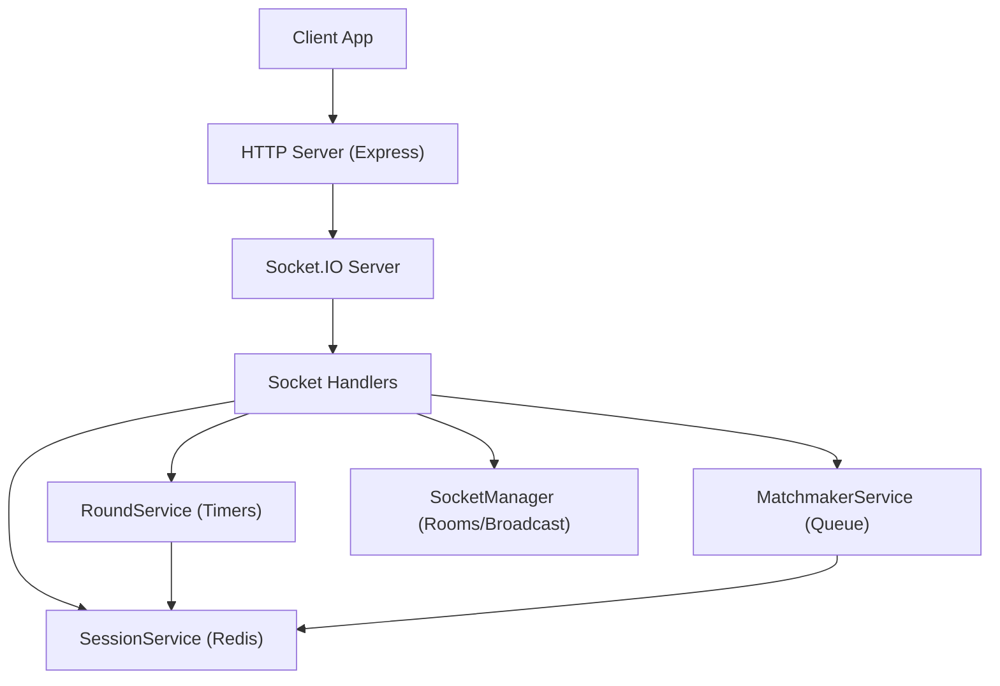
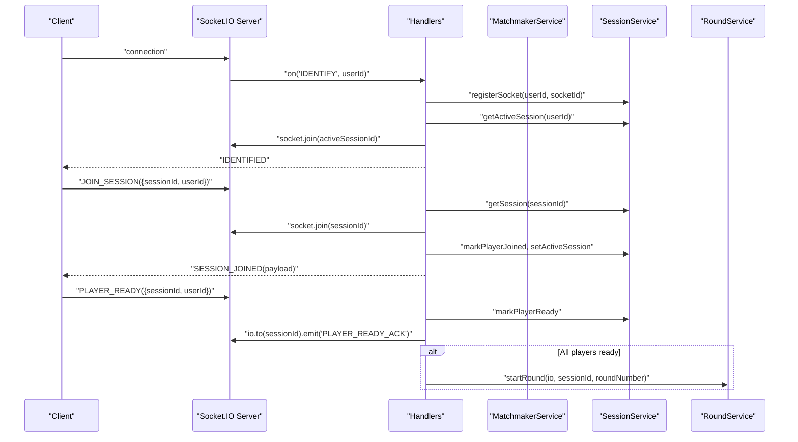
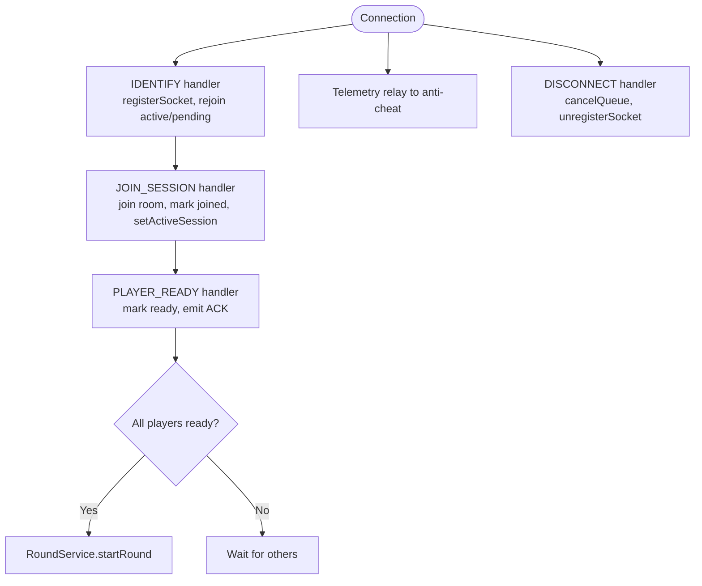
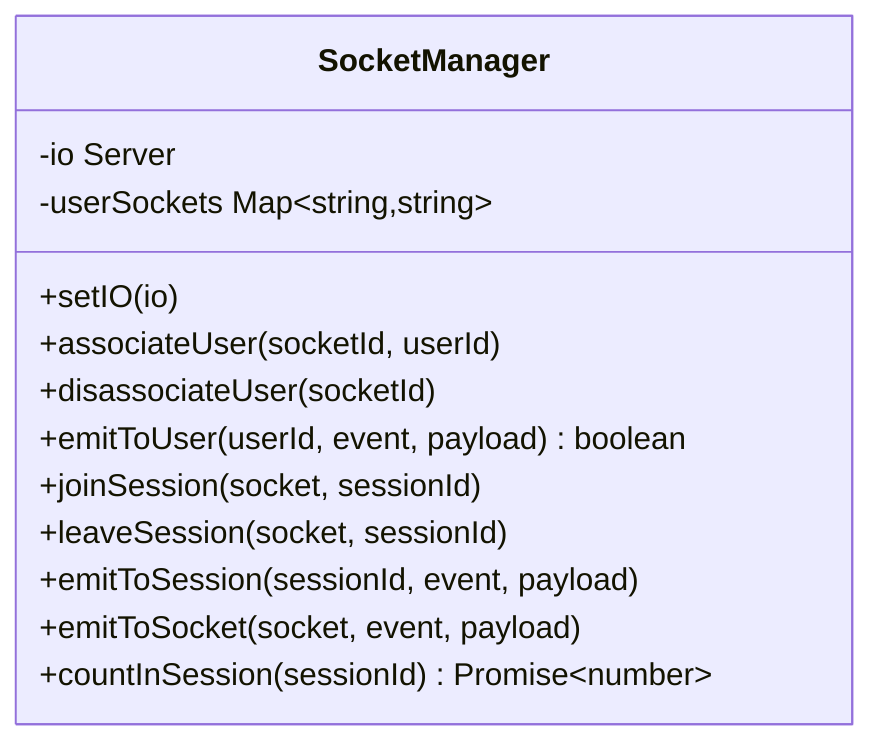
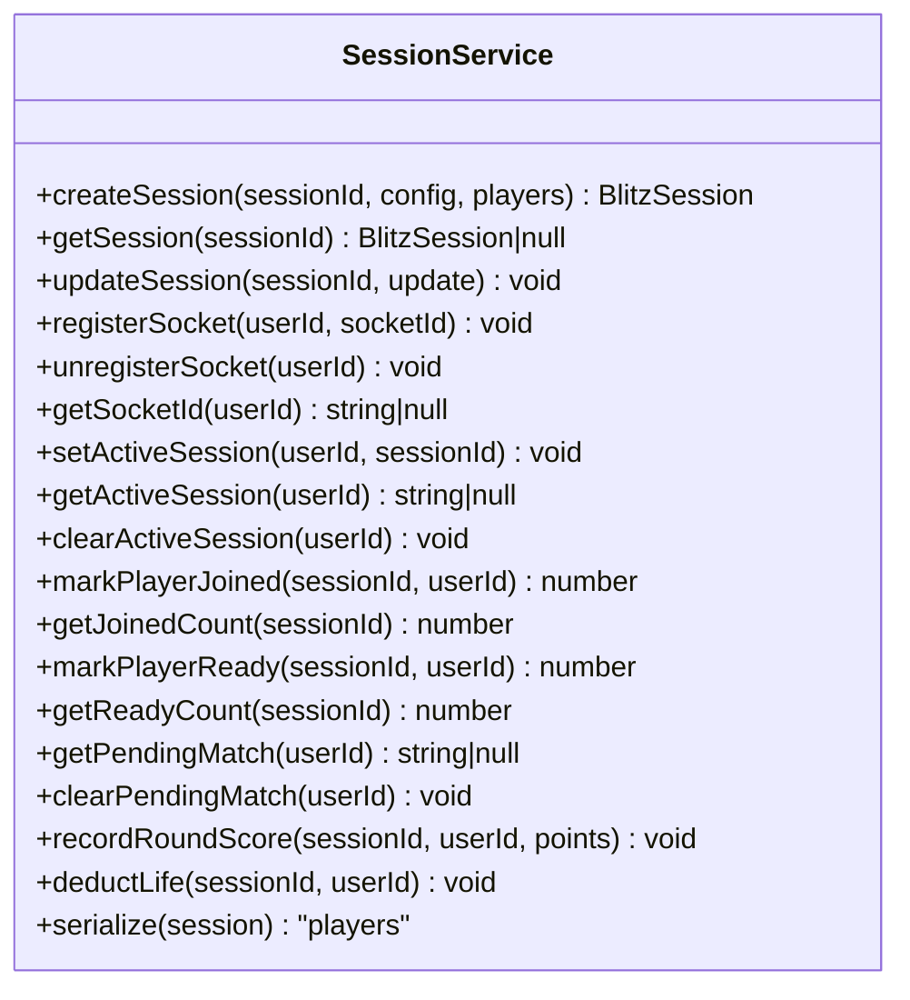
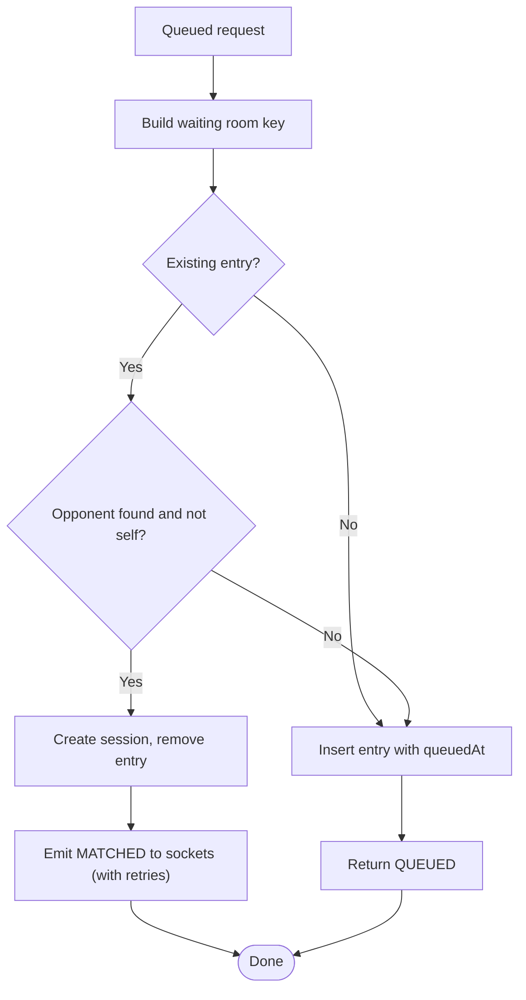
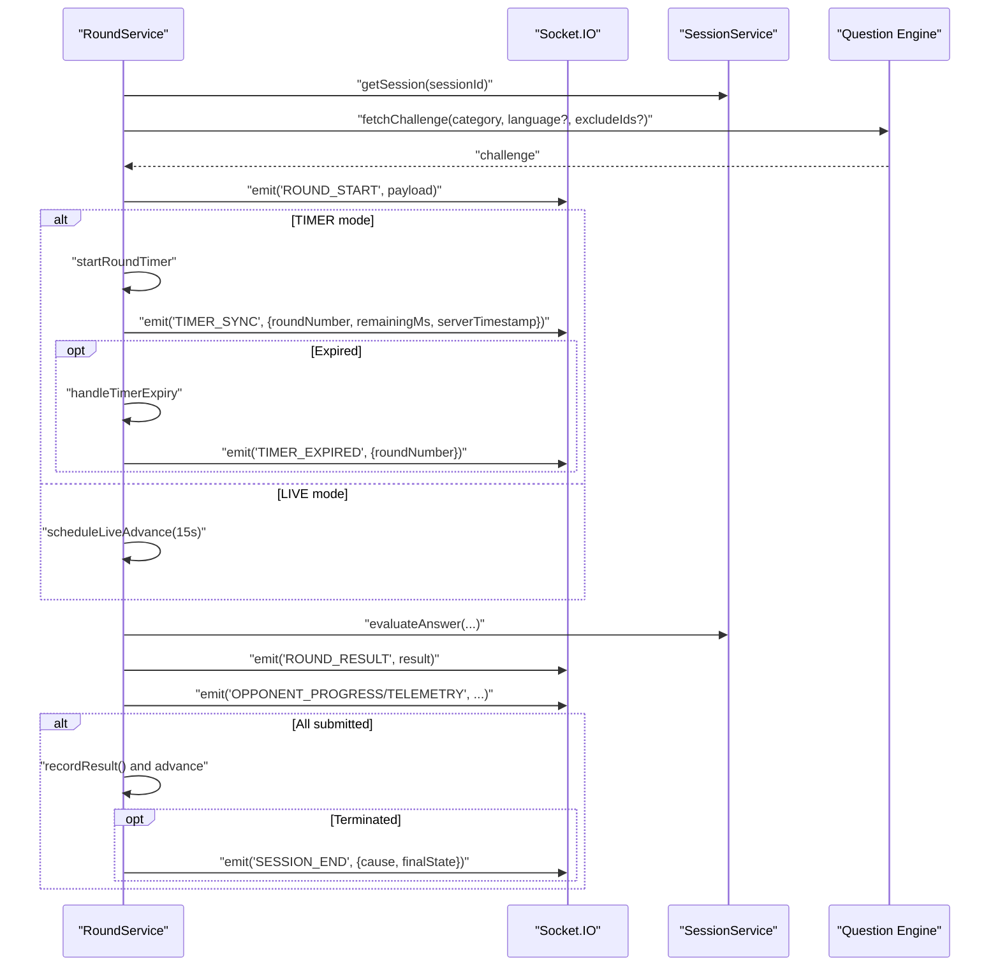
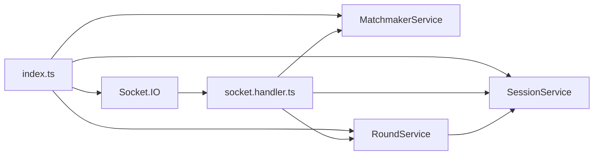

# WebSocket Session Management

<cite>
**Referenced Files in This Document**
- [index.ts](file://apps/game-api/src/index.ts)
- [app.ts](file://apps/game-api/src/app.ts)
- [socket.handler.ts](file://apps/game-api/src/websocket/socket.handler.ts)
- [socket.manager.ts](file://apps/game-api/src/websocket/socket.manager.ts)
- [session.service.ts](file://apps/game-api/src/services/session.service.ts)
- [matchmaker.service.ts](file://apps/game-api/src/services/matchmaker.service.ts)
- [round.service.ts](file://apps/game-api/src/services/round.service.ts)
- [session.routes.ts](file://apps/game-api/src/routes/session.routes.ts)
- [websocket.ts](file://packages/types/src/websocket.ts)
- [session.ts](file://packages/types/src/session.ts)
- [anti-cheat.ts](file://packages/types/src/anti-cheat.ts)
</cite>

## Table of Contents
1. [Introduction](#introduction)
2. [Project Structure](#project-structure)
3. [Core Components](#core-components)
4. [Architecture Overview](#architecture-overview)
5. [Detailed Component Analysis](#detailed-component-analysis)
6. [Dependency Analysis](#dependency-analysis)
7. [Performance Considerations](#performance-considerations)
8. [Troubleshooting Guide](#troubleshooting-guide)
9. [Conclusion](#conclusion)

## Introduction
This document describes the WebSocket session management system built with Socket.IO in the game-api application. It covers connection establishment, room management, message broadcasting, and event-driven communication patterns for game state synchronization, player actions, and telemetry. It also documents the socket manager architecture, session persistence, connection lifecycle management, error handling, reconnection mechanisms, and performance considerations for scaling multiple concurrent sessions.

## Project Structure
The WebSocket subsystem spans several modules:
- HTTP server bootstrap initializes Socket.IO and wires services.
- Socket handlers define client-server events and orchestrate session lifecycle.
- Session service persists session metadata and player state in Redis.
- Matchmaker service manages matchmaking and emits match events to clients.
- Round service coordinates round lifecycle, timers, and results.
- Type definitions standardize event schemas and payloads.

**Diagram sources**
- [index.ts](file://apps/game-api/src/index.ts#L1-L45)
- [socket.handler.ts](file://apps/game-api/src/websocket/socket.handler.ts#L62-L310)
- [session.service.ts](file://apps/game-api/src/services/session.service.ts#L18-L167)
- [matchmaker.service.ts](file://apps/game-api/src/services/matchmaker.service.ts#L41-L206)
- [round.service.ts](file://apps/game-api/src/services/round.service.ts#L179-L1006)
- [socket.manager.ts](file://apps/game-api/src/websocket/socket.manager.ts#L3-L56)

**Section sources**
- [index.ts](file://apps/game-api/src/index.ts#L1-L45)
- [app.ts](file://apps/game-api/src/app.ts#L1-L63)

## Core Components
- Socket.IO initialization and graceful shutdown.
- Socket handlers for connection, identification, session joining, readiness, submissions, telemetry relays, and disconnect.
- SocketManager for room membership, targeted emits, and session counts.
- SessionService for Redis-backed session and player state.
- MatchmakerService for dual-player queueing and match notifications.
- RoundService for round orchestration, timers, and outcomes.

**Section sources**
- [index.ts](file://apps/game-api/src/index.ts#L16-L34)
- [socket.handler.ts](file://apps/game-api/src/websocket/socket.handler.ts#L62-L310)
- [socket.manager.ts](file://apps/game-api/src/websocket/socket.manager.ts#L3-L56)
- [session.service.ts](file://apps/game-api/src/services/session.service.ts#L18-L167)
- [matchmaker.service.ts](file://apps/game-api/src/services/matchmaker.service.ts#L41-L206)
- [round.service.ts](file://apps/game-api/src/services/round.service.ts#L179-L1006)

## Architecture Overview
The system uses Socket.IO rooms to broadcast messages to session participants. Sessions are persisted in Redis, enabling cross-instance coordination and reconnection recovery. The matchmaker maintains a waiting room in memory keyed by session type and category, emitting match events to sockets.

**Diagram sources**
- [socket.handler.ts](file://apps/game-api/src/websocket/socket.handler.ts#L68-L202)
- [matchmaker.service.ts](file://apps/game-api/src/services/matchmaker.service.ts#L47-L169)
- [session.service.ts](file://apps/game-api/src/services/session.service.ts#L62-L90)
- [round.service.ts](file://apps/game-api/src/services/round.service.ts#L451-L467)

## Detailed Component Analysis

### Socket.IO Initialization and Lifecycle
- Creates HTTP server and Socket.IO server with CORS and polling/websocket transports.
- Registers socket handlers and injects services into Express for route use.
- Implements graceful shutdown to close Socket.IO and HTTP server.

**Section sources**
- [index.ts](file://apps/game-api/src/index.ts#L16-L34)
- [index.ts](file://apps/game-api/src/index.ts#L36-L45)

### Socket Handlers: Connection, Identification, and Rooms
- On connect, logs connection and registers handlers.
- IDENTIFY associates a user ID with a socket ID and re-joins active or pending sessions after reconnection.
- JOIN_SESSION validates session existence, adds user to room, updates Redis, and emits SESSION_JOINED with serialized player data.
- PLAYER_READY marks readiness, emits ACK, and starts the round when all players are ready.
- Telemetry relay: listens for predefined telemetry events and forwards them to the anti-cheat service.
- DISCONNECT cancels queues and unregisters sockets.

**Diagram sources**
- [socket.handler.ts](file://apps/game-api/src/websocket/socket.handler.ts#L68-L308)

**Section sources**
- [socket.handler.ts](file://apps/game-api/src/websocket/socket.handler.ts#L68-L308)

### SocketManager: Room Management and Broadcasting
- Associates user IDs to socket IDs for targeted emits.
- Joins/leaves rooms by session ID.
- Emits to a specific socket, to a user, or to an entire session room.
- Counts members in a session.

**Diagram sources**
- [socket.manager.ts](file://apps/game-api/src/websocket/socket.manager.ts#L3-L56)

**Section sources**
- [socket.manager.ts](file://apps/game-api/src/websocket/socket.manager.ts#L3-L56)

### SessionService: Session Persistence and Player State
- Stores sessions, player data, and auxiliary sets (joined/ready) in Redis with TTLs.
- Tracks active sessions and pending matches per user.
- Serializes player data for round/result payloads.

**Diagram sources**
- [session.service.ts](file://apps/game-api/src/services/session.service.ts#L18-L167)

**Section sources**
- [session.service.ts](file://apps/game-api/src/services/session.service.ts#L18-L167)

### MatchmakerService: Queueing and Matching
- Maintains a waiting room map keyed by session type and category.
- Matches two players for DUAL sessions and creates sessions with appropriate configs.
- Emits MATCHED to sockets, handling missing sockets with retries and Redis fallback.
- Supports survival requeue for SINGLE and DUAL modes.

**Diagram sources**
- [matchmaker.service.ts](file://apps/game-api/src/services/matchmaker.service.ts#L47-L169)

**Section sources**
- [matchmaker.service.ts](file://apps/game-api/src/services/matchmaker.service.ts#L41-L206)

### RoundService: Game State, Timers, and Outcomes
- Initializes and retrieves round state per session.
- Fetches challenges from the question engine with fallback strategies.
- Evaluates answers, updates scores and lives, and handles termination conditions.
- Manages round timers and live-mode advance timers.
- Emits round lifecycle events and outcomes to clients.
- Persists match results to the database.

**Diagram sources**
- [round.service.ts](file://apps/game-api/src/services/round.service.ts#L451-L876)
- [round.service.ts](file://apps/game-api/src/services/round.service.ts#L890-L980)

**Section sources**
- [round.service.ts](file://apps/game-api/src/services/round.service.ts#L179-L1006)

### Telemetry Relay to Anti-Cheat
- Handlers listen for specific telemetry events and forward them to the anti-cheat service endpoint.
- Extracts sessionId and candidateId from payload or socket data.
- Logs successes and failures, including network errors.

**Section sources**
- [socket.handler.ts](file://apps/game-api/src/websocket/socket.handler.ts#L19-L60)
- [socket.handler.ts](file://apps/game-api/src/websocket/socket.handler.ts#L291-L297)
- [anti-cheat.ts](file://packages/types/src/anti-cheat.ts#L5-L24)

### WebSocket Message Formats and Event Types
- Client-to-server events include JOIN_SESSION, READY, SUBMIT_ANSWER, LEAVE_SESSION, PING, and IDENTIFY.
- Server-to-client events include SESSION_JOINED, ROUND_START, TIMER_SYNC, ROUND_RESULT, OPPONENT_SUBMITTED, SESSION_COMPLETE, MATCH_FOUND, ERROR, and PONG.
- Payloads are strongly typed with Zod schemas for validation.

**Section sources**
- [websocket.ts](file://packages/types/src/websocket.ts#L4-L56)
- [websocket.ts](file://packages/types/src/websocket.ts#L58-L155)
- [session.ts](file://packages/types/src/session.ts#L25-L38)

## Dependency Analysis
- index.ts composes services and registers handlers.
- socket.handler.ts depends on SessionService, MatchmakerService, and RoundService.
- MatchmakerService depends on SessionService and Socket.IO for emits.
- RoundService depends on SessionService and external services for challenges and code execution.
- SessionService depends on Redis for persistence.

**Diagram sources**
- [index.ts](file://apps/game-api/src/index.ts#L12-L31)
- [socket.handler.ts](file://apps/game-api/src/websocket/socket.handler.ts#L62-L67)

**Section sources**
- [index.ts](file://apps/game-api/src/index.ts#L12-L31)
- [socket.handler.ts](file://apps/game-api/src/websocket/socket.handler.ts#L62-L67)

## Performance Considerations
- Use Redis for low-latency session and player state reads/writes.
- Prefer room-based emits to minimize fan-out overhead.
- Limit broadcast scope to session rooms and target individual sockets when possible.
- Tune transport options (websocket/polling) and keep-alive intervals to balance latency and bandwidth.
- Scale horizontally behind a load balancer; ensure sticky sessions or shared state for queueing and session state.
- Monitor round timers and live advance timers to avoid redundant scheduling.

[No sources needed since this section provides general guidance]

## Troubleshooting Guide
- Connection issues: Verify CORS configuration and transport settings in Socket.IO initialization.
- Reconnection: Clients should re-identify and rejoin rooms; ensure Redis keys for active sessions and pending matches are present.
- Queueing delays: Confirm waiting room entries are not stale and socket IDs are resolvable.
- Timer anomalies: Check for duplicate round completions guarded by lastCompletedRound.
- Anti-cheat relay failures: Inspect network connectivity and service availability; review logs for rejection or network errors.

**Section sources**
- [index.ts](file://apps/game-api/src/index.ts#L18-L24)
- [socket.handler.ts](file://apps/game-api/src/websocket/socket.handler.ts#L78-L101)
- [matchmaker.service.ts](file://apps/game-api/src/services/matchmaker.service.ts#L115-L146)
- [round.service.ts](file://apps/game-api/src/services/round.service.ts#L786-L806)
- [socket.handler.ts](file://apps/game-api/src/websocket/socket.handler.ts#L19-L60)

## Conclusion
The WebSocket session management system integrates Socket.IO with Redis-backed session state, robust room-based broadcasting, and event-driven orchestration for game rounds and telemetry. The design supports reliable reconnection, scalable horizontal deployment, and clear separation of concerns across services.