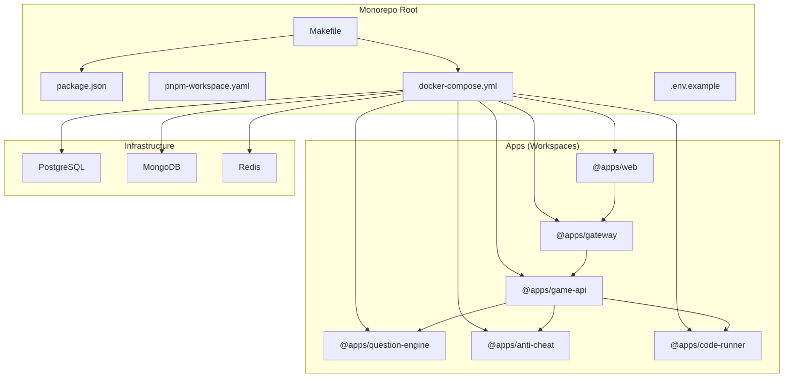
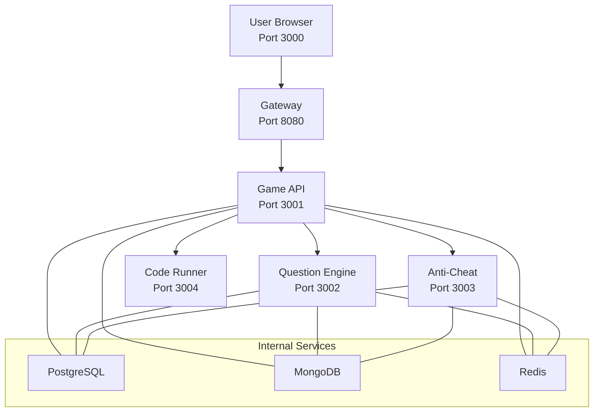
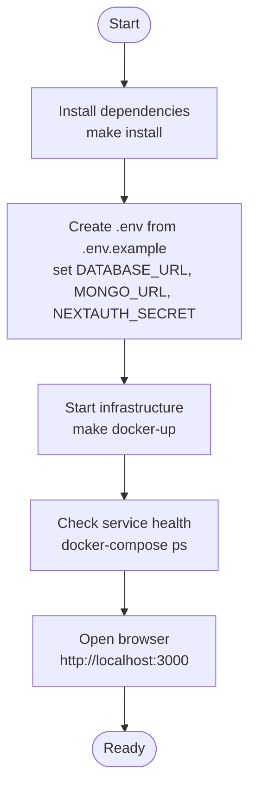
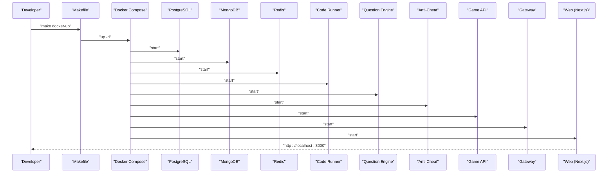
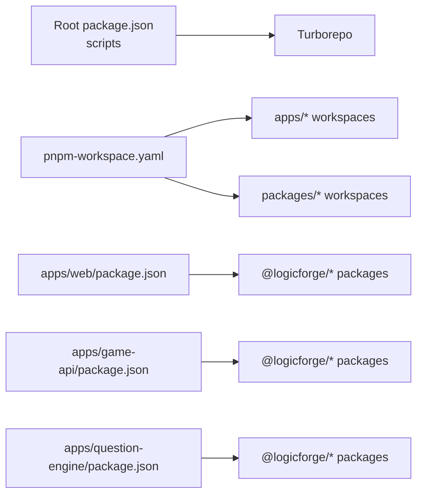

# Getting Started

<cite>
**Referenced Files in This Document**
- [README.md](file://README.md)
- [Makefile](file://Makefile)
- [package.json](file://package.json)
- [pnpm-workspace.yaml](file://pnpm-workspace.yaml)
- [docker-compose.yml](file://docker-compose.yml)
- [.env.example](file://.env.example)
- [apps/web/.env.example](file://apps/web/.env.example)
- [apps/game-api/.env.example](file://apps/game-api/.env.example)
- [apps/question-engine/.env.example](file://apps/question-engine/.env.example)
- [apps/anti-cheat/.env.example](file://apps/anti-cheat/.env.example)
- [apps/code-runner/go.mod](file://apps/code-runner/go.mod)
- [apps/web/package.json](file://apps/web/package.json)
- [apps/game-api/package.json](file://apps/game-api/package.json)
- [apps/question-engine/package.json](file://apps/question-engine/package.json)
</cite>

## Table of Contents
1. [Introduction](#introduction)
2. [Project Structure](#project-structure)
3. [Core Components](#core-components)
4. [Architecture Overview](#architecture-overview)
5. [Detailed Component Analysis](#detailed-component-analysis)
6. [Dependency Analysis](#dependency-analysis)
7. [Performance Considerations](#performance-considerations)
8. [Troubleshooting Guide](#troubleshooting-guide)
9. [Conclusion](#conclusion)
10. [Appendices](#appendices)

## Introduction
This guide helps you set up Logic Forge locally for development. It covers prerequisites, environment configuration, service startup, and verification steps. The platform is a monorepo built with Turborepo and pnpm workspaces, and orchestrated by Docker Compose. Services include a Next.js web client, API Gateway, Game API, Question Engine, Anti-Cheat, PostgreSQL, MongoDB, and Redis.

## Project Structure
Logic Forge is organized as a monorepo:
- Root manages shared tooling, scripts, and orchestration.
- Workspaces under apps/ host frontend and backend services.
- Workspaces under packages/ provide shared libraries and types.

Key characteristics:
- Monorepo manager: Turborepo
- Package manager: pnpm (workspace configuration)
- Orchestration: Docker Compose
- Go service: Code Runner requires Go >= 1.22

**Diagram sources**
- [Makefile](file://Makefile#L1-L55)
- [package.json](file://package.json#L1-L22)
- [pnpm-workspace.yaml](file://pnpm-workspace.yaml#L1-L3)
- [docker-compose.yml](file://docker-compose.yml#L1-L238)
- [.env.example](file://.env.example#L1-L62)

**Section sources**
- [README.md](file://README.md#L5-L19)
- [package.json](file://package.json#L1-L22)
- [pnpm-workspace.yaml](file://pnpm-workspace.yaml#L1-L3)
- [docker-compose.yml](file://docker-compose.yml#L1-L238)

## Core Components
- Web (Next.js): Frontend dashboard and game client.
- API Gateway: Public entrypoint for backend APIs and WebSockets.
- Game API: Core game logic and WebSocket endpoints.
- Question Engine: Question retrieval and randomization.
- Anti-Cheat: Heuristic analysis and scoring.
- Code Runner (Go): Sandboxed code execution service.
- Databases and Cache:
  - PostgreSQL: Core relational data.
  - MongoDB: Authentication and sessions.
  - Redis: Caching and real-time pub/sub.

Ports and topology are defined in the architecture table and Compose file.

**Section sources**
- [README.md](file://README.md#L8-L19)
- [docker-compose.yml](file://docker-compose.yml#L1-L238)

## Architecture Overview
The system runs in two Docker networks:
- public-net: Exposes port 8080 for the Gateway.
- internal-net: Internal-only services communicate here.

**Diagram sources**
- [README.md](file://README.md#L8-L19)
- [docker-compose.yml](file://docker-compose.yml#L157-L225)

## Detailed Component Analysis

### Prerequisites
- Node.js: >= 20
- pnpm: >= 8.15.0
- Docker & Docker Compose
- Go: >= 1.22 (required for Code Runner)

Verification steps:
- Confirm Node.js and pnpm versions meet minimums.
- Confirm Docker and Docker Compose are installed and running.
- Confirm Go version meets the requirement for the Code Runner service.

**Section sources**
- [README.md](file://README.md#L22-L26)
- [apps/code-runner/go.mod](file://apps/code-runner/go.mod#L1-L8)

### Local Setup Steps
Follow these steps to prepare your environment:

1) Install dependencies
- Use the Makefile target to install all workspace dependencies.

2) Prepare environment configuration
- At the repository root, create .env from .env.example and set required secrets and URLs.

3) Start infrastructure
- Bring up the Docker Compose stack in detached mode.

4) Verify services
- Check health checks and logs for each service.

5) Explore the application
- Open the web client at the configured port and navigate the UI.

**Diagram sources**
- [Makefile](file://Makefile#L14-L40)
- [.env.example](file://.env.example#L1-L62)
- [docker-compose.yml](file://docker-compose.yml#L1-L238)

**Section sources**
- [README.md](file://README.md#L20-L32)
- [Makefile](file://Makefile#L14-L40)
- [.env.example](file://.env.example#L1-L62)

### Environment Configuration
Configure environment variables per service:

- Root .env.example
  - Database connections for PostgreSQL, MongoDB, and Redis.
  - NextAuth configuration (URL and secret).
  - OAuth provider credentials (GitHub and Google).
  - Service ports and inter-service URLs.
  - Gateway URL and inter-service secret.

- apps/web/.env.example
  - Application and auth settings for the Next.js client.
  - MongoDB connection for sessions.
  - OAuth provider credentials.

- apps/game-api/.env.example
  - Port and environment for the Game API.
  - Database and cache URLs.

- apps/question-engine/.env.example
  - Port and environment for the Question Engine.
  - Database URL.

- apps/anti-cheat/.env.example
  - Port and environment for Anti-Cheat.
  - Cache URL.

Notes:
- Replace placeholder values with your own secrets and endpoints.
- For local Docker setup, use the URLs and ports defined in the Compose file.

**Section sources**
- [.env.example](file://.env.example#L1-L62)
- [apps/web/.env.example](file://apps/web/.env.example#L1-L17)
- [apps/game-api/.env.example](file://apps/game-api/.env.example#L1-L4)
- [apps/question-engine/.env.example](file://apps/question-engine/.env.example#L1-L3)
- [apps/anti-cheat/.env.example](file://apps/anti-cheat/.env.example#L1-L3)

### Development Workflow
- Install dependencies: make install
- Start services: make dev (runs Turborepo dev across workspaces)
- Build artifacts: make build
- Lint and test: make lint and make test
- Clean environment: make clean (removes node_modules and volumes)

Compose-based workflow:
- Start infrastructure: make docker-up
- Stop infrastructure: make docker-down
- Database helpers: make db-push and make db-studio

**Section sources**
- [Makefile](file://Makefile#L14-L55)
- [package.json](file://package.json#L4-L11)

### Service Startup Procedures
- Root Makefile targets:
  - setup: Creates .env from .env.example if missing.
  - install: Runs pnpm install.
  - dev: Starts all services in development mode.
  - build/lint/test/clean: Standard project tasks.
  - docker-up/docker-down: Starts/stops Docker Compose stack.
  - db-push/db-studio: Database-related helpers.

- Compose services:
  - PostgreSQL, MongoDB, Redis are provisioned with health checks.
  - Code Runner, Question Engine, Anti-Cheat, Game API depend on databases and cache.
  - Gateway exposes port 8080 and proxies to internal services.
  - Web frontend listens on port 3000 and connects to Gateway.

**Diagram sources**
- [Makefile](file://Makefile#L32-L40)
- [docker-compose.yml](file://docker-compose.yml#L1-L238)

**Section sources**
- [Makefile](file://Makefile#L32-L40)
- [docker-compose.yml](file://docker-compose.yml#L1-L238)

### Initial Project Exploration
- Web client: Access the dashboard and game client at the configured port.
- Gateway: All backend APIs and WebSocket endpoints are proxied through the Gateway.
- Game API: Core game logic and WebSocket endpoints.
- Question Engine: Retrieves and randomizes questions.
- Anti-Cheat: Provides heuristic analysis and scoring.
- Code Runner: Executes code in a sandboxed environment.

Explore the UI and verify connectivity by checking:
- Web client loads successfully.
- Gateway responds on port 8080.
- Game API health endpoint is reachable.
- Question Engine and Anti-Cheat health endpoints are reachable.

**Section sources**
- [README.md](file://README.md#L8-L19)
- [docker-compose.yml](file://docker-compose.yml#L157-L225)

## Dependency Analysis
- Monorepo tooling:
  - Turborepo orchestrates build, dev, lint, test, and clean across workspaces.
  - pnpm manages workspace packages and enforces Node.js and pnpm versions.

- Service dependencies:
  - Web (Next.js) depends on shared packages and integrates with Gateway.
  - Game API depends on database, cache, and other internal services.
  - Question Engine and Anti-Cheat depend on database and cache.
  - Code Runner is a standalone Go service.

**Diagram sources**
- [package.json](file://package.json#L4-L11)
- [pnpm-workspace.yaml](file://pnpm-workspace.yaml#L1-L3)
- [apps/web/package.json](file://apps/web/package.json#L1-L116)
- [apps/game-api/package.json](file://apps/game-api/package.json#L1-L32)
- [apps/question-engine/package.json](file://apps/question-engine/package.json#L1-L30)

**Section sources**
- [package.json](file://package.json#L1-L22)
- [pnpm-workspace.yaml](file://pnpm-workspace.yaml#L1-L3)
- [apps/web/package.json](file://apps/web/package.json#L1-L116)
- [apps/game-api/package.json](file://apps/game-api/package.json#L1-L32)
- [apps/question-engine/package.json](file://apps/question-engine/package.json#L1-L30)

## Performance Considerations
- Use Turborepo caching to speed up builds and tests across workspaces.
- Keep Docker volumes for databases persistent to avoid reinitializing data during development.
- Prefer incremental builds and watch modes during development.
- Monitor service health checks to detect slow startups early.

[No sources needed since this section provides general guidance]

## Troubleshooting Guide
Common setup issues and resolutions:

- Missing .env
  - Symptom: make docker-up fails with a message indicating .env is missing.
  - Resolution: Run make setup to create .env from .env.example and update required values.

- Port conflicts
  - Symptom: Services fail to start or bind to ports.
  - Resolution: Ensure ports 3000, 8080, and internal service ports are free.

- Database connectivity
  - Symptom: Services report database connection errors.
  - Resolution: Verify DATABASE_URL, MONGO_URL, and REDIS_URL in .env match Compose service names and ports.

- Go service not found
  - Symptom: Code Runner fails to start or build.
  - Resolution: Ensure Go >= 1.22 is installed and the Code Runner service is included in Compose.

- Health checks failing
  - Symptom: Services show unhealthy after startup.
  - Resolution: Check service logs and ensure dependent services (databases, cache) are healthy first.

Verification checklist:
- Run make docker-up and confirm all services are healthy.
- Visit http://localhost:3000 to load the web client.
- Confirm Gateway responds on port 8080.
- Verify Game API, Question Engine, Anti-Cheat, and Code Runner health endpoints.

**Section sources**
- [Makefile](file://Makefile#L32-L40)
- [.env.example](file://.env.example#L1-L62)
- [docker-compose.yml](file://docker-compose.yml#L1-L238)
- [apps/code-runner/go.mod](file://apps/code-runner/go.mod#L1-L8)

## Conclusion
You now have the prerequisites, environment configuration, and operational procedures to run Logic Forge locally. Use the Makefile targets for dependency management and Docker Compose for infrastructure. Start with make setup and make docker-up, then explore the web client and verify service health. Refer to the troubleshooting section if you encounter issues.

[No sources needed since this section summarizes without analyzing specific files]

## Appendices

### Appendix A: Ports and Networks
- Ports:
  - Web: 3000
  - Gateway: 8080
  - Game API: 3001
  - Question Engine: 3002
  - Anti-Cheat: 3003
  - Code Runner: 3004
- Networks:
  - public-net: Bridge network exposing Gateway.
  - internal-net: Internal-only network for backend services.

**Section sources**
- [README.md](file://README.md#L8-L19)
- [docker-compose.yml](file://docker-compose.yml#L233-L238)