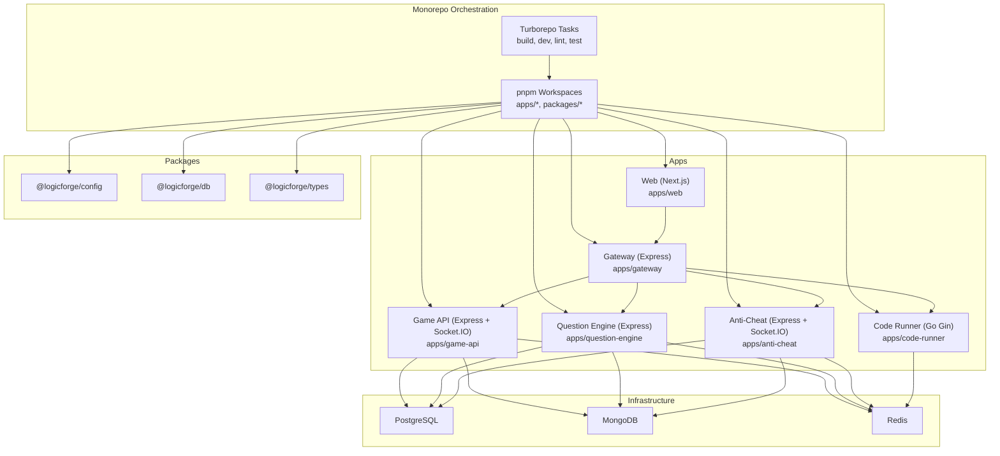
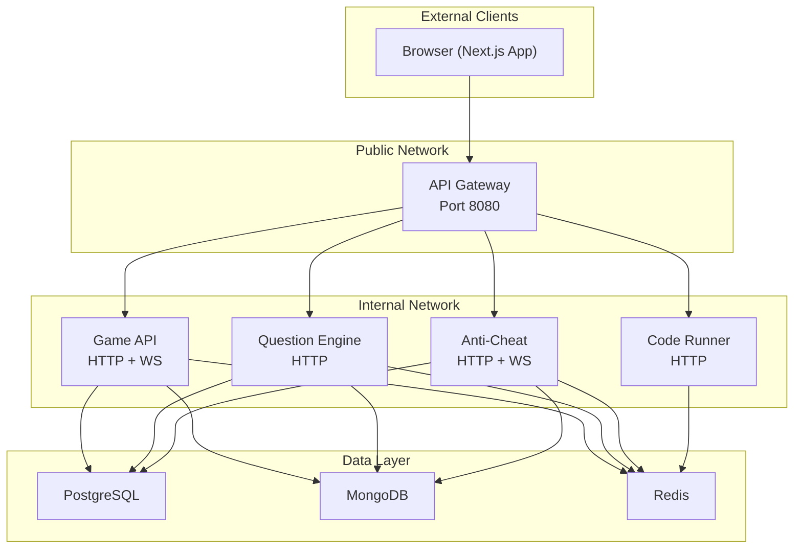
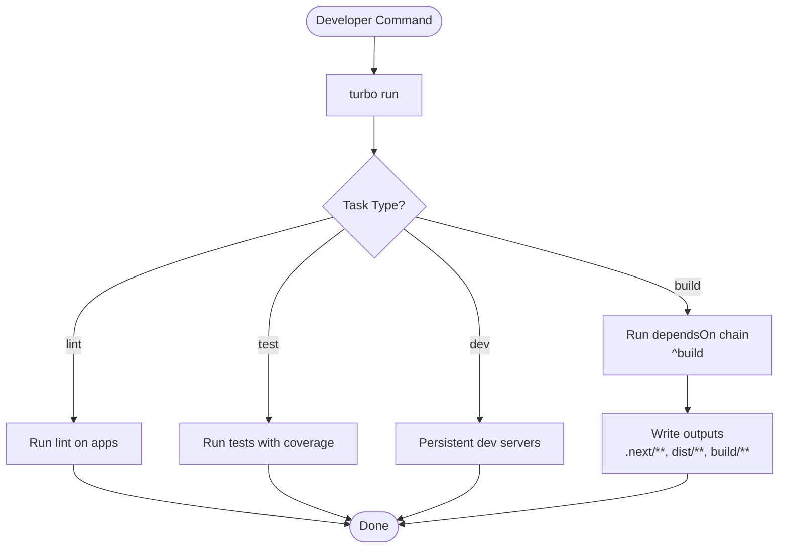
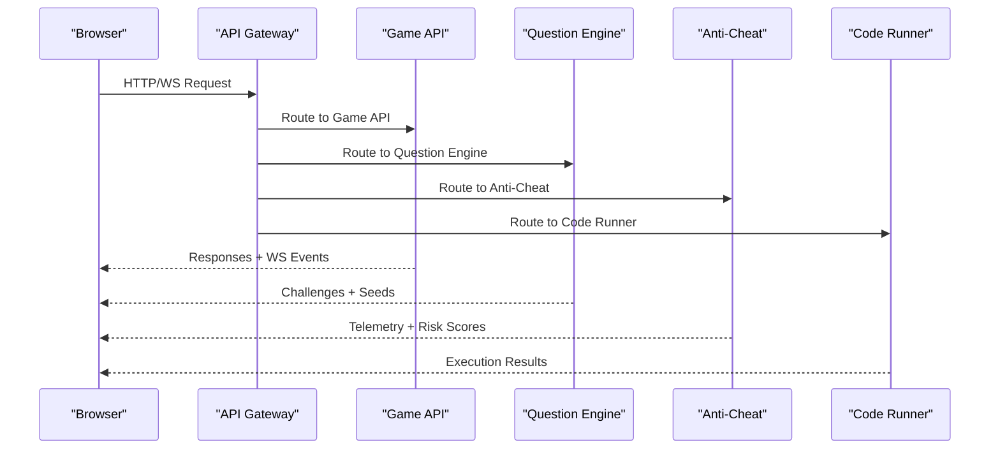
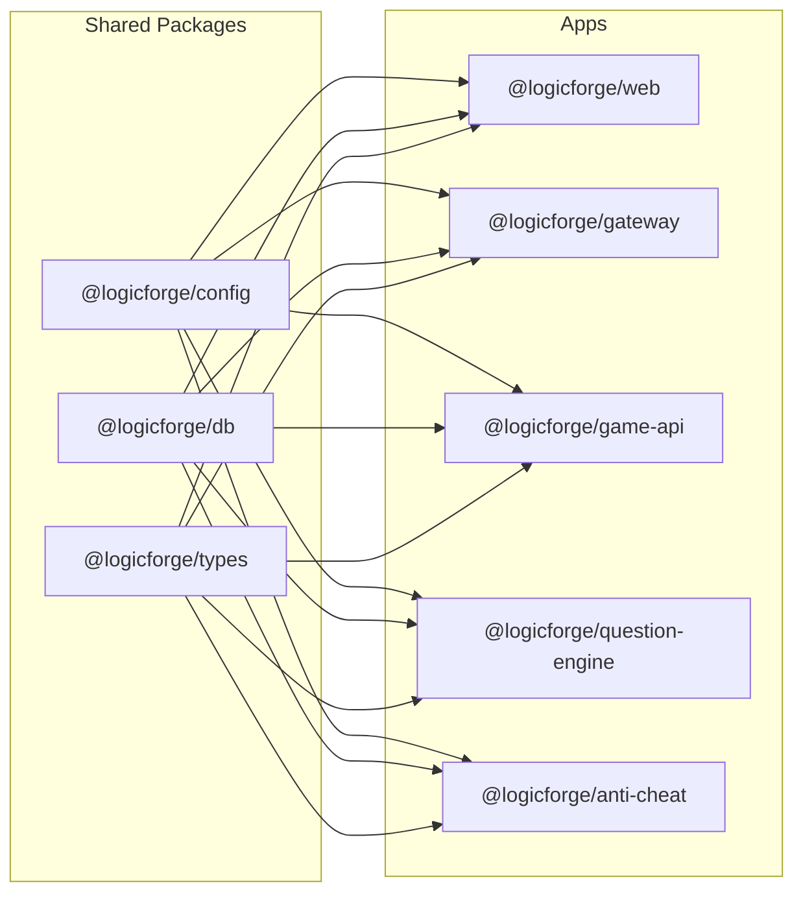

# Project Overview

<cite>
**Referenced Files in This Document**
- [README.md](file://README.md)
- [package.json](file://package.json)
- [pnpm-workspace.yaml](file://pnpm-workspace.yaml)
- [turbo.json](file://turbo.json)
- [docker-compose.yml](file://docker-compose.yml)
- [apps/web/package.json](file://apps/web/package.json)
- [apps/game-api/package.json](file://apps/game-api/package.json)
- [apps/anti-cheat/package.json](file://apps/anti-cheat/package.json)
- [apps/question-engine/package.json](file://apps/question-engine/package.json)
- [apps/gateway/package.json](file://apps/gateway/package.json)
- [apps/code-runner/go.mod](file://apps/code-runner/go.mod)
- [packages/config/package.json](file://packages/config/package.json)
- [packages/db/package.json](file://packages/db/package.json)
- [packages/types/package.json](file://packages/types/package.json)
- [Makefile](file://Makefile)
</cite>

## Table of Contents
1. [Introduction](#introduction)
2. [Project Structure](#project-structure)
3. [Core Components](#core-components)
4. [Architecture Overview](#architecture-overview)
5. [Detailed Component Analysis](#detailed-component-analysis)
6. [Dependency Analysis](#dependency-analysis)
7. [Performance Considerations](#performance-considerations)
8. [Troubleshooting Guide](#troubleshooting-guide)
9. [Conclusion](#conclusion)

## Introduction
Logic Forge is an AI-proof, gamified evaluation platform designed for modern software engineering. Its mission is to deliver a secure, real-time competitive programming experience that combines rigorous assessment with an immersive, game-driven interface. The platform emphasizes integrity through advanced anti-cheat mechanisms, scalability via a microservices architecture, and developer productivity through a cohesive monorepo powered by Turborepo and pnpm workspaces.

Key capabilities include:
- Real-time competitive programming with live matchmaking and leaderboards
- Advanced anti-cheat telemetry and heuristic scoring integrated into the gameplay loop
- Gamified assessment experience with storytelling, progression systems, and interactive environments
- Secure, scalable backend services with strong separation of concerns across domains

**Section sources**
- [README.md](file://README.md#L1-L32)

## Project Structure
The repository follows a monorepo layout orchestrated by Turborepo and pnpm workspaces:
- Apps: Application services (web frontend, API gateway, game API, question engine, anti-cheat, code runner)
- Packages: Shared libraries for configuration, database clients, type definitions, logging, and more
- Root tooling: Package management, task orchestration, and infrastructure provisioning

Technology stack highlights:
- Frontend: Next.js 14 with TypeScript, React 18, TailwindCSS 4, Framer Motion, Three.js for 3D scenes, Socket.IO client for real-time updates
- Backend: Express-based services (TypeScript), Socket.IO for real-time communication, Prisma for PostgreSQL, Mongoose for MongoDB, Redis for caching and rate limiting
- Infrastructure: Docker Compose for local development and deployment, with dedicated networks for public and internal traffic
- DevOps: Makefile targets for installation, development, builds, testing, and Docker lifecycle management

**Diagram sources**
- [pnpm-workspace.yaml](file://pnpm-workspace.yaml#L1-L3)
- [turbo.json](file://turbo.json#L1-L45)
- [docker-compose.yml](file://docker-compose.yml#L1-L238)

**Section sources**
- [README.md](file://README.md#L5-L18)
- [package.json](file://package.json#L1-L22)
- [pnpm-workspace.yaml](file://pnpm-workspace.yaml#L1-L3)
- [turbo.json](file://turbo.json#L1-L45)
- [docker-compose.yml](file://docker-compose.yml#L1-L238)

## Core Components
This section outlines the primary services and shared packages that define the platform’s runtime and development experience.

- Web (Next.js): The frontend dashboard and game client, exposing authentication, arena experiences, story mode, and administrative dashboards. It integrates real-time updates via Socket.IO and uses a rich UI toolkit for interactive components.
- API Gateway: A single public entrypoint that proxies requests to backend services and manages WebSocket routing. It enforces CORS, security headers, and rate limiting using Redis-backed middleware.
- Game API: Core game logic and real-time WebSocket endpoints for matchmaking, rounds, sessions, and scoring. It coordinates with the question engine, anti-cheat, and code runner services.
- Question Engine: Manages question retrieval, randomization, and seeding. It interacts with PostgreSQL and MongoDB for persistence and uses Redis for caching and coordination.
- Anti-Cheat: Provides telemetry ingestion, heuristic analysis, and risk scoring. It streams real-time insights to the game client and maintains audit logs.
- Code Runner: A sandboxed execution service written in Go, responsible for safe code compilation and execution against test cases.
- Shared Packages:
  - @logicforge/config: Environment configuration and validation using Zod
  - @logicforge/db: Prisma client for PostgreSQL and Mongoose for MongoDB
  - @logicforge/types: Shared TypeScript types validated with Zod

Technology stack summary:
- Frontend: Next.js 14, React 18, Socket.IO client, TailwindCSS 4, Framer Motion, Three.js, Zustand, React Query
- Backend: Express, Socket.IO, Prisma, Mongoose, Redis, Zod
- Infrastructure: Docker, Docker Compose, PostgreSQL, MongoDB, Redis
- Tooling: Turborepo, pnpm, TypeScript, ESLint, Prettier, Make

**Section sources**
- [README.md](file://README.md#L8-L18)
- [apps/web/package.json](file://apps/web/package.json#L1-L116)
- [apps/gateway/package.json](file://apps/gateway/package.json#L1-L33)
- [apps/game-api/package.json](file://apps/game-api/package.json#L1-L32)
- [apps/question-engine/package.json](file://apps/question-engine/package.json#L1-L30)
- [apps/anti-cheat/package.json](file://apps/anti-cheat/package.json#L1-L30)
- [apps/code-runner/go.mod](file://apps/code-runner/go.mod#L1-L8)
- [packages/config/package.json](file://packages/config/package.json#L1-L17)
- [packages/db/package.json](file://packages/db/package.json#L1-L32)
- [packages/types/package.json](file://packages/types/package.json#L1-L15)

## Architecture Overview
The platform employs a distributed microservices architecture behind a centralized API Gateway. Services communicate over internal networks, with Redis enabling real-time features and caching. PostgreSQL stores core relational data, while MongoDB handles authentication and user-related documents. The Web app serves as the primary client, connecting to the Gateway and Game API via HTTP and WebSocket protocols.

**Diagram sources**
- [README.md](file://README.md#L8-L18)
- [docker-compose.yml](file://docker-compose.yml#L157-L225)

**Section sources**
- [README.md](file://README.md#L8-L18)
- [docker-compose.yml](file://docker-compose.yml#L1-L238)

## Detailed Component Analysis

### Monorepo Orchestration
- Turborepo tasks define cross-service build, lint, test, and clean workflows with caching and incremental builds. Global environment files are watched for changes.
- pnpm workspaces manage dependencies across apps and packages, ensuring consistent versions and efficient linking.

**Diagram sources**
- [turbo.json](file://turbo.json#L6-L44)

**Section sources**
- [turbo.json](file://turbo.json#L1-L45)
- [pnpm-workspace.yaml](file://pnpm-workspace.yaml#L1-L3)
- [package.json](file://package.json#L4-L11)

### Service Topology and Networking
- Public network exposes the Gateway on port 8080 for external access.
- Internal network isolates backend services for security and performance.
- Services share environment variables and secrets via Docker Compose, with health checks ensuring readiness.

**Diagram sources**
- [docker-compose.yml](file://docker-compose.yml#L157-L225)

**Section sources**
- [docker-compose.yml](file://docker-compose.yml#L1-L238)

### Technology Stack Deep Dive
- Frontend (Web):
  - Next.js 14 for SSR/SSG, routing, and API routes
  - React 18 with hooks and concurrent features
  - Socket.IO client for real-time arena and telemetry
  - UI primitives from Radix UI, TailwindCSS 4, and Framer Motion
  - Zustand for lightweight state management, React Query for data fetching
- Backend (Services):
  - Express-based microservices with TypeScript
  - Socket.IO for real-time events and matchmaking
  - Prisma for PostgreSQL ORM and migrations
  - Mongoose for MongoDB collections (auth, profiles)
  - Redis for caching, rate limiting, and pub/sub
- Infrastructure:
  - Docker Compose for local and CI environments
  - Health checks and dependency ordering for reliable startup
- Tooling:
  - Turborepo for task orchestration and caching
  - pnpm for fast, disk-space-efficient installs
  - ESLint and Prettier for code quality and formatting

**Section sources**
- [apps/web/package.json](file://apps/web/package.json#L12-L83)
- [apps/game-api/package.json](file://apps/game-api/package.json#L12-L21)
- [apps/anti-cheat/package.json](file://apps/anti-cheat/package.json#L12-L20)
- [apps/question-engine/package.json](file://apps/question-engine/package.json#L12-L19)
- [apps/gateway/package.json](file://apps/gateway/package.json#L12-L21)
- [packages/db/package.json](file://packages/db/package.json#L18-L31)
- [packages/config/package.json](file://packages/config/package.json#L8-L11)
- [apps/code-runner/go.mod](file://apps/code-runner/go.mod#L1-L8)

### Key Features
- Real-time competitive programming:
  - WebSocket-based arena with live updates and synchronized rounds
  - Matchmaking and session management via the Game API
- Advanced anti-cheat mechanisms:
  - Telemetry ingestion and risk scoring integrated into the game loop
  - Audit logging and real-time dashboards for monitoring
- Gamified assessment experience:
  - Story mode with narrative panels, cinematic zones, and world maps
  - Interactive HUDs for timers, progress, and opponent telemetry
  - Achievement panels and rank-up overlays for engagement

**Section sources**
- [apps/game-api/package.json](file://apps/game-api/package.json#L12-L21)
- [apps/anti-cheat/package.json](file://apps/anti-cheat/package.json#L12-L20)
- [apps/web/package.json](file://apps/web/package.json#L12-L83)

### Architectural Principles and Design Philosophy
- Separation of concerns:
  - Clear boundaries between Web, Gateway, Game API, Question Engine, Anti-Cheat, and Code Runner
  - Shared packages encapsulate configuration, database clients, and types
- Scalability and resilience:
  - Microservices with independent scaling and health checks
  - Redis for caching and rate limiting to reduce load on databases
- Developer productivity:
  - Monorepo with Turborepo and pnpm for unified builds, tests, and dependency management
  - Consistent tooling and linting across services
- Security-first design:
  - API Gateway centralizes CORS, security headers, and rate limiting
  - Anti-Cheat service provides integrity monitoring and audit trails
- Observability and maintainability:
  - Health checks and structured logging across services
  - Prisma and Mongoose provide robust data access patterns

**Section sources**
- [README.md](file://README.md#L5-L18)
- [turbo.json](file://turbo.json#L1-L45)
- [docker-compose.yml](file://docker-compose.yml#L1-L238)

## Dependency Analysis
The monorepo’s dependency graph reflects a layered architecture:
- Apps depend on shared packages (@logicforge/config, @logicforge/db, @logicforge/types)
- Services consume @logicforge/db for database clients and @logicforge/config for environment validation
- Web integrates UI libraries and real-time clients, while backend services rely on Express and Socket.IO

**Diagram sources**
- [pnpm-workspace.yaml](file://pnpm-workspace.yaml#L1-L3)
- [packages/config/package.json](file://packages/config/package.json#L1-L17)
- [packages/db/package.json](file://packages/db/package.json#L1-L32)
- [packages/types/package.json](file://packages/types/package.json#L1-L15)

**Section sources**
- [pnpm-workspace.yaml](file://pnpm-workspace.yaml#L1-L3)
- [packages/config/package.json](file://packages/config/package.json#L1-L17)
- [packages/db/package.json](file://packages/db/package.json#L1-L32)
- [packages/types/package.json](file://packages/types/package.json#L1-L15)

## Performance Considerations
- Caching and rate limiting:
  - Redis is used for caching frequently accessed questions and user data, and for rate limiting to protect backend services
- Database optimization:
  - Prisma provides efficient queries and migrations; ensure proper indexing on hot keys
  - MongoDB collections should be normalized where appropriate to reduce duplication
- Real-time performance:
  - Socket.IO rooms and namespaces should be scoped to minimize broadcast overhead
  - Anti-Cheat telemetry should be batched to reduce network chatter
- Container orchestration:
  - Health checks and restart policies prevent downtime during startup
  - Resource limits and autoscaling can be configured in production deployments

[No sources needed since this section provides general guidance]

## Troubleshooting Guide
Common operational issues and resolutions:
- Missing environment variables:
  - Ensure .env is created from .env.example and populated with required credentials before starting services
- Docker compose errors:
  - Verify that all services are healthy and started in the correct order; check depends_on conditions and health checks
- Database connectivity:
  - Confirm connection strings for PostgreSQL and MongoDB are reachable from services
- Port conflicts:
  - Adjust host ports for Web (3000) and Gateway (8080) if they conflict with existing processes
- Development server issues:
  - Use Makefile targets to install dependencies, start services, and rebuild as needed

**Section sources**
- [Makefile](file://Makefile#L3-L55)
- [docker-compose.yml](file://docker-compose.yml#L1-L238)

## Conclusion
Logic Forge delivers a modern, secure, and engaging platform for evaluating software engineering skills through gamified, real-time competitive programming. Its Turborepo and pnpm-based monorepo ensures developer productivity, while the microservices architecture, robust data layer, and advanced anti-cheat mechanisms uphold integrity and scalability. By adhering to the documented principles and leveraging the provided tooling, teams can confidently extend and operate the platform in development and production environments.

[No sources needed since this section summarizes without analyzing specific files]