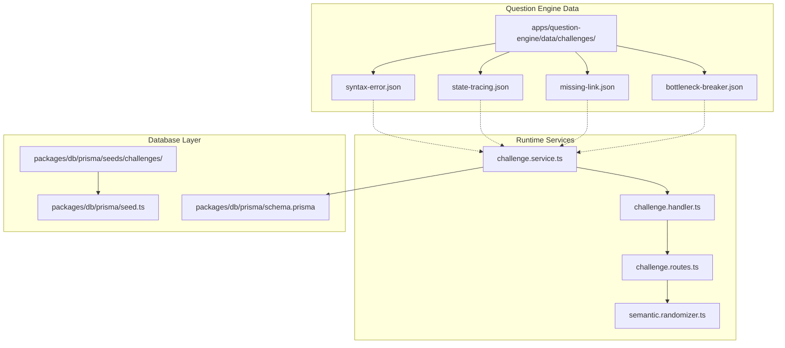
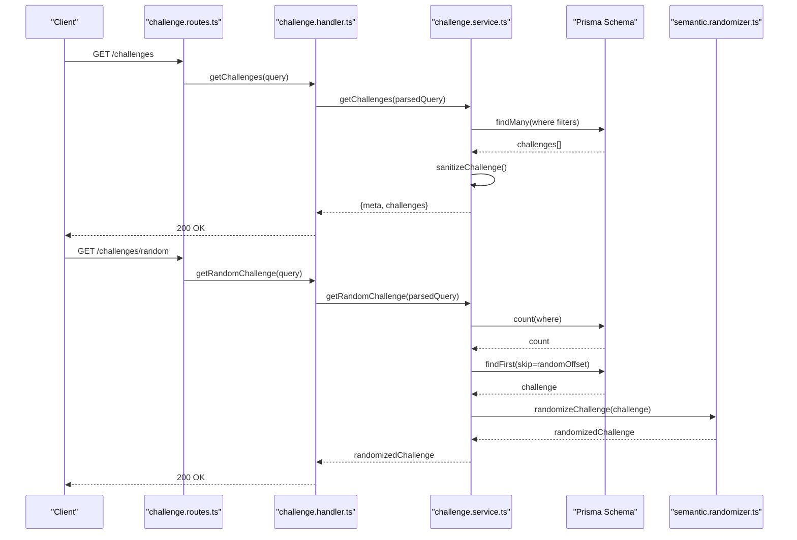
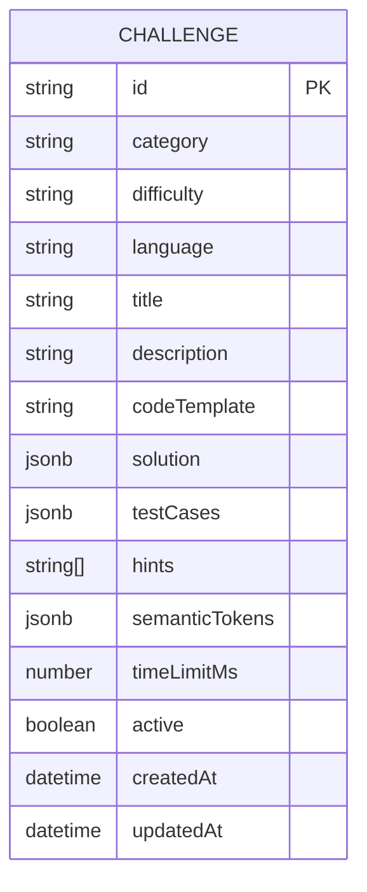
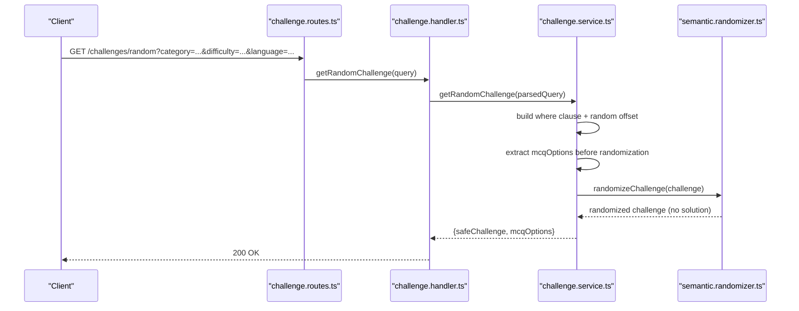
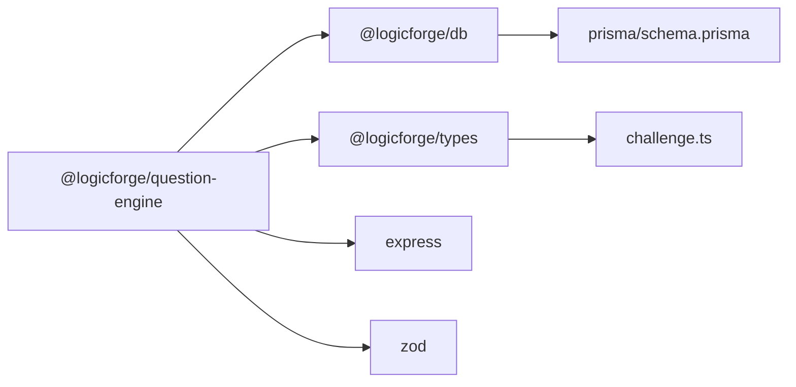

# Challenge Data Schema & Organization

<cite>
**Referenced Files in This Document**
- [bottleneck-breaker.json](file://apps/question-engine/data/challenges/bottleneck-breaker.json)
- [missing-link.json](file://apps/question-engine/data/challenges/missing-link.json)
- [state-tracing.json](file://apps/question-engine/data/challenges/state-tracing.json)
- [syntax-error.json](file://apps/question-engine/data/challenges/syntax-error.json)
- [challenge.service.ts](file://apps/question-engine/src/services/challenge.service.ts)
- [challenge.handler.ts](file://apps/question-engine/src/handlers/challenge.handler.ts)
- [challenge.routes.ts](file://apps/question-engine/src/routes/challenge.routes.ts)
- [semantic.randomizer.ts](file://apps/question-engine/src/randomizer/semantic.randomizer.ts)
- [seed.handler.ts](file://apps/question-engine/src/handlers/seed.handler.ts)
- [schema.prisma](file://packages/db/prisma/schema.prisma)
- [seed.ts](file://packages/db/prisma/seed.ts)
- [challenge.ts](file://packages/types/src/challenge.ts)
</cite>

## Table of Contents
1. [Introduction](#introduction)
2. [Project Structure](#project-structure)
3. [Core Components](#core-components)
4. [Architecture Overview](#architecture-overview)
5. [Detailed Component Analysis](#detailed-component-analysis)
6. [Dependency Analysis](#dependency-analysis)
7. [Performance Considerations](#performance-considerations)
8. [Troubleshooting Guide](#troubleshooting-guide)
9. [Conclusion](#conclusion)

## Introduction
This document describes the challenge data schema and organization used by the question engine. It explains the challenge JSON format, categories, difficulty scaling, language-specific implementations, and the relationships between different challenge types (algorithmic problems, multiple-choice questions, and fill-in-the-blank). It also documents the data organization in the challenges directory, file naming conventions, and the mapping between challenge data and database models.

## Project Structure
The challenge data is stored as JSON files under the question engine's data directory. Each file corresponds to a challenge category and contains an array of challenge variants tailored to specific programming languages.

**Diagram sources**
- [challenge.routes.ts](file://apps/question-engine/src/routes/challenge.routes.ts#L1-L28)
- [challenge.handler.ts](file://apps/question-engine/src/handlers/challenge.handler.ts#L1-L71)
- [challenge.service.ts](file://apps/question-engine/src/services/challenge.service.ts#L1-L76)
- [semantic.randomizer.ts](file://apps/question-engine/src/randomizer/semantic.randomizer.ts#L1-L94)
- [schema.prisma](file://packages/db/prisma/schema.prisma)
- [seed.ts](file://packages/db/prisma/seed.ts)

**Section sources**
- [challenge.routes.ts](file://apps/question-engine/src/routes/challenge.routes.ts#L1-L28)
- [challenge.handler.ts](file://apps/question-engine/src/handlers/challenge.handler.ts#L1-L71)
- [challenge.service.ts](file://apps/question-engine/src/services/challenge.service.ts#L1-L76)
- [semantic.randomizer.ts](file://apps/question-engine/src/randomizer/semantic.randomizer.ts#L1-L94)

## Core Components
- Challenge JSON files define category-specific variants with language-specific implementations and solutions.
- The service layer queries the database, applies randomization, and sanitizes responses.
- Routes expose endpoints to list, fetch, randomize, and seed challenges.
- The randomizer replaces semantic tokens in titles, descriptions, and code templates while preserving safety.

Key schema fields observed across challenge JSON files:
- category: Enumerated challenge category identifier.
- difficulty: Difficulty level (easy, medium, hard).
- language: Target programming language (PYTHON, JAVA, CPP).
- title: Human-readable challenge title.
- description: Problem statement.
- codeTemplate: Starting code template for the challenge.
- solution: Solution structure varies by challenge type.
- testCases: Array of input/output test cases.
- hints: Optional hints for learners.
- semanticTokens: Token map for randomization.
- timeLimitMs: Execution time limit for evaluation.
- active: Boolean flag indicating availability.

**Section sources**
- [bottleneck-breaker.json](file://apps/question-engine/data/challenges/bottleneck-breaker.json#L1-L153)
- [missing-link.json](file://apps/question-engine/data/challenges/missing-link.json#L1-L74)
- [state-tracing.json](file://apps/question-engine/data/challenges/state-tracing.json#L1-L60)
- [syntax-error.json](file://apps/question-engine/data/challenges/syntax-error.json#L1-L62)

## Architecture Overview
The challenge lifecycle spans data ingestion via seeding, runtime retrieval and randomization, and API exposure.

**Diagram sources**
- [challenge.routes.ts](file://apps/question-engine/src/routes/challenge.routes.ts#L1-L28)
- [challenge.handler.ts](file://apps/question-engine/src/handlers/challenge.handler.ts#L1-L71)
- [challenge.service.ts](file://apps/question-engine/src/services/challenge.service.ts#L1-L76)
- [semantic.randomizer.ts](file://apps/question-engine/src/randomizer/semantic.randomizer.ts#L1-L94)

## Detailed Component Analysis

### Challenge JSON Format and Variants
Challenge JSON files are arrays of challenge objects. Each object defines:
- Category and difficulty for filtering.
- Language-specific code templates and solutions.
- Test cases with input/output pairs.
- Hints and semantic tokens for randomization.
- Time limits and activation flags.

Examples of challenge types present:
- Multiple Choice Questions (MCQ): Includes correct option and explanatory text.
- Fill-in-the-blank: Accepts free-form answers.
- Algorithmic problems: Provide code templates and expected outputs.

File naming conventions:
- Lowercase underscore-separated filenames correspond to challenge categories.
- Example: bottleneck-breaker.json, missing-link.json, state-tracing.json, syntax-error.json.

**Section sources**
- [bottleneck-breaker.json](file://apps/question-engine/data/challenges/bottleneck-breaker.json#L1-L153)
- [missing-link.json](file://apps/question-engine/data/challenges/missing-link.json#L1-L74)
- [state-tracing.json](file://apps/question-engine/data/challenges/state-tracing.json#L1-L60)
- [syntax-error.json](file://apps/question-engine/data/challenges/syntax-error.json#L1-L62)

### Challenge Categories and Difficulty Scaling
Observed categories:
- THE_BOTTLENECK_BREAKER
- THE_MISSING_LINK
- STATE_TRACING
- SYNTAX_ERROR_DETECTION

Difficulty levels:
- EASY, MEDIUM, HARD

Relationships:
- Same category across languages provides comparable learning objectives.
- Difficulty increases with algorithmic complexity and reasoning depth.

**Section sources**
- [bottleneck-breaker.json](file://apps/question-engine/data/challenges/bottleneck-breaker.json#L3-L4)
- [missing-link.json](file://apps/question-engine/data/challenges/missing-link.json#L3-L4)
- [state-tracing.json](file://apps/question-engine/data/challenges/state-tracing.json#L3-L4)
- [syntax-error.json](file://apps/question-engine/data/challenges/syntax-error.json#L3-L4)

### Language-Specific Implementations
Each challenge variant targets a specific language:
- PYTHON: snake_case naming convention applied during randomization.
- JAVA: camelCase/PascalCase naming convention applied during randomization.
- CPP: similar conventions as JAVA for identifiers.

Randomization behavior:
- Titles, descriptions, and code templates are sanitized of solution details.
- Semantic tokens are replaced with randomized names respecting language conventions.

**Section sources**
- [bottleneck-breaker.json](file://apps/question-engine/data/challenges/bottleneck-breaker.json#L5)
- [missing-link.json](file://apps/question-engine/data/challenges/missing-link.json#L5)
- [state-tracing.json](file://apps/question-engine/data/challenges/state-tracing.json#L5)
- [syntax-error.json](file://apps/question-engine/data/challenges/syntax-error.json#L5)
- [semantic.randomizer.ts](file://apps/question-engine/src/randomizer/semantic.randomizer.ts#L76-L83)

### Solution Structures and Metadata Fields
Solution structures vary by challenge type:
- MCQ: includes type, correct option, options map, and explanation.
- Free-response: includes answers array.
- Algorithmic refactoring: includes data structure/time-space complexity metadata.

Metadata fields:
- category, difficulty, language, title, description, codeTemplate, solution, testCases, hints, semanticTokens, timeLimitMs, active.

Validation rules inferred from usage:
- MCQ requires options and correct answer.
- Free-response accepts answers array.
- Algorithmic refactoring may include dataStructure, timeComplexity, spaceComplexity.

**Section sources**
- [bottleneck-breaker.json](file://apps/question-engine/data/challenges/bottleneck-breaker.json#L9-L19)
- [missing-link.json](file://apps/question-engine/data/challenges/missing-link.json#L9-L14)
- [missing-link.json](file://apps/question-engine/data/challenges/missing-link.json#L47-L51)
- [state-tracing.json](file://apps/question-engine/data/challenges/state-tracing.json#L9)
- [syntax-error.json](file://apps/question-engine/data/challenges/syntax-error.json#L9)

### Data Organization and File Naming Conventions
- Directory: apps/question-engine/data/challenges/
- Files: lowercase_underscore.json, one file per category.
- Content: JSON array of challenge objects.

Seed ingestion:
- Seed handler invokes seed service which loads category JSON files and persists to the database.

**Section sources**
- [seed.handler.ts](file://apps/question-engine/src/handlers/seed.handler.ts#L1-L12)
- [seed.ts](file://packages/db/prisma/seed.ts)

### Mapping Between Challenge Data and Database Models
The Prisma schema defines the challenge model persisted in the database. The service layer queries and transforms data for clients, while randomization strips sensitive fields for safe delivery.

**Diagram sources**
- [schema.prisma](file://packages/db/prisma/schema.prisma)

**Section sources**
- [challenge.service.ts](file://apps/question-engine/src/services/challenge.service.ts#L8-L26)
- [challenge.service.ts](file://apps/question-engine/src/services/challenge.service.ts#L69-L75)
- [schema.prisma](file://packages/db/prisma/schema.prisma)

### API Workflows and Validation
Endpoints:
- GET /api/v1/challenges: List challenges with pagination and filters.
- GET /api/v1/challenges/random: Fetch a randomized challenge with safety measures.
- POST /api/v1/challenges/validate: Validate submitted code (orchestrated externally).
- GET /api/v1/challenges/:id: Retrieve full challenge by ID (internal use).
- POST /api/v1/challenges/seed: Seed database with challenge data.

Validation:
- Query parameters validated via Zod schemas.
- Randomized responses exclude solution and semanticTokens; MCQ options are preserved separately.

**Diagram sources**
- [challenge.routes.ts](file://apps/question-engine/src/routes/challenge.routes.ts#L15-L16)
- [challenge.handler.ts](file://apps/question-engine/src/handlers/challenge.handler.ts#L22-L39)
- [challenge.service.ts](file://apps/question-engine/src/services/challenge.service.ts#L34-L62)
- [semantic.randomizer.ts](file://apps/question-engine/src/randomizer/semantic.randomizer.ts#L44-L47)

**Section sources**
- [challenge.routes.ts](file://apps/question-engine/src/routes/challenge.routes.ts#L12-L25)
- [challenge.handler.ts](file://apps/question-engine/src/handlers/challenge.handler.ts#L16-L39)
- [challenge.service.ts](file://apps/question-engine/src/services/challenge.service.ts#L34-L62)

## Dependency Analysis
The question engine depends on shared packages for configuration, database access, logging, and type definitions. The challenge service integrates with Prisma to query and transform challenge data.

**Diagram sources**
- [challenge.routes.ts](file://apps/question-engine/src/routes/challenge.routes.ts#L1-L28)
- [challenge.handler.ts](file://apps/question-engine/src/handlers/challenge.handler.ts#L1-L8)
- [challenge.service.ts](file://apps/question-engine/src/services/challenge.service.ts#L1-L6)
- [schema.prisma](file://packages/db/prisma/schema.prisma)
- [challenge.ts](file://packages/types/src/challenge.ts)

**Section sources**
- [challenge.routes.ts](file://apps/question-engine/src/routes/challenge.routes.ts#L1-L28)
- [challenge.handler.ts](file://apps/question-engine/src/handlers/challenge.handler.ts#L1-L8)
- [challenge.service.ts](file://apps/question-engine/src/services/challenge.service.ts#L1-L6)

## Performance Considerations
- Randomization cost: Replacing tokens and formatting names scales linearly with token count and text length.
- Database queries: Pagination and random offset selection are efficient; ensure appropriate indexes on category/difficulty/language filters.
- Time limits: timeLimitMs should align with expected solution complexity to avoid timeouts.

## Troubleshooting Guide
Common issues and resolutions:
- No challenges returned: Verify filters and active flag; ensure seed loaded category JSON files.
- Missing MCQ options: Confirm that solution.type is MCQ and options exist; service extracts options before randomization.
- Randomization anomalies: Check semanticTokens presence and language-specific naming conventions.
- Validation endpoint: Ensure challengeId and code are provided; external orchestrator handles execution.

**Section sources**
- [challenge.handler.ts](file://apps/question-engine/src/handlers/challenge.handler.ts#L56-L70)
- [challenge.service.ts](file://apps/question-engine/src/services/challenge.service.ts#L34-L62)
- [semantic.randomizer.ts](file://apps/question-engine/src/randomizer/semantic.randomizer.ts#L76-L83)

## Conclusion
The challenge data schema organizes problem statements, language-specific implementations, and solutions into category-based JSON files. The service layer enforces safety by randomizing semantic tokens and sanitizing sensitive fields, while the API exposes filtered and randomized challenges to clients. The database model supports efficient querying and future extensibility.