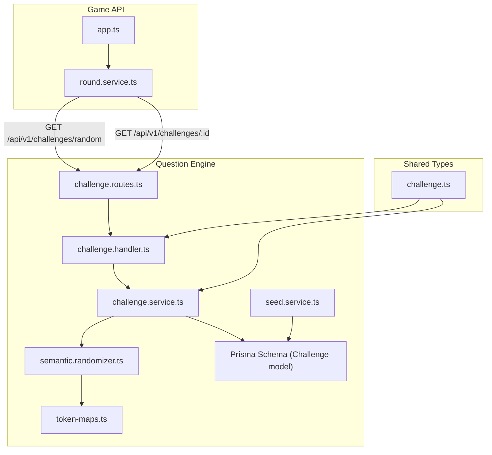
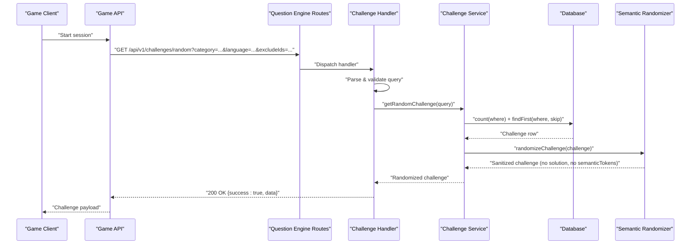
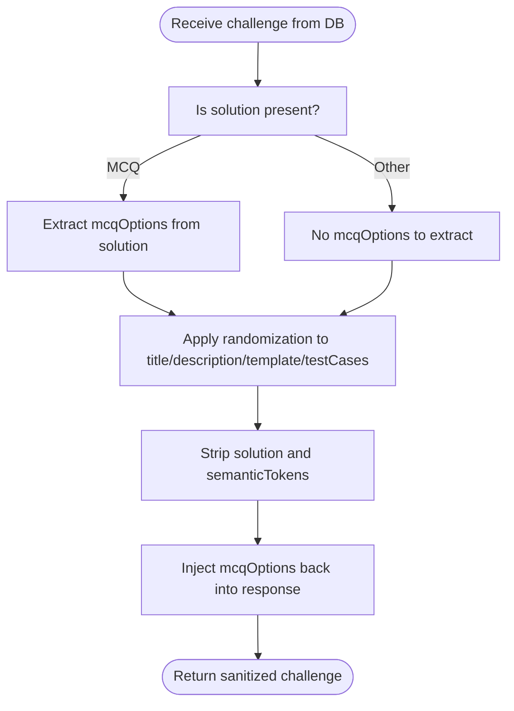
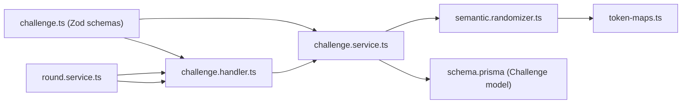

# Challenge Management & Retrieval

<cite>
**Referenced Files in This Document**
- [challenge.service.ts](file://apps/question-engine/src/services/challenge.service.ts)
- [challenge.handler.ts](file://apps/question-engine/src/handlers/challenge.handler.ts)
- [challenge.routes.ts](file://apps/question-engine/src/routes/challenge.routes.ts)
- [challenge.ts](file://packages/types/src/challenge.ts)
- [semantic.randomizer.ts](file://apps/question-engine/src/randomizer/semantic.randomizer.ts)
- [token-maps.ts](file://apps/question-engine/src/randomizer/token-maps.ts)
- [seed.service.ts](file://apps/question-engine/src/services/seed.service.ts)
- [schema.prisma](file://packages/db/prisma/schema.prisma)
- [round.service.ts](file://apps/game-api/src/services/round.service.ts)
- [app.ts](file://apps/game-api/src/app.ts)
</cite>

## Table of Contents
1. [Introduction](#introduction)
2. [Project Structure](#project-structure)
3. [Core Components](#core-components)
4. [Architecture Overview](#architecture-overview)
5. [Detailed Component Analysis](#detailed-component-analysis)
6. [Dependency Analysis](#dependency-analysis)
7. [Performance Considerations](#performance-considerations)
8. [Troubleshooting Guide](#troubleshooting-guide)
9. [Conclusion](#conclusion)
10. [Appendices](#appendices)

## Introduction
This document explains the challenge management and retrieval system used by the LogicForge platform. It covers how challenges are queried, filtered, paginated, and sanitized for safe delivery to clients. It also documents the interfaces for retrieving challenges, selecting random challenges with exclusions, and the differences between sanitized and full challenge responses. Finally, it describes integration patterns with the game API service for fetching challenges during gameplay.

## Project Structure
The challenge management system spans three main areas:
- Question Engine service: exposes endpoints to list, fetch, and validate challenges; applies randomization and sanitization.
- Types package: defines shared schemas for queries, responses, and enums.
- Game API service: orchestrates gameplay and integrates with the Question Engine to fetch challenges.

**Diagram sources**
- [challenge.routes.ts](file://apps/question-engine/src/routes/challenge.routes.ts#L1-L28)
- [challenge.handler.ts](file://apps/question-engine/src/handlers/challenge.handler.ts#L1-L71)
- [challenge.service.ts](file://apps/question-engine/src/services/challenge.service.ts#L1-L76)
- [semantic.randomizer.ts](file://apps/question-engine/src/randomizer/semantic.randomizer.ts#L1-L94)
- [token-maps.ts](file://apps/question-engine/src/randomizer/token-maps.ts#L1-L53)
- [seed.service.ts](file://apps/question-engine/src/services/seed.service.ts#L1-L76)
- [schema.prisma](file://packages/db/prisma/schema.prisma#L138-L161)
- [round.service.ts](file://apps/game-api/src/services/round.service.ts#L200-L285)
- [challenge.ts](file://packages/types/src/challenge.ts#L1-L60)

**Section sources**
- [challenge.routes.ts](file://apps/question-engine/src/routes/challenge.routes.ts#L1-L28)
- [challenge.handler.ts](file://apps/question-engine/src/handlers/challenge.handler.ts#L1-L71)
- [challenge.service.ts](file://apps/question-engine/src/services/challenge.service.ts#L1-L76)
- [challenge.ts](file://packages/types/src/challenge.ts#L1-L60)
- [schema.prisma](file://packages/db/prisma/schema.prisma#L138-L161)
- [round.service.ts](file://apps/game-api/src/services/round.service.ts#L200-L285)

## Core Components
- ChallengeQuery and RandomChallengeQuery: define the shape and validation for challenge retrieval requests.
- getChallenges: lists challenges with category/difficulty/language filters, pagination via page and limit, and returns sanitized responses.
- getChallengeById: retrieves a single challenge by ID with the full, unsanitized payload (used internally).
- getRandomChallenge: selects a random challenge respecting filters and exclusion lists, then returns a sanitized response.
- Sanitization: strips sensitive fields (solution, semanticTokens) and preserves MCQ options for client display.
- Randomization: rewrites placeholders in titles, descriptions, templates, and test cases using semantic token maps.

**Section sources**
- [challenge.service.ts](file://apps/question-engine/src/services/challenge.service.ts#L8-L76)
- [challenge.handler.ts](file://apps/question-engine/src/handlers/challenge.handler.ts#L16-L71)
- [challenge.ts](file://packages/types/src/challenge.ts#L18-L49)
- [semantic.randomizer.ts](file://apps/question-engine/src/randomizer/semantic.randomizer.ts#L6-L48)

## Architecture Overview
The system follows a clean separation of concerns:
- Routes define HTTP endpoints.
- Handlers parse and validate inputs using shared Zod schemas, then delegate to services.
- Services implement business logic: database queries, pagination, random selection, sanitization, and randomization.
- Randomizer transforms challenge content by replacing semantic tokens with synonyms.
- Game API integrates with Question Engine to fetch challenges during gameplay.

**Diagram sources**
- [challenge.routes.ts](file://apps/question-engine/src/routes/challenge.routes.ts#L12-L22)
- [challenge.handler.ts](file://apps/question-engine/src/handlers/challenge.handler.ts#L22-L39)
- [challenge.service.ts](file://apps/question-engine/src/services/challenge.service.ts#L34-L62)
- [semantic.randomizer.ts](file://apps/question-engine/src/randomizer/semantic.randomizer.ts#L6-L48)
- [round.service.ts](file://apps/game-api/src/services/round.service.ts#L219-L246)

## Detailed Component Analysis

### ChallengeQuery and RandomChallengeQuery Interfaces
- ChallengeQuery supports category, difficulty, language filters, plus page and limit for pagination.
- RandomChallengeQuery adds optional excludeIds to avoid repeated challenges.
- Both are validated using Zod schemas exported from the types package.

Key validations and defaults:
- page defaults to 1 and must be positive.
- limit defaults to 10 and is capped at 50.
- excludeIds defaults to an empty array of UUID strings.

**Section sources**
- [challenge.ts](file://packages/types/src/challenge.ts#L18-L35)

### Challenge Filtering by Category, Difficulty, and Language
- Filters are applied to the where clause when querying challenges.
- Supported categories, difficulties, and languages are defined as enums and enforced by Zod.

**Section sources**
- [challenge.ts](file://packages/types/src/challenge.ts#L4-L12)
- [challenge.service.ts](file://apps/question-engine/src/services/challenge.service.ts#L9-L13)

### Pagination Implementation (page and limit)
- Total count and paginated results are fetched concurrently.
- skip = (page - 1) * limit and take = limit.
- Results are ordered by creation date descending.

**Section sources**
- [challenge.service.ts](file://apps/question-engine/src/services/challenge.service.ts#L15-L25)

### Sanitized vs Full Challenge Responses
- Full response (used by getChallengeById): includes solution, semanticTokens, and other internal fields.
- Sanitized response (used by getChallenges and getRandomChallenge): excludes solution and semanticTokens; preserves MCQ options for client rendering.

**Diagram sources**
- [challenge.service.ts](file://apps/question-engine/src/services/challenge.service.ts#L69-L75)
- [semantic.randomizer.ts](file://apps/question-engine/src/randomizer/semantic.randomizer.ts#L44-L47)
- [challenge.service.ts](file://apps/question-engine/src/services/challenge.service.ts#L52-L61)

**Section sources**
- [challenge.service.ts](file://apps/question-engine/src/services/challenge.service.ts#L28-L32)
- [challenge.service.ts](file://apps/question-engine/src/services/challenge.service.ts#L69-L75)
- [semantic.randomizer.ts](file://apps/question-engine/src/randomizer/semantic.randomizer.ts#L44-L47)

### getChallenges: Listing Challenges
- Parses query using ChallengeQuerySchema.
- Applies filters and pagination.
- Returns metadata (total, page, limit) and a list of sanitized challenges.

Example request:
- GET /api/v1/challenges?category=THE_MISSING_LINK&difficulty=EASY&language=PYTHON&page=1&limit=10

Response schema:
- success: boolean
- data: { meta: { total: number, page: number, limit: number }, challenges: ChallengeResponse[] }

**Section sources**
- [challenge.handler.ts](file://apps/question-engine/src/handlers/challenge.handler.ts#L16-L20)
- [challenge.service.ts](file://apps/question-engine/src/services/challenge.service.ts#L8-L26)
- [challenge.ts](file://packages/types/src/challenge.ts#L37-L49)

### getChallengeById: Direct Retrieval
- Retrieves a single challenge by ID.
- Returns the full challenge (including solution and semanticTokens) for internal use.

Example request:
- GET /api/v1/challenges/:id

Response schema:
- success: boolean
- data: Full challenge object (Challenge model fields)

**Section sources**
- [challenge.handler.ts](file://apps/question-engine/src/handlers/challenge.handler.ts#L41-L54)
- [challenge.service.ts](file://apps/question-engine/src/services/challenge.service.ts#L28-L32)
- [schema.prisma](file://packages/db/prisma/schema.prisma#L138-L161)

### getRandomChallenge: Random Selection with Exclusions
- Applies category/difficulty/language filters and optional excludeIds.
- Counts eligible challenges and selects one at random using a random offset.
- Randomizes the challenge and injects MCQ options back into the response.

Integration with Game API:
- Game API constructs the URL with category, language, and excludeIds.
- If no challenges are found with category+language, it retries without language, then without excludeIds as a last resort.

Example request:
- GET /api/v1/challenges/random?category=THE_BOTTLENECK_BREAKER&language=PYTHON&excludeIds=a1b2c3d4-e5f6-7890-a1b2-c3d4e5f67890, ...

Response schema:
- success: boolean
- data: ChallengeResponse with optional mcqOptions

**Section sources**
- [challenge.handler.ts](file://apps/question-engine/src/handlers/challenge.handler.ts#L22-L39)
- [challenge.service.ts](file://apps/question-engine/src/services/challenge.service.ts#L34-L62)
- [round.service.ts](file://apps/game-api/src/services/round.service.ts#L219-L254)

### Randomization and Semantic Tokens
- Uses TOKEN_POOLS to replace semantic placeholders with context-appropriate synonyms.
- Preserves uniqueness of generated identifiers and formats them according to language conventions.
- Strips solution and semanticTokens from the final sanitized response.

**Section sources**
- [semantic.randomizer.ts](file://apps/question-engine/src/randomizer/semantic.randomizer.ts#L6-L48)
- [token-maps.ts](file://apps/question-engine/src/randomizer/token-maps.ts#L11-L52)

### Data Seeding
- Seeds the database with initial challenge sets from JSON files.
- Upserts challenges based on unique combination of title, category, and language.

**Section sources**
- [seed.service.ts](file://apps/question-engine/src/services/seed.service.ts#L10-L75)

## Dependency Analysis

**Diagram sources**
- [challenge.ts](file://packages/types/src/challenge.ts#L18-L49)
- [challenge.handler.ts](file://apps/question-engine/src/handlers/challenge.handler.ts#L1-L71)
- [challenge.service.ts](file://apps/question-engine/src/services/challenge.service.ts#L1-L76)
- [semantic.randomizer.ts](file://apps/question-engine/src/randomizer/semantic.randomizer.ts#L1-L94)
- [token-maps.ts](file://apps/question-engine/src/randomizer/token-maps.ts#L1-L53)
- [schema.prisma](file://packages/db/prisma/schema.prisma#L138-L161)
- [round.service.ts](file://apps/game-api/src/services/round.service.ts#L200-L285)

**Section sources**
- [challenge.handler.ts](file://apps/question-engine/src/handlers/challenge.handler.ts#L1-L71)
- [challenge.service.ts](file://apps/question-engine/src/services/challenge.service.ts#L1-L76)
- [challenge.ts](file://packages/types/src/challenge.ts#L1-L60)
- [schema.prisma](file://packages/db/prisma/schema.prisma#L138-L161)
- [round.service.ts](file://apps/game-api/src/services/round.service.ts#L200-L285)

## Performance Considerations
- Concurrency: getChallenges performs count and findMany concurrently to reduce latency.
- Pagination: Proper skip/take calculation ensures efficient fetching of pages.
- Random selection: Uses count + findFirst with skip to avoid loading all rows; consider adding an index on active if queries become frequent.
- Randomization cost: Replacing tokens and normalizing identifiers adds CPU overhead; cache token pools and reuse regex instances if needed.
- Network retries: Game API retries without language and without excludeIds to improve availability; tune retry logic based on load.

## Troubleshooting Guide
Common issues and resolutions:
- Validation errors on queries:
  - Ensure page and limit are positive integers and limit does not exceed 50.
  - Verify category, difficulty, and language values match the allowed enums.
- No challenges returned:
  - getRandomChallenge returns null when no challenges match filters; confirm filters and excludeIds.
  - Game API falls back to retry without language or excludeIds; check logs for warnings.
- Missing MCQ options:
  - MCQ options are preserved only when the solution type is MCQ; otherwise they are omitted.
- Internal server errors:
  - Check error handling middleware in Game API for unhandled exceptions.

**Section sources**
- [challenge.handler.ts](file://apps/question-engine/src/handlers/challenge.handler.ts#L16-L20)
- [challenge.handler.ts](file://apps/question-engine/src/handlers/challenge.handler.ts#L30-L36)
- [challenge.service.ts](file://apps/question-engine/src/services/challenge.service.ts#L34-L62)
- [round.service.ts](file://apps/game-api/src/services/round.service.ts#L235-L254)
- [app.ts](file://apps/game-api/src/app.ts#L33-L62)

## Conclusion
The challenge management system provides robust, secure, and scalable mechanisms for retrieving, filtering, paginating, and randomizing challenges. It enforces strict input validation, sanitizes responses to prevent information leakage, and integrates cleanly with the game API to support dynamic gameplay. The design balances performance with safety, ensuring a smooth experience for players and maintainability for operators.

## Appendices

### API Endpoints and Schemas
- GET /api/v1/challenges
  - Query: category, difficulty, language, page, limit
  - Response: { success: boolean, data: { meta: { total, page, limit }, challenges: ChallengeResponse[] } }

- GET /api/v1/challenges/random
  - Query: category, difficulty, language, excludeIds[]
  - Response: { success: boolean, data: ChallengeResponse with optional mcqOptions }

- GET /api/v1/challenges/:id
  - Path: id
  - Response: { success: boolean, data: Full challenge object }

- POST /api/v1/challenges/validate
  - Body: { challengeId, code }
  - Response: { success: boolean, data: { status: string } }

**Section sources**
- [challenge.routes.ts](file://apps/question-engine/src/routes/challenge.routes.ts#L12-L25)
- [challenge.handler.ts](file://apps/question-engine/src/handlers/challenge.handler.ts#L16-L71)
- [challenge.ts](file://packages/types/src/challenge.ts#L37-L49)