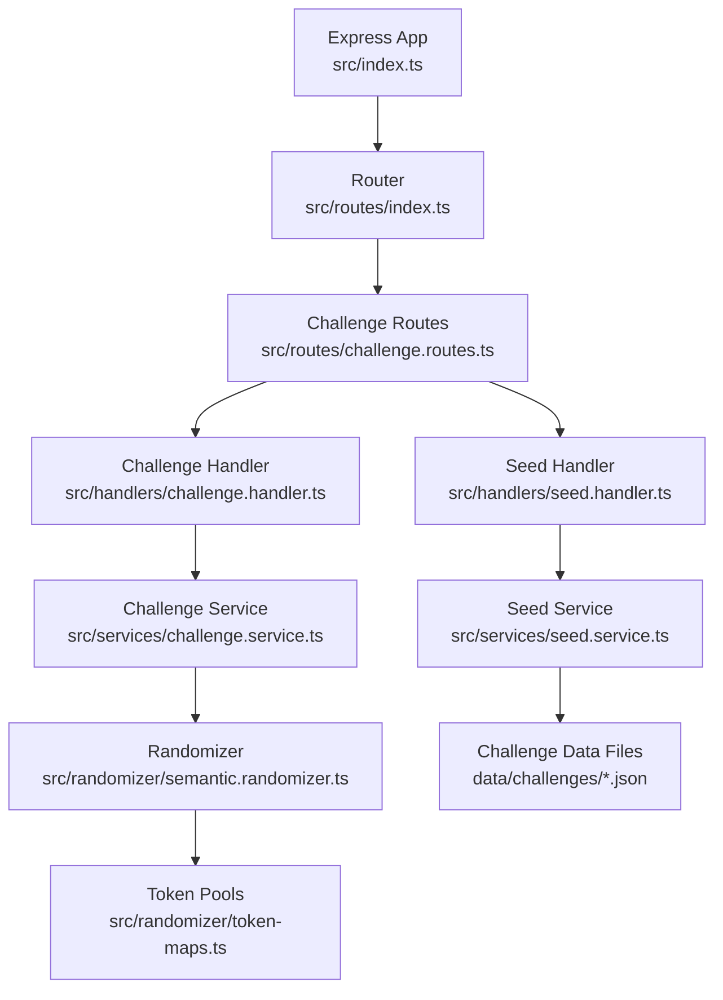
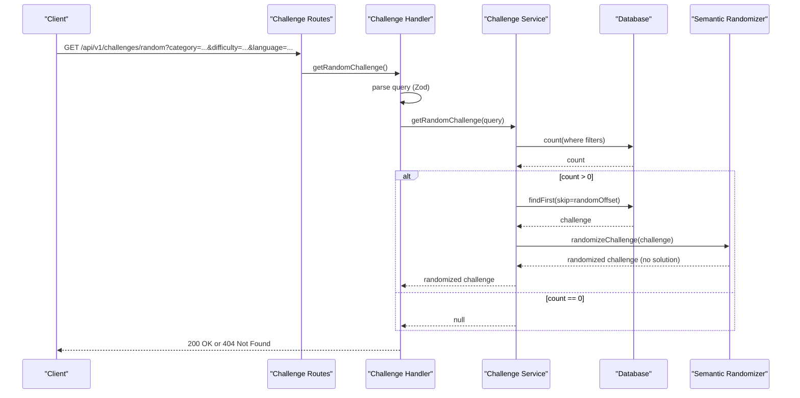
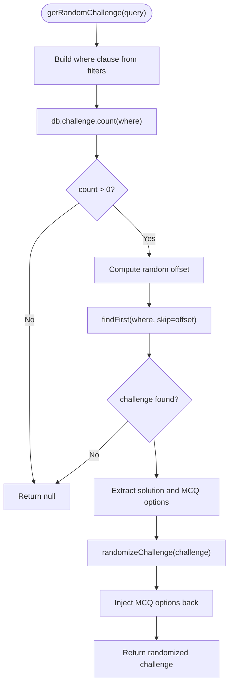
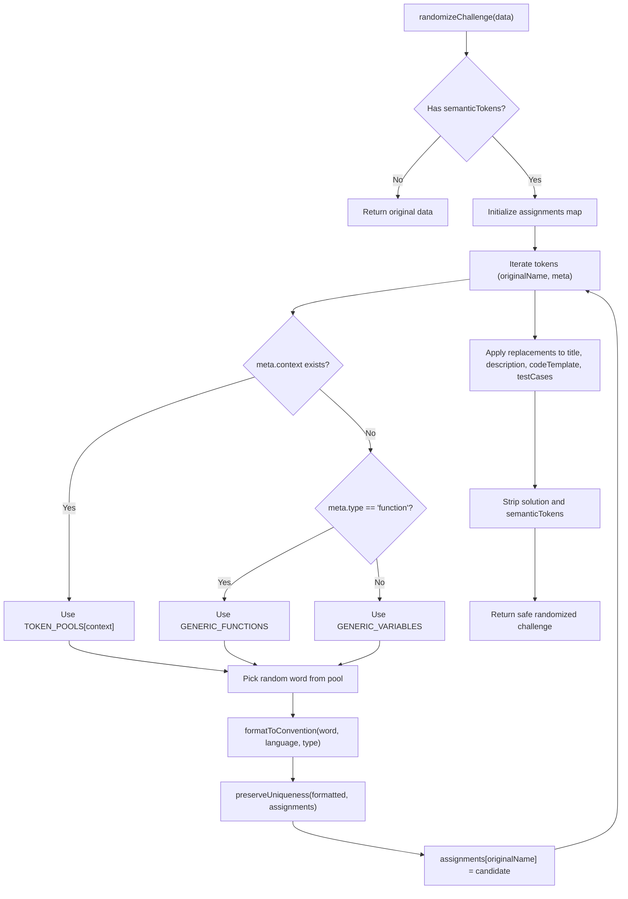
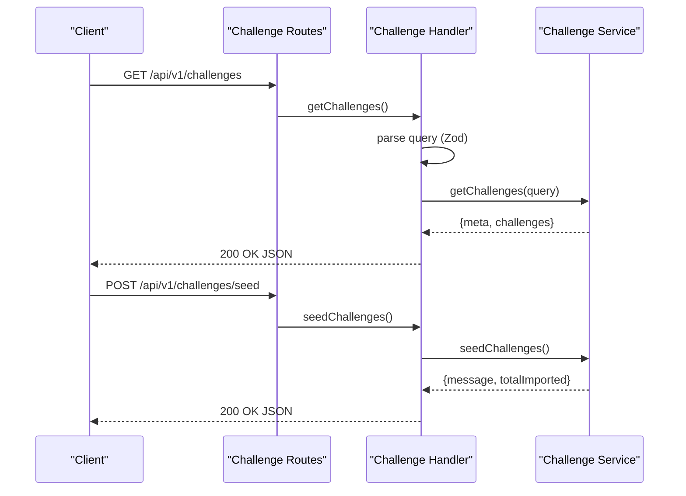
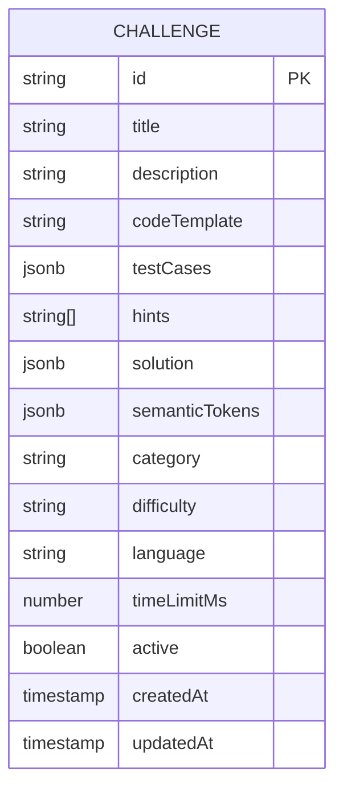
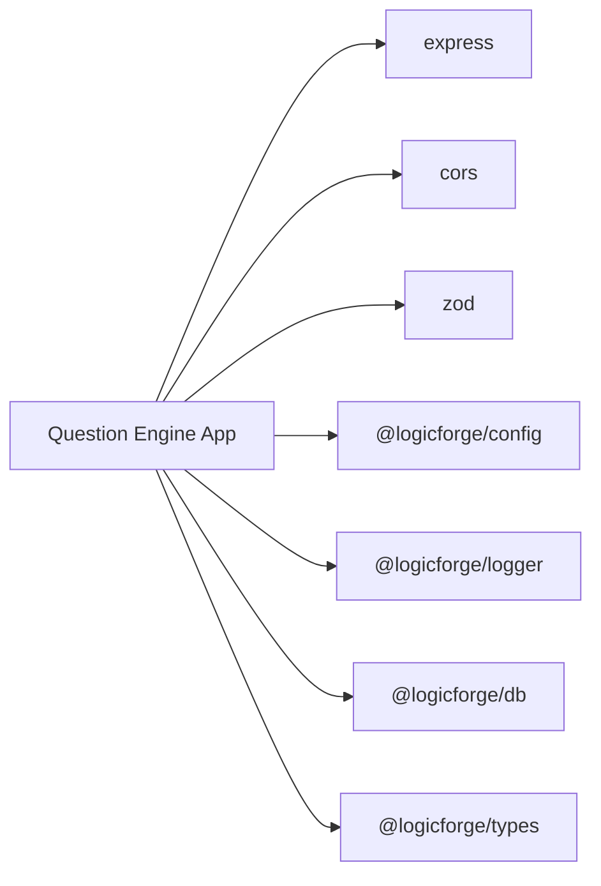

# Question Engine Service

<cite>
**Referenced Files in This Document**
- [src/index.ts](file://apps/question-engine/src/index.ts)
- [package.json](file://apps/question-engine/package.json)
- [src/routes/index.ts](file://apps/question-engine/src/routes/index.ts)
- [src/routes/challenge.routes.ts](file://apps/question-engine/src/routes/challenge.routes.ts)
- [src/handlers/challenge.handler.ts](file://apps/question-engine/src/handlers/challenge.handler.ts)
- [src/handlers/seed.handler.ts](file://apps/question-engine/src/handlers/seed.handler.ts)
- [src/services/challenge.service.ts](file://apps/question-engine/src/services/challenge.service.ts)
- [src/services/seed.service.ts](file://apps/question-engine/src/services/seed.service.ts)
- [src/randomizer/semantic.randomizer.ts](file://apps/question-engine/src/randomizer/semantic.randomizer.ts)
- [src/randomizer/token-maps.ts](file://apps/question-engine/src/randomizer/token-maps.ts)
- [data/challenges/bottleneck-breaker.json](file://apps/question-engine/data/challenges/bottleneck-breaker.json)
- [data/challenges/missing-link.json](file://apps/question-engine/data/challenges/missing-link.json)
- [data/challenges/state-tracing.json](file://apps/question-engine/data/challenges/state-tracing.json)
- [data/challenges/syntax-error.json](file://apps/question-engine/data/challenges/syntax-error.json)
</cite>

## Table of Contents
1. [Introduction](#introduction)
2. [Project Structure](#project-structure)
3. [Core Components](#core-components)
4. [Architecture Overview](#architecture-overview)
5. [Detailed Component Analysis](#detailed-component-analysis)
6. [Dependency Analysis](#dependency-analysis)
7. [Performance Considerations](#performance-considerations)
8. [Troubleshooting Guide](#troubleshooting-guide)
9. [Conclusion](#conclusion)
10. [Appendices](#appendices)

## Introduction
The Question Engine service manages challenges for the game platform. It exposes APIs for listing, retrieving, and distributing randomized challenges, and supports seeding challenges from local JSON files into the database. It also provides a validation endpoint for answer evaluation coordination with the game API and code runner services. The service ensures solution correctness while randomizing variable names, function names, and problem statements via semantic token maps tailored per programming language and context.

## Project Structure
The service is organized around a standard Express application with modular routing, handlers, services, and randomization utilities. Challenge data is seeded from JSON files located under the data directory.

**Diagram sources**
- [src/index.ts](file://apps/question-engine/src/index.ts#L1-L46)
- [src/routes/index.ts](file://apps/question-engine/src/routes/index.ts#L1-L11)
- [src/routes/challenge.routes.ts](file://apps/question-engine/src/routes/challenge.routes.ts#L1-L28)
- [src/handlers/challenge.handler.ts](file://apps/question-engine/src/handlers/challenge.handler.ts#L1-L71)
- [src/handlers/seed.handler.ts](file://apps/question-engine/src/handlers/seed.handler.ts#L1-L12)
- [src/services/challenge.service.ts](file://apps/question-engine/src/services/challenge.service.ts#L1-L76)
- [src/services/seed.service.ts](file://apps/question-engine/src/services/seed.service.ts#L1-L76)
- [src/randomizer/semantic.randomizer.ts](file://apps/question-engine/src/randomizer/semantic.randomizer.ts#L1-L94)
- [src/randomizer/token-maps.ts](file://apps/question-engine/src/randomizer/token-maps.ts#L1-L53)

**Section sources**
- [src/index.ts](file://apps/question-engine/src/index.ts#L1-L46)
- [package.json](file://apps/question-engine/package.json#L1-L30)

## Core Components
- Express server bootstrap and middleware registration
- Routing for health, challenges, and seeding
- Handlers for challenge queries, random selection, validation, and seeding
- Services for database-backed challenge retrieval, randomization, and seeding
- Randomization engine using semantic token maps and language-aware formatting
- Local challenge data seeding from JSON files

Key responsibilities:
- Challenge retrieval with filtering by category, difficulty, and language
- Randomized distribution preserving solution equivalence
- Seed ingestion ensuring idempotent creation/upsert by title/category/language
- Validation endpoint for external orchestration

**Section sources**
- [src/index.ts](file://apps/question-engine/src/index.ts#L1-L46)
- [src/routes/index.ts](file://apps/question-engine/src/routes/index.ts#L1-L11)
- [src/routes/challenge.routes.ts](file://apps/question-engine/src/routes/challenge.routes.ts#L1-L28)
- [src/handlers/challenge.handler.ts](file://apps/question-engine/src/handlers/challenge.handler.ts#L1-L71)
- [src/handlers/seed.handler.ts](file://apps/question-engine/src/handlers/seed.handler.ts#L1-L12)
- [src/services/challenge.service.ts](file://apps/question-engine/src/services/challenge.service.ts#L1-L76)
- [src/services/seed.service.ts](file://apps/question-engine/src/services/seed.service.ts#L1-L76)
- [src/randomizer/semantic.randomizer.ts](file://apps/question-engine/src/randomizer/semantic.randomizer.ts#L1-L94)
- [src/randomizer/token-maps.ts](file://apps/question-engine/src/randomizer/token-maps.ts#L1-L53)

## Architecture Overview
The service follows a layered architecture:
- HTTP layer: Express app with CORS and JSON body parsing
- Routing layer: Modular routers for health and challenges
- Handler layer: Zod-based request parsing and async error forwarding
- Service layer: Database operations and randomization logic
- Randomization layer: Semantic token substitution with language-aware formatting

**Diagram sources**
- [src/routes/challenge.routes.ts](file://apps/question-engine/src/routes/challenge.routes.ts#L1-L28)
- [src/handlers/challenge.handler.ts](file://apps/question-engine/src/handlers/challenge.handler.ts#L1-L71)
- [src/services/challenge.service.ts](file://apps/question-engine/src/services/challenge.service.ts#L1-L76)
- [src/randomizer/semantic.randomizer.ts](file://apps/question-engine/src/randomizer/semantic.randomizer.ts#L1-L94)

## Detailed Component Analysis

### Challenge Service
Responsibilities:
- List challenges with pagination and filters
- Retrieve a single challenge by ID (used internally by game API)
- Select a random challenge respecting filters and exclusions
- Sanitize responses to exclude sensitive fields and inject MCQ options safely

Randomization integration:
- Delegates randomization to the semantic randomizer
- Preserves MCQ options separately to maintain answer validation capability
- Ensures solution and semantic tokens are stripped from client-facing data

**Diagram sources**
- [src/services/challenge.service.ts](file://apps/question-engine/src/services/challenge.service.ts#L34-L62)
- [src/randomizer/semantic.randomizer.ts](file://apps/question-engine/src/randomizer/semantic.randomizer.ts#L6-L48)

**Section sources**
- [src/services/challenge.service.ts](file://apps/question-engine/src/services/challenge.service.ts#L1-L76)

### Seed Service
Responsibilities:
- Load challenge JSON files from the data directory
- Upsert challenges into the database keyed by title, category, and language
- Track imported counts and log warnings/errors

Consistency guarantees:
- Idempotent creation based on composite key (title, category, language)
- Robust error handling for missing files and parsing errors

**Section sources**
- [src/services/seed.service.ts](file://apps/question-engine/src/services/seed.service.ts#L1-L76)

### Randomization Engine
Mechanisms:
- Token-based replacement using semantic token maps
- Context-aware token pools (e.g., COLLECTION, ITEM, PROCESS, ECOMMERCE_VARS, IOT_VARS)
- Fallback generic pools for variables and functions
- Language-aware formatting (camelCase/PascalCase for non-Python, snake_case for Python)
- Uniqueness preservation to avoid collisions

**Diagram sources**
- [src/randomizer/semantic.randomizer.ts](file://apps/question-engine/src/randomizer/semantic.randomizer.ts#L6-L48)
- [src/randomizer/token-maps.ts](file://apps/question-engine/src/randomizer/token-maps.ts#L1-L53)

**Section sources**
- [src/randomizer/semantic.randomizer.ts](file://apps/question-engine/src/randomizer/semantic.randomizer.ts#L1-L94)
- [src/randomizer/token-maps.ts](file://apps/question-engine/src/randomizer/token-maps.ts#L1-L53)

### Handlers and Routes
- Challenge handler validates requests using Zod schemas and delegates to services
- Seed handler triggers database seeding from local files
- Routes expose endpoints for listing, random selection, validation, retrieval by ID, and seeding

**Diagram sources**
- [src/routes/challenge.routes.ts](file://apps/question-engine/src/routes/challenge.routes.ts#L1-L28)
- [src/handlers/challenge.handler.ts](file://apps/question-engine/src/handlers/challenge.handler.ts#L1-L71)
- [src/handlers/seed.handler.ts](file://apps/question-engine/src/handlers/seed.handler.ts#L1-L12)
- [src/services/challenge.service.ts](file://apps/question-engine/src/services/challenge.service.ts#L1-L76)
- [src/services/seed.service.ts](file://apps/question-engine/src/services/seed.service.ts#L1-L76)

**Section sources**
- [src/routes/challenge.routes.ts](file://apps/question-engine/src/routes/challenge.routes.ts#L1-L28)
- [src/handlers/challenge.handler.ts](file://apps/question-engine/src/handlers/challenge.handler.ts#L1-L71)
- [src/handlers/seed.handler.ts](file://apps/question-engine/src/handlers/seed.handler.ts#L1-L12)

### Challenge Data Schema and Organization
Challenge records stored in the database include:
- Category, difficulty, and language metadata
- Title, description, code template, test cases, hints
- Solution object and semantic tokens for randomization
- Time limit in milliseconds

Category and difficulty are typed enumerations; language is constrained to supported values. Semantic tokens define the mapping of original identifiers to randomized forms.

[No sources needed since this diagram shows conceptual schema, not actual code structure]

### Randomization Strategies
- Variables: Context-specific pools (COLLECTION, ITEM, PROCESS) or fallbacks (GENERIC_VARIABLES)
- Functions: Context-specific PROCESS pool or fallback GENERIC_FUNCTIONS
- Problem statements: Replacement applied to titles and descriptions using word boundaries
- Code templates: Replacement applied to code with word boundaries
- Test cases: Replacement applied to inputs and expected outputs
- Formatting: camelCase/PascalCase for non-Python; snake_case for Python
- Uniqueness: Collision avoidance by suffixing counters

**Section sources**
- [src/randomizer/semantic.randomizer.ts](file://apps/question-engine/src/randomizer/semantic.randomizer.ts#L76-L93)
- [src/randomizer/token-maps.ts](file://apps/question-engine/src/randomizer/token-maps.ts#L11-L52)

### Examples of Challenge Definition Files
Example files present in the data directory:
- [bottleneck-breaker.json](file://apps/question-engine/data/challenges/bottleneck-breaker.json)
- [missing-link.json](file://apps/question-engine/data/challenges/missing-link.json)
- [state-tracing.json](file://apps/question-engine/data/challenges/state-tracing.json)
- [syntax-error.json](file://apps/question-engine/data/challenges/syntax-error.json)

These files define arrays of challenges with fields such as category, difficulty, language, title, description, codeTemplate, solution, testCases, hints, semanticTokens, and timeLimitMs. They serve as the source of truth for seeding and randomization.

**Section sources**
- [data/challenges/bottleneck-breaker.json](file://apps/question-engine/data/challenges/bottleneck-breaker.json)
- [data/challenges/missing-link.json](file://apps/question-engine/data/challenges/missing-link.json)
- [data/challenges/state-tracing.json](file://apps/question-engine/data/challenges/state-tracing.json)
- [data/challenges/syntax-error.json](file://apps/question-engine/data/challenges/syntax-error.json)

### Integration with Game API Service
- Internal retrieval by ID is used by the game API to fetch full challenges (including solution) for orchestration
- Randomized challenges are distributed to clients via the random endpoint
- Validation endpoint allows the game API and code runner to coordinate answer verification

**Section sources**
- [src/services/challenge.service.ts](file://apps/question-engine/src/services/challenge.service.ts#L28-L32)
- [src/handlers/challenge.handler.ts](file://apps/question-engine/src/handlers/challenge.handler.ts#L56-L70)

## Dependency Analysis
External dependencies include Express, CORS, Zod, and workspace-local packages for configuration, logging, database access, and shared types. The service relies on a database client abstraction for Prisma-like operations.

**Diagram sources**
- [package.json](file://apps/question-engine/package.json#L12-L20)

**Section sources**
- [package.json](file://apps/question-engine/package.json#L1-L30)

## Performance Considerations
- Random offset selection for random challenge retrieval is O(n) scan; consider indexing and alternative strategies for large datasets
- Word-boundary regex replacements scale linearly with the number of tokens and text length; keep semantic token sets concise
- Language-aware formatting and uniqueness checks are constant-time per token
- Seeding iterates over fixed small set of files; ensure disk I/O is minimized by batching database writes

## Troubleshooting Guide
Common issues and resolutions:
- No challenges returned for random selection: Verify filters and ensure at least one active challenge matches criteria
- Seed file not found: Confirm the presence of expected JSON files in the data directory
- Parsing errors during seeding: Validate JSON syntax and required fields in challenge files
- Validation endpoint errors: Ensure challengeId and code are provided in the request body

Operational signals:
- Graceful shutdown on SIGTERM/SIGINT with connection draining
- Logging for seeding progress and errors

**Section sources**
- [src/services/challenge.service.ts](file://apps/question-engine/src/services/challenge.service.ts#L40-L46)
- [src/services/seed.service.ts](file://apps/question-engine/src/services/seed.service.ts#L61-L68)
- [src/index.ts](file://apps/question-engine/src/index.ts#L30-L42)
- [src/handlers/challenge.handler.ts](file://apps/question-engine/src/handlers/challenge.handler.ts#L56-L70)

## Conclusion
The Question Engine provides a robust foundation for challenge management and distribution. Its randomization engine preserves semantic meaning and difficulty while preventing pattern exploitation. The seed service enables quick onboarding of curated challenges, and the validation endpoint integrates seamlessly with the broader game orchestration stack.

## Appendices
- Endpoint summary:
  - GET /api/v1/challenges
  - GET /api/v1/challenges/random
  - GET /api/v1/challenges/:id
  - POST /api/v1/challenges/validate
  - POST /api/v1/challenges/seed
- Filters supported by challenge listing and random selection include category, difficulty, language, and exclusion lists for random selection.