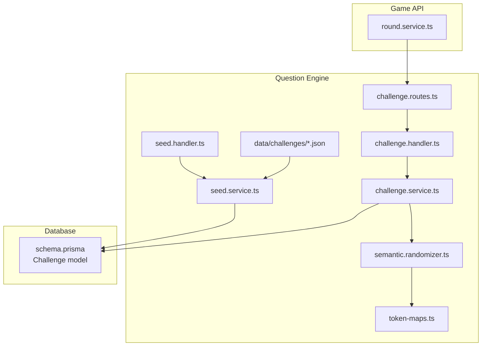
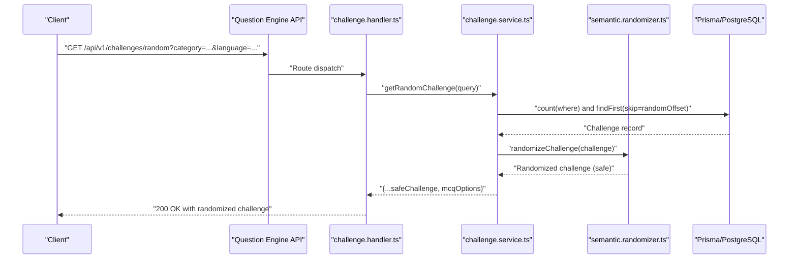
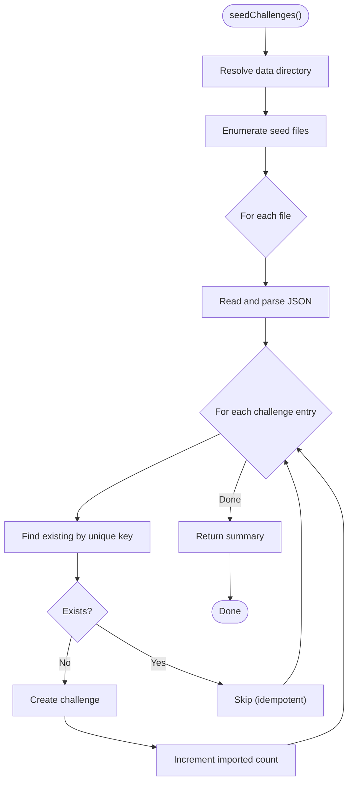
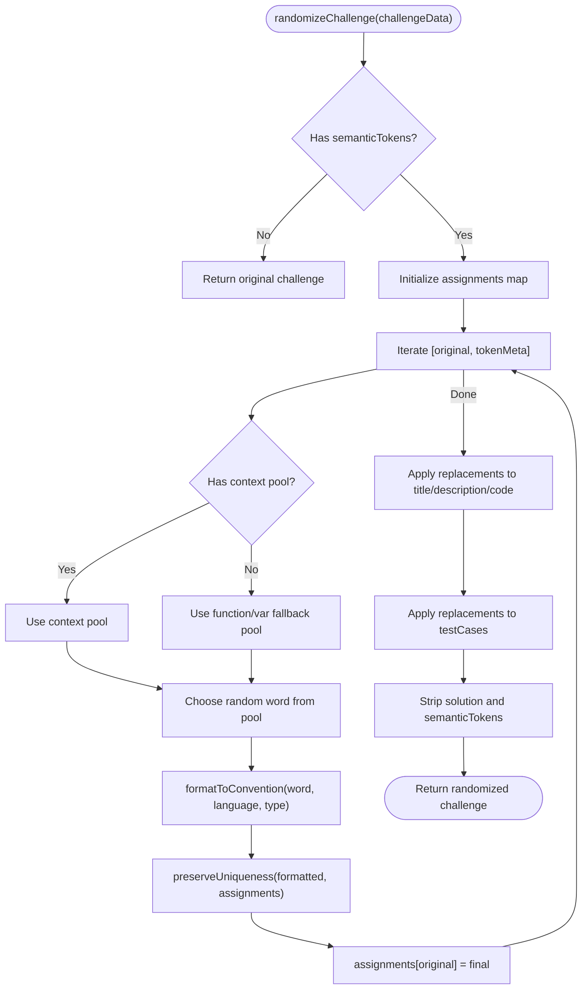
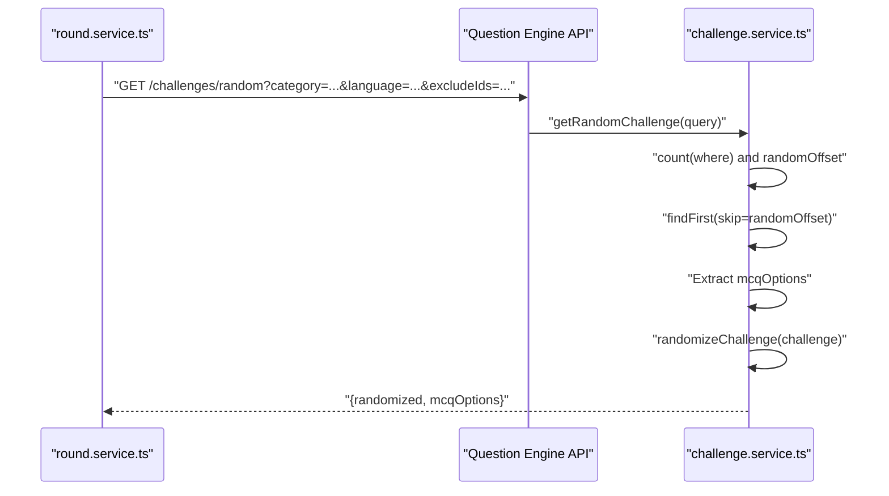
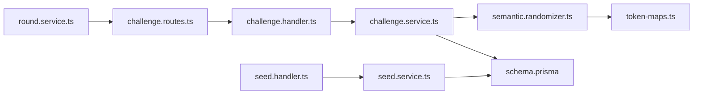

# Seed Management & Versioning

<cite>
**Referenced Files in This Document**
- [seed.handler.ts](file://apps/question-engine/src/handlers/seed.handler.ts)
- [seed.service.ts](file://apps/question-engine/src/services/seed.service.ts)
- [challenge.routes.ts](file://apps/question-engine/src/routes/challenge.routes.ts)
- [challenge.handler.ts](file://apps/question-engine/src/handlers/challenge.handler.ts)
- [challenge.service.ts](file://apps/question-engine/src/services/challenge.service.ts)
- [semantic.randomizer.ts](file://apps/question-engine/src/randomizer/semantic.randomizer.ts)
- [token-maps.ts](file://apps/question-engine/src/randomizer/token-maps.ts)
- [schema.prisma](file://packages/db/prisma/schema.prisma)
- [missing-link.json](file://apps/question-engine/data/challenges/missing-link.json)
- [round.service.ts](file://apps/game-api/src/services/round.service.ts)
- [PHASE_PLANNER.md](file://PHASE_PLANNER.md)
</cite>

## Table of Contents
1. [Introduction](#introduction)
2. [Project Structure](#project-structure)
3. [Core Components](#core-components)
4. [Architecture Overview](#architecture-overview)
5. [Detailed Component Analysis](#detailed-component-analysis)
6. [Dependency Analysis](#dependency-analysis)
7. [Performance Considerations](#performance-considerations)
8. [Troubleshooting Guide](#troubleshooting-guide)
9. [Conclusion](#conclusion)
10. [Appendices](#appendices)

## Introduction
This document explains the seed management system responsible for challenge seeding, versioning, and consistency guarantees in the assessment pipeline. It covers:
- Seed generation and persistence via the seed service
- Deterministic randomization of challenges using semantic token maps
- Consistency across sessions and uniqueness guarantees
- Integration with the randomization system and downstream consumers

The system ensures reproducible challenge variations by mapping placeholders to randomized tokens while preserving challenge semantics and preventing collisions.

## Project Structure
The seed management system spans three primary areas:
- Question Engine: seed ingestion, randomization, and challenge retrieval
- Database Schema: persistent representation of challenges and constraints
- Game API: consumption of randomized challenges and exclusion of previously used IDs

**Diagram sources**
- [seed.handler.ts](file://apps/question-engine/src/handlers/seed.handler.ts#L1-L12)
- [seed.service.ts](file://apps/question-engine/src/services/seed.service.ts#L1-L76)
- [challenge.routes.ts](file://apps/question-engine/src/routes/challenge.routes.ts#L1-L28)
- [challenge.handler.ts](file://apps/question-engine/src/handlers/challenge.handler.ts#L1-L71)
- [challenge.service.ts](file://apps/question-engine/src/services/challenge.service.ts#L1-L76)
- [semantic.randomizer.ts](file://apps/question-engine/src/randomizer/semantic.randomizer.ts#L1-L94)
- [token-maps.ts](file://apps/question-engine/src/randomizer/token-maps.ts#L1-L53)
- [schema.prisma](file://packages/db/prisma/schema.prisma#L138-L161)
- [round.service.ts](file://apps/game-api/src/services/round.service.ts#L206-L233)

**Section sources**
- [seed.handler.ts](file://apps/question-engine/src/handlers/seed.handler.ts#L1-L12)
- [seed.service.ts](file://apps/question-engine/src/services/seed.service.ts#L1-L76)
- [challenge.routes.ts](file://apps/question-engine/src/routes/challenge.routes.ts#L1-L28)
- [challenge.handler.ts](file://apps/question-engine/src/handlers/challenge.handler.ts#L1-L71)
- [challenge.service.ts](file://apps/question-engine/src/services/challenge.service.ts#L1-L76)
- [semantic.randomizer.ts](file://apps/question-engine/src/randomizer/semantic.randomizer.ts#L1-L94)
- [token-maps.ts](file://apps/question-engine/src/randomizer/token-maps.ts#L1-L53)
- [schema.prisma](file://packages/db/prisma/schema.prisma#L138-L161)
- [round.service.ts](file://apps/game-api/src/services/round.service.ts#L206-L233)

## Core Components
- Seed Handler: Exposes a POST endpoint to seed challenges from local JSON files into the database.
- Seed Service: Reads seed files, parses JSON, and upserts challenges into PostgreSQL via Prisma.
- Challenge Routes: Define endpoints for listing, fetching by ID, fetching random challenges, validating answers, and seeding.
- Challenge Handler: Validates requests and delegates to services.
- Challenge Service: Implements random selection with exclusion of previously used IDs and applies semantic randomization.
- Randomizer: Transforms challenge content deterministically using semantic token maps and language-aware formatting.
- Token Maps: Provides synonym pools categorized by context to randomize variable and function names.
- Database Schema: Defines the Challenge entity, unique constraints, and indexes supporting versioning and consistency.

Key behaviors:
- Seeding is idempotent by unique constraint on title/language/category.
- Randomization is deterministic per token map and language convention.
- Consumers exclude previously used challenge IDs to guarantee uniqueness within a session.

**Section sources**
- [seed.handler.ts](file://apps/question-engine/src/handlers/seed.handler.ts#L1-L12)
- [seed.service.ts](file://apps/question-engine/src/services/seed.service.ts#L10-L76)
- [challenge.routes.ts](file://apps/question-engine/src/routes/challenge.routes.ts#L12-L26)
- [challenge.handler.ts](file://apps/question-engine/src/handlers/challenge.handler.ts#L16-L39)
- [challenge.service.ts](file://apps/question-engine/src/services/challenge.service.ts#L34-L62)
- [semantic.randomizer.ts](file://apps/question-engine/src/randomizer/semantic.randomizer.ts#L6-L48)
- [token-maps.ts](file://apps/question-engine/src/randomizer/token-maps.ts#L11-L52)
- [schema.prisma](file://packages/db/prisma/schema.prisma#L138-L161)

## Architecture Overview
The seed management system integrates with the randomization pipeline and downstream consumers to ensure consistent, reproducible challenge variations.

**Diagram sources**
- [challenge.routes.ts](file://apps/question-engine/src/routes/challenge.routes.ts#L15-L16)
- [challenge.handler.ts](file://apps/question-engine/src/handlers/challenge.handler.ts#L22-L39)
- [challenge.service.ts](file://apps/question-engine/src/services/challenge.service.ts#L34-L62)
- [semantic.randomizer.ts](file://apps/question-engine/src/randomizer/semantic.randomizer.ts#L6-L48)

## Detailed Component Analysis

### Seed Service: Persistence and Idempotency
Responsibilities:
- Locate seed data directory and enumerate seed files.
- Parse JSON and iterate entries.
- Upsert challenges using a unique composite key: title + category + language.
- Track and report total imported challenges.

Consistency guarantees:
- Unique constraint on title/language/category prevents duplicates.
- Logging captures warnings for missing files and errors during parsing.

**Diagram sources**
- [seed.service.ts](file://apps/question-engine/src/services/seed.service.ts#L10-L76)

**Section sources**
- [seed.service.ts](file://apps/question-engine/src/services/seed.service.ts#L10-L76)
- [schema.prisma](file://packages/db/prisma/schema.prisma#L160)

### Randomization Pipeline: Deterministic Transformations
Responsibilities:
- Build token-to-replacement assignments from semanticTokens.
- Select replacements from context-aware or fallback pools.
- Apply language-aware formatting (snake_case for Python, camel/Pascal for others).
- Preserve uniqueness by appending counters to avoid collisions.
- Replace tokens in title, description, code template, and test cases.
- Strip internal fields (solution, semanticTokens) before returning.

**Diagram sources**
- [semantic.randomizer.ts](file://apps/question-engine/src/randomizer/semantic.randomizer.ts#L6-L48)
- [token-maps.ts](file://apps/question-engine/src/randomizer/token-maps.ts#L11-L52)

**Section sources**
- [semantic.randomizer.ts](file://apps/question-engine/src/randomizer/semantic.randomizer.ts#L6-L94)
- [token-maps.ts](file://apps/question-engine/src/randomizer/token-maps.ts#L1-L53)

### Challenge Retrieval and Uniqueness Across Sessions
Behavior:
- Random selection chooses a random offset and retrieves a single challenge.
- Exclusion list passed by consumers prevents reuse of prior challenges in the same session.
- MCQ options are extracted before randomization and re-injected into the safe response.

Integration with Game API:
- round.service.ts constructs URLs with category, language, and excludeIds to ensure uniqueness per session.

**Diagram sources**
- [round.service.ts](file://apps/game-api/src/services/round.service.ts#L206-L233)
- [challenge.service.ts](file://apps/question-engine/src/services/challenge.service.ts#L34-L62)

**Section sources**
- [challenge.service.ts](file://apps/question-engine/src/services/challenge.service.ts#L34-L62)
- [round.service.ts](file://apps/game-api/src/services/round.service.ts#L206-L233)

### Seed Data and Versioning Signals
Seed data files define initial challenge sets with explicit metadata:
- Category, difficulty, language, title, description, code template, solution, test cases, hints, semanticTokens, timeLimitMs.
- These fields act as versioning signals: updates to seed files introduce new records due to the unique constraint on title/language/category.

Example seed file demonstrates structured fields and semanticTokens for randomization.

**Section sources**
- [missing-link.json](file://apps/question-engine/data/challenges/missing-link.json#L1-L74)

## Dependency Analysis
The seed and randomization system depends on:
- Prisma models for persistence and unique constraints
- Route handlers and services for orchestration
- Randomizer and token maps for deterministic transformations
- Downstream services for consuming randomized challenges

**Diagram sources**
- [challenge.routes.ts](file://apps/question-engine/src/routes/challenge.routes.ts#L1-L28)
- [challenge.handler.ts](file://apps/question-engine/src/handlers/challenge.handler.ts#L1-L71)
- [challenge.service.ts](file://apps/question-engine/src/services/challenge.service.ts#L1-L76)
- [semantic.randomizer.ts](file://apps/question-engine/src/randomizer/semantic.randomizer.ts#L1-L94)
- [token-maps.ts](file://apps/question-engine/src/randomizer/token-maps.ts#L1-L53)
- [seed.handler.ts](file://apps/question-engine/src/handlers/seed.handler.ts#L1-L12)
- [seed.service.ts](file://apps/question-engine/src/services/seed.service.ts#L1-L76)
- [schema.prisma](file://packages/db/prisma/schema.prisma#L138-L161)
- [round.service.ts](file://apps/game-api/src/services/round.service.ts#L206-L233)

**Section sources**
- [challenge.routes.ts](file://apps/question-engine/src/routes/challenge.routes.ts#L1-L28)
- [challenge.handler.ts](file://apps/question-engine/src/handlers/challenge.handler.ts#L1-L71)
- [challenge.service.ts](file://apps/question-engine/src/services/challenge.service.ts#L1-L76)
- [semantic.randomizer.ts](file://apps/question-engine/src/randomizer/semantic.randomizer.ts#L1-L94)
- [token-maps.ts](file://apps/question-engine/src/randomizer/token-maps.ts#L1-L53)
- [seed.handler.ts](file://apps/question-engine/src/handlers/seed.handler.ts#L1-L12)
- [seed.service.ts](file://apps/question-engine/src/services/seed.service.ts#L1-L76)
- [schema.prisma](file://packages/db/prisma/schema.prisma#L138-L161)
- [round.service.ts](file://apps/game-api/src/services/round.service.ts#L206-L233)

## Performance Considerations
- Seeding: Batch creation is efficient; ensure seed files remain small and manageable to minimize I/O overhead.
- Randomization: Complexity is linear in the number of tokens and text length; keep semanticTokens minimal and targeted.
- Random selection: Using count + randomOffset is O(n) for skip; consider indexing and pagination for very large datasets.
- Consumer exclusions: Maintaining excludeIds arrays is lightweight; ensure downstream services cap the size to avoid long query strings.

## Troubleshooting Guide
Common issues and resolutions:
- Seed file not found: Verify the seed data directory path and file names; the service logs a warning when a file is missing.
- Duplicate challenge insertion: Due to unique constraint, duplicates are skipped; confirm title/language/category combinations are intended.
- Empty semanticTokens: Randomization is bypassed; ensure semanticTokens are present for randomized challenges.
- Language mismatch: Randomization respects language conventions; ensure language filters align with session expectations.
- Exclusion list growth: Downstream services should cap excludeIds to maintain query efficiency.

**Section sources**
- [seed.service.ts](file://apps/question-engine/src/services/seed.service.ts#L61-L68)
- [challenge.service.ts](file://apps/question-engine/src/services/challenge.service.ts#L40-L42)
- [semantic.randomizer.ts](file://apps/question-engine/src/randomizer/semantic.randomizer.ts#L7-L9)

## Conclusion
The seed management system provides a robust foundation for challenge seeding, deterministic randomization, and consistency across sessions. By leveraging unique constraints, context-aware token pools, and consumer-side exclusions, it ensures reproducible yet varied assessments while maintaining strong guarantees against duplication and collision.

## Appendices

### Endpoint Reference
- POST /api/v1/challenges/seed: Seeds challenges from local JSON files into the database.
- GET /api/v1/challenges/random: Retrieves a randomized challenge with optional filters and exclusions.
- GET /api/v1/challenges/:id: Retrieves a full challenge (including solution) by ID.

**Section sources**
- [challenge.routes.ts](file://apps/question-engine/src/routes/challenge.routes.ts#L12-L26)
- [PHASE_PLANNER.md](file://PHASE_PLANNER.md#L114-L123)