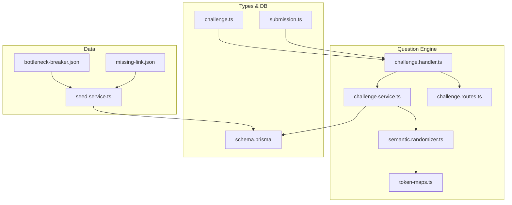
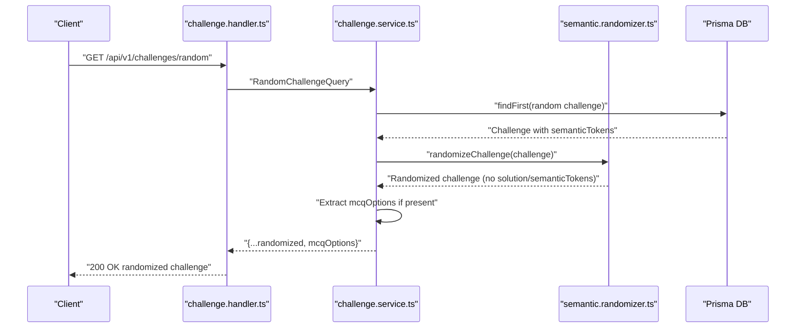
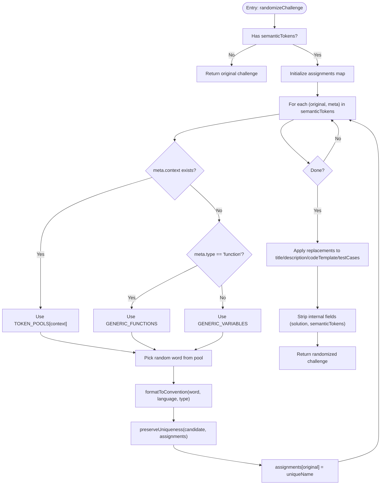
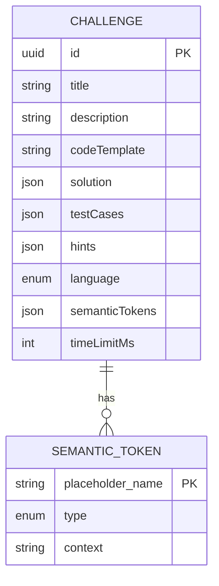
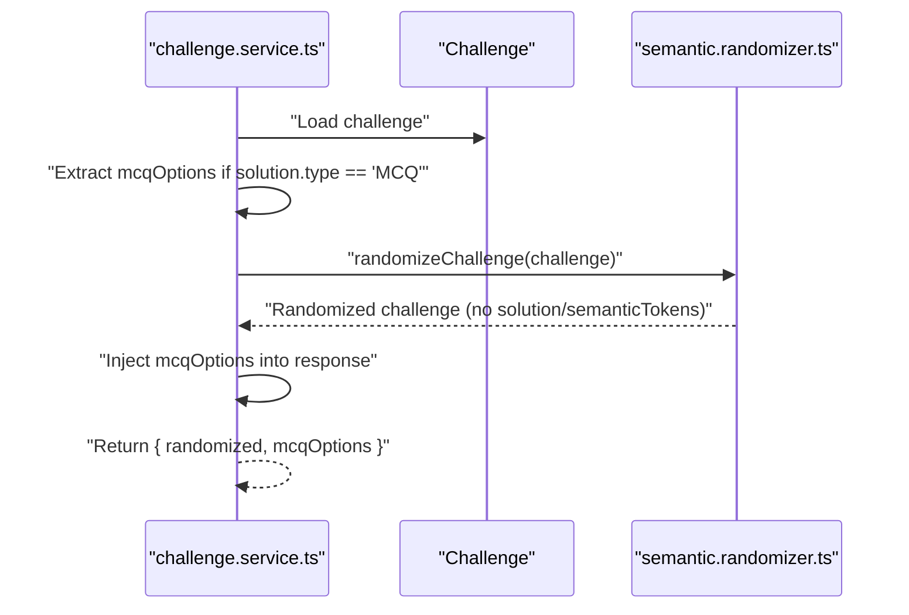
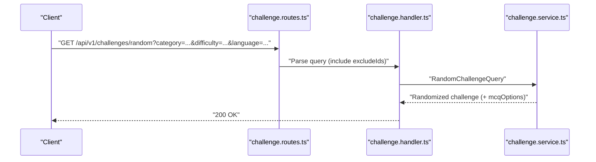
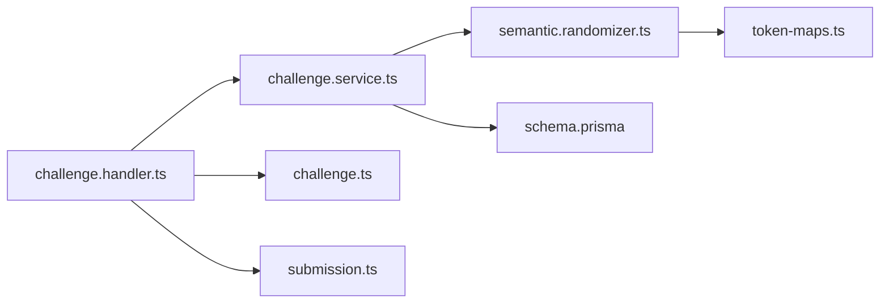

# Semantic Randomization Algorithms

<cite>
**Referenced Files in This Document**
- [semantic.randomizer.ts](file://apps/question-engine/src/randomizer/semantic.randomizer.ts)
- [token-maps.ts](file://apps/question-engine/src/randomizer/token-maps.ts)
- [challenge.service.ts](file://apps/question-engine/src/services/challenge.service.ts)
- [challenge.handler.ts](file://apps/question-engine/src/handlers/challenge.handler.ts)
- [challenge.routes.ts](file://apps/question-engine/src/routes/challenge.routes.ts)
- [challenge.ts](file://packages/types/src/challenge.ts)
- [submission.ts](file://packages/types/src/submission.ts)
- [schema.prisma](file://packages/db/prisma/schema.prisma)
- [bottleneck-breaker.json](file://apps/question-engine/data/challenges/bottleneck-breaker.json)
- [missing-link.json](file://apps/question-engine/data/challenges/missing-link.json)
- [seed.service.ts](file://apps/question-engine/src/services/seed.service.ts)
</cite>

## Table of Contents
1. [Introduction](#introduction)
2. [Project Structure](#project-structure)
3. [Core Components](#core-components)
4. [Architecture Overview](#architecture-overview)
5. [Detailed Component Analysis](#detailed-component-analysis)
6. [Dependency Analysis](#dependency-analysis)
7. [Performance Considerations](#performance-considerations)
8. [Troubleshooting Guide](#troubleshooting-guide)
9. [Conclusion](#conclusion)
10. [Appendices](#appendices)

## Introduction
This document explains the semantic randomization system that transforms programming challenges while preserving their core logic and difficulty. It focuses on:
- Variable renaming and function/class name substitution guided by semantic token maps
- Language-aware formatting (camelCase/PascalCase vs snake_case)
- Token uniqueness preservation to avoid collisions
- MCQ challenge handling and safe transport of options alongside randomized content
- Integration with the challenge service and routes to produce randomized challenges for clients

The goal is to maintain semantic equivalence so solutions remain valid after transformations, while increasing challenge uniqueness to deter pattern-based cheating.

## Project Structure
The semantic randomization spans three layers:
- Randomizer: token mapping and replacement logic
- Services: challenge retrieval and randomization orchestration
- Routes/Handlers: HTTP endpoints exposing randomized challenges

**Diagram sources**
- [challenge.routes.ts](file://apps/question-engine/src/routes/challenge.routes.ts#L1-L28)
- [challenge.handler.ts](file://apps/question-engine/src/handlers/challenge.handler.ts#L1-L71)
- [challenge.service.ts](file://apps/question-engine/src/services/challenge.service.ts#L1-L76)
- [semantic.randomizer.ts](file://apps/question-engine/src/randomizer/semantic.randomizer.ts#L1-L94)
- [token-maps.ts](file://apps/question-engine/src/randomizer/token-maps.ts#L1-L53)
- [challenge.ts](file://packages/types/src/challenge.ts#L1-L60)
- [submission.ts](file://packages/types/src/submission.ts#L1-L76)
- [schema.prisma](file://packages/db/prisma/schema.prisma#L138-L161)
- [seed.service.ts](file://apps/question-engine/src/services/seed.service.ts#L1-L76)
- [bottleneck-breaker.json](file://apps/question-engine/data/challenges/bottleneck-breaker.json#L1-L153)
- [missing-link.json](file://apps/question-engine/data/challenges/missing-link.json#L1-L74)

**Section sources**
- [challenge.routes.ts](file://apps/question-engine/src/routes/challenge.routes.ts#L1-L28)
- [challenge.handler.ts](file://apps/question-engine/src/handlers/challenge.handler.ts#L1-L71)
- [challenge.service.ts](file://apps/question-engine/src/services/challenge.service.ts#L1-L76)
- [semantic.randomizer.ts](file://apps/question-engine/src/randomizer/semantic.randomizer.ts#L1-L94)
- [token-maps.ts](file://apps/question-engine/src/randomizer/token-maps.ts#L1-L53)
- [challenge.ts](file://packages/types/src/challenge.ts#L1-L60)
- [submission.ts](file://packages/types/src/submission.ts#L1-L76)
- [schema.prisma](file://packages/db/prisma/schema.prisma#L138-L161)
- [seed.service.ts](file://apps/question-engine/src/services/seed.service.ts#L1-L76)
- [bottleneck-breaker.json](file://apps/question-engine/data/challenges/bottleneck-breaker.json#L1-L153)
- [missing-link.json](file://apps/question-engine/data/challenges/missing-link.json#L1-L74)

## Core Components
- Semantic token map: A mapping of placeholder names to metadata (type and optional context) used to drive randomization.
- Token pools: Context-specific synonym sets for variables and functions to diversify challenge wording.
- Randomization engine: Builds a deterministic assignment from original names to randomized names, respecting language conventions and uniqueness.
- Challenge service: Retrieves challenges, extracts MCQ options safely, applies randomization, and returns a sanitized response.
- Routes and handlers: Expose endpoints to fetch randomized challenges and validate answers.

Key responsibilities:
- Preserve semantic equivalence: Renaming does not change control flow or algorithmic intent.
- Enforce language-aware formatting: Python uses snake_case; Java/C++ use camelCase or PascalCase.
- Maintain solution validity: MCQ options are preserved separately and re-injected after randomization.

**Section sources**
- [challenge.ts](file://packages/types/src/challenge.ts#L51-L60)
- [token-maps.ts](file://apps/question-engine/src/randomizer/token-maps.ts#L11-L52)
- [semantic.randomizer.ts](file://apps/question-engine/src/randomizer/semantic.randomizer.ts#L6-L48)
- [challenge.service.ts](file://apps/question-engine/src/services/challenge.service.ts#L34-L62)

## Architecture Overview
The randomization pipeline integrates with the challenge service and routes to serve randomized content to clients.

**Diagram sources**
- [challenge.handler.ts](file://apps/question-engine/src/handlers/challenge.handler.ts#L22-L39)
- [challenge.service.ts](file://apps/question-engine/src/services/challenge.service.ts#L34-L62)
- [semantic.randomizer.ts](file://apps/question-engine/src/randomizer/semantic.randomizer.ts#L6-L48)
- [schema.prisma](file://packages/db/prisma/schema.prisma#L138-L161)

## Detailed Component Analysis

### Randomization Engine
The randomization engine builds a stable mapping from original placeholder names to randomized tokens, ensuring uniqueness and language-appropriate formatting.

- Pool selection:
  - Context-specific pools (e.g., COLLECTION, PROCESS) improve semantic diversity.
  - Fallback pools provide generic synonyms when context is absent.
- Formatting:
  - Python variables become snake_case.
  - Functions/classes follow camelCase/PascalCase conventions.
- Uniqueness:
  - Ensures no two placeholders map to the same randomized token.

**Diagram sources**
- [semantic.randomizer.ts](file://apps/question-engine/src/randomizer/semantic.randomizer.ts#L6-L48)
- [token-maps.ts](file://apps/question-engine/src/randomizer/token-maps.ts#L11-L52)

**Section sources**
- [semantic.randomizer.ts](file://apps/question-engine/src/randomizer/semantic.randomizer.ts#L6-L94)
- [token-maps.ts](file://apps/question-engine/src/randomizer/token-maps.ts#L11-L52)

### Token Mapping System
- Purpose: Define which placeholders to randomize and how to choose replacements.
- Structure: A record keyed by placeholder name with fields:
  - type: variable, function, class, parameter, constant
  - context: optional hint for selecting a synonym pool
- Example usage: Challenges include a semanticTokens field that drives randomization.

- The randomization engine reads semanticTokens and produces a stable mapping for each placeholder.
- The mapping is applied to textual fields and code templates to achieve semantic equivalence.

**Diagram sources**
- [schema.prisma](file://packages/db/prisma/schema.prisma#L138-L161)
- [challenge.ts](file://packages/types/src/challenge.ts#L51-L60)

**Section sources**
- [challenge.ts](file://packages/types/src/challenge.ts#L51-L60)
- [schema.prisma](file://packages/db/prisma/schema.prisma#L138-L161)

### MCQ Handling and Options Preservation
- During randomization, the internal solution and semanticTokens are stripped from the response to prevent leaking the original challenge details.
- For MCQ challenges, the service extracts options prior to randomization and re-injects them into the randomized response.
- This ensures randomized challenges remain solvable while preventing trivial pattern matching.

**Diagram sources**
- [challenge.service.ts](file://apps/question-engine/src/services/challenge.service.ts#L52-L61)
- [challenge.ts](file://packages/types/src/challenge.ts#L51-L60)

**Section sources**
- [challenge.service.ts](file://apps/question-engine/src/services/challenge.service.ts#L52-L61)

### Language-Aware Formatting and Code Template Transformations
- Variable naming:
  - Python: snake_case conversion from the chosen token.
  - Java/C++: camelCase for variables/functions, PascalCase for classes.
- Code template replacement:
  - The same token-to-name mapping is applied to code templates to keep semantics intact.
- Regex boundaries:
  - Word boundaries ensure only whole tokens are replaced, avoiding partial matches inside larger identifiers.

**Section sources**
- [semantic.randomizer.ts](file://apps/question-engine/src/randomizer/semantic.randomizer.ts#L76-L83)
- [semantic.randomizer.ts](file://apps/question-engine/src/randomizer/semantic.randomizer.ts#L50-L69)

### Integration with Challenge Service and Routes
- Endpoint: GET /api/v1/challenges/random returns a randomized challenge.
- Query parameters:
  - category, difficulty, language (all optional)
  - excludeIds: array of challenge IDs to exclude from selection
- Behavior:
  - Randomly selects a challenge row from the database filtered by criteria.
  - Applies randomization and returns a sanitized response with MCQ options preserved.

**Diagram sources**
- [challenge.routes.ts](file://apps/question-engine/src/routes/challenge.routes.ts#L15-L16)
- [challenge.handler.ts](file://apps/question-engine/src/handlers/challenge.handler.ts#L22-L39)
- [challenge.service.ts](file://apps/question-engine/src/services/challenge.service.ts#L34-L62)

**Section sources**
- [challenge.routes.ts](file://apps/question-engine/src/routes/challenge.routes.ts#L1-L28)
- [challenge.handler.ts](file://apps/question-engine/src/handlers/challenge.handler.ts#L1-L71)
- [challenge.service.ts](file://apps/question-engine/src/services/challenge.service.ts#L34-L62)

## Dependency Analysis
- Randomizer depends on:
  - Token pools for synonym selection
  - Challenge language to format tokens appropriately
- Service depends on:
  - Randomizer for transformations
  - Prisma model for challenge persistence
  - Types for schema validation
- Handlers depend on:
  - Service for business logic
  - Types for request/response schemas

**Diagram sources**
- [challenge.handler.ts](file://apps/question-engine/src/handlers/challenge.handler.ts#L1-L71)
- [challenge.service.ts](file://apps/question-engine/src/services/challenge.service.ts#L1-L76)
- [semantic.randomizer.ts](file://apps/question-engine/src/randomizer/semantic.randomizer.ts#L1-L94)
- [token-maps.ts](file://apps/question-engine/src/randomizer/token-maps.ts#L1-L53)
- [challenge.ts](file://packages/types/src/challenge.ts#L1-L60)
- [submission.ts](file://packages/types/src/submission.ts#L1-L76)
- [schema.prisma](file://packages/db/prisma/schema.prisma#L138-L161)

**Section sources**
- [challenge.handler.ts](file://apps/question-engine/src/handlers/challenge.handler.ts#L1-L71)
- [challenge.service.ts](file://apps/question-engine/src/services/challenge.service.ts#L1-L76)
- [semantic.randomizer.ts](file://apps/question-engine/src/randomizer/semantic.randomizer.ts#L1-L94)
- [token-maps.ts](file://apps/question-engine/src/randomizer/token-maps.ts#L1-L53)
- [challenge.ts](file://packages/types/src/challenge.ts#L1-L60)
- [submission.ts](file://packages/types/src/submission.ts#L1-L76)
- [schema.prisma](file://packages/db/prisma/schema.prisma#L138-L161)

## Performance Considerations
- Complexity:
  - Randomization is linear in the number of tokens and the length of textual fields.
  - Regex replacement per token scales with text size; typical challenges are small enough to remain efficient.
- Memory:
  - Assignment map stores one mapping per token.
- Recommendations:
  - Keep token counts reasonable to avoid excessive regex passes.
  - Consider caching frequently used token pools if needed.

[No sources needed since this section provides general guidance]

## Troubleshooting Guide
Common issues and resolutions:
- Empty or missing semanticTokens:
  - The randomizer returns the original challenge unchanged. Ensure challenges include semanticTokens.
- Unexpected replacements inside comments/strings:
  - The engine uses word boundaries to avoid partial matches. Verify tokens do not overlap ambiguously.
- MCQ options missing:
  - Confirm the solution type is MCQ and options exist; the service extracts and re-injects options automatically.
- Language mismatch warnings:
  - If language filtering is omitted, the returned challenge may not align with the session language.

**Section sources**
- [semantic.randomizer.ts](file://apps/question-engine/src/randomizer/semantic.randomizer.ts#L7-L9)
- [challenge.service.ts](file://apps/question-engine/src/services/challenge.service.ts#L40-L42)
- [challenge.service.ts](file://apps/question-engine/src/services/challenge.service.ts#L52-L61)

## Conclusion
The semantic randomization system preserves challenge logic and difficulty while introducing meaningful variability through contextual token substitution. By enforcing language-aware formatting and uniqueness constraints, it maintains solution validity and enhances fairness. The integration with the challenge service and routes enables seamless delivery of randomized challenges to clients, with careful handling of MCQ options to sustain solvability.

[No sources needed since this section summarizes without analyzing specific files]

## Appendices

### Before/After Transformation Examples
- Variable renaming:
  - Before: placeholder "ledgers" with type "variable" and context "COLLECTION"
  - After: randomized to a synonym from the COLLECTION pool, formatted according to language convention
- Function renaming:
  - Before: placeholder "find_duplicates" with type "function"
  - After: randomized to a synonym from the appropriate function pool, preserving camelCase/PascalCase
- Code template transformation:
  - Original code uses "ledgers"; after randomization, all occurrences are replaced consistently while maintaining control flow and logic

[No sources needed since this section provides conceptual examples]

### Randomization Configuration Options
- Context pools:
  - COLLECTION, ITEM, PROCESS, ECOMMERCE_VARS, IOT_VARS
- Fallback pools:
  - GENERIC_VARIABLES, GENERIC_FUNCTIONS
- Token metadata:
  - type: variable, function, class, parameter, constant
  - context: optional pool hint

**Section sources**
- [token-maps.ts](file://apps/question-engine/src/randomizer/token-maps.ts#L11-L52)
- [challenge.ts](file://packages/types/src/challenge.ts#L51-L60)

### Integration Notes
- Seed data:
  - Challenge JSON files include semanticTokens and solution structures.
  - The seed service imports these files and persists them to the database.
- Endpoint behavior:
  - Randomized challenges exclude internal fields and include MCQ options when applicable.

**Section sources**
- [bottleneck-breaker.json](file://apps/question-engine/data/challenges/bottleneck-breaker.json#L25-L28)
- [missing-link.json](file://apps/question-engine/data/challenges/missing-link.json#L28-L37)
- [seed.service.ts](file://apps/question-engine/src/services/seed.service.ts#L31-L60)