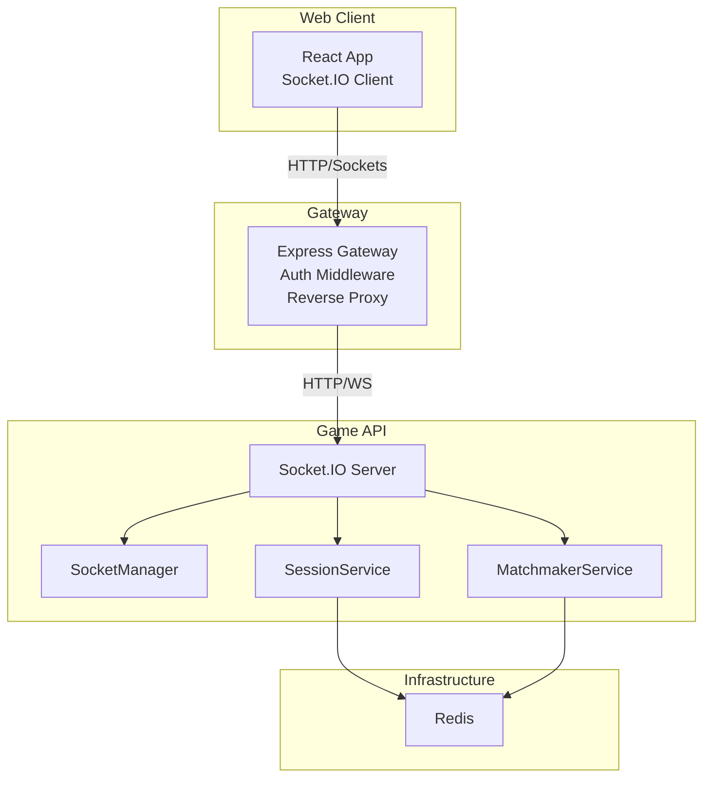
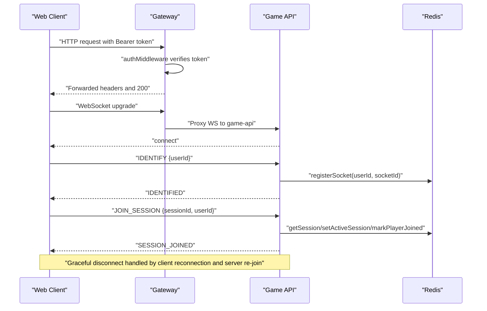
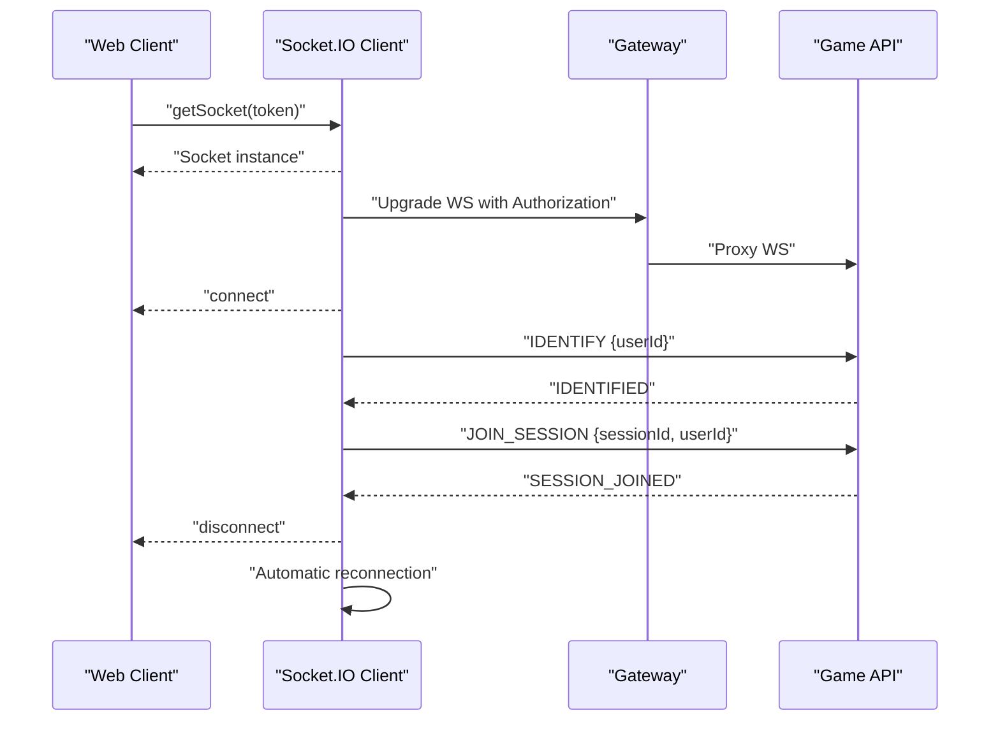
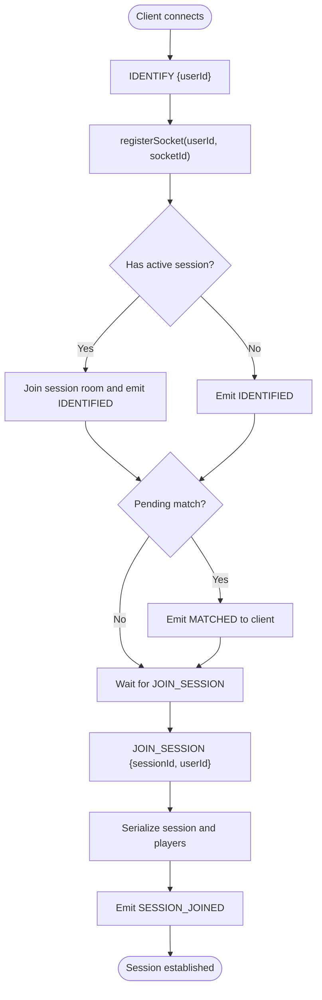
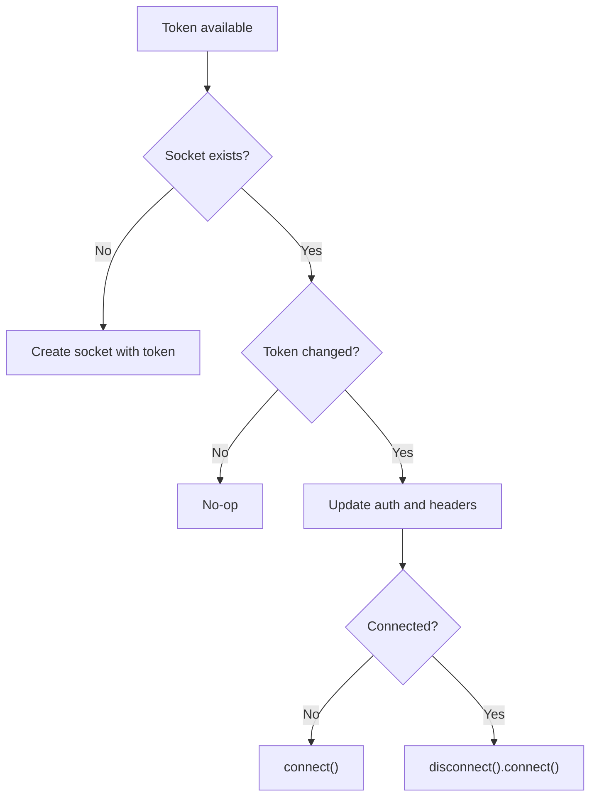
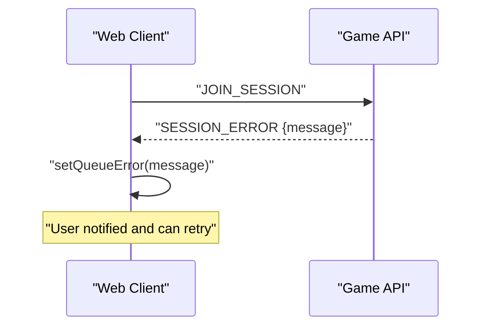
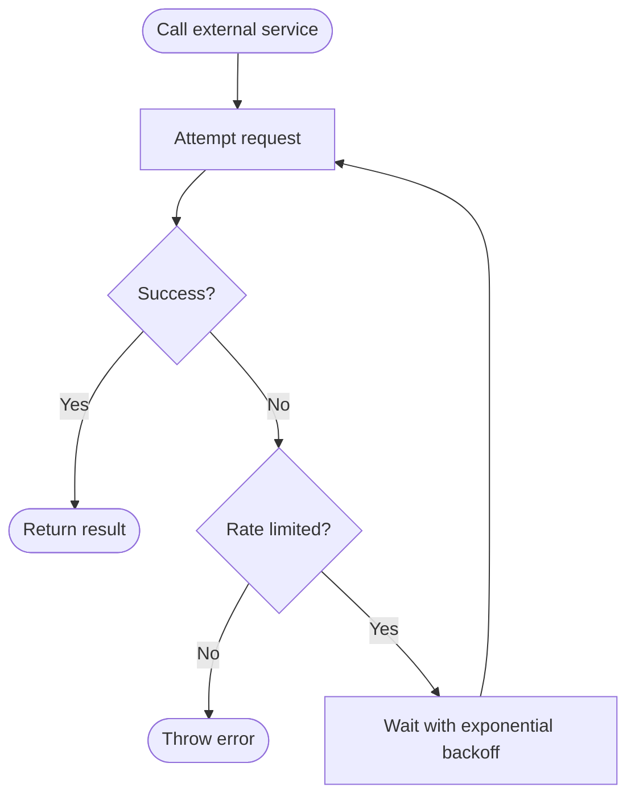

# Connection Management & Recovery

<cite>
**Referenced Files in This Document**
- [use-game-engine.ts](file://apps/web/hooks/use-game-engine.ts)
- [socket.handler.ts](file://apps/game-api/src/websocket/socket.handler.ts)
- [socket.manager.ts](file://apps/game-api/src/websocket/socket.manager.ts)
- [session.service.ts](file://apps/game-api/src/services/session.service.ts)
- [matchmaker.service.ts](file://apps/game-api/src/services/matchmaker.service.ts)
- [auth.ts](file://apps/gateway/src/middleware/auth.ts)
- [proxy.ts](file://apps/gateway/src/proxy.ts)
- [redis.ts](file://apps/gateway/src/redis.ts)
- [route.ts](file://apps/web/app/api/story/chat/route.ts)
</cite>

## Table of Contents
1. [Introduction](#introduction)
2. [Project Structure](#project-structure)
3. [Core Components](#core-components)
4. [Architecture Overview](#architecture-overview)
5. [Detailed Component Analysis](#detailed-component-analysis)
6. [Dependency Analysis](#dependency-analysis)
7. [Performance Considerations](#performance-considerations)
8. [Troubleshooting Guide](#troubleshooting-guide)
9. [Conclusion](#conclusion)

## Introduction
This document explains connection lifecycle management and recovery mechanisms in the real-time communication system. It covers authentication, session establishment, graceful disconnection handling, automatic reconnection strategies, exponential backoff patterns, connection state persistence, error handling for network failures and server restarts, monitoring and health checks, performance metrics, scaling and failover strategies, and practical troubleshooting steps.

## Project Structure
The real-time stack spans the web client, gateway, and game-api backend:
- Web client establishes a Socket.IO connection, authenticates via bearer tokens, and manages reconnection and state.
- Gateway enforces authentication and proxies WebSocket connections to game-api.
- Game-api handles session rooms, user identification, and robust reconnection recovery.
- Redis persists socket-to-user associations and session metadata.



**Diagram sources**
- [use-game-engine.ts](file://apps/web/hooks/use-game-engine.ts#L36-L53)
- [auth.ts](file://apps/gateway/src/middleware/auth.ts#L18-L64)
- [proxy.ts](file://apps/gateway/src/proxy.ts#L17-L42)
- [socket.handler.ts](file://apps/game-api/src/websocket/socket.handler.ts#L62-L106)
- [socket.manager.ts](file://apps/game-api/src/websocket/socket.manager.ts#L3-L29)
- [session.service.ts](file://apps/game-api/src/services/session.service.ts#L62-L90)
- [matchmaker.service.ts](file://apps/game-api/src/services/matchmaker.service.ts#L41-L57)
- [redis.ts](file://apps/gateway/src/redis.ts#L9-L20)

**Section sources**
- [use-game-engine.ts](file://apps/web/hooks/use-game-engine.ts#L18-L53)
- [auth.ts](file://apps/gateway/src/middleware/auth.ts#L16-L64)
- [proxy.ts](file://apps/gateway/src/proxy.ts#L17-L42)
- [socket.handler.ts](file://apps/game-api/src/websocket/socket.handler.ts#L62-L106)
- [session.service.ts](file://apps/game-api/src/services/session.service.ts#L62-L90)
- [matchmaker.service.ts](file://apps/game-api/src/services/matchmaker.service.ts#L41-L57)
- [redis.ts](file://apps/gateway/src/redis.ts#L9-L20)

## Core Components
- Web client Socket.IO manager: initializes connection, injects auth headers, handles reconnection, and emits identification and session events.
- Gateway auth middleware: validates bearer tokens or session cookies and forwards identity to backend.
- Game API Socket.IO handlers: manage IDENTIFY, JOIN_SESSION, PLAYER_READY, and cleanup on disconnect.
- SessionService: persists socket association, active session, readiness, and player data in Redis.
- MatchmakerService: maintains waiting rooms, matches players, and supports requeue for survival mode.
- SocketManager: room membership helpers and targeted emits.
- Redis: connection state persistence and session metadata.

**Section sources**
- [use-game-engine.ts](file://apps/web/hooks/use-game-engine.ts#L36-L103)
- [auth.ts](file://apps/gateway/src/middleware/auth.ts#L18-L64)
- [socket.handler.ts](file://apps/game-api/src/websocket/socket.handler.ts#L71-L106)
- [session.service.ts](file://apps/game-api/src/services/session.service.ts#L62-L126)
- [matchmaker.service.ts](file://apps/game-api/src/services/matchmaker.service.ts#L41-L169)
- [socket.manager.ts](file://apps/game-api/src/websocket/socket.manager.ts#L3-L29)
- [redis.ts](file://apps/gateway/src/redis.ts#L9-L20)

## Architecture Overview
The connection lifecycle integrates client-side reconnection, gateway authentication, and server-side session recovery.



**Diagram sources**
- [use-game-engine.ts](file://apps/web/hooks/use-game-engine.ts#L93-L103)
- [auth.ts](file://apps/gateway/src/middleware/auth.ts#L32-L64)
- [proxy.ts](file://apps/gateway/src/proxy.ts#L22-L42)
- [socket.handler.ts](file://apps/game-api/src/websocket/socket.handler.ts#L71-L106)
- [session.service.ts](file://apps/game-api/src/services/session.service.ts#L62-L90)

## Detailed Component Analysis

### Client-Side Connection Lifecycle
- Initialization: Socket.IO client is created once with WebSocket transport, reconnection enabled, and auth headers injected.
- Authentication: Bearer token is passed via auth object and extraHeaders for polling requests.
- Reconnection: Automatic reconnection with fixed delay and capped attempts; reconnect triggered on token updates.
- Identification: On connect, emits IDENTIFY with userId; waits for IDENTIFIED acknowledgment.
- Session Join: Emits JOIN_SESSION with ack callback; applies SESSION_JOINED payload on success.
- Disconnection: Updates connected state and clears identification flag.



**Diagram sources**
- [use-game-engine.ts](file://apps/web/hooks/use-game-engine.ts#L36-L103)
- [auth.ts](file://apps/gateway/src/middleware/auth.ts#L32-L64)
- [proxy.ts](file://apps/gateway/src/proxy.ts#L22-L42)
- [socket.handler.ts](file://apps/game-api/src/websocket/socket.handler.ts#L71-L106)

**Section sources**
- [use-game-engine.ts](file://apps/web/hooks/use-game-engine.ts#L36-L103)
- [use-game-engine.ts](file://apps/web/hooks/use-game-engine.ts#L133-L166)
- [use-game-engine.ts](file://apps/web/hooks/use-game-engine.ts#L113-L131)

### Server-Side Session Recovery and Room Re-join
- IDENTIFY handler registers socketId for userId, restores active session, and re-joins session room if needed.
- Re-delivers pending MATCHED to clients reconnecting mid-match.
- JOIN_SESSION ensures room membership and emits SESSION_JOINED with serialized player data.
- DISCONNECT cleans up queue and socket association.



**Diagram sources**
- [socket.handler.ts](file://apps/game-api/src/websocket/socket.handler.ts#L71-L106)
- [session.service.ts](file://apps/game-api/src/services/session.service.ts#L62-L90)
- [socket.handler.ts](file://apps/game-api/src/websocket/socket.handler.ts#L111-L157)

**Section sources**
- [socket.handler.ts](file://apps/game-api/src/websocket/socket.handler.ts#L71-L106)
- [socket.handler.ts](file://apps/game-api/src/websocket/socket.handler.ts#L111-L157)
- [session.service.ts](file://apps/game-api/src/services/session.service.ts#L62-L90)

### Token Rotation and Reconnect Strategy
- updateSocketToken updates auth and headers, reconnects only when token changes, and avoids dropping room membership unnecessarily.
- Reconnection policy: reconnection enabled with fixed delay and capped attempts; manual reconnect triggers disconnect+connect.



**Diagram sources**
- [use-game-engine.ts](file://apps/web/hooks/use-game-engine.ts#L61-L77)
- [use-game-engine.ts](file://apps/web/hooks/use-game-engine.ts#L46-L50)

**Section sources**
- [use-game-engine.ts](file://apps/web/hooks/use-game-engine.ts#L61-L77)
- [use-game-engine.ts](file://apps/web/hooks/use-game-engine.ts#L46-L50)

### Error Handling Patterns
- Client-side:
  - connect_error sets socket status to ERROR.
  - SESSION_ERROR events are handled and surfaced to UI.
  - JOIN_SESSION uses ack to reliably report errors.
- Server-side:
  - JOIN_SESSION validates session existence and emits SESSION_ERROR with message.
  - PLAYER_READY ensures room membership and emits SESSION_ERROR on failure.
  - DISCONNECT cancels queue and unregisters socket.
- Gateway:
  - Proxy error handler responds with Bad Gateway for WS errors.
  - Redis client uses bounded retries and logs warnings.



**Diagram sources**
- [use-game-engine.ts](file://apps/web/hooks/use-game-engine.ts#L180-L183)
- [socket.handler.ts](file://apps/game-api/src/websocket/socket.handler.ts#L116-L119)
- [proxy.ts](file://apps/gateway/src/proxy.ts#L30-L37)
- [redis.ts](file://apps/gateway/src/redis.ts#L13-L20)

**Section sources**
- [use-game-engine.ts](file://apps/web/hooks/use-game-engine.ts#L180-L183)
- [socket.handler.ts](file://apps/game-api/src/websocket/socket.handler.ts#L116-L119)
- [proxy.ts](file://apps/gateway/src/proxy.ts#L30-L37)
- [redis.ts](file://apps/gateway/src/redis.ts#L13-L20)

### Connection Monitoring, Health Checks, and Metrics
- Socket.IO server exposes connection events for monitoring: connect, disconnect, connect_error.
- Redis connection state tracked via ready/connect/close/error events.
- Frontend stores socketStatus in store and reflects UI state.
- Optional: track round completion timing and telemetry throughput for performance insights.

**Section sources**
- [use-game-engine.ts](file://apps/web/hooks/use-game-engine.ts#L136-L166)
- [redis.ts](file://apps/gateway/src/redis.ts#L22-L40)

### Scaling, Load Balancing, and Failover Strategies
- Horizontal scaling: multiple game-api replicas behind a load balancer; Redis persists socket associations and sessions.
- Sticky sessions: not required due to Redis-backed state; clients re-identify and re-join rooms.
- Failover: Redis availability impacts rate limiting; bounded retry strategy prevents thundering herds.
- Proxy resilience: Gateway proxies WebSocket traffic and surfaces errors to clients.

**Section sources**
- [matchmaker.service.ts](file://apps/game-api/src/services/matchmaker.service.ts#L14-L21)
- [session.service.ts](file://apps/game-api/src/services/session.service.ts#L62-L90)
- [redis.ts](file://apps/gateway/src/redis.ts#L9-L20)
- [proxy.ts](file://apps/gateway/src/proxy.ts#L22-L42)

### Examples: Recovery Scenarios and State Restoration
- Scenario 1: Client network interruption
  - Client reconnection triggers; server re-joins session room and re-emits pending MATCHED if applicable.
- Scenario 2: Server restart during a session
  - Client reconnects; server re-identifies user and restores active session room membership.
- Scenario 3: Token refresh
  - updateSocketToken updates auth and reconnects only when token changes.

**Section sources**
- [socket.handler.ts](file://apps/game-api/src/websocket/socket.handler.ts#L78-L101)
- [use-game-engine.ts](file://apps/web/hooks/use-game-engine.ts#L61-L77)

### Exponential Backoff and Retry Patterns
- Story API demonstrates exponential backoff for rate-limited external calls.
- Gateway Redis client uses bounded retry with increasing delays.



**Diagram sources**
- [route.ts](file://apps/web/app/api/story/chat/route.ts#L68-L85)
- [redis.ts](file://apps/gateway/src/redis.ts#L13-L19)

**Section sources**
- [route.ts](file://apps/web/app/api/story/chat/route.ts#L68-L85)
- [redis.ts](file://apps/gateway/src/redis.ts#L13-L19)

## Dependency Analysis
```mermaid
classDiagram
class SocketManager {
+setIO(io)
+associateUser(socketId, userId)
+disassociateUser(socketId)
+emitToUser(userId, event, payload) bool
+joinSession(socket, sessionId)
+leaveSession(socket, sessionId)
+emitToSession(sessionId, event, payload)
+emitToSocket(socket, event, payload)
+countInSession(sessionId) Promise<number>
}
class SessionService {
+createSession(sessionId, config, players) Promise<BlitzSession>
+getSession(sessionId) Promise<BlitzSession|null>
+updateSession(sessionId, update) Promise<void>
+registerSocket(userId, socketId) Promise<void>
+unregisterSocket(userId) Promise<void>
+getSocketId(userId) Promise<string|null>
+setActiveSession(userId, sessionId) Promise<void>
+getActiveSession(userId) Promise<string|null>
+clearActiveSession(userId) Promise<void>
+markPlayerJoined(sessionId, userId) Promise<number>
+getJoinedCount(sessionId) Promise<number>
+markPlayerReady(sessionId, userId) Promise<number>
+getReadyCount(sessionId) Promise<number>
+getPendingMatch(userId) Promise<string|null>
+clearPendingMatch(userId) Promise<void>
+recordRoundScore(sessionId, userId, points) Promise<void>
+deductLife(sessionId, userId) Promise<void>
+serialize(session) Promise<{players}>
}
class MatchmakerService {
+findOrCreateSession(payload) Promise<MatchResult>
+cancelQueue(userId) void
+requeueForSurvival(userId, payload, socketId?) Promise<MatchResult>
}
SocketManager --> SessionService : "uses"
MatchmakerService --> SessionService : "uses"
```

**Diagram sources**
- [socket.manager.ts](file://apps/game-api/src/websocket/socket.manager.ts#L3-L55)
- [session.service.ts](file://apps/game-api/src/services/session.service.ts#L18-L166)
- [matchmaker.service.ts](file://apps/game-api/src/services/matchmaker.service.ts#L41-L205)

**Section sources**
- [socket.manager.ts](file://apps/game-api/src/websocket/socket.manager.ts#L3-L55)
- [session.service.ts](file://apps/game-api/src/services/session.service.ts#L18-L166)
- [matchmaker.service.ts](file://apps/game-api/src/services/matchmaker.service.ts#L41-L205)

## Performance Considerations
- Prefer WebSocket transport and minimize polling overhead.
- Use ack callbacks for critical events to ensure reliable delivery.
- Throttle telemetry emissions to reduce bandwidth and CPU usage.
- Persist state in Redis to avoid rebuilding state on restarts.
- Monitor socket counts per session to detect anomalies.

[No sources needed since this section provides general guidance]

## Troubleshooting Guide
Common issues and remedies:
- 401 Unauthorized on WebSocket upgrade
  - Ensure Authorization header is present and valid; verify authMiddleware logic and token freshness.
- Frequent reconnections causing room membership loss
  - Use updateSocketToken to avoid unnecessary reconnects; ensure token changes are detected.
- Session not found or expired
  - Client receives SESSION_ERROR; guide user to re-queue or refresh page.
- Server restart mid-session
  - Client reconnects; server re-identifies and re-joins session room.
- Redis connectivity issues
  - Check Redis connection state and retry strategy; expect rate limiting to fail-open.

**Section sources**
- [auth.ts](file://apps/gateway/src/middleware/auth.ts#L32-L64)
- [use-game-engine.ts](file://apps/web/hooks/use-game-engine.ts#L61-L77)
- [socket.handler.ts](file://apps/game-api/src/websocket/socket.handler.ts#L116-L119)
- [redis.ts](file://apps/gateway/src/redis.ts#L22-L40)

## Conclusion
The system implements robust connection lifecycle management with explicit authentication, resilient reconnection, and state persistence via Redis. Server-side handlers recover sessions on reconnect, while the client manages token rotation and reconnection policies. Error handling and monitoring enable quick diagnosis and recovery. Scaling is achieved through stateless replicas and centralized Redis, with proxy-level resilience for WebSocket traffic.