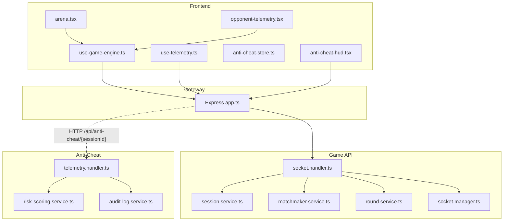
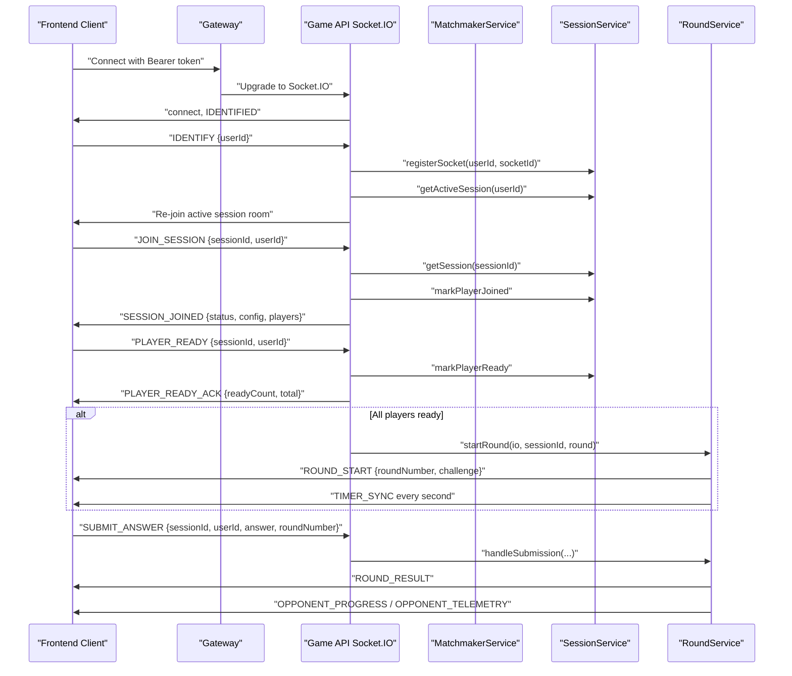
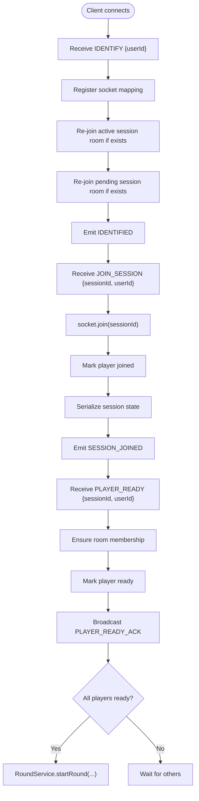
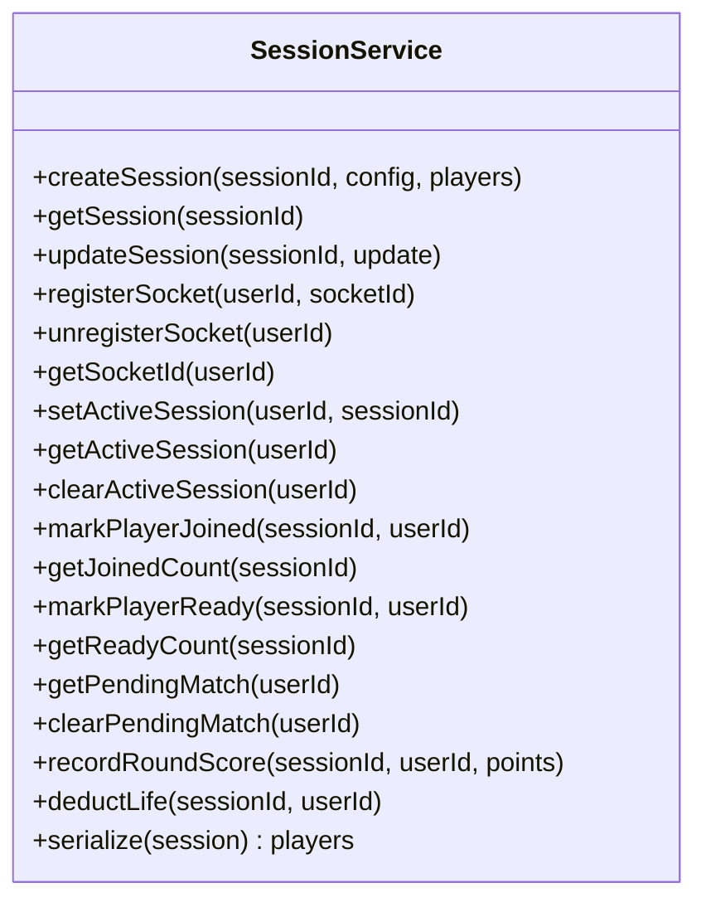
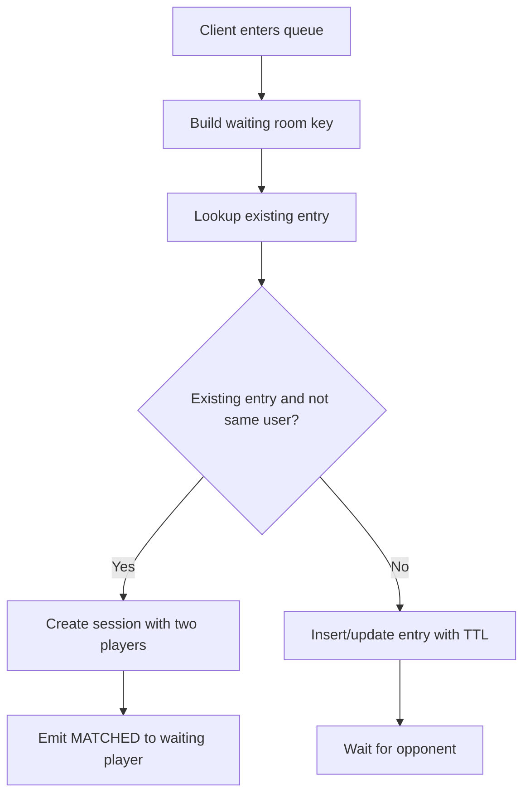
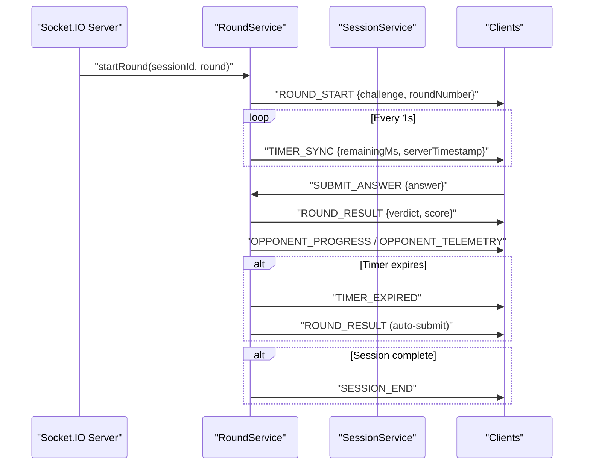
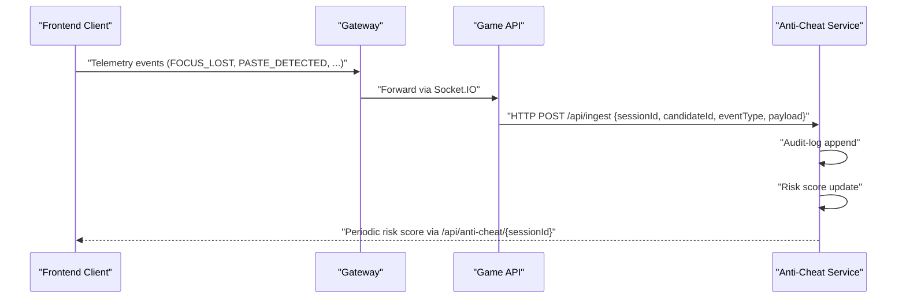
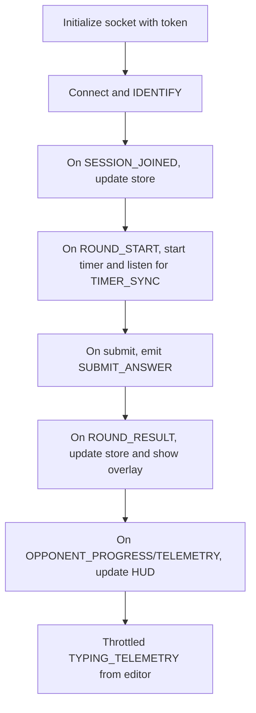
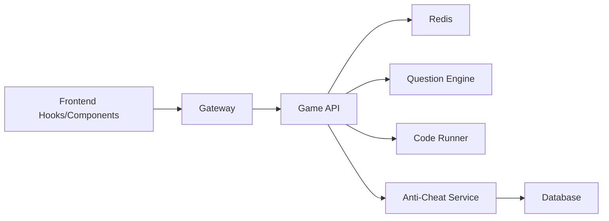

# Real-time Communication

<cite>
**Referenced Files in This Document**
- [socket.handler.ts](file://apps/game-api/src/websocket/socket.handler.ts)
- [socket.manager.ts](file://apps/game-api/src/websocket/socket.manager.ts)
- [telemetry.handler.ts](file://apps/anti-cheat/src/handlers/telemetry.handler.ts)
- [use-telemetry.ts](file://apps/web/hooks/use-telemetry.ts)
- [use-game-engine.ts](file://apps/web/hooks/use-game-engine.ts)
- [arena.tsx](file://apps/web/components/game/arena.tsx)
- [opponent-telemetry.tsx](file://apps/web/components/game/opponent-telemetry.tsx)
- [anti-cheat-store.ts](file://apps/web/store/anti-cheat-store.ts)
- [anti-cheat-hud.tsx](file://apps/web/components/game/anti-cheat-hud.tsx)
- [websocket.ts](file://packages/types/src/websocket.ts)
- [session.service.ts](file://apps/game-api/src/services/session.service.ts)
- [matchmaker.service.ts](file://apps/game-api/src/services/matchmaker.service.ts)
- [round.service.ts](file://apps/game-api/src/services/round.service.ts)
- [risk-scoring.service.ts](file://apps/anti-cheat/src/services/risk-scoring.service.ts)
- [audit-log.service.ts](file://apps/anti-cheat/src/services/audit-log.service.ts)
- [app.ts](file://apps/game-api/src/app.ts)
</cite>

## Table of Contents
1. [Introduction](#introduction)
2. [Project Structure](#project-structure)
3. [Core Components](#core-components)
4. [Architecture Overview](#architecture-overview)
5. [Detailed Component Analysis](#detailed-component-analysis)
6. [Dependency Analysis](#dependency-analysis)
7. [Performance Considerations](#performance-considerations)
8. [Troubleshooting Guide](#troubleshooting-guide)
9. [Conclusion](#conclusion)
10. [Appendices](#appendices)

## Introduction
This document explains the real-time communication system in Logic Forge, focusing on bidirectional WebSocket messaging powered by Socket.IO. It covers connection lifecycle, room-based broadcasting, anti-cheat telemetry ingestion and scoring, and real-time synchronization of game sessions, player readiness, and scores. It also documents connection recovery, error handling, graceful degradation, performance tuning, and practical integration patterns for frontend components.

## Project Structure
The real-time stack spans three layers:
- Frontend (React) with Socket.IO client hooks and UI components
- Game API (Express + Socket.IO) handling matchmaking, sessions, rounds, and telemetry relays
- Anti-Cheat service receiving telemetry events, auditing, and computing risk scores

**Diagram sources**
- [use-game-engine.ts](file://apps/web/hooks/use-game-engine.ts#L1-L466)
- [use-telemetry.ts](file://apps/web/hooks/use-telemetry.ts#L1-L157)
- [anti-cheat-store.ts](file://apps/web/store/anti-cheat-store.ts#L1-L108)
- [anti-cheat-hud.tsx](file://apps/web/components/game/anti-cheat-hud.tsx#L1-L129)
- [arena.tsx](file://apps/web/components/game/arena.tsx#L1-L395)
- [opponent-telemetry.tsx](file://apps/web/components/game/opponent-telemetry.tsx#L1-L99)
- [app.ts](file://apps/game-api/src/app.ts#L1-L63)
- [socket.handler.ts](file://apps/game-api/src/websocket/socket.handler.ts#L1-L310)
- [session.service.ts](file://apps/game-api/src/services/session.service.ts#L1-L167)
- [matchmaker.service.ts](file://apps/game-api/src/services/matchmaker.service.ts#L1-L206)
- [round.service.ts](file://apps/game-api/src/services/round.service.ts#L1-L1006)
- [socket.manager.ts](file://apps/game-api/src/websocket/socket.manager.ts#L1-L56)
- [telemetry.handler.ts](file://apps/anti-cheat/src/handlers/telemetry.handler.ts#L1-L82)
- [risk-scoring.service.ts](file://apps/anti-cheat/src/services/risk-scoring.service.ts#L1-L76)
- [audit-log.service.ts](file://apps/anti-cheat/src/services/audit-log.service.ts#L1-L19)

**Section sources**
- [use-game-engine.ts](file://apps/web/hooks/use-game-engine.ts#L1-L466)
- [socket.handler.ts](file://apps/game-api/src/websocket/socket.handler.ts#L1-L310)
- [app.ts](file://apps/game-api/src/app.ts#L1-L63)

## Core Components
- Socket.IO server and handlers: manage connections, rooms, and events
- Session service: persists session state and player metadata in Redis
- Matchmaker service: builds waiting rooms and emits match outcomes
- Round service: orchestrates challenges, timers, submissions, and results
- Anti-Cheat telemetry pipeline: logs events and computes risk scores
- Frontend hooks and stores: establish connections, throttle telemetry, and render real-time UI

**Section sources**
- [socket.handler.ts](file://apps/game-api/src/websocket/socket.handler.ts#L62-L310)
- [session.service.ts](file://apps/game-api/src/services/session.service.ts#L18-L167)
- [matchmaker.service.ts](file://apps/game-api/src/services/matchmaker.service.ts#L41-L206)
- [round.service.ts](file://apps/game-api/src/services/round.service.ts#L179-L1006)
- [telemetry.handler.ts](file://apps/anti-cheat/src/handlers/telemetry.handler.ts#L30-L82)
- [use-telemetry.ts](file://apps/web/hooks/use-telemetry.ts#L19-L157)
- [use-game-engine.ts](file://apps/web/hooks/use-game-engine.ts#L80-L466)

## Architecture Overview
The system uses Socket.IO for persistent, bidirectional communication. Clients connect to the Gateway, which proxies to the Game API. The Game API manages rooms per session and broadcasts round lifecycle events. Anti-cheat telemetry is relayed from clients to the anti-cheat service via the Game API and HTTP ingestion endpoint.

**Diagram sources**
- [use-game-engine.ts](file://apps/web/hooks/use-game-engine.ts#L133-L285)
- [socket.handler.ts](file://apps/game-api/src/websocket/socket.handler.ts#L68-L202)
- [session.service.ts](file://apps/game-api/src/services/session.service.ts#L92-L116)
- [round.service.ts](file://apps/game-api/src/services/round.service.ts#L451-L589)
- [matchmaker.service.ts](file://apps/game-api/src/services/matchmaker.service.ts#L171-L204)

## Detailed Component Analysis

### Socket.IO Server and Handlers
- Connection lifecycle: on connection, clients IDENTIFY with a userId; the server registers the socket mapping and re-joins active or pending session rooms. On disconnect, queues are canceled and socket associations are cleaned.
- Room management: clients join session rooms on JOIN_SESSION; rooms are used for targeted broadcasts (e.g., PLAYER_READY_ACK, OPPONENT_PROGRESS).
- Telemetry relay: the server listens for anti-cheat events and forwards them to the anti-cheat service via HTTP POST to /api/ingest, including sessionId and candidateId.
- Round orchestration: PLAYER_READY triggers readiness checks; once all players are ready, ROUND_START is emitted and a timer begins emitting TIMER_SYNC.

**Diagram sources**
- [socket.handler.ts](file://apps/game-api/src/websocket/socket.handler.ts#L68-L202)
- [session.service.ts](file://apps/game-api/src/services/session.service.ts#L92-L116)
- [round.service.ts](file://apps/game-api/src/services/round.service.ts#L451-L467)

**Section sources**
- [socket.handler.ts](file://apps/game-api/src/websocket/socket.handler.ts#L62-L310)
- [socket.manager.ts](file://apps/game-api/src/websocket/socket.manager.ts#L3-L56)

### Session Management
- Redis-backed session model with TTL, player readiness sets, and per-session player data (scores, lives).
- Methods to register/unregister sockets, persist pending matches, and serialize player state for broadcasts.

**Diagram sources**
- [session.service.ts](file://apps/game-api/src/services/session.service.ts#L18-L167)

**Section sources**
- [session.service.ts](file://apps/game-api/src/services/session.service.ts#L18-L167)

### Matchmaking and Room Management
- Waiting room keyed by sessionType and category; supports TTL eviction and retry logic for delivering MATCHED events.
- Emits MATCHED to the waiting player via socket if available, otherwise relies on pending keys and re-delivery on IDENTIFY.

**Diagram sources**
- [matchmaker.service.ts](file://apps/game-api/src/services/matchmaker.service.ts#L41-L169)

**Section sources**
- [matchmaker.service.ts](file://apps/game-api/src/services/matchmaker.service.ts#L41-L206)

### Round Orchestration and Broadcasting
- Initializes round state, selects challenges, and starts timers emitting TIMER_SYNC.
- Handles submissions, evaluates answers, and broadcasts OPPONENT_PROGRESS and OPPONENT_TELEMETRY.
- Implements guards to prevent race conditions during dual-player rounds and schedules next rounds or session ends.

**Diagram sources**
- [round.service.ts](file://apps/game-api/src/services/round.service.ts#L451-L589)
- [round.service.ts](file://apps/game-api/src/services/round.service.ts#L722-L800)

**Section sources**
- [round.service.ts](file://apps/game-api/src/services/round.service.ts#L179-L1006)

### Anti-Cheat Telemetry Pipeline
- Frontend hook monitors user activity and throttles telemetry emissions.
- Server receives anti-cheat events and relays them to the anti-cheat service via HTTP POST to /api/ingest.
- Anti-cheat service appends audit logs and updates risk scores with thresholds and flagging.

**Diagram sources**
- [use-telemetry.ts](file://apps/web/hooks/use-telemetry.ts#L35-L54)
- [socket.handler.ts](file://apps/game-api/src/websocket/socket.handler.ts#L19-L60)
- [telemetry.handler.ts](file://apps/anti-cheat/src/handlers/telemetry.handler.ts#L30-L51)
- [risk-scoring.service.ts](file://apps/anti-cheat/src/services/risk-scoring.service.ts#L18-L75)

**Section sources**
- [use-telemetry.ts](file://apps/web/hooks/use-telemetry.ts#L19-L157)
- [socket.handler.ts](file://apps/game-api/src/websocket/socket.handler.ts#L19-L60)
- [telemetry.handler.ts](file://apps/anti-cheat/src/handlers/telemetry.handler.ts#L30-L82)
- [risk-scoring.service.ts](file://apps/anti-cheat/src/services/risk-scoring.service.ts#L1-L76)
- [audit-log.service.ts](file://apps/anti-cheat/src/services/audit-log.service.ts#L1-L19)

### Frontend Integration Patterns
- Socket client initialization with token injection, reconnection, and room-awareness.
- Throttled typing telemetry emission and opponent telemetry rendering.
- Store-driven UI updates for round results, timer sync, and anti-cheat warnings.

**Diagram sources**
- [use-game-engine.ts](file://apps/web/hooks/use-game-engine.ts#L36-L131)
- [arena.tsx](file://apps/web/components/game/arena.tsx#L82-L95)
- [opponent-telemetry.tsx](file://apps/web/components/game/opponent-telemetry.tsx#L16-L34)

**Section sources**
- [use-game-engine.ts](file://apps/web/hooks/use-game-engine.ts#L80-L466)
- [arena.tsx](file://apps/web/components/game/arena.tsx#L48-L395)
- [opponent-telemetry.tsx](file://apps/web/components/game/opponent-telemetry.tsx#L1-L99)
- [anti-cheat-store.ts](file://apps/web/store/anti-cheat-store.ts#L1-L108)
- [anti-cheat-hud.tsx](file://apps/web/components/game/anti-cheat-hud.tsx#L1-L129)

## Dependency Analysis
- Frontend depends on the Gateway for transport and authentication; the Gateway proxies to the Game API.
- Game API depends on Redis-backed services for session state and on external services for questions and code execution.
- Anti-Cheat service depends on database persistence for audit logs and risk state.

**Diagram sources**
- [app.ts](file://apps/game-api/src/app.ts#L1-L63)
- [session.service.ts](file://apps/game-api/src/services/session.service.ts#L1-L167)
- [round.service.ts](file://apps/game-api/src/services/round.service.ts#L14-L16)
- [telemetry.handler.ts](file://apps/anti-cheat/src/handlers/telemetry.handler.ts#L1-L82)

**Section sources**
- [app.ts](file://apps/game-api/src/app.ts#L1-L63)
- [session.service.ts](file://apps/game-api/src/services/session.service.ts#L1-L167)
- [round.service.ts](file://apps/game-api/src/services/round.service.ts#L1-L1006)

## Performance Considerations
- Throttle telemetry: Frontend throttles TYPING_TELEMETRY and anti-cheat events to reduce bandwidth and CPU overhead.
- Efficient room broadcasts: Use io.to(sessionId) to target only session participants.
- Timer precision: TIMER_SYNC is emitted at 1-second intervals; ensure client-side interpolation to smooth UI updates.
- Redis TTLs: Sessions and transient sets expire automatically, preventing memory leaks.
- Race condition guards: RoundService prevents double-round advancement in dual-player mode.
- Connection resilience: Socket.IO reconnection with exponential backoff; token updates without dropping room membership.

[No sources needed since this section provides general guidance]

## Troubleshooting Guide
- Connection failures: Verify Bearer token is present in socket auth and extraHeaders; ensure Gateway allows the frontend origin.
- Missing rooms: After reconnection, the server re-joins active/pending rooms; confirm sessionService mappings exist.
- Anti-cheat ingestion errors: Check HTTP 200/400 responses and logs; ensure /api/ingest is reachable and configured.
- Round not advancing: Confirm all players submitted or timer expiry path executed; verify lastCompletedRound guard.
- Opponent telemetry not updating: Ensure TYPING_TELEMETRY is emitted and throttling is not too aggressive.

**Section sources**
- [use-game-engine.ts](file://apps/web/hooks/use-game-engine.ts#L36-L103)
- [socket.handler.ts](file://apps/game-api/src/websocket/socket.handler.ts#L299-L308)
- [round.service.ts](file://apps/game-api/src/services/round.service.ts#L786-L800)
- [telemetry.handler.ts](file://apps/anti-cheat/src/handlers/telemetry.handler.ts#L30-L51)

## Conclusion
Logic Forge’s real-time system combines Socket.IO for low-latency bidirectional communication, Redis for session state, and a dedicated anti-cheat pipeline for behavioral monitoring. The design emphasizes robust room management, resilient reconnection, and careful race-condition handling in multiplayer scenarios. Frontend hooks and stores provide a clean integration surface for UI updates and telemetry.

[No sources needed since this section summarizes without analyzing specific files]

## Appendices

### WebSocket Event Definitions
- Client-to-server events include JOIN_SESSION, PLAYER_READY, SUBMIT_ANSWER, and anti-cheat telemetry events.
- Server-to-client events include SESSION_JOINED, ROUND_START, TIMER_SYNC, ROUND_RESULT, OPPONENT_PROGRESS/TELEMETRY, and session lifecycle events.

**Section sources**
- [websocket.ts](file://packages/types/src/websocket.ts#L4-L155)

### Message Formats (Examples)
- JOIN_SESSION: { sessionId, userId }
- PLAYER_READY: { sessionId, userId }
- SUBMIT_ANSWER: { sessionId, userId, answer, roundNumber }
- TYPING_TELEMETRY: { sessionId, userId, charsTyped, wpm, codeLength, templateLength? }
- Anti-cheat telemetry events: { sessionId, userId/candidateId, eventType, timestamp, payload? }

**Section sources**
- [socket.handler.ts](file://apps/game-api/src/websocket/socket.handler.ts#L109-L297)
- [use-telemetry.ts](file://apps/web/hooks/use-telemetry.ts#L35-L54)
- [websocket.ts](file://packages/types/src/websocket.ts#L15-L155)

### Integration Tips
- Initialize socket with token on session availability; update token without dropping room membership.
- Throttle telemetry emissions; debounce anti-cheat warnings in the UI.
- Use room-aware broadcasts for per-session updates; avoid global emits when possible.
- Implement graceful fallbacks for anti-cheat service unavailability (e.g., periodic polling).

**Section sources**
- [use-game-engine.ts](file://apps/web/hooks/use-game-engine.ts#L61-L77)
- [anti-cheat-hud.tsx](file://apps/web/components/game/anti-cheat-hud.tsx#L37-L57)