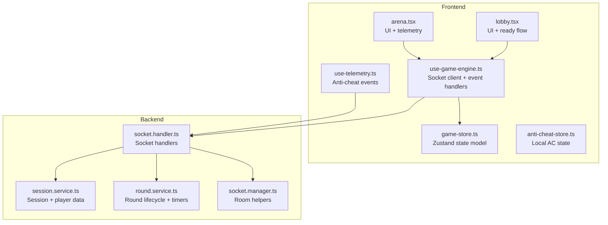
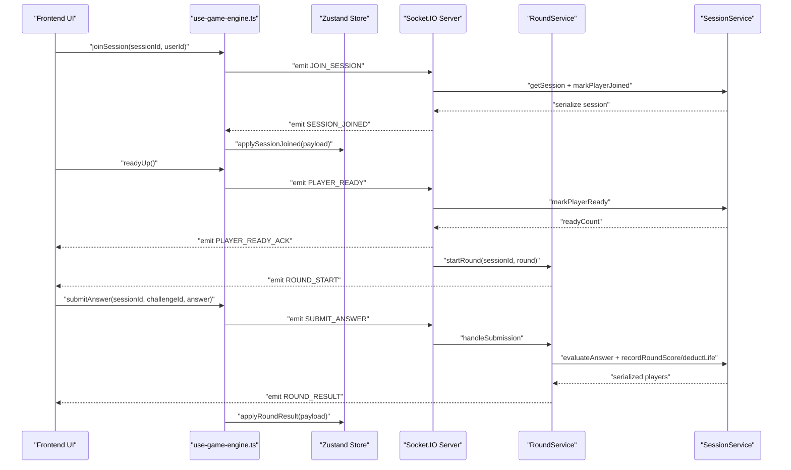
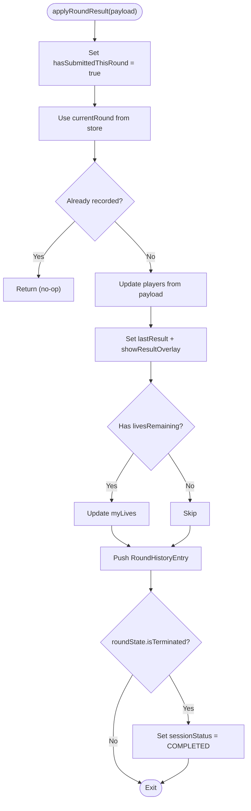
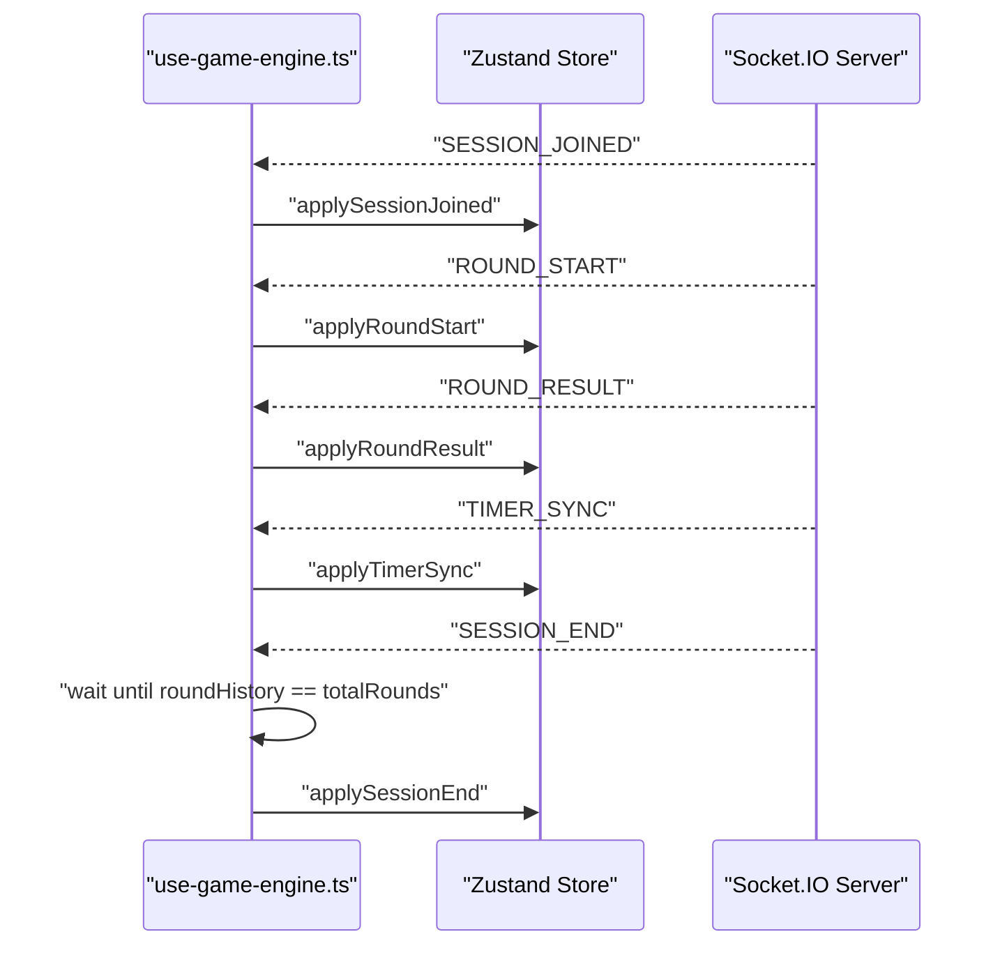
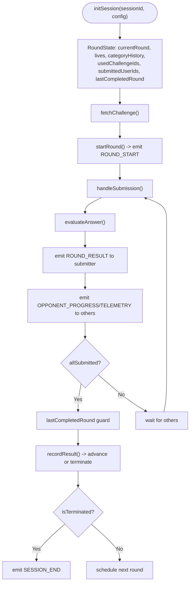
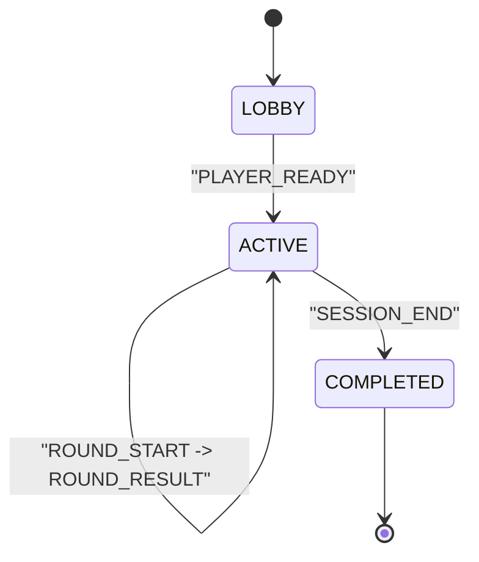
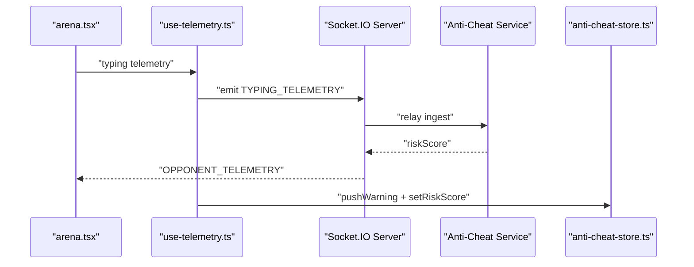
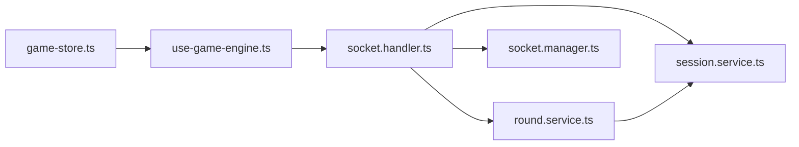

# Real-time State Synchronization

<cite>
**Referenced Files in This Document**
- [use-game-engine.ts](file://apps/web/hooks/use-game-engine.ts)
- [game-store.ts](file://apps/web/store/game-store.ts)
- [socket.handler.ts](file://apps/game-api/src/websocket/socket.handler.ts)
- [socket.manager.ts](file://apps/game-api/src/websocket/socket.manager.ts)
- [session.service.ts](file://apps/game-api/src/services/session.service.ts)
- [round.service.ts](file://apps/game-api/src/services/round.service.ts)
- [arena.tsx](file://apps/web/components/game/arena.tsx)
- [lobby.tsx](file://apps/web/components/game/lobby.tsx)
- [use-telemetry.ts](file://apps/web/hooks/use-telemetry.ts)
- [anti-cheat-store.ts](file://apps/web/store/anti-cheat-store.ts)
</cite>

## Table of Contents
1. [Introduction](#introduction)
2. [Project Structure](#project-structure)
3. [Core Components](#core-components)
4. [Architecture Overview](#architecture-overview)
5. [Detailed Component Analysis](#detailed-component-analysis)
6. [Dependency Analysis](#dependency-analysis)
7. [Performance Considerations](#performance-considerations)
8. [Troubleshooting Guide](#troubleshooting-guide)
9. [Conclusion](#conclusion)
10. [Appendices](#appendices)

## Introduction
This document explains the real-time state synchronization mechanisms used in multiplayer gaming sessions. It covers how game state is modeled, propagated, and reconciled between the frontend Zustand store and the backend WebSocket server. It details event-driven updates, conflict resolution strategies, consistency guarantees, and integration patterns for optimistic updates and rollback. The document also outlines the session lifecycle, race condition protections, out-of-order event handling, partial state recovery, and guidelines for extending synchronized state.

## Project Structure
The real-time synchronization spans three primary layers:
- Frontend React + Zustand store for local state and UI binding
- Frontend Socket.IO integration for bidirectional event streaming
- Backend Socket.IO server and services for authoritative state transitions

**Diagram sources**
- [use-game-engine.ts](file://apps/web/hooks/use-game-engine.ts#L1-L285)
- [game-store.ts](file://apps/web/store/game-store.ts#L1-L394)
- [socket.handler.ts](file://apps/game-api/src/websocket/socket.handler.ts#L62-L310)
- [session.service.ts](file://apps/game-api/src/services/session.service.ts#L18-L166)
- [round.service.ts](file://apps/game-api/src/services/round.service.ts#L179-L857)
- [socket.manager.ts](file://apps/game-api/src/websocket/socket.manager.ts#L3-L56)
- [arena.tsx](file://apps/web/components/game/arena.tsx#L48-L395)
- [lobby.tsx](file://apps/web/components/game/lobby.tsx#L9-L161)
- [use-telemetry.ts](file://apps/web/hooks/use-telemetry.ts#L19-L157)
- [anti-cheat-store.ts](file://apps/web/store/anti-cheat-store.ts#L1-L108)

**Section sources**
- [use-game-engine.ts](file://apps/web/hooks/use-game-engine.ts#L1-L285)
- [game-store.ts](file://apps/web/store/game-store.ts#L1-L394)
- [socket.handler.ts](file://apps/game-api/src/websocket/socket.handler.ts#L62-L310)
- [session.service.ts](file://apps/game-api/src/services/session.service.ts#L18-L166)
- [round.service.ts](file://apps/game-api/src/services/round.service.ts#L179-L857)
- [socket.manager.ts](file://apps/game-api/src/websocket/socket.manager.ts#L3-L56)
- [arena.tsx](file://apps/web/components/game/arena.tsx#L48-L395)
- [lobby.tsx](file://apps/web/components/game/lobby.tsx#L9-L161)
- [use-telemetry.ts](file://apps/web/hooks/use-telemetry.ts#L19-L157)
- [anti-cheat-store.ts](file://apps/web/store/anti-cheat-store.ts#L1-L108)

## Core Components
- Frontend Zustand store: Maintains authoritative client-side session state, including players, scores, lives, round history, timers, and UI flags. Provides pure reducers to apply server events safely.
- Socket client: Singleton Socket.IO client configured with authentication, reconnection, and event routing to store reducers.
- Backend Socket.IO server: Handles identification, session joining, ready gating, round lifecycle, timers, and telemetry relays.
- Services: SessionService persists session metadata and player data; RoundService orchestrates challenges, evaluation, timers, and round progression with guards against races and duplicates.

Key synchronized state properties include:
- Session identity and status
- Players, scores, round scores, lives
- Current and total rounds
- Challenge metadata and time limit
- Round history entries
- Timer sync and remaining time
- Opponent progress and telemetry
- Anti-cheat telemetry and risk metrics

**Section sources**
- [game-store.ts](file://apps/web/store/game-store.ts#L77-L141)
- [use-game-engine.ts](file://apps/web/hooks/use-game-engine.ts#L36-L103)
- [session.service.ts](file://apps/game-api/src/services/session.service.ts#L18-L166)
- [round.service.ts](file://apps/game-api/src/services/round.service.ts#L32-L104)

## Architecture Overview
The system uses event-driven state updates:
- Clients emit commands (e.g., JOIN_SESSION, PLAYER_READY, SUBMIT_ANSWER, TYPING_TELEMETRY).
- Server emits authoritative events (e.g., SESSION_JOINED, ROUND_START, ROUND_RESULT, TIMER_SYNC, OPPONENT_PROGRESS, OPPONENT_TELEMETRY, SESSION_END).
- Frontend reducers apply events immutably, updating UI and derived state.

**Diagram sources**
- [use-game-engine.ts](file://apps/web/hooks/use-game-engine.ts#L113-L131)
- [socket.handler.ts](file://apps/game-api/src/websocket/socket.handler.ts#L111-L157)
- [round.service.ts](file://apps/game-api/src/services/round.service.ts#L722-L857)
- [session.service.ts](file://apps/game-api/src/services/session.service.ts#L128-L166)
- [game-store.ts](file://apps/web/store/game-store.ts#L236-L335)

## Detailed Component Analysis

### Frontend State Model and Reducers
- State shape encapsulates session, players, rounds, timers, and UI flags.
- Reducers apply server events with defensive checks (e.g., deduplication of round results).
- Timer sync updates timeRemaining; round result updates roundHistory and lastResult.

**Diagram sources**
- [game-store.ts](file://apps/web/store/game-store.ts#L286-L335)

**Section sources**
- [game-store.ts](file://apps/web/store/game-store.ts#L77-L141)
- [game-store.ts](file://apps/web/store/game-store.ts#L286-L335)

### Socket Client and Event Routing
- Singleton Socket.IO client with bearer token auth and reconnection.
- Routes server events to store reducers, including lobby, round lifecycle, timer, and anti-cheat events.
- Defers SESSION_END application until all rounds are reflected in roundHistory.

**Diagram sources**
- [use-game-engine.ts](file://apps/web/hooks/use-game-engine.ts#L168-L220)
- [game-store.ts](file://apps/web/store/game-store.ts#L236-L347)

**Section sources**
- [use-game-engine.ts](file://apps/web/hooks/use-game-engine.ts#L36-L103)
- [use-game-engine.ts](file://apps/web/hooks/use-game-engine.ts#L168-L220)
- [game-store.ts](file://apps/web/store/game-store.ts#L236-L347)

### Backend Round Lifecycle and Guards
- RoundService initializes per-session state, selects challenges, evaluates answers, and advances rounds.
- Guards prevent race conditions:
  - lastCompletedRound atomic guard to avoid double-increment when both submissions complete concurrently.
  - submittedUserIds dedup to ignore duplicate submissions.
  - lastCompletedRound guard for timer expiry path.
- Timers emit TIMER_SYNC every second and trigger TIMER_EXPIRED auto-submit for pending players.

**Diagram sources**
- [round.service.ts](file://apps/game-api/src/services/round.service.ts#L179-L857)
- [socket.handler.ts](file://apps/game-api/src/websocket/socket.handler.ts#L272-L289)

**Section sources**
- [round.service.ts](file://apps/game-api/src/services/round.service.ts#L32-L104)
- [round.service.ts](file://apps/game-api/src/services/round.service.ts#L722-L857)
- [socket.handler.ts](file://apps/game-api/src/websocket/socket.handler.ts#L272-L289)

### Conflict Resolution and Consistency Guarantees
- Race-free round advancement:
  - lastCompletedRound guard ensures only one path completes the round per round number.
  - submittedUserIds prevents duplicate processing.
- Out-of-order events:
  - applyRoundResult checks roundHistory for duplicates before recording.
  - SESSION_END waits for roundHistory to reflect all rounds before applying.
- Consistency:
  - SessionService serializes player data on demand to ensure payloads include latest scores/lives.
  - TIMER_SYNC broadcasts serverTimestamp to help clients reconcile drift.

**Section sources**
- [round.service.ts](file://apps/game-api/src/services/round.service.ts#L786-L806)
- [round.service.ts](file://apps/game-api/src/services/round.service.ts#L494-L500)
- [game-store.ts](file://apps/web/store/game-store.ts#L297-L303)
- [use-game-engine.ts](file://apps/web/hooks/use-game-engine.ts#L204-L220)
- [session.service.ts](file://apps/game-api/src/services/session.service.ts#L153-L166)

### Integration Patterns: Optimistic Updates and Rollback
- Optimistic updates:
  - Frontend sets hasSubmittedThisRound immediately upon submit to enable dual-mode waiting overlay.
  - Timer sync updates timeRemaining locally; server’s TIMER_SYNC confirms and adjusts drift.
- Rollback:
  - On TIMER_EXPIRED, server auto-submits pending players and emits ROUND_RESULT with verdict; frontend applies result immutably.
  - If a late event arrives after rollback, the reducer’s duplicate guard prevents re-applying the same round result.

**Section sources**
- [game-store.ts](file://apps/web/store/game-store.ts#L286-L335)
- [round.service.ts](file://apps/game-api/src/services/round.service.ts#L487-L589)

### Session State Lifecycle
- Initialization:
  - JOIN_SESSION creates room membership and emits SESSION_JOINED with config and players.
- Active play:
  - PLAYER_READY gates round start; ROUND_START begins timer and challenge.
  - SUBMIT_ANSWER triggers evaluation and emits ROUND_RESULT; OPPONENT_PROGRESS/TELEMETRY informs opponents.
- Cleanup:
  - SESSION_END emitted when all rounds complete or lives exhausted; store clears timers and resets UI.

**Diagram sources**
- [socket.handler.ts](file://apps/game-api/src/websocket/socket.handler.ts#L162-L202)
- [round.service.ts](file://apps/game-api/src/services/round.service.ts#L451-L467)
- [game-store.ts](file://apps/web/store/game-store.ts#L341-L354)

**Section sources**
- [socket.handler.ts](file://apps/game-api/src/websocket/socket.handler.ts#L111-L157)
- [round.service.ts](file://apps/game-api/src/services/round.service.ts#L451-L467)
- [game-store.ts](file://apps/web/store/game-store.ts#L341-L354)

### Anti-Cheat Telemetry and Risk Scoring
- Frontend emits telemetry events (focus loss, paste detection, keystroke bursts, mouse inactivity) via Socket.IO.
- Backend relays events to anti-cheat ingestion endpoint and updates local risk metrics in Zustand store.
- Risk level computed from cumulative counts and last event timestamp.

**Diagram sources**
- [use-telemetry.ts](file://apps/web/hooks/use-telemetry.ts#L35-L54)
- [socket.handler.ts](file://apps/game-api/src/websocket/socket.handler.ts#L204-L240)
- [anti-cheat-store.ts](file://apps/web/store/anti-cheat-store.ts#L51-L108)

**Section sources**
- [use-telemetry.ts](file://apps/web/hooks/use-telemetry.ts#L19-L157)
- [socket.handler.ts](file://apps/game-api/src/websocket/socket.handler.ts#L19-L60)
- [anti-cheat-store.ts](file://apps/web/store/anti-cheat-store.ts#L20-L108)

## Dependency Analysis
- Frontend depends on:
  - Zustand store for state, reducers, and selectors
  - Socket.IO client for transport and auth
  - UI components for rendering and emitting events
- Backend depends on:
  - Socket.IO server for connection and rooms
  - Redis-backed SessionService for persistence
  - RoundService for orchestration and guards
  - SocketManager for room membership helpers

**Diagram sources**
- [game-store.ts](file://apps/web/store/game-store.ts#L221-L394)
- [use-game-engine.ts](file://apps/web/hooks/use-game-engine.ts#L105-L285)
- [socket.handler.ts](file://apps/game-api/src/websocket/socket.handler.ts#L62-L310)
- [round.service.ts](file://apps/game-api/src/services/round.service.ts#L179-L857)
- [session.service.ts](file://apps/game-api/src/services/session.service.ts#L18-L166)
- [socket.manager.ts](file://apps/game-api/src/websocket/socket.manager.ts#L3-L56)

**Section sources**
- [game-store.ts](file://apps/web/store/game-store.ts#L221-L394)
- [use-game-engine.ts](file://apps/web/hooks/use-game-engine.ts#L105-L285)
- [socket.handler.ts](file://apps/game-api/src/websocket/socket.handler.ts#L62-L310)
- [round.service.ts](file://apps/game-api/src/services/round.service.ts#L179-L857)
- [session.service.ts](file://apps/game-api/src/services/session.service.ts#L18-L166)
- [socket.manager.ts](file://apps/game-api/src/websocket/socket.manager.ts#L3-L56)

## Performance Considerations
- Update frequency:
  - TIMER_SYNC emits every 1000ms; consider throttling UI renders if needed.
  - Typing telemetry intervals configurable; adjust to balance responsiveness and bandwidth.
- Bandwidth:
  - OPPONENT_TELEMETRY and OPPONENT_PROGRESS are per-opponent; minimize payload size.
- Persistence:
  - SessionService serializes player data on demand; cache where appropriate to reduce Redis queries.
- Reconnection:
  - Socket client reconnects with jitter; ensure store state remains consistent across disconnects.

[No sources needed since this section provides general guidance]

## Troubleshooting Guide
- Symptoms: Round skips or duplicate results
  - Cause: Race condition in dual-player submissions
  - Fix: lastCompletedRound guard and submittedUserIds dedup ensure single completion per round
- Symptoms: SESSION_END applied before all rounds
  - Cause: Late round results
  - Fix: Frontend waits for roundHistory length to match totalRounds before applying SESSION_END
- Symptoms: Timer drift or incorrect countdown
  - Cause: Client-server clock differences
  - Fix: Use serverTimestamp from TIMER_SYNC to reconcile local timer
- Symptoms: Opponent telemetry not updating
  - Cause: Missing or delayed TYPING_TELEMETRY
  - Fix: Verify arena emits telemetry periodically and socket is connected

**Section sources**
- [round.service.ts](file://apps/game-api/src/services/round.service.ts#L786-L806)
- [use-game-engine.ts](file://apps/web/hooks/use-game-engine.ts#L204-L220)
- [round.service.ts](file://apps/game-api/src/services/round.service.ts#L469-L485)
- [arena.tsx](file://apps/web/components/game/arena.tsx#L80-L95)

## Conclusion
The system achieves strong consistency through authoritative server events, robust guards against races and duplicates, and careful client-side reconciliation. The frontend Zustand store provides a predictable, immutable model for UI updates, while the backend orchestrates round lifecycle, timers, and evaluation with explicit safeguards. Anti-cheat telemetry integrates seamlessly via Socket.IO, enabling real-time risk monitoring.

[No sources needed since this section summarizes without analyzing specific files]

## Appendices

### Adding New Synchronized State Properties
- Define payload interfaces and store reducers for new events.
- Update reducers to handle new fields and maintain immutability.
- Ensure backend emits the corresponding event with the minimal required payload.
- Add guards if the property participates in race-sensitive logic.

Implementation guidelines:
- Keep payloads small and focused.
- Apply optimistic updates only when safe; always reconcile with server events.
- Use guards (e.g., lastCompletedRound, submittedUserIds) for concurrency-sensitive fields.
- Test edge cases: out-of-order events, partial state recovery, and rollback scenarios.

**Section sources**
- [game-store.ts](file://apps/web/store/game-store.ts#L143-L189)
- [socket.handler.ts](file://apps/game-api/src/websocket/socket.handler.ts#L111-L157)
- [round.service.ts](file://apps/game-api/src/services/round.service.ts#L786-L806)