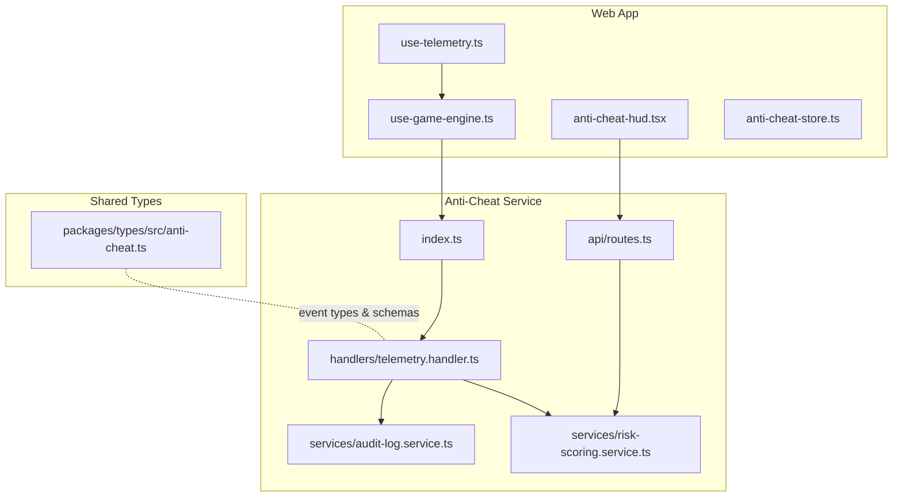
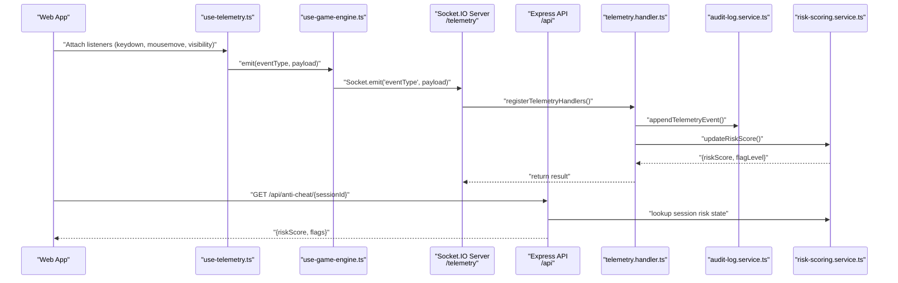
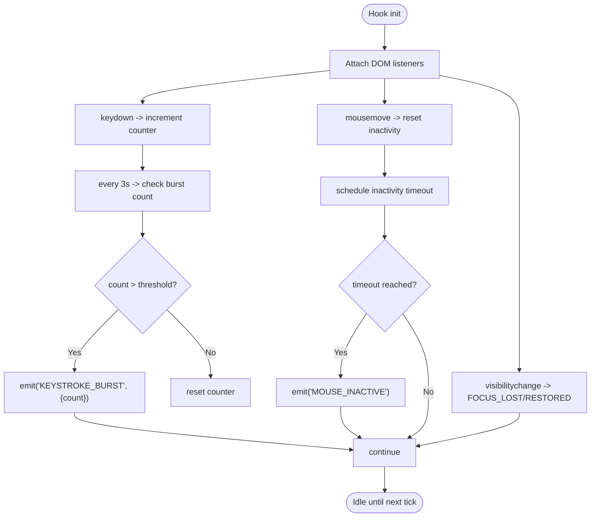
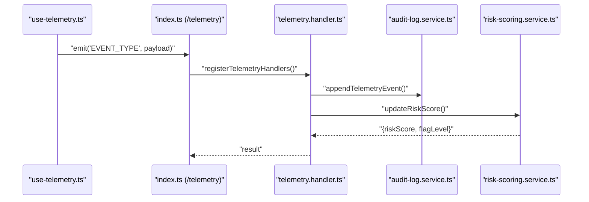
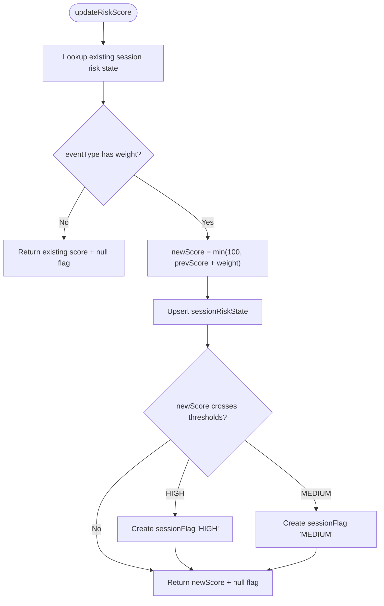
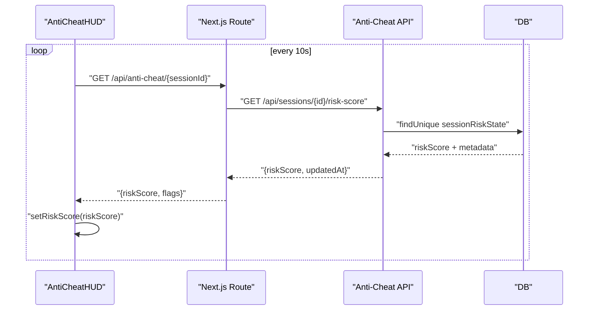
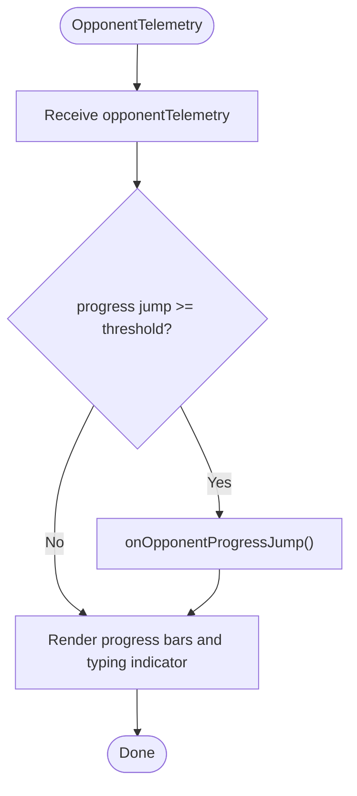
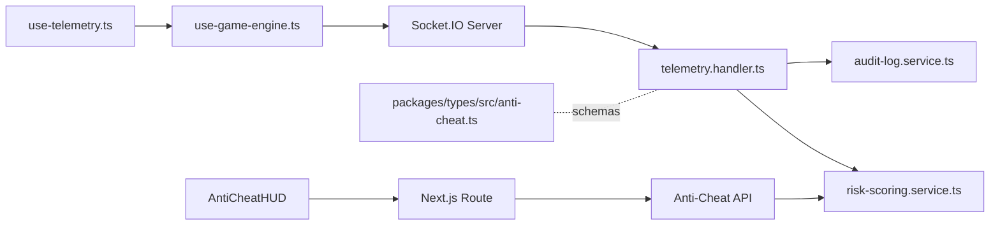

# Telemetry Data Streaming & Processing

<cite>
**Referenced Files in This Document**
- [apps/anti-cheat/src/index.ts](file://apps/anti-cheat/src/index.ts)
- [apps/anti-cheat/src/api/routes.ts](file://apps/anti-cheat/src/api/routes.ts)
- [apps/anti-cheat/src/handlers/telemetry.handler.ts](file://apps/anti-cheat/src/handlers/telemetry.handler.ts)
- [apps/anti-cheat/src/services/audit-log.service.ts](file://apps/anti-cheat/src/services/audit-log.service.ts)
- [apps/anti-cheat/src/services/risk-scoring.service.ts](file://apps/anti-cheat/src/services/risk-scoring.service.ts)
- [apps/web/hooks/use-telemetry.ts](file://apps/web/hooks/use-telemetry.ts)
- [apps/web/hooks/use-game-engine.ts](file://apps/web/hooks/use-game-engine.ts)
- [apps/web/components/game/anti-cheat-hud.tsx](file://apps/web/components/game/anti-cheat-hud.tsx)
- [apps/web/components/game/opponent-telemetry.tsx](file://apps/web/components/game/opponent-telemetry.tsx)
- [apps/web/app/api/anti-cheat/[sessionId]/route.ts](file://apps/web/app/api/anti-cheat/[sessionId]/route.ts)
- [apps/web/store/anti-cheat-store.ts](file://apps/web/store/anti-cheat-store.ts)
- [.env.example](file://.env.example)
- [packages/types/src/anti-cheat.ts](file://packages/types/src/anti-cheat.ts)
</cite>

## Table of Contents
1. [Introduction](#introduction)
2. [Project Structure](#project-structure)
3. [Core Components](#core-components)
4. [Architecture Overview](#architecture-overview)
5. [Detailed Component Analysis](#detailed-component-analysis)
6. [Dependency Analysis](#dependency-analysis)
7. [Performance Considerations](#performance-considerations)
8. [Troubleshooting Guide](#troubleshooting-guide)
9. [Conclusion](#conclusion)
10. [Appendices](#appendices)

## Introduction
This document explains the telemetry data streaming and processing systems used for anti-cheat monitoring. It covers client-side telemetry hooks that capture keystroke dynamics, mouse activity, and behavioral patterns; the ingestion and processing pipeline in the anti-cheat service; risk scoring and flagging; and the front-end HUD that surfaces warnings and risk levels. It also outlines payload formats, timestamps, correlation with game events, examples of anomaly detection patterns, risk scoring integration, privacy and consent considerations, and practical debugging and optimization techniques.

## Project Structure
The telemetry system spans three primary areas:
- Frontend (web app) with telemetry hooks and HUD
- Anti-cheat service (Express + Socket.IO) for ingestion and scoring
- Shared types for telemetry event modeling

**Diagram sources**
- [apps/web/hooks/use-telemetry.ts](file://apps/web/hooks/use-telemetry.ts#L1-L157)
- [apps/web/hooks/use-game-engine.ts](file://apps/web/hooks/use-game-engine.ts#L310-L333)
- [apps/anti-cheat/src/index.ts](file://apps/anti-cheat/src/index.ts#L24-L29)
- [apps/anti-cheat/src/api/routes.ts](file://apps/anti-cheat/src/api/routes.ts#L13-L30)
- [apps/anti-cheat/src/handlers/telemetry.handler.ts](file://apps/anti-cheat/src/handlers/telemetry.handler.ts#L30-L51)
- [apps/anti-cheat/src/services/audit-log.service.ts](file://apps/anti-cheat/src/services/audit-log.service.ts#L4-L18)
- [apps/anti-cheat/src/services/risk-scoring.service.ts](file://apps/anti-cheat/src/services/risk-scoring.service.ts#L18-L75)
- [apps/web/components/game/anti-cheat-hud.tsx](file://apps/web/components/game/anti-cheat-hud.tsx#L37-L57)
- [apps/web/app/api/anti-cheat/[sessionId]/route.ts](file://apps/web/app/api/anti-cheat/[sessionId]/route.ts#L1-L38)
- [packages/types/src/anti-cheat.ts](file://packages/types/src/anti-cheat.ts#L1-L85)

**Section sources**
- [apps/anti-cheat/src/index.ts](file://apps/anti-cheat/src/index.ts#L1-L35)
- [apps/anti-cheat/src/api/routes.ts](file://apps/anti-cheat/src/api/routes.ts#L1-L85)
- [apps/web/hooks/use-telemetry.ts](file://apps/web/hooks/use-telemetry.ts#L1-L157)
- [apps/web/hooks/use-game-engine.ts](file://apps/web/hooks/use-game-engine.ts#L310-L333)
- [apps/web/components/game/anti-cheat-hud.tsx](file://apps/web/components/game/anti-cheat-hud.tsx#L1-L129)
- [apps/web/app/api/anti-cheat/[sessionId]/route.ts](file://apps/web/app/api/anti-cheat/[sessionId]/route.ts#L1-L38)
- [packages/types/src/anti-cheat.ts](file://packages/types/src/anti-cheat.ts#L1-L85)

## Core Components
- Client-side telemetry hooks:
  - Keystroke burst detection with sliding window
  - Mouse/activity inactivity timeouts
  - Focus loss/restored events
  - Paste/copy blocking and detection
  - Emit events via Socket.IO to the anti-cheat namespace
- Anti-cheat ingestion:
  - Socket.IO namespace for telemetry
  - Express API for direct ingestion and risk queries
  - Validation of event types and payloads
- Processing pipeline:
  - Audit logging append-only
  - Risk scoring with weights and thresholds
  - Flag creation on threshold crossings
- Front-end HUD:
  - Polls risk score endpoint
  - Displays warnings and risk level badges
  - Tracks event counts and auto-dismisses warnings

**Section sources**
- [apps/web/hooks/use-telemetry.ts](file://apps/web/hooks/use-telemetry.ts#L8-L17)
- [apps/web/hooks/use-telemetry.ts](file://apps/web/hooks/use-telemetry.ts#L35-L54)
- [apps/web/hooks/use-telemetry.ts](file://apps/web/hooks/use-telemetry.ts#L56-L155)
- [apps/anti-cheat/src/index.ts](file://apps/anti-cheat/src/index.ts#L24-L29)
- [apps/anti-cheat/src/api/routes.ts](file://apps/anti-cheat/src/api/routes.ts#L44-L82)
- [apps/anti-cheat/src/handlers/telemetry.handler.ts](file://apps/anti-cheat/src/handlers/telemetry.handler.ts#L30-L51)
- [apps/anti-cheat/src/services/audit-log.service.ts](file://apps/anti-cheat/src/services/audit-log.service.ts#L4-L18)
- [apps/anti-cheat/src/services/risk-scoring.service.ts](file://apps/anti-cheat/src/services/risk-scoring.service.ts#L3-L14)
- [apps/web/components/game/anti-cheat-hud.tsx](file://apps/web/components/game/anti-cheat-hud.tsx#L37-L57)
- [apps/web/store/anti-cheat-store.ts](file://apps/web/store/anti-cheat-store.ts#L20-L47)

## Architecture Overview
The telemetry architecture integrates client-side event capture, real-time streaming, and server-side processing with periodic polling for risk updates.

**Diagram sources**
- [apps/web/hooks/use-telemetry.ts](file://apps/web/hooks/use-telemetry.ts#L35-L54)
- [apps/web/hooks/use-game-engine.ts](file://apps/web/hooks/use-game-engine.ts#L310-L333)
- [apps/anti-cheat/src/index.ts](file://apps/anti-cheat/src/index.ts#L24-L29)
- [apps/anti-cheat/src/handlers/telemetry.handler.ts](file://apps/anti-cheat/src/handlers/telemetry.handler.ts#L54-L81)
- [apps/anti-cheat/src/services/audit-log.service.ts](file://apps/anti-cheat/src/services/audit-log.service.ts#L4-L18)
- [apps/anti-cheat/src/services/risk-scoring.service.ts](file://apps/anti-cheat/src/services/risk-scoring.service.ts#L18-L75)
- [apps/web/app/api/anti-cheat/[sessionId]/route.ts](file://apps/web/app/api/anti-cheat/[sessionId]/route.ts#L16-L33)

## Detailed Component Analysis

### Client-Side Telemetry Hooks
- Sliding window for keystroke bursts with configurable threshold and window size
- Inactivity detection for mouse movement and keyboard input
- Visibility change events for focus loss/restore
- Paste/copy interception and prevention
- Emit telemetry events with standardized payload fields including sessionId, candidateId, eventType, timestamp, and optional payload

**Diagram sources**
- [apps/web/hooks/use-telemetry.ts](file://apps/web/hooks/use-telemetry.ts#L8-L17)
- [apps/web/hooks/use-telemetry.ts](file://apps/web/hooks/use-telemetry.ts#L93-L130)
- [apps/web/hooks/use-telemetry.ts](file://apps/web/hooks/use-telemetry.ts#L132-L140)

**Section sources**
- [apps/web/hooks/use-telemetry.ts](file://apps/web/hooks/use-telemetry.ts#L8-L17)
- [apps/web/hooks/use-telemetry.ts](file://apps/web/hooks/use-telemetry.ts#L35-L54)
- [apps/web/hooks/use-telemetry.ts](file://apps/web/hooks/use-telemetry.ts#L56-L155)

### Anti-Cheat Service: Ingestion and Handlers
- Socket.IO namespace "/telemetry" accepts JOIN_TELEMETRY and registers handlers for telemetry event types
- Handlers validate event types and normalize payload fields (sessionId, candidateId, timestamp)
- Events are appended to audit logs and risk scoring is updated

**Diagram sources**
- [apps/anti-cheat/src/index.ts](file://apps/anti-cheat/src/index.ts#L24-L29)
- [apps/anti-cheat/src/handlers/telemetry.handler.ts](file://apps/anti-cheat/src/handlers/telemetry.handler.ts#L54-L81)
- [apps/anti-cheat/src/services/audit-log.service.ts](file://apps/anti-cheat/src/services/audit-log.service.ts#L4-L18)
- [apps/anti-cheat/src/services/risk-scoring.service.ts](file://apps/anti-cheat/src/services/risk-scoring.service.ts#L18-L75)

**Section sources**
- [apps/anti-cheat/src/index.ts](file://apps/anti-cheat/src/index.ts#L24-L29)
- [apps/anti-cheat/src/handlers/telemetry.handler.ts](file://apps/anti-cheat/src/handlers/telemetry.handler.ts#L30-L51)
- [apps/anti-cheat/src/handlers/telemetry.handler.ts](file://apps/anti-cheat/src/handlers/telemetry.handler.ts#L54-L81)

### Risk Scoring and Flagging
- Weighted scoring model with thresholds for MEDIUM and HIGH flag levels
- Upsert of session risk state and creation of flags when thresholds are crossed
- Non-weighted events return existing score without changes

**Diagram sources**
- [apps/anti-cheat/src/services/risk-scoring.service.ts](file://apps/anti-cheat/src/services/risk-scoring.service.ts#L3-L14)
- [apps/anti-cheat/src/services/risk-scoring.service.ts](file://apps/anti-cheat/src/services/risk-scoring.service.ts#L18-L75)

**Section sources**
- [apps/anti-cheat/src/services/risk-scoring.service.ts](file://apps/anti-cheat/src/services/risk-scoring.service.ts#L3-L14)
- [apps/anti-cheat/src/services/risk-scoring.service.ts](file://apps/anti-cheat/src/services/risk-scoring.service.ts#L18-L75)

### Front-End HUD and Polling
- AntiCheat HUD polls the anti-cheat API endpoint every 10 seconds for risk score updates
- Displays risk level badge and warning notifications with icons mapped per event type
- Maintains event counts and auto-dismisses warnings after a delay

**Diagram sources**
- [apps/web/components/game/anti-cheat-hud.tsx](file://apps/web/components/game/anti-cheat-hud.tsx#L37-L57)
- [apps/web/app/api/anti-cheat/[sessionId]/route.ts](file://apps/web/app/api/anti-cheat/[sessionId]/route.ts#L16-L33)
- [apps/anti-cheat/src/api/routes.ts](file://apps/anti-cheat/src/api/routes.ts#L13-L30)

**Section sources**
- [apps/web/components/game/anti-cheat-hud.tsx](file://apps/web/components/game/anti-cheat-hud.tsx#L37-L57)
- [apps/web/app/api/anti-cheat/[sessionId]/route.ts](file://apps/web/app/api/anti-cheat/[sessionId]/route.ts#L1-L38)
- [apps/web/store/anti-cheat-store.ts](file://apps/web/store/anti-cheat-store.ts#L20-L47)

### Opponent Telemetry Visualization
- Consumes opponent telemetry events to visualize progress and typing indicators
- Triggers SFX callbacks on significant progress jumps

**Diagram sources**
- [apps/web/components/game/opponent-telemetry.tsx](file://apps/web/components/game/opponent-telemetry.tsx#L16-L34)
- [apps/web/components/game/opponent-telemetry.tsx](file://apps/web/components/game/opponent-telemetry.tsx#L36-L95)

**Section sources**
- [apps/web/components/game/opponent-telemetry.tsx](file://apps/web/components/game/opponent-telemetry.tsx#L1-L99)

## Dependency Analysis
- Client depends on Socket.IO connection established via the game engine and emits telemetry events
- Anti-cheat service depends on database-backed persistence for session risk state and flags
- Web API acts as a proxy to the anti-cheat service for risk score and flags retrieval
- Shared types define event enumerations and schemas for telemetry modeling

**Diagram sources**
- [apps/web/hooks/use-telemetry.ts](file://apps/web/hooks/use-telemetry.ts#L35-L54)
- [apps/web/hooks/use-game-engine.ts](file://apps/web/hooks/use-game-engine.ts#L36-L53)
- [apps/anti-cheat/src/index.ts](file://apps/anti-cheat/src/index.ts#L24-L29)
- [apps/anti-cheat/src/handlers/telemetry.handler.ts](file://apps/anti-cheat/src/handlers/telemetry.handler.ts#L30-L51)
- [apps/anti-cheat/src/services/audit-log.service.ts](file://apps/anti-cheat/src/services/audit-log.service.ts#L4-L18)
- [apps/anti-cheat/src/services/risk-scoring.service.ts](file://apps/anti-cheat/src/services/risk-scoring.service.ts#L18-L75)
- [apps/web/components/game/anti-cheat-hud.tsx](file://apps/web/components/game/anti-cheat-hud.tsx#L37-L57)
- [apps/web/app/api/anti-cheat/[sessionId]/route.ts](file://apps/web/app/api/anti-cheat/[sessionId]/route.ts#L16-L33)
- [packages/types/src/anti-cheat.ts](file://packages/types/src/anti-cheat.ts#L1-L85)

**Section sources**
- [apps/anti-cheat/src/index.ts](file://apps/anti-cheat/src/index.ts#L1-L35)
- [apps/anti-cheat/src/api/routes.ts](file://apps/anti-cheat/src/api/routes.ts#L1-L85)
- [apps/web/hooks/use-game-engine.ts](file://apps/web/hooks/use-game-engine.ts#L36-L53)
- [apps/web/app/api/anti-cheat/[sessionId]/route.ts](file://apps/web/app/api/anti-cheat/[sessionId]/route.ts#L1-L38)
- [packages/types/src/anti-cheat.ts](file://packages/types/src/anti-cheat.ts#L1-L85)

## Performance Considerations
- Client-side throttling:
  - Keystroke burst detection uses a fixed window and threshold to avoid excessive events
  - Mouse inactivity timeout prevents continuous low-frequency events
- Server-side batching:
  - Consider aggregating multiple telemetry events into batches to reduce network overhead and database writes
- Database writes:
  - Audit logs are append-only; ensure indexing on sessionId and createdAt for efficient lookups
- Network transport:
  - Prefer WebSocket transport for real-time telemetry and polling for risk score updates
- Rate limiting:
  - Apply rate limits on the API ingestion endpoint to prevent abuse and mitigate resource exhaustion

[No sources needed since this section provides general guidance]

## Troubleshooting Guide
- Socket not connected:
  - The client warns and skips emitting when the socket is not connected
- Missing identifiers:
  - Ensure sessionId and candidateId are present before emitting telemetry events
- API errors:
  - The web route falls back to safe defaults if the anti-cheat service is unavailable
- Risk score polling:
  - Verify the polling interval and endpoint availability; adjust intervals if needed

**Section sources**
- [apps/web/hooks/use-telemetry.ts](file://apps/web/hooks/use-telemetry.ts#L39-L42)
- [apps/web/app/api/anti-cheat/[sessionId]/route.ts](file://apps/web/app/api/anti-cheat/[sessionId]/route.ts#L34-L36)

## Conclusion
The telemetry system combines client-side behavioral monitoring with a robust server-side ingestion and scoring pipeline. It provides real-time feedback via the HUD and supports periodic risk score retrieval through the web API. The modular design allows for incremental improvements, such as batch ingestion, advanced anomaly detection, and enhanced privacy controls.

[No sources needed since this section summarizes without analyzing specific files]

## Appendices

### Telemetry Payload Formats and Timestamp Handling
- Client emits standardized fields: sessionId, candidateId, eventType, timestamp (ISO 8601), optional payload
- Server normalizes timestamp if not provided and validates event types against a strict whitelist

**Section sources**
- [apps/web/hooks/use-telemetry.ts](file://apps/web/hooks/use-telemetry.ts#L44-L51)
- [apps/anti-cheat/src/handlers/telemetry.handler.ts](file://apps/anti-cheat/src/handlers/telemetry.handler.ts#L22-L28)
- [apps/anti-cheat/src/handlers/telemetry.handler.ts](file://apps/anti-cheat/src/handlers/telemetry.handler.ts#L58-L72)

### Frequency Limitations and Bandwidth Optimization Strategies
- Client-side:
  - Fixed window for keystroke burst detection
  - Inactivity timeouts to suppress idle events
- Server-side:
  - Whitelisted event types reduce noise
  - Append-only audit logs minimize write contention
  - Consider batching telemetry events and compressing payloads

**Section sources**
- [apps/web/hooks/use-telemetry.ts](file://apps/web/hooks/use-telemetry.ts#L8-L17)
- [apps/web/hooks/use-telemetry.ts](file://apps/web/hooks/use-telemetry.ts#L93-L130)
- [apps/anti-cheat/src/handlers/telemetry.handler.ts](file://apps/anti-cheat/src/handlers/telemetry.handler.ts#L4-L12)

### Anti-Cheat Telemetry Handler Implementation
- Registration of handlers for telemetry event types
- Validation of event types and payload normalization
- Processing pipeline: audit log append and risk score update

**Section sources**
- [apps/anti-cheat/src/handlers/telemetry.handler.ts](file://apps/anti-cheat/src/handlers/telemetry.handler.ts#L54-L81)
- [apps/anti-cheat/src/services/audit-log.service.ts](file://apps/anti-cheat/src/services/audit-log.service.ts#L4-L18)
- [apps/anti-cheat/src/services/risk-scoring.service.ts](file://apps/anti-cheat/src/services/risk-scoring.service.ts#L18-L75)

### Data Privacy, Consent, and Compliance
- Consent management:
  - Require explicit consent before enabling telemetry
  - Provide granular opt-out mechanisms
- Data minimization:
  - Only collect necessary behavioral signals
  - Avoid capturing sensitive content (e.g., paste payloads)
- Storage and retention:
  - Append-only audit logs with defined retention policies
  - Secure deletion pathways for user requests
- Transparency:
  - Publish privacy policy detailing telemetry usage
  - Offer users access to their telemetry data

[No sources needed since this section provides general guidance]

### Examples of Telemetry Data Analysis and Risk Scoring Integration
- Anomaly detection patterns:
  - Unusually high keystroke burst counts within short windows
  - Extended mouse inactivity indicating potential automation
  - Frequent focus loss events correlating with tab switching
- Risk scoring integration:
  - Weighted aggregation of flagged events
  - Threshold-based flagging (MEDIUM/HIGH)
  - Correlation with game events (e.g., submission timing)

**Section sources**
- [apps/web/hooks/use-telemetry.ts](file://apps/web/hooks/use-telemetry.ts#L12-L17)
- [apps/anti-cheat/src/services/risk-scoring.service.ts](file://apps/anti-cheat/src/services/risk-scoring.service.ts#L3-L14)
- [apps/anti-cheat/src/services/risk-scoring.service.ts](file://apps/anti-cheat/src/services/risk-scoring.service.ts#L55-L72)

### Debugging Techniques
- Enable verbose logging in the anti-cheat service and web app
- Inspect Socket.IO connections and namespaces
- Validate event types and payloads at the API boundary
- Monitor database writes for audit logs and flags
- Use browser devtools to observe telemetry emissions and HUD updates

**Section sources**
- [apps/anti-cheat/src/index.ts](file://apps/anti-cheat/src/index.ts#L10-L10)
- [apps/anti-cheat/src/api/routes.ts](file://apps/anti-cheat/src/api/routes.ts#L66-L73)
- [apps/web/components/game/anti-cheat-hud.tsx](file://apps/web/components/game/anti-cheat-hud.tsx#L37-L57)