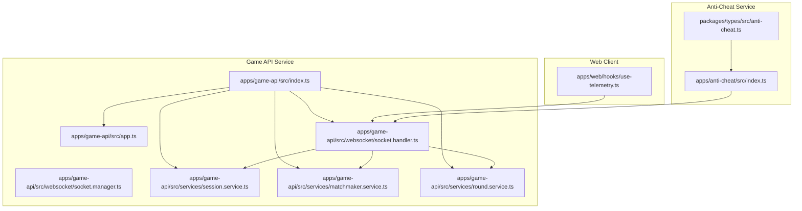
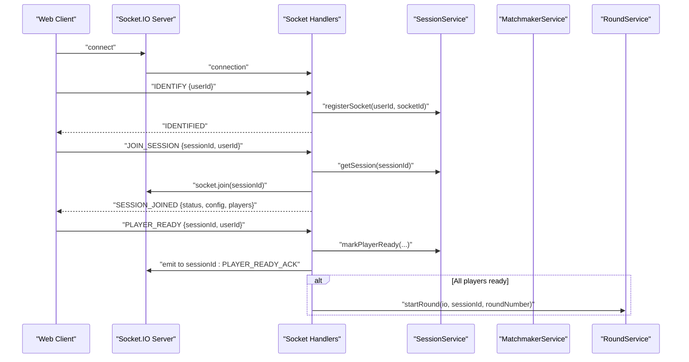
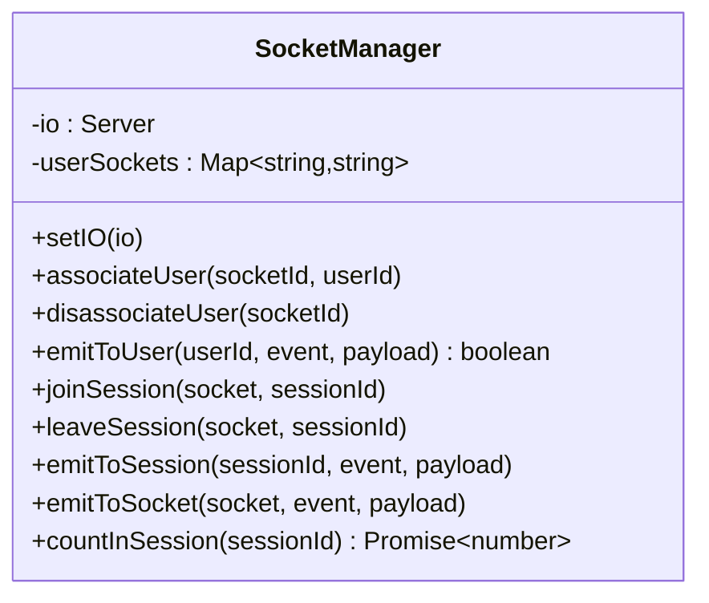
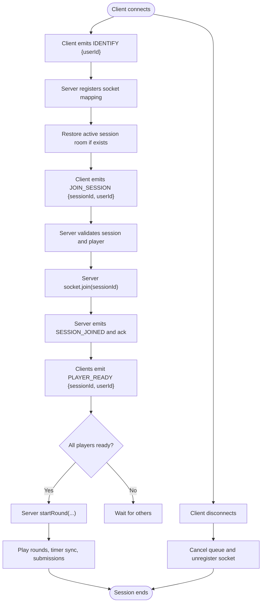
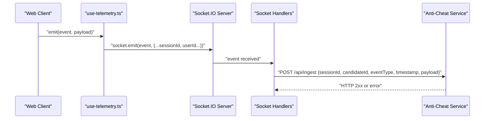
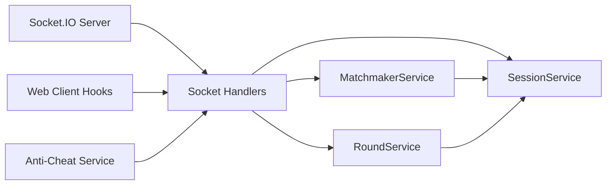

# WebSocket Architecture & Socket.IO Implementation

<cite>
**Referenced Files in This Document**
- [index.ts](file://apps/game-api/src/index.ts)
- [app.ts](file://apps/game-api/src/app.ts)
- [socket.handler.ts](file://apps/game-api/src/websocket/socket.handler.ts)
- [socket.manager.ts](file://apps/game-api/src/websocket/socket.manager.ts)
- [session.service.ts](file://apps/game-api/src/services/session.service.ts)
- [matchmaker.service.ts](file://apps/game-api/src/services/matchmaker.service.ts)
- [round.service.ts](file://apps/game-api/src/services/round.service.ts)
- [use-telemetry.ts](file://apps/web/hooks/use-telemetry.ts)
- [anti-cheat index.ts](file://apps/anti-cheat/src/index.ts)
- [types anti-cheat.ts](file://packages/types/src/anti-cheat.ts)
</cite>

## Table of Contents
1. [Introduction](#introduction)
2. [Project Structure](#project-structure)
3. [Core Components](#core-components)
4. [Architecture Overview](#architecture-overview)
5. [Detailed Component Analysis](#detailed-component-analysis)
6. [Dependency Analysis](#dependency-analysis)
7. [Performance Considerations](#performance-considerations)
8. [Troubleshooting Guide](#troubleshooting-guide)
9. [Conclusion](#conclusion)
10. [Appendices](#appendices)

## Introduction
This document describes the WebSocket architecture and Socket.IO implementation in Logic Forge’s Game API service. It focuses on the SocketManager design, user association mapping, room management, and event broadcasting mechanisms. It also explains the connection lifecycle from client initialization to session establishment, Socket.IO configuration and middleware integration, and connection handling patterns. Examples cover room-based communication, user-to-user messaging, and broadcast scenarios. The document details socket event types, payload structures, error handling strategies, and operational concerns such as scaling, load balancing, graceful disconnect handling, and extension guidelines for integrating with existing game logic.

## Project Structure
The WebSocket subsystem resides in the Game API service and integrates with session, matchmaker, and round services. The entrypoint initializes the HTTP server and Socket.IO server, wires up handlers, and exposes singleton services to Express routes.

**Diagram sources**
- [index.ts](file://apps/game-api/src/index.ts#L1-L45)
- [app.ts](file://apps/game-api/src/app.ts#L1-L63)
- [socket.handler.ts](file://apps/game-api/src/websocket/socket.handler.ts#L62-L309)
- [socket.manager.ts](file://apps/game-api/src/websocket/socket.manager.ts#L1-L56)
- [session.service.ts](file://apps/game-api/src/services/session.service.ts#L1-L167)
- [matchmaker.service.ts](file://apps/game-api/src/services/matchmaker.service.ts#L1-L206)
- [round.service.ts](file://apps/game-api/src/services/round.service.ts#L1-L1006)
- [use-telemetry.ts](file://apps/web/hooks/use-telemetry.ts#L31-L70)
- [anti-cheat index.ts](file://apps/anti-cheat/src/index.ts#L1-L34)
- [types anti-cheat.ts](file://packages/types/src/anti-cheat.ts#L1-L24)

**Section sources**
- [index.ts](file://apps/game-api/src/index.ts#L1-L45)
- [app.ts](file://apps/game-api/src/app.ts#L1-L63)

## Core Components
- Socket.IO server initialization and configuration
- Socket event handlers for identification, session joining, readiness, submissions, telemetry relays, and disconnects
- Session service for Redis-backed session state, user-to-socket mapping, and player metadata
- Matchmaker service for dual-mode waiting room and session creation
- Round service for round lifecycle, timer synchronization, evaluation, and outcomes
- Optional SocketManager utility for user-centric emits and room helpers

Key responsibilities:
- Connection lifecycle: connect → identify → join session → ready → play rounds → end session
- Room-based communication: per-session rooms for broadcasts and targeted emits
- Anti-cheat telemetry relay to external service
- Graceful disconnect handling and cleanup

**Section sources**
- [socket.handler.ts](file://apps/game-api/src/websocket/socket.handler.ts#L62-L309)
- [session.service.ts](file://apps/game-api/src/services/session.service.ts#L18-L167)
- [matchmaker.service.ts](file://apps/game-api/src/services/matchmaker.service.ts#L41-L206)
- [round.service.ts](file://apps/game-api/src/services/round.service.ts#L179-L1006)
- [socket.manager.ts](file://apps/game-api/src/websocket/socket.manager.ts#L3-L55)

## Architecture Overview
The Game API initializes an HTTP server and a Socket.IO server. Handlers listen for client events and coordinate with services to manage sessions, matchmaking, and rounds. Anti-cheat telemetry is optionally relayed to the anti-cheat service.

**Diagram sources**
- [index.ts](file://apps/game-api/src/index.ts#L18-L27)
- [socket.handler.ts](file://apps/game-api/src/websocket/socket.handler.ts#L71-L202)
- [session.service.ts](file://apps/game-api/src/services/session.service.ts#L62-L111)
- [round.service.ts](file://apps/game-api/src/services/round.service.ts#L451-L467)

## Detailed Component Analysis

### Socket.IO Initialization and Configuration
- HTTP server created via Node’s http module
- Socket.IO server configured with CORS and transport modes
- Singleton services instantiated and injected into handlers
- Express app extended with matchmaker service for route integration

Operational notes:
- CORS origin is configurable via environment variable
- Transports include WebSocket and polling for broad compatibility
- Graceful shutdown closes Socket.IO and HTTP servers

**Section sources**
- [index.ts](file://apps/game-api/src/index.ts#L15-L44)
- [app.ts](file://apps/game-api/src/app.ts#L14-L22)

### SocketManager Class Design
SocketManager encapsulates user-to-socket mapping and room helpers. It supports:
- User association mapping: userId → socketId
- Disassociation by socketId
- Emit to user by userId
- Join/leave session rooms
- Emit to session room
- Emit to a single socket
- Count sockets in a session

Design characteristics:
- Lightweight wrapper around Socket.IO Server and Socket
- Maintains an in-memory Map for user-to-socket lookup
- Provides convenience methods for common emit patterns

**Diagram sources**
- [socket.manager.ts](file://apps/game-api/src/websocket/socket.manager.ts#L3-L55)

**Section sources**
- [socket.manager.ts](file://apps/game-api/src/websocket/socket.manager.ts#L3-L55)

### Connection Lifecycle
End-to-end flow:
1. Connect: Socket.IO connection established
2. Identify: Client sends IDENTIFY with userId; server registers socket mapping and restores active/pending sessions
3. Join session: Client sends JOIN_SESSION; server validates, joins room, updates state, and emits SESSION_JOINED
4. Ready: Clients send PLAYER_READY; server tracks readiness and starts rounds when all players are ready
5. Play rounds: Rounds start, timer sync, submissions, and results
6. Disconnect: Client disconnects; server cancels queues and unregisters socket

**Diagram sources**
- [socket.handler.ts](file://apps/game-api/src/websocket/socket.handler.ts#L71-L202)
- [session.service.ts](file://apps/game-api/src/services/session.service.ts#L62-L126)
- [round.service.ts](file://apps/game-api/src/services/round.service.ts#L451-L467)

**Section sources**
- [socket.handler.ts](file://apps/game-api/src/websocket/socket.handler.ts#L68-L309)
- [session.service.ts](file://apps/game-api/src/services/session.service.ts#L62-L126)
- [round.service.ts](file://apps/game-api/src/services/round.service.ts#L451-L467)

### Socket Event Types and Payloads
Core events:
- IDENTIFY: { userId }
- JOIN_SESSION: { sessionId, userId } with ack callback
- PLAYER_READY: { sessionId, userId }
- SUBMIT_ANSWER: { sessionId, userId, answer, roundNumber }
- TYPING_TELEMETRY: { sessionId, userId, charsTyped, wpm, codeLength, templateLength? }
- SURVIVAL_REQUEUE: { mode, playerFormat, sessionType, category?, userId? }
- Telemetry events: PASTE_DETECTED, FOCUS_LOST, FOCUS_RESTORED, KEYSTROKE_BURST, MOUSE_INACTIVE, SOLUTION_SUBMITTED, FAST_SOLUTION
- Internal: TIMER_SYNC, TIMER_EXPIRED, ROUND_START, ROUND_RESULT, OPPONENT_PROGRESS, OPPONENT_TELEMETRY, SESSION_ERROR, SESSION_END, MATCHED, IDENTIFIED, SESSION_JOINED, PLAYER_READY_ACK, SURVIVAL_CONTINUE, SURVIVAL_ENDED

Anti-cheat relay payload:
- Fields: sessionId, candidateId, eventType, timestamp, payload

Client-side telemetry hook emits events with sessionId and userId attached.

**Section sources**
- [socket.handler.ts](file://apps/game-api/src/websocket/socket.handler.ts#L9-L17)
- [socket.handler.ts](file://apps/game-api/src/websocket/socket.handler.ts#L71-L297)
- [use-telemetry.ts](file://apps/web/hooks/use-telemetry.ts#L35-L54)
- [anti-cheat index.ts](file://apps/anti-cheat/src/index.ts#L24-L29)
- [types anti-cheat.ts](file://packages/types/src/anti-cheat.ts#L5-L24)

### Room Management and Broadcasting
- Rooms: Per-session rooms keyed by sessionId
- Join/leave: socket.join(sessionId) and socket.leave(sessionId)
- Broadcast: io.to(sessionId).emit(...)
- Targeted emit: io.to(socketId).emit(...)
- Membership count: io.in(sessionId).fetchSockets()

Patterns:
- Session broadcasts for lobby and round events
- Opponent notifications for progress and telemetry
- Anti-cheat telemetry relay to anti-cheat service

**Section sources**
- [socket.handler.ts](file://apps/game-api/src/websocket/socket.handler.ts#L108-L157)
- [socket.handler.ts](file://apps/game-api/src/websocket/socket.handler.ts#L159-L202)
- [socket.handler.ts](file://apps/game-api/src/websocket/socket.handler.ts#L204-L240)
- [socket.handler.ts](file://apps/game-api/src/websocket/socket.handler.ts#L299-L309)
- [round.service.ts](file://apps/game-api/src/services/round.service.ts#L473-L482)
- [round.service.ts](file://apps/game-api/src/services/round.service.ts#L760-L784)

### Middleware Integration and Connection Handling
- Express middleware: Helmet, CORS, JSON parsing, and centralized error handling
- Socket.IO middleware: None explicitly defined; authentication can be layered externally (e.g., via gateway/proxy)
- Connection handling: robust IDENTIFY restoration, re-join active/pending rooms, and ack-based JOIN_SESSION

**Section sources**
- [app.ts](file://apps/game-api/src/app.ts#L14-L62)
- [socket.handler.ts](file://apps/game-api/src/websocket/socket.handler.ts#L68-L106)

### Anti-Cheat Telemetry Relay
- Client emits telemetry events via web hook
- Server extracts sessionId/candidateId and relays to anti-cheat service endpoint
- Relayed payload includes event type, timestamps, and optional payload
- Logging covers success, rejection, and network errors

**Diagram sources**
- [use-telemetry.ts](file://apps/web/hooks/use-telemetry.ts#L35-L54)
- [socket.handler.ts](file://apps/game-api/src/websocket/socket.handler.ts#L19-L60)
- [anti-cheat index.ts](file://apps/anti-cheat/src/index.ts#L15-L29)

**Section sources**
- [socket.handler.ts](file://apps/game-api/src/websocket/socket.handler.ts#L19-L60)
- [use-telemetry.ts](file://apps/web/hooks/use-telemetry.ts#L35-L54)
- [anti-cheat index.ts](file://apps/anti-cheat/src/index.ts#L15-L29)
- [types anti-cheat.ts](file://packages/types/src/anti-cheat.ts#L5-L24)

### Example Scenarios
- Room-based communication:
  - JOIN_SESSION joins a session room and emits SESSION_JOINED
  - PLAYER_READY_ACK broadcasts readiness counts to the session
- User-to-user messaging:
  - OPPONENT_PROGRESS and OPPONENT_TELEMETRY sent to opponents after submissions
- Broadcast scenarios:
  - ROUND_START, TIMER_SYNC, TIMER_EXPIRED, SESSION_END emitted to the session room

**Section sources**
- [socket.handler.ts](file://apps/game-api/src/websocket/socket.handler.ts#L108-L157)
- [socket.handler.ts](file://apps/game-api/src/websocket/socket.handler.ts#L159-L202)
- [round.service.ts](file://apps/game-api/src/services/round.service.ts#L451-L482)
- [round.service.ts](file://apps/game-api/src/services/round.service.ts#L760-L784)

## Dependency Analysis
High-level dependencies among components:

**Diagram sources**
- [index.ts](file://apps/game-api/src/index.ts#L12-L27)
- [socket.handler.ts](file://apps/game-api/src/websocket/socket.handler.ts#L62-L67)
- [session.service.ts](file://apps/game-api/src/services/session.service.ts#L18-L167)
- [matchmaker.service.ts](file://apps/game-api/src/services/matchmaker.service.ts#L41-L206)
- [round.service.ts](file://apps/game-api/src/services/round.service.ts#L179-L1006)
- [use-telemetry.ts](file://apps/web/hooks/use-telemetry.ts#L35-L54)
- [anti-cheat index.ts](file://apps/anti-cheat/src/index.ts#L15-L29)

**Section sources**
- [index.ts](file://apps/game-api/src/index.ts#L12-L27)
- [socket.handler.ts](file://apps/game-api/src/websocket/socket.handler.ts#L62-L67)

## Performance Considerations
- Room membership queries: countInSession uses fetchSockets; avoid excessive polling
- Timer synchronization: periodic TIMER_SYNC emissions; ensure intervals align with client expectations
- Evaluation latency: answer evaluation may call external services; consider caching and timeouts
- Redis operations: frequent set/get/expire operations; ensure Redis availability and low latency
- Anti-cheat relay: network-bound; implement retries and circuit breaker patterns if needed

[No sources needed since this section provides general guidance]

## Troubleshooting Guide
Common issues and remedies:
- Session not found during JOIN_SESSION: verify session existence and player inclusion
- Missing userId in events: ensure IDENTIFY is called before JOIN_SESSION/PLAYER_READY
- Anti-cheat relay failures: check service availability, endpoint correctness, and logs
- Duplicate submissions: handled by submission guard; investigate client-side re-emission
- Race conditions in dual mode: round-completion guard prevents double advancement

**Section sources**
- [socket.handler.ts](file://apps/game-api/src/websocket/socket.handler.ts#L116-L156)
- [round.service.ts](file://apps/game-api/src/services/round.service.ts#L722-L876)
- [socket.handler.ts](file://apps/game-api/src/websocket/socket.handler.ts#L19-L60)

## Conclusion
Logic Forge’s WebSocket layer centers on a clean separation of concerns: Socket.IO handles transport and rooms, handlers orchestrate lifecycle events, and services manage domain logic. The design supports robust room-based communication, user-to-user messaging, and anti-cheat telemetry. With proper Redis-backed state and careful handling of edge cases, the system scales across sessions and players while maintaining reliability.

[No sources needed since this section summarizes without analyzing specific files]

## Appendices

### Extension Guidelines
- Adding a new event:
  - Define payload types in shared types
  - Add handler in socket.handler.ts
  - Integrate with services for state updates
  - Emit appropriate session or targeted events
- Integrating with game logic:
  - Use RoundService for round lifecycle and evaluation
  - Use SessionService for persistent state and player metadata
  - Use MatchmakerService for queueing and session creation
- Scaling and load balancing:
  - Use sticky sessions or shared state (Redis) for multi-instance deployments
  - Consider partitioning by region or category to reduce contention
  - Monitor Socket.IO room sizes and broadcast fan-out costs

[No sources needed since this section provides general guidance]