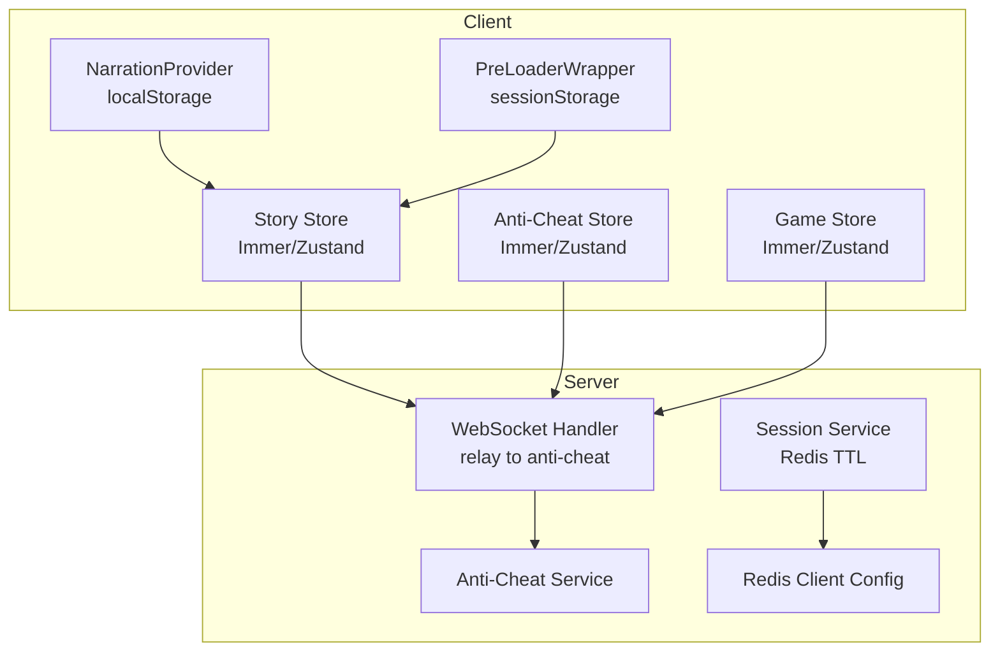
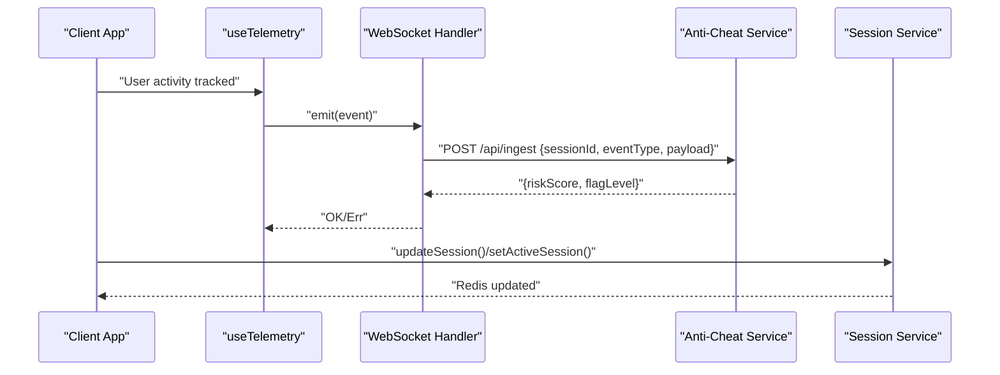
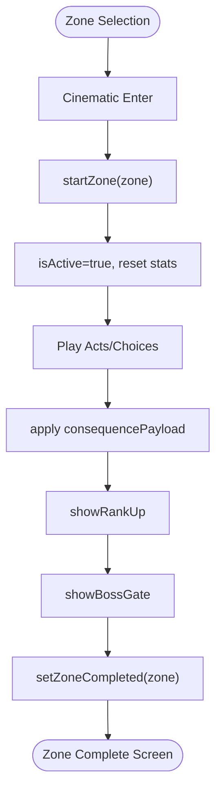
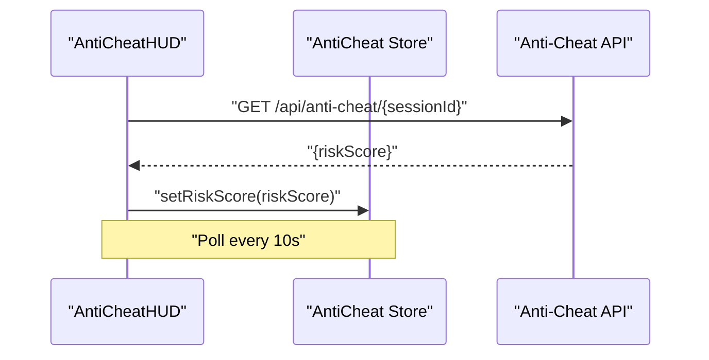
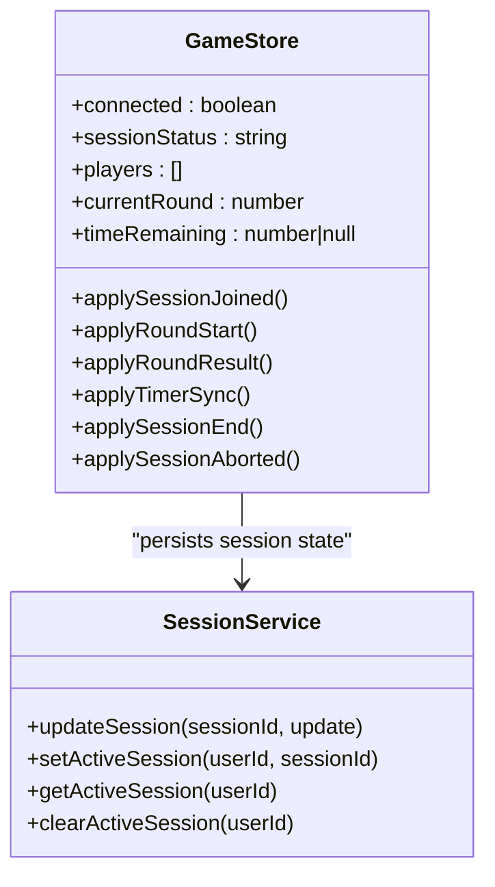
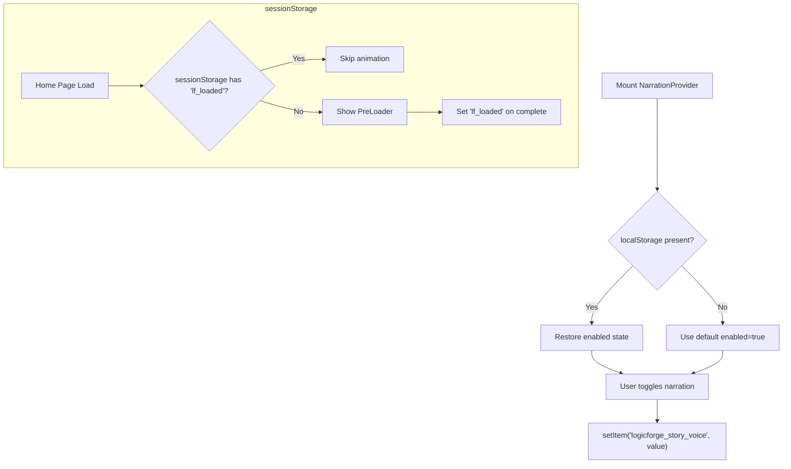
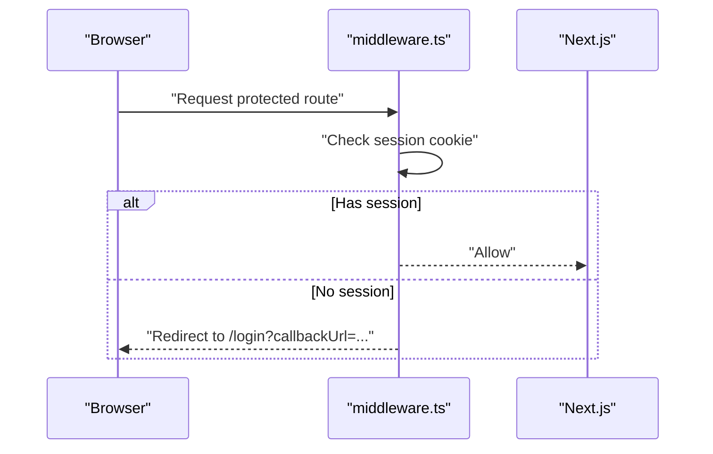
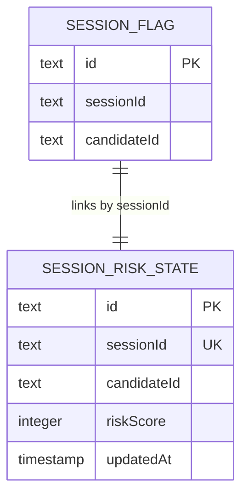
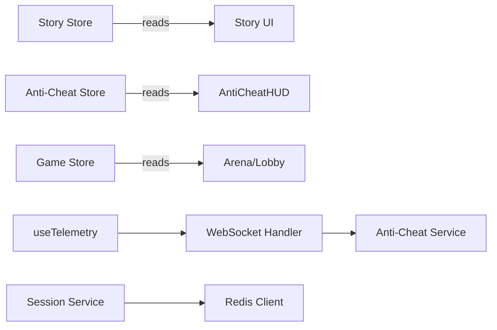

# Persisted State & Hydration

<cite>
**Referenced Files in This Document**
- [apps/web/store/story-store.ts](file://apps/web/store/story-store.ts)
- [apps/web/store/anti-cheat-store.ts](file://apps/web/store/anti-cheat-store.ts)
- [apps/web/store/game-store.ts](file://apps/web/store/game-store.ts)
- [apps/web/hooks/use-telemetry.ts](file://apps/web/hooks/use-telemetry.ts)
- [apps/web/components/game/anti-cheat-hud.tsx](file://apps/web/components/game/anti-cheat-hud.tsx)
- [apps/web/contexts/narration-context.tsx](file://apps/web/contexts/narration-context.tsx)
- [apps/web/components/PreLoaderWrapper.tsx](file://apps/web/components/PreLoaderWrapper.tsx)
- [apps/web/middleware.ts](file://apps/web/middleware.ts)
- [apps/web/next.config.mjs](file://apps/web/next.config.mjs)
- [packages/config/src/index.ts](file://packages/config/src/index.ts)
- [apps/game-api/src/websocket/socket.handler.ts](file://apps/game-api/src/websocket/socket.handler.ts)
- [apps/game-api/src/services/session.service.ts](file://apps/game-api/src/services/session.service.ts)
- [packages/db/prisma/migrations/20260308000000_add_match_records_and_anti_cheat/migration.sql](file://packages/db/prisma/migrations/20260308000000_add_match_records_and_anti_cheat/migration.sql)
- [apps/web/app/(game)/story/page.tsx](file://apps/web/app/(game)/story/page.tsx)
- [apps/web/components/story/zone-complete-screen.tsx](file://apps/web/components/story/zone-complete-screen.tsx)
</cite>

## Table of Contents
1. [Introduction](#introduction)
2. [Project Structure](#project-structure)
3. [Core Components](#core-components)
4. [Architecture Overview](#architecture-overview)
5. [Detailed Component Analysis](#detailed-component-analysis)
6. [Dependency Analysis](#dependency-analysis)
7. [Performance Considerations](#performance-considerations)
8. [Troubleshooting Guide](#troubleshooting-guide)
9. [Conclusion](#conclusion)
10. [Appendices](#appendices)

## Introduction
This document explains how Logic Forge persists and hydrates state across client and server boundaries. It covers:
- Client-side persistence for user preferences and transient UI state
- Server-side state management for game sessions and anti-cheat telemetry
- Hydration patterns for initial state loading and client rehydration
- Migration and versioning strategies for schema evolution
- Selective persistence, cleanup, and storage quota management
- Security considerations for sensitive state, encryption, and privacy
- Debugging tools and inspection techniques

## Project Structure
Logic Forge organizes state management around three primary stores:
- Story mode state for narrative progression and unlocks
- Anti-cheat telemetry and risk state for behavioral monitoring
- Game session state for match lifecycle and arena timing

Client-side persistence is achieved via localStorage and sessionStorage for small, non-sensitive preferences and UX hints. Server-side persistence leverages Redis for short-lived session state and relational migrations for long-term audit and risk records.

**Diagram sources**
- [apps/web/contexts/narration-context.tsx](file://apps/web/contexts/narration-context.tsx#L1-L110)
- [apps/web/components/PreLoaderWrapper.tsx](file://apps/web/components/PreLoaderWrapper.tsx#L1-L67)
- [apps/web/store/story-store.ts](file://apps/web/store/story-store.ts#L1-L252)
- [apps/web/store/anti-cheat-store.ts](file://apps/web/store/anti-cheat-store.ts#L1-L108)
- [apps/web/store/game-store.ts](file://apps/web/store/game-store.ts#L115-L223)
- [apps/game-api/src/websocket/socket.handler.ts](file://apps/game-api/src/websocket/socket.handler.ts#L19-L60)
- [apps/game-api/src/services/session.service.ts](file://apps/game-api/src/services/session.service.ts#L54-L90)
- [packages/config/src/index.ts](file://packages/config/src/index.ts#L118-L142)

**Section sources**
- [apps/web/store/story-store.ts](file://apps/web/store/story-store.ts#L1-L252)
- [apps/web/store/anti-cheat-store.ts](file://apps/web/store/anti-cheat-store.ts#L1-L108)
- [apps/web/store/game-store.ts](file://apps/web/store/game-store.ts#L115-L223)
- [apps/web/contexts/narration-context.tsx](file://apps/web/contexts/narration-context.tsx#L1-L110)
- [apps/web/components/PreLoaderWrapper.tsx](file://apps/web/components/PreLoaderWrapper.tsx#L1-L67)
- [apps/game-api/src/websocket/socket.handler.ts](file://apps/game-api/src/websocket/socket.handler.ts#L19-L60)
- [apps/game-api/src/services/session.service.ts](file://apps/game-api/src/services/session.service.ts#L54-L90)
- [packages/config/src/index.ts](file://packages/config/src/index.ts#L118-L142)

## Core Components
- Story Store: Manages narrative session, XP, rank, scars, debts, boss state, and streaming UI. It defines initial state and actions to mutate it.
- Anti-Cheat Store: Tracks warnings, event counts, risk score, and risk level per session, with helpers to reset and update session context.
- Game Store: Tracks match lifecycle, timers, rounds, player state, and survival mode metadata.
- Narration Provider: Persists voice narration preference to localStorage and restores it on mount.
- PreLoader Wrapper: Uses sessionStorage to avoid repeated home page loading animations.

**Section sources**
- [apps/web/store/story-store.ts](file://apps/web/store/story-store.ts#L42-L252)
- [apps/web/store/anti-cheat-store.ts](file://apps/web/store/anti-cheat-store.ts#L20-L108)
- [apps/web/store/game-store.ts](file://apps/web/store/game-store.ts#L191-L223)
- [apps/web/contexts/narration-context.tsx](file://apps/web/contexts/narration-context.tsx#L24-L110)
- [apps/web/components/PreLoaderWrapper.tsx](file://apps/web/components/PreLoaderWrapper.tsx#L13-L67)

## Architecture Overview
The system integrates client-side stores with server-side services:
- Client emits telemetry and anti-cheat events via WebSocket handler.
- WebSocket handler relays structured events to the anti-cheat service.
- Session state is stored in Redis with TTL and active session tracking.
- Middleware enforces session presence for protected routes.

**Diagram sources**
- [apps/web/hooks/use-telemetry.ts](file://apps/web/hooks/use-telemetry.ts#L1-L156)
- [apps/game-api/src/websocket/socket.handler.ts](file://apps/game-api/src/websocket/socket.handler.ts#L19-L60)
- [apps/game-api/src/services/session.service.ts](file://apps/game-api/src/services/session.service.ts#L54-L90)

## Detailed Component Analysis

### Story Mode Persistence and Hydration
- Persistence model: Story state is held in a Zustand store with Immer middleware. There is no explicit serialization to localStorage in the referenced code; persistence appears to be ephemeral per session.
- Hydration: The story page reads store state and orchestrates transitions (zone selection, cinematic, results). No initial SSR hydration of story state is shown in the referenced files.
- Completion tracking: Zone completion is recorded in the store’s zoneCompletion map; achievements and consequences are applied via store actions.

**Diagram sources**
- [apps/web/store/story-store.ts](file://apps/web/store/story-store.ts#L175-L252)
- [apps/web/app/(game)/story/page.tsx](file://apps/web/app/(game)/story/page.tsx#L46-L89)
- [apps/web/components/story/zone-complete-screen.tsx](file://apps/web/components/story/zone-complete-screen.tsx#L35-L82)

**Section sources**
- [apps/web/store/story-store.ts](file://apps/web/store/story-store.ts#L42-L252)
- [apps/web/app/(game)/story/page.tsx](file://apps/web/app/(game)/story/page.tsx#L46-L89)
- [apps/web/components/story/zone-complete-screen.tsx](file://apps/web/components/story/zone-complete-screen.tsx#L35-L82)

### Anti-Cheat Monitoring Data
- Client-side telemetry: Tracks focus loss, paste detection, keystroke bursts, and mouse inactivity. Emits events to the WebSocket handler.
- Server-side ingestion: The WebSocket handler forwards events to the anti-cheat service with sessionId and candidateId. Risk score updates are polled by the HUD.
- Store state: Maintains warnings, event counts, risk score, and risk level. Resets on session change.

**Diagram sources**
- [apps/web/components/game/anti-cheat-hud.tsx](file://apps/web/components/game/anti-cheat-hud.tsx#L23-L57)
- [apps/web/store/anti-cheat-store.ts](file://apps/web/store/anti-cheat-store.ts#L79-L83)
- [apps/web/hooks/use-telemetry.ts](file://apps/web/hooks/use-telemetry.ts#L1-L156)

**Section sources**
- [apps/web/hooks/use-telemetry.ts](file://apps/web/hooks/use-telemetry.ts#L1-L156)
- [apps/web/components/game/anti-cheat-hud.tsx](file://apps/web/components/game/anti-cheat-hud.tsx#L23-L57)
- [apps/web/store/anti-cheat-store.ts](file://apps/web/store/anti-cheat-store.ts#L20-L108)
- [apps/game-api/src/websocket/socket.handler.ts](file://apps/game-api/src/websocket/socket.handler.ts#L19-L60)

### Game Progress and Session State
- Game Store: Manages match lifecycle, timers, rounds, and survival mode. Actions update state based on server events.
- Session persistence: Redis-backed session storage with TTL and active session tracking. Used to persist match metadata and retrieve current session context.

**Diagram sources**
- [apps/web/store/game-store.ts](file://apps/web/store/game-store.ts#L115-L223)
- [apps/game-api/src/services/session.service.ts](file://apps/game-api/src/services/session.service.ts#L54-L90)

**Section sources**
- [apps/web/store/game-store.ts](file://apps/web/store/game-store.ts#L115-L223)
- [apps/game-api/src/services/session.service.ts](file://apps/game-api/src/services/session.service.ts#L54-L90)

### Client-Side Storage Mechanisms
- localStorage: Used by NarrationProvider to persist user preference for voice narration across visits.
- sessionStorage: Used by PreLoaderWrapper to avoid repeated home page loading animations on subsequent visits.

**Diagram sources**
- [apps/web/contexts/narration-context.tsx](file://apps/web/contexts/narration-context.tsx#L24-L110)
- [apps/web/components/PreLoaderWrapper.tsx](file://apps/web/components/PreLoaderWrapper.tsx#L13-L67)

**Section sources**
- [apps/web/contexts/narration-context.tsx](file://apps/web/contexts/narration-context.tsx#L24-L110)
- [apps/web/components/PreLoaderWrapper.tsx](file://apps/web/components/PreLoaderWrapper.tsx#L13-L67)

### Server-Side Hydration Patterns
- Protected routes: Middleware checks for session cookies and redirects unauthenticated users to login.
- Next.js configuration: Standalone output and transpilation settings support server components and externalized dependencies.

**Diagram sources**
- [apps/web/middleware.ts](file://apps/web/middleware.ts#L8-L34)
- [apps/web/next.config.mjs](file://apps/web/next.config.mjs#L1-L32)

**Section sources**
- [apps/web/middleware.ts](file://apps/web/middleware.ts#L1-L39)
- [apps/web/next.config.mjs](file://apps/web/next.config.mjs#L1-L32)

### State Migration Strategies
- Database migrations: Prisma migration adds tables for session flags and session risk state, enabling audit trails and risk scoring persistence.
- Versioning: Use migration filenames and database constraints to track schema evolution and maintain referential integrity.

**Diagram sources**
- [packages/db/prisma/migrations/20260308000000_add_match_records_and_anti_cheat/migration.sql](file://packages/db/prisma/migrations/20260308000000_add_match_records_and_anti_cheat/migration.sql#L71-L89)

**Section sources**
- [packages/db/prisma/migrations/20260308000000_add_match_records_and_anti_cheat/migration.sql](file://packages/db/prisma/migrations/20260308000000_add_match_records_and_anti_cheat/migration.sql#L71-L89)

### Selective State Persistence and Cleanup
- Selective persistence: Prefer localStorage for small UI preferences (e.g., narration toggle). Avoid storing large or sensitive data client-side.
- Cleanup: Clear temporary keys on logout or session end. Limit warning arrays and event counters in anti-cheat store to bounded sizes.
- Storage quotas: Monitor quota usage and evict least-used items when nearing limits.

[No sources needed since this section provides general guidance]

### Security Considerations
- Sensitive data: Do not persist tokens or PII in localStorage/sessionStorage. Use secure server-side sessions and Redis for ephemeral state.
- Encryption: Not observed in the referenced code. If encryption is required, implement at-rest and in-transit controls aligned with privacy policies.
- Privacy compliance: Respect user consent and provide opt-out mechanisms. Minimize data retention and enable deletion on request.

[No sources needed since this section provides general guidance]

## Dependency Analysis
- Client stores depend on Zustand with Immer for immutable updates.
- Anti-cheat telemetry depends on WebSocket handler and polling for risk updates.
- Session state depends on Redis client singleton and session service.

**Diagram sources**
- [apps/web/store/story-store.ts](file://apps/web/store/story-store.ts#L175-L252)
- [apps/web/store/anti-cheat-store.ts](file://apps/web/store/anti-cheat-store.ts#L51-L108)
- [apps/web/store/game-store.ts](file://apps/web/store/game-store.ts#L221-L223)
- [apps/web/hooks/use-telemetry.ts](file://apps/web/hooks/use-telemetry.ts#L1-L156)
- [apps/game-api/src/websocket/socket.handler.ts](file://apps/game-api/src/websocket/socket.handler.ts#L19-L60)
- [apps/game-api/src/services/session.service.ts](file://apps/game-api/src/services/session.service.ts#L54-L90)
- [packages/config/src/index.ts](file://packages/config/src/index.ts#L118-L142)

**Section sources**
- [apps/web/store/story-store.ts](file://apps/web/store/story-store.ts#L175-L252)
- [apps/web/store/anti-cheat-store.ts](file://apps/web/store/anti-cheat-store.ts#L51-L108)
- [apps/web/store/game-store.ts](file://apps/web/store/game-store.ts#L221-L223)
- [apps/web/hooks/use-telemetry.ts](file://apps/web/hooks/use-telemetry.ts#L1-L156)
- [apps/game-api/src/websocket/socket.handler.ts](file://apps/game-api/src/websocket/socket.handler.ts#L19-L60)
- [apps/game-api/src/services/session.service.ts](file://apps/game-api/src/services/session.service.ts#L54-L90)
- [packages/config/src/index.ts](file://packages/config/src/index.ts#L118-L142)

## Performance Considerations
- Client-side: Keep store state flat and granular to minimize re-renders. Use selectors to subscribe to only necessary slices.
- Server-side: Use Redis TTL to automatically expire stale sessions. Batch anti-cheat updates and throttle polling intervals.
- Hydration: Avoid heavy computations during initial load. Defer non-critical work to after hydration.

[No sources needed since this section provides general guidance]

## Troubleshooting Guide
- Anti-cheat HUD shows no risk updates: Verify session ID propagation and WebSocket connectivity. Check periodic polling and service availability.
- Story state resets unexpectedly: Confirm that story state is not persisted to localStorage in the referenced code; it is ephemeral per session.
- Session not found: Ensure active session is set and Redis keys are present with correct TTL.

**Section sources**
- [apps/web/components/game/anti-cheat-hud.tsx](file://apps/web/components/game/anti-cheat-hud.tsx#L23-L57)
- [apps/web/hooks/use-telemetry.ts](file://apps/web/hooks/use-telemetry.ts#L1-L156)
- [apps/game-api/src/services/session.service.ts](file://apps/game-api/src/services/session.service.ts#L77-L90)

## Conclusion
Logic Forge employs a clear separation between client-side UI preferences and server-side session/state persistence. Client stores manage transient gameplay and narrative state, while Redis and database migrations handle durable records for anti-cheat and session data. Hydration relies on middleware protection and Next.js configuration. Robust migration strategies and bounded client-side storage ensure scalability and reliability.

[No sources needed since this section summarizes without analyzing specific files]

## Appendices
- Debugging tips: Inspect browser storage (localStorage/sessionStorage), monitor WebSocket traffic, and verify Redis keys. Use middleware logs and anti-cheat service responses to diagnose issues.

[No sources needed since this section provides general guidance]