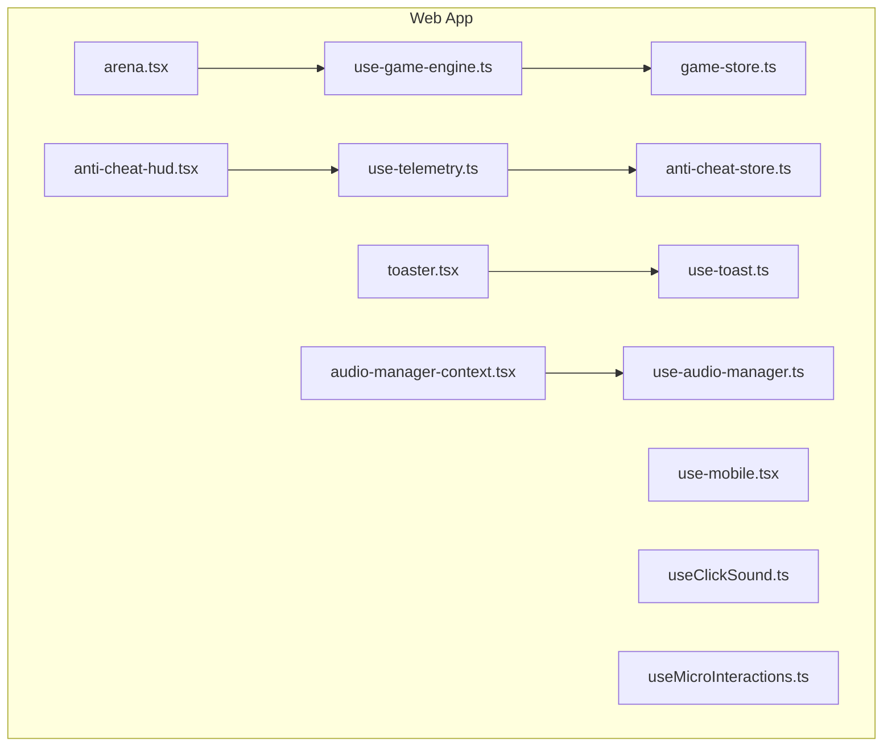
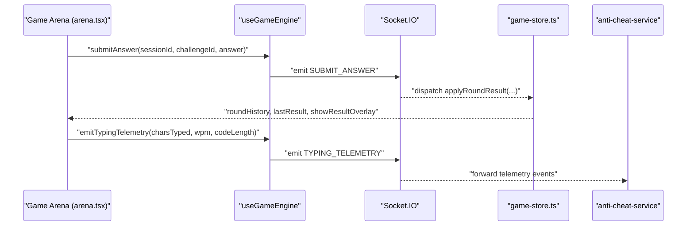
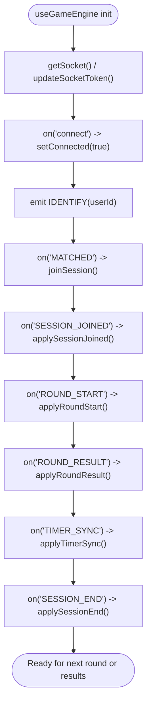
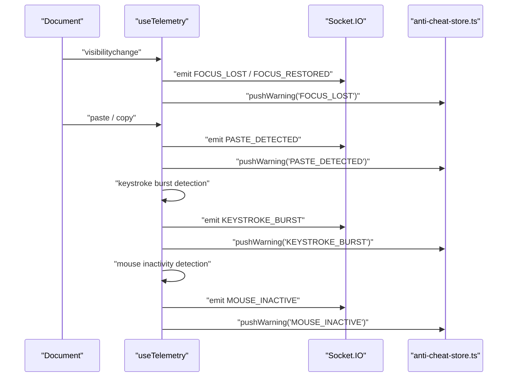
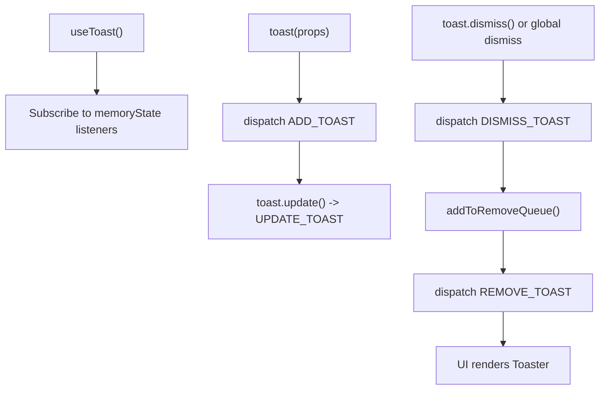
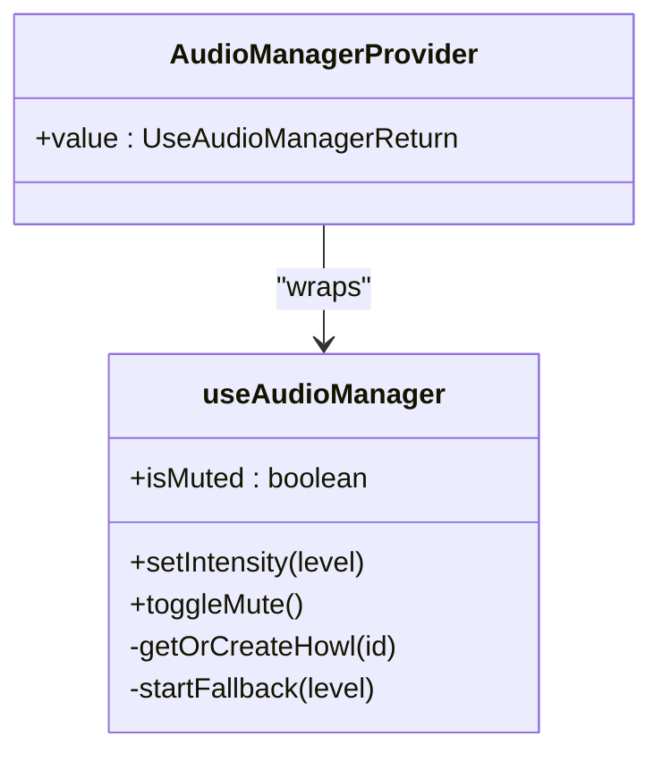
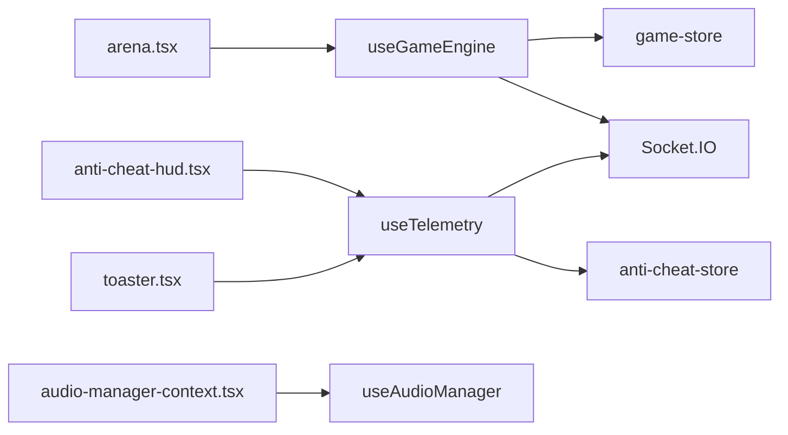

# React Hooks for State Management

<cite>
**Referenced Files in This Document**
- [use-game-engine.ts](file://apps/web/hooks/use-game-engine.ts)
- [use-telemetry.ts](file://apps/web/hooks/use-telemetry.ts)
- [use-toast.ts](file://apps/web/hooks/use-toast.ts)
- [use-audio-manager.ts](file://apps/web/hooks/use-audio-manager.ts)
- [use-mobile.tsx](file://apps/web/hooks/use-mobile.tsx)
- [useClickSound.ts](file://apps/web/hooks/useClickSound.ts)
- [useMicroInteractions.ts](file://apps/web/hooks/useMicroInteractions.ts)
- [game-store.ts](file://apps/web/store/game-store.ts)
- [anti-cheat-store.ts](file://apps/web/store/anti-cheat-store.ts)
- [audio-manager-context.tsx](file://apps/web/contexts/audio-manager-context.tsx)
- [arena.tsx](file://apps/web/components/game/arena.tsx)
- [anti-cheat-hud.tsx](file://apps/web/components/game/anti-cheat-hud.tsx)
- [toaster.tsx](file://apps/web/components/ui/toaster.tsx)
- [README.md](file://README.md)
</cite>

## Table of Contents
1. [Introduction](#introduction)
2. [Project Structure](#project-structure)
3. [Core Components](#core-components)
4. [Architecture Overview](#architecture-overview)
5. [Detailed Component Analysis](#detailed-component-analysis)
6. [Dependency Analysis](#dependency-analysis)
7. [Performance Considerations](#performance-considerations)
8. [Troubleshooting Guide](#troubleshooting-guide)
9. [Conclusion](#conclusion)

## Introduction
This document explains the React hooks used for state management in Logic Forge’s web application. It focuses on:
- The game engine hook that coordinates game state updates, WebSocket connections, and real-time events
- The telemetry hook that manages anti-cheat data collection and state synchronization
- Custom hooks for toast notifications, audio management, and mobile responsiveness
- Patterns for state derivation, effect management, and dependency optimization
- Examples of hook composition, custom hook creation patterns, and integration with external state stores
- Performance considerations, memoization strategies, and debugging techniques for complex state interactions

## Project Structure
The hooks and stores live under the Next.js web application:
- Hooks: apps/web/hooks
- Stores: apps/web/store
- UI integrations: apps/web/components
- Contexts: apps/web/contexts

**Diagram sources**
- [use-game-engine.ts](file://apps/web/hooks/use-game-engine.ts#L80-L466)
- [use-telemetry.ts](file://apps/web/hooks/use-telemetry.ts#L19-L157)
- [use-toast.ts](file://apps/web/hooks/use-toast.ts#L155-L177)
- [use-audio-manager.ts](file://apps/web/hooks/use-audio-manager.ts#L197-L318)
- [use-mobile.tsx](file://apps/web/hooks/use-mobile.tsx#L7-L22)
- [useClickSound.ts](file://apps/web/hooks/useClickSound.ts#L67-L73)
- [useMicroInteractions.ts](file://apps/web/hooks/useMicroInteractions.ts#L1-L106)
- [game-store.ts](file://apps/web/store/game-store.ts#L221-L394)
- [anti-cheat-store.ts](file://apps/web/store/anti-cheat-store.ts#L51-L108)
- [audio-manager-context.tsx](file://apps/web/contexts/audio-manager-context.tsx#L8-L29)
- [arena.tsx](file://apps/web/components/game/arena.tsx#L48-L395)
- [anti-cheat-hud.tsx](file://apps/web/components/game/anti-cheat-hud.tsx#L29-L129)
- [toaster.tsx](file://apps/web/components/ui/toaster.tsx#L13-L36)

**Section sources**
- [README.md](file://README.md#L1-L32)

## Core Components
- useGameEngine: Centralized game lifecycle and WebSocket orchestration backed by a Zustand store
- useTelemetry: Anti-cheat telemetry capture and emission to the anti-cheat service
- useToast: Lightweight toast notification manager with a reducer-based dispatcher
- useAudioManager: Audio intensity control with fallback synthesis and Howler integration
- useMobile: Responsive breakpoint detection hook
- useClickSound: Click sound effects with Web Audio API
- useMicroInteractions: UI micro-interactions using Framer Motion primitives

**Section sources**
- [use-game-engine.ts](file://apps/web/hooks/use-game-engine.ts#L80-L466)
- [use-telemetry.ts](file://apps/web/hooks/use-telemetry.ts#L19-L157)
- [use-toast.ts](file://apps/web/hooks/use-toast.ts#L155-L177)
- [use-audio-manager.ts](file://apps/web/hooks/use-audio-manager.ts#L197-L318)
- [use-mobile.tsx](file://apps/web/hooks/use-mobile.tsx#L7-L22)
- [useClickSound.ts](file://apps/web/hooks/useClickSound.ts#L67-L73)
- [useMicroInteractions.ts](file://apps/web/hooks/useMicroInteractions.ts#L1-L106)

## Architecture Overview
The hooks integrate with Zustand stores and real-time systems:
- useGameEngine connects to the gateway and game WebSocket, emitting/receiving events, and updating game-store state
- useTelemetry listens to DOM/user events and emits anti-cheat events via the same socket
- UI components subscribe to stores and call hooks to drive behavior

**Diagram sources**
- [arena.tsx](file://apps/web/components/game/arena.tsx#L127-L144)
- [use-game-engine.ts](file://apps/web/hooks/use-game-engine.ts#L298-L333)
- [game-store.ts](file://apps/web/store/game-store.ts#L286-L335)

## Detailed Component Analysis

### useGameEngine: Game Engine Hook
Purpose:
- Establish and maintain a Socket.IO connection
- Manage matchmaking, session lifecycle, rounds, timers, and survival modes
- Derive state from the game store and expose actions to the UI

Key behaviors:
- Singleton socket management with token injection and reconnect logic
- Real-time event handlers for session lifecycle, rounds, timers, and survival
- Typing telemetry throttling and submission helpers
- Queueing and readiness helpers

**Diagram sources**
- [use-game-engine.ts](file://apps/web/hooks/use-game-engine.ts#L93-L285)
- [game-store.ts](file://apps/web/store/game-store.ts#L236-L347)

Hook composition and patterns:
- Uses callbacks created with useCallback to prevent re-renders and stabilize refs for socket emissions
- Uses Zustand selectors to derive state efficiently
- Manages cleanup of event listeners in a single-effect pattern

Integration with external stores:
- Applies payloads to game-store reducers to update normalized state

Performance and memoization:
- Throttles telemetry emissions to reduce network overhead
- Uses refs to avoid unnecessary reconnects and to track identification state

Debugging:
- Extensive console logs around socket events and store updates
- Dedicated error handling for session errors and queue failures

**Section sources**
- [use-game-engine.ts](file://apps/web/hooks/use-game-engine.ts#L80-L466)
- [game-store.ts](file://apps/web/store/game-store.ts#L221-L394)

### useTelemetry: Anti-Cheat Telemetry Hook
Purpose:
- Capture user behavior events (focus, paste/copy, mouse movement, keystrokes)
- Emit structured telemetry to the anti-cheat service via the shared socket
- Push warnings to the anti-cheat store for UI display

Key behaviors:
- Tracks keystroke bursts and inactivity windows
- Prevents paste/copy and blocks right-click
- Emits visibility change and mouse activity events
- Integrates with the anti-cheat store for warnings and risk level updates

**Diagram sources**
- [use-telemetry.ts](file://apps/web/hooks/use-telemetry.ts#L35-L155)
- [anti-cheat-store.ts](file://apps/web/store/anti-cheat-store.ts#L51-L108)

**Section sources**
- [use-telemetry.ts](file://apps/web/hooks/use-telemetry.ts#L19-L157)
- [anti-cheat-store.ts](file://apps/web/store/anti-cheat-store.ts#L51-L108)

### useToast: Toast Notification Manager
Purpose:
- Provide a lightweight, reducer-driven toast system with a single dispatcher
- Enforce a cap on concurrent toasts and automatic dismissal

Key behaviors:
- Maintains an in-memory state and a listener array for subscribers
- Generates unique toast IDs and enforces a limit
- Supports adding, updating, dismissing, and removing toasts

**Diagram sources**
- [use-toast.ts](file://apps/web/hooks/use-toast.ts#L155-L177)
- [toaster.tsx](file://apps/web/components/ui/toaster.tsx#L13-L36)

**Section sources**
- [use-toast.ts](file://apps/web/hooks/use-toast.ts#L155-L177)
- [toaster.tsx](file://apps/web/components/ui/toaster.tsx#L13-L36)

### useAudioManager: Audio Intensity Control
Purpose:
- Control ambient audio intensity with crossfade transitions
- Provide fallback synthesis for environments where Howler fails
- Expose mute toggling and intensity selection

Key behaviors:
- Creates Howler instances lazily and caches them
- Falls back to Web Audio API-generated tracks when Howler fails
- Manages crossfade durations and volume scaling

**Diagram sources**
- [use-audio-manager.ts](file://apps/web/hooks/use-audio-manager.ts#L197-L318)
- [audio-manager-context.tsx](file://apps/web/contexts/audio-manager-context.tsx#L8-L29)

**Section sources**
- [use-audio-manager.ts](file://apps/web/hooks/use-audio-manager.ts#L197-L318)
- [audio-manager-context.tsx](file://apps/web/contexts/audio-manager-context.tsx#L8-L29)

### useMobile: Mobile Responsiveness
Purpose:
- Detect mobile viewport via media queries and window width
- Return a boolean for responsive rendering decisions

**Section sources**
- [use-mobile.tsx](file://apps/web/hooks/use-mobile.tsx#L7-L22)

### useClickSound: Click Effects
Purpose:
- Play contextual click sounds using Web Audio API
- Respect user preference stored in localStorage

**Section sources**
- [useClickSound.ts](file://apps/web/hooks/useClickSound.ts#L67-L73)

### useMicroInteractions: UI Micro-interactions
Purpose:
- Provide interactive hooks for tilt, magnetic pull, ripple, elastic counters, and navbar shrink

**Section sources**
- [useMicroInteractions.ts](file://apps/web/hooks/useMicroInteractions.ts#L1-L106)

## Dependency Analysis
- useGameEngine depends on:
  - next-auth session for user identity
  - Socket.IO for real-time communication
  - game-store for state derivation and updates
- useTelemetry depends on:
  - getSocket from useGameEngine
  - anti-cheat-store for warning aggregation
- UI components depend on:
  - useGameEngine for game state and actions
  - useTelemetry for anti-cheat telemetry
  - useToast for notifications
  - useAudioManager via context provider

**Diagram sources**
- [use-game-engine.ts](file://apps/web/hooks/use-game-engine.ts#L3-L16)
- [use-telemetry.ts](file://apps/web/hooks/use-telemetry.ts#L4-L6)
- [arena.tsx](file://apps/web/components/game/arena.tsx#L6-L16)
- [anti-cheat-hud.tsx](file://apps/web/components/game/anti-cheat-hud.tsx#L6-L35)
- [toaster.tsx](file://apps/web/components/ui/toaster.tsx#L11-L11)
- [audio-manager-context.tsx](file://apps/web/contexts/audio-manager-context.tsx#L4-L4)

**Section sources**
- [use-game-engine.ts](file://apps/web/hooks/use-game-engine.ts#L3-L16)
- [use-telemetry.ts](file://apps/web/hooks/use-telemetry.ts#L4-L6)
- [arena.tsx](file://apps/web/components/game/arena.tsx#L6-L16)
- [anti-cheat-hud.tsx](file://apps/web/components/game/anti-cheat-hud.tsx#L6-L35)
- [toaster.tsx](file://apps/web/components/ui/toaster.tsx#L11-L11)
- [audio-manager-context.tsx](file://apps/web/contexts/audio-manager-context.tsx#L4-L4)

## Performance Considerations
- Memoization and callback stabilization:
  - useCallback is used for event emitters and actions to avoid recreating functions on each render
  - Refs are used to store mutable values (e.g., telemetry throttle, socket token) to prevent unnecessary reconnects
- Effect management:
  - Single-effect patterns consolidate event listeners and cleanup
  - Cleanup removes all listeners to prevent leaks
- Store subscriptions:
  - Selectors minimize re-renders by subscribing to only the needed slices
- Throttling and batching:
  - Telemetry throttling reduces event frequency
  - Toast limit caps concurrent notifications
- Crossfade and fallback audio:
  - Controlled crossfade duration prevents abrupt volume changes
  - Fallback synthesis ensures audio continuity when Howler fails

[No sources needed since this section provides general guidance]

## Troubleshooting Guide
Common issues and remedies:
- Socket not connecting:
  - Verify session accessToken availability and token propagation
  - Check gateway connectivity and path configuration
- Events not received:
  - Confirm IDENTIFY handshake completion and userId correctness
  - Ensure event listeners are attached and not prematurely removed
- Telemetry not emitted:
  - Confirm sessionId and userId presence
  - Check socket connected state before emitting
- Toasts not appearing:
  - Ensure Toaster is rendered and useToast is subscribed
  - Verify toast limit and dismissal timing
- Audio not playing:
  - Check browser autoplay policies and user gesture requirements
  - Confirm fallback synthesis activation when Howler fails

**Section sources**
- [use-game-engine.ts](file://apps/web/hooks/use-game-engine.ts#L93-L103)
- [use-telemetry.ts](file://apps/web/hooks/use-telemetry.ts#L35-L54)
- [toaster.tsx](file://apps/web/components/ui/toaster.tsx#L13-L36)
- [use-audio-manager.ts](file://apps/web/hooks/use-audio-manager.ts#L239-L297)

## Conclusion
These hooks form a cohesive state management ecosystem:
- useGameEngine centralizes real-time coordination and store updates
- useTelemetry integrates behavioral telemetry with anti-cheat services
- useToast provides a minimal, effective notification system
- useAudioManager and related hooks deliver immersive, resilient audio experiences
- useMobile and useMicroInteractions enhance responsiveness and interactivity

Adopting the documented patterns—callback memoization, effect consolidation, selector-based subscriptions, and throttling—ensures predictable performance and maintainability across complex state interactions.