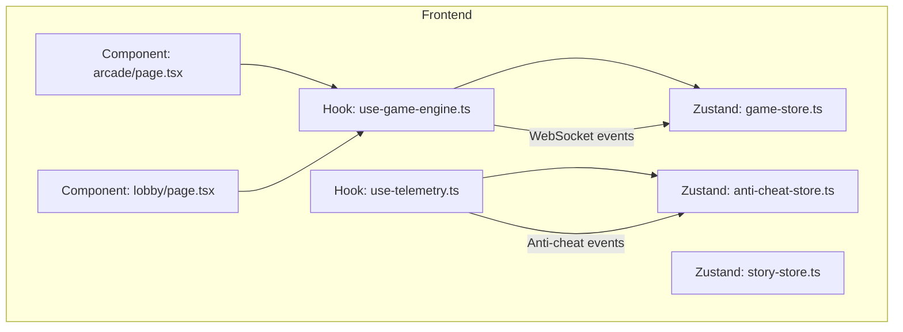
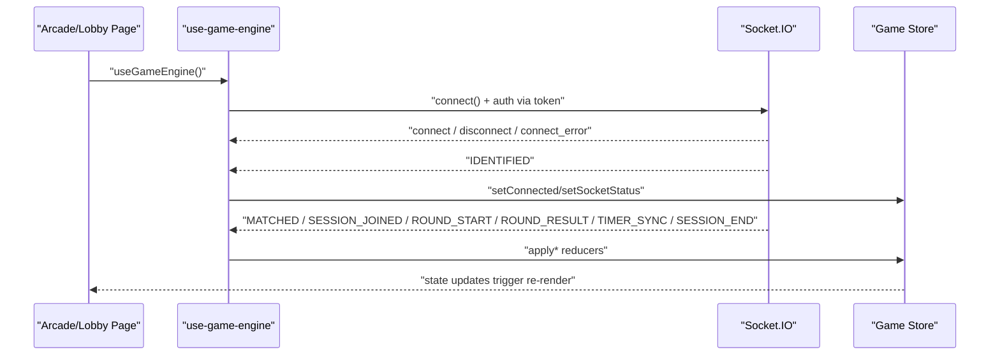
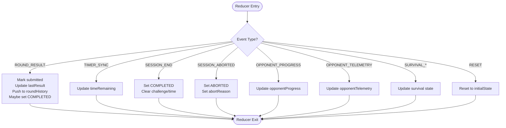
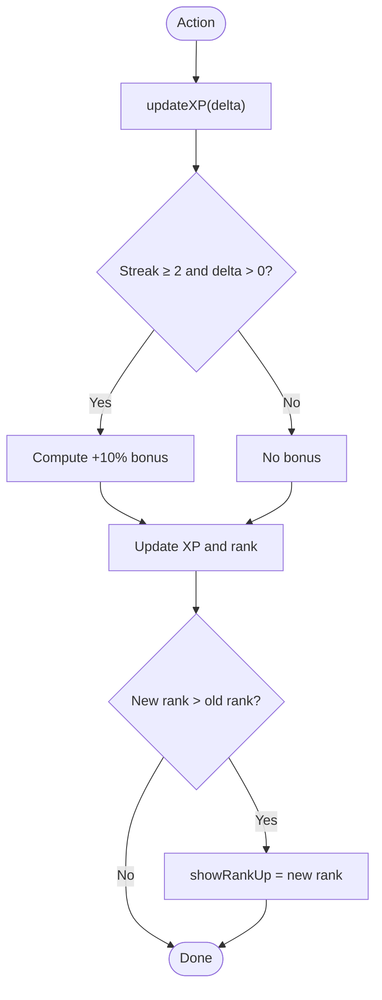
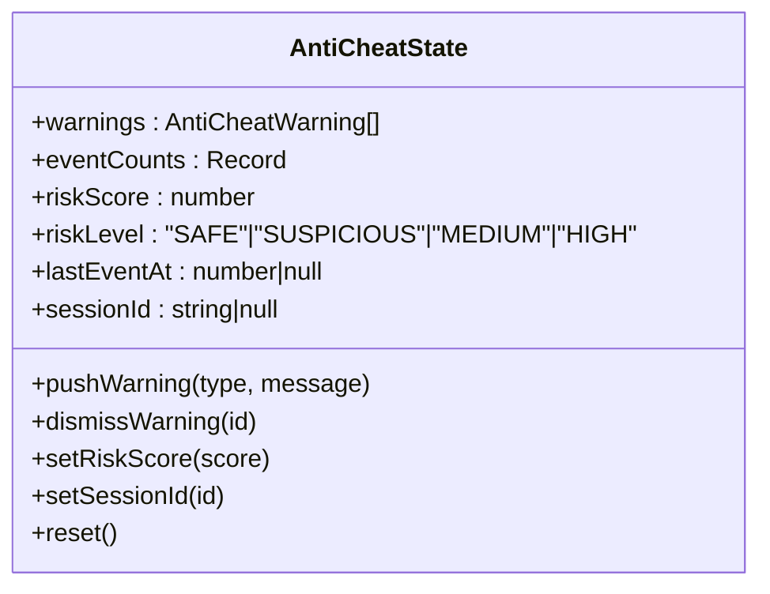
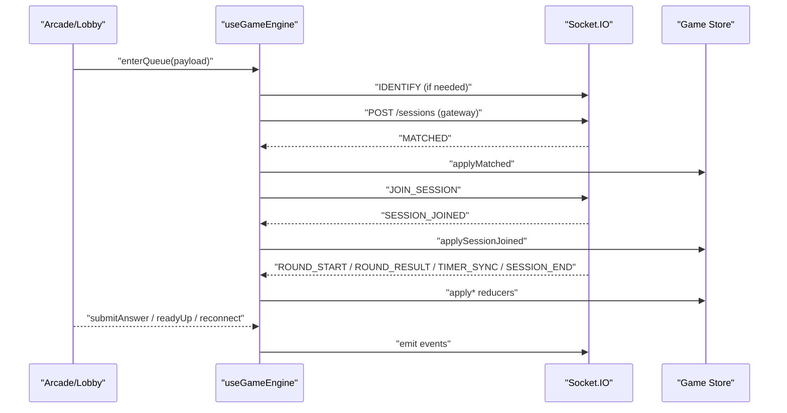
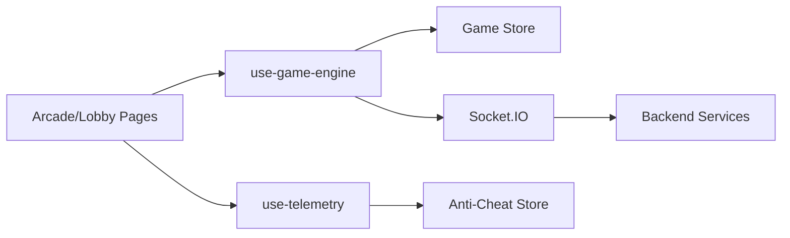

# State Management

<cite>
**Referenced Files in This Document**
- [apps/web/store/game-store.ts](file://apps/web/store/game-store.ts)
- [apps/web/store/story-store.ts](file://apps/web/store/story-store.ts)
- [apps/web/store/anti-cheat-store.ts](file://apps/web/store/anti-cheat-store.ts)
- [apps/web/hooks/use-game-engine.ts](file://apps/web/hooks/use-game-engine.ts)
- [apps/web/hooks/use-telemetry.ts](file://apps/web/hooks/use-telemetry.ts)
- [apps/web/app/(game)/arcade/page.tsx](file://apps/web/app/(game)/arcade/page.tsx)
- [apps/web/app/(game)/lobby/page.tsx](file://apps/web/app/(game)/lobby/page.tsx)
- [packages/types/src/websocket.ts](file://packages/types/src/websocket.ts)
- [apps/web/auth.ts](file://apps/web/auth.ts)
</cite>

## Table of Contents
1. [Introduction](#introduction)
2. [Project Structure](#project-structure)
3. [Core Components](#core-components)
4. [Architecture Overview](#architecture-overview)
5. [Detailed Component Analysis](#detailed-component-analysis)
6. [Dependency Analysis](#dependency-analysis)
7. [Performance Considerations](#performance-considerations)
8. [Troubleshooting Guide](#troubleshooting-guide)
9. [Conclusion](#conclusion)
10. [Appendices](#appendices)

## Introduction
This document explains the state management systems powering Logic Forge’s frontend. It covers:
- Zustand stores for game state, story mode, and anti-cheat telemetry
- Hook-based integration with the game engine and telemetry
- Real-time synchronization via WebSocket events
- Optimistic updates and reconciliation patterns
- Persisted state, hydration, and migration strategies
- Debugging, performance, and robustness recommendations

## Project Structure
Logic Forge’s frontend state is organized around three primary Zustand stores:
- Game state store for match lifecycle, round progression, timers, and survival mechanics
- Story mode store for narrative progression, XP/rank, choices, and chat
- Anti-cheat telemetry store for event counting, risk scoring, and warnings

These stores are consumed by custom React hooks that orchestrate WebSocket communication and UI updates.

**Diagram sources**
- [apps/web/store/game-store.ts](file://apps/web/store/game-store.ts#L1-L394)
- [apps/web/store/story-store.ts](file://apps/web/store/story-store.ts#L1-L308)
- [apps/web/store/anti-cheat-store.ts](file://apps/web/store/anti-cheat-store.ts#L1-L108)
- [apps/web/hooks/use-game-engine.ts](file://apps/web/hooks/use-game-engine.ts#L1-L466)
- [apps/web/hooks/use-telemetry.ts](file://apps/web/hooks/use-telemetry.ts#L1-L157)
- [apps/web/app/(game)/arcade/page.tsx](file://apps/web/app/(game)/arcade/page.tsx#L1-L821)
- [apps/web/app/(game)/lobby/page.tsx](file://apps/web/app/(game)/lobby/page.tsx#L1-L160)

**Section sources**
- [apps/web/store/game-store.ts](file://apps/web/store/game-store.ts#L1-L394)
- [apps/web/store/story-store.ts](file://apps/web/store/story-store.ts#L1-L308)
- [apps/web/store/anti-cheat-store.ts](file://apps/web/store/anti-cheat-store.ts#L1-L108)
- [apps/web/hooks/use-game-engine.ts](file://apps/web/hooks/use-game-engine.ts#L1-L466)
- [apps/web/hooks/use-telemetry.ts](file://apps/web/hooks/use-telemetry.ts#L1-L157)
- [apps/web/app/(game)/arcade/page.tsx](file://apps/web/app/(game)/arcade/page.tsx#L1-L821)
- [apps/web/app/(game)/lobby/page.tsx](file://apps/web/app/(game)/lobby/page.tsx#L1-L160)

## Core Components
- Game state store: Manages match lifecycle, round progression, timers, player/opponent telemetry, and survival mode state. Implements reducers for each server event and supports optimistic overlays and delayed session end application.
- Story mode store: Tracks narrative state, XP/rank, choices, chat streaming, and gamification metrics. Includes rank computation and streak-based XP bonuses.
- Anti-cheat telemetry store: Aggregates events, computes risk level, and maintains warnings with timestamps. Integrates with the telemetry hook for real-time detection and reporting.

**Section sources**
- [apps/web/store/game-store.ts](file://apps/web/store/game-store.ts#L77-L141)
- [apps/web/store/story-store.ts](file://apps/web/store/story-store.ts#L42-L112)
- [apps/web/store/anti-cheat-store.ts](file://apps/web/store/anti-cheat-store.ts#L20-L33)

## Architecture Overview
The system integrates React hooks with Zustand stores and WebSocket events:
- The game engine hook initializes a Socket.IO connection, authenticates via JWT, and subscribes to server events. It applies reducers to the game store and coordinates UI transitions.
- The telemetry hook monitors user behavior and emits anti-cheat events to the backend while updating the anti-cheat store.
- The arcade and lobby pages consume the game engine hook to render appropriate UI states and drive actions.

**Diagram sources**
- [apps/web/hooks/use-game-engine.ts](file://apps/web/hooks/use-game-engine.ts#L133-L285)
- [apps/web/store/game-store.ts](file://apps/web/store/game-store.ts#L221-L392)
- [apps/web/app/(game)/arcade/page.tsx](file://apps/web/app/(game)/arcade/page.tsx#L492-L614)
- [apps/web/app/(game)/lobby/page.tsx](file://apps/web/app/(game)/lobby/page.tsx#L8-L35)

## Detailed Component Analysis

### Game State Store
- Responsibilities:
  - Track connection, socket status, match status, and session lifecycle
  - Manage round state, challenges, timers, and results
  - Handle dual-mode opponent progress and telemetry
  - Support survival mode streaks, bonuses, and continuation choices
  - Provide reducers for each server event and reset helpers
- Key reducers:
  - Session lifecycle: applyMatched, applySessionJoined, applyPlayerConnected, applySessionEnd, applySessionAborted
  - Round lifecycle: applyRoundStart, applyRoundResult, applyTimerSync
  - Opponent telemetry: applyOpponentProgress, applyOpponentTelemetry
  - Survival: incrementStreak, resetSurvival, applySurvivalContinue, applySurvivalEnded
  - UI: dismissResultOverlay, reset
- Optimistic updates:
  - The store marks submission state per round and displays result overlay immediately upon receiving results.
  - Timer sync updates timeRemaining optimistically.
- Robustness:
  - Delayed application of SESSION_END until all round results are processed to avoid race conditions.

**Diagram sources**
- [apps/web/store/game-store.ts](file://apps/web/store/game-store.ts#L221-L392)

**Section sources**
- [apps/web/store/game-store.ts](file://apps/web/store/game-store.ts#L77-L141)
- [apps/web/store/game-store.ts](file://apps/web/store/game-store.ts#L221-L392)

### Story Mode Store
- Responsibilities:
  - Track active zone, act, XP, rank, scars, debts, achievements
  - Manage boss combat state and zone completion
  - Drive narrative choices, chat streaming, and audio intensity
  - Compute rank from XP and enforce streak-based XP bonuses
- Notable behaviors:
  - Rank thresholds define tier progression and automatic rank updates
  - Energy meter adjustments in specific zones with system failure triggers
  - Streaming assistant messages committed atomically after chunks
  - Choice gating and waiting states for interactive narrative moments

**Diagram sources**
- [apps/web/store/story-store.ts](file://apps/web/store/story-store.ts#L273-L283)

**Section sources**
- [apps/web/store/story-store.ts](file://apps/web/store/story-store.ts#L42-L112)
- [apps/web/store/story-store.ts](file://apps/web/store/story-store.ts#L175-L307)

### Anti-Cheat Telemetry Store
- Responsibilities:
  - Aggregate event counts, compute risk level, and maintain warnings
  - Track session-specific state and reset on session change
- Integration:
  - The telemetry hook pushes warnings and emits events to the backend
  - Risk level is derived from a score threshold mapping

**Diagram sources**
- [apps/web/store/anti-cheat-store.ts](file://apps/web/store/anti-cheat-store.ts#L20-L33)

**Section sources**
- [apps/web/store/anti-cheat-store.ts](file://apps/web/store/anti-cheat-store.ts#L20-L33)
- [apps/web/hooks/use-telemetry.ts](file://apps/web/hooks/use-telemetry.ts#L19-L54)

### Hook-Based Integration: useGameEngine
- Initializes and manages a Socket.IO connection with token-based auth
- Subscribes to server events and applies reducers to the game store
- Provides actions: enterQueue, joinSession, readyUp, submitAnswer, confirmSurvivalContinue, declineSurvival, reconnect
- Handles re-identification on user/session changes and ensures proper auth headers on polling requests

**Diagram sources**
- [apps/web/hooks/use-game-engine.ts](file://apps/web/hooks/use-game-engine.ts#L80-L466)
- [apps/web/app/(game)/arcade/page.tsx](file://apps/web/app/(game)/arcade/page.tsx#L492-L614)
- [apps/web/app/(game)/lobby/page.tsx](file://apps/web/app/(game)/lobby/page.tsx#L8-L35)

**Section sources**
- [apps/web/hooks/use-game-engine.ts](file://apps/web/hooks/use-game-engine.ts#L36-L77)
- [apps/web/hooks/use-game-engine.ts](file://apps/web/hooks/use-game-engine.ts#L133-L285)
- [apps/web/hooks/use-game-engine.ts](file://apps/web/hooks/use-game-engine.ts#L335-L392)
- [apps/web/hooks/use-game-engine.ts](file://apps/web/hooks/use-game-engine.ts#L416-L466)

### Hook-Based Integration: useTelemetry
- Monitors user behavior (focus, paste/copy, keystrokes, mouse activity)
- Emits anti-cheat events to the backend via the shared socket
- Updates the anti-cheat store with warnings and risk metrics
- Resets warnings on session change

**Section sources**
- [apps/web/hooks/use-telemetry.ts](file://apps/web/hooks/use-telemetry.ts#L19-L54)
- [apps/web/hooks/use-telemetry.ts](file://apps/web/hooks/use-telemetry.ts#L56-L155)

### WebSocket Event Contracts
- Client-to-server events include JOIN_SESSION, READY, SUBMIT_ANSWER, LEAVE_SESSION, PING, IDENTIFY
- Server-to-client events include SESSION_JOINED, ROUND_START, TIMER_SYNC, ROUND_RESULT, OPPONENT_SUBMITTED, SESSION_COMPLETE, MATCH_FOUND, ERROR, PONG
- Payloads are strongly typed to ensure correctness across the wire

**Section sources**
- [packages/types/src/websocket.ts](file://packages/types/src/websocket.ts#L5-L56)
- [packages/types/src/websocket.ts](file://packages/types/src/websocket.ts#L59-L155)

### Authentication and Token Propagation
- NextAuth supplies a signed JWT token; the game engine hook injects it into Socket.IO auth and extra headers for polling requests
- The auth provider augments the session with user metadata and exposes a signed JWT for gateway calls

**Section sources**
- [apps/web/auth.ts](file://apps/web/auth.ts#L123-L139)
- [apps/web/hooks/use-game-engine.ts](file://apps/web/hooks/use-game-engine.ts#L93-L103)

## Dependency Analysis
- Stores depend on Zustand with Immer middleware for immutable updates
- Hooks depend on Zustand stores and Socket.IO client
- Components depend on hooks for state and actions
- Backend depends on gateway and Redis for session and socket mapping

**Diagram sources**
- [apps/web/hooks/use-game-engine.ts](file://apps/web/hooks/use-game-engine.ts#L1-L466)
- [apps/web/hooks/use-telemetry.ts](file://apps/web/hooks/use-telemetry.ts#L1-L157)
- [apps/web/store/game-store.ts](file://apps/web/store/game-store.ts#L1-L394)
- [apps/web/store/anti-cheat-store.ts](file://apps/web/store/anti-cheat-store.ts#L1-L108)

**Section sources**
- [apps/web/hooks/use-game-engine.ts](file://apps/web/hooks/use-game-engine.ts#L1-L466)
- [apps/web/hooks/use-telemetry.ts](file://apps/web/hooks/use-telemetry.ts#L1-L157)

## Performance Considerations
- Prefer optimistic updates for responsiveness (e.g., timer sync, result overlay) and reconcile with server events
- Throttle telemetry emissions to reduce network overhead (e.g., typing telemetry interval)
- Keep store reducers pure and minimal; avoid heavy computations inside setters
- Use selective subscriptions in components to minimize re-renders
- Debounce or batch UI-driven actions (e.g., ready-up) to prevent redundant emits

[No sources needed since this section provides general guidance]

## Troubleshooting Guide
- Connection issues:
  - Verify token propagation to Socket.IO auth and polling headers
  - Use reconnect action to recover from transient errors
- Race conditions:
  - SESSION_END is applied only after all round results are present
- Anti-cheat:
  - Inspect warnings and risk level in the anti-cheat store
  - Ensure telemetry hook is active and emitting events
- Debugging:
  - Enable logging in reducers and hooks to trace state transitions
  - Use browser devtools to inspect store state and WebSocket frames

**Section sources**
- [apps/web/hooks/use-game-engine.ts](file://apps/web/hooks/use-game-engine.ts#L133-L160)
- [apps/web/hooks/use-game-engine.ts](file://apps/web/hooks/use-game-engine.ts#L200-L220)
- [apps/web/hooks/use-telemetry.ts](file://apps/web/hooks/use-telemetry.ts#L35-L54)
- [apps/web/store/anti-cheat-store.ts](file://apps/web/store/anti-cheat-store.ts#L51-L107)

## Conclusion
Logic Forge’s state management combines Zustand stores, custom hooks, and WebSocket-driven synchronization to deliver responsive gameplay and narrative experiences. The design emphasizes optimistic updates, robust reconciliation, and clear separation of concerns across game, story, and anti-cheat domains.

[No sources needed since this section summarizes without analyzing specific files]

## Appendices

### State Usage Examples in Components
- Arcade page:
  - Consumes useGameEngine for state and actions; auto-retries JOIN_SESSION and renders lobby/arena/results based on sessionStatus
- Lobby page:
  - Uses useGameEngine to ready up and display match status

**Section sources**
- [apps/web/app/(game)/arcade/page.tsx](file://apps/web/app/(game)/arcade/page.tsx#L492-L614)
- [apps/web/app/(game)/lobby/page.tsx](file://apps/web/app/(game)/lobby/page.tsx#L8-L35)

### State Subscription Patterns
- Components subscribe to Zustand by importing selectors or the entire store and accessing state fields returned by the hook
- Actions are invoked via the hook to emit events or mutate state

**Section sources**
- [apps/web/hooks/use-game-engine.ts](file://apps/web/hooks/use-game-engine.ts#L416-L466)
- [apps/web/hooks/use-telemetry.ts](file://apps/web/hooks/use-telemetry.ts#L28-L33)

### WebSocket Event Mapping
- Client emits: JOIN_SESSION, READY, SUBMIT_ANSWER, LEAVE_SESSION, PING, IDENTIFY
- Server emits: SESSION_JOINED, ROUND_START, TIMER_SYNC, ROUND_RESULT, OPPONENT_SUBMITTED, SESSION_COMPLETE, MATCH_FOUND, ERROR, PONG

**Section sources**
- [packages/types/src/websocket.ts](file://packages/types/src/websocket.ts#L5-L56)
- [packages/types/src/websocket.ts](file://packages/types/src/websocket.ts#L59-L155)

### Persisted State, Hydration, and Reconciliation
- Persisted state:
  - Game store: No explicit persistence in the provided file; consider persisting session ID and basic config for quick rehydration
  - Story store: No explicit persistence in the provided file; consider persisting XP, rank, and zone completion for continuity
  - Anti-cheat store: No explicit persistence in the provided file; warnings are ephemeral per session
- Hydration:
  - On app load, restore persisted fields into the store initial state
- Client-server reconciliation:
  - Apply reducers for server events; delay terminal events until all prior results are received

**Section sources**
- [apps/web/store/game-store.ts](file://apps/web/store/game-store.ts#L191-L219)
- [apps/web/store/story-store.ts](file://apps/web/store/story-store.ts#L145-L171)
- [apps/web/store/anti-cheat-store.ts](file://apps/web/store/anti-cheat-store.ts#L51-L95)
- [apps/web/hooks/use-game-engine.ts](file://apps/web/hooks/use-game-engine.ts#L200-L220)

### State Migration Strategies
- Versioned store slices:
  - Introduce a version field in persisted state; on load, migrate older shapes to new fields
- Backward compatibility:
  - Map legacy keys to new keys and normalize defaults
- Validation:
  - Use typed payloads to detect malformed state and reset to a safe baseline

[No sources needed since this section provides general guidance]