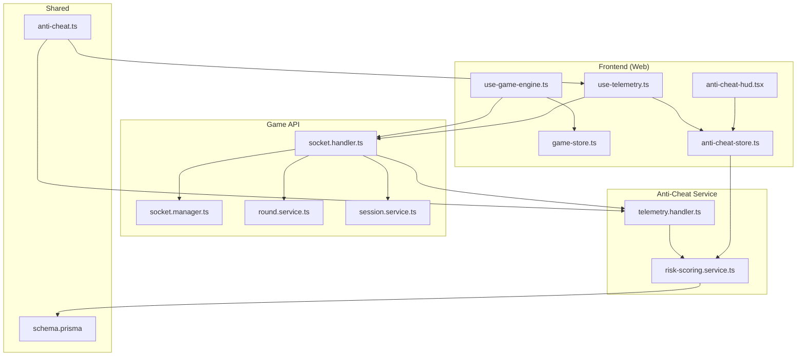
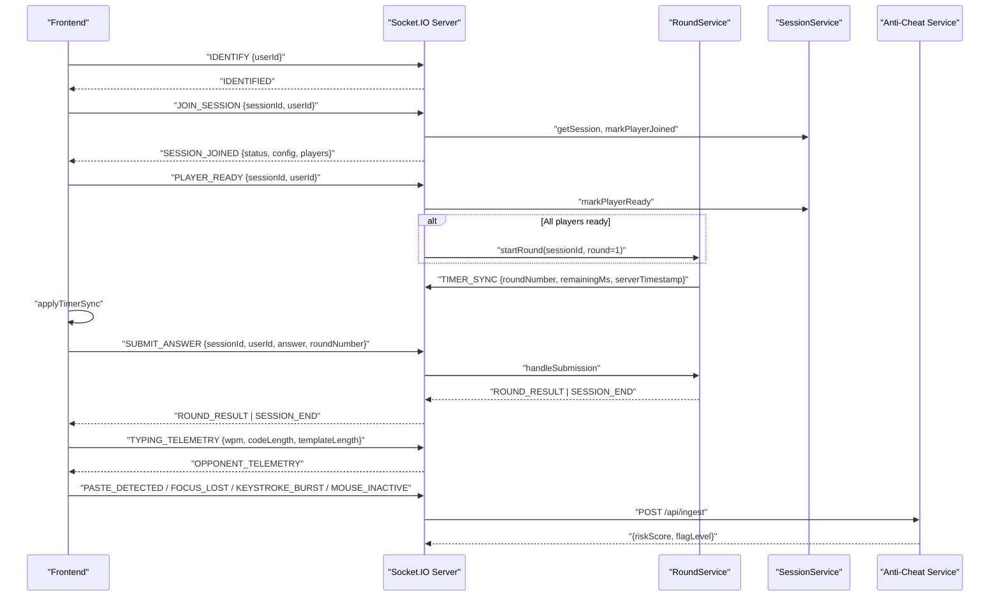
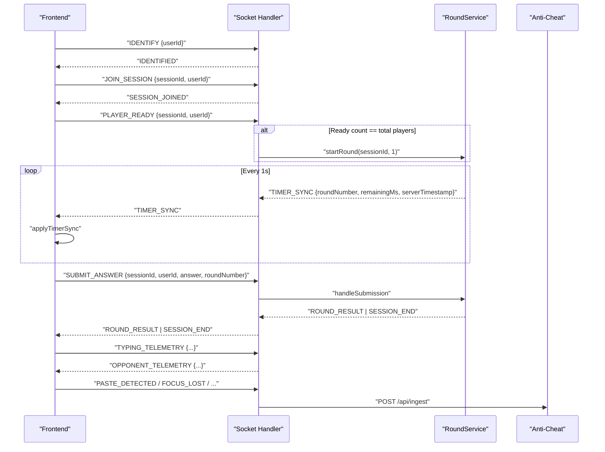
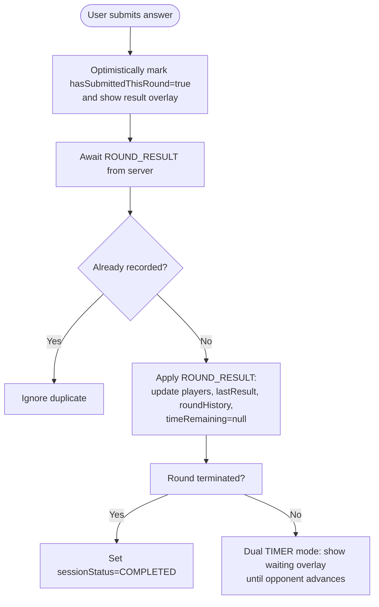
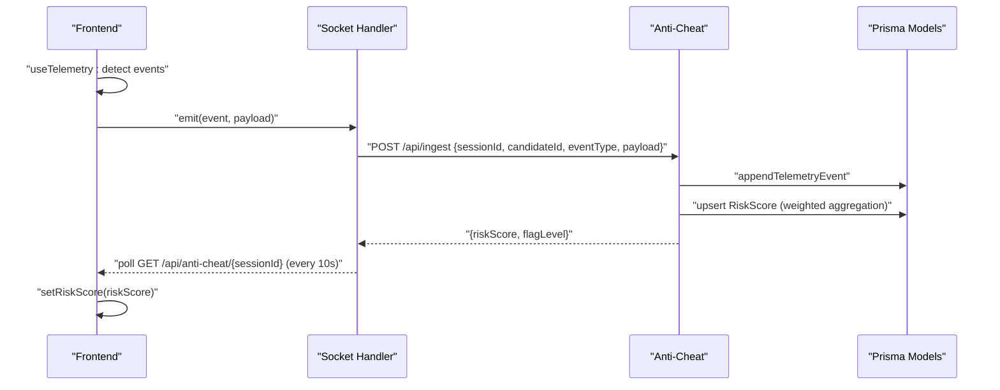
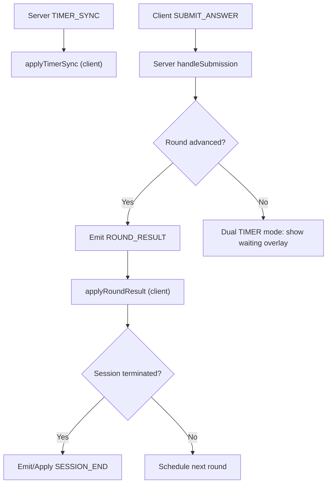
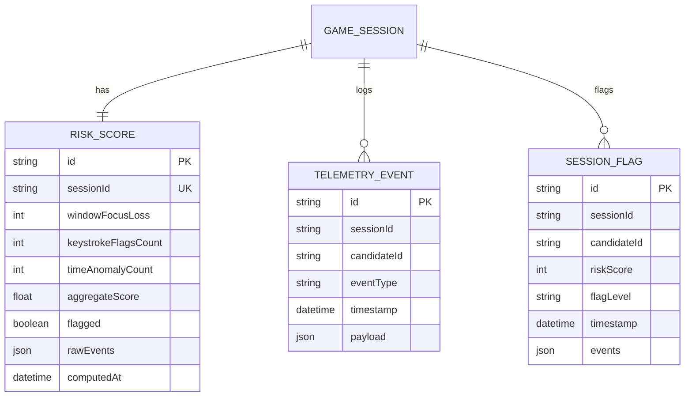
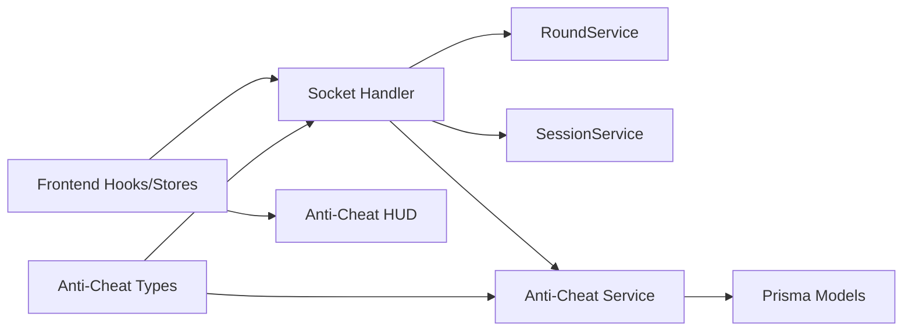

# State Synchronization & Real-time Updates

<cite>
**Referenced Files in This Document**
- [socket.handler.ts](file://apps/game-api/src/websocket/socket.handler.ts)
- [socket.manager.ts](file://apps/game-api/src/websocket/socket.manager.ts)
- [round.service.ts](file://apps/game-api/src/services/round.service.ts)
- [session.service.ts](file://apps/game-api/src/services/session.service.ts)
- [use-game-engine.ts](file://apps/web/hooks/use-game-engine.ts)
- [game-store.ts](file://apps/web/store/game-store.ts)
- [anti-cheat-store.ts](file://apps/web/store/anti-cheat-store.ts)
- [use-telemetry.ts](file://apps/web/hooks/use-telemetry.ts)
- [anti-cheat-hud.tsx](file://apps/web/components/game/anti-cheat-hud.tsx)
- [telemetry.handler.ts](file://apps/anti-cheat/src/handlers/telemetry.handler.ts)
- [risk-scoring.service.ts](file://apps/anti-cheat/src/services/risk-scoring.service.ts)
- [anti-cheat.ts](file://packages/types/src/anti-cheat.ts)
- [schema.prisma](file://packages/db/prisma/schema.prisma)
- [PHASE_PLANNER.md](file://PHASE_PLANNER.md)
</cite>

## Table of Contents
1. [Introduction](#introduction)
2. [Project Structure](#project-structure)
3. [Core Components](#core-components)
4. [Architecture Overview](#architecture-overview)
5. [Detailed Component Analysis](#detailed-component-analysis)
6. [Dependency Analysis](#dependency-analysis)
7. [Performance Considerations](#performance-considerations)
8. [Troubleshooting Guide](#troubleshooting-guide)
9. [Conclusion](#conclusion)

## Introduction
This document explains state synchronization patterns between the frontend and backend services in Logic Forge. It covers WebSocket-based real-time updates, event-driven state mutations, optimistic updates, client-server reconciliation, conflict resolution, and consistency guarantees. It also details timing-sensitive state updates for game sessions (round progression, timer synchronization, and multiplayer coordination), anti-cheat telemetry synchronization (real-time risk scoring and behavioral pattern tracking), and practical strategies for batching, debouncing, error recovery, and performance optimization.

## Project Structure
Logic Forge comprises:
- Frontend (Next.js app) with React hooks and Zustand stores for game and anti-cheat state
- Game API (Socket.IO server) handling matchmaking, rounds, timers, and telemetry relays
- Anti-Cheat service (Express) ingesting telemetry, computing risk scores, and maintaining audit logs
- Shared types and database schema for telemetry and risk models

**Diagram sources**
- [socket.handler.ts](file://apps/game-api/src/websocket/socket.handler.ts#L62-L310)
- [socket.manager.ts](file://apps/game-api/src/websocket/socket.manager.ts#L1-L56)
- [round.service.ts](file://apps/game-api/src/services/round.service.ts#L469-L888)
- [session.service.ts](file://apps/game-api/src/services/session.service.ts#L1-L167)
- [use-game-engine.ts](file://apps/web/hooks/use-game-engine.ts#L133-L260)
- [game-store.ts](file://apps/web/store/game-store.ts#L1-L394)
- [anti-cheat-store.ts](file://apps/web/store/anti-cheat-store.ts#L60-L107)
- [use-telemetry.ts](file://apps/web/hooks/use-telemetry.ts#L1-L157)
- [anti-cheat-hud.tsx](file://apps/web/components/game/anti-cheat-hud.tsx#L23-L57)
- [telemetry.handler.ts](file://apps/anti-cheat/src/handlers/telemetry.handler.ts#L1-L82)
- [risk-scoring.service.ts](file://apps/anti-cheat/src/services/risk-scoring.service.ts#L1-L76)
- [anti-cheat.ts](file://packages/types/src/anti-cheat.ts#L1-L52)
- [schema.prisma](file://packages/db/prisma/schema.prisma#L207-L249)

**Section sources**
- [socket.handler.ts](file://apps/game-api/src/websocket/socket.handler.ts#L62-L310)
- [use-game-engine.ts](file://apps/web/hooks/use-game-engine.ts#L133-L260)
- [game-store.ts](file://apps/web/store/game-store.ts#L1-L394)
- [anti-cheat-store.ts](file://apps/web/store/anti-cheat-store.ts#L60-L107)
- [use-telemetry.ts](file://apps/web/hooks/use-telemetry.ts#L1-L157)
- [anti-cheat-hud.tsx](file://apps/web/components/game/anti-cheat-hud.tsx#L23-L57)
- [telemetry.handler.ts](file://apps/anti-cheat/src/handlers/telemetry.handler.ts#L1-L82)
- [risk-scoring.service.ts](file://apps/anti-cheat/src/services/risk-scoring.service.ts#L1-L76)
- [anti-cheat.ts](file://packages/types/src/anti-cheat.ts#L1-L52)
- [schema.prisma](file://packages/db/prisma/schema.prisma#L207-L249)

## Core Components
- Frontend state stores:
  - Game state store orchestrating session lifecycle, round progression, timer sync, and dual-opponent telemetry
  - Anti-cheat store managing warnings, risk score, and event counts
- Backend services:
  - Socket handlers for identification, session joins, ready-ups, submissions, and telemetry relay
  - Round service driving timer ticks, round advancement, and session end
  - Session service managing Redis-backed session metadata and player readiness
  - Anti-Cheat service processing telemetry batches and updating risk scores
- Shared contracts:
  - Anti-Cheat types defining telemetry events, batches, and risk responses
  - Prisma models for risk scores, telemetry events, and flags

**Section sources**
- [game-store.ts](file://apps/web/store/game-store.ts#L77-L141)
- [anti-cheat-store.ts](file://apps/web/store/anti-cheat-store.ts#L60-L107)
- [socket.handler.ts](file://apps/game-api/src/websocket/socket.handler.ts#L62-L310)
- [round.service.ts](file://apps/game-api/src/services/round.service.ts#L469-L888)
- [session.service.ts](file://apps/game-api/src/services/session.service.ts#L18-L167)
- [telemetry.handler.ts](file://apps/anti-cheat/src/handlers/telemetry.handler.ts#L1-L82)
- [risk-scoring.service.ts](file://apps/anti-cheat/src/services/risk-scoring.service.ts#L1-L76)
- [anti-cheat.ts](file://packages/types/src/anti-cheat.ts#L1-L52)
- [schema.prisma](file://packages/db/prisma/schema.prisma#L207-L249)

## Architecture Overview
Real-time state synchronization is driven by Socket.IO:
- Clients identify themselves and join sessions
- Round timers emit periodic TIMER_SYNC events
- Submissions trigger round advancement and session completion
- Dual-mode sessions broadcast opponent progress and typing telemetry
- Anti-Cheat telemetry is collected locally and relayed to the anti-cheat service

**Diagram sources**
- [socket.handler.ts](file://apps/game-api/src/websocket/socket.handler.ts#L72-L202)
- [round.service.ts](file://apps/game-api/src/services/round.service.ts#L469-L588)
- [session.service.ts](file://apps/game-api/src/services/session.service.ts#L92-L116)
- [use-game-engine.ts](file://apps/web/hooks/use-game-engine.ts#L204-L228)
- [anti-cheat-hud.tsx](file://apps/web/components/game/anti-cheat-hud.tsx#L37-L57)
- [telemetry.handler.ts](file://apps/anti-cheat/src/handlers/telemetry.handler.ts#L30-L51)

## Detailed Component Analysis

### WebSocket Event Flow and State Mutations
- Identification and session rejoin:
  - Clients emit IDENTIFY; server registers socket and re-joins active rooms
  - On reconnect, server re-emits MATCHED if pending and emits IDENTIFIED
- Session lifecycle:
  - JOIN_SESSION acknowledges with SESSION_JOINED and clears pending matches
  - PLAYER_READY advances readiness; when all players ready, round starts
- Round progression:
  - TIMER_SYNC broadcasts remainingMs every second
  - SUBMIT_ANSWER triggers result computation and round advancement
  - SESSION_END signals completion; optional survival outcomes and persistence
- Dual-mode telemetry:
  - TYPING_TELEMETRY computes progress and emits OPPONENT_TELEMETRY to opponents
- Anti-Cheat telemetry relay:
  - Client emits telemetry events; server relays to anti-cheat ingest endpoint

**Diagram sources**
- [socket.handler.ts](file://apps/game-api/src/websocket/socket.handler.ts#L72-L202)
- [round.service.ts](file://apps/game-api/src/services/round.service.ts#L469-L588)
- [use-game-engine.ts](file://apps/web/hooks/use-game-engine.ts#L204-L228)

**Section sources**
- [socket.handler.ts](file://apps/game-api/src/websocket/socket.handler.ts#L72-L202)
- [round.service.ts](file://apps/game-api/src/services/round.service.ts#L469-L588)
- [use-game-engine.ts](file://apps/web/hooks/use-game-engine.ts#L204-L228)

### Frontend State Stores and Optimistic Updates
- Game store:
  - Maintains sessionStatus, currentRound, totalRounds, challenge, players, timeRemaining, roundHistory
  - Applies TIMER_SYNC optimistically; round results are applied after submission
  - Dual-mode overlays rely on hasSubmittedThisRound and lastResult to coordinate waiting states
- Anti-Cheat store:
  - Tracks warnings, eventCounts, and riskScore; resets on sessionId change
  - Risk polling via GET /api/anti-cheat/{sessionId} every 10s

**Diagram sources**
- [game-store.ts](file://apps/web/store/game-store.ts#L286-L335)
- [use-game-engine.ts](file://apps/web/hooks/use-game-engine.ts#L204-L228)

**Section sources**
- [game-store.ts](file://apps/web/store/game-store.ts#L77-L141)
- [game-store.ts](file://apps/web/store/game-store.ts#L286-L335)
- [anti-cheat-store.ts](file://apps/web/store/anti-cheat-store.ts#L60-L107)
- [anti-cheat-hud.tsx](file://apps/web/components/game/anti-cheat-hud.tsx#L37-L57)

### Anti-Cheat Telemetry and Risk Scoring
- Client-side telemetry hook:
  - Emits events like FOCUS_LOST, PASTE_DETECTED, KEYSTROKE_BURST, MOUSE_INACTIVE
  - Debounces keystroke bursts and tracks inactivity windows
  - Pushes warnings to anti-cheat store with auto-dismiss behavior
- Server relay:
  - Socket handler relays events to anti-cheat ingest endpoint
- Risk scoring service:
  - Upserts risk score per session with weights per event type
  - Creates flags when thresholds are crossed
- Audit logging:
  - Append-only logs of telemetry events for compliance and replay

**Diagram sources**
- [use-telemetry.ts](file://apps/web/hooks/use-telemetry.ts#L35-L54)
- [socket.handler.ts](file://apps/game-api/src/websocket/socket.handler.ts#L19-L60)
- [telemetry.handler.ts](file://apps/anti-cheat/src/handlers/telemetry.handler.ts#L30-L51)
- [risk-scoring.service.ts](file://apps/anti-cheat/src/services/risk-scoring.service.ts#L18-L75)
- [schema.prisma](file://packages/db/prisma/schema.prisma#L207-L249)
- [anti-cheat-hud.tsx](file://apps/web/components/game/anti-cheat-hud.tsx#L37-L57)

**Section sources**
- [use-telemetry.ts](file://apps/web/hooks/use-telemetry.ts#L1-L157)
- [socket.handler.ts](file://apps/game-api/src/websocket/socket.handler.ts#L19-L60)
- [telemetry.handler.ts](file://apps/anti-cheat/src/handlers/telemetry.handler.ts#L1-L82)
- [risk-scoring.service.ts](file://apps/anti-cheat/src/services/risk-scoring.service.ts#L1-L76)
- [schema.prisma](file://packages/db/prisma/schema.prisma#L207-L249)
- [anti-cheat-hud.tsx](file://apps/web/components/game/anti-cheat-hud.tsx#L23-L57)

### Timing-Sensitive State Updates and Multiplayer Coordination
- Round timers:
  - Server emits TIMER_SYNC every 1s; clients apply optimistic countdown
  - On TIMER_EXPIRED, server auto-submits and advances rounds
- Dual-mode waiting:
  - After receiving ROUND_RESULT, clients show a waiting overlay until opponent advances
  - Session end waits for all round results to be reflected before applying SESSION_END
- Survival mode:
  - SURVIVAL_CONTINUE/SURVIVAL_ENDED events drive streak and bonus time state

**Diagram sources**
- [round.service.ts](file://apps/game-api/src/services/round.service.ts#L469-L588)
- [use-game-engine.ts](file://apps/web/hooks/use-game-engine.ts#L204-L228)
- [game-store.ts](file://apps/web/store/game-store.ts#L337-L347)

**Section sources**
- [round.service.ts](file://apps/game-api/src/services/round.service.ts#L469-L588)
- [use-game-engine.ts](file://apps/web/hooks/use-game-engine.ts#L204-L228)
- [game-store.ts](file://apps/web/store/game-store.ts#L337-L347)

### Conflict Resolution and Reconciliation Strategies
- Duplicate detection:
  - Client guards against applying duplicate round results using roundHistory
- Session end reconciliation:
  - Client delays SESSION_END application until all expected round results are present
- Idempotent server actions:
  - SessionService operations are idempotent via Redis sets and TTLs
- Anti-Cheat consistency:
  - Risk score updates are weighted and upserted per session; flags recorded on threshold crossings

**Section sources**
- [game-store.ts](file://apps/web/store/game-store.ts#L297-L303)
- [use-game-engine.ts](file://apps/web/hooks/use-game-engine.ts#L204-L220)
- [session.service.ts](file://apps/game-api/src/services/session.service.ts#L92-L116)
- [risk-scoring.service.ts](file://apps/anti-cheat/src/services/risk-scoring.service.ts#L42-L53)

### Data Models for Anti-Cheat and Telemetry

**Diagram sources**
- [schema.prisma](file://packages/db/prisma/schema.prisma#L207-L249)

**Section sources**
- [schema.prisma](file://packages/db/prisma/schema.prisma#L207-L249)
- [anti-cheat.ts](file://packages/types/src/anti-cheat.ts#L17-L44)

## Dependency Analysis
- Frontend depends on:
  - Socket.IO connection and event handlers for game state
  - Anti-Cheat store and HUD for risk polling
- Backend depends on:
  - Socket.IO for real-time messaging
  - RoundService and SessionService for game logic
  - Anti-Cheat service for telemetry ingestion and risk scoring
- Shared contracts:
  - Anti-Cheat types define telemetry schemas and risk responses
  - Prisma models define persistence contracts

**Diagram sources**
- [socket.handler.ts](file://apps/game-api/src/websocket/socket.handler.ts#L62-L310)
- [round.service.ts](file://apps/game-api/src/services/round.service.ts#L469-L888)
- [session.service.ts](file://apps/game-api/src/services/session.service.ts#L1-L167)
- [anti-cheat.ts](file://packages/types/src/anti-cheat.ts#L1-L52)
- [schema.prisma](file://packages/db/prisma/schema.prisma#L207-L249)

**Section sources**
- [socket.handler.ts](file://apps/game-api/src/websocket/socket.handler.ts#L62-L310)
- [round.service.ts](file://apps/game-api/src/services/round.service.ts#L469-L888)
- [session.service.ts](file://apps/game-api/src/services/session.service.ts#L1-L167)
- [anti-cheat.ts](file://packages/types/src/anti-cheat.ts#L1-L52)
- [schema.prisma](file://packages/db/prisma/schema.prisma#L207-L249)

## Performance Considerations
- High-frequency updates:
  - TIMER_SYNC emitted every 1s; debounce client-side rendering and store updates
  - Typing telemetry throttled to ~2s intervals in dual mode
- Batching and debouncing:
  - Client-side keystroke burst detection aggregates counts over 3s windows
  - Anti-Cheat HUD polls risk score every 10s to reduce network load
- Network resilience:
  - Socket handlers acknowledge JOIN_SESSION; clients retry on errors
  - Server schedules next round with delays to absorb transient failures
- Storage efficiency:
  - Redis-backed session state with TTLs; append-only telemetry for audit trails

[No sources needed since this section provides general guidance]

## Troubleshooting Guide
- Session start failures:
  - SERVER_ERROR events indicate round start issues; client displays retry option
- Round advancement delays:
  - Dual TIMER mode waiting overlay indicates opponent lag; check TIMER_SYNC and hasSubmittedThisRound
- Anti-Cheat telemetry ingestion:
  - Relay logs indicate missing sessionId/candidateId or upstream rejection; verify client credentials and service availability
- Risk score polling:
  - HUD polling swallows transient errors; ensure anti-cheat service is reachable and returns valid JSON

**Section sources**
- [socket.handler.ts](file://apps/game-api/src/websocket/socket.handler.ts#L116-L156)
- [use-game-engine.ts](file://apps/web/hooks/use-game-engine.ts#L222-L228)
- [socket.handler.ts](file://apps/game-api/src/websocket/socket.handler.ts#L19-L60)
- [anti-cheat-hud.tsx](file://apps/web/components/game/anti-cheat-hud.tsx#L37-L57)

## Conclusion
Logic Forge achieves robust real-time state synchronization through a layered approach:
- Socket.IO drives session lifecycle, round progression, and dual-mode telemetry
- Frontend stores apply optimistic updates with reconciliation safeguards
- Anti-Cheat telemetry is captured locally and aggregated centrally with weighted scoring and flagging
- Shared types and Prisma models ensure contract and persistence consistency
- Practical batching, debouncing, and error handling maintain performance and resilience under high-frequency updates