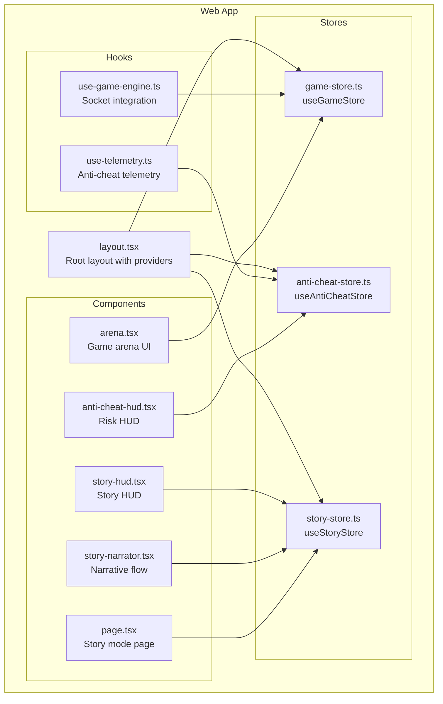
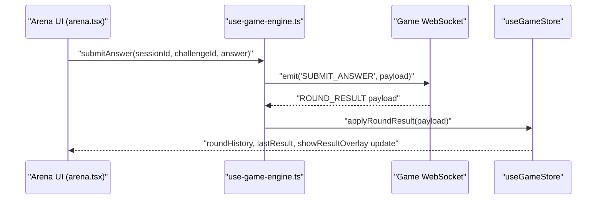
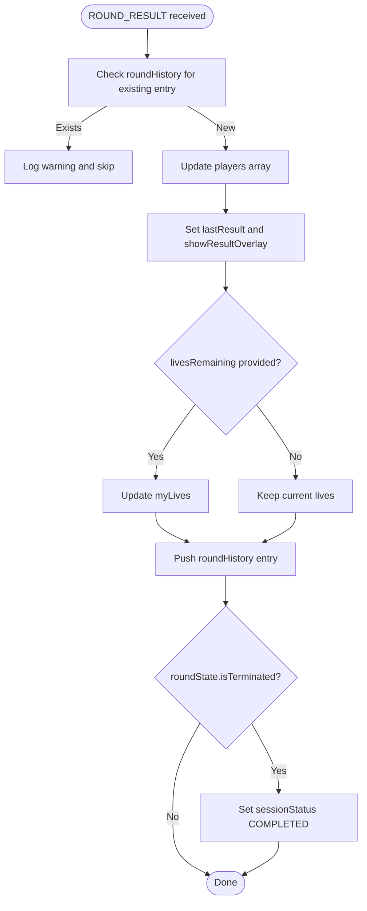
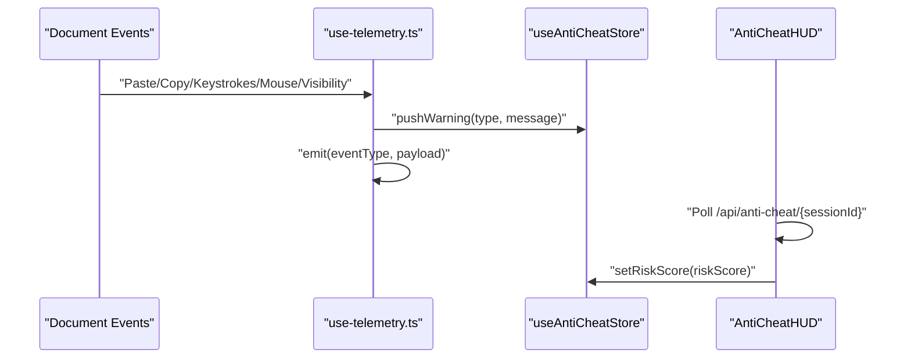
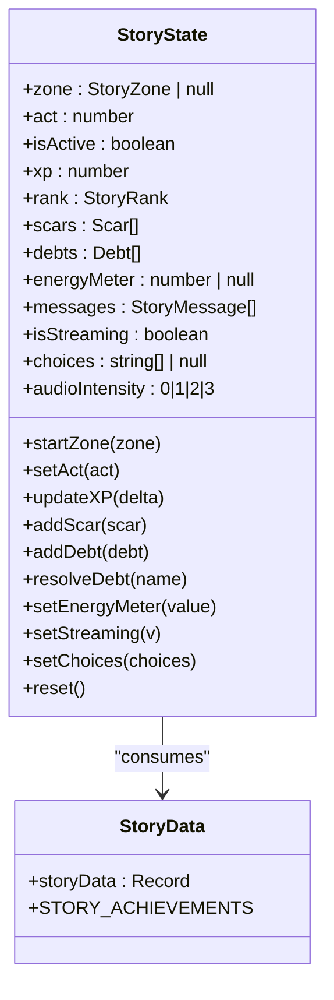
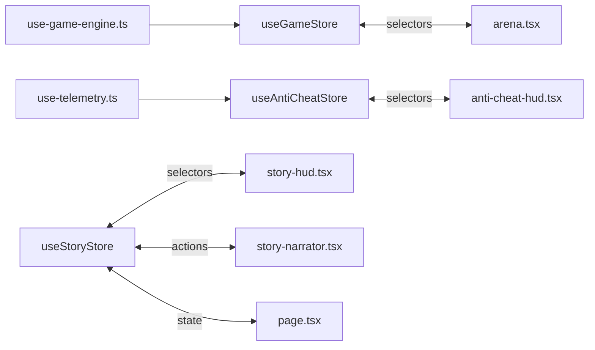

# Zustand Store Implementations

<cite>
**Referenced Files in This Document**
- [game-store.ts](file://apps/web/store/game-store.ts)
- [anti-cheat-store.ts](file://apps/web/store/anti-cheat-store.ts)
- [story-store.ts](file://apps/web/store/story-store.ts)
- [use-game-engine.ts](file://apps/web/hooks/use-game-engine.ts)
- [use-telemetry.ts](file://apps/web/hooks/use-telemetry.ts)
- [arena.tsx](file://apps/web/components/game/arena.tsx)
- [anti-cheat-hud.tsx](file://apps/web/components/game/anti-cheat-hud.tsx)
- [story-hud.tsx](file://apps/web/components/story/story-hud.tsx)
- [story-narrator.tsx](file://apps/web/components/story/story-narrator.tsx)
- [page.tsx](file://apps/web/app/(game)/story/page.tsx)
- [layout.tsx](file://apps/web/app/layout.tsx)
- [STORY_MODE.md](file://docs/STORY_MODE.md)
- [story-data.ts](file://apps/web/lib/story-data.ts)
</cite>

## Table of Contents
1. [Introduction](#introduction)
2. [Project Structure](#project-structure)
3. [Core Components](#core-components)
4. [Architecture Overview](#architecture-overview)
5. [Detailed Component Analysis](#detailed-component-analysis)
6. [Dependency Analysis](#dependency-analysis)
7. [Performance Considerations](#performance-considerations)
8. [Troubleshooting Guide](#troubleshooting-guide)
9. [Conclusion](#conclusion)

## Introduction
This document provides comprehensive documentation for the Zustand store implementations powering Logic Forge's game systems. It covers:
- Game state store architecture for session management, player tracking, round progression, and survival mode mechanics
- Anti-cheat store for telemetry monitoring and risk scoring state management
- Story mode store for narrative progression and character state tracking
- Store initialization patterns, middleware usage (Immer for immutable updates), and action dispatching mechanisms
- Examples of store subscriptions in components, state selectors for performance optimization, and store hydration for server-side rendering
- Type safety patterns, interface definitions, and state shape evolution strategies

## Project Structure
The stores are located under the web application's store directory and are consumed by dedicated hooks and UI components:
- Game store: manages live match state, timers, dual-mode telemetry, and survival mode progression
- Anti-cheat store: tracks telemetry events, maintains risk metrics, and exposes warning notifications
- Story store: orchestrates narrative flow, XP/rank progression, and character state (scars, debts, energy)

**Diagram sources**
- [layout.tsx](file://apps/web/app/layout.tsx#L32-L52)
- [game-store.ts](file://apps/web/store/game-store.ts#L221-L394)
- [anti-cheat-store.ts](file://apps/web/store/anti-cheat-store.ts#L51-L108)
- [story-store.ts](file://apps/web/store/story-store.ts#L175-L308)
- [use-game-engine.ts](file://apps/web/hooks/use-game-engine.ts#L80-L466)
- [use-telemetry.ts](file://apps/web/hooks/use-telemetry.ts#L19-L157)
- [arena.tsx](file://apps/web/components/game/arena.tsx#L48-L395)
- [anti-cheat-hud.tsx](file://apps/web/components/game/anti-cheat-hud.tsx#L29-L129)
- [story-hud.tsx](file://apps/web/components/story/story-hud.tsx#L30-L178)
- [story-narrator.tsx](file://apps/web/components/story/story-narrator.tsx#L17-L404)
- [page.tsx](file://apps/web/app/(game)/story/page.tsx#L46-L187)

**Section sources**
- [layout.tsx](file://apps/web/app/layout.tsx#L32-L52)
- [game-store.ts](file://apps/web/store/game-store.ts#L221-L394)
- [anti-cheat-store.ts](file://apps/web/store/anti-cheat-store.ts#L51-L108)
- [story-store.ts](file://apps/web/store/story-store.ts#L175-L308)

## Core Components
This section outlines the three primary Zustand stores and their responsibilities.

- Game Store (useGameStore)
  - Manages WebSocket connection state, matchmaking, session lifecycle, and round progression
  - Tracks player scores, lives, and dual-mode telemetry
  - Implements survival mode mechanics: streak tracking, bonus time, and continuation choices
  - Provides actions to apply server events and reset state

- Anti-Cheat Store (useAntiCheatStore)
  - Maintains a rolling log of warnings, event counts, and risk metrics
  - Computes risk level from numeric score thresholds
  - Exposes actions to push warnings, dismiss them, update risk, and reset state
  - Integrates with telemetry hook and periodic polling for risk updates

- Story Store (useStoryStore)
  - Drives narrative progression across zones and acts
  - Tracks XP, rank, scars, and debts; supports energy meter for specific zones
  - Manages chat-like messaging, streaming, and choice parsing
  - Provides actions to start zones, update XP, add/remove scars/debts, and manage UI overlays

**Section sources**
- [game-store.ts](file://apps/web/store/game-store.ts#L77-L141)
- [anti-cheat-store.ts](file://apps/web/store/anti-cheat-store.ts#L20-L33)
- [story-store.ts](file://apps/web/store/story-store.ts#L42-L112)

## Architecture Overview
The stores integrate with hooks and components to form a reactive, event-driven architecture:
- use-game-engine.ts connects to the game WebSocket, translates server events into store actions, and exposes convenience methods (submit answer, typing telemetry, queue management)
- use-telemetry.ts monitors user behavior and emits events to the anti-cheat store and backend
- Components subscribe to stores using narrow selectors to optimize re-renders

**Diagram sources**
- [arena.tsx](file://apps/web/components/game/arena.tsx#L127-L144)
- [use-game-engine.ts](file://apps/web/hooks/use-game-engine.ts#L298-L308)
- [use-game-engine.ts](file://apps/web/hooks/use-game-engine.ts#L194-L196)
- [game-store.ts](file://apps/web/store/game-store.ts#L286-L335)

**Section sources**
- [use-game-engine.ts](file://apps/web/hooks/use-game-engine.ts#L80-L466)
- [arena.tsx](file://apps/web/components/game/arena.tsx#L48-L395)

## Detailed Component Analysis

### Game Store: Session Management, Rounds, and Survival Mechanics
The game store encapsulates the entire lifecycle of a match:
- Session management: match status, queue state, session ID, and lobby configuration
- Round progression: challenge metadata, player snapshots, round history, and result overlay
- Dual-mode telemetry: opponent progress and live telemetry
- Survival mode: streak tracking, total wins, bonus time, and continuation choices

Key implementation patterns:
- Immer middleware enables concise, immutable updates
- Payload-driven actions ensure deterministic state transitions
- Offsets and guards prevent race conditions during round end and session completion

**Diagram sources**
- [game-store.ts](file://apps/web/store/game-store.ts#L286-L335)

**Section sources**
- [game-store.ts](file://apps/web/store/game-store.ts#L77-L141)
- [game-store.ts](file://apps/web/store/game-store.ts#L191-L219)
- [game-store.ts](file://apps/web/store/game-store.ts#L221-L394)

### Anti-Cheat Store: Telemetry Monitoring and Risk Scoring
The anti-cheat store centralizes detection and risk management:
- Rolling warning buffer capped at a fixed length
- Event counters per event type
- Risk score and computed risk level
- Session-scoped resets to clear state on session changes

Integration points:
- use-telemetry.ts pushes warnings and emits events to the backend
- AntiCheatHUD periodically polls risk score and renders warnings with auto-dismiss

**Diagram sources**
- [use-telemetry.ts](file://apps/web/hooks/use-telemetry.ts#L35-L54)
- [use-telemetry.ts](file://apps/web/hooks/use-telemetry.ts#L73-L85)
- [anti-cheat-hud.tsx](file://apps/web/components/game/anti-cheat-hud.tsx#L37-L57)
- [anti-cheat-store.ts](file://apps/web/store/anti-cheat-store.ts#L51-L108)

**Section sources**
- [anti-cheat-store.ts](file://apps/web/store/anti-cheat-store.ts#L20-L33)
- [anti-cheat-store.ts](file://apps/web/store/anti-cheat-store.ts#L51-L108)
- [use-telemetry.ts](file://apps/web/hooks/use-telemetry.ts#L19-L157)
- [anti-cheat-hud.tsx](file://apps/web/components/game/anti-cheat-hud.tsx#L29-L129)

### Story Store: Narrative Progression and Character State
The story store coordinates narrative flow and character development:
- Zone selection and act progression
- XP and rank computation with streak bonuses
- Scars and debts with delayed triggers
- Energy meter for specific zones
- Streaming narrative and choice parsing

**Diagram sources**
- [story-store.ts](file://apps/web/store/story-store.ts#L42-L112)
- [story-store.ts](file://apps/web/store/story-store.ts#L175-L308)
- [story-data.ts](file://apps/web/lib/story-data.ts#L56-L82)

**Section sources**
- [story-store.ts](file://apps/web/store/story-store.ts#L42-L112)
- [story-store.ts](file://apps/web/store/story-store.ts#L139-L171)
- [story-store.ts](file://apps/web/store/story-store.ts#L175-L308)
- [STORY_MODE.md](file://docs/STORY_MODE.md#L239-L331)
- [story-data.ts](file://apps/web/lib/story-data.ts#L56-L82)

## Dependency Analysis
Store-to-component and hook relationships:
- Arena UI subscribes to game store using narrow selectors for performance
- AntiCheatHUD subscribes to anti-cheat store for risk and warnings
- StoryHud subscribes to story store for XP, rank, and energy
- StoryNarrator orchestrates story store actions based on parsed choices
- Story page coordinates navigation and overlays

**Diagram sources**
- [arena.tsx](file://apps/web/components/game/arena.tsx#L69-L117)
- [anti-cheat-hud.tsx](file://apps/web/components/game/anti-cheat-hud.tsx#L30-L35)
- [story-hud.tsx](file://apps/web/components/story/story-hud.tsx#L31-L42)
- [story-narrator.tsx](file://apps/web/components/story/story-narrator.tsx#L17-L42)
- [page.tsx](file://apps/web/app/(game)/story/page.tsx#L46-L63)
- [use-game-engine.ts](file://apps/web/hooks/use-game-engine.ts#L105-L111)
- [use-telemetry.ts](file://apps/web/hooks/use-telemetry.ts#L28-L29)

**Section sources**
- [arena.tsx](file://apps/web/components/game/arena.tsx#L69-L117)
- [anti-cheat-hud.tsx](file://apps/web/components/game/anti-cheat-hud.tsx#L30-L35)
- [story-hud.tsx](file://apps/web/components/story/story-hud.tsx#L31-L42)
- [story-narrator.tsx](file://apps/web/components/story/story-narrator.tsx#L17-L42)
- [page.tsx](file://apps/web/app/(game)/story/page.tsx#L46-L63)

## Performance Considerations
- Narrow selectors: Components subscribe to only the fields they need (e.g., roundHistory, config, survivalActive) to minimize re-renders
- Immer middleware: Enables immutable updates with minimal boilerplate and reduces accidental mutations
- Throttled telemetry: Typing telemetry emissions are throttled to reduce network overhead
- Auto-dismiss warnings: Oldest warnings are dismissed automatically to keep the buffer bounded
- Memoized computations: XP progress calculations and rank thresholds are computed efficiently

[No sources needed since this section provides general guidance]

## Troubleshooting Guide
Common issues and resolutions:
- Session mismatch or missing userId: Ensure the session context provides a valid identifier; the game engine identifies the user upon connection and re-identification
- Round result ordering: The store guards against duplicate round history entries and waits for the final round result before applying session end
- Anti-cheat HUD not updating: Verify session ID is set and the polling endpoint returns a numeric risk score
- Story narrative stalls: Confirm that choices are parsed from the latest assistant message and that the store's streaming state is properly toggled

**Section sources**
- [use-game-engine.ts](file://apps/web/hooks/use-game-engine.ts#L133-L131)
- [use-game-engine.ts](file://apps/web/hooks/use-game-engine.ts#L180-L183)
- [game-store.ts](file://apps/web/store/game-store.ts#L297-L303)
- [anti-cheat-hud.tsx](file://apps/web/components/game/anti-cheat-hud.tsx#L37-L57)
- [story-narrator.tsx](file://apps/web/components/story/story-narrator.tsx#L109-L165)

## Conclusion
The Zustand stores in Logic Forge provide a robust, type-safe foundation for game and narrative systems. They leverage Immer for clean state updates, narrow selectors for optimal performance, and event-driven integrations for real-time gameplay and storytelling. The modular architecture allows for incremental evolution of state shapes while maintaining backward compatibility and predictable behavior across components.