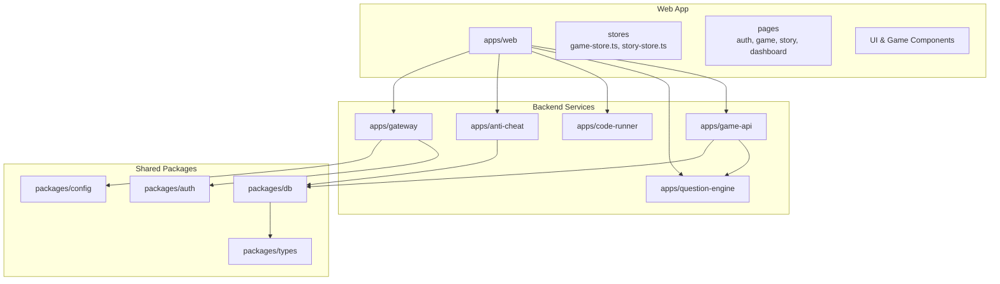
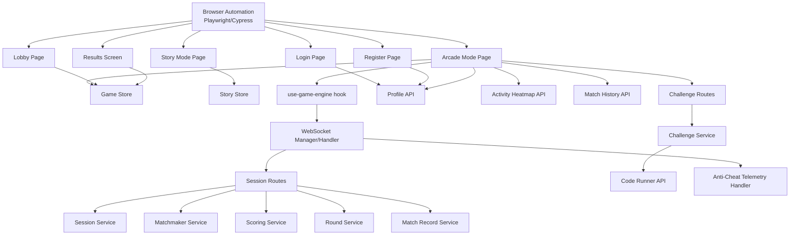
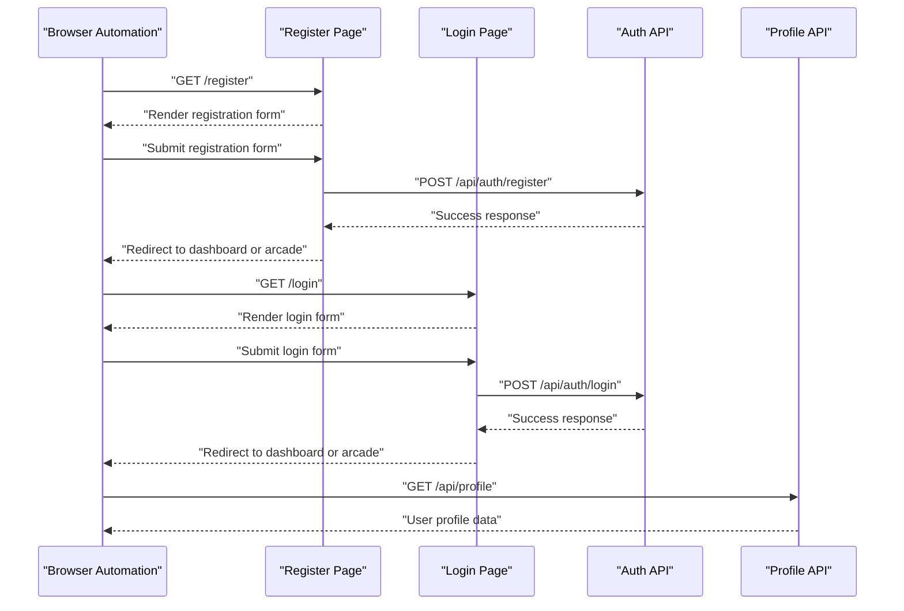
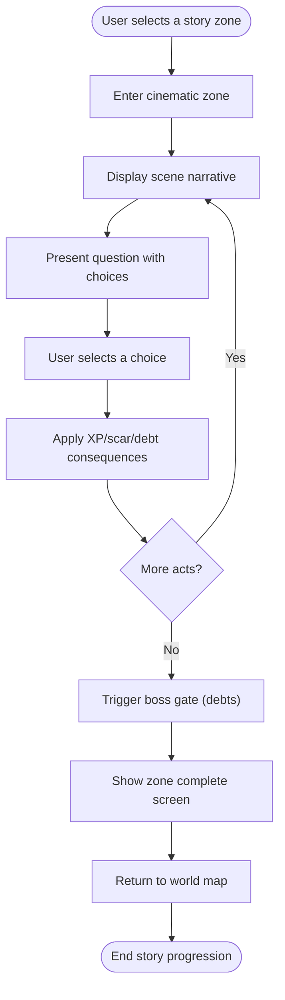
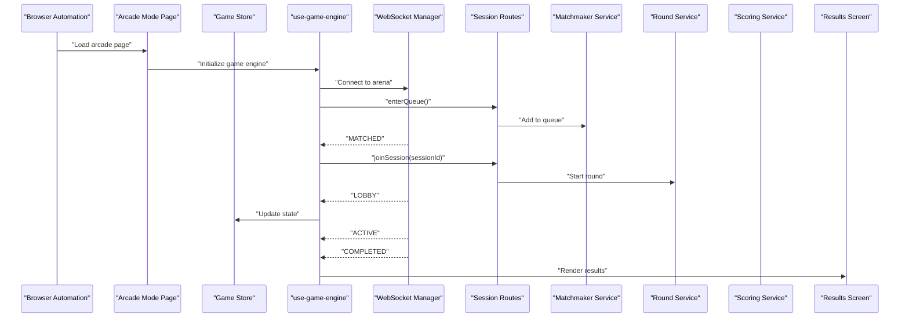
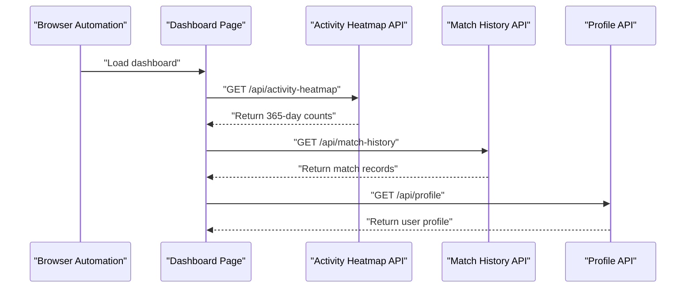
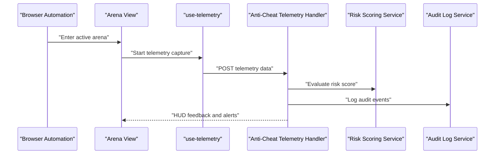
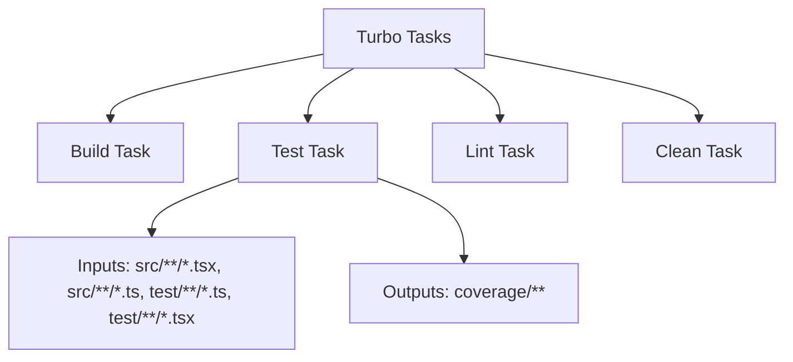

# End-to-End Testing

<cite>
**Referenced Files in This Document**
- [package.json](file://package.json)
- [turbo.json](file://turbo.json)
- [pnpm-lock.yaml](file://pnpm-lock.yaml)
- [README.md](file://README.md)
- [apps/web/app/(auth)/login/page.tsx](file://apps/web/app/(auth)/login/page.tsx)
- [apps/web/app/(auth)/register/page.tsx](file://apps/web/app/(auth)/register/page.tsx)
- [apps/web/app/(game)/arcade/page.tsx](file://apps/web/app/(game)/arcade/page.tsx)
- [apps/web/app/(game)/lobby/page.tsx](file://apps/web/app/(game)/lobby/page.tsx)
- [apps/web/components/game/lobby.tsx](file://apps/web/components/game/lobby.tsx)
- [apps/web/app/(game)/results/results-screen.tsx](file://apps/web/app/(game)/results/results-screen.tsx)
- [apps/web/app/(game)/story/page.tsx](file://apps/web/app/(game)/story/page.tsx)
- [apps/web/app/dashboard/page.tsx](file://apps/web/app/dashboard/page.tsx)
- [apps/web/app/api/activity-heatmap/route.ts](file://apps/web/app/api/activity-heatmap/route.ts)
- [apps/web/app/api/profile/route.ts](file://apps/web/app/api/profile/route.ts)
- [apps/web/app/api/match-history/route.ts](file://apps/web/app/api/match-history/route.ts)
- [apps/web/store/game-store.ts](file://apps/web/store/game-store.ts)
- [apps/web/store/story-store.ts](file://apps/web/store/story-store.ts)
- [apps/web/hooks/use-game-engine.ts](file://apps/web/hooks/use-game-engine.ts)
- [apps/web/hooks/use-telemetry.ts](file://apps/web/hooks/use-telemetry.ts)
- [apps/web/lib/story-data.ts](file://apps/web/lib/story-data.ts)
- [apps/web/components/story/world-map.tsx](file://apps/web/components/story/world-map.tsx)
- [apps/web/components/story/zone-selector.tsx](file://apps/web/components/story/zone-selector.tsx)
- [apps/web/components/story/narrative-panel.tsx](file://apps/web/components/story/narrative-panel.tsx)
- [apps/web/components/story/choice-cards.tsx](file://apps/web/components/story/choice-cards.tsx)
- [apps/web/components/story/consequence-overlay.tsx](file://apps/web/components/story/consequence-overlay.tsx)
- [apps/web/components/story/boss-gate-transition.tsx](file://apps/web/components/story/boss-gate-transition.tsx)
- [apps/web/components/story/zone-complete-screen.tsx](file://apps/web/components/story/zone-complete-screen.tsx)
- [apps/web/components/dashboard/MatchHistorySection.tsx](file://apps/web/components/dashboard/MatchHistorySection.tsx)
- [apps/web/components/dashboard/MatchHistoryTable.tsx](file://apps/web/components/dashboard/MatchHistoryTable.tsx)
- [apps/web/components/ui/button.tsx](file://apps/web/components/ui/button.tsx)
- [apps/web/components/ui/input.tsx](file://apps/web/components/ui/input.tsx)
- [apps/web/components/ui/dialog.tsx](file://apps/web/components/ui/dialog.tsx)
- [apps/web/components/ui/dropdown-menu.tsx](file://apps/web/components/ui/dropdown-menu.tsx)
- [apps/web/components/ui/toast.tsx](file://apps/web/components/ui/toast.tsx)
- [apps/web/components/ui/toaster.tsx](file://apps/web/components/ui/toaster.tsx)
- [apps/web/auth.ts](file://apps/web/auth.ts)
- [apps/web/auth.config.ts](file://apps/web/auth.config.ts)
- [apps/web/middleware.ts](file://apps/web/middleware.ts)
- [apps/web/app/layout.tsx](file://apps/web/app/layout.tsx)
- [apps/web/app/globals.css](file://apps/web/app/globals.css)
- [apps/web/next.config.mjs](file://apps/web/next.config.mjs)
- [apps/web/tsconfig.json](file://apps/web/tsconfig.json)
- [apps/web/Dockerfile](file://apps/web/Dockerfile)
- [apps/web/.env](file://apps/web/.env)
- [apps/web/.env.example](file://apps/web/.env.example)
- [apps/game-api/src/index.ts](file://apps/game-api/src/index.ts)
- [apps/game-api/src/app.ts](file://apps/game-api/src/app.ts)
- [apps/game-api/src/routes/session.routes.ts](file://apps/game-api/src/routes/session.routes.ts)
- [apps/game-api/src/services/session.service.ts](file://apps/game-api/src/services/session.service.ts)
- [apps/game-api/src/services/matchmaker.service.ts](file://apps/game-api/src/services/matchmaker.service.ts)
- [apps/game-api/src/services/scoring.service.ts](file://apps/game-api/src/services/scoring.service.ts)
- [apps/game-api/src/services/round.service.ts](file://apps/game-api/src/services/round.service.ts)
- [apps/game-api/src/services/match-record.service.ts](file://apps/game-api/src/services/match-record.service.ts)
- [apps/game-api/src/websocket/socket.handler.ts](file://apps/game-api/src/websocket/socket.handler.ts)
- [apps/game-api/src/websocket/socket.manager.ts](file://apps/game-api/src/websocket/socket.manager.ts)
- [apps/anti-cheat/src/index.ts](file://apps/anti-cheat/src/index.ts)
- [apps/anti-cheat/src/handlers/telemetry.handler.ts](file://apps/anti-cheat/src/handlers/telemetry.handler.ts)
- [apps/anti-cheat/src/services/audit-log.service.ts](file://apps/anti-cheat/src/services/audit-log.service.ts)
- [apps/anti-cheat/src/services/risk-scoring.service.ts](file://apps/anti-cheat/src/services/risk-scoring.service.ts)
- [apps/question-engine/src/index.ts](file://apps/question-engine/src/index.ts)
- [apps/question-engine/src/routes/challenge.routes.ts](file://apps/question-engine/src/routes/challenge.routes.ts)
- [apps/question-engine/src/services/challenge.service.ts](file://apps/question-engine/src/services/challenge.service.ts)
- [apps/question-engine/src/services/seed.service.ts](file://apps/question-engine/src/services/seed.service.ts)
- [apps/question-engine/src/randomizer/semantic.randomizer.ts](file://apps/question-engine/src/randomizer/semantic.randomizer.ts)
- [apps/question-engine/data/challenges/bottleneck-breaker.json](file://apps/question-engine/data/challenges/bottleneck-breaker.json)
- [apps/question-engine/data/challenges/missing-link.json](file://apps/question-engine/data/challenges/missing-link.json)
- [apps/question-engine/data/challenges/state-tracing.json](file://apps/question-engine/data/challenges/state-tracing.json)
- [apps/question-engine/data/challenges/syntax-error.json](file://apps/question-engine/data/challenges/syntax-error.json)
- [apps/code-runner/cmd/server/main.go](file://apps/code-runner/cmd/server/main.go)
- [apps/code-runner/api/execute.go](file://apps/code-runner/api/execute.go)
- [apps/code-runner/executor/pipeline.go](file://apps/code-runner/executor/pipeline.go)
- [apps/code-runner/languages/cpp.go](file://apps/code-runner/languages/cpp.go)
- [apps/code-runner/languages/java.go](file://apps/code-runner/languages/java.go)
- [apps/code-runner/languages/python.go](file://apps/code-runner/languages/python.go)
- [apps/code-runner/sandbox/runner.go](file://apps/code-runner/sandbox/runner.go)
- [apps/gateway/src/index.ts](file://apps/gateway/src/index.ts)
- [apps/gateway/src/proxy.ts](file://apps/gateway/src/proxy.ts)
- [apps/gateway/src/middleware/auth.ts](file://apps/gateway/src/middleware/auth.ts)
- [apps/gateway/src/middleware/logger.ts](file://apps/gateway/src/middleware/logger.ts)
- [apps/gateway/src/middleware/rate-limit.ts](file://apps/gateway/src/middleware/rate-limit.ts)
- [apps/gateway/src/redis.ts](file://apps/gateway/src/redis.ts)
- [packages/db/src/mongoose-auth.ts](file://packages/db/src/mongoose-auth.ts)
- [packages/auth/package.json](file://packages/auth/package.json)
- [packages/config/package.json](file://packages/config/package.json)
- [packages/db/package.json](file://packages/db/package.json)
- [packages/types/package.json](file://packages/types/package.json)
- [docker-compose.yml](file://docker-compose.yml)
- [docker-compose.prod.yml](file://docker-compose.prod.yml)
- [Makefile](file://Makefile)
- [DEBUGGING_GUIDE.md](file://DEBUGGING_GUIDE.md)
- [docs/STORY_MODE.md](file://docs/STORY_MODE.md)
</cite>

## Table of Contents
1. [Introduction](#introduction)
2. [Project Structure](#project-structure)
3. [Core Components](#core-components)
4. [Architecture Overview](#architecture-overview)
5. [Detailed Component Analysis](#detailed-component-analysis)
6. [Dependency Analysis](#dependency-analysis)
7. [Performance Considerations](#performance-considerations)
8. [Troubleshooting Guide](#troubleshooting-guide)
9. [Conclusion](#conclusion)
10. [Appendices](#appendices)

## Introduction
This document defines an end-to-end testing strategy for the Logic Forge platform. It covers complete user workflows from registration and authentication through story mode progression, matchmaking, live game sessions, and results processing. It also documents dashboard interactions, administrative functions, browser automation setup, UI testing, and real-time feature validation. Guidance is provided for test data management, user role testing, and performance validation across full workflows.

## Project Structure
The platform is a Next.js web application (apps/web) integrated with backend microservices:
- Web application with pages, components, stores, and hooks
- Game API service for sessions, matchmaking, scoring, and WebSocket
- Question Engine for challenges and seeds
- Code Runner for executing candidate solutions
- Anti-Cheat service for telemetry and risk scoring
- Gateway for routing and auth
- Shared packages for database, auth, config, types

**Diagram sources**
- [apps/web/app/layout.tsx](file://apps/web/app/layout.tsx#L1-L200)
- [apps/game-api/src/app.ts](file://apps/game-api/src/app.ts#L1-L200)
- [apps/question-engine/src/index.ts](file://apps/question-engine/src/index.ts#L1-L200)
- [apps/code-runner/cmd/server/main.go](file://apps/code-runner/cmd/server/main.go#L1-L200)
- [apps/anti-cheat/src/index.ts](file://apps/anti-cheat/src/index.ts#L1-L200)
- [apps/gateway/src/index.ts](file://apps/gateway/src/index.ts#L1-L200)
- [packages/db/package.json](file://packages/db/package.json#L1-L200)
- [packages/auth/package.json](file://packages/auth/package.json#L1-L200)
- [packages/config/package.json](file://packages/config/package.json#L1-L200)
- [packages/types/package.json](file://packages/types/package.json#L1-L200)

**Section sources**
- [apps/web/app/layout.tsx](file://apps/web/app/layout.tsx#L1-L200)
- [turbo.json](file://turbo.json#L1-L45)
- [package.json](file://package.json#L1-L22)

## Core Components
Key testing components and their roles:
- Authentication pages: Registration and Login pages under the auth route group
- Game engine and stores: Game store and story store orchestrate UI state and lifecycle
- Hooks: use-game-engine manages WebSocket connections and session transitions
- Real-time: WebSocket handlers and managers coordinate live gameplay
- APIs: Profile, activity heatmap, match history, and story chat endpoints
- Story mode: World map, zone selector, narrative panel, choice cards, overlays, and boss gate transitions
- Dashboard: Match history section and table, activity heatmap endpoint

**Section sources**
- [apps/web/app/(auth)/login/page.tsx](file://apps/web/app/(auth)/login/page.tsx#L1-L200)
- [apps/web/app/(auth)/register/page.tsx](file://apps/web/app/(auth)/register/page.tsx#L1-L200)
- [apps/web/store/game-store.ts](file://apps/web/store/game-store.ts#L1-L200)
- [apps/web/store/story-store.ts](file://apps/web/store/story-store.ts#L1-L200)
- [apps/web/hooks/use-game-engine.ts](file://apps/web/hooks/use-game-engine.ts#L1-L200)
- [apps/web/app/api/activity-heatmap/route.ts](file://apps/web/app/api/activity-heatmap/route.ts#L1-L42)
- [apps/web/app/api/profile/route.ts](file://apps/web/app/api/profile/route.ts#L1-L200)
- [apps/web/app/api/match-history/route.ts](file://apps/web/app/api/match-history/route.ts#L1-L200)
- [apps/web/components/story/world-map.tsx](file://apps/web/components/story/world-map.tsx#L1-L200)
- [apps/web/components/story/zone-selector.tsx](file://apps/web/components/story/zone-selector.tsx#L1-L200)
- [apps/web/components/story/narrative-panel.tsx](file://apps/web/components/story/narrative-panel.tsx#L1-L200)
- [apps/web/components/story/choice-cards.tsx](file://apps/web/components/story/choice-cards.tsx#L1-L200)
- [apps/web/components/story/consequence-overlay.tsx](file://apps/web/components/story/consequence-overlay.tsx#L1-L200)
- [apps/web/components/story/boss-gate-transition.tsx](file://apps/web/components/story/boss-gate-transition.tsx#L1-L200)
- [apps/web/components/story/zone-complete-screen.tsx](file://apps/web/components/story/zone-complete-screen.tsx#L1-L200)
- [apps/web/components/dashboard/MatchHistorySection.tsx](file://apps/web/components/dashboard/MatchHistorySection.tsx#L1-L200)
- [apps/web/components/dashboard/MatchHistoryTable.tsx](file://apps/web/components/dashboard/MatchHistoryTable.tsx#L1-L200)

## Architecture Overview
End-to-end flows span the web UI, gateway, and backend services. The diagram below maps major components involved in typical assessment workflows.

**Diagram sources**
- [apps/web/app/(auth)/login/page.tsx](file://apps/web/app/(auth)/login/page.tsx#L1-L200)
- [apps/web/app/(auth)/register/page.tsx](file://apps/web/app/(auth)/register/page.tsx#L1-L200)
- [apps/web/app/(game)/arcade/page.tsx](file://apps/web/app/(game)/arcade/page.tsx#L1-L200)
- [apps/web/app/(game)/lobby/page.tsx](file://apps/web/app/(game)/lobby/page.tsx#L1-L200)
- [apps/web/app/(game)/results/results-screen.tsx](file://apps/web/app/(game)/results/results-screen.tsx#L1-L200)
- [apps/web/app/(game)/story/page.tsx](file://apps/web/app/(game)/story/page.tsx#L1-L200)
- [apps/web/store/game-store.ts](file://apps/web/store/game-store.ts#L1-L200)
- [apps/web/store/story-store.ts](file://apps/web/store/story-store.ts#L1-L200)
- [apps/web/hooks/use-game-engine.ts](file://apps/web/hooks/use-game-engine.ts#L1-L200)
- [apps/game-api/src/routes/session.routes.ts](file://apps/game-api/src/routes/session.routes.ts#L1-L200)
- [apps/game-api/src/services/session.service.ts](file://apps/game-api/src/services/session.service.ts#L1-L200)
- [apps/game-api/src/services/matchmaker.service.ts](file://apps/game-api/src/services/matchmaker.service.ts#L1-L200)
- [apps/game-api/src/services/scoring.service.ts](file://apps/game-api/src/services/scoring.service.ts#L1-L200)
- [apps/game-api/src/services/round.service.ts](file://apps/game-api/src/services/round.service.ts#L1-L200)
- [apps/game-api/src/services/match-record.service.ts](file://apps/game-api/src/services/match-record.service.ts#L1-L200)
- [apps/game-api/src/websocket/socket.manager.ts](file://apps/game-api/src/websocket/socket.manager.ts#L1-L200)
- [apps/game-api/src/websocket/socket.handler.ts](file://apps/game-api/src/websocket/socket.handler.ts#L1-L200)
- [apps/question-engine/src/routes/challenge.routes.ts](file://apps/question-engine/src/routes/challenge.routes.ts#L1-L200)
- [apps/question-engine/src/services/challenge.service.ts](file://apps/question-engine/src/services/challenge.service.ts#L1-L200)
- [apps/code-runner/api/execute.go](file://apps/code-runner/api/execute.go#L1-L200)
- [apps/anti-cheat/src/handlers/telemetry.handler.ts](file://apps/anti-cheat/src/handlers/telemetry.handler.ts#L1-L200)
- [apps/web/app/api/profile/route.ts](file://apps/web/app/api/profile/route.ts#L1-L200)
- [apps/web/app/api/activity-heatmap/route.ts](file://apps/web/app/api/activity-heatmap/route.ts#L1-L42)
- [apps/web/app/api/match-history/route.ts](file://apps/web/app/api/match-history/route.ts#L1-L200)

## Detailed Component Analysis

### Authentication Workflows
Testing scenarios:
- Registration flow: Navigate to registration, submit valid form, verify success redirection and session persistence
- Login flow: Navigate to login, submit credentials, verify redirect to dashboard or arcade, session cookie/token validity
- Logout flow: Trigger logout via UI, verify session invalidation and redirect to login

**Diagram sources**
- [apps/web/app/(auth)/register/page.tsx](file://apps/web/app/(auth)/register/page.tsx#L1-L200)
- [apps/web/app/(auth)/login/page.tsx](file://apps/web/app/(auth)/login/page.tsx#L1-L200)
- [apps/web/app/api/profile/route.ts](file://apps/web/app/api/profile/route.ts#L1-L200)
- [apps/web/auth.ts](file://apps/web/auth.ts#L1-L200)
- [apps/web/auth.config.ts](file://apps/web/auth.config.ts#L1-L200)

**Section sources**
- [apps/web/app/(auth)/register/page.tsx](file://apps/web/app/(auth)/register/page.tsx#L1-L200)
- [apps/web/app/(auth)/login/page.tsx](file://apps/web/app/(auth)/login/page.tsx#L1-L200)
- [apps/web/app/api/profile/route.ts](file://apps/web/app/api/profile/route.ts#L1-L200)
- [apps/web/auth.ts](file://apps/web/auth.ts#L1-L200)
- [apps/web/auth.config.ts](file://apps/web/auth.config.ts#L1-L200)

### Story Mode Progression
Testing scenarios:
- Zone selection and cinematic entry
- Scene display and question presentation
- Choice selection and consequence overlay
- Boss gate transitions and zone completion
- Rank-up overlays and achievements panel

**Diagram sources**
- [apps/web/app/(game)/story/page.tsx](file://apps/web/app/(game)/story/page.tsx#L1-L200)
- [apps/web/components/story/world-map.tsx](file://apps/web/components/story/world-map.tsx#L1-L200)
- [apps/web/components/story/zone-selector.tsx](file://apps/web/components/story/zone-selector.tsx#L1-L200)
- [apps/web/components/story/narrative-panel.tsx](file://apps/web/components/story/narrative-panel.tsx#L1-L200)
- [apps/web/components/story/choice-cards.tsx](file://apps/web/components/story/choice-cards.tsx#L1-L200)
- [apps/web/components/story/consequence-overlay.tsx](file://apps/web/components/story/consequence-overlay.tsx#L1-L200)
- [apps/web/components/story/boss-gate-transition.tsx](file://apps/web/components/story/boss-gate-transition.tsx#L1-L200)
- [apps/web/components/story/zone-complete-screen.tsx](file://apps/web/components/story/zone-complete-screen.tsx#L1-L200)
- [apps/web/lib/story-data.ts](file://apps/web/lib/story-data.ts#L1-L200)
- [docs/STORY_MODE.md](file://docs/STORY_MODE.md#L112-L148)

**Section sources**
- [apps/web/app/(game)/story/page.tsx](file://apps/web/app/(game)/story/page.tsx#L1-L200)
- [apps/web/components/story/world-map.tsx](file://apps/web/components/story/world-map.tsx#L1-L200)
- [apps/web/components/story/zone-selector.tsx](file://apps/web/components/story/zone-selector.tsx#L1-L200)
- [apps/web/components/story/narrative-panel.tsx](file://apps/web/components/story/narrative-panel.tsx#L1-L200)
- [apps/web/components/story/choice-cards.tsx](file://apps/web/components/story/choice-cards.tsx#L1-L200)
- [apps/web/components/story/consequence-overlay.tsx](file://apps/web/components/story/consequence-overlay.tsx#L1-L200)
- [apps/web/components/story/boss-gate-transition.tsx](file://apps/web/components/story/boss-gate-transition.tsx#L1-L200)
- [apps/web/components/story/zone-complete-screen.tsx](file://apps/web/components/story/zone-complete-screen.tsx#L1-L200)
- [apps/web/lib/story-data.ts](file://apps/web/lib/story-data.ts#L1-L200)
- [docs/STORY_MODE.md](file://docs/STORY_MODE.md#L112-L148)

### Matchmaking and Game Sessions
Testing scenarios:
- Queue entry and auto-retry join attempts
- Opponent discovery and readiness
- Lobby interactions and session transitions
- Live arena gameplay and results processing

**Diagram sources**
- [apps/web/app/(game)/arcade/page.tsx](file://apps/web/app/(game)/arcade/page.tsx#L1-L200)
- [apps/web/app/(game)/lobby/page.tsx](file://apps/web/app/(game)/lobby/page.tsx#L1-L200)
- [apps/web/components/game/lobby.tsx](file://apps/web/components/game/lobby.tsx#L1-L200)
- [apps/web/store/game-store.ts](file://apps/web/store/game-store.ts#L1-L200)
- [apps/web/hooks/use-game-engine.ts](file://apps/web/hooks/use-game-engine.ts#L1-L200)
- [apps/game-api/src/routes/session.routes.ts](file://apps/game-api/src/routes/session.routes.ts#L1-L200)
- [apps/game-api/src/services/matchmaker.service.ts](file://apps/game-api/src/services/matchmaker.service.ts#L1-L200)
- [apps/game-api/src/services/round.service.ts](file://apps/game-api/src/services/round.service.ts#L1-L200)
- [apps/game-api/src/services/scoring.service.ts](file://apps/game-api/src/services/scoring.service.ts#L1-L200)
- [apps/game-api/src/websocket/socket.manager.ts](file://apps/game-api/src/websocket/socket.manager.ts#L1-L200)
- [apps/game-api/src/websocket/socket.handler.ts](file://apps/game-api/src/websocket/socket.handler.ts#L1-L200)
- [apps/web/app/(game)/results/results-screen.tsx](file://apps/web/app/(game)/results/results-screen.tsx#L1-L200)

**Section sources**
- [apps/web/app/(game)/arcade/page.tsx](file://apps/web/app/(game)/arcade/page.tsx#L1-L200)
- [apps/web/app/(game)/lobby/page.tsx](file://apps/web/app/(game)/lobby/page.tsx#L1-L200)
- [apps/web/components/game/lobby.tsx](file://apps/web/components/game/lobby.tsx#L1-L200)
- [apps/web/store/game-store.ts](file://apps/web/store/game-store.ts#L1-L200)
- [apps/web/hooks/use-game-engine.ts](file://apps/web/hooks/use-game-engine.ts#L1-L200)
- [apps/game-api/src/routes/session.routes.ts](file://apps/game-api/src/routes/session.routes.ts#L1-L200)
- [apps/game-api/src/services/matchmaker.service.ts](file://apps/game-api/src/services/matchmaker.service.ts#L1-L200)
- [apps/game-api/src/services/round.service.ts](file://apps/game-api/src/services/round.service.ts#L1-L200)
- [apps/game-api/src/services/scoring.service.ts](file://apps/game-api/src/services/scoring.service.ts#L1-L200)
- [apps/game-api/src/websocket/socket.manager.ts](file://apps/game-api/src/websocket/socket.manager.ts#L1-L200)
- [apps/game-api/src/websocket/socket.handler.ts](file://apps/game-api/src/websocket/socket.handler.ts#L1-L200)
- [apps/web/app/(game)/results/results-screen.tsx](file://apps/web/app/(game)/results/results-screen.tsx#L1-L200)

### Dashboard Interactions and Administrative Functions
Testing scenarios:
- Activity heatmap rendering and data validation
- Match history retrieval and pagination
- Profile updates and verification
- Administrative dashboards (conceptual)

**Diagram sources**
- [apps/web/app/dashboard/page.tsx](file://apps/web/app/dashboard/page.tsx#L1-L200)
- [apps/web/app/api/activity-heatmap/route.ts](file://apps/web/app/api/activity-heatmap/route.ts#L1-L42)
- [apps/web/app/api/match-history/route.ts](file://apps/web/app/api/match-history/route.ts#L1-L200)
- [apps/web/app/api/profile/route.ts](file://apps/web/app/api/profile/route.ts#L1-L200)

**Section sources**
- [apps/web/app/dashboard/page.tsx](file://apps/web/app/dashboard/page.tsx#L1-L200)
- [apps/web/app/api/activity-heatmap/route.ts](file://apps/web/app/api/activity-heatmap/route.ts#L1-L42)
- [apps/web/app/api/match-history/route.ts](file://apps/web/app/api/match-history/route.ts#L1-L200)
- [apps/web/app/api/profile/route.ts](file://apps/web/app/api/profile/route.ts#L1-L200)

### Anti-Cheat and Real-Time Validation
Testing scenarios:
- Telemetry submission during sessions
- Risk scoring triggers and audit logs
- Anti-cheat HUD visibility and alerts

**Diagram sources**
- [apps/web/hooks/use-telemetry.ts](file://apps/web/hooks/use-telemetry.ts#L1-L200)
- [apps/anti-cheat/src/handlers/telemetry.handler.ts](file://apps/anti-cheat/src/handlers/telemetry.handler.ts#L1-L200)
- [apps/anti-cheat/src/services/risk-scoring.service.ts](file://apps/anti-cheat/src/services/risk-scoring.service.ts#L1-L200)
- [apps/anti-cheat/src/services/audit-log.service.ts](file://apps/anti-cheat/src/services/audit-log.service.ts#L1-L200)

**Section sources**
- [apps/web/hooks/use-telemetry.ts](file://apps/web/hooks/use-telemetry.ts#L1-L200)
- [apps/anti-cheat/src/handlers/telemetry.handler.ts](file://apps/anti-cheat/src/handlers/telemetry.handler.ts#L1-L200)
- [apps/anti-cheat/src/services/risk-scoring.service.ts](file://apps/anti-cheat/src/services/risk-scoring.service.ts#L1-L200)
- [apps/anti-cheat/src/services/audit-log.service.ts](file://apps/anti-cheat/src/services/audit-log.service.ts#L1-L200)

## Dependency Analysis
Testing dependencies and build/test tasks:
- Turbo tasks define caching, inputs, and outputs for test execution
- Vitest and Testing Library are present in lockfile indicating framework availability
- Next.js app configuration supports E2E testing environments

**Diagram sources**
- [turbo.json](file://turbo.json#L1-L45)
- [pnpm-lock.yaml](file://pnpm-lock.yaml#L3900-L3921)

**Section sources**
- [turbo.json](file://turbo.json#L1-L45)
- [pnpm-lock.yaml](file://pnpm-lock.yaml#L3900-L3921)
- [package.json](file://package.json#L1-L22)

## Performance Considerations
- Use headless browser automation for speed and scalability
- Mock external services (e.g., WebSocket, Code Runner) to isolate UI and API latency
- Parallelize independent test suites per domain (auth, story, arcade)
- Cache static assets and reuse authenticated sessions within a test suite
- Monitor real-time metrics (latency, throughput) during arena sessions
- Validate database queries and API response times for heatmap and match history

## Troubleshooting Guide
Common issues and resolutions:
- Authentication failures: Verify auth provider configuration and session persistence
- WebSocket connection drops: Confirm arena connectivity and retry logic
- Story mode stalls: Check narrative panel rendering and choice card interactions
- Dashboard data gaps: Validate heatmap date range and match history filters
- Anti-cheat HUD not updating: Ensure telemetry hook is active and handler responds

**Section sources**
- [apps/web/auth.ts](file://apps/web/auth.ts#L1-L200)
- [apps/web/hooks/use-game-engine.ts](file://apps/web/hooks/use-game-engine.ts#L1-L200)
- [apps/web/hooks/use-telemetry.ts](file://apps/web/hooks/use-telemetry.ts#L1-L200)
- [apps/web/app/api/activity-heatmap/route.ts](file://apps/web/app/api/activity-heatmap/route.ts#L1-L42)
- [apps/web/app/api/match-history/route.ts](file://apps/web/app/api/match-history/route.ts#L1-L200)

## Conclusion
This end-to-end testing strategy provides a structured approach to validating complete user workflows across registration, authentication, story mode, matchmaking, live sessions, and results processing. By leveraging browser automation, UI component testing, and real-time validation, teams can ensure robustness, reliability, and performance across the entire platform.

## Appendices

### Browser Automation Setup
- Choose Playwright or Cypress for E2E
- Configure base URL pointing to the local development environment
- Set up fixtures for user accounts and test data
- Implement page object models for pages and components
- Use environment variables for service endpoints and secrets

### UI Testing Patterns
- Use Testing Library selectors for accessibility-driven tests
- Mock API endpoints to simulate success/failure scenarios
- Validate state transitions using component snapshots
- Test responsive layouts and mobile interactions

### Real-Time Feature Validation
- Intercept WebSocket traffic to assert connection and message sequences
- Simulate network conditions to test reconnection behavior
- Validate HUD updates and overlays triggered by real-time events

### Test Data Management
- Seed database with representative users, matches, and story states
- Use deterministic seeds for reproducible story outcomes
- Manage test-specific data isolation and cleanup

### User Role Testing
- Define roles: candidate, admin, and anonymous
- Test role-based access control for protected routes and features
- Validate permissions for dashboard analytics and administrative actions

### Performance Validation Across Workflows
- Measure time-to-first-action for auth and dashboard
- Track session join and readiness thresholds
- Benchmark story progression and choice selection latencies
- Validate heatmap and match history loading under load