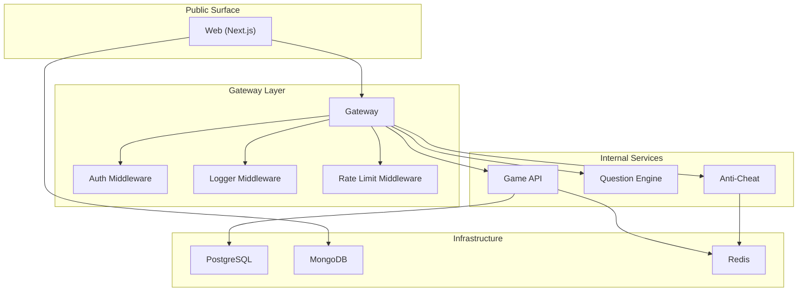
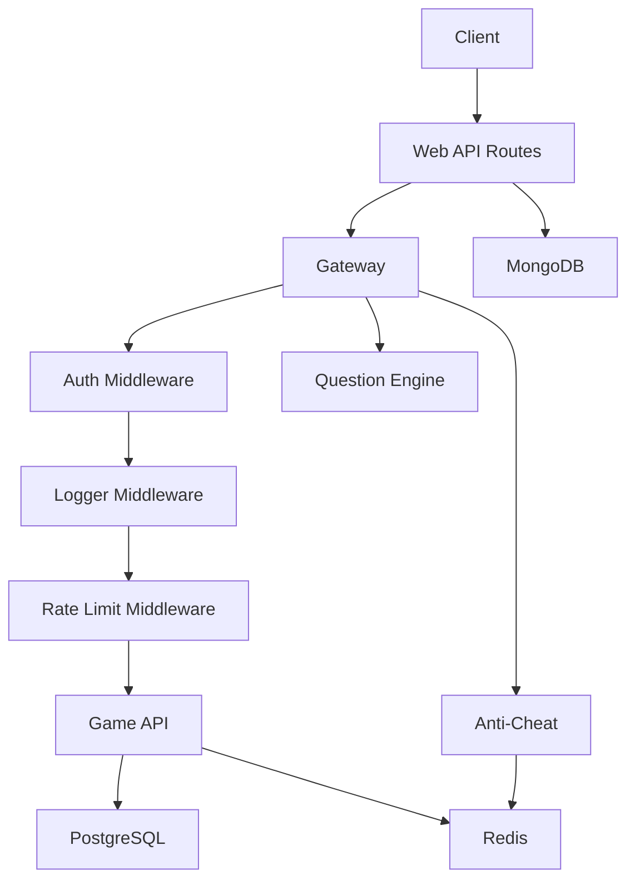
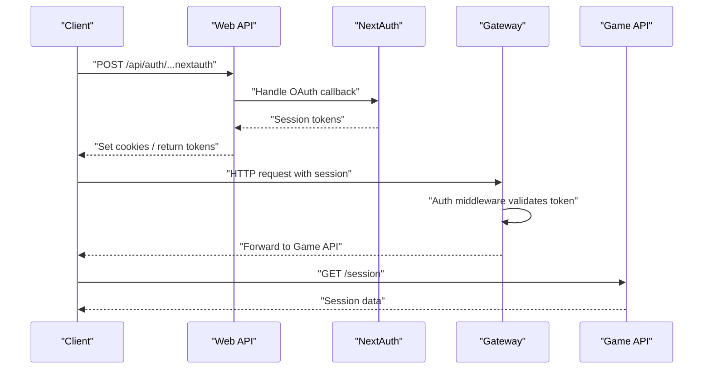
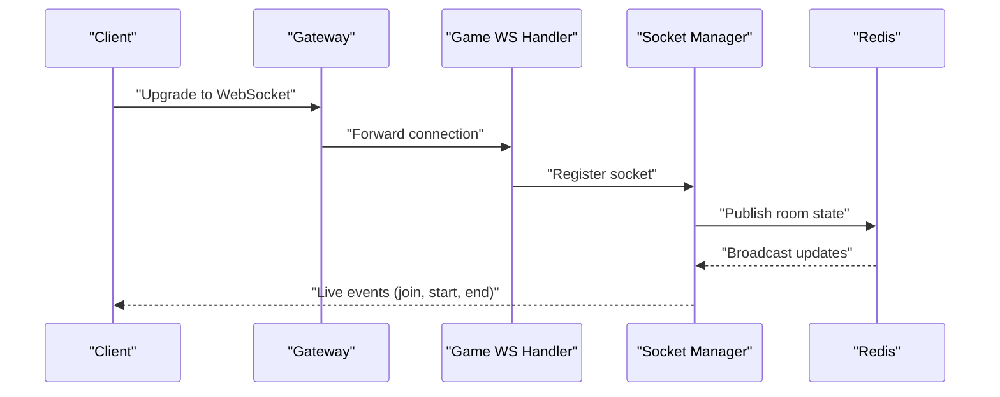
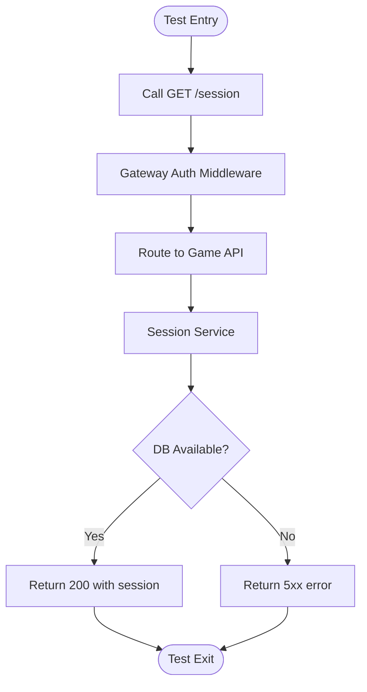
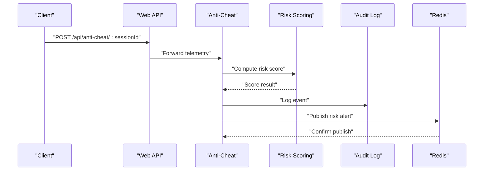
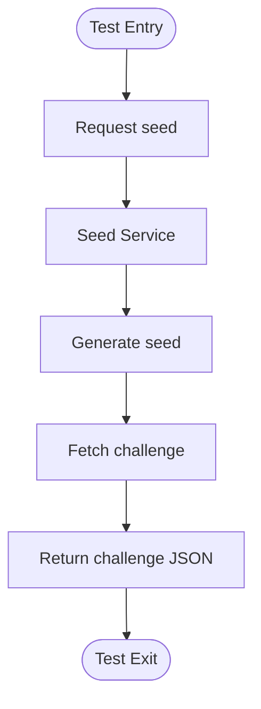
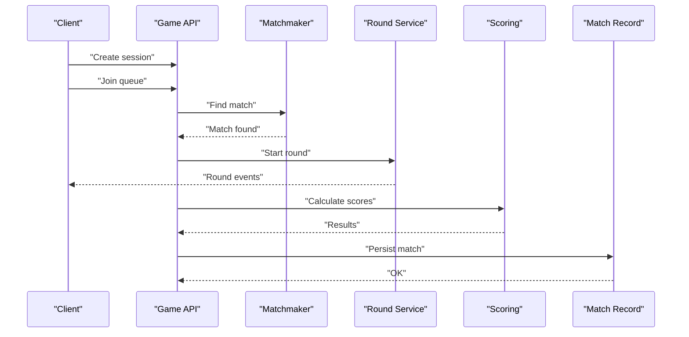
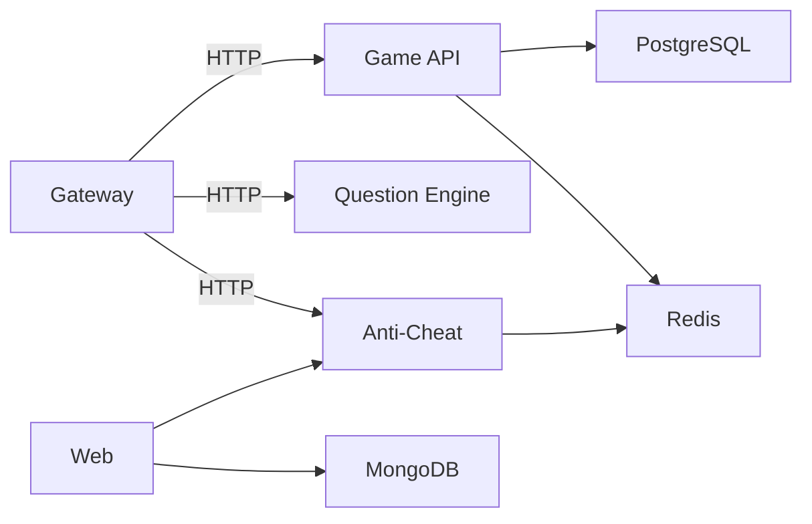

# Integration Testing

<cite>
**Referenced Files in This Document**
- [README.md](file://README.md)
- [package.json](file://package.json)
- [docker-compose.yml](file://docker-compose.yml)
- [docker-compose.prod.yml](file://docker-compose.prod.yml)
- [apps/gateway/src/index.ts](file://apps/gateway/src/index.ts)
- [apps/gateway/src/proxy.ts](file://apps/gateway/src/proxy.ts)
- [apps/gateway/src/redis.ts](file://apps/gateway/src/redis.ts)
- [apps/gateway/src/middleware/auth.ts](file://apps/gateway/src/middleware/auth.ts)
- [apps/gateway/src/middleware/logger.ts](file://apps/gateway/src/middleware/logger.ts)
- [apps/gateway/src/middleware/rate-limit.ts](file://apps/gateway/src/middleware/rate-limit.ts)
- [apps/game-api/src/app.ts](file://apps/game-api/src/app.ts)
- [apps/game-api/src/services/session.service.ts](file://apps/game-api/src/services/session.service.ts)
- [apps/game-api/src/services/matchmaker.service.ts](file://apps/game-api/src/services/matchmaker.service.ts)
- [apps/game-api/src/services/scoring.service.ts](file://apps/game-api/src/services/scoring.service.ts)
- [apps/game-api/src/services/round.service.ts](file://apps/game-api/src/services/round.service.ts)
- [apps/game-api/src/services/match-record.service.ts](file://apps/game-api/src/services/match-record.service.ts)
- [apps/game-api/src/websocket/socket.handler.ts](file://apps/game-api/src/websocket/socket.handler.ts)
- [apps/game-api/src/websocket/socket.manager.ts](file://apps/game-api/src/websocket/socket.manager.ts)
- [apps/game-api/src/routes/session.routes.ts](file://apps/game-api/src/routes/session.routes.ts)
- [apps/anti-cheat/src/index.ts](file://apps/anti-cheat/src/index.ts)
- [apps/anti-cheat/src/handlers/telemetry.handler.ts](file://apps/anti-cheat/src/handlers/telemetry.handler.ts)
- [apps/anti-cheat/src/services/risk-scoring.service.ts](file://apps/anti-cheat/src/services/risk-scoring.service.ts)
- [apps/anti-cheat/src/services/audit-log.service.ts](file://apps/anti-cheat/src/services/audit-log.service.ts)
- [apps/question-engine/src/index.ts](file://apps/question-engine/src/index.ts)
- [apps/question-engine/src/routes/challenge.routes.ts](file://apps/question-engine/src/routes/challenge.routes.ts)
- [apps/question-engine/src/services/challenge.service.ts](file://apps/question-engine/src/services/challenge.service.ts)
- [apps/question-engine/src/services/seed.service.ts](file://apps/question-engine/src/services/seed.service.ts)
- [apps/web/app/api/anti-cheat/[sessionId]/route.ts](file://apps/web/app/api/anti-cheat/[sessionId]/route.ts)
- [apps/web/app/api/auth/[...nextauth]/route.ts](file://apps/web/app/api/auth/[...nextauth]/route.ts)
- [apps/web/auth.config.ts](file://apps/web/auth.config.ts)
- [apps/web/auth.ts](file://apps/web/auth.ts)
- [apps/web/middleware.ts](file://apps/web/middleware.ts)
- [DEBUGGING_GUIDE.md](file://DEBUGGING_GUIDE.md)
</cite>

## Table of Contents
1. [Introduction](#introduction)
2. [Project Structure](#project-structure)
3. [Core Components](#core-components)
4. [Architecture Overview](#architecture-overview)
5. [Detailed Component Analysis](#detailed-component-analysis)
6. [Dependency Analysis](#dependency-analysis)
7. [Performance Considerations](#performance-considerations)
8. [Troubleshooting Guide](#troubleshooting-guide)
9. [Conclusion](#conclusion)
10. [Appendices](#appendices)

## Introduction
This document describes integration testing strategies for Logic Forge, focusing on service-to-service communication, API endpoint validation, and real-time WebSocket interactions. It covers test setup for microservices including database connectivity, Redis pub/sub messaging, and inter-service HTTP communication. It also documents testing patterns for authentication flows, session management, and cross-service data consistency. Examples of end-to-end workflows include matchmaking, challenge delivery, and anti-cheat telemetry processing. Guidance is provided for test environment configuration, service dependencies, and cleanup procedures.

## Project Structure
Logic Forge is a Turborepo-managed monorepo with multiple backend services and a Next.js frontend. The primary services involved in integration testing are:
- Gateway: Public entrypoint for HTTP and WebSocket traffic, with middleware for auth, logging, and rate limiting.
- Game API: Core game logic, sessions, matchmaking, rounds, scoring, and match records; exposes WebSocket endpoints.
- Question Engine: Challenge retrieval and seeding.
- Anti-Cheat: Telemetry ingestion and risk scoring.
- Web: Next.js frontend with API routes and authentication integration.

**Diagram sources**
- [README.md](file://README.md#L8-L18)
- [apps/gateway/src/index.ts](file://apps/gateway/src/index.ts)
- [apps/gateway/src/proxy.ts](file://apps/gateway/src/proxy.ts)
- [apps/gateway/src/redis.ts](file://apps/gateway/src/redis.ts)
- [apps/gateway/src/middleware/auth.ts](file://apps/gateway/src/middleware/auth.ts)
- [apps/gateway/src/middleware/logger.ts](file://apps/gateway/src/middleware/logger.ts)
- [apps/gateway/src/middleware/rate-limit.ts](file://apps/gateway/src/middleware/rate-limit.ts)
- [apps/game-api/src/app.ts](file://apps/game-api/src/app.ts)
- [apps/question-engine/src/index.ts](file://apps/question-engine/src/index.ts)
- [apps/anti-cheat/src/index.ts](file://apps/anti-cheat/src/index.ts)

**Section sources**
- [README.md](file://README.md#L5-L18)
- [package.json](file://package.json#L4-L10)

## Core Components
Key integration testing targets and their roles:
- Gateway: Validates HTTP routing, authentication, rate limiting, and WebSocket upgrades. Middleware order and behavior are critical for end-to-end flows.
- Game API: Exposes session management, matchmaking, rounds, scoring, and match records; integrates with PostgreSQL and Redis.
- Question Engine: Provides challenge retrieval and seeding for gameplay.
- Anti-Cheat: Processes telemetry and computes risk scores; integrates with Redis for real-time updates.
- Web: Serves frontend and provides API routes for authentication and anti-cheat telemetry.

**Section sources**
- [apps/gateway/src/index.ts](file://apps/gateway/src/index.ts)
- [apps/gateway/src/proxy.ts](file://apps/gateway/src/proxy.ts)
- [apps/gateway/src/redis.ts](file://apps/gateway/src/redis.ts)
- [apps/gateway/src/middleware/auth.ts](file://apps/gateway/src/middleware/auth.ts)
- [apps/gateway/src/middleware/logger.ts](file://apps/gateway/src/middleware/logger.ts)
- [apps/gateway/src/middleware/rate-limit.ts](file://apps/gateway/src/middleware/rate-limit.ts)
- [apps/game-api/src/app.ts](file://apps/game-api/src/app.ts)
- [apps/game-api/src/services/session.service.ts](file://apps/game-api/src/services/session.service.ts)
- [apps/game-api/src/services/matchmaker.service.ts](file://apps/game-api/src/services/matchmaker.service.ts)
- [apps/game-api/src/services/scoring.service.ts](file://apps/game-api/src/services/scoring.service.ts)
- [apps/game-api/src/services/round.service.ts](file://apps/game-api/src/services/round.service.ts)
- [apps/game-api/src/services/match-record.service.ts](file://apps/game-api/src/services/match-record.service.ts)
- [apps/game-api/src/websocket/socket.handler.ts](file://apps/game-api/src/websocket/socket.handler.ts)
- [apps/game-api/src/websocket/socket.manager.ts](file://apps/game-api/src/websocket/socket.manager.ts)
- [apps/anti-cheat/src/handlers/telemetry.handler.ts](file://apps/anti-cheat/src/handlers/telemetry.handler.ts)
- [apps/anti-cheat/src/services/risk-scoring.service.ts](file://apps/anti-cheat/src/services/risk-scoring.service.ts)
- [apps/anti-cheat/src/services/audit-log.service.ts](file://apps/anti-cheat/src/services/audit-log.service.ts)
- [apps/question-engine/src/routes/challenge.routes.ts](file://apps/question-engine/src/routes/challenge.routes.ts)
- [apps/question-engine/src/services/challenge.service.ts](file://apps/question-engine/src/services/challenge.service.ts)
- [apps/question-engine/src/services/seed.service.ts](file://apps/question-engine/src/services/seed.service.ts)
- [apps/web/app/api/anti-cheat/[sessionId]/route.ts](file://apps/web/app/api/anti-cheat/[sessionId]/route.ts)
- [apps/web/app/api/auth/[...nextauth]/route.ts](file://apps/web/app/api/auth/[...nextauth]/route.ts)

## Architecture Overview
The integration test environment mirrors production networking and service dependencies. The Gateway acts as the single public entrypoint for HTTP and WebSocket traffic, applying middleware before forwarding to internal services. Game API manages sessions and matches, interacts with PostgreSQL and Redis. Question Engine supplies challenges. Anti-Cheat consumes telemetry and publishes risk insights via Redis. Web integrates with MongoDB-backed authentication and proxies anti-cheat telemetry.

**Diagram sources**
- [README.md](file://README.md#L8-L18)
- [apps/gateway/src/middleware/auth.ts](file://apps/gateway/src/middleware/auth.ts)
- [apps/gateway/src/middleware/logger.ts](file://apps/gateway/src/middleware/logger.ts)
- [apps/gateway/src/middleware/rate-limit.ts](file://apps/gateway/src/middleware/rate-limit.ts)
- [apps/game-api/src/app.ts](file://apps/game-api/src/app.ts)
- [apps/anti-cheat/src/index.ts](file://apps/anti-cheat/src/index.ts)
- [apps/question-engine/src/index.ts](file://apps/question-engine/src/index.ts)
- [apps/web/auth.ts](file://apps/web/auth.ts)

## Detailed Component Analysis

### Authentication and Session Management
Testing strategy:
- Validate NextAuth integration via Web API routes and middleware.
- Verify session creation, propagation, and persistence across services.
- Confirm auth middleware correctness in Gateway and downstream services.
- Test session lifecycle: creation, refresh, termination.

**Diagram sources**
- [apps/web/app/api/auth/[...nextauth]/route.ts](file://apps/web/app/api/auth/[...nextauth]/route.ts#L1-L200)
- [apps/web/auth.ts](file://apps/web/auth.ts)
- [apps/web/middleware.ts](file://apps/web/middleware.ts)
- [apps/gateway/src/middleware/auth.ts](file://apps/gateway/src/middleware/auth.ts)
- [apps/game-api/src/services/session.service.ts](file://apps/game-api/src/services/session.service.ts)

**Section sources**
- [apps/web/app/api/auth/[...nextauth]/route.ts](file://apps/web/app/api/auth/[...nextauth]/route.ts)
- [apps/web/auth.ts](file://apps/web/auth.ts)
- [apps/web/middleware.ts](file://apps/web/middleware.ts)
- [apps/gateway/src/middleware/auth.ts](file://apps/gateway/src/middleware/auth.ts)
- [apps/game-api/src/services/session.service.ts](file://apps/game-api/src/services/session.service.ts)

### WebSocket Interactions (Matchmaking and Live Rounds)
Testing strategy:
- Validate WebSocket upgrade through Gateway to Game API.
- Simulate client join, room formation, and live round events.
- Verify message routing, error handling, and disconnect scenarios.
- Confirm Redis-backed state synchronization for real-time updates.

**Diagram sources**
- [apps/gateway/src/proxy.ts](file://apps/gateway/src/proxy.ts)
- [apps/game-api/src/websocket/socket.handler.ts](file://apps/game-api/src/websocket/socket.handler.ts)
- [apps/game-api/src/websocket/socket.manager.ts](file://apps/game-api/src/websocket/socket.manager.ts)
- [apps/gateway/src/redis.ts](file://apps/gateway/src/redis.ts)

**Section sources**
- [apps/gateway/src/proxy.ts](file://apps/gateway/src/proxy.ts)
- [apps/game-api/src/websocket/socket.handler.ts](file://apps/game-api/src/websocket/socket.handler.ts)
- [apps/game-api/src/websocket/socket.manager.ts](file://apps/game-api/src/websocket/socket.manager.ts)
- [apps/gateway/src/redis.ts](file://apps/gateway/src/redis.ts)

### API Endpoint Validation (HTTP)
Testing strategy:
- Validate CRUD endpoints for sessions, matches, rounds, and scoring.
- Verify Gateway routing and middleware effects on requests.
- Confirm response schemas and error codes across services.
- Test inter-service HTTP calls (e.g., Game API calling Question Engine for challenges).

**Diagram sources**
- [apps/gateway/src/middleware/auth.ts](file://apps/gateway/src/middleware/auth.ts)
- [apps/gateway/src/proxy.ts](file://apps/gateway/src/proxy.ts)
- [apps/game-api/src/services/session.service.ts](file://apps/game-api/src/services/session.service.ts)

**Section sources**
- [apps/gateway/src/middleware/auth.ts](file://apps/gateway/src/middleware/auth.ts)
- [apps/gateway/src/proxy.ts](file://apps/gateway/src/proxy.ts)
- [apps/game-api/src/services/session.service.ts](file://apps/game-api/src/services/session.service.ts)

### Anti-Cheat Telemetry Processing
Testing strategy:
- Validate telemetry ingestion via Web API to Anti-Cheat service.
- Confirm risk scoring and audit log generation.
- Verify Redis publish-subscribe for real-time risk alerts.
- Test end-to-end telemetry: capture -> process -> score -> log -> notify.

**Diagram sources**
- [apps/web/app/api/anti-cheat/[sessionId]/route.ts](file://apps/web/app/api/anti-cheat/[sessionId]/route.ts)
- [apps/anti-cheat/src/handlers/telemetry.handler.ts](file://apps/anti-cheat/src/handlers/telemetry.handler.ts)
- [apps/anti-cheat/src/services/risk-scoring.service.ts](file://apps/anti-cheat/src/services/risk-scoring.service.ts)
- [apps/anti-cheat/src/services/audit-log.service.ts](file://apps/anti-cheat/src/services/audit-log.service.ts)
- [apps/anti-cheat/src/index.ts](file://apps/anti-cheat/src/index.ts)

**Section sources**
- [apps/web/app/api/anti-cheat/[sessionId]/route.ts](file://apps/web/app/api/anti-cheat/[sessionId]/route.ts)
- [apps/anti-cheat/src/handlers/telemetry.handler.ts](file://apps/anti-cheat/src/handlers/telemetry.handler.ts)
- [apps/anti-cheat/src/services/risk-scoring.service.ts](file://apps/anti-cheat/src/services/risk-scoring.service.ts)
- [apps/anti-cheat/src/services/audit-log.service.ts](file://apps/anti-cheat/src/services/audit-log.service.ts)

### Challenge Delivery Workflow
Testing strategy:
- Validate challenge retrieval and seeding through Question Engine.
- Ensure Game API can request challenges and receive randomized sets.
- Confirm error handling for invalid seeds or unavailable challenges.

**Diagram sources**
- [apps/question-engine/src/routes/challenge.routes.ts](file://apps/question-engine/src/routes/challenge.routes.ts)
- [apps/question-engine/src/services/seed.service.ts](file://apps/question-engine/src/services/seed.service.ts)
- [apps/question-engine/src/services/challenge.service.ts](file://apps/question-engine/src/services/challenge.service.ts)

**Section sources**
- [apps/question-engine/src/routes/challenge.routes.ts](file://apps/question-engine/src/routes/challenge.routes.ts)
- [apps/question-engine/src/services/seed.service.ts](file://apps/question-engine/src/services/seed.service.ts)
- [apps/question-engine/src/services/challenge.service.ts](file://apps/question-engine/src/services/challenge.service.ts)

### Matchmaking and Round Lifecycle
Testing strategy:
- Validate session creation and readiness.
- Simulate player joining rooms and matchmaking.
- Verify round start, progress, and scoring.
- Confirm match record persistence and retrieval.

**Diagram sources**
- [apps/game-api/src/services/session.service.ts](file://apps/game-api/src/services/session.service.ts)
- [apps/game-api/src/services/matchmaker.service.ts](file://apps/game-api/src/services/matchmaker.service.ts)
- [apps/game-api/src/services/round.service.ts](file://apps/game-api/src/services/round.service.ts)
- [apps/game-api/src/services/scoring.service.ts](file://apps/game-api/src/services/scoring.service.ts)
- [apps/game-api/src/services/match-record.service.ts](file://apps/game-api/src/services/match-record.service.ts)

**Section sources**
- [apps/game-api/src/services/session.service.ts](file://apps/game-api/src/services/session.service.ts)
- [apps/game-api/src/services/matchmaker.service.ts](file://apps/game-api/src/services/matchmaker.service.ts)
- [apps/game-api/src/services/round.service.ts](file://apps/game-api/src/services/round.service.ts)
- [apps/game-api/src/services/scoring.service.ts](file://apps/game-api/src/services/scoring.service.ts)
- [apps/game-api/src/services/match-record.service.ts](file://apps/game-api/src/services/match-record.service.ts)

## Dependency Analysis
Integration tests must account for the following dependencies:
- Gateway depends on Redis for pub/sub and rate limiting.
- Game API depends on PostgreSQL for persistent data and Redis for real-time state.
- Anti-Cheat depends on Redis for publishing risk alerts.
- Web depends on MongoDB-backed authentication and proxies anti-cheat telemetry.

**Diagram sources**
- [README.md](file://README.md#L8-L18)
- [apps/gateway/src/redis.ts](file://apps/gateway/src/redis.ts)
- [apps/game-api/src/app.ts](file://apps/game-api/src/app.ts)
- [apps/anti-cheat/src/index.ts](file://apps/anti-cheat/src/index.ts)
- [apps/web/auth.ts](file://apps/web/auth.ts)

**Section sources**
- [README.md](file://README.md#L8-L18)
- [apps/gateway/src/redis.ts](file://apps/gateway/src/redis.ts)
- [apps/game-api/src/app.ts](file://apps/game-api/src/app.ts)
- [apps/anti-cheat/src/index.ts](file://apps/anti-cheat/src/index.ts)
- [apps/web/auth.ts](file://apps/web/auth.ts)

## Performance Considerations
- Minimize external calls in tests by mocking or using lightweight test doubles where appropriate.
- Use deterministic seeds for challenge generation to ensure reproducible tests.
- Apply rate limiting and concurrency caps during tests to avoid flakiness.
- Prefer in-memory databases or ephemeral containers for fast teardown and isolation.
- Cache expensive setup steps (e.g., container bootstrapping) across test runs when safe.

## Troubleshooting Guide
Common integration testing issues and resolutions:
- Authentication failures: Verify NextAuth configuration and cookie handling in tests. Ensure middleware precedence and session propagation.
- WebSocket handshake errors: Confirm Gateway proxy configuration and TLS/upgrade headers.
- Redis connectivity: Validate Redis host/port/env and pub/sub channels used by services.
- Database connectivity: Confirm connection strings and migrations are applied before tests.
- Flaky tests due to timing: Introduce bounded retries and deterministic waits for async operations.

**Section sources**
- [apps/web/auth.ts](file://apps/web/auth.ts)
- [apps/gateway/src/proxy.ts](file://apps/gateway/src/proxy.ts)
- [apps/gateway/src/redis.ts](file://apps/gateway/src/redis.ts)
- [DEBUGGING_GUIDE.md](file://DEBUGGING_GUIDE.md)

## Conclusion
Integration testing in Logic Forge requires coordinated validation across Gateway, Game API, Question Engine, Anti-Cheat, and Web. Focus on end-to-end flows for authentication, WebSocket interactions, and complete workflows like matchmaking and anti-cheat telemetry. Use deterministic setups, manage dependencies carefully, and apply robust cleanup procedures to maintain reliable and repeatable tests.

## Appendices

### Test Environment Configuration
- Use Docker Compose to provision Gateway, Game API, Question Engine, Anti-Cheat, PostgreSQL, MongoDB, and Redis.
- Configure environment variables per service as defined in each service’s .env.example.
- Run tests against the orchestrated stack to mirror production behavior.

**Section sources**
- [docker-compose.yml](file://docker-compose.yml)
- [docker-compose.prod.yml](file://docker-compose.prod.yml)
- [apps/gateway/src/index.ts](file://apps/gateway/src/index.ts)
- [apps/game-api/src/app.ts](file://apps/game-api/src/app.ts)
- [apps/anti-cheat/src/index.ts](file://apps/anti-cheat/src/index.ts)
- [apps/question-engine/src/index.ts](file://apps/question-engine/src/index.ts)

### Cleanup Procedures
- Stop and remove Docker containers after tests.
- Clear Redis keyspace used by tests.
- Reset PostgreSQL schema or truncate relevant tables.
- Re-seed minimal test data if needed for subsequent runs.

**Section sources**
- [docker-compose.yml](file://docker-compose.yml)
- [apps/gateway/src/redis.ts](file://apps/gateway/src/redis.ts)
- [apps/game-api/src/app.ts](file://apps/game-api/src/app.ts)