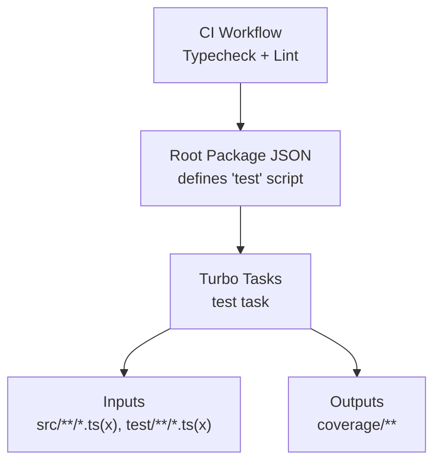
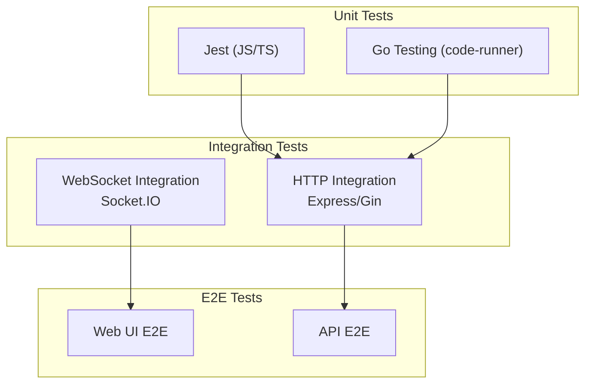
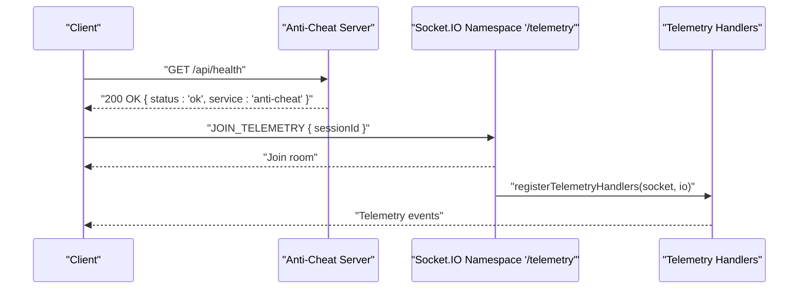
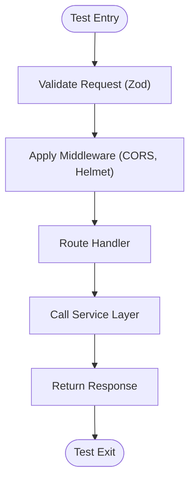
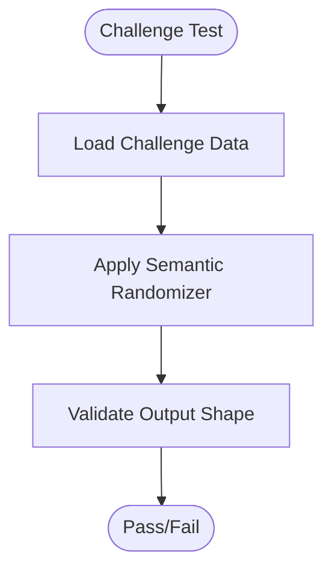
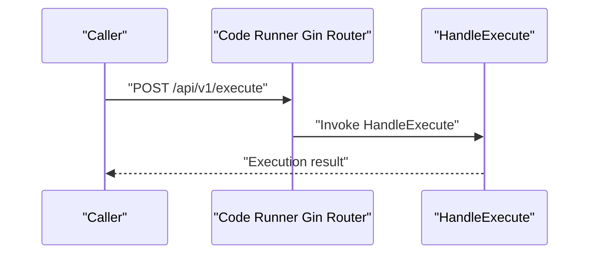
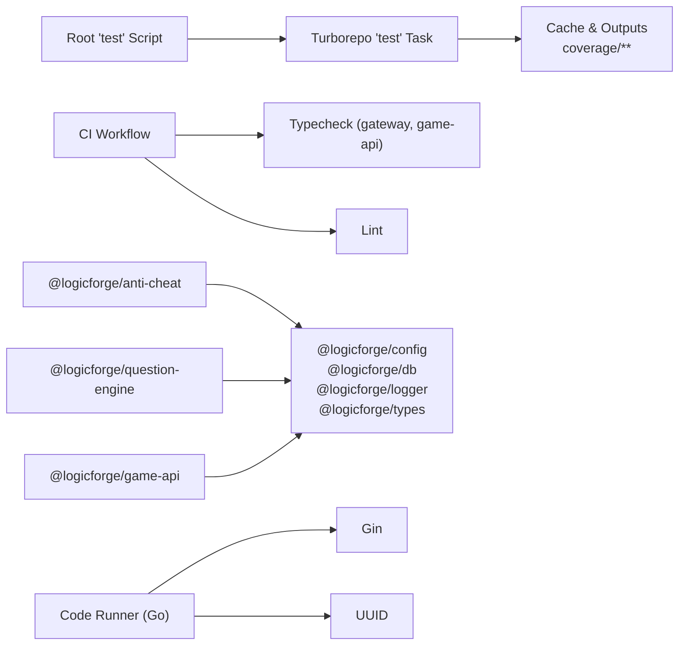

# Testing Strategy

<cite>
**Referenced Files in This Document**
- [package.json](file://package.json)
- [turbo.json](file://turbo.json)
- [.github/workflows/ci.yml](file://.github/workflows/ci.yml)
- [apps/anti-cheat/package.json](file://apps/anti-cheat/package.json)
- [apps/anti-cheat/src/index.ts](file://apps/anti-cheat/src/index.ts)
- [apps/game-api/package.json](file://apps/game-api/package.json)
- [apps/question-engine/package.json](file://apps/question-engine/package.json)
- [apps/code-runner/go.mod](file://apps/code-runner/go.mod)
- [apps/code-runner/cmd/server/main.go](file://apps/code-runner/cmd/server/main.go)
</cite>

## Table of Contents
1. [Introduction](#introduction)
2. [Project Structure](#project-structure)
3. [Core Components](#core-components)
4. [Architecture Overview](#architecture-overview)
5. [Detailed Component Analysis](#detailed-component-analysis)
6. [Dependency Analysis](#dependency-analysis)
7. [Performance Considerations](#performance-considerations)
8. [Troubleshooting Guide](#troubleshooting-guide)
9. [Conclusion](#conclusion)
10. [Appendices](#appendices)

## Introduction
This document defines the testing strategy and implementation for Logic Forge services. It covers the current testing infrastructure, outlines unit, integration, and end-to-end testing approaches, and provides guidance for mocking, test utilities, test data management, coverage, performance testing, and debugging. The repository currently integrates type checking and linting in CI but does not include explicit test commands or coverage tasks in the monorepo scripts. The code runner service is implemented in Go and exposes a single endpoint, while the JavaScript/TypeScript services rely on Express and Socket.IO.

## Project Structure
The monorepo uses a Turborepo-based build and development workflow. Testing is configured as a dedicated task with inputs and outputs, enabling caching and incremental execution. The root package.json defines a top-level test script that delegates to Turborepo. CI performs type checking and linting for selected packages.

**Diagram sources**
- [package.json](file://package.json#L4-L10)
- [turbo.json](file://turbo.json#L27-L40)
- [.github/workflows/ci.yml](file://.github/workflows/ci.yml#L1-L33)

**Section sources**
- [package.json](file://package.json#L4-L10)
- [turbo.json](file://turbo.json#L27-L40)
- [.github/workflows/ci.yml](file://.github/workflows/ci.yml#L1-L33)

## Core Components
- Anti-Cheat service (Express + Socket.IO): Exposes a health endpoint and a telemetry namespace. The service registers telemetry handlers upon connection and supports joining a room per session ID.
- Game API service (Express + Socket.IO): Provides session-related routes and WebSocket managers. It includes CORS, helmet, and Zod for validation.
- Question Engine service (Express): Serves challenge and health routes, with middleware and services for randomization and challenge handling.
- Code Runner service (Go + Gin): Exposes a health endpoint and an execute endpoint for inter-service code execution.

**Section sources**
- [apps/anti-cheat/src/index.ts](file://apps/anti-cheat/src/index.ts#L15-L29)
- [apps/anti-cheat/package.json](file://apps/anti-cheat/package.json#L1-L30)
- [apps/game-api/package.json](file://apps/game-api/package.json#L1-L32)
- [apps/question-engine/package.json](file://apps/question-engine/package.json#L1-L30)
- [apps/code-runner/cmd/server/main.go](file://apps/code-runner/cmd/server/main.go#L19-L28)
- [apps/code-runner/go.mod](file://apps/code-runner/go.mod#L1-L8)

## Architecture Overview
The testing architecture aligns with the runtime architecture:
- Unit tests validate pure functions, service logic, and handler logic in isolation.
- Integration tests validate service-to-service communication via HTTP and WebSocket channels.
- End-to-end tests validate user workflows across the web client and backend services.

[No sources needed since this diagram shows conceptual workflow, not actual code structure]

## Detailed Component Analysis

### Anti-Cheat Service Testing
- Health endpoint: Verify GET /api/health returns a 200 status and a JSON body containing service metadata.
- Telemetry namespace: Validate JOIN_TELEMETRY event handling and room joining behavior.
- Handler registration: Ensure telemetry handlers are registered after a Socket.IO connection.

**Diagram sources**
- [apps/anti-cheat/src/index.ts](file://apps/anti-cheat/src/index.ts#L15-L29)

**Section sources**
- [apps/anti-cheat/src/index.ts](file://apps/anti-cheat/src/index.ts#L15-L29)

### Game API Service Testing
- Session routes: Validate request validation (Zod), middleware behavior (CORS, helmet), and response shape.
- WebSocket manager: Ensure socket connections are established and messages are handled.
- Services: Test matchmaker, session, round, scoring, and match record services for correctness and error handling.

**Diagram sources**
- [apps/game-api/package.json](file://apps/game-api/package.json#L12-L22)

**Section sources**
- [apps/game-api/package.json](file://apps/game-api/package.json#L12-L22)

### Question Engine Service Testing
- Challenge routes: Validate challenge retrieval and seed endpoints.
- Randomizer: Ensure semantic randomization and token maps produce deterministic outputs under controlled conditions.
- Services: Validate challenge and seed services for correctness and error handling.

**Diagram sources**
- [apps/question-engine/package.json](file://apps/question-engine/package.json#L12-L19)

**Section sources**
- [apps/question-engine/package.json](file://apps/question-engine/package.json#L12-L19)

### Code Runner Service Testing
- Health endpoint: Verify GET /api/v1/health returns a 200 status and service metadata.
- Execute endpoint: Validate request payload acceptance, execution pipeline invocation, and response shape.
- Go testing: Use the standard library testing package for unit tests and table-driven tests for multiple scenarios.

**Diagram sources**
- [apps/code-runner/cmd/server/main.go](file://apps/code-runner/cmd/server/main.go#L26-L28)
- [apps/code-runner/go.mod](file://apps/code-runner/go.mod#L5-L8)

**Section sources**
- [apps/code-runner/cmd/server/main.go](file://apps/code-runner/cmd/server/main.go#L19-L28)
- [apps/code-runner/go.mod](file://apps/code-runner/go.mod#L5-L8)

## Dependency Analysis
- Monorepo orchestration: The root test script delegates to Turborepo, which manages task dependencies and caching.
- CI pipeline: Performs type checks for gateway and game-api and linting for the entire workspace.
- Service dependencies: Anti-Cheat and Question Engine depend on shared packages for configuration, database, logging, and types. Code Runner depends on Gin and UUID.

**Diagram sources**
- [package.json](file://package.json#L4-L10)
- [turbo.json](file://turbo.json#L27-L40)
- [.github/workflows/ci.yml](file://.github/workflows/ci.yml#L24-L31)
- [apps/anti-cheat/package.json](file://apps/anti-cheat/package.json#L12-L21)
- [apps/game-api/package.json](file://apps/game-api/package.json#L12-L22)
- [apps/question-engine/package.json](file://apps/question-engine/package.json#L12-L20)
- [apps/code-runner/go.mod](file://apps/code-runner/go.mod#L5-L8)

**Section sources**
- [package.json](file://package.json#L4-L10)
- [turbo.json](file://turbo.json#L27-L40)
- [.github/workflows/ci.yml](file://.github/workflows/ci.yml#L24-L31)
- [apps/anti-cheat/package.json](file://apps/anti-cheat/package.json#L12-L21)
- [apps/game-api/package.json](file://apps/game-api/package.json#L12-L22)
- [apps/question-engine/package.json](file://apps/question-engine/package.json#L12-L20)
- [apps/code-runner/go.mod](file://apps/code-runner/go.mod#L5-L8)

## Performance Considerations
- Unit tests: Keep fixtures small and deterministic; avoid heavy I/O in unit tests.
- Integration tests: Use lightweight mocks for external systems; isolate network-bound tests behind feature flags.
- End-to-end tests: Run against a staging-like environment; minimize flakiness by controlling timing and seeding randomness.
- Coverage: Target high coverage for business logic and critical paths; accept lower coverage for trivial helpers.

[No sources needed since this section provides general guidance]

## Troubleshooting Guide
- CI failures:
  - Typecheck errors: Review type definitions and ensure packages are built before typechecking.
  - Lint errors: Fix lint violations or adjust rules if necessary.
- Local test execution:
  - Ensure the monorepo is installed with the correct package manager and Node version.
  - Run the test task via Turborepo to leverage caching and task graph execution.
- Debugging test failures:
  - Add targeted logs in failing tests.
  - Use minimal reproducible test cases and isolate the component under test.
  - For Go tests, use table-driven tests to enumerate failure modes.

**Section sources**
- [.github/workflows/ci.yml](file://.github/workflows/ci.yml#L1-L33)
- [package.json](file://package.json#L4-L10)
- [turbo.json](file://turbo.json#L27-L40)

## Conclusion
The repository establishes a foundation for testing through Turborepo orchestration and CI type checking/linting. To mature the testing strategy:
- Define explicit test commands and coverage targets in each package.
- Introduce unit tests for service logic and handlers.
- Add integration tests for HTTP and WebSocket endpoints.
- Implement end-to-end tests for user workflows.
- Standardize mocking, test utilities, and test data management across services.

[No sources needed since this section summarizes without analyzing specific files]

## Appendices

### Current Testing Infrastructure Checklist
- Root test script: Delegates to Turborepo.
- Turborepo test task: Configured with inputs and outputs for coverage.
- CI workflow: Type checks and linting for selected packages.
- Service-specific dependencies: Confirm presence of testing-related devDependencies where applicable.

**Section sources**
- [package.json](file://package.json#L4-L10)
- [turbo.json](file://turbo.json#L27-L40)
- [.github/workflows/ci.yml](file://.github/workflows/ci.yml#L24-L31)
- [apps/anti-cheat/package.json](file://apps/anti-cheat/package.json#L22-L29)
- [apps/game-api/package.json](file://apps/game-api/package.json#L23-L31)
- [apps/question-engine/package.json](file://apps/question-engine/package.json#L21-L29)
- [apps/code-runner/go.mod](file://apps/code-runner/go.mod#L5-L8)