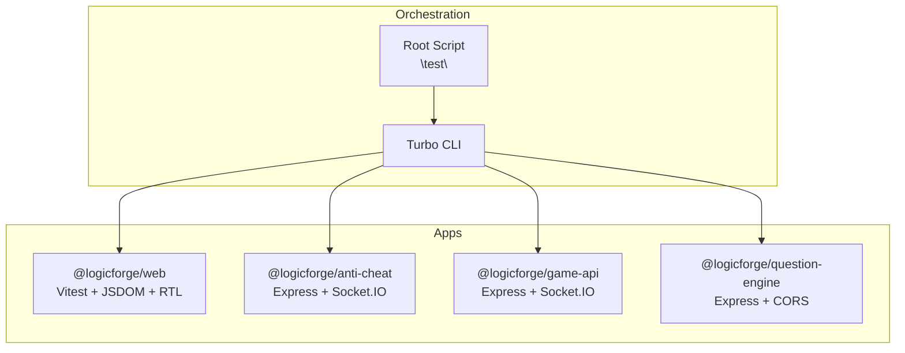

# Testing Utilities & Mocking

<cite>
**Referenced Files in This Document**
- [package.json](file://package.json)
- [apps/web/package.json](file://apps/web/package.json)
- [apps/anti-cheat/package.json](file://apps/anti-cheat/package.json)
- [apps/game-api/package.json](file://apps/game-api/package.json)
- [apps/question-engine/package.json](file://apps/question-engine/package.json)
- [DEBUGGING_GUIDE.md](file://DEBUGGING_GUIDE.md)
</cite>

## Table of Contents
1. [Introduction](#introduction)
2. [Project Structure](#project-structure)
3. [Core Components](#core-components)
4. [Architecture Overview](#architecture-overview)
5. [Detailed Component Analysis](#detailed-component-analysis)
6. [Dependency Analysis](#dependency-analysis)
7. [Performance Considerations](#performance-considerations)
8. [Troubleshooting Guide](#troubleshooting-guide)
9. [Conclusion](#conclusion)
10. [Appendices](#appendices)

## Introduction
This document consolidates the testing utilities, helper functions, and mocking strategies used across Logic Forge services. It focuses on shared testing infrastructure, mock factories, test data generation patterns, and environment configuration. It also covers mocking approaches for databases, external APIs, WebSocket connections, and authentication systems, along with reusable testing patterns, lifecycle management, cleanup procedures, performance optimization, best practices, common pitfalls, and debugging techniques for test failures.

## Project Structure
The monorepo uses a workspace-based setup with per-app package scripts and shared tooling. Testing is orchestrated via a top-level script that delegates to individual apps. The web application integrates Vitest and related testing libraries, while other apps rely on standard Node tooling and TypeScript compilation for development and testing.

```mermaid
graph TB
Root["Root Scripts<br/>\"test\": turbo run test"] --> Web["@logicforge/web<br/>Vitest + React Testing"]
Root --> AntiCheat["@logicforge/anti-cheat<br/>Express + Socket.IO"]
Root --> GameAPI["@logicforge/game-api<br/>Express + Socket.IO"]
Root --> QuestionEngine["@logicforge/question-engine<br/>Express + CORS"]
```

**Diagram sources**
- [package.json](file://package.json#L4-L10)
- [apps/web/package.json](file://apps/web/package.json#L6-L11)
- [apps/anti-cheat/package.json](file://apps/anti-cheat/package.json#L6-L11)
- [apps/game-api/package.json](file://apps/game-api/package.json#L6-L11)
- [apps/question-engine/package.json](file://apps/question-engine/package.json#L6-L11)

**Section sources**
- [package.json](file://package.json#L4-L10)
- [apps/web/package.json](file://apps/web/package.json#L6-L11)
- [apps/anti-cheat/package.json](file://apps/anti-cheat/package.json#L6-L11)
- [apps/game-api/package.json](file://apps/game-api/package.json#L6-L11)
- [apps/question-engine/package.json](file://apps/question-engine/package.json#L6-L11)

## Core Components
- Shared testing orchestration: The root script invokes Turbo to run tests across workspaces.
- Web app testing stack: The web application includes Vitest, JSDOM, React Testing Library, and related type definitions for browser-like DOM simulation and React component testing.
- App-level dependencies: Other apps depend on Express, Socket.IO, and Zod, indicating potential areas for mocking HTTP and WebSocket interactions.

Key testing-related entries:
- Root test command: Delegates to Turbo for multi-package execution.
- Web app test dependencies: Vitest, JSDOM, React Testing Library, and related types.
- App dependencies for HTTP/WebSocket: Express and Socket.IO imply mocking strategies for HTTP endpoints and real-time channels.

**Section sources**
- [package.json](file://package.json#L4-L10)
- [apps/web/package.json](file://apps/web/package.json#L85-L115)
- [apps/anti-cheat/package.json](file://apps/anti-cheat/package.json#L12-L21)
- [apps/game-api/package.json](file://apps/game-api/package.json#L12-L22)
- [apps/question-engine/package.json](file://apps/question-engine/package.json#L12-L20)

## Architecture Overview
The testing architecture centers on:
- Orchestration: Root script triggers Turbo tasks to execute tests across packages.
- Environment isolation: Each app defines its own scripts and dependencies, enabling isolated builds and tests.
- Test runtime: The web app leverages Vitest with JSDOM for DOM simulation and React Testing Library for component rendering.
- External integrations: HTTP and WebSocket mocking are required for Express-based services.



**Diagram sources**
- [package.json](file://package.json#L4-L10)
- [apps/web/package.json](file://apps/web/package.json#L6-L11)
- [apps/anti-cheat/package.json](file://apps/anti-cheat/package.json#L6-L11)
- [apps/game-api/package.json](file://apps/game-api/package.json#L6-L11)
- [apps/question-engine/package.json](file://apps/question-engine/package.json#L6-L11)

## Detailed Component Analysis

### Web Application Testing Stack
- Vitest: Primary test runner and assertion library.
- JSDOM: Provides DOM APIs for server-side rendering and browser-like behavior.
- React Testing Library: Encourages testing user interactions and component behavior.
- Related types: Ensures proper typing for DOM and React testing scenarios.

Recommended patterns:
- Use Vitest’s built-in mocks for timers, fetch, and module mocking.
- Prefer React Testing Library’s render utilities to mount components and simulate user actions.
- Leverage JSDOM globals to emulate browser APIs during SSR and client-side tests.

Mocking strategies:
- HTTP APIs: Use a lightweight HTTP mocking library compatible with Vitest to stub network requests.
- Authentication: Mock NextAuth or session providers to simulate logged-in and anonymous states.
- WebSocket: Stub WebSocket clients or use a mock adapter to simulate real-time events.

Lifecycle and cleanup:
- Reset mocks between tests to avoid cross-test contamination.
- Clear timers and intervals after each test to prevent lingering effects.

**Section sources**
- [apps/web/package.json](file://apps/web/package.json#L85-L115)

### Express-Based Services (HTTP and WebSocket)
- Dependencies: Express and Socket.IO indicate HTTP endpoints and WebSocket channels.
- Testing needs: HTTP routes require request/response mocking; WebSocket requires channel mocking or a mock adapter.

Mocking strategies:
- HTTP: Use a lightweight HTTP mocking library to intercept and stub Express endpoints.
- WebSocket: Mock Socket.IO clients and server channels to simulate connection, events, and disconnections.
- Validation: Mock Zod parsing to simulate validation errors and success paths.

Environment configuration:
- Use separate environment variables for test mode to enable mock-only behavior.
- Ensure test databases are isolated and cleaned between runs.

**Section sources**
- [apps/anti-cheat/package.json](file://apps/anti-cheat/package.json#L12-L21)
- [apps/game-api/package.json](file://apps/game-api/package.json#L12-L22)
- [apps/question-engine/package.json](file://apps/question-engine/package.json#L12-L20)

### Authentication Systems
- NextAuth integration in the web app suggests session-based authentication.
- Testing patterns:
  - Mock NextAuth provider to return predefined user sessions.
  - Simulate authentication callbacks and redirects.
  - Test protected routes and unauthorized access scenarios.

Best practices:
- Centralize authentication mocks in a single helper module for reuse.
- Ensure consistent user roles and permissions across tests.

**Section sources**
- [apps/web/package.json](file://apps/web/package.json#L15-L18)

### Database Mocking and Test Schemas
- Shared database package indicates a centralized data access layer.
- Testing patterns:
  - Use an in-memory or ephemeral database for tests.
  - Seed minimal datasets per test using factories or fixtures.
  - Rollback or truncate transactions to maintain isolation.

Cleanup:
- After each test, reset sequences, clear collections, or drop temporary tables.
- Ensure no dangling connections or open transactions.

**Section sources**
- [apps/web/package.json](file://apps/web/package.json#L17-L18)

### External API Mocking
- Services may integrate with external APIs (e.g., AI models).
- Strategies:
  - Use Vitest’s module mocking to replace API clients.
  - Define response factories for deterministic outcomes.
  - Simulate network errors and timeouts to validate resilience.

**Section sources**
- [apps/web/package.json](file://apps/web/package.json#L13)

### WebSocket Connections
- Socket.IO is present in anti-cheat and game-api apps.
- Strategies:
  - Mock client and server sockets to simulate real-time events.
  - Test event emission, acknowledgments, and reconnection logic.
  - Validate state transitions and error handling.

**Section sources**
- [apps/anti-cheat/package.json](file://apps/anti-cheat/package.json#L19)
- [apps/game-api/package.json](file://apps/game-api/package.json#L20)

### Test Data Generators and Factories
- Recommended approach:
  - Create factory functions for domain entities to generate realistic test data.
  - Use deterministic seeds for reproducible outputs.
  - Support overrides for edge cases and negative scenarios.

Integration:
  - Initialize factories in test setup hooks.
  - Combine with database seeding to prepare test environments.

**Section sources**
- [apps/web/package.json](file://apps/web/package.json#L17-L18)

### Custom Matchers and Test Helpers
- Vitest supports custom assertions and matchers.
- Patterns:
  - Add custom matchers for React Testing Library (e.g., screen queries).
  - Create helper functions for common assertions and setup steps.
  - Encapsulate repeated patterns (e.g., authentication, WebSocket events).

**Section sources**
- [apps/web/package.json](file://apps/web/package.json#L85-L115)

### Reusable Testing Patterns
- Arrange-Act-Assert: Standardize test structure across suites.
- Shared fixtures: Maintain a central set of fixtures for common scenarios.
- Snapshot testing: Use snapshots for UI regression detection where appropriate.

**Section sources**
- [apps/web/package.json](file://apps/web/package.json#L85-L115)

## Dependency Analysis
Testing dependencies are primarily declared in the web application, with other apps relying on Express and Socket.IO. The root script orchestrates test execution across packages.

```mermaid
graph TB
RootPkg["Root Package<br/>\"test\": turbo run test"] --> WebPkg["@logicforge/web<br/>Vitest + JSDOM + RTL"]
RootPkg --> AntiCheatPkg["@logicforge/anti-cheat<br/>Express + Socket.IO"]
RootPkg --> GameAPIPkg["@logicforge/game-api<br/>Express + Socket.IO"]
RootPkg --> QuestionPkg["@logicforge/question-engine<br/>Express + CORS"]
WebPkg --> Vitest["Vitest"]
WebPkg --> JSDOM["JSDOM"]
WebPkg --> RTL["React Testing Library"]
```

**Diagram sources**
- [package.json](file://package.json#L4-L10)
- [apps/web/package.json](file://apps/web/package.json#L85-L115)
- [apps/anti-cheat/package.json](file://apps/anti-cheat/package.json#L12-L21)
- [apps/game-api/package.json](file://apps/game-api/package.json#L12-L22)
- [apps/question-engine/package.json](file://apps/question-engine/package.json#L12-L20)

**Section sources**
- [package.json](file://package.json#L4-L10)
- [apps/web/package.json](file://apps/web/package.json#L85-L115)
- [apps/anti-cheat/package.json](file://apps/anti-cheat/package.json#L12-L21)
- [apps/game-api/package.json](file://apps/game-api/package.json#L12-L22)
- [apps/question-engine/package.json](file://apps/question-engine/package.json#L12-L20)

## Performance Considerations
- Parallelization: Run independent test suites concurrently to reduce total execution time.
- Isolation: Keep tests independent and fast; avoid heavy setup where possible.
- Mocking overhead: Prefer lightweight mocks and avoid expensive network calls.
- Memory management: Clear caches, timers, and subscriptions after each test.
- Database resets: Use transaction rollbacks or truncate tables to minimize teardown costs.

## Troubleshooting Guide
Common issues and resolutions:
- Environment mismatches: Ensure test environment variables are loaded and override production values.
- DOM-related failures: Confirm JSDOM is configured correctly for server-side rendering.
- WebSocket flakiness: Mock Socket.IO channels and assert emitted events deterministically.
- Authentication edge cases: Verify NextAuth mocks handle both authenticated and unauthenticated states.
- CI instability: Use deterministic seeds for randomness and stabilize external API responses.

Debugging techniques:
- Enable verbose logging for failing suites.
- Use Vitest’s snapshot diffing to inspect regressions.
- Add targeted logs around async operations and event emissions.
- Validate cleanup routines to prevent resource leaks.

**Section sources**
- [DEBUGGING_GUIDE.md](file://DEBUGGING_GUIDE.md)

## Conclusion
Logic Forge’s testing ecosystem leverages a root-level orchestration layer with per-app customization. The web application integrates Vitest, JSDOM, and React Testing Library, while other apps depend on Express and Socket.IO, highlighting the need for HTTP and WebSocket mocking. By adopting shared factories, custom matchers, and robust cleanup procedures, teams can achieve reliable, fast, and maintainable tests across the monorepo.

## Appendices
- Best practices checklist:
  - Centralize mocks and helpers.
  - Use deterministic test data and seeds.
  - Keep tests isolated and independent.
  - Clean up resources after each test.
  - Validate error paths and edge cases.
- Pitfalls to avoid:
  - Over-reliance on real external services.
  - Sharing mutable state between tests.
  - Ignoring cleanup and teardown.
  - Using brittle selectors or unstable assertions.