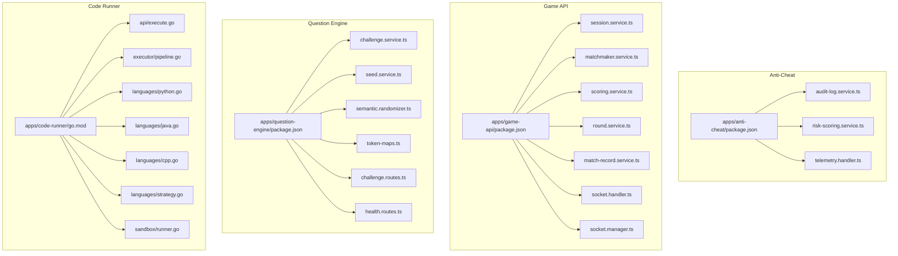
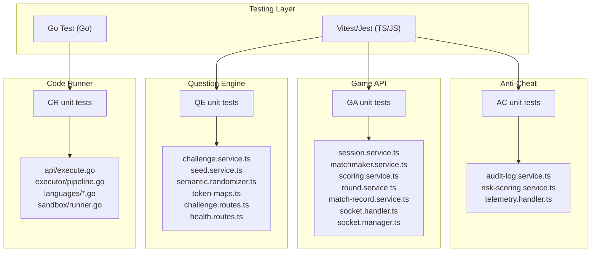
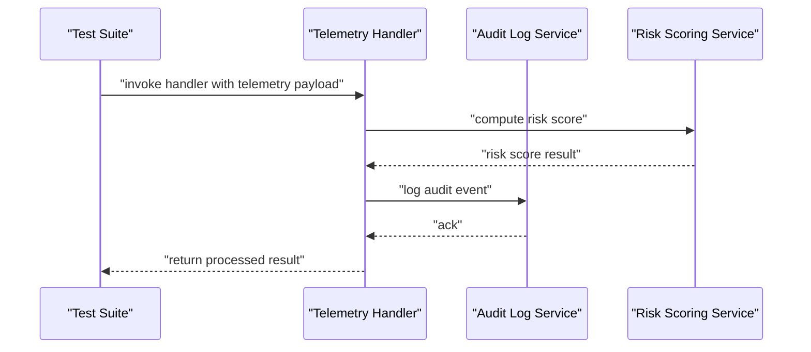
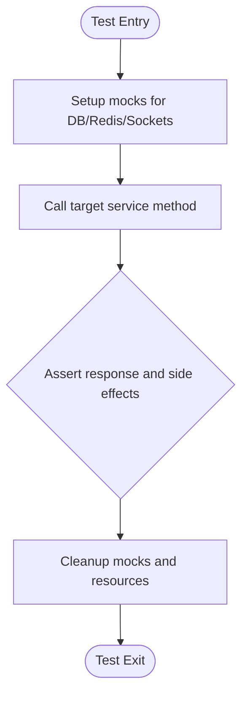
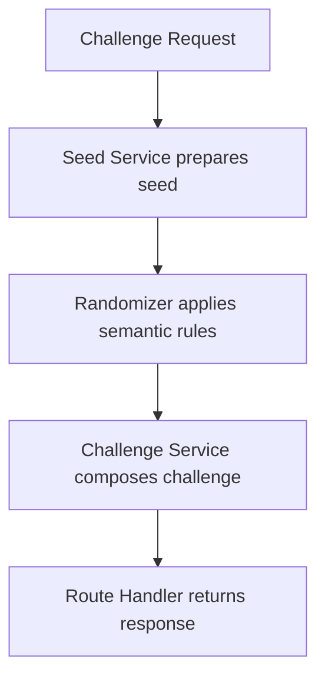
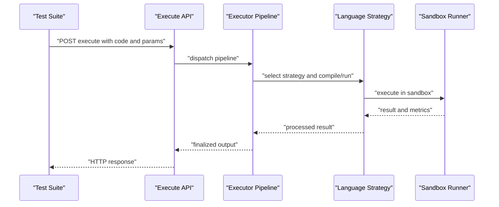
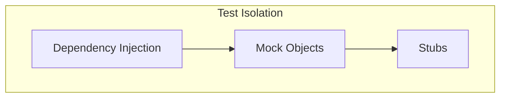

# Unit Testing

<cite>
**Referenced Files in This Document**
- [package.json](file://package.json)
- [apps/anti-cheat/package.json](file://apps/anti-cheat/package.json)
- [apps/anti-cheat/src/services/audit-log.service.ts](file://apps/anti-cheat/src/services/audit-log.service.ts)
- [apps/anti-cheat/src/services/risk-scoring.service.ts](file://apps/anti-cheat/src/services/risk-scoring.service.ts)
- [apps/anti-cheat/src/handlers/telemetry.handler.ts](file://apps/anti-cheat/src/handlers/telemetry.handler.ts)
- [apps/game-api/package.json](file://apps/game-api/package.json)
- [apps/game-api/src/services/session.service.ts](file://apps/game-api/src/services/session.service.ts)
- [apps/game-api/src/services/matchmaker.service.ts](file://apps/game-api/src/services/matchmaker.service.ts)
- [apps/game-api/src/services/scoring.service.ts](file://apps/game-api/src/services/scoring.service.ts)
- [apps/game-api/src/services/round.service.ts](file://apps/game-api/src/services/round.service.ts)
- [apps/game-api/src/services/match-record.service.ts](file://apps/game-api/src/services/match-record.service.ts)
- [apps/game-api/src/websocket/socket.handler.ts](file://apps/game-api/src/websocket/socket.handler.ts)
- [apps/game-api/src/websocket/socket.manager.ts](file://apps/game-api/src/websocket/socket.manager.ts)
- [apps/question-engine/package.json](file://apps/question-engine/package.json)
- [apps/question-engine/src/services/challenge.service.ts](file://apps/question-engine/src/services/challenge.service.ts)
- [apps/question-engine/src/services/seed.service.ts](file://apps/question-engine/src/services/seed.service.ts)
- [apps/question-engine/src/randomizer/semantic.randomizer.ts](file://apps/question-engine/src/randomizer/semantic.randomizer.ts)
- [apps/question-engine/src/randomizer/token-maps.ts](file://apps/question-engine/src/randomizer/token-maps.ts)
- [apps/question-engine/src/routes/challenge.routes.ts](file://apps/question-engine/src/routes/challenge.routes.ts)
- [apps/question-engine/src/routes/health.routes.ts](file://apps/question-engine/src/routes/health.routes.ts)
- [apps/code-runner/go.mod](file://apps/code-runner/go.mod)
- [apps/code-runner/api/execute.go](file://apps/code-runner/api/execute.go)
- [apps/code-runner/executor/pipeline.go](file://apps/code-runner/executor/pipeline.go)
- [apps/code-runner/languages/python.go](file://apps/code-runner/languages/python.go)
- [apps/code-runner/languages/java.go](file://apps/code-runner/languages/java.go)
- [apps/code-runner/languages/cpp.go](file://apps/code-runner/languages/cpp.go)
- [apps/code-runner/languages/strategy.go](file://apps/code-runner/languages/strategy.go)
- [apps/code-runner/sandbox/runner.go](file://apps/code-runner/sandbox/runner.go)
</cite>

## Table of Contents
1. [Introduction](#introduction)
2. [Project Structure](#project-structure)
3. [Core Components](#core-components)
4. [Architecture Overview](#architecture-overview)
5. [Detailed Component Analysis](#detailed-component-analysis)
6. [Dependency Analysis](#dependency-analysis)
7. [Performance Considerations](#performance-considerations)
8. [Troubleshooting Guide](#troubleshooting-guide)
9. [Conclusion](#conclusion)
10. [Appendices](#appendices)

## Introduction
This document describes unit testing implementation and recommended practices across Logic Forge services. It focuses on:
- Testing frameworks and configurations per service
- Test structure, naming, and organization patterns
- Mocking strategies for external dependencies, databases, and interfaces
- Examples of testing individual functions, service methods, and component logic
- Test isolation, dependency injection patterns, and test data setup
- Assertion strategies, coverage measurement, and performance testing for units

Current repository state indicates that unit tests are not yet present in the tested services. This document therefore provides a forward-compatible testing strategy aligned with existing service code and package configurations.

## Project Structure
The monorepo uses a Turborepo setup with multiple applications. Unit tests are not currently configured in the services identified below. The following services are covered in this document:
- Anti-Cheat service (TypeScript/JavaScript)
- Game API service (TypeScript/JavaScript)
- Question Engine service (TypeScript/JavaScript)
- Code Runner service (Go)

**Diagram sources**
- [apps/anti-cheat/package.json](file://apps/anti-cheat/package.json#L1-L30)
- [apps/anti-cheat/src/services/audit-log.service.ts](file://apps/anti-cheat/src/services/audit-log.service.ts)
- [apps/anti-cheat/src/services/risk-scoring.service.ts](file://apps/anti-cheat/src/services/risk-scoring.service.ts)
- [apps/anti-cheat/src/handlers/telemetry.handler.ts](file://apps/anti-cheat/src/handlers/telemetry.handler.ts)
- [apps/game-api/package.json](file://apps/game-api/package.json#L1-L32)
- [apps/game-api/src/services/session.service.ts](file://apps/game-api/src/services/session.service.ts)
- [apps/game-api/src/services/matchmaker.service.ts](file://apps/game-api/src/services/matchmaker.service.ts)
- [apps/game-api/src/services/scoring.service.ts](file://apps/game-api/src/services/scoring.service.ts)
- [apps/game-api/src/services/round.service.ts](file://apps/game-api/src/services/round.service.ts)
- [apps/game-api/src/services/match-record.service.ts](file://apps/game-api/src/services/match-record.service.ts)
- [apps/game-api/src/websocket/socket.handler.ts](file://apps/game-api/src/websocket/socket.handler.ts)
- [apps/game-api/src/websocket/socket.manager.ts](file://apps/game-api/src/websocket/socket.manager.ts)
- [apps/question-engine/package.json](file://apps/question-engine/package.json#L1-L32)
- [apps/question-engine/src/services/challenge.service.ts](file://apps/question-engine/src/services/challenge.service.ts)
- [apps/question-engine/src/services/seed.service.ts](file://apps/question-engine/src/services/seed.service.ts)
- [apps/question-engine/src/randomizer/semantic.randomizer.ts](file://apps/question-engine/src/randomizer/semantic.randomizer.ts)
- [apps/question-engine/src/randomizer/token-maps.ts](file://apps/question-engine/src/randomizer/token-maps.ts)
- [apps/question-engine/src/routes/challenge.routes.ts](file://apps/question-engine/src/routes/challenge.routes.ts)
- [apps/question-engine/src/routes/health.routes.ts](file://apps/question-engine/src/routes/health.routes.ts)
- [apps/code-runner/go.mod](file://apps/code-runner/go.mod#L1-L8)
- [apps/code-runner/api/execute.go](file://apps/code-runner/api/execute.go)
- [apps/code-runner/executor/pipeline.go](file://apps/code-runner/executor/pipeline.go)
- [apps/code-runner/languages/python.go](file://apps/code-runner/languages/python.go)
- [apps/code-runner/languages/java.go](file://apps/code-runner/languages/java.go)
- [apps/code-runner/languages/cpp.go](file://apps/code-runner/languages/cpp.go)
- [apps/code-runner/languages/strategy.go](file://apps/code-runner/languages/strategy.go)
- [apps/code-runner/sandbox/runner.go](file://apps/code-runner/sandbox/runner.go)

**Section sources**
- [package.json](file://package.json#L1-L22)
- [apps/anti-cheat/package.json](file://apps/anti-cheat/package.json#L1-L30)
- [apps/game-api/package.json](file://apps/game-api/package.json#L1-L32)
- [apps/question-engine/package.json](file://apps/question-engine/package.json#L1-L32)
- [apps/code-runner/go.mod](file://apps/code-runner/go.mod#L1-L8)

## Core Components
This section outlines recommended unit testing frameworks and configurations per service, along with test structure and organization patterns.

- Anti-Cheat service (TypeScript/JavaScript)
  - Framework: Vitest (recommended) or Jest (alternative)
  - Configuration: Use a dedicated test script in package.json; set test environment to Node; enable TypeScript support via Vitest/Jest configuration
  - Test structure: Place tests alongside source files under src/ with .test.ts suffix or in a separate tests/ folder
  - Organization: Group by feature folders (e.g., services/, handlers/) with descriptive suite names
  - Coverage: Enable coverage reporting with thresholds for statements, branches, functions, and lines
  - Naming: Use descriptive describe blocks and it blocks; suffix test files with .test.ts

- Game API service (TypeScript/JavaScript)
  - Framework: Vitest (recommended) or Jest (alternative)
  - Configuration: Similar to Anti-Cheat; ensure proper module resolution for workspace packages
  - Test structure: Mirror src structure; use .test.ts suffix
  - Organization: Feature-based grouping (services, websocket)
  - Coverage: Set meaningful thresholds; exclude auto-generated files
  - Naming: Consistent describe/it naming; avoid vague assertions

- Question Engine service (TypeScript/JavaScript)
  - Framework: Vitest (recommended) or Jest (alternative)
  - Configuration: Same as above; ensure ESLint and TSConfig compatibility
  - Test structure: Randomizer, routes, and services each deserve focused test suites
  - Organization: Separate suites for randomization logic, route handlers, and service logic
  - Coverage: Emphasize branch coverage for randomization and selection logic
  - Naming: Clear, declarative test names reflecting behavior under test

- Code Runner service (Go)
  - Framework: Standard library testing (recommended) or Testify (optional)
  - Configuration: Use go test with flags for race detection and coverage
  - Test structure: Place tests in the same package as the code with _test.go suffix
  - Organization: Group by functional area (executor, languages, sandbox)
  - Coverage: Enable coverage with thresholds; exclude generated code
  - Naming: Use TestXxx naming convention; keep tests concise and deterministic

**Section sources**
- [apps/anti-cheat/package.json](file://apps/anti-cheat/package.json#L1-L30)
- [apps/game-api/package.json](file://apps/game-api/package.json#L1-L32)
- [apps/question-engine/package.json](file://apps/question-engine/package.json#L1-L32)
- [apps/code-runner/go.mod](file://apps/code-runner/go.mod#L1-L8)

## Architecture Overview
The following diagram illustrates how unit tests would integrate with each service’s runtime components during development and CI.

[No sources needed since this diagram shows conceptual workflow, not actual code structure]

## Detailed Component Analysis

### Anti-Cheat Service
Recommended testing approach:
- Services: Mock Redis/IORedis client and logging dependencies; assert side effects and return values
- Handlers: Use in-memory Express mock or a lightweight HTTP testing library; validate response shapes and status codes
- Telemetry handler: Isolate event emission logic; verify emitted events and payload composition

**Diagram sources**
- [apps/anti-cheat/src/handlers/telemetry.handler.ts](file://apps/anti-cheat/src/handlers/telemetry.handler.ts)
- [apps/anti-cheat/src/services/audit-log.service.ts](file://apps/anti-cheat/src/services/audit-log.service.ts)
- [apps/anti-cheat/src/services/risk-scoring.service.ts](file://apps/anti-cheat/src/services/risk-scoring.service.ts)

**Section sources**
- [apps/anti-cheat/src/handlers/telemetry.handler.ts](file://apps/anti-cheat/src/handlers/telemetry.handler.ts)
- [apps/anti-cheat/src/services/audit-log.service.ts](file://apps/anti-cheat/src/services/audit-log.service.ts)
- [apps/anti-cheat/src/services/risk-scoring.service.ts](file://apps/anti-cheat/src/services/risk-scoring.service.ts)

### Game API Service
Recommended testing approach:
- Session service: Mock database and Redis; test CRUD operations and session lifecycle
- Matchmaker service: Validate matchmaking logic and state transitions; isolate external integrations
- Scoring service: Verify scoring computations and normalization logic
- Round service: Test round progression and state persistence
- Match record service: Validate match history aggregation and retrieval
- WebSocket components: Use mock Socket.IO server to validate event handling and manager logic

**Diagram sources**
- [apps/game-api/src/services/session.service.ts](file://apps/game-api/src/services/session.service.ts)
- [apps/game-api/src/services/matchmaker.service.ts](file://apps/game-api/src/services/matchmaker.service.ts)
- [apps/game-api/src/services/scoring.service.ts](file://apps/game-api/src/services/scoring.service.ts)
- [apps/game-api/src/services/round.service.ts](file://apps/game-api/src/services/round.service.ts)
- [apps/game-api/src/services/match-record.service.ts](file://apps/game-api/src/services/match-record.service.ts)
- [apps/game-api/src/websocket/socket.handler.ts](file://apps/game-api/src/websocket/socket.handler.ts)
- [apps/game-api/src/websocket/socket.manager.ts](file://apps/game-api/src/websocket/socket.manager.ts)

**Section sources**
- [apps/game-api/src/services/session.service.ts](file://apps/game-api/src/services/session.service.ts)
- [apps/game-api/src/services/matchmaker.service.ts](file://apps/game-api/src/services/matchmaker.service.ts)
- [apps/game-api/src/services/scoring.service.ts](file://apps/game-api/src/services/scoring.service.ts)
- [apps/game-api/src/services/round.service.ts](file://apps/game-api/src/services/round.service.ts)
- [apps/game-api/src/services/match-record.service.ts](file://apps/game-api/src/services/match-record.service.ts)
- [apps/game-api/src/websocket/socket.handler.ts](file://apps/game-api/src/websocket/socket.handler.ts)
- [apps/game-api/src/websocket/socket.manager.ts](file://apps/game-api/src/websocket/socket.manager.ts)

### Question Engine Service
Recommended testing approach:
- Challenge service: Validate challenge generation and validation logic
- Seed service: Test seed-based data preparation and transformations
- Randomizer: Focus on semantic randomization and token mapping correctness
- Routes: Validate route handlers’ request parsing, validation, and response construction

**Diagram sources**
- [apps/question-engine/src/services/challenge.service.ts](file://apps/question-engine/src/services/challenge.service.ts)
- [apps/question-engine/src/services/seed.service.ts](file://apps/question-engine/src/services/seed.service.ts)
- [apps/question-engine/src/randomizer/semantic.randomizer.ts](file://apps/question-engine/src/randomizer/semantic.randomizer.ts)
- [apps/question-engine/src/randomizer/token-maps.ts](file://apps/question-engine/src/randomizer/token-maps.ts)
- [apps/question-engine/src/routes/challenge.routes.ts](file://apps/question-engine/src/routes/challenge.routes.ts)
- [apps/question-engine/src/routes/health.routes.ts](file://apps/question-engine/src/routes/health.routes.ts)

**Section sources**
- [apps/question-engine/src/services/challenge.service.ts](file://apps/question-engine/src/services/challenge.service.ts)
- [apps/question-engine/src/services/seed.service.ts](file://apps/question-engine/src/services/seed.service.ts)
- [apps/question-engine/src/randomizer/semantic.randomizer.ts](file://apps/question-engine/src/randomizer/semantic.randomizer.ts)
- [apps/question-engine/src/randomizer/token-maps.ts](file://apps/question-engine/src/randomizer/token-maps.ts)
- [apps/question-engine/src/routes/challenge.routes.ts](file://apps/question-engine/src/routes/challenge.routes.ts)
- [apps/question-engine/src/routes/health.routes.ts](file://apps/question-engine/src/routes/health.routes.ts)

### Code Runner Service (Go)
Recommended testing approach:
- Executor pipeline: Validate step sequencing, error propagation, and resource cleanup
- Language strategies: Test compilation/runtime behavior per language with controlled inputs
- Sandbox runner: Validate sandbox constraints and execution boundaries
- API handler: Validate request parsing, validation, and response formatting

**Diagram sources**
- [apps/code-runner/api/execute.go](file://apps/code-runner/api/execute.go)
- [apps/code-runner/executor/pipeline.go](file://apps/code-runner/executor/pipeline.go)
- [apps/code-runner/languages/strategy.go](file://apps/code-runner/languages/strategy.go)
- [apps/code-runner/languages/python.go](file://apps/code-runner/languages/python.go)
- [apps/code-runner/languages/java.go](file://apps/code-runner/languages/java.go)
- [apps/code-runner/languages/cpp.go](file://apps/code-runner/languages/cpp.go)
- [apps/code-runner/sandbox/runner.go](file://apps/code-runner/sandbox/runner.go)

**Section sources**
- [apps/code-runner/api/execute.go](file://apps/code-runner/api/execute.go)
- [apps/code-runner/executor/pipeline.go](file://apps/code-runner/executor/pipeline.go)
- [apps/code-runner/languages/strategy.go](file://apps/code-runner/languages/strategy.go)
- [apps/code-runner/languages/python.go](file://apps/code-runner/languages/python.go)
- [apps/code-runner/languages/java.go](file://apps/code-runner/languages/java.go)
- [apps/code-runner/languages/cpp.go](file://apps/code-runner/languages/cpp.go)
- [apps/code-runner/sandbox/runner.go](file://apps/code-runner/sandbox/runner.go)

## Dependency Analysis
This section outlines recommended dependency injection and mocking strategies to achieve test isolation.

- External dependencies
  - Redis/IORedis: Use in-memory Redis or a test container; stub client methods; verify calls and arguments
  - Database: Use an in-memory database or a test-specific schema; rollback transactions per test
  - Logging: Stub logger instances; assert log entries and levels
  - HTTP clients: Use interceptors or fakes; validate requests and simulate network errors

- Interfaces and abstractions
  - Define clear interfaces for repositories, caches, and external clients
  - Inject dependencies via constructor or factory to enable easy substitution in tests

- Circular dependencies
  - Avoid circular imports in tests; refactor into smaller, testable units or use module mocking

[No sources needed since this diagram shows conceptual workflow, not actual code structure]

## Performance Considerations
- Keep tests fast: Use in-process mocks; avoid real network calls; minimize disk I/O
- Parallelism: Run independent tests concurrently; avoid shared mutable state
- Resource cleanup: Ensure teardown routines free memory and close connections
- Profiling: Use built-in profilers (e.g., Go test -bench, Vitest benchmark mode) for hotspots

[No sources needed since this section provides general guidance]

## Troubleshooting Guide
Common issues and resolutions:
- Missing test scripts: Add test scripts to each service’s package.json and configure framework settings
- Coverage gaps: Increase thresholds gradually; focus on critical paths and branching
- Flaky tests: Avoid global state; use isolated fixtures; deterministically seed randomness
- CI failures: Align Node.js and Go versions with repository engines; ensure dependency installation order

**Section sources**
- [package.json](file://package.json#L1-L22)
- [apps/anti-cheat/package.json](file://apps/anti-cheat/package.json#L1-L30)
- [apps/game-api/package.json](file://apps/game-api/package.json#L1-L32)
- [apps/question-engine/package.json](file://apps/question-engine/package.json#L1-L32)
- [apps/code-runner/go.mod](file://apps/code-runner/go.mod#L1-L8)

## Conclusion
This document establishes a consistent unit testing strategy across Logic Forge services:
- TypeScript/JavaScript services benefit from Vitest/Jest with feature-based organization and robust mocking
- Go services rely on the standard testing package with disciplined test file placement and naming
- Dependency injection and interface abstraction are essential for test isolation
- Coverage and performance should be monitored continuously to maintain code quality

[No sources needed since this section summarizes without analyzing specific files]

## Appendices
- Appendix A: Suggested test file naming conventions
  - TypeScript/JavaScript: *.test.ts
  - Go: *_test.go
- Appendix B: Example assertion strategies
  - Equality and deep equality checks
  - Error type assertions
  - Side effect verifications (e.g., logs, cache writes)
  - Async operation assertions with timeouts

[No sources needed since this section provides general guidance]