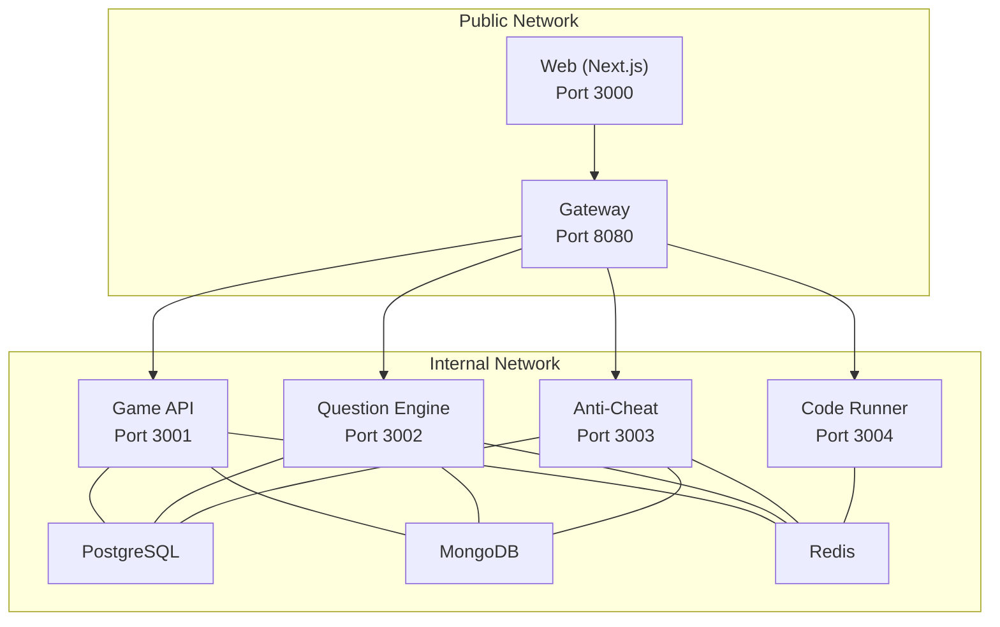
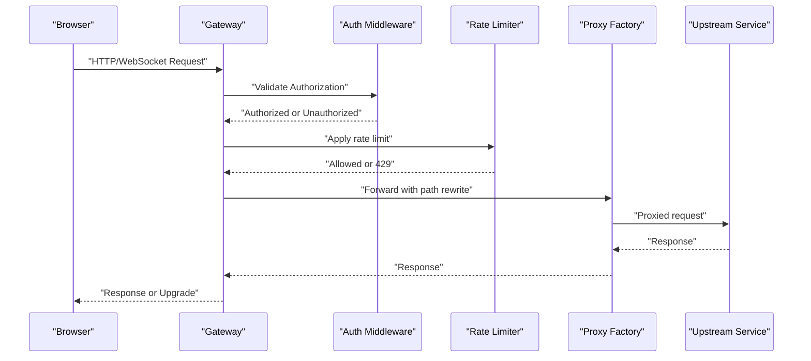
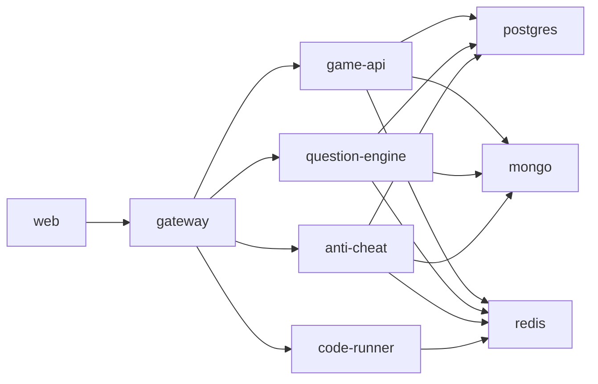

# Common Issues & Solutions

<cite>
**Referenced Files in This Document**
- [README.md](file://README.md)
- [docker-compose.yml](file://docker-compose.yml)
- [docker-compose.prod.yml](file://docker-compose.prod.yml)
- [.env.example](file://.env.example)
- [apps/web/.env.example](file://apps/web/.env.example)
- [apps/game-api/.env.example](file://apps/game-api/.env.example)
- [apps/anti-cheat/.env.example](file://apps/anti-cheat/.env.example)
- [apps/question-engine/.env.example](file://apps/question-engine/.env.example)
- [apps/web/next.config.mjs](file://apps/web/next.config.mjs)
- [apps/web/middleware.ts](file://apps/web/middleware.ts)
- [apps/gateway/src/middleware/auth.ts](file://apps/gateway/src/middleware/auth.ts)
- [apps/gateway/src/middleware/rate-limit.ts](file://apps/gateway/src/middleware/rate-limit.ts)
- [apps/gateway/src/proxy.ts](file://apps/gateway/src/proxy.ts)
- [apps/game-api/src/app.ts](file://apps/game-api/src/app.ts)
- [apps/web/package.json](file://apps/web/package.json)
- [docs/MONGO_AUTH_FIX.md](file://docs/MONGO_AUTH_FIX.md)
</cite>

## Table of Contents
1. [Introduction](#introduction)
2. [Project Structure](#project-structure)
3. [Core Components](#core-components)
4. [Architecture Overview](#architecture-overview)
5. [Detailed Component Analysis](#detailed-component-analysis)
6. [Dependency Analysis](#dependency-analysis)
7. [Performance Considerations](#performance-considerations)
8. [Troubleshooting Guide](#troubleshooting-guide)
9. [Conclusion](#conclusion)
10. [Appendices](#appendices)

## Introduction
This guide documents common issues encountered during Logic Forge development and deployment, with step-by-step solutions. It covers Docker initialization failures, port conflicts, service dependencies, database connectivity, WebSocket handshakes, environment configuration, authentication and rate limiting, API gateway problems, frontend build and runtime errors, and backend stability concerns.

## Project Structure
Logic Forge is a Turborepo-managed monorepo with multiple services behind a central API Gateway. The topology defines clear ports and networks for local and production environments.

**Diagram sources**
- [README.md](file://README.md#L8-L18)
- [docker-compose.yml](file://docker-compose.yml#L1-L238)
- [docker-compose.prod.yml](file://docker-compose.prod.yml#L1-L143)

**Section sources**
- [README.md](file://README.md#L5-L18)
- [docker-compose.yml](file://docker-compose.yml#L1-L238)
- [docker-compose.prod.yml](file://docker-compose.prod.yml#L1-L143)

## Core Components
- Web (Next.js): Frontend dashboard and game client.
- API Gateway: Single public entrypoint for all backend APIs and WebSocket upgrades.
- Game API: Core game logic and WebSocket endpoints.
- Question Engine: Question retrieval and randomization.
- Anti-Cheat: Heuristic analysis and scoring.
- Code Runner: Sandboxed code execution service.
- Databases: PostgreSQL (core data), MongoDB (auth), Redis (cache and rate limiting).

**Section sources**
- [README.md](file://README.md#L8-L18)
- [docker-compose.yml](file://docker-compose.yml#L1-L238)
- [docker-compose.prod.yml](file://docker-compose.prod.yml#L1-L143)

## Architecture Overview
The Gateway proxies HTTP and WebSocket traffic to internal services and handles JWT-based authentication and sliding-window rate limiting.

**Diagram sources**
- [apps/gateway/src/middleware/auth.ts](file://apps/gateway/src/middleware/auth.ts#L18-L64)
- [apps/gateway/src/middleware/rate-limit.ts](file://apps/gateway/src/middleware/rate-limit.ts#L15-L79)
- [apps/gateway/src/proxy.ts](file://apps/gateway/src/proxy.ts#L17-L77)

## Detailed Component Analysis

### Startup Problems: Docker Initialization, Ports, Dependencies
Common symptoms:
- Services stuck initializing or failing health checks.
- Port conflicts on 3000 or 8080.
- Missing environment variables causing runtime errors.

Solutions:
- Verify Docker Compose healthchecks and service order:
  - PostgreSQL, MongoDB, and Redis must be healthy before dependent services start.
  - Use explicit depends_on with healthcheck conditions.
- Resolve port conflicts:
  - Change host ports in compose files if 3000 or 8080 are in use.
- Ensure environment variables are present:
  - Copy .env.example to .env and fill required secrets and URLs.
  - Confirm NEXTAUTH_SECRET, REDIS_URL, and inter-service URLs are set consistently across services.

Commands:
- Start services with health checks:
  - docker compose up -d
- View logs for failing services:
  - docker compose logs <service-name>
- Rebuild after fixing configuration:
  - docker compose build --no-cache && docker compose up -d

**Section sources**
- [docker-compose.yml](file://docker-compose.yml#L77-L89)
- [docker-compose.yml](file://docker-compose.yml#L105-L117)
- [docker-compose.yml](file://docker-compose.yml#L137-L155)
- [docker-compose.yml](file://docker-compose.yml#L175-L188)
- [docker-compose.yml](file://docker-compose.yml#L218-L225)
- [docker-compose.prod.yml](file://docker-compose.prod.yml#L25-L34)
- [docker-compose.prod.yml](file://docker-compose.prod.yml#L49-L55)
- [docker-compose.prod.yml](file://docker-compose.prod.yml#L74-L87)
- [docker-compose.prod.yml](file://docker-compose.prod.yml#L106-L109)
- [docker-compose.prod.yml](file://docker-compose.prod.yml#L140-L143)
- [.env.example](file://.env.example#L1-L62)
- [apps/web/.env.example](file://apps/web/.env.example#L1-L17)
- [apps/game-api/.env.example](file://apps/game-api/.env.example#L1-L4)
- [apps/anti-cheat/.env.example](file://apps/anti-cheat/.env.example#L1-L3)
- [apps/question-engine/.env.example](file://apps/question-engine/.env.example#L1-L3)

### Database Connectivity: Timeouts, Authentication, Schema Issues
Symptoms:
- Connection timeouts to PostgreSQL or MongoDB.
- Authentication failures due to mismatched credentials or authSource.
- Schema migration errors when connecting to PostgreSQL.

Solutions:
- Validate DATABASE_URL and MONGO_URL:
  - Ensure hostnames resolve inside containers (use service names).
  - Confirm authSource for MongoDB and schema for PostgreSQL.
- Apply migrations:
  - Run service-specific migrations before starting dependent services.
- Fix MongoDB auth:
  - Follow documented guidance for auth configuration.

Commands:
- Test connectivity:
  - docker exec -it <container> psql "<DATABASE_URL>" -c "SELECT 1;"
  - docker exec -it <container> mongosh "<MONGO_URL>" --eval "db.runCommand('ping')"
- Recreate volumes if corrupted:
  - docker volume prune
  - docker compose up -d

Notes:
- MongoDB requires authSource=admin for initial admin credentials.
- PostgreSQL schema must be set to public in DATABASE_URL.

**Section sources**
- [docker-compose.yml](file://docker-compose.yml#L6-L18)
- [docker-compose.yml](file://docker-compose.yml#L20-L35)
- [docker-compose.yml](file://docker-compose.yml#L69-L76)
- [docker-compose.yml](file://docker-compose.yml#L97-L104)
- [docker-compose.yml](file://docker-compose.yml#L125-L136)
- [docker-compose.prod.yml](file://docker-compose.prod.yml#L17-L24)
- [docker-compose.prod.yml](file://docker-compose.prod.yml#L41-L48)
- [docker-compose.prod.yml](file://docker-compose.prod.yml#L62-L73)
- [docs/MONGO_AUTH_FIX.md](file://docs/MONGO_AUTH_FIX.md)

### WebSocket Connections: Handshake, Reconnection, Latency
Symptoms:
- WebSocket handshake failures.
- Frequent disconnections or slow updates.
- Incorrect WebSocket URL configuration.

Solutions:
- Configure WebSocket URL:
  - Set NEXT_PUBLIC_GAME_WS_URL to the Gateway’s public address/port.
- Verify Gateway proxy supports WebSocket:
  - Ensure ws: true is enabled in proxy factory.
- Implement client-side reconnection:
  - Use exponential backoff and handle transient network errors.
- Reduce latency:
  - Keep Gateway and Game API close in the network and avoid external latency.

Commands:
- Update environment variables for WebSocket URL:
  - NEXT_PUBLIC_GAME_WS_URL=http://localhost:8080
- Restart services after changes:
  - docker compose build && docker compose up -d

**Section sources**
- [docker-compose.yml](file://docker-compose.yml#L195-L197)
- [apps/gateway/src/proxy.ts](file://apps/gateway/src/proxy.ts#L27-L28)
- [apps/web/package.json](file://apps/web/package.json#L75-L75)

### Environment Configuration: Missing Variables, Incorrect URLs
Symptoms:
- Blank auth redirects, broken links, or runtime errors.
- Inter-service calls failing due to wrong URLs.

Solutions:
- Define required variables:
  - NEXTAUTH_URL, NEXTAUTH_SECRET, GOOGLE/GitHub OAuth IDs/secrets.
  - DATABASE_URL, MONGO_URL, REDIS_URL.
  - Inter-service URLs (GAME_API_URL, QUESTION_ENGINE_URL, etc.).
- Use consistent URLs:
  - WEB_URL should match NEXT_PUBLIC_APP_URL and NEXTAUTH_URL.
- Production overrides:
  - Use docker-compose.prod.yml to inject environment variables from the host.

Commands:
- Copy and edit environment files:
  - cp .env.example .env
  - Edit .env and app-specific .env files
- Validate environment injection:
  - docker compose run web env | grep -E "(NEXTAUTH_|DATABASE_|MONGO_|REDIS_)"

**Section sources**
- [.env.example](file://.env.example#L1-L62)
- [apps/web/.env.example](file://apps/web/.env.example#L1-L17)
- [apps/game-api/.env.example](file://apps/game-api/.env.example#L1-L4)
- [apps/anti-cheat/.env.example](file://apps/anti-cheat/.env.example#L1-L3)
- [apps/question-engine/.env.example](file://apps/question-engine/.env.example#L1-L3)
- [docker-compose.yml](file://docker-compose.yml#L163-L173)
- [docker-compose.yml](file://docker-compose.yml#L195-L217)
- [docker-compose.prod.yml](file://docker-compose.prod.yml#L96-L139)

### Authentication Failures, Rate Limiting, API Gateway Problems
Symptoms:
- 401 Unauthorized on protected routes.
- 429 Too Many Requests intermittently.
- Proxy errors or WebSocket upgrade failures.

Solutions:
- JWT validation:
  - Ensure NEXTAUTH_SECRET matches across services.
  - Accept Authorization header or session cookie fallback.
- Rate limiting:
  - Redis must be healthy; otherwise, fail-open behavior allows requests.
  - Tune limits per endpoint if needed.
- Gateway proxy:
  - Verify path prefixes and target URLs.
  - Inspect proxy error handler for Bad Gateway responses.

Commands:
- Check Redis connectivity:
  - docker compose exec redis redis-cli ping
- Force re-deploy gateway:
  - docker compose build gateway && docker compose up -d gateway

**Section sources**
- [apps/gateway/src/middleware/auth.ts](file://apps/gateway/src/middleware/auth.ts#L16-L64)
- [apps/gateway/src/middleware/rate-limit.ts](file://apps/gateway/src/middleware/rate-limit.ts#L25-L63)
- [apps/gateway/src/proxy.ts](file://apps/gateway/src/proxy.ts#L29-L37)

### Frontend Issues: Build Failures, Asset Loading, Next.js Runtime Errors
Symptoms:
- Build fails due to external packages or transpilation.
- Remote images blocked by CSP or unlisted domains.
- Runtime errors in middleware or protected routes.

Solutions:
- Transpile shared packages:
  - Ensure Next.js transpilePackages includes shared workspace packages.
- Externalize heavy dependencies on server:
  - Use externals for mongoose/mongodb in server builds.
- Allow remote images:
  - Add required remotePatterns for OAuth avatars.
- Middleware protection:
  - Redirect unauthenticated users to login with callbackUrl.

Commands:
- Build and start:
  - npm run build && npm run start
- Lint and fix:
  - npm run lint --fix

**Section sources**
- [apps/web/next.config.mjs](file://apps/web/next.config.mjs#L5-L28)
- [apps/web/middleware.ts](file://apps/web/middleware.ts#L8-L34)
- [apps/web/package.json](file://apps/web/package.json#L6-L10)

### Backend Service Stability: Memory Leaks, Timeouts, Concurrency
Symptoms:
- Out-of-memory errors or increasing memory over time.
- Request timeouts or hanging connections.
- Race conditions in concurrent access.

Solutions:
- Monitor resource usage:
  - Use container stats and logs to detect leaks.
- Tune timeouts:
  - Set appropriate HTTP and WebSocket timeouts in upstream services.
- Use connection pooling:
  - Limit concurrent database and Redis connections.
- Graceful shutdown:
  - Ensure services close connections on SIGTERM/SIGINT.

Commands:
- Inspect container metrics:
  - docker stats
- Restart unhealthy services:
  - docker compose restart <service>

**Section sources**
- [apps/game-api/src/app.ts](file://apps/game-api/src/app.ts#L14-L22)

## Dependency Analysis
Services depend on databases and each other in a defined order. The Gateway depends on all internal services being healthy.

**Diagram sources**
- [docker-compose.yml](file://docker-compose.yml#L175-L188)
- [docker-compose.yml](file://docker-compose.yml#L137-L155)
- [docker-compose.yml](file://docker-compose.yml#L77-L89)
- [docker-compose.yml](file://docker-compose.yml#L105-L117)
- [docker-compose.yml](file://docker-compose.yml#L218-L225)

**Section sources**
- [docker-compose.yml](file://docker-compose.yml#L1-L238)
- [docker-compose.prod.yml](file://docker-compose.prod.yml#L1-L143)

## Performance Considerations
- Use production builds for Gateway and Web.
- Enable healthchecks and restart policies in production compose.
- Prefer internal network communication to reduce latency.
- Tune rate limiter windows and limits based on traffic patterns.

[No sources needed since this section provides general guidance]

## Troubleshooting Guide

### Docker Initialization Failures
- Symptoms: Services stuck starting or failing health checks.
- Steps:
  - Check depends_on health conditions.
  - Review service logs for initialization errors.
  - Recreate volumes if corrupted.

**Section sources**
- [docker-compose.yml](file://docker-compose.yml#L77-L89)
- [docker-compose.yml](file://docker-compose.yml#L105-L117)
- [docker-compose.yml](file://docker-compose.yml#L137-L155)
- [docker-compose.yml](file://docker-compose.yml#L175-L188)
- [docker-compose.yml](file://docker-compose.yml#L218-L225)

### Port Conflicts
- Symptoms: Cannot start services on 3000 or 8080.
- Steps:
  - Change host port mappings in compose files.
  - Stop conflicting applications.

**Section sources**
- [docker-compose.yml](file://docker-compose.yml#L163-L164)
- [docker-compose.yml](file://docker-compose.yml#L200-L201)

### Database Connectivity
- Symptoms: Timeouts, auth failures, schema errors.
- Steps:
  - Verify DATABASE_URL and MONGO_URL.
  - Ensure authSource and schema are correct.
  - Apply migrations and restart services.

**Section sources**
- [docker-compose.yml](file://docker-compose.yml#L69-L76)
- [docker-compose.yml](file://docker-compose.yml#L97-L104)
- [docker-compose.yml](file://docker-compose.yml#L125-L136)
- [docker-compose.prod.yml](file://docker-compose.prod.yml#L17-L24)
- [docker-compose.prod.yml](file://docker-compose.prod.yml#L41-L48)
- [docker-compose.prod.yml](file://docker-compose.prod.yml#L62-L73)
- [docs/MONGO_AUTH_FIX.md](file://docs/MONGO_AUTH_FIX.md)

### WebSocket Issues
- Symptoms: Handshake failures, disconnects.
- Steps:
  - Set NEXT_PUBLIC_GAME_WS_URL to Gateway address.
  - Confirm ws: true in proxy factory.
  - Implement client reconnection logic.

**Section sources**
- [docker-compose.yml](file://docker-compose.yml#L195-L197)
- [apps/gateway/src/proxy.ts](file://apps/gateway/src/proxy.ts#L27-L28)
- [apps/web/package.json](file://apps/web/package.json#L75-L75)

### Environment Configuration
- Symptoms: Broken auth, wrong service URLs.
- Steps:
  - Fill .env and app-specific .env files.
  - Use compose prod to inject host variables.

**Section sources**
- [.env.example](file://.env.example#L1-L62)
- [apps/web/.env.example](file://apps/web/.env.example#L1-L17)
- [docker-compose.yml](file://docker-compose.yml#L163-L173)
- [docker-compose.yml](file://docker-compose.yml#L195-L217)
- [docker-compose.prod.yml](file://docker-compose.prod.yml#L96-L139)

### Authentication and Rate Limiting
- Symptoms: 401 Unauthorized, 429 Too Many Requests.
- Steps:
  - Align NEXTAUTH_SECRET across services.
  - Ensure Redis is reachable; monitor fail-open behavior.

**Section sources**
- [apps/gateway/src/middleware/auth.ts](file://apps/gateway/src/middleware/auth.ts#L16-L64)
- [apps/gateway/src/middleware/rate-limit.ts](file://apps/gateway/src/middleware/rate-limit.ts#L25-L63)

### API Gateway Problems
- Symptoms: Proxy errors, WebSocket upgrade failures.
- Steps:
  - Verify path prefixes and target URLs.
  - Check proxy error handler for Bad Gateway.

**Section sources**
- [apps/gateway/src/proxy.ts](file://apps/gateway/src/proxy.ts#L29-L37)

### Frontend Build and Runtime Errors
- Symptoms: Build failures, image CSP errors, middleware redirects.
- Steps:
  - Transpile shared packages and externalize server deps.
  - Add remotePatterns for OAuth avatars.
  - Ensure middleware redirects unauthenticated users.

**Section sources**
- [apps/web/next.config.mjs](file://apps/web/next.config.mjs#L5-L28)
- [apps/web/middleware.ts](file://apps/web/middleware.ts#L8-L34)
- [apps/web/package.json](file://apps/web/package.json#L6-L10)

### Backend Stability
- Symptoms: Memory leaks, timeouts, concurrency issues.
- Steps:
  - Monitor container stats and logs.
  - Tune timeouts and connection pools.
  - Implement graceful shutdown.

**Section sources**
- [apps/game-api/src/app.ts](file://apps/game-api/src/app.ts#L14-L22)

## Conclusion
By aligning environment variables, ensuring database and Redis availability, configuring Gateway proxies and middleware correctly, and validating frontend build settings, most Logic Forge issues can be resolved quickly. Use the provided commands and configuration references to diagnose and fix problems systematically.

[No sources needed since this section summarizes without analyzing specific files]

## Appendices

### Quick Commands Reference
- Start services: docker compose up -d
- View logs: docker compose logs <service>
- Rebuild: docker compose build --no-cache && docker compose up -d
- Ping Redis: docker compose exec redis redis-cli ping
- Test DB connectivity: docker exec -it <container> psql "<DATABASE_URL>" -c "SELECT 1;"
- Recreate volumes: docker volume prune

[No sources needed since this section lists commands without analyzing specific files]