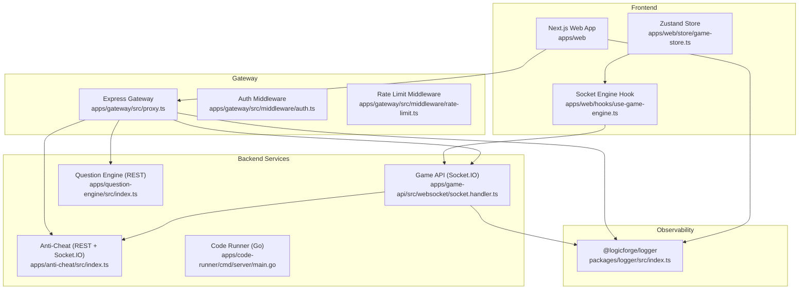
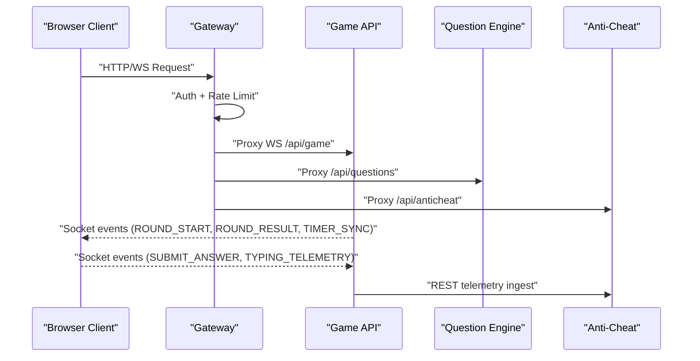
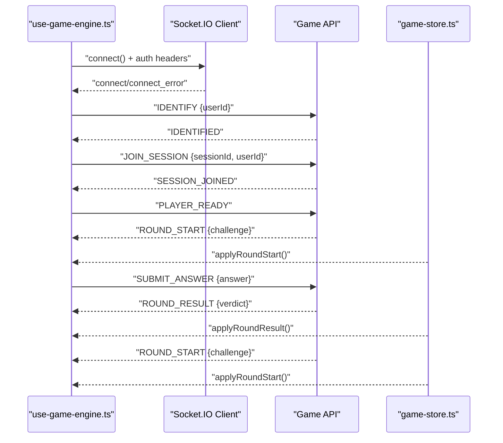
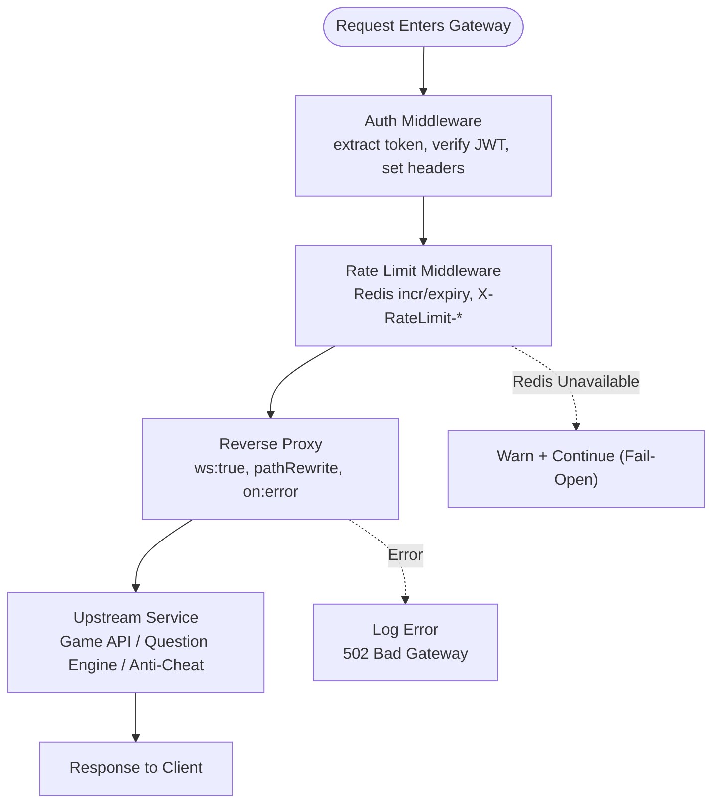
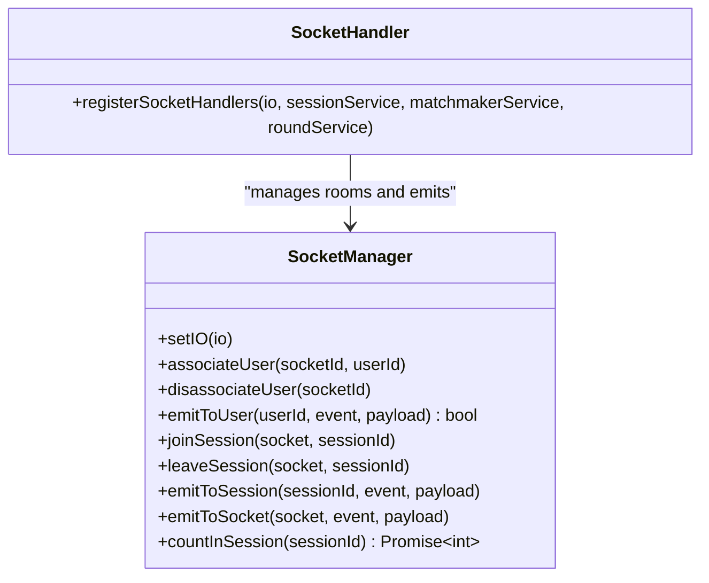
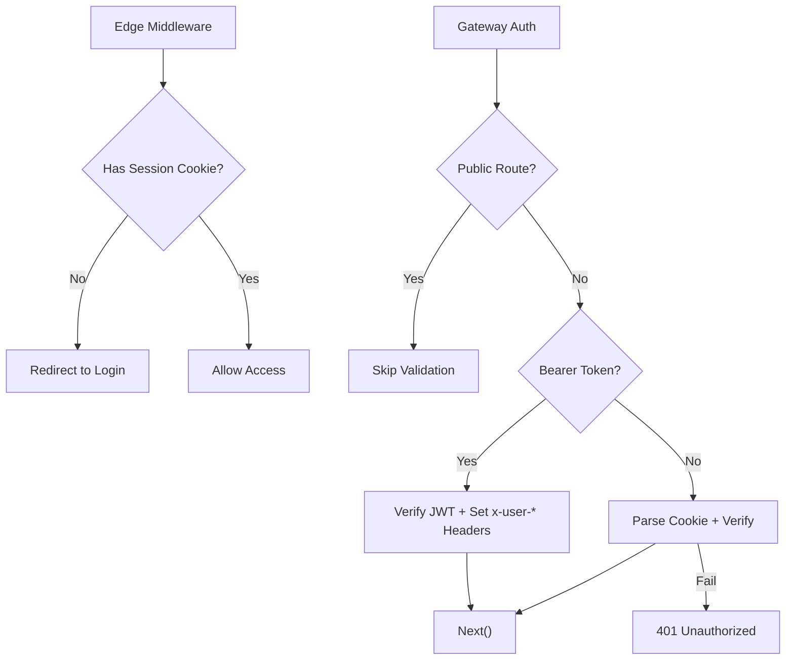
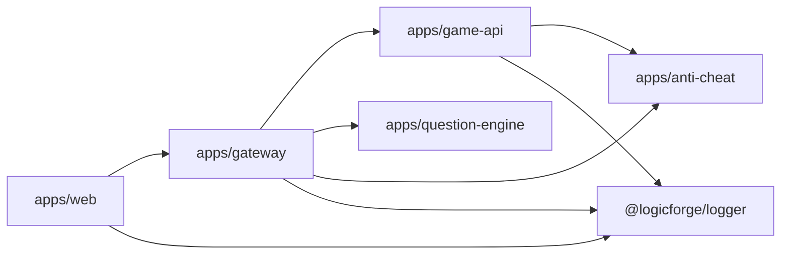

# Debugging Techniques

<cite>
**Referenced Files in This Document**
- [README.md](file://README.md)
- [DEBUGGING_GUIDE.md](file://DEBUGGING_GUIDE.md)
- [apps/web/package.json](file://apps/web/package.json)
- [apps/gateway/package.json](file://apps/gateway/package.json)
- [apps/web/middleware.ts](file://apps/web/middleware.ts)
- [apps/web/auth.config.ts](file://apps/web/auth.config.ts)
- [apps/gateway/src/middleware/auth.ts](file://apps/gateway/src/middleware/auth.ts)
- [apps/gateway/src/middleware/rate-limit.ts](file://apps/gateway/src/middleware/rate-limit.ts)
- [apps/gateway/src/proxy.ts](file://apps/gateway/src/proxy.ts)
- [packages/logger/src/index.ts](file://packages/logger/src/index.ts)
- [apps/web/hooks/use-game-engine.ts](file://apps/web/hooks/use-game-engine.ts)
- [apps/web/store/game-store.ts](file://apps/web/store/game-store.ts)
- [apps/game-api/src/websocket/socket.handler.ts](file://apps/game-api/src/websocket/socket.handler.ts)
- [apps/game-api/src/websocket/socket.manager.ts](file://apps/game-api/src/websocket/socket.manager.ts)
- [apps/anti-cheat/src/index.ts](file://apps/anti-cheat/src/index.ts)
- [apps/anti-cheat/src/handlers/telemetry.handler.ts](file://apps/anti-cheat/src/handlers/telemetry.handler.ts)
- [apps/question-engine/src/index.ts](file://apps/question-engine/src/index.ts)
</cite>

## Table of Contents
1. [Introduction](#introduction)
2. [Project Structure](#project-structure)
3. [Core Components](#core-components)
4. [Architecture Overview](#architecture-overview)
5. [Detailed Component Analysis](#detailed-component-analysis)
6. [Dependency Analysis](#dependency-analysis)
7. [Performance Considerations](#performance-considerations)
8. [Troubleshooting Guide](#troubleshooting-guide)
9. [Conclusion](#conclusion)
10. [Appendices](#appendices)

## Introduction
This document provides a comprehensive debugging guide for Logic Forge’s diverse technology stack. It covers frontend debugging with browser developer tools and React DevTools, backend service debugging with Node.js inspector and logging, WebSocket debugging for connection inspection and message tracing, Go service debugging with delve and goroutine analysis, distributed systems debugging with correlation and tracing, and practical workflows for authentication, rate limiting, API gateway failures, state management, lifecycle issues, performance, memory leaks, concurrency, mobile/responsive design, cross-browser compatibility, and accessibility.

## Project Structure
Logic Forge is a monorepo built with Turborepo and pnpm workspaces. The frontend is a Next.js application, the API gateway is an Express service, and backend services include the Game API (Socket.IO), Question Engine (REST), Anti-Cheat (REST and Socket.IO), and a Go-based Code Runner. Distributed tracing and observability are supported through structured logging and proxy error handling.

**Diagram sources**
- [README.md](file://README.md#L5-L19)
- [apps/web/package.json](file://apps/web/package.json#L1-L116)
- [apps/gateway/package.json](file://apps/gateway/package.json#L1-L33)
- [apps/web/hooks/use-game-engine.ts](file://apps/web/hooks/use-game-engine.ts#L1-L466)
- [apps/web/store/game-store.ts](file://apps/web/store/game-store.ts#L1-L394)
- [apps/gateway/src/proxy.ts](file://apps/gateway/src/proxy.ts#L1-L78)
- [apps/gateway/src/middleware/auth.ts](file://apps/gateway/src/middleware/auth.ts#L1-L65)
- [apps/gateway/src/middleware/rate-limit.ts](file://apps/gateway/src/middleware/rate-limit.ts#L1-L80)
- [apps/game-api/src/websocket/socket.handler.ts](file://apps/game-api/src/websocket/socket.handler.ts#L1-L310)
- [apps/anti-cheat/src/index.ts](file://apps/anti-cheat/src/index.ts#L1-L35)
- [apps/question-engine/src/index.ts](file://apps/question-engine/src/index.ts#L1-L46)
- [packages/logger/src/index.ts](file://packages/logger/src/index.ts#L1-L66)

**Section sources**
- [README.md](file://README.md#L5-L19)
- [apps/web/package.json](file://apps/web/package.json#L1-L116)
- [apps/gateway/package.json](file://apps/gateway/package.json#L1-L33)

## Core Components
- Frontend (Next.js): Provides the game client, real-time state via Zustand, and Socket.IO integration for matchmaking, rounds, timers, and telemetry.
- API Gateway: Centralized entrypoint with JWT auth, rate limiting, and reverse proxy to backend services.
- Game API: Socket.IO server handling session lifecycle, round progression, and anti-cheat telemetry relay.
- Question Engine: REST service for challenge retrieval with CORS and error middleware.
- Anti-Cheat: REST ingestion and Socket.IO telemetry channel for risk scoring.
- Logger: Structured logging with pino, pretty-printed in development and JSON in production.

**Section sources**
- [apps/web/hooks/use-game-engine.ts](file://apps/web/hooks/use-game-engine.ts#L1-L466)
- [apps/web/store/game-store.ts](file://apps/web/store/game-store.ts#L1-L394)
- [apps/gateway/src/proxy.ts](file://apps/gateway/src/proxy.ts#L1-L78)
- [apps/gateway/src/middleware/auth.ts](file://apps/gateway/src/middleware/auth.ts#L1-L65)
- [apps/gateway/src/middleware/rate-limit.ts](file://apps/gateway/src/middleware/rate-limit.ts#L1-L80)
- [apps/game-api/src/websocket/socket.handler.ts](file://apps/game-api/src/websocket/socket.handler.ts#L1-L310)
- [apps/anti-cheat/src/index.ts](file://apps/anti-cheat/src/index.ts#L1-L35)
- [apps/question-engine/src/index.ts](file://apps/question-engine/src/index.ts#L1-L46)
- [packages/logger/src/index.ts](file://packages/logger/src/index.ts#L1-L66)

## Architecture Overview
The system routes traffic through the gateway, which authenticates, rate-limits, and proxies to backend services. The Game API manages real-time sessions and emits events consumed by the frontend. Anti-Cheat receives telemetry via REST and Socket.IO channels.

**Diagram sources**
- [apps/gateway/src/proxy.ts](file://apps/gateway/src/proxy.ts#L1-L78)
- [apps/gateway/src/middleware/auth.ts](file://apps/gateway/src/middleware/auth.ts#L1-L65)
- [apps/gateway/src/middleware/rate-limit.ts](file://apps/gateway/src/middleware/rate-limit.ts#L1-L80)
- [apps/game-api/src/websocket/socket.handler.ts](file://apps/game-api/src/websocket/socket.handler.ts#L1-L310)
- [apps/anti-cheat/src/index.ts](file://apps/anti-cheat/src/index.ts#L1-L35)
- [apps/question-engine/src/index.ts](file://apps/question-engine/src/index.ts#L1-L46)

## Detailed Component Analysis

### Frontend Debugging (Next.js + React + Zustand + Socket.IO)
- Browser Developer Tools
  - Console: Inspect emitted and received events, store updates, and errors.
  - Network: Observe gateway requests, WebSocket upgrade, and REST calls.
  - Elements: Verify DOM rendering and component state.
  - Performance: Profile long tasks, memory, and FPS.
- React DevTools
  - Inspect component tree, props, and state.
  - Use Profiler to identify expensive renders.
  - Enable “Highlight updates” to track re-renders.
- Socket.IO Debugging
  - Confirm connection lifecycle: connect, disconnect, connect_error.
  - Verify event emission and acknowledgment for JOIN_SESSION.
  - Trace round lifecycle: ROUND_START, ROUND_RESULT, TIMER_SYNC, SESSION_END.
  - Throttled telemetry emissions and anti-cheat relay events.
- State Management (Zustand)
  - Monitor store reducers for round transitions and UI state.
  - Validate round history and duplicate guards.
- Practical Example: Same-question-on-round-4 issue
  - Compare previous vs new challenge IDs in store logs.
  - Check backend fetchChallenge excludeIds and usedChallengeIds.

**Diagram sources**
- [apps/web/hooks/use-game-engine.ts](file://apps/web/hooks/use-game-engine.ts#L1-L466)
- [apps/web/store/game-store.ts](file://apps/web/store/game-store.ts#L1-L394)
- [apps/game-api/src/websocket/socket.handler.ts](file://apps/game-api/src/websocket/socket.handler.ts#L1-L310)

**Section sources**
- [apps/web/hooks/use-game-engine.ts](file://apps/web/hooks/use-game-engine.ts#L1-L466)
- [apps/web/store/game-store.ts](file://apps/web/store/game-store.ts#L1-L394)
- [DEBUGGING_GUIDE.md](file://DEBUGGING_GUIDE.md#L132-L190)

### Backend Service Debugging (Node.js + Express + Socket.IO)
- Logging
  - Use structured logs with service name and environment.
  - Add context keys for sessionId, userId, roundNumber, and challengeId.
- Node.js Inspector
  - Run dev scripts with inspector flags to attach a debugger.
  - Set breakpoints in middleware, proxy handlers, and socket event handlers.
- Breakpoints
  - Auth middleware: token extraction, verification, and header forwarding.
  - Rate limit middleware: Redis connectivity checks and counters.
  - Proxy: error handling for HTTP and WebSocket upstream failures.
  - Socket handlers: IDENTIFY, JOIN_SESSION, PLAYER_READY, SUBMIT_ANSWER, telemetry relay.
- Example Logging Locations
  - Gateway auth: unauthorized responses and warnings.
  - Gateway rate limit: fail-open behavior and X-RateLimit headers.
  - Gateway proxy: upstream error logging and 502 responses.
  - Game API socket: connection, room joins, round start, submission handling.

**Diagram sources**
- [apps/gateway/src/middleware/auth.ts](file://apps/gateway/src/middleware/auth.ts#L1-L65)
- [apps/gateway/src/middleware/rate-limit.ts](file://apps/gateway/src/middleware/rate-limit.ts#L1-L80)
- [apps/gateway/src/proxy.ts](file://apps/gateway/src/proxy.ts#L1-L78)
- [packages/logger/src/index.ts](file://packages/logger/src/index.ts#L1-L66)

**Section sources**
- [apps/gateway/src/middleware/auth.ts](file://apps/gateway/src/middleware/auth.ts#L1-L65)
- [apps/gateway/src/middleware/rate-limit.ts](file://apps/gateway/src/middleware/rate-limit.ts#L1-L80)
- [apps/gateway/src/proxy.ts](file://apps/gateway/src/proxy.ts#L1-L78)
- [packages/logger/src/index.ts](file://packages/logger/src/index.ts#L1-L66)

### WebSocket Debugging
- Connection Inspection
  - Verify socket path and auth headers.
  - Check connection lifecycle and reconnection attempts.
- Message Tracing
  - Log emitted and received events with payloads.
  - Track round advancement and session lifecycle events.
- Real-Time Communication Analysis
  - Use Socket.IO rooms and manager helpers to validate session broadcasts.
  - Relay telemetry to anti-cheat and verify ingestion.

**Diagram sources**
- [apps/game-api/src/websocket/socket.manager.ts](file://apps/game-api/src/websocket/socket.manager.ts#L1-L56)
- [apps/game-api/src/websocket/socket.handler.ts](file://apps/game-api/src/websocket/socket.handler.ts#L1-L310)

**Section sources**
- [apps/web/hooks/use-game-engine.ts](file://apps/web/hooks/use-game-engine.ts#L1-L466)
- [apps/game-api/src/websocket/socket.handler.ts](file://apps/game-api/src/websocket/socket.handler.ts#L1-L310)
- [apps/game-api/src/websocket/socket.manager.ts](file://apps/game-api/src/websocket/socket.manager.ts#L1-L56)

### Go Service Debugging (Delve + Goroutines + Race Detection)
- Delve Debugger
  - Build the Go binary and launch with dlv debug.
  - Set breakpoints in command handlers and executors.
- Goroutine Analysis
  - Use pprof to capture goroutine stacks and visualize contention.
  - Inspect long-running goroutines in the sandbox and pipeline.
- Race Condition Detection
  - Compile with race detector enabled.
  - Run tests and services under race instrumentation to surface data races.
- Practical Tips
  - Enable structured logging in Go services for correlation with Node.js logs.
  - Use consistent requestId/service fields across logs.

[No sources needed since this section provides general guidance]

### Distributed Systems Debugging (Correlation + Tracing + Mesh Observability)
- Correlation IDs
  - Propagate a request identifier (e.g., requestId) across services.
  - Include it in logs and headers for end-to-end tracing.
- Distributed Tracing
  - Use tracing libraries to record spans for gateway, backend services, and external calls.
  - Aggregate traces in a backend (e.g., Jaeger, Tempo) for latency analysis.
- Service Mesh Observability
  - Leverage Envoy/OpenTelemetry for metrics, logs, and traces.
  - Monitor upstream failures, timeouts, and retries.

[No sources needed since this section provides general guidance]

### Authentication Issues
- Edge Middleware (Next.js)
  - Verify session cookie presence and redirect to login when protected routes are accessed without a session.
- Gateway Auth Middleware
  - Check Bearer token precedence and fallback to session cookie parsing.
  - Validate JWT secret and payload claims.
- Frontend Token Injection
  - Ensure Authorization headers are attached to socket polling requests.
- Auth Config Consistency
  - Align cookie names and options between edge middleware and NextAuth config.

**Diagram sources**
- [apps/web/middleware.ts](file://apps/web/middleware.ts#L1-L39)
- [apps/web/auth.config.ts](file://apps/web/auth.config.ts#L1-L57)
- [apps/gateway/src/middleware/auth.ts](file://apps/gateway/src/middleware/auth.ts#L1-L65)

**Section sources**
- [apps/web/middleware.ts](file://apps/web/middleware.ts#L1-L39)
- [apps/web/auth.config.ts](file://apps/web/auth.config.ts#L1-L57)
- [apps/gateway/src/middleware/auth.ts](file://apps/gateway/src/middleware/auth.ts#L1-L65)
- [apps/web/hooks/use-game-engine.ts](file://apps/web/hooks/use-game-engine.ts#L36-L77)

### Rate Limiting Problems
- Redis Availability
  - When Redis is unavailable, the gateway fails open and logs a warning.
- Header Inspection
  - Check X-RateLimit-Limit and X-RateLimit-Remaining headers.
- Error Responses
  - On exceeding limits, gateway responds with 429 and retry-after hint via TTL.
- Mitigation
  - Scale Redis, monitor connectivity, and adjust limits per endpoint.

**Section sources**
- [apps/gateway/src/middleware/rate-limit.ts](file://apps/gateway/src/middleware/rate-limit.ts#L1-L80)

### API Gateway Failures
- Proxy Error Handling
  - Logs upstream errors and returns 502 Bad Gateway when appropriate.
- Path Rewriting
  - Ensure path prefixes are stripped correctly to avoid 404s in upstream services.
- WebSocket Support
  - Enable ws: true for game-api to proxy Socket.IO.

**Section sources**
- [apps/gateway/src/proxy.ts](file://apps/gateway/src/proxy.ts#L1-L78)

### State Management Issues
- Round History Guards
  - Detect duplicate results and warn to prevent silent drops.
- Off-by-one Fixes
  - Use currentRound directly to avoid incorrect indexing in roundHistory.
- UI Synchronization
  - Ensure applyRoundStart resets per-round state and applies challenge metadata.

**Section sources**
- [apps/web/store/game-store.ts](file://apps/web/store/game-store.ts#L286-L335)

### Component Lifecycle Problems
- Re-identification
  - On userId changes, emit IDENTIFY again and log re-identification attempts.
- Ready-Up Gate
  - PLAYER_READY is the only trigger for round start; ensure both players click ready in dual mode.
- Session End Wait
  - Delay SESSION_END until all round results are applied to avoid UI inconsistencies.

**Section sources**
- [apps/web/hooks/use-game-engine.ts](file://apps/web/hooks/use-game-engine.ts#L287-L296)
- [apps/web/hooks/use-game-engine.ts](file://apps/web/hooks/use-game-engine.ts#L190-L220)

### Real-Time State Synchronization
- Timer Sync
  - Apply TIMER_SYNC to align client-side timers with server timestamps.
- Opponent Telemetry
  - Relay dual-mode telemetry to opponents and update store snapshots.
- Anti-Cheat Telemetry
  - Forward telemetry events to anti-cheat service and verify ingestion.

**Section sources**
- [apps/web/hooks/use-game-engine.ts](file://apps/web/hooks/use-game-engine.ts#L198-L236)
- [apps/game-api/src/websocket/socket.handler.ts](file://apps/game-api/src/websocket/socket.handler.ts#L204-L240)
- [apps/anti-cheat/src/handlers/telemetry.handler.ts](file://apps/anti-cheat/src/handlers/telemetry.handler.ts#L1-L82)

### Performance Issues, Memory Leaks, and Concurrency
- Frontend
  - Use React Profiler to identify heavy renders.
  - Monitor memory usage and long tasks in Performance panel.
- Backend
  - Enable pprof and CPU/memory profiles to locate hotspots.
  - Inspect goroutine dumps for deadlocks or excessive concurrency.
- Gateway
  - Monitor upstream latency and error rates; tune timeouts and retries.

[No sources needed since this section provides general guidance]

### Mobile and Responsive Design, Cross-Browser Compatibility, Accessibility
- Mobile Debugging
  - Use device emulation and touch event simulation in DevTools.
  - Test gesture handling and viewport scaling.
- Responsive Design
  - Inspect layout shifts, media queries, and element sizing across breakpoints.
- Cross-Browser Compatibility
  - Validate polyfills and feature detection for older browsers.
- Accessibility
  - Audit focus order, ARIA attributes, and keyboard navigation.
  - Use axe DevTools or Lighthouse for automated checks.

[No sources needed since this section provides general guidance]

## Dependency Analysis
The frontend depends on the gateway for all backend access and on the Game API for real-time events. The gateway depends on Redis for rate limiting and upstream services for business logic. The Game API integrates with Anti-Cheat for telemetry.

**Diagram sources**
- [apps/web/package.json](file://apps/web/package.json#L1-L116)
- [apps/gateway/package.json](file://apps/gateway/package.json#L1-L33)
- [apps/game-api/src/websocket/socket.handler.ts](file://apps/game-api/src/websocket/socket.handler.ts#L1-L310)
- [apps/anti-cheat/src/index.ts](file://apps/anti-cheat/src/index.ts#L1-L35)
- [apps/question-engine/src/index.ts](file://apps/question-engine/src/index.ts#L1-L46)
- [packages/logger/src/index.ts](file://packages/logger/src/index.ts#L1-L66)

**Section sources**
- [apps/web/package.json](file://apps/web/package.json#L1-L116)
- [apps/gateway/package.json](file://apps/gateway/package.json#L1-L33)

## Performance Considerations
- Logging overhead: Prefer info/warn in production; reserve debug for development.
- WebSocket reconnections: Tune reconnection delays to balance resilience and load.
- Rate limiter fail-open: Ensure availability at the cost of reduced protection during Redis outages.
- Frontend bundles: Split code and lazy-load components to reduce initial payload.

[No sources needed since this section provides general guidance]

## Troubleshooting Guide
- Same Question on Round 4
  - Check backend fetchChallenge excludeIds and usedChallengeIds.
  - Verify frontend applyRoundStart challengeId differs from previous.
- Missing ROUND_START
  - Confirm all players submitted and server emits ROUND_START.
- UI Not Updating
  - Validate store reducers and component subscriptions.
- Authentication Failures
  - Verify session cookie presence, JWT secret, and Authorization headers.
- Rate Limit Exceeded
  - Inspect X-RateLimit headers and retry-after hints.
- Gateway Proxies
  - Review proxy error logs and upstream service health.

**Section sources**
- [DEBUGGING_GUIDE.md](file://DEBUGGING_GUIDE.md#L257-L288)
- [apps/web/hooks/use-game-engine.ts](file://apps/web/hooks/use-game-engine.ts#L180-L220)
- [apps/web/store/game-store.ts](file://apps/web/store/game-store.ts#L263-L284)
- [apps/gateway/src/middleware/auth.ts](file://apps/gateway/src/middleware/auth.ts#L1-L65)
- [apps/gateway/src/middleware/rate-limit.ts](file://apps/gateway/src/middleware/rate-limit.ts#L1-L80)
- [apps/gateway/src/proxy.ts](file://apps/gateway/src/proxy.ts#L1-L78)

## Conclusion
This guide consolidates debugging practices across Logic Forge’s stack. By leveraging structured logging, Socket.IO tracing, middleware inspection, and state-driven workflows, teams can quickly isolate issues spanning frontend, backend, and distributed boundaries. Adopt the recommended workflows for authentication, rate limiting, gateway failures, state management, performance, and cross-cutting concerns to maintain reliability and a smooth user experience.

## Appendices
- Quick Links
  - Frontend DevTools: Console, Network, Elements, Performance.
  - React DevTools: Profiler, Highlight Updates.
  - Node.js Inspector: Attach debugger to gateway and game-api.
  - Go Delve: Debug code-runner with dlv and race detector.
  - Structured Logging: Use @logicforge/logger consistently.

[No sources needed since this section provides general guidance]