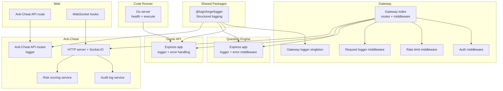
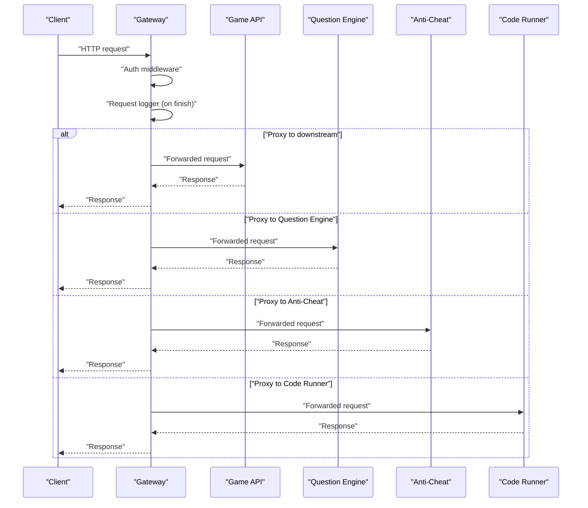
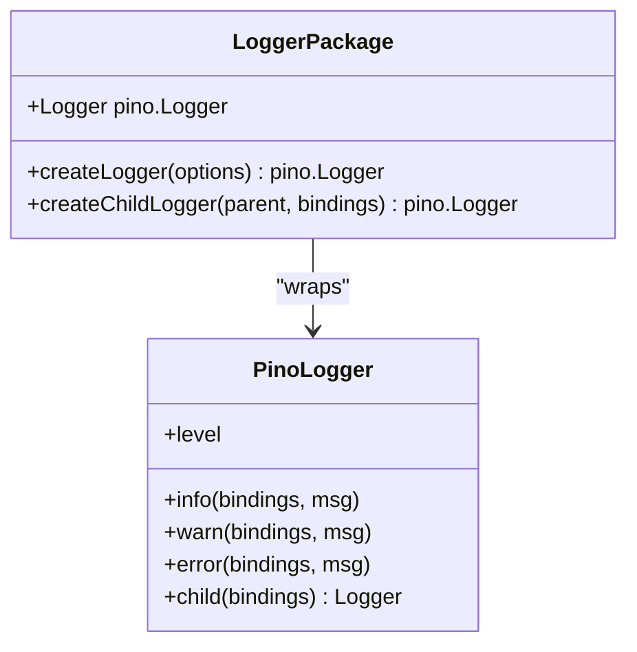
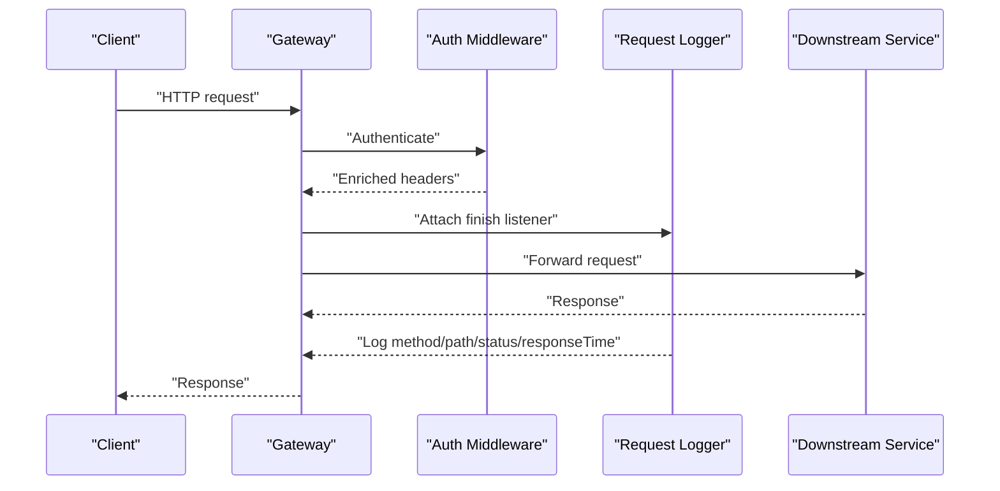
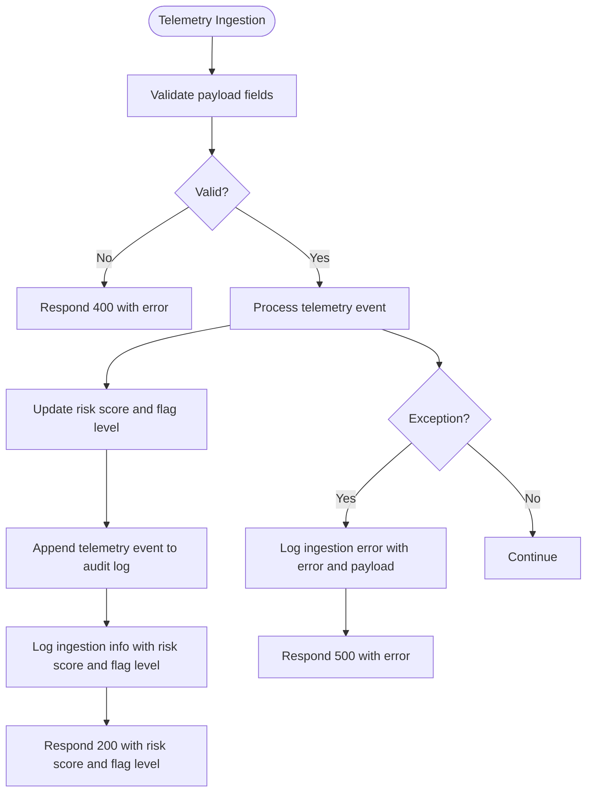
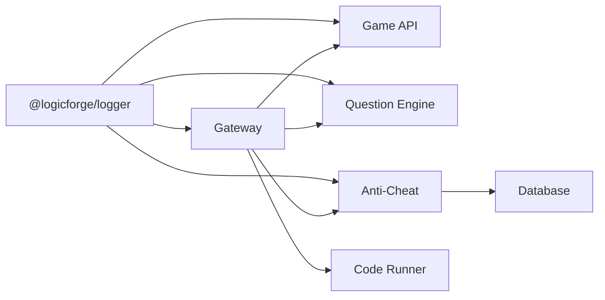

# Logging & Monitoring

<cite>
**Referenced Files in This Document**
- [packages/logger/src/index.ts](file://packages/logger/src/index.ts)
- [apps/gateway/src/logger.ts](file://apps/gateway/src/logger.ts)
- [apps/gateway/src/middleware/logger.ts](file://apps/gateway/src/middleware/logger.ts)
- [apps/gateway/src/middleware/auth.ts](file://apps/gateway/src/middleware/auth.ts)
- [apps/gateway/src/middleware/rate-limit.ts](file://apps/gateway/src/middleware/rate-limit.ts)
- [apps/gateway/src/index.ts](file://apps/gateway/src/index.ts)
- [apps/game-api/src/app.ts](file://apps/game-api/src/app.ts)
- [apps/question-engine/src/index.ts](file://apps/question-engine/src/index.ts)
- [apps/question-engine/src/middleware/error.middleware.ts](file://apps/question-engine/src/middleware/error.middleware.ts)
- [apps/anti-cheat/src/index.ts](file://apps/anti-cheat/src/index.ts)
- [apps/anti-cheat/src/api/routes.ts](file://apps/anti-cheat/src/api/routes.ts)
- [apps/anti-cheat/src/services/audit-log.service.ts](file://apps/anti-cheat/src/services/audit-log.service.ts)
- [apps/anti-cheat/src/services/risk-scoring.service.ts](file://apps/anti-cheat/src/services/risk-scoring.service.ts)
- [apps/code-runner/cmd/server/main.go](file://apps/code-runner/cmd/server/main.go)
- [apps/web/app/api/anti-cheat/[sessionId]/route.ts](file://apps/web/app/api/anti-cheat/[sessionId]/route.ts)
- [apps/web/hooks/use-game-engine.ts](file://apps/web/hooks/use-game-engine.ts)
</cite>

## Table of Contents
1. [Introduction](#introduction)
2. [Project Structure](#project-structure)
3. [Core Components](#core-components)
4. [Architecture Overview](#architecture-overview)
5. [Detailed Component Analysis](#detailed-component-analysis)
6. [Dependency Analysis](#dependency-analysis)
7. [Performance Considerations](#performance-considerations)
8. [Troubleshooting Guide](#troubleshooting-guide)
9. [Conclusion](#conclusion)
10. [Appendices](#appendices)

## Introduction
This document provides comprehensive logging and monitoring guidance for Logic Forge’s distributed system. It covers the centralized logging architecture built on a shared logger package, log levels, and structured logging patterns. It also documents service-specific logging configurations across microservices, including request/response logging, error tracking, and audit trails. Monitoring aspects include real-time metrics, health checks, and performance indicators. Log aggregation, filtering, and rotation strategies are outlined, along with alerting mechanisms for critical failures, performance degradation, and security incidents. Distributed tracing, correlation ID propagation, and request flow tracking are explained. Finally, the document includes dashboard setup guidance, custom metric creation, automated alert configuration, log analysis techniques, anomaly detection, database performance monitoring, WebSocket connection health, sandbox monitoring, and troubleshooting workflows.

## Project Structure
The logging and monitoring ecosystem spans a shared logger package and service-specific implementations:
- Centralized logger package: Provides a standardized, structured logger with environment-aware defaults and serializers.
- Gateway service: Implements request logging, authentication, and rate limiting with integrated logging.
- Game API service: Uses the shared logger and centralized error handling.
- Question Engine service: Uses the shared logger and centralized error handling middleware.
- Anti-Cheat service: Uses the shared logger, exposes health endpoints, and maintains telemetry ingestion and audit logs.
- Code Runner service: Exposes a health endpoint and standard Go runtime logging.
- Web application: Integrates with anti-cheat APIs and WebSocket connections for telemetry and session updates.

**Diagram sources**
- [packages/logger/src/index.ts](file://packages/logger/src/index.ts#L1-L65)
- [apps/gateway/src/index.ts](file://apps/gateway/src/index.ts#L40-L64)
- [apps/gateway/src/middleware/auth.ts](file://apps/gateway/src/middleware/auth.ts#L1-L65)
- [apps/gateway/src/middleware/rate-limit.ts](file://apps/gateway/src/middleware/rate-limit.ts#L1-L80)
- [apps/gateway/src/middleware/logger.ts](file://apps/gateway/src/middleware/logger.ts#L1-L25)
- [apps/gateway/src/logger.ts](file://apps/gateway/src/logger.ts#L1-L6)
- [apps/game-api/src/app.ts](file://apps/game-api/src/app.ts#L1-L63)
- [apps/question-engine/src/index.ts](file://apps/question-engine/src/index.ts#L1-L46)
- [apps/anti-cheat/src/index.ts](file://apps/anti-cheat/src/index.ts#L1-L34)
- [apps/anti-cheat/src/api/routes.ts](file://apps/anti-cheat/src/api/routes.ts#L1-L84)
- [apps/anti-cheat/src/services/audit-log.service.ts](file://apps/anti-cheat/src/services/audit-log.service.ts#L1-L19)
- [apps/anti-cheat/src/services/risk-scoring.service.ts](file://apps/anti-cheat/src/services/risk-scoring.service.ts#L1-L76)
- [apps/code-runner/cmd/server/main.go](file://apps/code-runner/cmd/server/main.go#L1-L39)
- [apps/web/app/api/anti-cheat/[sessionId]/route.ts](file://apps/web/app/api/anti-cheat/[sessionId]/route.ts#L1-L37)
- [apps/web/hooks/use-game-engine.ts](file://apps/web/hooks/use-game-engine.ts#L133-L296)

**Section sources**
- [packages/logger/src/index.ts](file://packages/logger/src/index.ts#L1-L65)
- [apps/gateway/src/index.ts](file://apps/gateway/src/index.ts#L40-L64)
- [apps/gateway/src/middleware/logger.ts](file://apps/gateway/src/middleware/logger.ts#L1-L25)
- [apps/gateway/src/middleware/auth.ts](file://apps/gateway/src/middleware/auth.ts#L1-L65)
- [apps/gateway/src/middleware/rate-limit.ts](file://apps/gateway/src/middleware/rate-limit.ts#L1-L80)
- [apps/gateway/src/logger.ts](file://apps/gateway/src/logger.ts#L1-L6)
- [apps/game-api/src/app.ts](file://apps/game-api/src/app.ts#L1-L63)
- [apps/question-engine/src/index.ts](file://apps/question-engine/src/index.ts#L1-L46)
- [apps/question-engine/src/middleware/error.middleware.ts](file://apps/question-engine/src/middleware/error.middleware.ts#L1-L48)
- [apps/anti-cheat/src/index.ts](file://apps/anti-cheat/src/index.ts#L1-L34)
- [apps/anti-cheat/src/api/routes.ts](file://apps/anti-cheat/src/api/routes.ts#L1-L84)
- [apps/anti-cheat/src/services/audit-log.service.ts](file://apps/anti-cheat/src/services/audit-log.service.ts#L1-L19)
- [apps/anti-cheat/src/services/risk-scoring.service.ts](file://apps/anti-cheat/src/services/risk-scoring.service.ts#L1-L76)
- [apps/code-runner/cmd/server/main.go](file://apps/code-runner/cmd/server/main.go#L1-L39)
- [apps/web/app/api/anti-cheat/[sessionId]/route.ts](file://apps/web/app/api/anti-cheat/[sessionId]/route.ts#L1-L37)
- [apps/web/hooks/use-game-engine.ts](file://apps/web/hooks/use-game-engine.ts#L133-L296)

## Core Components
- Centralized logger package
  - Provides a structured logger with environment-aware defaults, pretty printing in development, and JSON output in production.
  - Adds default fields (service name and environment) to every log message.
  - Serializers for errors, requests, and responses.
  - Child logger creation for request-scoped context binding.
  - Reference: [packages/logger/src/index.ts](file://packages/logger/src/index.ts#L1-L65)

- Gateway logger singleton
  - Creates a logger scoped to the gateway service.
  - Reference: [apps/gateway/src/logger.ts](file://apps/gateway/src/logger.ts#L1-L6)

- Gateway request logger middleware
  - Logs method, path, status code, response time, and user ID on request completion.
  - Reference: [apps/gateway/src/middleware/logger.ts](file://apps/gateway/src/middleware/logger.ts#L1-L25)

- Gateway auth middleware
  - Extracts and validates tokens, enriches request headers for downstream propagation, and logs warnings on verification failure.
  - Reference: [apps/gateway/src/middleware/auth.ts](file://apps/gateway/src/middleware/auth.ts#L1-L65)

- Gateway rate limit middleware
  - Implements sliding-window rate limiting via Redis with fail-open behavior and warning logs on Redis errors.
  - Reference: [apps/gateway/src/middleware/rate-limit.ts](file://apps/gateway/src/middleware/rate-limit.ts#L1-L80)

- Game API service
  - Uses the shared logger and centralized error handling for validation and generic errors.
  - Reference: [apps/game-api/src/app.ts](file://apps/game-api/src/app.ts#L1-L63)

- Question Engine service
  - Uses the shared logger and centralized error middleware.
  - Reference: [apps/question-engine/src/index.ts](file://apps/question-engine/src/index.ts#L1-L46)
  - Error middleware logs unhandled application errors.
  - Reference: [apps/question-engine/src/middleware/error.middleware.ts](file://apps/question-engine/src/middleware/error.middleware.ts#L1-L48)

- Anti-Cheat service
  - Uses the shared logger in API routes and logs telemetry ingestion outcomes.
  - Maintains append-only audit logs and risk scoring state with flagging.
  - Reference: [apps/anti-cheat/src/api/routes.ts](file://apps/anti-cheat/src/api/routes.ts#L1-L84)
  - Audit log service: [apps/anti-cheat/src/services/audit-log.service.ts](file://apps/anti-cheat/src/services/audit-log.service.ts#L1-L19)
  - Risk scoring service: [apps/anti-cheat/src/services/risk-scoring.service.ts](file://apps/anti-cheat/src/services/risk-scoring.service.ts#L1-L76)

- Code Runner service
  - Exposes a health endpoint and standard Go runtime logging.
  - Reference: [apps/code-runner/cmd/server/main.go](file://apps/code-runner/cmd/server/main.go#L1-L39)

- Web application integration
  - Anti-Cheat API route fetches risk scores and flags.
  - WebSocket hooks manage connection lifecycle and emit identification events.
  - References:
    - [apps/web/app/api/anti-cheat/[sessionId]/route.ts](file://apps/web/app/api/anti-cheat/[sessionId]/route.ts#L1-L37)
    - [apps/web/hooks/use-game-engine.ts](file://apps/web/hooks/use-game-engine.ts#L133-L296)

**Section sources**
- [packages/logger/src/index.ts](file://packages/logger/src/index.ts#L1-L65)
- [apps/gateway/src/logger.ts](file://apps/gateway/src/logger.ts#L1-L6)
- [apps/gateway/src/middleware/logger.ts](file://apps/gateway/src/middleware/logger.ts#L1-L25)
- [apps/gateway/src/middleware/auth.ts](file://apps/gateway/src/middleware/auth.ts#L1-L65)
- [apps/gateway/src/middleware/rate-limit.ts](file://apps/gateway/src/middleware/rate-limit.ts#L1-L80)
- [apps/game-api/src/app.ts](file://apps/game-api/src/app.ts#L1-L63)
- [apps/question-engine/src/index.ts](file://apps/question-engine/src/index.ts#L1-L46)
- [apps/question-engine/src/middleware/error.middleware.ts](file://apps/question-engine/src/middleware/error.middleware.ts#L1-L48)
- [apps/anti-cheat/src/api/routes.ts](file://apps/anti-cheat/src/api/routes.ts#L1-L84)
- [apps/anti-cheat/src/services/audit-log.service.ts](file://apps/anti-cheat/src/services/audit-log.service.ts#L1-L19)
- [apps/anti-cheat/src/services/risk-scoring.service.ts](file://apps/anti-cheat/src/services/risk-scoring.service.ts#L1-L76)
- [apps/code-runner/cmd/server/main.go](file://apps/code-runner/cmd/server/main.go#L1-L39)
- [apps/web/app/api/anti-cheat/[sessionId]/route.ts](file://apps/web/app/api/anti-cheat/[sessionId]/route.ts#L1-L37)
- [apps/web/hooks/use-game-engine.ts](file://apps/web/hooks/use-game-engine.ts#L133-L296)

## Architecture Overview
The logging architecture is centralized via a shared logger package consumed by all services. Services log structured events enriched with default fields and optional request-scoped context. The gateway aggregates request telemetry and enforces authentication and rate limits, while downstream services focus on domain-specific logging and error handling. Health endpoints enable monitoring and alerting. Anti-Cheat maintains audit trails and risk scoring state for compliance and security.

**Diagram sources**
- [apps/gateway/src/index.ts](file://apps/gateway/src/index.ts#L40-L64)
- [apps/gateway/src/middleware/auth.ts](file://apps/gateway/src/middleware/auth.ts#L1-L65)
- [apps/gateway/src/middleware/logger.ts](file://apps/gateway/src/middleware/logger.ts#L1-L25)
- [apps/game-api/src/app.ts](file://apps/game-api/src/app.ts#L1-L63)
- [apps/question-engine/src/index.ts](file://apps/question-engine/src/index.ts#L1-L46)
- [apps/anti-cheat/src/index.ts](file://apps/anti-cheat/src/index.ts#L1-L34)
- [apps/code-runner/cmd/server/main.go](file://apps/code-runner/cmd/server/main.go#L1-L39)

## Detailed Component Analysis

### Centralized Logger Package
- Purpose: Provide a single, structured logging interface across services.
- Features:
  - Environment-aware level selection (development vs production).
  - Pretty printing in development; JSON in production.
  - Default fields: service name and environment.
  - Standard serializers for errors, requests, and responses.
  - Child logger creation for request-scoped context.
- Implementation reference: [packages/logger/src/index.ts](file://packages/logger/src/index.ts#L1-L65)

**Diagram sources**
- [packages/logger/src/index.ts](file://packages/logger/src/index.ts#L1-L65)

**Section sources**
- [packages/logger/src/index.ts](file://packages/logger/src/index.ts#L1-L65)

### Gateway Logging Stack
- Logger singleton: [apps/gateway/src/logger.ts](file://apps/gateway/src/logger.ts#L1-L6)
- Request logger middleware: [apps/gateway/src/middleware/logger.ts](file://apps/gateway/src/middleware/logger.ts#L1-L25)
- Auth middleware: [apps/gateway/src/middleware/auth.ts](file://apps/gateway/src/middleware/auth.ts#L1-L65)
- Rate limit middleware: [apps/gateway/src/middleware/rate-limit.ts](file://apps/gateway/src/middleware/rate-limit.ts#L1-L80)
- Gateway index wiring: [apps/gateway/src/index.ts](file://apps/gateway/src/index.ts#L40-L64)

**Diagram sources**
- [apps/gateway/src/index.ts](file://apps/gateway/src/index.ts#L40-L64)
- [apps/gateway/src/middleware/auth.ts](file://apps/gateway/src/middleware/auth.ts#L1-L65)
- [apps/gateway/src/middleware/logger.ts](file://apps/gateway/src/middleware/logger.ts#L1-L25)

**Section sources**
- [apps/gateway/src/logger.ts](file://apps/gateway/src/logger.ts#L1-L6)
- [apps/gateway/src/middleware/logger.ts](file://apps/gateway/src/middleware/logger.ts#L1-L25)
- [apps/gateway/src/middleware/auth.ts](file://apps/gateway/src/middleware/auth.ts#L1-L65)
- [apps/gateway/src/middleware/rate-limit.ts](file://apps/gateway/src/middleware/rate-limit.ts#L1-L80)
- [apps/gateway/src/index.ts](file://apps/gateway/src/index.ts#L40-L64)

### Game API Logging
- Logger initialization and error handling: [apps/game-api/src/app.ts](file://apps/game-api/src/app.ts#L1-L63)
- Structured logging patterns:
  - Use the logger for info/warn/error levels.
  - Include contextual bindings (e.g., path, error object).
  - Leverage serializers for automatic request/response enrichment.

**Section sources**
- [apps/game-api/src/app.ts](file://apps/game-api/src/app.ts#L1-L63)

### Question Engine Logging
- Logger initialization and graceful shutdown: [apps/question-engine/src/index.ts](file://apps/question-engine/src/index.ts#L1-L46)
- Centralized error middleware: [apps/question-engine/src/middleware/error.middleware.ts](file://apps/question-engine/src/middleware/error.middleware.ts#L1-L48)
- Structured logging patterns:
  - Log validation errors and API errors with appropriate status codes.
  - Log unhandled application errors with error object and request path.

**Section sources**
- [apps/question-engine/src/index.ts](file://apps/question-engine/src/index.ts#L1-L46)
- [apps/question-engine/src/middleware/error.middleware.ts](file://apps/question-engine/src/middleware/error.middleware.ts#L1-L48)

### Anti-Cheat Logging and Audit
- API routes logging: [apps/anti-cheat/src/api/routes.ts](file://apps/anti-cheat/src/api/routes.ts#L1-L84)
- Audit log service (append-only): [apps/anti-cheat/src/services/audit-log.service.ts](file://apps/anti-cheat/src/services/audit-log.service.ts#L1-L19)
- Risk scoring service (with flagging): [apps/anti-cheat/src/services/risk-scoring.service.ts](file://apps/anti-cheat/src/services/risk-scoring.service.ts#L1-L76)
- Structured logging patterns:
  - Log telemetry ingestion outcomes with event type, session ID, candidate ID, risk score, and flag level.
  - Log ingestion failures with error object and payload.
  - Maintain audit trail entries for telemetry events.

**Diagram sources**
- [apps/anti-cheat/src/api/routes.ts](file://apps/anti-cheat/src/api/routes.ts#L44-L82)
- [apps/anti-cheat/src/services/audit-log.service.ts](file://apps/anti-cheat/src/services/audit-log.service.ts#L1-L19)
- [apps/anti-cheat/src/services/risk-scoring.service.ts](file://apps/anti-cheat/src/services/risk-scoring.service.ts#L18-L75)

**Section sources**
- [apps/anti-cheat/src/api/routes.ts](file://apps/anti-cheat/src/api/routes.ts#L1-L84)
- [apps/anti-cheat/src/services/audit-log.service.ts](file://apps/anti-cheat/src/services/audit-log.service.ts#L1-L19)
- [apps/anti-cheat/src/services/risk-scoring.service.ts](file://apps/anti-cheat/src/services/risk-scoring.service.ts#L1-L76)

### Code Runner Health and Logging
- Health endpoint and server startup logging: [apps/code-runner/cmd/server/main.go](file://apps/code-runner/cmd/server/main.go#L1-L39)
- Logging patterns:
  - Use standard Go log for server lifecycle messages.
  - Expose a health endpoint for monitoring systems.

**Section sources**
- [apps/code-runner/cmd/server/main.go](file://apps/code-runner/cmd/server/main.go#L1-L39)

### Web Application Integration
- Anti-Cheat API route fetching risk scores and flags: [apps/web/app/api/anti-cheat/[sessionId]/route.ts](file://apps/web/app/api/anti-cheat/[sessionId]/route.ts#L1-L37)
- WebSocket hooks managing connection lifecycle and emitting identification events: [apps/web/hooks/use-game-engine.ts](file://apps/web/hooks/use-game-engine.ts#L133-L296)

**Section sources**
- [apps/web/app/api/anti-cheat/[sessionId]/route.ts](file://apps/web/app/api/anti-cheat/[sessionId]/route.ts#L1-L37)
- [apps/web/hooks/use-game-engine.ts](file://apps/web/hooks/use-game-engine.ts#L133-L296)

## Dependency Analysis
- Logger package dependency:
  - All services import and use the shared logger package for consistent logging behavior.
- Gateway dependencies:
  - Auth middleware depends on JWT verification and header enrichment.
  - Request logger middleware depends on response finish events.
  - Rate limit middleware depends on Redis connectivity and key management.
- Downstream service dependencies:
  - Game API and Question Engine depend on the shared logger and centralized error handling.
  - Anti-Cheat depends on database access for audit logs and risk scoring.
  - Code Runner exposes a health endpoint for monitoring.

**Diagram sources**
- [packages/logger/src/index.ts](file://packages/logger/src/index.ts#L1-L65)
- [apps/gateway/src/index.ts](file://apps/gateway/src/index.ts#L40-L64)
- [apps/game-api/src/app.ts](file://apps/game-api/src/app.ts#L1-L63)
- [apps/question-engine/src/index.ts](file://apps/question-engine/src/index.ts#L1-L46)
- [apps/anti-cheat/src/index.ts](file://apps/anti-cheat/src/index.ts#L1-L34)
- [apps/code-runner/cmd/server/main.go](file://apps/code-runner/cmd/server/main.go#L1-L39)

**Section sources**
- [packages/logger/src/index.ts](file://packages/logger/src/index.ts#L1-L65)
- [apps/gateway/src/index.ts](file://apps/gateway/src/index.ts#L40-L64)
- [apps/game-api/src/app.ts](file://apps/game-api/src/app.ts#L1-L63)
- [apps/question-engine/src/index.ts](file://apps/question-engine/src/index.ts#L1-L46)
- [apps/anti-cheat/src/index.ts](file://apps/anti-cheat/src/index.ts#L1-L34)
- [apps/code-runner/cmd/server/main.go](file://apps/code-runner/cmd/server/main.go#L1-L39)

## Performance Considerations
- Logging overhead:
  - Prefer structured logging with minimal allocations; avoid expensive interpolations in hot paths.
  - Use appropriate log levels to reduce noise and cost.
- Request timing:
  - Measure response time in middleware and log it for latency analysis.
- Rate limiting:
  - Monitor Redis availability and adjust fail-open behavior to maintain system resilience.
- Health checks:
  - Ensure health endpoints are lightweight and resilient to downstream failures.

[No sources needed since this section provides general guidance]

## Troubleshooting Guide
- Unhandled errors:
  - Centralized error handlers log error objects and request paths; inspect logs for stack traces and context.
  - References:
    - [apps/game-api/src/app.ts](file://apps/game-api/src/app.ts#L34-L62)
    - [apps/question-engine/src/middleware/error.middleware.ts](file://apps/question-engine/src/middleware/error.middleware.ts#L38-L47)
- Authentication failures:
  - Verify JWT secret configuration and token presence; check warnings logged on verification failure.
  - Reference: [apps/gateway/src/middleware/auth.ts](file://apps/gateway/src/middleware/auth.ts#L61)
- Rate limit issues:
  - Inspect rate limit headers and Redis connectivity; review fail-open warnings.
  - Reference: [apps/gateway/src/middleware/rate-limit.ts](file://apps/gateway/src/middleware/rate-limit.ts#L27-L32)
- Anti-Cheat ingestion failures:
  - Review ingestion error logs with error object and payload; confirm event type validation.
  - Reference: [apps/anti-cheat/src/api/routes.ts](file://apps/anti-cheat/src/api/routes.ts#L79)
- WebSocket connection health:
  - Observe connection/disconnection events and identification status in the frontend hooks.
  - Reference: [apps/web/hooks/use-game-engine.ts](file://apps/web/hooks/use-game-engine.ts#L133-L160)

**Section sources**
- [apps/game-api/src/app.ts](file://apps/game-api/src/app.ts#L34-L62)
- [apps/question-engine/src/middleware/error.middleware.ts](file://apps/question-engine/src/middleware/error.middleware.ts#L38-L47)
- [apps/gateway/src/middleware/auth.ts](file://apps/gateway/src/middleware/auth.ts#L61)
- [apps/gateway/src/middleware/rate-limit.ts](file://apps/gateway/src/middleware/rate-limit.ts#L27-L32)
- [apps/anti-cheat/src/api/routes.ts](file://apps/anti-cheat/src/api/routes.ts#L79)
- [apps/web/hooks/use-game-engine.ts](file://apps/web/hooks/use-game-engine.ts#L133-L160)

## Conclusion
Logic Forge employs a centralized logging strategy through a shared logger package, ensuring consistent, structured logging across services. The gateway aggregates request telemetry, enforces authentication and rate limits, and forwards traffic to downstream services. Domain services implement structured logging, error handling, and audit trails. Health endpoints and WebSocket hooks support monitoring and diagnostics. By leveraging these patterns, teams can implement robust log aggregation, filtering, rotation, alerting, distributed tracing, and troubleshooting workflows.

[No sources needed since this section summarizes without analyzing specific files]

## Appendices

### Log Levels and Severity
- Use appropriate log levels to categorize severity and volume:
  - debug: verbose diagnostic information (development).
  - info: general operational insights.
  - warn: potential issues requiring attention.
  - error: errors and failures.

[No sources needed since this section provides general guidance]

### Structured Logging Patterns
- Include contextual bindings (e.g., service, environment, request ID, user ID).
- Use serializers for errors, requests, and responses to normalize payloads.
- Keep messages concise; put details in bindings.

[No sources needed since this section provides general guidance]

### Log Aggregation, Filtering, and Rotation
- Aggregation:
  - Ship structured logs to a central collector (e.g., ELK, Loki).
- Filtering:
  - Filter by service, environment, and severity.
- Rotation:
  - Configure log rotation at the collector or container level.

[No sources needed since this section provides general guidance]

### Alerting Mechanisms
- Critical failures:
  - High error rates, repeated unhandled exceptions.
- Performance degradation:
  - Increased response times, rate limit hits.
- Security incidents:
  - Authentication failures, suspicious payloads.

[No sources needed since this section provides general guidance]

### Distributed Tracing and Correlation
- Propagate correlation IDs across services via headers.
- Log request IDs alongside service names for cross-service traceability.

[No sources needed since this section provides general guidance]

### Monitoring Dashboards and Metrics
- Dashboard setup:
  - Build dashboards for service health, error rates, latency, and throughput.
- Custom metrics:
  - Expose counters and histograms for key operations (e.g., telemetry ingestion, risk scoring updates).

[No sources needed since this section provides general guidance]

### Log Analysis, Pattern Recognition, and Anomaly Detection
- Use log analytics to detect patterns (e.g., repeated validation errors).
- Apply anomaly detection on latency and error distributions.

[No sources needed since this section provides general guidance]

### Database Performance Monitoring
- Monitor query performance and connection pool utilization.
- Track audit log writes and risk scoring updates.

[No sources needed since this section provides general guidance]

### WebSocket Connection Health
- Track connection lifecycle events and identification status.
- Monitor for frequent reconnections indicating network or authentication issues.

[No sources needed since this section provides general guidance]

### Sandbox Monitoring
- Monitor code execution requests, timeouts, and resource usage.
- Log execution outcomes and errors for forensic analysis.

[No sources needed since this section provides general guidance]