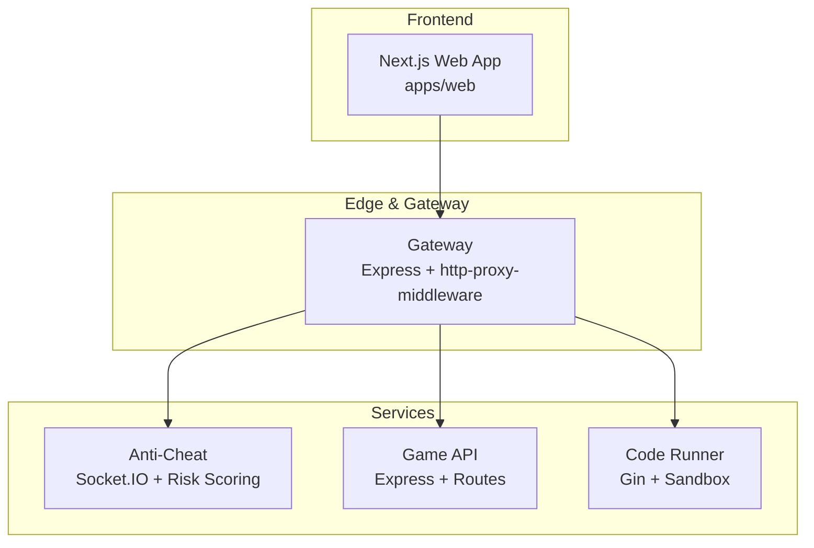
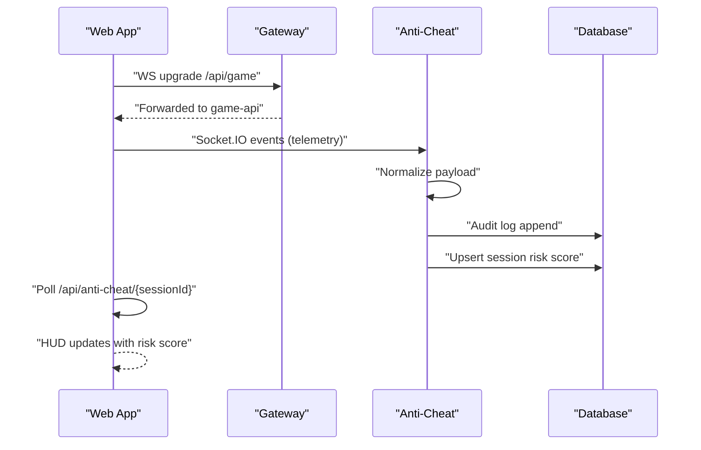
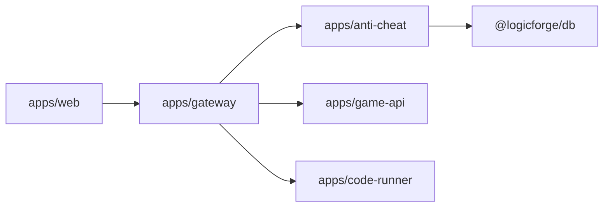
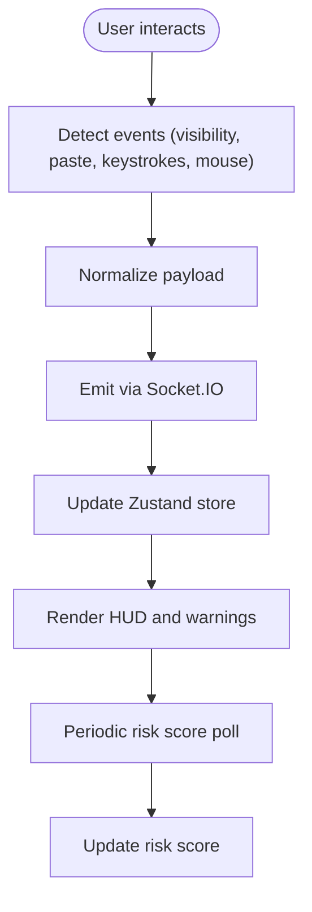
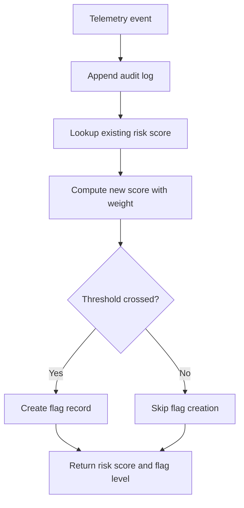

# Performance Optimization & Profiling

<cite>
**Referenced Files in This Document**
- [apps/web/next.config.mjs](file://apps/web/next.config.mjs)
- [apps/web/package.json](file://apps/web/package.json)
- [apps/web/middleware.ts](file://apps/web/middleware.ts)
- [apps/web/lib/utils.ts](file://apps/web/lib/utils.ts)
- [apps/web/hooks/use-telemetry.ts](file://apps/web/hooks/use-telemetry.ts)
- [apps/web/store/anti-cheat-store.ts](file://apps/web/store/anti-cheat-store.ts)
- [apps/web/components/game/anti-cheat-hud.tsx](file://apps/web/components/game/anti-cheat-hud.tsx)
- [apps/web/components/game/arena.tsx](file://apps/web/components/game/arena.tsx)
- [apps/web/components/game/code-editor.tsx](file://apps/web/components/game/code-editor.tsx)
- [apps/web/components/game/lobby.tsx](file://apps/web/components/game/lobby.tsx)
- [apps/anti-cheat/src/index.ts](file://apps/anti-cheat/src/index.ts)
- [apps/anti-cheat/src/handlers/telemetry.handler.ts](file://apps/anti-cheat/src/handlers/telemetry.handler.ts)
- [apps/anti-cheat/src/services/risk-scoring.service.ts](file://apps/anti-cheat/src/services/risk-scoring.service.ts)
- [apps/gateway/src/index.ts](file://apps/gateway/src/index.ts)
- [apps/gateway/src/proxy.ts](file://apps/gateway/src/proxy.ts)
- [apps/game-api/src/app.ts](file://apps/game-api/src/app.ts)
- [apps/code-runner/cmd/server/main.go](file://apps/code-runner/cmd/server/main.go)
- [apps/code-runner/sandbox/runner.go](file://apps/code-runner/sandbox/runner.go)
</cite>

## Table of Contents
1. [Introduction](#introduction)
2. [Project Structure](#project-structure)
3. [Core Components](#core-components)
4. [Architecture Overview](#architecture-overview)
5. [Detailed Component Analysis](#detailed-component-analysis)
6. [Dependency Analysis](#dependency-analysis)
7. [Performance Considerations](#performance-considerations)
8. [Troubleshooting Guide](#troubleshooting-guide)
9. [Conclusion](#conclusion)
10. [Appendices](#appendices)

## Introduction
This document provides a comprehensive performance optimization and profiling guide tailored to Logic Forge’s high-performance needs. It covers frontend optimization for Next.js, WebSocket performance for real-time telemetry, backend service optimization, sandbox execution performance, state management for large datasets, anti-cheat telemetry scaling, profiling tooling, database optimization, caching and edge strategies, and performance testing methodologies.

## Project Structure
Logic Forge is a monorepo with multiple applications:
- Frontend: Next.js application under apps/web with strict mode, standalone output, and externalized server-side dependencies.
- Gateway: Express-based reverse proxy with WebSocket passthrough and rate limiting.
- Anti-cheat: Real-time telemetry ingestion via Socket.IO and risk scoring persistence.
- Game API: Express service with CORS, Helmet, and session routes.
- Code Runner: Go-based execution service with timeouts and resource-bound commands.

**Diagram sources**
- [apps/web/next.config.mjs](file://apps/web/next.config.mjs#L1-L32)
- [apps/gateway/src/index.ts](file://apps/gateway/src/index.ts#L1-L117)
- [apps/gateway/src/proxy.ts](file://apps/gateway/src/proxy.ts#L1-L78)
- [apps/anti-cheat/src/index.ts](file://apps/anti-cheat/src/index.ts#L1-L35)
- [apps/game-api/src/app.ts](file://apps/game-api/src/app.ts#L1-L63)
- [apps/code-runner/cmd/server/main.go](file://apps/code-runner/cmd/server/main.go#L1-L39)

**Section sources**
- [apps/web/next.config.mjs](file://apps/web/next.config.mjs#L1-L32)
- [apps/gateway/src/index.ts](file://apps/gateway/src/index.ts#L1-L117)
- [apps/gateway/src/proxy.ts](file://apps/gateway/src/proxy.ts#L1-L78)
- [apps/anti-cheat/src/index.ts](file://apps/anti-cheat/src/index.ts#L1-L35)
- [apps/game-api/src/app.ts](file://apps/game-api/src/app.ts#L1-L63)
- [apps/code-runner/cmd/server/main.go](file://apps/code-runner/cmd/server/main.go#L1-L39)

## Core Components
- Next.js frontend with optimized build output and externalized server dependencies for smaller server bundles.
- Gateway with rate limiting and WebSocket passthrough to reduce latency and preserve real-time semantics.
- Anti-cheat telemetry pipeline with event normalization, audit logging, and risk scoring with capped thresholds.
- Game API with structured error handling and CORS/Helmet for security and stability.
- Code Runner with strict execution timeouts and resource-bound command execution.

**Section sources**
- [apps/web/next.config.mjs](file://apps/web/next.config.mjs#L1-L32)
- [apps/gateway/src/index.ts](file://apps/gateway/src/index.ts#L1-L117)
- [apps/anti-cheat/src/handlers/telemetry.handler.ts](file://apps/anti-cheat/src/handlers/telemetry.handler.ts#L1-L82)
- [apps/anti-cheat/src/services/risk-scoring.service.ts](file://apps/anti-cheat/src/services/risk-scoring.service.ts#L1-L76)
- [apps/game-api/src/app.ts](file://apps/game-api/src/app.ts#L1-L63)
- [apps/code-runner/cmd/server/main.go](file://apps/code-runner/cmd/server/main.go#L1-L39)

## Architecture Overview
High-level runtime flow:
- The Next.js frontend emits anti-cheat telemetry events over Socket.IO to the anti-cheat service.
- The gateway proxies WebSocket upgrades and HTTP requests to downstream services.
- Anti-cheat persists audit logs and updates risk scores per session.
- The frontend polls risk scores and renders a lightweight HUD with minimal re-renders.

**Diagram sources**
- [apps/gateway/src/index.ts](file://apps/gateway/src/index.ts#L83-L96)
- [apps/anti-cheat/src/index.ts](file://apps/anti-cheat/src/index.ts#L24-L29)
- [apps/anti-cheat/src/handlers/telemetry.handler.ts](file://apps/anti-cheat/src/handlers/telemetry.handler.ts#L30-L51)
- [apps/anti-cheat/src/services/risk-scoring.service.ts](file://apps/anti-cheat/src/services/risk-scoring.service.ts#L18-L75)
- [apps/web/components/game/anti-cheat-hud.tsx](file://apps/web/components/game/anti-cheat-hud.tsx#L37-L57)

## Detailed Component Analysis

### Frontend Performance: Next.js Optimization
- Build output: Standalone output reduces container startup overhead and simplifies deployment.
- Strict mode: Helps surface potential performance regressions early.
- Transpilation: Packages are transpiled to align with shared workspaces, ensuring consistent builds.
- Externalization: Server-side externals for heavy libraries minimize server bundle size.
- Images: Remote image patterns configured for CDNs to leverage optimized delivery.

Optimization recommendations:
- Enable App Router automatic code splitting and dynamic imports for non-critical routes.
- Lazy-load heavy components (e.g., Monaco editor) until needed.
- Use React Suspense boundaries around heavy widgets to avoid blocking the main thread.
- Prefer server components for data-heavy pages to reduce client-side hydration cost.
- Implement route-based caching and stale-while-revalidate patterns with React Query.

**Section sources**
- [apps/web/next.config.mjs](file://apps/web/next.config.mjs#L1-L32)
- [apps/web/package.json](file://apps/web/package.json#L1-L116)

### Frontend Hydration Strategies
- Middleware performs lightweight session presence checks to avoid unnecessary redirects.
- Client-side stores use Zustand with Immer for efficient immutable updates and minimal re-renders.
- HUD polling is throttled and cancellable to prevent redundant network calls.

Recommendations:
- Use progressive hydration for non-critical UI sections.
- Debounce or batch frequent state updates in telemetry hooks.
- Persist critical UI state to localStorage to reduce hydration work on reload.

**Section sources**
- [apps/web/middleware.ts](file://apps/web/middleware.ts#L1-L39)
- [apps/web/store/anti-cheat-store.ts](file://apps/web/store/anti-cheat-store.ts#L1-L108)

### WebSocket Performance Tuning
- Gateway forwards WebSocket upgrades for /api/game and supports ws passthrough.
- Anti-cheat service listens on a dedicated namespace and joins sockets to session rooms.
- Frontend telemetry hook emits normalized events and guards against disconnected sockets.

Recommendations:
- Use message batching for high-frequency events (e.g., keystrokes) and emit bursts only when thresholds are exceeded.
- Implement exponential backoff for reconnection and jitter to avoid thundering herd.
- Offload heavy analytics to background tasks; keep the WS event loop minimal.

**Section sources**
- [apps/gateway/src/index.ts](file://apps/gateway/src/index.ts#L83-L96)
- [apps/anti-cheat/src/index.ts](file://apps/anti-cheat/src/index.ts#L24-L29)
- [apps/web/hooks/use-telemetry.ts](file://apps/web/hooks/use-telemetry.ts#L1-L157)

### Backend Service Optimization
- Game API: Helmet and CORS hardening, JSON body parsing, centralized error handling.
- Gateway: Rate limiting per endpoint, robust proxy error handling, graceful shutdown signals.
- Code Runner: Gin in release mode, health endpoint, strict execution timeouts.

Recommendations:
- Add circuit breakers for upstream failures.
- Instrument latency metrics and error rates for each route.
- Use connection pooling for database clients and reuse HTTP clients in proxies.

**Section sources**
- [apps/game-api/src/app.ts](file://apps/game-api/src/app.ts#L1-L63)
- [apps/gateway/src/index.ts](file://apps/gateway/src/index.ts#L1-L117)
- [apps/code-runner/cmd/server/main.go](file://apps/code-runner/cmd/server/main.go#L1-L39)

### Database Query Optimization and Caching
- Anti-cheat risk scoring uses a single upsert per event with capped weights and threshold-based flagging.
- Risk state is queried before updates to compute deltas efficiently.

Recommendations:
- Add indexes on session identifiers and timestamps for audit logs and risk state tables.
- Use read replicas for read-heavy telemetry queries.
- Implement in-memory caches for recent risk scores keyed by session ID.

**Section sources**
- [apps/anti-cheat/src/services/risk-scoring.service.ts](file://apps/anti-cheat/src/services/risk-scoring.service.ts#L18-L75)

### Code Execution Sandbox Performance
- Command execution runs with a configurable timeout and captures combined output.
- Exit codes and timeouts are normalized for consistent reporting.

Recommendations:
- Enforce memory limits via cgroups or OS-level controls.
- Use containerd or LXC/LXD for stronger isolation and resource quotas.
- Profile execution time and output sizes; cap buffer sizes to prevent memory spikes.

**Section sources**
- [apps/code-runner/sandbox/runner.go](file://apps/code-runner/sandbox/runner.go#L1-L56)
- [apps/code-runner/cmd/server/main.go](file://apps/code-runner/cmd/server/main.go#L1-L39)

### State Management Optimization
- Anti-cheat store uses Immer for efficient immutable updates and caps warning history.
- HUD polls risk scores at a fixed interval and auto-dismisses old warnings.

Recommendations:
- Normalize and deduplicate telemetry events before pushing to the store.
- Use selective subscriptions to avoid full-state re-renders.
- Persist critical slices to IndexedDB or localStorage for fast recovery.

**Section sources**
- [apps/web/store/anti-cheat-store.ts](file://apps/web/store/anti-cheat-store.ts#L1-L108)
- [apps/web/components/game/anti-cheat-hud.tsx](file://apps/web/components/game/anti-cheat-hud.tsx#L1-L129)

### Anti-Cheat Service Performance
- Telemetry handler validates event types and normalizes payloads.
- Risk scoring applies weights and upserts risk state; flags are created only at threshold transitions.

Recommendations:
- Batch risk updates and audit logs to reduce write amplification.
- Use partitioned tables or sharded collections for telemetry and flags.
- Implement sliding windows for event counts to bound memory usage.

**Section sources**
- [apps/anti-cheat/src/handlers/telemetry.handler.ts](file://apps/anti-cheat/src/handlers/telemetry.handler.ts#L1-L82)
- [apps/anti-cheat/src/services/risk-scoring.service.ts](file://apps/anti-cheat/src/services/risk-scoring.service.ts#L1-L76)

### Profiling Tools Usage
- CPU analysis: Use Chrome DevTools Performance panel for frontend bottlenecks; enable sampling profiler for long-running tasks.
- Memory leak detection: Use Memory panel snapshots and allocation instrumentation; watch for retained objects in telemetry hooks.
- Performance bottleneck identification: Instrument gateway and service endpoints with latency histograms and error counters.

[No sources needed since this section provides general guidance]

### Database Performance Optimization
- Indexing strategies: Add compound indexes on (sessionId, timestamp) for audit logs; ensure unique indexes on session IDs for risk state.
- Query optimization: Use projections to fetch only required fields; paginate long polling responses.

[No sources needed since this section provides general guidance]

### Caching Layer Optimization and Edge Computing
- CDN configuration: Configure Next.js remotePatterns for images; leverage CDN for static assets.
- Edge computing: Place rate limiting and health checks close to users; cache risk scores at edge locations keyed by session.

[No sources needed since this section provides general guidance]

### Performance Testing Methodologies
- Load testing setup: Use k6 or Artillery to simulate concurrent users emitting telemetry and submitting answers.
- Capacity planning: Measure p95/p99 latencies for WS upgrades, anti-cheat polling intervals, and sandbox execution times.

[No sources needed since this section provides general guidance]

## Dependency Analysis

**Diagram sources**
- [apps/gateway/src/proxy.ts](file://apps/gateway/src/proxy.ts#L46-L77)
- [apps/anti-cheat/src/index.ts](file://apps/anti-cheat/src/index.ts#L1-L35)

**Section sources**
- [apps/gateway/src/proxy.ts](file://apps/gateway/src/proxy.ts#L1-L78)
- [apps/anti-cheat/src/index.ts](file://apps/anti-cheat/src/index.ts#L1-L35)

## Performance Considerations
- Minimize server bundle size by externalizing heavy dependencies and enabling standalone output.
- Reduce DOM thrash by deferring heavy computations off the main thread and using efficient state updates.
- Optimize real-time paths by batching messages and avoiding redundant writes.
- Bound resource usage in sandbox execution and enforce timeouts and memory caps.
- Instrument services with metrics and structured logs to identify hotspots.

[No sources needed since this section provides general guidance]

## Troubleshooting Guide
- Anti-cheat telemetry not appearing:
  - Verify WS connection and JOIN_TELEMETRY room join.
  - Confirm gateway WebSocket upgrade for /api/game.
- Risk score not updating:
  - Check audit log append and risk upsert logic.
  - Validate session ID propagation from frontend to backend.
- Gateway errors:
  - Inspect proxy error logs and ensure ws passthrough is enabled.
- Frontend HUD not polling:
  - Confirm session ID availability and fetch endpoint reachability.

**Section sources**
- [apps/anti-cheat/src/index.ts](file://apps/anti-cheat/src/index.ts#L24-L29)
- [apps/gateway/src/index.ts](file://apps/gateway/src/index.ts#L83-L96)
- [apps/anti-cheat/src/handlers/telemetry.handler.ts](file://apps/anti-cheat/src/handlers/telemetry.handler.ts#L30-L51)
- [apps/web/components/game/anti-cheat-hud.tsx](file://apps/web/components/game/anti-cheat-hud.tsx#L37-L57)

## Conclusion
By combining frontend optimizations, efficient WebSocket handling, robust backend instrumentation, sandbox resource controls, and scalable state management, Logic Forge can maintain high performance under real-time telemetry loads. Continuous profiling, targeted caching, and rigorous load testing will ensure reliable operation at scale.

[No sources needed since this section summarizes without analyzing specific files]

## Appendices

### Frontend Telemetry Flow

**Diagram sources**
- [apps/web/hooks/use-telemetry.ts](file://apps/web/hooks/use-telemetry.ts#L35-L54)
- [apps/web/store/anti-cheat-store.ts](file://apps/web/store/anti-cheat-store.ts#L51-L107)
- [apps/web/components/game/anti-cheat-hud.tsx](file://apps/web/components/game/anti-cheat-hud.tsx#L37-L57)

### Anti-Cheat Risk Scoring Flow

**Diagram sources**
- [apps/anti-cheat/src/handlers/telemetry.handler.ts](file://apps/anti-cheat/src/handlers/telemetry.handler.ts#L30-L51)
- [apps/anti-cheat/src/services/risk-scoring.service.ts](file://apps/anti-cheat/src/services/risk-scoring.service.ts#L18-L75)