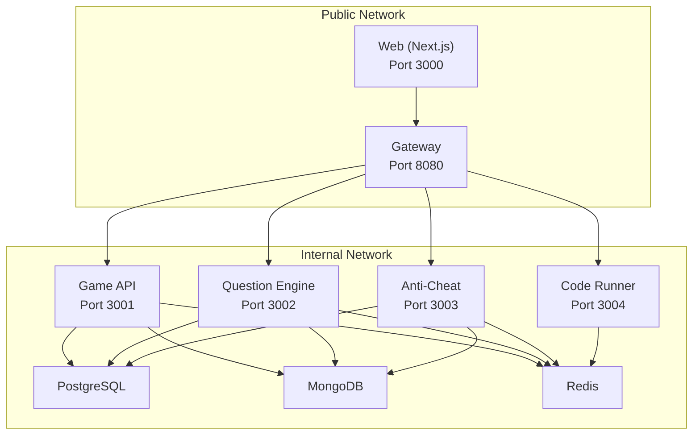
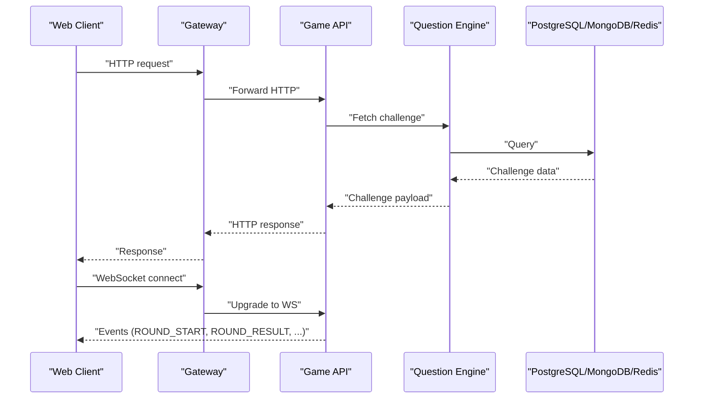
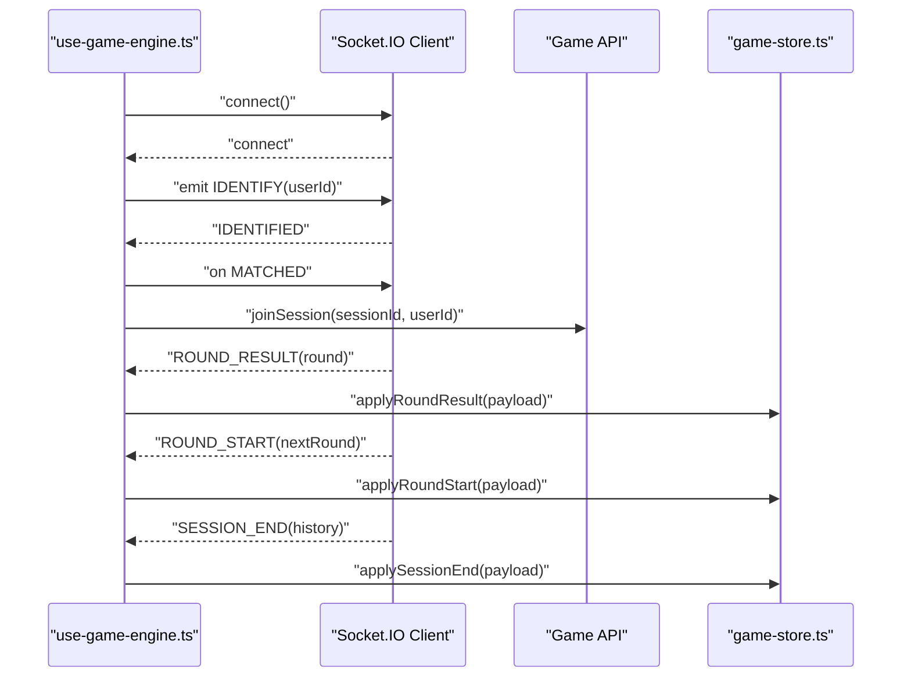
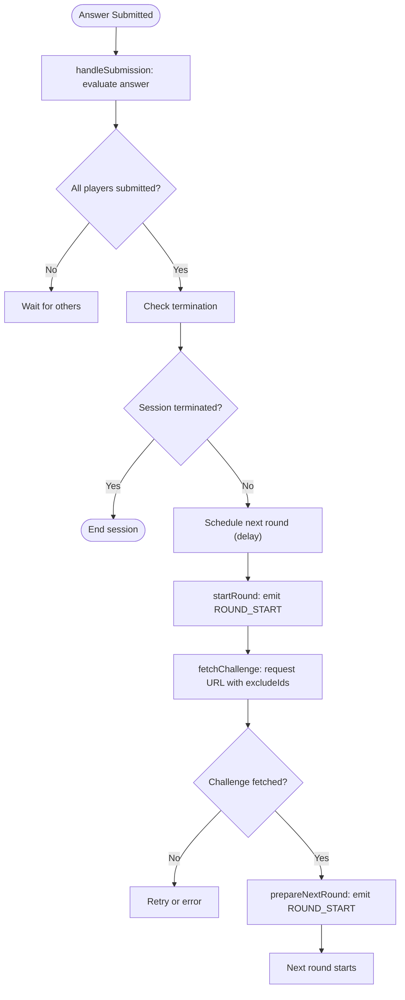
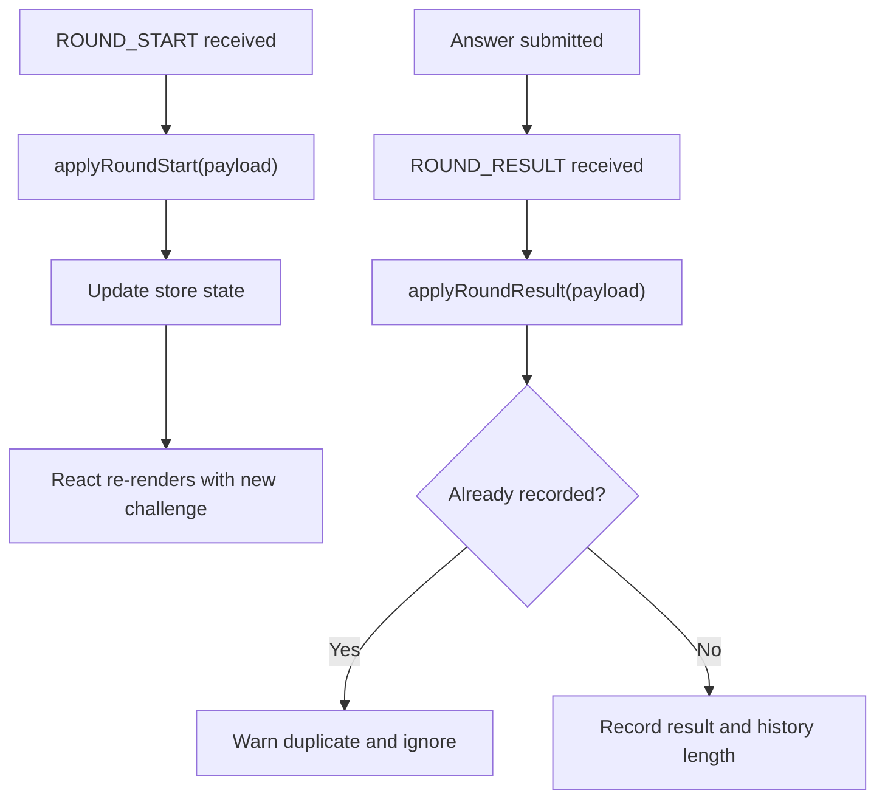
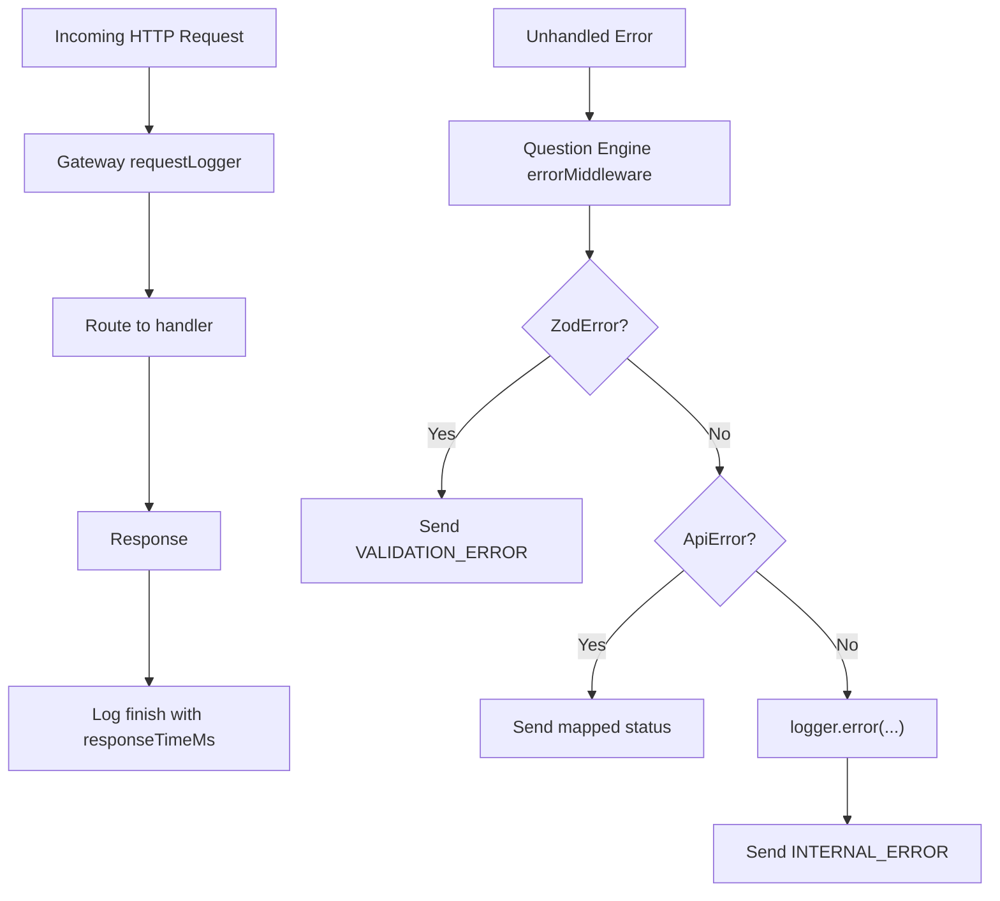
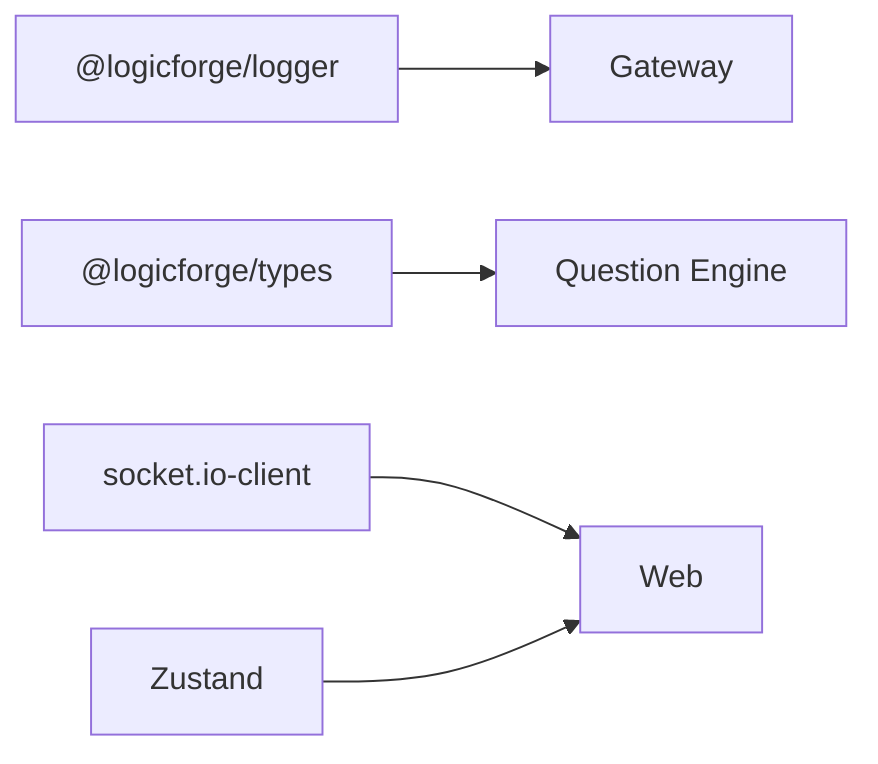

# Troubleshooting & Debugging

<cite>
**Referenced Files in This Document**
- [DEBUGGING_GUIDE.md](file://DEBUGGING_GUIDE.md)
- [README.md](file://README.md)
- [docker-compose.yml](file://docker-compose.yml)
- [docker-compose.prod.yml](file://docker-compose.prod.yml)
- [Makefile](file://Makefile)
- [apps/gateway/src/logger.ts](file://apps/gateway/src/logger.ts)
- [apps/gateway/src/middleware/logger.ts](file://apps/gateway/src/middleware/logger.ts)
- [apps/question-engine/src/middleware/error.middleware.ts](file://apps/question-engine/src/middleware/error.middleware.ts)
- [apps/web/hooks/use-game-engine.ts](file://apps/web/hooks/use-game-engine.ts)
- [apps/web/store/game-store.ts](file://apps/web/store/game-store.ts)
- [apps/game-api/src/services/round.service.ts](file://apps/game-api/src/services/round.service.ts)
- [packages/db/src/mongoose-auth.ts](file://packages/db/src/mongoose-auth.ts)
- [docs/MONGO_AUTH_FIX.md](file://docs/MONGO_AUTH_FIX.md)
- [apps/web/package.json](file://apps/web/package.json)
</cite>

## Table of Contents
1. [Introduction](#introduction)
2. [Project Structure](#project-structure)
3. [Core Components](#core-components)
4. [Architecture Overview](#architecture-overview)
5. [Detailed Component Analysis](#detailed-component-analysis)
6. [Dependency Analysis](#dependency-analysis)
7. [Performance Considerations](#performance-considerations)
8. [Troubleshooting Guide](#troubleshooting-guide)
9. [Conclusion](#conclusion)
10. [Appendices](#appendices)

## Introduction
This document provides a comprehensive troubleshooting and debugging guide for Logic Forge development and operations. It focuses on diagnosing and resolving service startup issues, database connectivity problems, and WebSocket connection failures. It also explains debugging techniques for frontend components, backend services, and real-time communication systems, details logging usage for identifying issues and performance bottlenecks, and outlines performance optimization strategies, memory leak detection, and CPU usage analysis. Finally, it covers error diagnosis procedures, stack trace interpretation, escalation paths, debugging tools setup, browser developer tools usage, server-side debugging techniques, production troubleshooting, incident response procedures, and preventive maintenance strategies.

## Project Structure
Logic Forge is a Turborepo-managed monorepo with multiple services and shared packages. The primary runtime topology includes:
- Web (Next.js) frontend on port 3000
- API Gateway on port 8080
- Game API (HTTP + WebSocket) behind the gateway
- Question Engine, Anti-Cheat, Code Runner microservices
- PostgreSQL, MongoDB, and Redis for persistence and caching

**Diagram sources**
- [README.md](file://README.md#L8-L19)
- [docker-compose.yml](file://docker-compose.yml#L1-L238)
- [docker-compose.prod.yml](file://docker-compose.prod.yml#L1-L143)

**Section sources**
- [README.md](file://README.md#L5-L19)
- [docker-compose.yml](file://docker-compose.yml#L1-L238)
- [docker-compose.prod.yml](file://docker-compose.prod.yml#L1-L143)

## Core Components
- Logging infrastructure built on pino with structured logs and child loggers for request-scoped context.
- Centralized request logging middleware in the Gateway.
- Error middleware in the Question Engine for consistent error responses.
- Frontend WebSocket engine hook with robust event logging and state synchronization.
- Game store with explicit logging for round transitions and results.
- Round service with detailed logs for round advancement and challenge fetching.

Key debugging artifacts:
- Structured logs for round lifecycle events and WebSocket messages.
- Explicit checks for duplicate results and round history completeness.
- Health checks for all services in Docker Compose.

**Section sources**
- [apps/gateway/src/logger.ts](file://apps/gateway/src/logger.ts#L1-L7)
- [apps/gateway/src/middleware/logger.ts](file://apps/gateway/src/middleware/logger.ts#L1-L25)
- [apps/question-engine/src/middleware/error.middleware.ts](file://apps/question-engine/src/middleware/error.middleware.ts#L1-L49)
- [apps/web/hooks/use-game-engine.ts](file://apps/web/hooks/use-game-engine.ts#L133-L296)
- [apps/web/store/game-store.ts](file://apps/web/store/game-store.ts#L103-L131)
- [apps/game-api/src/services/round.service.ts](file://apps/game-api/src/services/round.service.ts#L18-L82)

## Architecture Overview
The platform uses a gateway to expose HTTP and WebSocket endpoints to clients while routing traffic internally to backend services. Real-time communication is handled via Socket.IO over the Gateway. Services depend on shared databases and caches.

**Diagram sources**
- [README.md](file://README.md#L8-L19)
- [docker-compose.yml](file://docker-compose.yml#L157-L189)
- [apps/web/package.json](file://apps/web/package.json#L75-L76)

## Detailed Component Analysis

### WebSocket Communication Diagnostics
Common symptoms:
- Client does not receive ROUND_START after submitting an answer.
- UI does not update despite receiving events.
- Connection drops or reconnects frequently.

Diagnostic steps:
- Confirm connection lifecycle events: connect, disconnect, connect_error, IDENTIFIED.
- Verify IDENTIFY emission and receipt.
- Track MATCHED, SESSION_ERROR, SESSION_END, TIMER_EXPIRED, and ERROR events.
- Inspect round history completeness before applying SESSION_END.

**Diagram sources**
- [apps/web/hooks/use-game-engine.ts](file://apps/web/hooks/use-game-engine.ts#L133-L296)
- [apps/web/store/game-store.ts](file://apps/web/store/game-store.ts#L103-L131)

**Section sources**
- [apps/web/hooks/use-game-engine.ts](file://apps/web/hooks/use-game-engine.ts#L133-L296)
- [apps/web/store/game-store.ts](file://apps/web/store/game-store.ts#L103-L131)

### Backend Round Advancement and Challenge Fetching
Logs to monitor:
- prepareNextRound and startRound emit points.
- handleSubmission stages: evaluation, all-submitted check, termination, scheduling, and invoking next round.
- fetchChallenge stages: start, URL with excludeIds, success with new challengeId.
- recordResult stages: termination check and advancement.

**Diagram sources**
- [apps/game-api/src/services/round.service.ts](file://apps/game-api/src/services/round.service.ts#L18-L82)
- [apps/game-api/src/services/round.service.ts](file://apps/game-api/src/services/round.service.ts#L193-L241)

**Section sources**
- [apps/game-api/src/services/round.service.ts](file://apps/game-api/src/services/round.service.ts#L18-L82)
- [apps/game-api/src/services/round.service.ts](file://apps/game-api/src/services/round.service.ts#L193-L241)

### Frontend Store and UI Updates
Logs to verify:
- applyRoundStart and applyRoundResult in the store.
- Duplicate result warnings and recorded history length.
- Comparison of previous and new challenge IDs to detect repeated challenges.

**Diagram sources**
- [apps/web/store/game-store.ts](file://apps/web/store/game-store.ts#L103-L131)

**Section sources**
- [apps/web/store/game-store.ts](file://apps/web/store/game-store.ts#L103-L131)

### Error Handling and Logging Middleware
- Gateway request logger records method, path, status code, response time, and optional userId.
- Question Engine error middleware handles Zod validation errors, ApiError instances, and unhandled errors with structured logging and standardized responses.

**Diagram sources**
- [apps/gateway/src/middleware/logger.ts](file://apps/gateway/src/middleware/logger.ts#L1-L25)
- [apps/question-engine/src/middleware/error.middleware.ts](file://apps/question-engine/src/middleware/error.middleware.ts#L1-L49)

**Section sources**
- [apps/gateway/src/middleware/logger.ts](file://apps/gateway/src/middleware/logger.ts#L1-L25)
- [apps/question-engine/src/middleware/error.middleware.ts](file://apps/question-engine/src/middleware/error.middleware.ts#L1-L49)

## Dependency Analysis
- Shared logging package provides pino-based structured logging across services.
- Gateway depends on the logging package for centralized request logging.
- Question Engine uses a shared types package for ApiError and applies a consistent error middleware.
- Web app depends on socket.io-client for real-time communication and Zustand for state management.

**Diagram sources**
- [apps/gateway/src/logger.ts](file://apps/gateway/src/logger.ts#L1-L7)
- [apps/question-engine/src/middleware/error.middleware.ts](file://apps/question-engine/src/middleware/error.middleware.ts#L1-L49)
- [apps/web/package.json](file://apps/web/package.json#L75-L83)

**Section sources**
- [apps/gateway/src/logger.ts](file://apps/gateway/src/logger.ts#L1-L7)
- [apps/question-engine/src/middleware/error.middleware.ts](file://apps/question-engine/src/middleware/error.middleware.ts#L1-L49)
- [apps/web/package.json](file://apps/web/package.json#L75-L83)

## Performance Considerations
- Intentional delays: 3.5 seconds between rounds for result overlay display; 15 seconds auto-advance in LIVE mode if the second player does not submit; per-round timers in TIMER mode.
- Use Gateway request logging to identify slow endpoints and long-running requests.
- Monitor round advancement logs to ensure timely transitions and avoid unnecessary delays.
- Profile frontend components using React DevTools Profiler to detect excessive re-renders during round transitions.

[No sources needed since this section provides general guidance]

## Troubleshooting Guide

### Service Startup Problems
Symptoms:
- Containers fail health checks or never become healthy.
- Services crash shortly after start.

Checklist:
- Verify environment variables in .env and service-specific .env files.
- Review health checks in Docker Compose:
  - PostgreSQL, MongoDB, Redis health checks.
  - Question Engine, Anti-Cheat, Game API, Gateway health checks.
- Confirm inter-service dependencies and network connectivity.
- Use Docker Compose logs for each service to locate startup errors.

Operational commands:
- Bring up infrastructure: make docker-up
- View logs: docker-compose logs <service>
- Check service status: docker-compose ps

**Section sources**
- [docker-compose.yml](file://docker-compose.yml#L14-L49)
- [docker-compose.yml](file://docker-compose.yml#L84-L155)
- [docker-compose.prod.yml](file://docker-compose.prod.yml#L29-L87)
- [Makefile](file://Makefile#L32-L41)

### Database Connectivity Issues
Symptoms:
- Authentication failures during login or session creation.
- Connection errors when services attempt to connect to MongoDB or PostgreSQL.

Root causes and fixes:
- MongoDB authentication:
  - Ensure MONGO_URL is set correctly in the web app .env.
  - Verify MongoDB is running and reachable.
  - Use the documented MONGO_URL formats (with and without auth).
- PostgreSQL:
  - Confirm credentials and database name in DATABASE_URL.
  - Check Prisma client generation and schema push if applicable.

Verification steps:
- Test MongoDB connectivity using the provided commands.
- Confirm service logs show successful connections.

**Section sources**
- [packages/db/src/mongoose-auth.ts](file://packages/db/src/mongoose-auth.ts#L9-L35)
- [docs/MONGO_AUTH_FIX.md](file://docs/MONGO_AUTH_FIX.md#L1-L44)

### WebSocket Connection Failures
Symptoms:
- Client cannot connect to the Gateway WebSocket endpoint.
- Frequent disconnects or inability to receive session events.

Diagnosis:
- Inspect browser console for connection lifecycle events (connect, disconnect, connect_error).
- Verify IDENTIFY emission and receipt.
- Check for SESSION_ERROR and ERROR events.
- Ensure the Gateway is exposing the WebSocket endpoint and routing works.

Resolution:
- Confirm NEXT_PUBLIC_GAME_WS_URL points to the Gateway.
- Validate that the Gateway forwards WebSocket upgrades to the Game API.
- Review frontend socket handlers and cleanup logic.

**Section sources**
- [apps/web/hooks/use-game-engine.ts](file://apps/web/hooks/use-game-engine.ts#L133-L296)
- [docker-compose.yml](file://docker-compose.yml#L157-L189)
- [apps/web/package.json](file://apps/web/package.json#L75-L76)

### Round Advancement and Same Question Issue
Symptoms:
- The same question repeats unexpectedly in later rounds.
- The next question does not appear after submission.

Root cause analysis and logs:
- Backend logs for prepareNextRound, startRound, handleSubmission stages.
- Backend fetchChallenge logs: start, URL with excludeIds, success with new challengeId.
- Frontend applyRoundStart logs: compare previous and new challenge IDs.

Debugging steps:
- Verify allSubmitted flag and termination conditions.
- Confirm excludeIds parameter in the fetchChallenge URL.
- Check that usedChallengeIds array grows appropriately.
- Validate that applyRoundStart updates the store and triggers UI updates.

**Section sources**
- [DEBUGGING_GUIDE.md](file://DEBUGGING_GUIDE.md#L1-L294)
- [apps/game-api/src/services/round.service.ts](file://apps/game-api/src/services/round.service.ts#L18-L82)
- [apps/game-api/src/services/round.service.ts](file://apps/game-api/src/services/round.service.ts#L193-L241)
- [apps/web/store/game-store.ts](file://apps/web/store/game-store.ts#L103-L131)

### Logging System Usage
- Gateway request logging: inspect method, path, statusCode, responseTimeMs, and userId.
- Question Engine error logging: unhandled errors are logged with path context and responded with standardized errors.
- Frontend WebSocket and store logs: track event reception, result recording, and round transitions.

Best practices:
- Filter logs by service and request ID for correlation.
- Use structured logs to export metrics and traces.
- Enable verbose logging temporarily for problematic sessions.

**Section sources**
- [apps/gateway/src/middleware/logger.ts](file://apps/gateway/src/middleware/logger.ts#L1-L25)
- [apps/question-engine/src/middleware/error.middleware.ts](file://apps/question-engine/src/middleware/error.middleware.ts#L37-L48)
- [DEBUGGING_GUIDE.md](file://DEBUGGING_GUIDE.md#L16-L131)

### Performance Bottlenecks and Optimization
- Use Gateway request logging to identify slow endpoints and long response times.
- Monitor round advancement delays and adjust timing if necessary.
- Optimize frontend rendering during round transitions using React DevTools Profiler.
- Reduce unnecessary re-renders by stabilizing props and memoizing selectors.

**Section sources**
- [apps/gateway/src/middleware/logger.ts](file://apps/gateway/src/middleware/logger.ts#L1-L25)
- [DEBUGGING_GUIDE.md](file://DEBUGGING_GUIDE.md#L289-L294)

### Memory Leak Detection and CPU Usage Analysis
- Monitor memory and CPU usage of services using Docker stats or container monitoring tools.
- Profile frontend bundles and runtime behavior using browser devtools.
- Investigate long-lived subscriptions and event listeners in the WebSocket hook.

**Section sources**
- [apps/web/hooks/use-game-engine.ts](file://apps/web/hooks/use-game-engine.ts#L262-L285)

### Error Diagnosis, Stack Trace Interpretation, and Escalation
- Zod validation errors: return 400 with formatted details.
- ApiError instances: map to appropriate HTTP status codes.
- Unhandled errors: logged with error context and responded as 500 INTERNAL_ERROR.
- Escalation path: route to higher-level monitoring and alerting systems.

**Section sources**
- [apps/question-engine/src/middleware/error.middleware.ts](file://apps/question-engine/src/middleware/error.middleware.ts#L12-L48)

### Debugging Tools Setup and Usage
- Browser developer tools:
  - Console: inspect WebSocket logs and event sequences.
  - Network: verify WebSocket upgrade and HTTP requests.
  - Performance: analyze frame rates and render costs.
- Server-side debugging:
  - Tail logs for each service.
  - Temporarily increase log verbosity for targeted sessions.
- Local development:
  - Use make dev and make docker-up for iterative testing.

**Section sources**
- [DEBUGGING_GUIDE.md](file://DEBUGGING_GUIDE.md#L132-L190)
- [Makefile](file://Makefile#L18-L20)

### Production Troubleshooting and Incident Response
- Use health checks to detect failing services.
- Correlate logs across Gateway, Game API, and dependent services.
- Implement rollback procedures using restart policies in production compose.
- Establish on-call rotation and escalation to platform team.

**Section sources**
- [docker-compose.prod.yml](file://docker-compose.prod.yml#L29-L87)
- [docker-compose.prod.yml](file://docker-compose.prod.yml#L109-L143)

### Preventive Maintenance Strategies
- Regular schema migrations and Prisma client regeneration.
- Environment validation and fail-fast startup checks.
- Automated health checks and alert thresholds.
- Periodic review of logging volume and retention policies.

**Section sources**
- [PHASE_PLANNER.md](file://PHASE_PLANNER.md#L78-L95)

## Conclusion
This guide consolidates practical troubleshooting and debugging techniques for Logic Forge across services, databases, and real-time communication. By leveraging structured logging, health checks, and the diagnostic patterns outlined here, teams can quickly isolate issues, optimize performance, and maintain reliability in both development and production environments.

## Appendices

### Quick Reference: Common Commands
- Setup environment: make setup
- Install dependencies: make install
- Start services: make docker-up
- Stop services: make docker-down
- View logs: docker-compose logs <service>
- Database studio: make db-studio

**Section sources**
- [Makefile](file://Makefile#L4-L55)